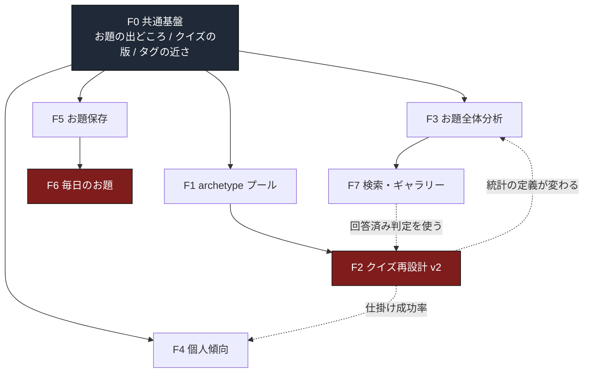

# 次期機能群の設計調査（F0〜F7）

基準コミット `117e856` ／ 調査日 2026-08-04 ／ 番号確定 2026-08-04

**この文書は調査結果であって、仕様書ではない。**
実装していない。DB を変えていない。migration を作っていない。
確定していないものは第12節に「未決定」として残してある。

読んだもの・数えたものは末尾の付録Aに全部書いた。
数値はすべて**本番DBの実データ**から取った（読み取りのみ）。

---

## 0. 番号体系（先に固定する）

**`F` は次期機能。`A` は DB の診断。別の体系であって、対応関係は無い。**

| 記号 | 意味 | 範囲 | どこで使う |
|---|---|---|---|
| **`F`** | **次期機能** | **F0〜F8** | **この文書**（F8 のみ `docs/decisions.md`） |
| `A` | **DBの診断** | A1〜A33 | `scripts/db-checks.mjs` ／ `npm run db:verify` の出力 |
| `D` | 決定 | D1〜D85 | `docs/decisions.md` |
| `P` | 公開前必須課題 | P1〜P6 | 同上（全部解決済み） |
| `R` | 技術的リスク | R1〜R17 | `docs/spec.md` §14 |
| `S` | 実装単位（Step） | S1〜S17 が既済 | `docs/spec.md` §13 |

**`F2` と診断 `A2` は、名前が似ているだけの無関係な2つ。**
診断 A2 は「1問の選択肢がちょうど4件か」を数える検査で、
機能 F2（クイズ再設計）とは何の関係もない。

この文書より前は次期機能を `A1`〜`A7` と呼んでいた。
`A` が診断で埋まっているため衝突していたので、**`F` に改めた。**

| 旧 | 新 | 内容 |
|---|---|---|
| — | **F0** | **共通基盤**（この調査で新設。以前は「共通して必要なデータ」と呼んでいた） |
| A1 | **F1** | archetype プールの新設 |
| A2 | **F2** | クイズ再設計 |
| A3 | **F3** | お題全体分析 |
| A4 | **F4** | 個人傾向 |
| A5 | **F5** | お題保存 |
| A6 | **F6** | 毎日のお題 |
| A7 | **F7** | 検索・ギャラリー |
| — | **F8** | **自作タグ（UGCタグ）と、お題の希少度**（2026-08-07 追加） |

**F8 はこの文書には無い。** 検討したのが本調査より後なので、
設計は `docs/decisions.md` の「設計課題 F8」と D93〜D101 にある。
F8 が要求するものの多くは **F0 の #2（タグの近さ）・#3（クイズの版）・#1（お題の出どころ）**
と **F3** に既に含まれており、F8 固有の追加は `tags.scope` と招待リンクだけ。

なお F8 の検討中に、**F6（毎日のお題）の未解決点**が1つ見つかった。
第12節・論点4 は「誤答を揃えるか」しか論じていないが、
共通のお題を配ると**参加者全員が正解を知っている**状態になる。
D93 に記録した。

**`docs/decisions.md` の「設計課題 A1. 類型プール（archetype）の新設」は F1 と同じもの。**
あちらの見出しはまだ `A1` のままにしてある（この文書では変更していない）。
`docs/decisions.md` を次に触るときに `F1` へ直すのが望ましいが、
同ファイル内に `A1` の相互参照があるため、**直すかどうかは別途判断する**。

---

## 1. 現行構造の事実

### 1-1. 表とデータ量（実測）

| 表 | 行数 | 何を持っているか |
|---|---:|---|
| `tag_pools` | 8 | プール。うち**タグが入っているのは4つだけ** |
| `tags` | 156 | `pool_key` `label` `weight` `is_active` |
| `card_slots` | 10 | 枠。`pool_key` `quiz_priority` `is_quiz_eligible` |
| `draft_modes` | 2 | easy / standard |
| `draft_mode_slots` | 8 | モード→枠（easy 3・standard 5） |
| `draft_sessions` | 500 | 引く行為そのもの。`reroll_count` `status` |
| `draft_candidates` | **8,802** | **配った候補すべて**。`is_chosen` `revealed_at` `generation` |
| `prompts` | 516 | 確定したお題。`created_by` は **NULL 可** |
| `prompt_cards` | 1,990 | お題の答え（枠×タグ） |
| `quiz_questions` | 1,548 | 出題する枠 |
| `quiz_choices` | 6,192 | 4択。`is_correct` |
| `works` | 444 | 作品。`prompt_id` に **UNIQUE** |
| `answers` | 363 | 回答1件 |
| `answer_items` | **1,089** | **1問ごとの選択**。`selected_tag_id` `is_correct` |
| `work_slot_stats` | 453 | 作品×枠の `attempts` / `corrects` |
| `user_slot_stats` | 540 | 人×枠の `attempts` / `corrects` |
| `user_stats` | 180 | 人の合計 |

プールの中身:

```
motif 102件 / species 24件 / color 15件 / genre 15件
role・era・gender・constraint … プールはあるが 0件
```

枠は10個あるが、モードが使うのは5個だけ。
`role` `era_env` `gender_expr` `constraint` は**定義済みで未使用**。

### 1-2. カードを引く仕組み（ここが後の判断を大きく変える）

`reveal_card` を読んだ結果、**「めくる」と「選ぶ」は同じ操作**だった。

```
裏向きのカードが3枚（または5枚）並ぶ
　↓
位置だけを見て1枚を指す
　↓ reveal_card
revealed_at と is_chosen を同時に立てる
```

実データがこれを裏づけている。

```
配った候補     8,802
めくられた      2,094
選ばれた        2,094   ← 完全に一致
```

**選ばれなかった 6,708 枚は、利用者に一度も見られていない。**
裏のまま捨てられている。中身が本人に見えるのは、
作品を投稿したあと（`prompts.candidates_revealed_at`／444件が開示済み）。

これは F3 の中心に直接効く。第11節で扱う。

### 1-3. 引き直し

`max_rerolls = 1`。実データでは 500 セッション中 **30 件**が引き直している。
捨てられた世代で既に選ばれていたカードが **150 枚**（1セッション5枚）。

つまり引き直しは「**全部決めたあとに、この組み合わせが気に入らない**」
という操作として実際に使われている。

**これは現行で唯一の、能動的な「好みでない」信号。**

### 1-4. クイズの作られかた

`complete_draft` の中で**お題確定時に1度だけ**生成し、保存する。
表示のたびに作り直さない。

- 出題枠 … `card_slots.quiz_priority` の昇順に `quiz_question_count` 個
- 誤答 … **同じプールから**、そのお題で正解に使われた全タグを除いて抽選
- 4択固定（D15）。並び順も保存時に1度だけ混ぜる
- 生成直後に検算する（4択か・正解1つか・お題全体でタグが重複しないか）

**誤答は「同じプール」であって「同じ抽象度」ではない。**
F2 が求めている近縁誤答は、この一点だけが足りない。

### 1-5. すでに正解が漏れない形になっている

読み取り経路を全部見た結果:

| RPC | タグ名を返すか |
|---|---|
| `get_public_works`（一覧） | **返さない** |
| `get_rankings` | **返さない** |
| `get_work_detail`（作品ページ） | **返さない**（枠別の attempts/corrects だけ） |
| `get_work_quiz`（出題） | 選択肢は返すが `is_correct` を持たない |
| `get_my_answer` | 返す（**回答した本人だけ**） |
| `get_saved_works` | 回答済みのときだけ `prompt_answer` を返す（D61） |

**いまサムネイル一覧は、タグ名を1つも運んでいない。**
F7 の設計はこの事実を土台にできる（第12節・論点3）。

### 1-6. 制約として効いてくる既存の形

| 既存の形 | 何を縛るか |
|---|---|
| `works.prompt_id` に **UNIQUE** | **1つのお題から作れる作品は1件だけ**。F6 の直撃点 |
| `prompts.created_by` が NULL 可 | 運営が作ったお題を置ける |
| `works.prompt_id` の FK が **RESTRICT** | お題は作品より先に消せない |
| `answers` に `UNIQUE(work_id, user_id)` | 1作品1回。やり直し不可 |
| `answer_items` に `card_slot_key` を写している | 枠単位の集計が join なしで引ける |
| `*_slot_stats` が **枠単位** | 伝達率は最初から枠ごとに分かれている |

---

## 2. F0〜F7 の目的

| 課題 | 何を解こうとしているか | 既存で何が足りないか |
|---|---|---|
| **F0** 共通基盤 | 後続すべてが要る「意味づけの列」を先に置く | 列3本（第3節2） |
| **F1** archetype プール | 広いジャンルと類型を同じ問に並べない | プールと枠とタグ（`decisions.md` A1 に記載済み） |
| **F2** クイズ再設計 | 出題をカード形式にし、誤答を近縁にし、作者の仕掛けを測る | 近縁の定義・仕掛けの置き場・v1/v2 の共存 |
| **F3** お題全体分析 | タグとお題の全体傾向を見せる | **ほぼ足りている**（第3節） |
| **F4** 個人傾向 | 人ごとの偏りと弱点を見せる | **ほぼ足りている**（第3節） |
| **F5** お題保存 | 気に入った構成を残し、再挑戦する | 保存の表と、保存からお題を作る道 |
| **F6** 毎日のお題 | 全員が同じ条件で描き、解釈を比べる | `works.prompt_id` の UNIQUE と衝突する |
| **F7** 検索・ギャラリー | タグで探せるようにしつつ、正解を漏らさない | 「見た」ことの扱い（第12節・論点2〜3） |

---

## 3. 共通して必要なデータ（F0 の中身）

### 3-1. すでに全部そろっているもの

**F3 と F4 は、新しい表を1つも作らずに出せる。**

| 求められている数値 | どこから出るか |
|---|---|
| 提示回数 | `draft_candidates` の行数（`tag_id` 別） |
| 選択回数 | 同上 `is_chosen = true`（**意味に注意。第11節**） |
| 選ばれなかった回数 | 同上 `is_chosen = false`（**同上**） |
| 作品化率 | `prompts.status='submitted'` ÷ `prompts` |
| 回答率 | `works.answers_count` |
| 正答率・誤答率 | `answer_items.is_correct` |
| **何を何と間違えたか** | `answer_items.selected_tag_id` × `prompt_cards.tag_id` |
| 枠ごとの伝わりやすさ | `work_slot_stats` / `user_slot_stats` |
| カテゴリ別 | `tags.pool_key` |
| 組み合わせ別 | `prompt_cards` を `prompt_id` で束ねる |
| 急上昇 | `created_at` で期間を切る |

実際に本番データで動かして確かめた（付録B）。たとえば
「何を何と間違えやすいか」は、いまこの瞬間に次が出る。

```
赤 → 橙 が 9件 ／ 緑 → 黄緑 が 8件 ／ 金 → 赤 が 8件
三日月 → 蓄音機 が 5件 ／ 風船 → 観覧車 が 5件
```

色の取り違えが上位に並ぶ。**この形が既に取れている**ことが重要で、
F4 の「何を何と間違えやすいか」に新しい記録は要らない。

### 3-2. F0 ＝ 本当に足りないもの（3つだけ）

| # | 足りないもの | なぜ既存で出ないか | 効く課題 |
|---|---|---|---|
| 1 | **お題の出どころ** | ランダム抽選・保存構成・毎日のお題を区別できない | F3 F5 F6 |
| 2 | **タグの近さ** | プールより細かい分類が無い | F1 F2 **F8** |
| 3 | **クイズの版** | v1 と v2 を混ぜずに数える手段が無い | F2 **F8** |

**この3つは、どれも「列1本」で足りる。**新しい表は要らない。

> **2026-08-07 訂正：#2 だけは列1本では足りない。2本要る。**
> 近さは二値ではなく距離で、**近すぎても遠すぎても成立しない。**
> `猫 / ネコ` は並べてはいけない（正解が2つになる）が、
> `猫 / 犬` は並べるべき（良い誤答）。
> **同義グループ**（除外に使う）と**カテゴリ**（誤答を引く元にする）を
> 別々に持つ。詳細は `docs/decisions.md` の D96 / D102。
そして**あとから足すのがいちばん高い**。既存の 516 件のお題に
「これはランダムだった」と遡って意味づける作業になるため。

**これをまとめて F0 と呼ぶ。**個々の機能ではないが、
どの機能の前にも必要なので、独立した単位として扱う。

### 3-3. 汎用イベントログは要らない

**導入しないことを推奨する。**

理由は「重いから」ではなく、**すでに全部記録されているから**。

このアプリの主要な行為は、すべて**書き込みを伴う**。

```
お題を引く    → draft_sessions + draft_candidates（8,802行）
カードを選ぶ  → draft_candidates.is_chosen
引き直す      → generation が増える
投稿する      → works + prompts.status
回答する      → answers + answer_items（1問ごとに1行）
いいね・保存  → likes / saves
```

汎用ログを足すと、**同じ事実が2か所に書かれる**。
そして必ずずれる。ずれたとき、どちらが正しいかを決める根拠が無い。

いま `draft_candidates` は 1 セッションあたり 17.6 行ある。
これは既に十分に細かいログで、これ以上細かくする必要が無い。

**例外は1つだけ。**「読んだ」「見た」は書き込みを伴わないので、
既存表からは絶対に出ない。ただし第12節・論点2の結論により、
**それも記録しない方式を推奨する。**

---

## 4. 機能ごとの追加要素

### F1. archetype プール

`decisions.md` の設計課題 A1 に設計が書いてある（＝この F1）。
**データ投入だけで足りる。**

```
tag_pools     に archetype を1行
tags          に類型タグを N 件
card_slots    に archetype 枠を1つ（pool_key='archetype'）
draft_mode_slots  にモードとの結びつきを1行
```

**スキーマの変更が要らない。**既存の仕組みにそのまま乗る。
`draft_generate_candidates` も `complete_draft` も、
プールと枠を見るだけなので**関数を1文字も触らずに動く**。

決める必要があるもの（`decisions.md` A1 のまま・未決定）。

- どのモードに足すか（standard を6枠にするか、新モードか）
- `is_quiz_eligible` と `quiz_priority`
- 類型どうしの入れ子の避けかた
- 固有名詞に寄らない一般名詞にできるか（R14）

**注意**: `card_slots.quiz_priority` には **UNIQUE 制約**がある。
新しい枠を出題対象にするなら、既存の優先度を**詰め直す**ことになる。
詰め直すと `standard` の出題枠が変わり、**過去の作品と条件が変わる**。
既存お題のクイズは生成済みなので影響は受けないが、
「いつからルールが変わったか」を説明できる必要がある（→ F0 の #3 が効く）。

### F2. クイズ再設計

7つの要素があり、**難易度がまったく違う**。分けて扱う。

| 要素 | 追加で要るもの | 難易度 |
|---|---|---|
| 1問＝1カードスロット | **無し。既にそうなっている** | — |
| 回答UIもカード形式 | 無し（UI だけ） | 低 |
| 同じプール・同じ抽象度の誤答 | **タグの近さ**（F0 の #2）→ **D102 で設計確定** | 中 |
| 通常伝達率と仕掛け成功率の分離 | **仕掛けの印**（枠単位） | 中 |
| 作者が任意で設定する仕掛けカード | 上と同じ＋UI → **D103 で設計確定** | 中 |
| 確率処理は候補提案で強制しない | 無し（生成側の作りかた） | 低 |
| 旧クイズと既存回答を壊さない | **クイズの版**（F0 の #3） | 低 |

「1問＝1カードスロット」は**既に実現されている**。
`quiz_questions` は `(prompt_id, card_slot_key)` に UNIQUE を持ち、
`answer_items` も `card_slot_key` を写している。
F2 のこの項目は、**新規実装ではなく確認事項**。

### F3. お題全体分析

**追加データは F0 の #1（お題の出どころ）だけ。**
残りは集計の読み出し口（RPC）と画面。

ただし第11節で述べるとおり、**「選択人気」はいまの仕組みでは測れない。**
先に指標の定義を分けておく必要がある。

### F4. 個人傾向

**追加データはゼロ。**すべて既存表から出る。

- 選びがちなタグ … `draft_candidates` の `is_chosen`（**第11節の注意つき**）
- **避けがちなタグ** … **引き直しで捨てた世代の `is_chosen`**（150件の実績あり）
- 伝わりやすい／誤認されやすい枠 … `work_slot_stats`（作者として）
- 得意・不得意なカテゴリ … `user_slot_stats` ＋ `tags.pool_key`（回答者として）
- 何を何と間違えやすいか … `answer_items` × `prompt_cards`

### F5. お題保存

**新しい表が2つ要る。**ここは既存に受け皿が無い。

```
tag_favorites      … 単体タグのお気に入り（user_id, tag_id）
prompt_bookmarks   … 組み合わせ保存＋あとで描く（user_id, prompt_id, kind）
```

「組み合わせ保存」は**既存の `prompts` を指すだけ**でよい。
カード構成をコピーした別表を作らない（重複保存になる）。

「再挑戦」は `prompts` を**もう1件作る**操作になる。
`works.prompt_id` の UNIQUE があるため、同じお題では2作品目が作れない。
→ 保存構成から新しい `prompts` を複製生成する。
→ そのとき F0 の #1（出どころ）に `saved` を立てる。

**保存上限**は未決定（第12節）。

### F6. 毎日のお題

**ここが最も構造にぶつかる。**

```
works.prompt_id に UNIQUE がある
　→ 1つのお題から作れる作品は1件だけ
　→ 「全員共通のお題」をそのまま置くと、2人目が投稿できない
```

取りうる道は2つ。

| 案 | 中身 | 影響 |
|---|---|---|
| **a. UNIQUE を外す** | `(prompt_id, user_id)` の UNIQUE に置き換える | **A11 / D17「1つのお題から1作品」の判定がアプリ全体で変わる**。`create_work` の重複判定・診断・スモークに波及 |
| **b. 複製する** | 毎日のお題を「型」とし、参加者ごとに `prompts` を1件作る | UNIQUE を触らない。統計は `daily_id` で束ねる。**F5 の再挑戦と同じ仕組み** |

**b を推奨する。**理由は3つ。

1. F5 の「保存構成への再挑戦」が**まったく同じ機構**を要求する。
   1つ作れば2つの機能に効く
2. 既存の 444 作品・516 お題の意味が変わらない
3. `works.prompt_id` UNIQUE は「1つのお題で1作品」という
   このサービスの中心的な決まり（D17）の物理的な担保。ここを外すのは重い

b の未決定点は第12節・論点4。**クイズの誤答まで揃えるかどうか**で、
「同条件での解釈比較」が成立するかが変わる。

### F7. 検索・ギャラリー

**新しい表を作らない道が2通りある。**第12節・論点2で併記する。

要るもの:

- タグ検索の索引 … `prompt_cards (tag_id)` の索引1本
- 複数タグの AND 検索 … 既存表への問い合わせだけ
- モードの分離 … **UI の構造**であって、データではない

---

## 5. 依存関係



読みかた:

- **実線** … 先に無いと作り直しになる
- **点線** … 定義が影響し合う（順番の強制ではない）
- **赤** … 既存構造にぶつかるもの

要点は3つ。

1. **F0 がすべての親**。列3本。後から足すと全既存行の意味づけが要る
2. **F1 → F2**。近縁誤答の分類は archetype の導入で確定する。
   先に F2 を作ると、archetype を入れた時点で誤答の生成規則を作り直す
3. **F5 → F6**。お題の複製生成は両方が要求する。F5 で作れば F6 は薄くなる

---

## 6. 推奨実装順

判断基準（後の作り直しを出さない／既存を壊さない／MVPを遅らせない／
表とログを増やしすぎない／匿名と登録の差を明示する／
検索による正解漏れを防ぐ／通常伝達率と仕掛け成功率を混同しない）に照らした結果。

| 順 | 単位 | なぜこの位置か |
|---|---|---|
| 1 | **F0 共通基盤**（列3本） | 後から足すと 516 件のお題を遡って意味づけることになる |
| 2 | **F3 お題全体分析** | 新表ゼロ。既存データだけで**すぐ価値が出る**。公開直後の観察にも使える |
| 3 | **F4 個人傾向** | 新表ゼロ。F3 の集計をほぼ再利用する |
| 4 | **F7 検索・ギャラリー** | 新表ゼロ（推奨案の場合）。索引1本。F3 の集計が下地になる |
| 5 | **F5 お題保存** | 新表2つ。お題の複製生成をここで作る |
| 6 | **F1 archetype** | データ投入のみ。**F2 の前に置く必要がある** |
| 7 | **F6 毎日のお題** | F5 の複製生成を再利用。運用（毎日の投入）が要る |
| 8 | **F2 クイズ v2** | **最後**。いちばん重く、いちばん壊しやすい |

**F2 を最後に置く理由。**

既に 363 件の回答と 1,089 件の回答項目がある。
クイズの作りを変えると、この 1,089 行の意味が変わる。
先に F3 / F4 で**いまの数値の読みかたを確定させてから**、
新しい方式を横に足すほうが、比較ができて安全。

**MVP公開を遅らせない。**この8つはすべて公開後の作業で、
公開手順（`docs/launch-checklist.md`）とは独立している。

---

## 7. DB変更候補

**原則: 同じ事実を2か所に書かない。**
以下はすべて「既存の行に意味を足す」か「既存の行を指す」だけにしてある。

### 7-1. F0 共通基盤

| 対象 | 変更 | 既定値 | 重複しない理由 |
|---|---|---|---|
| `prompts` | `origin text not null default 'draft'` | 既存516件は `draft` | 出どころは他のどこにも無い |
| `prompts` | `quiz_version int not null default 1` | 既存516件は 1 | 版は他のどこにも無い |
| `tags` | **タグの近さ**（形は未決定・論点7） | 既存156件は未分類 | 近さは他のどこにも無い |

`origin` の値の候補: `draft`（ランダム抽選）／`saved`（保存構成から）／`daily`（毎日のお題）。
**CHECK で固定する**（既存の `division` `status` と同じ書きかた）。

**タグの近さは、列にするか表にするかがまだ決まっていない**（論点7）。
どちらでも F0 の他の2列とは独立に足せるので、
**F0 の中でこの1つだけ先送りできる。**

### 7-2. F5

```sql
-- 単体タグのお気に入り
tag_favorites (user_id uuid, tag_id bigint, created_at)
  primary key (user_id, tag_id)

-- 組み合わせ保存・あとで描く
prompt_bookmarks (user_id uuid, prompt_id uuid, kind text, created_at)
  primary key (user_id, prompt_id, kind)
```

**カード構成をコピーしない。**`prompt_id` を指すだけ。
`kind` は `keep`（保存）／`todo`（あとで描く）。

FK の削除規則は既存に合わせる（`likes` `saves` と同じ **CASCADE**）。
退会したら消える。これは D70 の線と一致する。

`prompts` 側は **RESTRICT** にはできない（お題の掃除が止まる）。
`cleanup_orphan_prompts` が「持ち主のいないお題」を消すので、
**ブックマークされたお題を掃除対象から外す**必要がある。→ 第9節。

### 7-3. F6

```sql
daily_prompts (date date primary key, template_prompt_id uuid, published_at)
```

参加者ごとの `prompts` は `origin='daily'` を立て、
どの日のものかは `daily_prompts` から辿る。
**日付を prompts に持たせない**（`created_at` と二重になる）。

### 7-4. F2

| 対象 | 変更 |
|---|---|
| `prompt_cards` | `is_trick boolean not null default false` |
| `prompt_cards` | （論点6次第）`trick_target_tag_id bigint` |

**枠単位で持つ。**理由は第12節・論点5。

### 7-5. 索引

| 索引 | 何のため | 効く課題 |
|---|---|---|
| `prompt_cards (tag_id)` | タグ検索 | F7 |
| `draft_candidates (tag_id)` | タグ別の提示・採用回数 | F3 |
| `answer_items (selected_tag_id)` | 誤答の集計 | F4 |

**3本とも、いま索引が1つも無い**ことを確認した
（`tag_id` を含む索引は本番に存在しない）。
公開前デバッグで記録した「索引の無い FK が15本ある」のうちの3本にあたる。

---

## 8. RPC・UI変更候補

### 8-1. RPC

| 順 | 名前（案） | 種別 | 備考 |
|---|---|---|---|
| 2 | `get_tag_analytics(p_pool, p_period, …)` | 新規・読み取り | F3。`security definer` ＋ `search_path=''`（D65 の型） |
| 2 | `get_prompt_analytics(…)` | 新規・読み取り | F3 の組み合わせ別 |
| 3 | `get_my_tendencies()` | 新規・読み取り | F4。**本人のみ**。他人の傾向は返さない |
| 4 | `search_works_by_tags(p_tag_ids bigint[], …)` | 新規・読み取り | F7。**正解を返さない**設計が要（論点2） |
| 5 | `toggle_tag_favorite(p_tag_id)` | 新規・書き込み | `toggle_like` と同じ冪等形（D81） |
| 5 | `toggle_prompt_bookmark(p_prompt_id, p_kind)` | 同上 | 同上 |
| 5 | `retry_prompt(p_prompt_id)` | 新規・書き込み | 保存構成から新しいお題を作る |
| 7 | `get_daily_prompt(p_date)` / `join_daily_prompt(p_date)` | 新規 | F6。後者が `retry_prompt` と同型 |
| 8 | `get_work_quiz` | **改修** | `quiz_version` で分岐 |
| 8 | `complete_draft` | **改修** | v2 の誤答生成・仕掛けの受け取り |

**新しい表を作るたびに `revoke` を書く**（D65）。
新しい RPC はすべて `security definer` ＋ `set search_path = ''` ＋
`revoke execute from public`（Step 3E の型）。

### 8-2. UI

| 順 | 画面 | 変更 |
|---|---|---|
| 2 | `/tags`（新規） | F3。プール別・タグ別の一覧 |
| 3 | `/account` | F4 のタブを足す。**本人のみ** |
| 4 | `/works` | タグ検索の入口。**モードの切り替え**（論点2） |
| 5 | `/play` | 保存したタグ・構成からの開始 |
| 5 | `/saves` | 既存のお気に入り一覧にタグ・構成のタブを足す |
| 7 | `/daily`（新規） | F6 |
| 8 | `/works/[id]` の `_quiz.tsx` | カード形式の回答UI |
| 8 | `/works/new` | 仕掛けカードの設定 |

**`_quiz.tsx` の型は既に安全側にできている。**
`QuizChoice` に `is_correct` を書く場所が無く、
`AnswerItem` にだけ正解がある（`src/features/quiz/types.ts` の設計）。
v2 でもこの分けかたを崩さない。

---

## 9. 既存データ互換

### 9-1. 壊してはいけないもの（実測値）

```
prompts        516件（うち submitted 444）
prompt_cards  1,990件
quiz_questions 1,548件
quiz_choices  6,192件
works           444件
answers         363件
answer_items  1,089件
```

### 9-2. 絶対にやってはいけないこと

**既存お題のクイズを作り直さない。**

`quiz_choices` を作り直すと、既に回答した人の
`answer_items.selected_tag_id` が「その問の選択肢に無いタグ」になる。

- `submit_answer` の検査（選択肢に無い答えを弾く）と矛盾する状態が
  データとして残る
- 診断（`db-checks.mjs` の A 系）が拾う
- 「3問中2問正解」の内訳を再表示したときに、選んだ札が消える

**v2 は既存のお題には適用しない。**`quiz_version = 1` のまま置く。

### 9-3. 移行方式

| 変更 | 方式 | 既存への影響 |
|---|---|---|
| `prompts.origin` | `default 'draft'` を付けて追加 | 既存516件は自動で `draft`。**正しい**（全部ランダム抽選だった） |
| `prompts.quiz_version` | `default 1` を付けて追加 | 既存516件は自動で v1。**正しい** |
| タグの近さ | 列なら NULL 可で追加／表なら新規作成 | 既存156件は未分類。分類は後から埋める |
| `prompt_cards.is_trick` | `default false` を付けて追加 | 既存1,990件は「仕掛けでない」。**正しい** |
| 新表（F5 で2つ・F6 で1つ） | 新規作成 | 影響なし |
| `tag_id` 系の索引3本 | `create index` | 影響なし |

**すべて `default` 付きの列追加と新表だけ。**
既存行の書き換えが1行も要らない。これは意図的にそう設計した。

### 9-4. 掃除との整合（見落としやすい）

`cleanup_orphan_prompts` は「持ち主のいないお題」を消す。
F5 でブックマークを足すと、**他人がブックマークしたお題が消えうる**。

対処は2つ。どちらも第12節に置く（未決定・論点12）。

- ブックマークがあるお題を掃除対象から外す
- ブックマークの FK を `on delete cascade` にして、消えたら黙って外れる

### 9-5. 検査の追加

いま 165 項目・診断 A1〜A33 がある。次期機能ごとに足すべきもの。

- `origin` が CHECK の値以外にならない
- `quiz_version=1` のお題に v2 の仕掛けが付いていない
- 仕掛けの付いた枠が `is_quiz_eligible` である
- ブックマークが指すお題が存在する
- 毎日のお題の複製で、カード構成が型と一致する

**追加する診断は A34 以降を使う。**F 番号とは対応させない
（診断の番号は検査の追加順であって、機能の区分ではない）。

---

## 10. 匿名利用者の制約

### 10-1. 現状

匿名でも `profiles` に行がある（`is_anonymous = true`、531件中の大半）。
だから**技術的には匿名でも何でも持てる**。持てないのではなく、**約束できない**。

| 事実 | 影響 |
|---|---|
| `list_stale_guests` が古いゲストを掃除する | 保存したものが**予告なく消える** |
| 端末・ブラウザが変わると別人 | 続きにならない |
| `draft_sessions.user_id` は CASCADE | ゲストが消えると引いた履歴も消える |
| `answers.user_id` は SET NULL | **回答は残る**（作者側の統計は守られる） |
| いいね・保存は登録者のみ（D56） | **既にこの線が引かれている** |

### 10-2. 機能ごとの線引き（提案）

| 課題 | 匿名 | 根拠 |
|---|---|---|
| F3 お題全体分析 | **見られる** | 全体の数字。個人に紐づかない |
| F4 個人傾向 | **見られるが保証しない**（画面に明記） | 掃除で消える。隠すと「登録すると何が増えるか」が伝わらない |
| F5 お題保存 | **登録者のみ** | いいね・保存（D56）と同じ線。消える保存はかえって害 |
| F6 毎日のお題 | **参加は可・記録は保証しない** | 回答と同じ扱い |
| F7 検索・見るモード | **可** | 読み取りだけ |
| F7 振り返るモード | **可だが消える** | 回答履歴に依存する |
| F2 仕掛けカードの設定 | **登録者のみ** | 投稿が登録者のみ（既存） |

**匿名と登録の差を、画面で明示する。**
「ゲストのままだと消えます」を出さずに保存させるのは、
消えたときに壊れたと受け取られる。

---

## 11. 統計の定義

**混同を避けるため、言葉を先に固定する。**

### 11-1. 「選択人気」は現行仕様では測定不能

第1節2で見たとおり、**カードは裏向きで、めくると同時に確定する。**

```
配った 8,802 → めくられた 2,094 → 選ばれた 2,094
```

利用者はタグを見て選んでいない。**位置を指しているだけ。**

したがって、

> **選択人気**（＝内容を見たうえで、そのタグが選ばれやすいか）

は、**いまの仕様では測れない。**
「選ばれた回数 ÷ 提示回数」を計算しても、
それは `candidate_count` の逆数（お手軽 1/3・標準 1/5）に収束する
**ただの乱数の性質**であって、好みではない。

**F3 でこの値を「人気」「選択率」と書いてはいけない。**
「選ばれなかった回数」も、「避けられた」ではなく
「**抽選で採用されなかった**」という言葉にする。

測定できるようにするには、カードを表向きにする仕様変更が要る。
それはドラフト体験そのものの変更なので、F3 の範囲を超える（論点1）。

### 11-2. 測定できる4つの指標（互いに別物として扱う）

**「人気」という1語にまとめない。**4つは測っているものが違う。

| 指標 | 式 | 何を表すか | 好みを表すか |
|---|---|---|---|
| **抽選採用数** | そのタグが `is_chosen` になった回数 | `tags.weight` の効きかた。**重み設定の検算になる** | **いいえ**（乱数） |
| **作品化率** | そのタグを含むお題のうち `submitted` の割合 | 引いた人が**描き切れたか** | 間接的（描きやすさ） |
| **反応人気** | そのタグを含む作品が得た、他人からのいいね・保存 | できあがった絵が**受けたか** | **いいえ**（絵の力とタグが混ざる） |
| **引き直し拒否率** | 引き直しで捨てられた世代で選ばれていた回数 ÷ 選ばれた回数 | **見たうえで「これは嫌だ」と言われた率** | **はい**（唯一） |

補足:

- **抽選採用数**は母数（提示回数）と並べて出す。単独だと「人気」に読まれる
- **作品化率**は、描きやすさと同時に**引いた時間帯や制限時間**にも影響される。
  タグの性質だけではない
- **反応人気**は D57 に従い**自作へのいいねを除く**。
  そうしないと「よく描く人のタグ」が上がる
- **引き直し拒否率**は現行で唯一の能動的な否定の信号だが、
  **母数が小さい**（実績150枚・30セッション）。件数を必ず併記する。
  また引き直しは**枠単位ではなく組み合わせ全体**なので、
  「どのタグが嫌だったか」は特定できない。**組み合わせへの否定**として読む

**この4つを1つの表に並べて出すこと自体は問題ない。**
並べたうえで、**列ごとに何を測っているかを画面に書く。**

### 11-3. 通常伝達率と仕掛け成功率（分離の定義）

**方向が逆であることを明記する。**

```
通常伝達率 ＝ 仕掛けでない枠の corrects ÷ attempts
             高いほどよい。「絵から伝わった」

仕掛け成功率 ＝ 仕掛けた枠で 誤答した数 ÷ attempts
             高いほどよい。「狙って外させた」
```

**同じ母数から引いてはいけない。**

`work_slot_stats` は既に**枠単位**なので、
`prompt_cards.is_trick` を足せば **join 1本で完全に分離できる**。
新しい集計表は要らない。

作品の「伝達率」としてランキングに出すのは
**通常伝達率だけ**にすべき（仕掛けを入れると数字が下がる、
という理由で仕掛けが使われなくなるのを避けるため）。
これは未決定（論点6）。

### 11-4. その他の定義

| 指標 | 式 | 注意 |
|---|---|---|
| 回答率 | `answers_count` ÷ 作品の閲覧数 | **分母が無い**。閲覧を記録していないため。「回答人数」として出すのが正確 |
| 正答率（作者側） | `work_slot_stats` の合計 | 5人未満は出さない（R6） |
| 正答率（回答者側） | `user_slot_stats` の合計 | 自作には回答できない（D28）ので自己採点にならない |
| 誤答率 | 1 − 正答率 | 別に持たない |
| 急上昇 | 期間を切った差分 | 母数が小さいと跳ねる。最低件数が要る（未決定） |

---

## 12. 未決定事項

**ここに書いたものは、勝手に決めない。**選択肢と影響だけを並べる。

### 論点1. 「選択人気」を測れるようにするか

| 案 | 影響 |
|---|---|
| **a. 測らない**（推奨） | 11-2 の4指標だけを出す。実装が軽い。**「人気タグ」は出せない** |
| b. カードを表向きにする | 測れるようになる。ただし**ドラフト体験の変更**であり、`spec.md` §4 の確定仕様に触れる |
| c. めくってから選ぶ2段階にする | 測れる。`reveal_card` を「めくる」と「選ぶ」に割る。`draft_candidates` の CHECK（`is_chosen` は `revealed_at` を要求）はそのまま使える |

**b と c は spec §4 の確定仕様の変更にあたる。**判断が要る。

### 論点2. タグ検索で正解を漏らさない方法

**4案を併記する。推奨は c1 と c2 だが、両立もする。**

| 案 | 中身 | 利点 | 欠点 |
|---|---|---|---|
| **c1. 回答済み限定** | タグ検索の**対象を、その人が回答済みの作品に限る** | 記録が要らない。漏れ口がゼロ | 未回答の作品は**永久に検索から見えない**。ギャラリーとしての用途が狭い |
| **c2. モード分離** | 画面を**遊ぶ／見る／振り返る**に分け、モードごとに出す情報を変える | 利用者が自分で切り替える。見るモードは全作品を対象にできる | モードの状態を持ち回る必要がある。取り違えると漏れる |
| a. 表示を記録する | 新表 `work_reveals` に「見た」を書き、以後その人は回答対象外 | 厳密に見える | **漏れ口を数え切れない**（一覧・OGP・共有・ランキング）。読み取りのたびに書き込みが要る |
| b. 検索したら全部除外 | 検索した人は結果の作品に答えられない | 単純 | **強すぎる。検索が罰になる** |

**c1 と c2 の関係。**
c2 の「振り返るモード」の中身が c1 になる、という組み合わせが自然。

```
遊ぶモード     … 未回答の作品。タグ検索は使えない（＝ c1 の裏返し）
見るモード     … 絵だけ。タグは出さない（いまの一覧と同じ）
振り返るモード … 回答済みの作品。タグ検索が使える（＝ c1）
```

**ただし c2 だけを採ると、「見るモード」で
タグ検索を許すかどうかがもう一度問題になる。**
許すなら a が要る。許さないなら c1 と同じことになる。

いま `get_saved_works` が「回答済みの人にだけお題を返す」（D61）のは c1 の形。
**既存の作りと一貫するのは c1。**

**未決定**: c1 単独か、c2 の枠組みの中に c1 を置くか、
c2 の「見るモード」でタグ検索を許すか。

### 論点3. サムネイル表示だけでも回答対象から外すか

**外さない（推奨）。**

第1節5で確かめたとおり、**一覧もランキングもタグ名を1つも返していない。**
絵を見ただけでは答えは分からない（分かったならそれは**伝わった**ということで、
むしろこのサービスが測りたいもの）。

判定の基準を1行にできる。

> **タグ名と作品が同じ画面に出たときだけ、開示とみなす。**

論点2 で c1 を採ると、この条件が成立する画面が
「回答後の結果画面」と「振り返るモード」だけになる。**数え切れる。**

**この判定基準は、論点2 でどの案を採っても使える。**

### 論点4. 毎日のお題を通常 prompt の一種として扱えるか

**扱える。ただし `works.prompt_id` の UNIQUE があるので複製が要る**（第4節 F6）。

複製で残る未決定点:

| 論点 | 案 | 影響 |
|---|---|---|
| クイズの誤答も揃えるか | **揃える** | 「同条件」が厳密になる。`quiz_choices` も複製する実装が要る |
| 〃 | 揃えない | 実装が軽い。**誤答の難しさが人によって変わり、正答率の比較が歪む** |
| 型のお題を誰の持ち物にするか | `created_by = null`（運営） | `created_by` は NULL 可なので置ける。掃除対象にならないか要確認 |

**「同条件での解釈比較」が目的なら、揃えるべき**だが、実装量が増える。

### 論点5. 仕掛けカードは作品単位かスロット単位か

**スロット単位を推奨する。**

理由: `work_slot_stats` が既に**枠単位**だから。
作品単位にすると、1つの作品の中で
「仕掛けた枠」と「素直な枠」を同じ数字に混ぜることになり、
**通常伝達率と仕掛け成功率を分離できない**（11-3 の要求と衝突する）。

枠単位なら `prompt_cards.is_trick` の**列1本**で足りる。

### 論点6. 仕掛けの「成功」の定義

| 案 | 中身 | 要るデータ |
|---|---|---|
| a. 外させたら成功 | 誤答率がそのまま成功率 | `is_trick` だけ |
| b. **狙った誤答へ誘導**できたら成功 | 「これと間違えさせたい」を作者が指定 | `trick_target_tag_id` が追加で要る |

b のほうが「仕掛け」という言葉に合うが、
**その狙ったタグが4択に入る保証**を作る必要がある（誤答の抽選に割り込む）。
実装量が大きく変わる。

あわせて、**仕掛けた枠を作品の伝達率ランキングに含めるか**も未決定（11-3）。

### 論点7. タグの近さは「単一所属」か「複数所属」か

**辺テーブルは採らない。**156件で最大 12,090 通りになり、手で維持できない。
既存の抽選が**プール単位の集合演算**なので、join が増えると
いまの「プールでまとめて引いて配る」重複回避の作りが崩れる。

**残るのは、1つのタグが1つの集団にだけ属するか、複数に属せるか。**
この2つは**まだ決まっていない。**

| 案 | 形 | 利点 | 欠点 |
|---|---|---|---|
| **単一所属** | `tags.family_key text`（**列1本**） | 実装が最小。誤答の抽選が `and t.family_key = 正解の family_key` の1条件で済む。F1 の「プールを分ける」考えかたと同型 | **1つの見かたしか持てない**。`傘` を「道具」に入れると「雨のもの」では引けない |
| **複数所属** | `tag_families` ＋ `tag_family_members`（**表2つ**） | `傘` を「道具」にも「雨のもの」にも入れられる。近さの見かたを増やせる | 誤答の抽選が「どの集団で近いか」を選ぶ必要がある。**近さの定義が1つに定まらない** |

**判断に必要なのは、実際に156件を分類してみること。**
単一所属で足りるかどうかは、机上では決まらない。

移行の重さは非対称ではない。
**単一所属で始めて、あとから複数所属へ移すことはできる**
（列の値を `tag_family_members` へ写して列を落とす）。
逆は情報が落ちるのでできない。

**F0 の他の2列（`origin` `quiz_version`）とは独立している。**
この1つだけ後回しにして、F0 の残りを先に入れられる。

### 論点8. 同じプールを使う別スロットの統計（motif_a / motif_b）

**枠別は既に分かれている**（`work_slot_stats` / `user_slot_stats` が
`card_slot_key` 単位）。実データでも `motif_a` 63.4% / `motif_b` 62.0% と別々に出る。

未決定なのは**タグ単位の集計**のほう。

> `傘` が `motif_a` で出たときと `motif_b` で出たときを、合算するか。

合算すると「先に出る枠のほうが目立つ」という**位置の効果**が混ざる。

**提案**: 集計のキーを `(tag_id, card_slot_key)` にしておき、
合算するかどうかは**表示側で決める**。データを2通り持たない。

### 論点9. 旧クイズ v1 と新クイズ v2 の共存期間

| 論点 | 案 | 影響 |
|---|---|---|
| 既存お題の扱い | **v1 のまま。再生成しない**（強く推奨） | 9-2 のとおり。作り直すと既存の回答が壊れる |
| 版の置き場 | **`prompts.quiz_version`** | クイズは prompt に属する（`quiz_questions.prompt_id`）。works ではない |
| 統計を混ぜるか | **未決定** | 4択3問とカード形式で難度が違う可能性。混ぜると伝達率ランキングの意味が変わる |
| 共存の期限 | **未決定** | v1 の作品は 444 件。消さない以上、共存は**恒久**になりうる |

「共存期間」ではなく「**共存は終わらない**」前提で設計するほうが安全。

### 論点10. 保存お題から作った作品を統計上区別するか

**区別する（推奨）。**`prompts.origin` の**列1本**で足りる。

区別しないと、F3 の抽選採用数の母数に
「人が選んで作ったお題」が混ざり、**重み設定の検算ができなくなる**。

### 論点11. F5 の保存上限

未決定。決める材料:

- 上限が無いと `prompt_bookmarks` が無制限に伸びる
- ただし `likes` `saves` にも上限は無い（既存の線）
- 「あとで描く」は溜まりやすい

### 論点12. ブックマークされたお題を掃除から守るか

第9節4のとおり。未決定。

---

## 13. 実装を分割する単位

**Step 番号は既存の続き**（公開前デバッグが S17）。
**F 番号（機能）と S 番号（実装単位）は別物**で、1対1では対応しない。

| 単位 | 対応する機能 | 内容 | 新表 | 新列 | 新RPC | 画面 |
|---|---|---|---:|---:|---:|---:|
| **S18** | **F0** | `origin` / `quiz_version` ＋ 索引3本 ＋ 検査。**タグの近さは論点7が決まってから** | 0 | 2 | 0 | 0 |
| **S19** | F3 | 集計RPC ＋ `/tags` | 0 | 0 | 2 | 1 |
| **S20** | F4 | 本人向け集計 ＋ `/account` タブ | 0 | 0 | 1 | 1 |
| **S21** | F7 | タグ検索 ＋ モードの扱い（論点2） | 0 | 0 | 1 | 2 |
| **S22** | F5 | 保存2表 ＋ 複製生成 | 2 | 0 | 3 | 2 |
| **S23** | F0 の残り ＋ F1 | タグの近さ（論点7の結論）＋ archetype 投入 | 0〜2 | 0〜1 | 0 | 0 |
| **S24** | F6 | 日次の型 ＋ 参加 | 1 | 0 | 2 | 1 |
| **S25-a** | F2 | 回答UIをカード形式にする（見た目だけ） | 0 | 0 | 0 | 1 |
| **S25-b** | F2 | v2 の近縁誤答 | 0 | 0 | 0 | 0 |
| **S25-c** | F2 | 仕掛けカード ＋ 統計分離 | 0 | 1〜2 | 0 | 2 |

**S18 と S23 に F0 が割れている理由。**
`origin` と `quiz_version` は今すぐ入れられる（既定値が正しい）。
タグの近さは論点7が未決定で、しかも**F1 の分類作業とセットでないと決まらない**。
無理に S18 へ押し込むと、形だけ作って中身が空の列が残る。

**F2 を3つに割る理由。**
カードUIは見た目だけで、誤答の生成にも統計にも触らない。
先に出せば「1問＝1スロット」の体験だけ改善できる。
近縁誤答と仕掛けは、それぞれ独立して検証できる。
**まとめて1つにすると、失敗したときに戻す単位が大きすぎる。**

---

## 14. 各単位の概算規模とリスク

| 単位 | 規模 | いちばんのリスク | 壊れたときの戻しかた |
|---|---|---|---|
| **S18** F0 | 小 | ほぼ無い（`default` 付きの列追加のみ） | rollback SQL で列を落とす |
| **S19** F3 | 中 | **数字の意味を間違えて出す**（11-1・11-2）。技術ではなく定義の問題 | 画面を外す。データは無傷 |
| **S20** F4 | 小〜中 | 他人の傾向が見えてしまう。`security definer` の書き間違い | 同上 |
| **S21** F7 | 中 | **検索経由の正解漏れ**。論点2 の判断次第で難易度が激変 | 検索を外す |
| **S22** F5 | 中 | 掃除がブックマーク先のお題を消す（9-4） | 表を落とす。既存お題は無傷 |
| **S23** F0残り＋F1 | 小（作業は重い） | **タグの選定と分類**。固有名詞混入（R14）・入れ子・論点7の判断 | `is_active=false` にする／列を落とす |
| **S24** F6 | 中〜大 | 複製の作りかた。誤答を揃えるか（論点4） | 日次の投入を止める |
| **S25-a** F2 UI | 小 | 無し | 画面を戻す |
| **S25-b** F2 誤答 | 中 | **誤答が近すぎて解けない**。難度の暴騰 | `quiz_version` を1に戻す |
| **S25-c** F2 仕掛け | 大 | **統計の混同**（11-3）。伝達率の意味が壊れる | `is_trick` を全部 false にする |

**いちばん危険なのは S25-c。**
既存の 444 作品の伝達率と、新しい仕掛けつき作品の数字が
同じランキングに並ぶと、**過去の作品の意味が後から変わる**。
論点6を先に決めないと着手できない。

**いちばん安全で、いちばん早く価値が出るのは S19。**
新しい表も列も要らず、いまあるデータを読むだけで
「どのタグが伝わりにくいか」が出る。

---

## 付録A. 確認したもの

### DB（本番・読み取りのみ）

```
公開スキーマの全表・全列・既定値                    29表
外部キーと削除規則                                  41本
CHECK 制約                                          89本
一意索引                                            56本
関数の一覧と security definer の別                  65本
関数の本体（実物を取得）
  draft_generate_candidates / complete_draft /
  reveal_card / get_work_quiz / submit_answer /
  get_rankings / get_saved_works / get_work_detail /
  get_my_answer / get_public_works
マスタの中身   tag_pools / card_slots / draft_modes / draft_mode_slots
行数           pg_stat_user_tables 全表
索引の有無     tag_id を含む索引 … 0本
```

### コード

```
src/features/quiz/types.ts        出題と結果の型の分けかた
src/features/draft/types.ts       ドラフトの型・伏せカードの扱い
src/app/works/[id]/report/page.tsx  正解を出さない画面の書きかた
src/app/works/[id]/actions.ts     CAPTCHA の判定
scripts/db-checks.mjs             診断 A1〜A33 の番号体系
scripts/check-env.mjs             環境変数の検査
```

### 文書

```
docs/spec.md            3 カードシステム / 4 ドラフト / 5 クイズ / 14 リスク
docs/decisions.md       D55〜D85 / P1〜P6 / 設計課題 A1（＝F1）
docs/launch-checklist.md
docs/prelaunch-debug-report.md
docs/tags-master.md（参照のみ）
```

## 付録B. 集計が既存データで成立することの確認

**実際に本番データで動かした**（読み取りのみ・保存していない）。

```
作品化率            easy 52.5% ／ standard 52.5%
枠別の伝達率        genre_type 69.2% / motif_a 63.4% / main_color 63.4% / motif_b 62.0%
タグの提示→採用     橙 187→41 ／ バトル 174→50 ／ 青 173→48
誤答の中身          赤→橙 9 ／ 緑→黄緑 8 ／ 金→赤 8 ／ 三日月→蓄音機 5
引き直しで捨てた札  150枚（30セッション）
持ち主のいないお題  17件（`created_by is null`）
```

**F3 と F4 の主要な数値は、いま全部出る。**
ただし「タグの提示→採用」は**好みではなく抽選の結果**である（11-1）。
