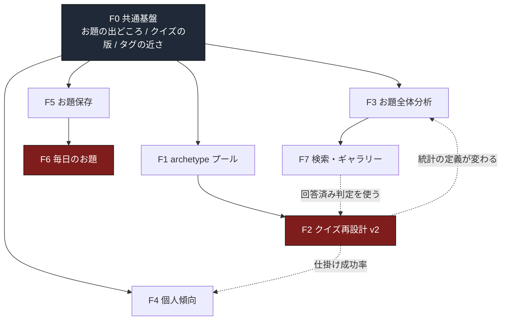

# drawing-prompt-quiz 統合ドキュメント

自動生成: 2026-09-07。元は 30 ファイル / 19,961 行 / 1.1MB。
このファイルは機械が組み直したものです。直すときは元のファイル側を直してください。
次に `weave` が走ったとき、ここは作り直されます。

- 重複の疑い: 7 箇所
- 同じ名前で違う値: 17 箇所
- 話題索引に載った語: 104 語


## 目次

- [AGENTS.md](#統合-AGENTSmd) — This is NOT the Next.js you know （2026-08-03, 6行）
- [BACKLOG.md](#統合-BACKLOGmd) — BACKLOG （2026-08-28, 54行）
- [CLAUDE.md](#統合-CLAUDEmd) — 無人実行（クラウドのルーチン）の規約 （2026-09-02, 82行）
- [PROGRESS.md](#統合-PROGRESSmd) — PROGRESS （2026-09-07, 401行）
- [README.md](#統合-READMEmd) — つたわるかな （2026-09-06, 317行）
- [GPT_HANDOFF.md](#統合-GPT_HANDOFFmd) — drawingpromptquiz GPT引き継ぎ資料 （2026-09-06, 668行）
- [PENDING.md](#統合-PENDINGmd) — 判断待ち（無人実行が集めたもの） （2026-09-07, 243行）
- [PROPOSALS.md](#統合-PROPOSALSmd) — 作業候補（無人実行が見つけてくる） （2026-08-28, 122行）
- [QUEUE.md](#統合-QUEUEmd) — 作業キュー（無人実行用） （2026-08-28, 104行）
- [art-first-investigation.md](#統合-artfirstinvestigationmd) — 既存絵からクイズを作る（逆方向モード）／ 実装前調査 （2026-09-07, 424行）
- [audit-2026-09-04.md](#統合-audit20260904md) — 仕様監査 2026-09-04（事実確認のみ。実装・修正はしていません） （2026-09-06, 550行）
- [db-workflow.md](#統合-dbworkflowmd) — DB反映の手順（Supabase CLI 版） （2026-08-04, 263行）
- [decisions.md](#統合-decisionsmd) — 決定ログ （2026-09-07, 6654行）
- [launch-checklist.md](#統合-launchchecklistmd) — 公開手順書（外部画面での作業） （2026-09-07, 950行）
- [launch-run.md](#統合-launchrunmd) — 公開までにあなたが手で通す1枚（2026-09-03 作成） （2026-09-07, 177行）
- [legal-draft.md](#統合-legaldraftmd) — 利用規約・プライバシーポリシー ドラフト （2026-08-08, 972行）
- [postlaunch-feature-architecture.md](#統合-postlaunchfeaturearchitecturemd) — 次期機能群の設計調査（F0〜F7） （2026-09-06, 1064行）
- [prelaunch-debug-report.md](#統合-prelaunchdebugreportmd) — 公開前デバッグ報告 （2026-08-04, 495行）
- [prod-audit-2026-09-06.md](#統合-prodaudit20260906md) — 本番適用前の事前監査（2026-09-06） （2026-09-06, 463行）
- [prod-runbook.md](#統合-prodrunbookmd) — 本番へ当てる手順と、戻す手順 （2026-09-07, 325行）
- [research-hit-patterns.md](#統合-researchhitpatternsmd) — 少人数開発のヒット事例と、その構造 （2026-08-08, 788行）
- [roadmap.md](#統合-roadmapmd) — ロードマップ（2026-08-08 起点・週60時間） （2026-09-07, 472行）
- [spec-candidates-2026-09-07.md](#統合-speccandidates20260907md) — 仕様候補（2026-09-07 にユーザーが出した8件） （2026-09-07, 130行）
- [spec.md](#統合-specmd) — drawing-prompt-quiz 仕様書 （2026-09-07, 2093行）
- [tags-master.md](#統合-tagsmastermd) — タグマスタ（Step 3D 本番投入） （2026-08-04, 575行）
- [test-layers.md](#統合-testlayersmd) — 検査の層と、それぞれが証明できること （2026-09-06, 179行）
- [verify-2026-09-05.md](#統合-verify20260905md) — 2026-09-05 の実装と検証の記録 （2026-09-06, 263行）
- [verify-2026-09-06.md](#統合-verify20260906md) — 2026-09-06 本番反映の記録 （2026-09-07, 364行）
- [verify-2026-09-07.md](#統合-verify20260907md) — 2026-09-07 の本番反映の記録（D170 / D171） （2026-09-07, 121行）
- [vocab-inventory.md](#統合-vocabinventorymd) — 語彙の棚卸し（自動生成） （2026-09-06, 642行）


## 重複の疑い

同じ内容の段落が複数のファイルにあります。どれを残すかは人が決めてください。

- decisions.md / roadmap.md
  > ``` ┌──────────────────────────┐ │  3人が、あなたの絵を読み解きました      │ │  うち1人は、まったく違うものを見ていました│ │              [ 開く ]            
- decisions.md / roadmap.md
  > ``` ┌──────────────────────────┐ │  3人が、あなたの絵を読み解きました      │ │  うち1人は、まったく違うものを見ていました│ │              [ 開く ]            
- launch-checklist.md / prod-runbook.md
  > - `get_public_works(text,text,int,int,text)`（旧5引数版） - `get_next_work(uuid, text)`（旧2引数版。部門引数は受け取るが使わない） - `draft_modes.q
- decisions.md / spec.md
  > `work_slot_stats` / `user_stats` / `user_slot_stats` には INSERT / UPDATE / DELETE をどのロールにも与えない。更新するのは Step 9 の 回答RPCに付けるト
- decisions.md / research-hit-patterns.md
  > **検討の初期に「Webサービスでは稼げない」と評価したが、これは誤りだった。** 売り切りゲーム（めっちゃカメレオン型）を基準に置いたことと、 事例の列挙で終わって一般化できていなかったことが原因。式から立て直す。
- decisions.md / research-hit-patterns.md
  > | 変数 | 値 | |---|---| | RPM（1000PVあたり収益）日本平均 | **300〜800円** | | └ エンタメ系 | 200〜400円（視聴数は稼げるが購買意欲が低い） | | └ **教育系** | **400
- decisions.md / roadmap.md
  > | 律速 | 前倒しできるか | |---|---| | 実装 | **できる。もう問題ではない** | | **判断**（未決の4つ・論点2） | **できる。だから最初に潰す** | | **絵**（D124） | **できない。**手


## 同じ名前で違う値

同じラベルに違う数値がついている箇所です。別々の量に同じ名前がついているだけのことも多いので、
節の名前を見て判断してください。日付と、ラベルの無い裸の数値は対象外です。

- 「works」に 5 通りの値
  - 0 — audit-2026-09-04.md § 本番DBの実測値（2026-09-04）
  - 889 — audit-2026-09-04.md § 本番DBの実測値（2026-09-04）
  - 444 — postlaunch-feature-architecture.md § 1-1. 表とデータ量（実測）
  - 889 — prod-audit-2026-09-06.md § 1-2. 既存データの件数（本文・個人情報は取っていない）
  - 0 — verify-2026-09-06.md § 片づけたあとの本番の件数
  - 889 — verify-2026-09-06.md § 片づけたあとの本番の件数
  - 2 — verify-2026-09-07.md § 3. 本番データの前後
  - 890 — verify-2026-09-07.md § 3. 本番データの前後
- 「answers」に 3 通りの値
  - 648 — audit-2026-09-04.md § 本番DBの実測値（2026-09-04）
  - 363 — postlaunch-feature-architecture.md § 1-1. 表とデータ量（実測）
  - 648 — prod-audit-2026-09-06.md § 1-2. 既存データの件数（本文・個人情報は取っていない）
  - 648 — verify-2026-09-06.md § 片づけたあとの本番の件数
  - 650 — verify-2026-09-07.md § 3. 本番データの前後
- 「draftsessions」に 3 通りの値
  - 500 — postlaunch-feature-architecture.md § 1-1. 表とデータ量（実測）
  - 974 — prod-audit-2026-09-06.md § 1-2. 既存データの件数（本文・個人情報は取っていない）
  - 974 — verify-2026-09-06.md § 片づけたあとの本番の件数
  - 975 — verify-2026-09-07.md § 3. 本番データの前後
- 「prompts」に 3 通りの値
  - 516 — postlaunch-feature-architecture.md § 1-1. 表とデータ量（実測）
  - 995 — prod-audit-2026-09-06.md § 1-2. 既存データの件数（本文・個人情報は取っていない）
  - 995 — verify-2026-09-06.md § 片づけたあとの本番の件数
  - 997 — verify-2026-09-07.md § 3. 本番データの前後
- 「answeritems」に 2 通りの値
  - 1944 — audit-2026-09-04.md § 本番DBの実測値（2026-09-04）
  - 1944 — prod-audit-2026-09-06.md § 1-2. 既存データの件数（本文・個人情報は取っていない）
  - 1944 — verify-2026-09-06.md § 片づけたあとの本番の件数
  - 1950 — verify-2026-09-07.md § 3. 本番データの前後
- 「motif」に 4 通りの値
  - 102 — decisions.md § 旧プールの移行
  - 10 — spec.md § 8-2. マスタ系
  - 80 — tags-master.md § 1. 内訳を組み替えた（要確認）
  - 9210 — tags-master.md § 7-3. 重みの偏り
- 「genre」に 4 通りの値
  - 15 — decisions.md § 旧プールの移行
  - 5 — spec.md § 8-2. マスタ系
  - 20 — tags-master.md § 1. 内訳を組み替えた（要確認）
  - 1380 — tags-master.md § 7-3. 重みの偏り
- 「species」に 3 通りの値
  - 24 — decisions.md § 旧プールの移行
  - 5 — spec.md § 8-2. マスタ系
  - 24 — tags-master.md § 1. 内訳を組み替えた（要確認）
  - 2205 — tags-master.md § 7-3. 重みの偏り
- 「promptcards」に 3 通りの値
  - 1990 — postlaunch-feature-architecture.md § 1-1. 表とデータ量（実測）
  - 3803 — prod-audit-2026-09-06.md § 1-2. 既存データの件数（本文・個人情報は取っていない）
  - 3809 — verify-2026-09-07.md § 3. 本番データの前後
- 「quizquestions」に 3 通りの値
  - 1548 — postlaunch-feature-architecture.md § 1-1. 表とデータ量（実測）
  - 2985 — prod-audit-2026-09-06.md § 1-2. 既存データの件数（本文・個人情報は取っていない）
  - 2991 — verify-2026-09-07.md § 3. 本番データの前後
- 「workslotstats」に 3 通りの値
  - 453 — postlaunch-feature-architecture.md § 1-1. 表とデータ量（実測）
  - 915 — prod-audit-2026-09-06.md § 1-2. 既存データの件数（本文・個人情報は取っていない）
  - 918 — verify-2026-09-07.md § 3. 本番データの前後
- 「npmruntest:db」に 3 通りの値
  - 119/ 119 — prod-audit-2026-09-06.md § 6. この回に走らせた検査（2026-09-06・すべてこの端末で実測）
  - 100/ 100 — verify-2026-09-05.md § 2. 実行して合格したもの
  - 145件すべて合格 — verify-2026-09-07.md § 4. 検査の結果
- 「tags」に 2 通りの値
  - 156 — postlaunch-feature-architecture.md § 1-1. 表とデータ量（実測）
  - 156 — verify-2026-09-06.md § 片づけたあとの本番の件数
  - 474 — verify-2026-09-07.md § 3. 本番データの前後
- 「profiles」に 2 通りの値
  - 622 — prod-audit-2026-09-06.md § 1-2. 既存データの件数（本文・個人情報は取っていない）
  - 622 — verify-2026-09-06.md § 片づけたあとの本番の件数
  - 627 — verify-2026-09-07.md § 3. 本番データの前後
- 「color」に 3 通りの値
  - 5 — spec.md § 8-2. マスタ系
  - 32 — tags-master.md § 1. 内訳を組み替えた（要確認）
  - 1330 — tags-master.md § 7-3. 重みの偏り
- 「npmruntest:e2e」に 2 通りの値
  - 51/ 51 — prod-audit-2026-09-06.md § 6. この回に走らせた検査（2026-09-06・すべてこの端末で実測）
  - 57件すべて合格 — verify-2026-09-07.md § 4. 検査の結果
- 「npmruntest:db:upgrade」に 2 通りの値
  - 22/ 22 — verify-2026-09-05.md § 2. 実行して合格したもの
  - 30件すべて合格 — verify-2026-09-07.md § 4. 検査の結果


## 話題索引

複数のファイルの見出しに出てくる語です。話題ごとに横断して読むための入口です。

- migration — PROGRESS.md / art-first-investigation.md / decisions.md / launch-checklist.md / prod-audit-2026-09-06.md / prod-runbook.md / test-layers.md
- RLS — decisions.md / prod-audit-2026-09-06.md / prod-runbook.md / spec.md / test-layers.md
- Supabase — db-workflow.md / decisions.md / launch-checklist.md / research-hit-patterns.md / test-layers.md
- 本番 — audit-2026-09-04.md / decisions.md / launch-checklist.md / postlaunch-feature-architecture.md / verify-2026-09-06.md
- RPC — art-first-investigation.md / decisions.md / postlaunch-feature-architecture.md / prod-runbook.md
- Vercel — decisions.md / launch-checklist.md / prelaunch-debug-report.md / verify-2026-09-06.md
- 実測 — decisions.md / launch-checklist.md / postlaunch-feature-architecture.md / roadmap.md
- 実装 — PROGRESS.md / audit-2026-09-04.md / decisions.md / spec.md
- 実装済み — launch-checklist.md / legal-draft.md / spec-candidates-2026-09-07.md / spec.md
- 方式 — GPT_HANDOFF.md / decisions.md / research-hit-patterns.md / spec.md
- MVP — GPT_HANDOFF.md / decisions.md / spec.md
- Step — decisions.md / spec.md / tags-master.md
- コード — legal-draft.md / postlaunch-feature-architecture.md / prelaunch-debug-report.md
- ドラフト — decisions.md / legal-draft.md / spec.md
- 付録 — launch-checklist.md / legal-draft.md / postlaunch-feature-architecture.md
- 保存枠 — GPT_HANDOFF.md / decisions.md / spec.md
- 共通基盤 — decisions.md / postlaunch-feature-architecture.md / roadmap.md
- 回答 — PENDING.md / legal-draft.md / spec.md
- 提案 — audit-2026-09-04.md / postlaunch-feature-architecture.md / spec-candidates-2026-09-07.md
- 新規 — art-first-investigation.md / legal-draft.md / tags-master.md
- 確定 — launch-checklist.md / legal-draft.md / spec-candidates-2026-09-07.md
- API — decisions.md / spec.md
- CAPTCHA — decisions.md / spec.md
- CLI — db-workflow.md / test-layers.md
- Confirm — launch-checklist.md / prelaunch-debug-report.md
- Cron — decisions.md / launch-checklist.md
- JWT — decisions.md / test-layers.md
- OGP — spec.md / verify-2026-09-06.md
- PROGRESS — PENDING.md / PROGRESS.md
- SQL — db-workflow.md / test-layers.md
- Storage — decisions.md / spec.md
- Turnstile — launch-checklist.md / prelaunch-debug-report.md
- URL — decisions.md / launch-checklist.md
- archetype — decisions.md / postlaunch-feature-architecture.md
- drop — decisions.md / prod-audit-2026-09-06.md
- email — launch-checklist.md / prelaunch-debug-report.md
- handle — decisions.md / spec.md
- health — BACKLOG.md / PENDING.md
- profiles — decisions.md / spec.md
- prompt — postlaunch-feature-architecture.md / spec.md
- show_creator_stats — decisions.md / roadmap.md
- smoke — PROPOSALS.md / verify-2026-09-06.md
- weight — decisions.md / tags-master.md
- works — decisions.md / prod-runbook.md
- お題 — decisions.md / spec.md
- お題を組み立てる語の — README.md / test-layers.md
- で数える — GPT_HANDOFF.md / decisions.md
- とは限らない — README.md / decisions.md
- クイズ — legal-draft.md / spec.md
- クイズはお題の全語を — GPT_HANDOFF.md / decisions.md
- コストの実数 — decisions.md / research-hit-patterns.md
- ドローと確定の分離 — PROGRESS.md / decisions.md
- ビタ当て — decisions.md / spec-candidates-2026-09-07.md
- フレーバーテキスト — audit-2026-09-04.md / decisions.md
- メールは — README.md / decisions.md
- 一部持ち出し — audit-2026-09-04.md / spec.md
- 仕上げ — decisions.md / roadmap.md
- 件であること — db-workflow.md / decisions.md
- 件数 — decisions.md / verify-2026-09-06.md
- 保留 — roadmap.md / spec-candidates-2026-09-07.md
- 候補 — PROPOSALS.md / spec-candidates-2026-09-07.md
- 公開の条件ではない — launch-checklist.md / roadmap.md
- 出す — GPT_HANDOFF.md / decisions.md
- 分類 — README.md / test-layers.md
- 前提 — decisions.md / prod-runbook.md
- 匿名 — decisions.md / spec.md
- 喜びを殺しているもの — decisions.md / research-hit-patterns.md
- 回目 — PROGRESS.md / decisions.md
- 回答は — GPT_HANDOFF.md / decisions.md
- 引き直し — postlaunch-feature-architecture.md / spec.md
- 形にする — art-first-investigation.md / decisions.md
- 手順 — db-workflow.md / launch-checklist.md
- 投稿 — legal-draft.md / spec.md
- 択当て — decisions.md / spec-candidates-2026-09-07.md
- 持ち出しの上限は — GPT_HANDOFF.md / decisions.md
- 文書 — README.md / postlaunch-feature-architecture.md
- 新しい — db-workflow.md / verify-2026-09-06.md
- 新しい画面のデプロイ — prod-runbook.md / verify-2026-09-06.md
- 既存 — art-first-investigation.md / tags-master.md
- 既存絵からクイズを作 — art-first-investigation.md / spec-candidates-2026-09-07.md


---

# 本文


<a id="統合-AGENTSmd"></a>

## AGENTS.md

出所: `AGENTS.md` / 最終更新 2026-08-03 / 6行

<!-- BEGIN:nextjs-agent-rules -->
### This is NOT the Next.js you know

This version has breaking changes — APIs, conventions, and file structure may all differ from your training data. Read the relevant guide in `node_modules/next/dist/docs/` before writing any code. Heed deprecation notices.
<!-- END:nextjs-agent-rules -->


<a id="統合-BACKLOGmd"></a>

## BACKLOG.md

出所: `BACKLOG.md` / 最終更新 2026-08-28 / 54行

### BACKLOG

着手前の項目を置く場所です。/chores が「雑務でない」と仕分けたものが
ここに積まれます。着手して直したら、その項目を削除してください。
やったことの記録は PROGRESS.md の「終えたこと」に残ります。

#### B-002 /health が、テーブルを1つも作っていなかった時期のまま

- 見つかった日: 2026-08-27
- 場所: src/app/health/page.tsx:1-60
- 現状: 実在しないテーブル `__connection_check__` を問い合わせ、返ってきた
  エラーの種類で接続の可否を判定している。Step 3 の時点で置いたもので、
  当時の注記には「Step 3 でテーブルを作成したら本物のクエリに置き換えます」と
  書いてあった。テーブルは揃ったが、置き換えは行われていない。
  今回は注記と説明だけを実態に合わせ、判定の中身は触っていない。
- なぜ雑務でないか: 本物のクエリに変えると、この画面が何を報告する画面なのかが
  変わる（仕分けの2番目）。
- 直すとどうなるか: 「Supabase に届くか」だけでなく「実際に読めるか」まで
  1画面で分かるようになる。
- 着手前に決めること: 読めなかったときに「接続失敗」と出すのか
  「接続はできたが読めない」と出すのか。RLS で 0 行になった場合をどちらに
  数えるか。ここを決めないと、判定の意味が曖昧なまま増える。
- 影響範囲: src/app/health/page.tsx。/health/auth 側の looksLikeMissingTable も
  同じ前提で書かれているので、揃える必要がある。

#### B-003 /health のボタンだけ、D156 の集約の外にある

- 見つかった日: 2026-08-27
- 場所: src/app/health/_ui.tsx:49-66
- 現状: D156 で押しボタンの見た目を `_surface.ts` の5つに集めたが、
  /health の ActionButton はそこに入っておらず、`rounded-md px-4 py-2` と
  `bg-foreground text-background` を自前で持っている。主ボタンは
  `rounded-xl px-6 py-3` と `bg-accent text-on-accent` なので、寸法も色名も違う。
- なぜ雑務でないか: 揃えると /health の見た目が変わる（仕分けの2番目）。
- 直すとどうなるか: 角の丸みや余白を試すとき、/health だけ取り残されなくなる。
- 着手前に決めること: /health は等幅書体の内部用画面として意図的に別扱いに
  しているので、そもそも揃えるべきかどうか。揃えないなら、その旨を
  `_surface.ts` の冒頭に1行書いて「漏れ」ではなく「除外」にする。
- 影響範囲: src/app/health/_ui.tsx と、それを使う /health・/health/auth の2画面。

#### B-004 タブの高さが 32px で、指で押す下限 44px に届かない

- 見つかった日: 2026-08-27
- 場所: src/app/_surface.ts:124（tabShape）
- 現状: `rounded-full px-4 py-2 text-xs` で、文字 12px ＋ 上下 8px ＝ 32px。
  ボタンは D156 で 44px に揃えたが、タブはそこから外してある。
  D156 自身が「py-2 を上げれば全タブに効くが、行の高さが変わるので
  見た目を決める段で扱う」と書いて先送りしている。
- なぜ雑務でないか: 高さが変わると一覧画面の行の高さが変わる（仕分けの2番目）。
- 直すとどうなるか: 作品一覧・ランキングの切り替えが、指で押しやすくなる。
- 着手前に決めること: D157 の「紙・掲示板寄りにするか」が未確認のまま。
  そこが決まる前に寸法を動かすと、二度手間になる。
- 影響範囲: tabOn / tabOff を使う全画面（作品一覧・ランキング）。


<a id="統合-CLAUDEmd"></a>

## CLAUDE.md

出所: `CLAUDE.md` / 最終更新 2026-09-02 / 82行

@AGENTS.md

---

### 無人実行（クラウドのルーチン）の規約

平日の日中、ユーザーが不在のあいだにクラウド上の Claude Code がこのリポジトリを
クローンして作業する。以下はそのときだけ適用される規約。人が手で作業するときは
無視してよい。

#### このリポジトリでの無人実行は、調査専用である

コードを一行も変えない。実装はユーザーが手で行う。無人実行は判断材料を外から
集めてくる側に回る。

出所: ユーザー発言「実装の一本化とそれ以外のプロジェクトに使うリサーチの豊富化を
行いたい」（2026-08-30）。週あたりの利用制限に対して、実装を2本同時に進めるのが
重いと分かったため、実装は生き物の骨格ツール1本に絞った。

#### 絶対に守ること

1. コードを一行も変えない。src/ 、test/ 、experiments/ 、tools/ 、設定ファイルの
   いずれも触らない。読むだけ。
2. 書いてよいのは次の3か所だけ。
   - docs/RESEARCH/ … 調査レポート
   - docs/PROPOSALS.md … 調査の候補
   - docs/auto/ … その日の記録
   PROGRESS.md 、CLAUDE.md 、README.md 、docs/QUEUE.md 、docs/PENDING.md 、
   その他の既存文書は読むだけ。書き換えない。
3. main ブランチに直接コミットしない。auto/research-<今日の日付> というブランチを
   切って作業する。
4. 外部に出る操作をしない。メール送信、SNS 投稿、デプロイ、外部 API への書き込みは
   行わない。有料サービスを呼ばない。
5. 見ていないものを見たことにしない。開けなかったページがあれば、そのことを
   調査レポートの冒頭に書く。件数が埋まらなければ、埋まらなかったと書く。

#### 起動したら最初に確認すること（必ずやる）

作業を始める前に、まだ本流へ取り込まれていない作業線を確認する。

1. `git branch -r | grep auto/` で、auto/ から始まる作業線を全部出す。
2. 本流に取り込まれていないものについて、`git log --oneline main..origin/<作業線名>` で
   コミットの見出しを読む。
3. 今日やろうとしている題材や項目が、そこで既に終わっていないかを確かめる。
   終わっていたら、その仕事はしない。飛ばして次の項目へ進む。
   飛ばしたことと、どの作業線で既に終わっているかを、その日の記録に書く。

なぜこれが要るか。成果を本流へ取り込むのが遅れると、本流から見た状態は手つかずの
ままになる。確認しないと同じ仕事を繰り返す。2026-08-31 と 2026-09-02 に実際に起きた。
変形機構ツールは同じ題材を2回調査し、骨格ツールは同じ実装を2回した。
どちらも週あたりの利用量を無駄に使った。

#### 1回の起動でやること

0. docs/PROPOSALS.md を読む。未選択（`[ ]`）の候補が1つでも残っていれば、この手順は
   飛ばして 1 へ進む。1つも残っていなければ、1回1時間から2時間かかる調査の候補を
   3つから4つ挙げ、同ファイルの「候補」節に書式どおり書く。挙げるだけで着手はしない。
   見積もりには根拠を1行付ける。調べる先の件数など、数えられるもので書くこと。
1. 今日の題材を1つ決める。docs/PROPOSALS.md に採用済み（`[x]`）で未実施の候補が
   あれば、その先頭を今日の題材にする。無ければ、docs/RESEARCH/ の既存の見出しを
   全部読んで、まだ調べていない題材を1つ選ぶ。選んだ理由を1行書く。
   題材の範囲は docs/RESEARCH/README.md にある。
2. WebSearch と WebFetch で調べる。最低5件、多くて10件の実在の事例を集める。
   出所の URL を必ず付ける。
3. docs/RESEARCH/<今日の日付>_<題材の短い名前>.md に書く。書式は
   docs/RESEARCH/README.md にある。末尾に「判断が要る点」を3件以内で置き、
   選択肢と推奨と答え方を書く。
4. その日の記録を docs/auto/<今日の日付>.md に新しく書く。書く内容は
   docs/auto/README.md にある4項目。
5. 変更が docs/RESEARCH/ と docs/PROPOSALS.md と docs/auto/ の下だけであることを
   git status で確かめてからコミットし、ブランチを push する。
   他の場所が変わっていたら、それを戻してからコミットする。
6. PushNotification で結果を1行送る。今日何を調べ、何件集め、候補を何件書いたかを書く。

#### 書き方

- すべて日本語で書く。専門用語を使うときは、初出の直後に一行の説明を添える。
- 一行で説明できない用語は、使わずに言い換える。
- 用語を、未説明の別の用語で説明しない。
- 関数名・ファイル名の羅列で説明を代替しない。
- 強調のためのアスタリスクを本文に書かない。箇条書きの記号は - を使う。


<a id="統合-PROGRESSmd"></a>

## PROGRESS.md

出所: `PROGRESS.md` / 最終更新 2026-09-07 / 401行

### PROGRESS

セッションの引き継ぎを置く場所です。新しいものが上。
`/next` はここを起点に「現在地と次の一手」を出し、`/progress` がここへ追記します。
日時は JST。全体が400行を超えたら、一番下（最も古いもの）から削ります。

---
#### 2026-09-07（4回目）本番へ反映した（migration 4本・画面の差し替え・本番検査）

##### 終えたこと

- **本番へ出した。**DBは40本から44本になり、新しい画面も公開されている。
  一般の利用者から新しい仕様が使える状態。
- DBと画面は同時に切り替えられないので、変更を2つに割って出した。
  reveal_card を「めくるだけ」に変える1本だけが、いまの画面と噛み合わない。
  そこで先に3本（表と関数が増えるだけ）を当て、画面を出してから、
  最後の1本を当てた。どちらの中間状態でも止まらないことを、
  アップグレード試験の「順番1〜3」で実際に動かして確かめてある。
- 本番データは1件も減っていない。増えたぶんはすべてこの日の検査が作ったもの。
  孤児も0件。値を書き換えたのは morph_max（normal を3→2）と表示名の入れ直しだけ。
- 途中で7つ直した。詳しくは docs/verify-2026-09-07.md の5節。
  いちばん大きいのは、合図だけを投げる例外（TERMS_NOT_AGREED など8つ）が
  本番で「うまく処理できませんでした」に化けていたこと。**利用者は入力を
  直しようがなかった。**合図ごとに日本語を持たせた。
- 残りを開いた枠があるのに「全部引き直す」が出たままだったのも直した。
  押すと DB に断られるボタンを置いたままにしていた。

##### 検査（すべて実測）

- 本番: db:verify 183項目 / smoke draft 60項目 / play / work / account / anon /
  verify:launch 15項目 / ブラウザ1周 41項目 — すべて合格
- 手元: test:db 145件 / upgrade 30件 / db:verify:local 171件 / e2e 57件 — すべて合格
- typecheck・build 通過。lint はエラー0・警告3

##### 残っていること

- 登録の二重送信。5本同時に送ると確認メールが1通よけいに出ることがある
  （2回に1回ほど。smoke:anon で観測）。壊れることはないが、1通に抑えるには
  記録を持つ表が要る。**未決。**
- ゲストの通報は、本番の CAPTCHA があるためスクリプトでは確かめられない。
  ブラウザを動かす検査でしか触れない。
- 検査用のお題が本番に39件残っている（作品は0件。生きている作品2件は本人のもの）。

##### 触ったファイル

- supabase/migrations/20260907110000_split_reveal_from_commit.sql（新規・分割したぶん）
- src/features/draft/rpc.ts（合図だけの例外に日本語を持たせた）
- src/app/play/_components.tsx（開示後は引き直しボタンを出さない）
- scripts/db-checks.mjs（A4 を分けて A4b を足した）
- scripts/db-audit-prod.mjs（1問ごとに戻せる目印）
- scripts/smoke-draft.mjs / smoke-play.mjs / smoke-work.mjs / smoke-account.mjs / smoke-anon.mjs
- test/e2e/browser.mjs（引き直しボタンの検査）／test/db/upgrade.mjs（順番の検査3件）
- docs/prod-runbook.md（2026-09-07 の切替の節）／docs/verify-2026-09-07.md（新規）

---

#### 2026-09-07（4回目）新しいアイデア8件を候補として記録し、「既存絵から作る」だけ実装前調査をした

##### 終えたこと

- 2026-09-07 のユーザー投稿（A〜M）を仕様候補として1枚に写した。
  確定・保留・提案を分けて並べ、勝手に決めてはいけない13件をそのまま残した。
  → docs/spec-candidates-2026-09-07.md
- そのうち A「既存絵からクイズを作る」だけ、現行のコードとDBを読んで
  実装前調査を書いた。**コードは1行も変えていない。**
  → docs/art-first-investigation.md
- 分かったいちばん大きなこと。**クイズを作る関数はドラフトを1つも見ていない。**
  prompts と prompt_cards さえ揃えばクイズは作れる。試験の
  buildPromptWithTags が既にその形でお題を組み立てて全試験を通している。
- 出どころの列（prompts.origin）は 2026-08-08 に入っていて、
  いま誰も読んでいない。列を足さず、許す値を1つ増やすだけで足りる。
- 先に潰さないと壊れるものを8件見つけた。特に3つ。
  (1) お題だけ先に作ると、全ページの帯に「制作中」が残り続ける。消す掃除が無い。
  (2) 診断 A4 / A4b が語数をモードの範囲で見ているので、モード行を1つ足す形になる。
  (3) 制限時間を持たないので、ランキングでは全部「無制限」に入る。

##### 次の一手

- 未確定10件（docs/art-first-investigation.md 第9節）に答えをもらう。
  特に「モーフを1件以上必須にするか」「モードの名前と origin の値」。
- 答えが出るまで実装しない（ユーザー指示「調査結果を出すまでは実装しない」）。
- 前回からの持ち越しは残ったまま。本番へ migration 3本を当てる作業と、
  本番の鍵が要る検査4本（db:verify / smoke:draft / smoke:play / verify:launch）は未実行。

##### 触ったファイル

- docs/spec-candidates-2026-09-07.md（新規）
- docs/art-first-investigation.md（新規）

---
#### 2026-09-07（3回目）放棄と「他の候補を見る」に押せるボタンを付けた／メール確認を2枚のタブで確かめた

##### 終えたこと

- 前回「実装済み」と書いた「他の候補を見る」と放棄は、DB の関数だけで
  画面のボタンが無かった。利用者から見れば無いのと同じ。お題の画面に
  2つの操作を置いて、押せる状態にした。
- 「他の候補を見る」は、まだ開いていないときだけ出る。押すと引かなかった
  カードが開き、ボタンは消える。投稿の入口はそのまま残る。
- 「このお題は描かない」は、進行中のお題にだけ出る。押すと放棄になり、
  投稿の入口が消え、引かなかったカードが開く。
- 放棄したお題の投稿画面（/works/new）に、断りの文を足した。
  状態の英字をそのまま出していたのを、押した操作の言葉で書き直した。
- メールの確認を、実際にタブ2枚で確かめられるようにした。検証用の
  Supabase から確認の印を1つ取り出せるようにし、リンクを組み立てて開く。
  元のタブが読み込み直さずに登録済みへ変わることを試験にした。
- 嘘の合図だけでは登録済みにならないこと、別の端末に当たるところで開いた
  ときは元のタブが勝手に切り替わらないことも、試験にした。

##### 検査（すべて実測）

- test/db/run.mjs 145件中145件合格
- test/db/upgrade.mjs 27件中27件合格
- scripts/db-verify-local.mjs 171件中171件合格（判定しない11件は本番データ前提）
- test/e2e/browser.mjs 56件中56件合格（今回5件追加。P群3件・Q群2件）
- npm run typecheck 終了コード0 / npm run lint エラー0・警告3 / npm run build 成功

##### 次の一手

- 本番へ migration 3本を当てる（日付順）。DBと画面を同時に出す。
- 当てたあと npm run db:verify、smoke:draft、smoke:play、verify:launch。
  この4本だけが本番の鍵を要するため未実行。
- コミットも push も本番適用もまだしていない。

##### 触ったファイル

- src/app/prompt/[id]/page.tsx（2つの操作を置いた）
- src/app/prompt/[id]/actions.ts（押したときの処理を2本）
- src/features/draft/rpc.ts（callAbandonPrompt / callRevealPromptCandidates）
- src/app/works/new/page.tsx（放棄したお題への断り）
- test/e2e/browser.mjs（P群3件・Q群2件とヘルパー3本）
- test/e2e/supabase-mock.mjs（確認の印の取り出し口）
- docs/decisions.md（D171 に 9 と 10 を追記）／docs/spec.md（4-4 に追記）

---


#### 2026-09-07（2回目）D171 開示後の引き直し禁止・放棄・表示名・タイマー・認証

##### 終えたこと

- **前回の取りこぼしを塞いだ。**残りを開示した枠があるドラフトは引き直せなくなった。
  開示してから引き直せば新しい候補をもう一式見られる抜け道があった。
  画面で隠すのではなく、RPC を直に叩いても止まる形にした。
- **お題の放棄を実装した。**仕様書にあって関数が1本も無かった。
  放棄すると未選択候補が開く。投稿済みのお題は放棄できない。
- **「他の候補を見る」も実装した。**制作中の開示とは時点も範囲も違うので、
  廃止ではなく実装で埋めた。開いても投稿は続けられる。
- **カテゴリ表示名を1か所から変えられるようにした。**2つの表にあって、
  画面が読むのは片方だけだった。1回の呼び出しで両方が変わる関数を作り、
  ずれていないことを検査で見張る。名前そのものは1つも変えていない。
- **お題画面の静止タイマーを外した。**残り時間と経過は上部の帯に一本化。
  帯が出していない期限の時刻と、延長ボタンは残した。
- **メール確認の元タブ継続を入れた。**同じブラウザの他のタブへ合図を送り、
  受け取った側はサーバーへ聞き直す。合図を認証の証拠にしていない。
- 本番用の smoke 2本を新仕様へ直した（実行はしていない。本番の鍵が要るため）。
- 検査: test/db/run.mjs 145件合格、upgrade 27件合格、db-verify-local 171件合格、
  test/e2e 51件合格、typecheck・build 通過、lint はエラー0。

##### 次の一手

**本番へ当てる順番が要注意。**DBを先に当てて画面を後にすると、
古い画面はめくった時点で確定すると思って動くので枠が進まない。同時に出すこと。

本番の smoke 2本は、当てたあとでないと実行できない。

##### 触ったファイル

- supabase/migrations/20260907093000_reveal_locks_and_prompt_reveal.sql（新規）
- supabase/migrations/20260907094000_category_label_single_source.sql（新規）
- src/app/_auth-sync.tsx（新規）、src/app/layout.tsx、src/app/account/page.tsx、
  src/app/auth/confirm/route.ts、src/app/prompt/[id]/_timer.tsx
- scripts/smoke-draft.mjs、scripts/smoke-play.mjs
- test/db/run.mjs、test/e2e/browser.mjs
- docs/decisions.md（D171 追加）、docs/spec.md、PROGRESS.md

**本番DBには当てていない。deploy もコミットもしていない。**

---

#### 2026-09-07 実装（D170）候補配分・ドローと確定の分離・枠内の保持

##### 終えたこと

- **候補枚数を「1枠一律5枚」から「総数を先に決めて2〜5枚で配る」へ変えた。**
  総数は抽選枠の数×3。既存の candidate_count の意味は変えず、新しい列3本で決める。
- **モーフの上限を通常・高難度とも2枠にした。**3モーフは出なくなった。
- **めくることと決めることを分けた。**reveal_card はめくるだけになり、
  choose_card を新設した。ドローの途中で読み込み直しても確定にならない。
- **枠の中で候補を残せるようにした。**上限は min(2, 候補数-1) で、全部は残せない。
  残した候補があるときだけ、その枠の残りを開示できる（新しい候補は増えない）。
- 検査: test/db/run.mjs 134件合格（15件を新設）、test/db/upgrade.mjs 27件合格、
  typecheck と build 通過。
- **途中で1回だけ不合格が出た原因を特定して直した。**既存の確率検査が
  旧比率のままで、新しい値が許容の端に触れていた。

##### 次の一手

**ユーザー指示のうち3つが未着手。** カテゴリ表示名の集約、お題画面の静止タイマー削除、
メール認証の元タブ通知。どれも今回の migration とは独立に着手できる。

放棄時の開示と明示操作の開示も、仕様書 4-4 にあるまま実装が無い。
今回は reveal_reason の受け皿を広げただけ。

##### 触ったファイル

- supabase/migrations/20260907090000_draw_allocation_and_commit_split.sql（新規）
- src/features/draft/types.ts, rpc.ts
- src/app/play/actions.ts, _components.tsx
- test/db/run.mjs, helpers.mjs, upgrade.mjs, test/e2e/seed.mjs
- docs/decisions.md（D170 追加、D158・D166 に注記）, docs/spec.md, PROGRESS.md

**本番DBには当てていない。コミットもしていない。**

---

#### 2026-09-07 確認メールの不着は迷惑メール判定だった（送信設定は元から入っていた）

##### 終えたこと

- **本物のメールで3人ぶんの登録を通した。**利用者A 22:48 登録・22:48 確認・22:50 ログイン。
  利用者B 22:49 登録・22:50 確認・22:50 ログイン。利用者C 23:03 登録・翌 00:07 確認・00:07 ログイン。
  すべて JST。3人とも確認リンクを開けてログインまで到達した。
- **3件目が届かなかった原因は、迷惑メールへの振り分けだった。**送信は成功していた。
  受信箱に出なかっただけで、迷惑メールのフォルダに入っていた。
- **送信回数の上限が原因ではなかった。**Supabase の Rate Limits を画面で実測したところ
  `Rate limit for sending emails` は **30 emails/h**。既定の2ではない。
- **カスタムSMTPは既に有効だった。**画面の実測。`Enable custom SMTP` がオン、
  送信元 `vro.artcode@gmail.com`、差出人名「お題を引いて描くクイズ」、
  ホスト `smtp.gmail.com`。利用者A・Bに届いた事実から、ポート・利用者名・パスワードも
  通っていると判断できる（触っていない）。
- **既存文書の記述が古い。**`docs/launch-checklist.md` の手順5は
  「カスタムSMTP を設定する（限定公開の前に必須）」を未完了のチェックボックスで残し、
  `docs/decisions.md` 4468 も「これだけ本当に残っている」と書いている。
  **どちらも画面の実測と食い違う。**私はこの記述を根拠に「標準送信のまま」と報告し、
  誤りだった。**文書はまだ直していない**（ユーザーの承認待ち）。
- Supabase 自身が SMTP 設定画面に警告を出している。要旨は「入力された送信サービスは
  この種のメール向けに作られておらず、到達性に影響しうる」。**迷惑メール判定と符合する。**
- 本番設定は1つも変えていない。DBへの書き込みもしていない（読むだけの接続で確認した）。

##### 引き換えにしたもの

引き換えは無し。**コードも本番設定も1つも変えていない。**

##### 確かめた不変

- `/` `/works` `/account` `/play` すべて 200、`x-robots-tag: noindex, nofollow, noarchive` も維持。
- works 890 ／ 公開作品 0 ／ answers 650 ／ answer_items 1,950 ／ saves 96 ／
  prompts 996 ／ 有効タグ 474。**2026-09-06 の記録と1件も違わない。**
- profiles 627 ＝ auth.users 627、孤児 0。

##### 利用者数が1件合わなかった件（基準時点と現在を分けて調べた）

**結論: 3人増えた一方で、基準より前に作られた登録利用者が1人消えている。**
消えた経路は特定できない。

| 数えかた | 値 |
|---|---|
| 基準時点（09-06 20:27 JST）の `auth.users` | 625（実測） |
| いま、基準より前に作られた行 | **624** |
| いま、基準より後に作られた行 | 3（利用者A・B・C） |
| いまの合計 | 627 |

- **A・B・Cは3人とも新規である。**`auth.identities` の provider は3つとも email で、
  identity の作成時刻が利用者の作成時刻と同じ。**匿名からの昇格ではない。**
  既存アカウントへの認証情報の追加でもない。
- **`profiles` も同じ形。**基準前 624・基準後3・合計 627 で `auth.users` と一致。
  孤児 0、欠落 0。**2つの表の同期は崩れていない。**
- 消えたのは匿名利用者ではない。匿名は基準前 12・現在 12 で変わらず、
  減ったのは登録利用者のほう（基準時点 613 → 現在の基準前ぶん 612）。
- **基準値 625 は正しい。**同じ出力で works 890・answers 650 も返しており、
  それらは `docs/verify-2026-09-06.md` の記録と一致している。
- **削除の経路を示す記録が無い。**`account_deletions` は 0 行。
  `auth.audit_log_entries` は**全期間で 0 行**（該当時間帯だけでなく、
  いちばん古い行も無い）。つまりこのプロジェクトは認証操作の履歴をDBに残していない。

**足りないのは次の2つ。**どちらも今から遡って取れない。

1. 基準時点の利用者IDの一覧（当時は総数しか控えていなかった）
2. 認証操作の履歴（DBには残っていない。Supabase の管理画面 Authentication → Audit Logs に
   残っている可能性があるが、私は管理画面を見られない）

既存の作品・回答・保存には影響が無い（下の「確かめた不変」）。

##### 時刻の読み違いと、その再発防止

**私は本番の時刻を9時間ずれて報告した。**22:48 JST を 13:48 と書いた。
原因は、`at time zone 'Asia/Tokyo'` の結果を JSON でそのまま受け取ったこと。
末尾に Z が付いた形で出るので、それを日本時間として読んだ。

- リポジトリの監査スクリプト（`scripts/db-audit-prod.mjs` など）は時刻の変換を
  していない。**同じ問題は無いので、本体は1行も変えていない。**
- 直したのは、私が一時作業に使っている読み取り用スクリプト（リポジトリ外）だけ。
  時刻は必ず `to_char(... at time zone 'Asia/Tokyo', ...)` で文字列にしてから返す、
  列名にも jst を入れる、という決まりを書き込んだ。

##### 訂正した文書

実態と食い違っていた箇所を直した。**過去の記述は消さず「以前の状態」と明記して分けた。**

- `docs/launch-checklist.md` 手順5 … 見出しごと差し替え。いまの実測表、3人ぶんの
  結果、迷惑メールの件、招待時の案内を追加。以前の内容は「以前の状態」節へ。
- `docs/launch-checklist.md` 手順8付近2か所 … 「先にSMTPを済ませる」「内蔵のままだと
  枠を食う」を、済んでいる前提の書き方へ。
- `docs/launch-checklist.md` 縦断試験の項目 … 「続けて3人ぶん登録しても届く」を
  実施済みにし、**受信箱ではなく迷惑メールだったことを明記。**
- `docs/decisions.md` D89 付近 … 追記で現状（30 通／時）を補足。画面に出す日本語は変えない。
- `docs/decisions.md` D114 の表と D149 の表 … 手順5の判定を実測に合わせた。
- `docs/roadmap.md` 2か所 … 「通っていないもの」から手順5を外した。
- `docs/launch-run.md` 関門2 … 通過済みとして書き直し、止まったときの見る場所を
  迷惑メールと管理画面に変更。
- `docs/PENDING.md` の 5 … 反映済みを追記。**Gmail の SMTP は 2026-08-27 に
  ユーザーが決めていた**（私は前回これを見落として「既存の決定は無い」と報告した）。
- `docs/verify-2026-09-06.md` 2か所 … 未確認だった到達の項目に、翌日の結果を追記。

**メールアドレス・パスワード・確認リンクは、どの文書にも書いていない。**

##### メール関門の判定（ユーザー確定・2026-09-07）

- 利用者A・B・Cは3人とも登録・確認・ログインまで成功した
- Cのメールは送信失敗ではなく、迷惑メールへ振り分けられていた
- 独自の送信設定は既に有効、送信上限は既に 30 通／時だった
- **したがってメールによる登録経路は動作確認済みとする**
- **ただし到達性に注意ありとして記録する**
- 「3通が1時間以内に受信箱へ届いた」とは書かない
- 試験専用の利用者D・Eは作らない。次の実利用者の登録を追加確認として扱う
- 限定公開をメールだけを理由に止めない。招待時に迷惑メールの案内を添える

##### 次の一手

**お題に合わせて制作した本物の作品5点（オリジナル4・ファンアート1）を公開する段階へ進む。**
試験用の仮作品は使わない。引いたお題と対応しない既存絵も使わない。**未着手。**

##### 触ったファイル

- PROGRESS.md（この節）
- docs/launch-checklist.md ／ docs/decisions.md ／ docs/roadmap.md ／
  docs/launch-run.md ／ docs/PENDING.md ／ docs/verify-2026-09-06.md（いずれも記述の訂正）
- `~/.claude/feedback-log.md`（2026-09-06 の2件）
- **コード・migration・設定ファイル・本番設定・本番データは1つも変えていない。**


---

#### 2026-09-06（3回目）本番へ当てて、新しい画面を出した

##### 終えたこと

- **未適用だった18本の migration を本番へ当てた。**16:37 開始・16:38 終了。
  18本すべてが順に当たり、失敗も再実行も無い。本番の履歴は40本になった。
  出た警告は「Docker が無いので差分カタログを作れない」の1つだけで、
  これは CLI の補助処理。適用そのものとは無関係。
- **当てる前に、戻せる控えを自分で作って、戻せることを実際に確かめた。**
  この端末には pg_dump も Docker も無いので、読むだけの接続で public スキーマ
  29表・44,765行を INSERT 文として書き出した（`backup/prod-preapply-20260906/`。
  Git 追跡外）。追跡済み22本だけを当てた空のDBへ流し込むと、**29表すべてで
  件数が本番と一致した。**「作った」ではなく「戻した」まで確かめてある。
- **本番の検証で1度だけ不合格が出たが、原因は検査側だった。**
  マスタ行数4項目（tag_pools・card_slots・draft_modes・有効タグ）の期待値が
  18本を当てる前のままだった。40本を当てた手元のDBで数え直すと本番と同じ
  17/40/4/474。期待値を直して再実行し、**182項目すべて合格**。
  この4項目は `db:verify:local` 側で判定を飛ばす対象に入っていたので、
  手元の検査では気づけない構造になっている（**その構造は直していない**）。
- **旧い画面が新しいDBで動くことを確かめてから、新しい画面を出した。**
  旧いコードのまま `/` `/play` `/works` ほか9経路が 200。作品一覧もモード一覧も
  落ちない。そのうえで push（16:46:34）し、90秒後に新コードが本番で見えた。
  **DB更新から新コードまでの空きは約10分**で、監査が挙げた「旧い画面で
  新しく引いたお題が期限切れで投稿を弾かれる」窓（45〜90分）の内側に収まった。
- **本番の中心動線を一周した**（`npm run smoke:prod -- cutover`。新規作成）。
  お題1・作品1・回答2・返歌1・保存枠2・匿名1人・登録2人だけを作って、
  **すべて期待どおり・不合格0**。2段抽選、制作タイマーと延長、フレーバー、
  全語クイズ（3問固定ではなく語数と同数）、ビタ当てと2択当て、
  ヒント使用の分離記録、返歌、自分／他者由来の保存枠、未回答フィルタ、
  共有とOGP、Storage の画像まで通った。
- **試験データを片づけた。**作品は画面から削除（論理削除・画像も削除済み）。
  ゲストの一時持ち出しの枠だけは画面に出ないので、IDと利用者とscopeの
  3条件を同時に満たす行だけを名指しで消した。**既存の889作品・648回答・
  96保存には触れていない**（saves は 96 のまま）。

##### 引き換えにしたもの

- **本番に、削除済みの試験作品1件と回答2件とお題1件と利用者3人が残る。**
  行ごと消さないのは runbook と D63 の決まり（works は回答・いいね・通報から
  参照されている）。公開一覧にもランキングにも出ないことは実測で確かめた。
- **旧い画面のモード一覧の中身が変わった。**`easy` / `standard` ではなく
  `normal` / `hard` が出る。絞っているのが画面ではなく RLS のポリシー
  （`draft_modes_select_active`。元からあったもの）だったため。
  **監査文書の「表示は変わらない」という記述のほうが間違っていた。**
  行は消していないので戻すのは1文で足りる。壊れてはいない。
- 検査の期待値を4つ書き換えた。根拠は migration が定める姿の実測と
  `docs/prod-audit-2026-09-06.md` 4章。**本番に合わせて緩めたのではない。**

##### まだ手つかず

- **Vercel 側が何も見えない。**`VERCEL_TOKEN` の権限不足（403）で、
  deployment ID もログもエラー監視も取れない。戻すときは管理画面から
  「1つ前のデプロイ」を選ぶ形になる。
- **Cron を手で叩けない。**手元の `CRON_SECRET` が Vercel の値と違う（401）。
  掃除の対象は9項目すべて0件なので、いま実害は無い。
  古い active お題104件はどの対象にも入っていない（期限を遡及しなかったため）。


<a id="統合-READMEmd"></a>

## README.md

出所: `README.md` / 最終更新 2026-09-06 / 317行

### つたわるかな

**絵だけを見て、描き手がどんなお題を引いたのかを当てるサービス。**

描き手はランダムに配られた「お題カード」を引いて絵を描く。
見る人は、絵だけを手がかりに、そのお題が何だったかを選択式で当てる。

当たれば「伝わった」、外れれば「別のものが見えていた」。
**上手さではなく、伝わりやすさを測る。**この2つは別の軸である、というのが
このサービスの中心にある考えかた。

> **状態：限定公開の準備中。**URL を渡した人だけが入れる形で出す。
> 検索には載せない（`X-Robots-Tag: noindex` ＋ `<meta name="robots">` の2か所）。

---

#### 何を作ったか

```
お題を引く  ──→  外部ツールで絵を描く  ──→  投稿する
                                              │
                            他の人が絵だけを見て、お題を当てる
                                              │
                              ┌───────────────┘
                              ▼
             「3人が、あなたの絵を読み解きました」
             「うち1人は、まったく違うものを見ていました」
                            [ 開く ]
```

サイト内に描画機能は持たない。CLIP STUDIO でも紙でも、
描く場所は描き手が選ぶ。

| | |
|---|---|
| **描き手** | お題が自動で出る。自分の絵が**どう読まれたか**が返ってくる |
| **見る人** | クイズとして遊べる。正解を知ってから絵を見返す面白さがある |

ゲストのまま遊べる。回答も共有も、アカウント登録なしでできる。

##### お題を組み立てる語の分類

お題は3〜6語でできている。語は次の3種類に分かれる。

| 上位種別 | 下位カテゴリ |
|---|---|
| モーフ | 描く対象となる具体語（傘、蝶、人間…） |
| 状態 | 感情、動作、身体状態、変化、環境、関係、性質、社会状態の**8カテゴリ** |
| カラー | 色彩語。**状態とは別**。通常抽選では1つのお題に1語まで |

**カラーは状態に含めない。**状態は8カテゴリのままで、カラーはその外側に立つ。
モーフはどのお題にも最低1語入る。

---

#### 設計の見どころ 3つ

コードより先に、**なぜそうしたか**を読んでほしい。
判断は157個すべて [`docs/decisions.md`](docs/decisions.md) に残してある。
その中から3つ選ぶ。

##### 1. 正解が漏れない構造を、出口の本数で保証する

→ [D52](docs/decisions.md#d52-採点は-db-の中だけで行い正解の出口は1本にする) ／
[`20260803041353_answer_rpc_and_stats.sql`](supabase/migrations/20260803041353_answer_rpc_and_stats.sql)

クイズなので、**正解を先にブラウザへ送ってはいけない。**
画面に出さなくても、通信の中身を見れば分かってしまう。

そこで採点を DB の関数の中だけで行う。ブラウザから上がってくるのは
「どの問で、どのタグを選んだか」だけ。
そして**正解が外へ出る経路を1本に絞った。**

面白いのはその先で、**「1本のまま」を機械に見張らせている。**

```
[漏洩] prompt_cards（＝答え）に触れる関数が4本のまま
```

4本目が増えたら、それが新しい漏洩経路になりうる。
`npm run db:verify` が本数を数えて、増えていれば落ちる
（[`scripts/db-checks.mjs`](scripts/db-checks.mjs) の「漏洩」の節）。
**レビューで気をつける、ではなく、増えたら止まる形にした。**

##### 2. 「メールは、送った端末で開かれるとは限らない」を本番で踏んだ

→ [D92](docs/decisions.md#d92-メールは送った端末で開かれるとは限らない) ／
[`src/app/auth/confirm/route.ts`](src/app/auth/confirm/route.ts)

本番でこうなった。

> PC で登録 → **スマホ**でメールを開く → 「確認を完了できませんでした」

原因は PKCE だった。`?code=` を引き換えるには**控え**が要り、
それは**登録を始めたブラウザにしか無い。**スマホには無い。
リンクが壊れていたわけでも、期限が切れていたわけでもない。

それなのに画面は「有効期限が切れているかもしれません」と言っていた。
**推測を断定として書くと、利用者は無駄な作業に時間を使う。**

`token_hash` 方式に変えて、控えを使わない形にした。
そのうえで本番と同じ流れを1本通し、
**別の Cookie 入れ物から開いても uid が変わらず、登録前に引いたお題が
そのまま残っている**ことを実測した。

##### 3. 検査が「あってはいけないもの」を見ていなかった

→ [D123](docs/decisions.md#d123-検査用の作品は掃除では消えない)

公開手順書の項目に全部○がついた状態で、**本番の作品一覧を実際に取得した。**

```
同時投稿192500 ／ ランキング上位71078207 ／ 自作いいねだけ66442806
スモークテスト・オリジナル ／ 受け取らないはず
```

**並んでいたのは全部、検査用の作品だった。**278件。本物は0件。

掃除の仕組みは3つあるのに、どれも作品を消さない。
中でも「退会しても作品は消さず、持ち主を外す」という決定（D70）が、
**正しい決定のまま裏目に出ていた。**検査データには適用されてはいけなかった。

**問題の本質は、全項目に○がついても公開できない状態だった、ということ。**
検査は「あるべきものがあるか」しか見ておらず、
**「あってはいけないものが無いか」を見ていなかった。**

`npm run verify:launch` を書いて、本番を外から叩いて確かめる形にした。
判定は作品名ではなく**持ち主のメールアドレス**で行う。
名前で判定していたときは109件を取りこぼしていた（D130）。

---

#### 使っているもの

| | |
|---|---|
| **Next.js 16**（App Router） | Server Components が既定。`searchParams` は Promise |
| **React 19** / **TypeScript** / **Tailwind CSS 4** | |
| **Supabase** | Postgres・RLS・匿名サインイン・Storage |
| **Vercel** | ホスティングと Cron（1日1回の掃除） |
| **Cloudflare Turnstile** | 通報フォームの CAPTCHA |

**ライブラリを増やしていない。**依存は `next` / `react` / `@supabase/*` の4つだけ。

##### 作りの方針

**ビジネスロジックを DB の関数（RPC）に置いている。**
アプリ側は `security definer` の関数を呼ぶだけで、表を直接読み書きしない。

```
src/app/          画面（Server Components が既定）
src/features/     機能ごとの RPC 呼び出しと型
src/lib/supabase/ クライアント4種（ブラウザ／サーバー／ルート／管理）
supabase/migrations/  40本<!--count:migration-->。スキーマと関数の全部（うち18本は本番へ未適用）
test/db/             本番に触れずに DB を丸ごと動かす縦断試験
```

そうしている理由は、**権限を1か所に集めるため。**
46の表すべてで RLS を有効にし、うち12の表は**ポリシーを1本も置いていない**。
つまり利用者からは1行も見えず、通るのは関数の中だけになる。

---

#### 検査の作り

**3層ある。どれも `npm run` で回る。**

| | 何を見るか | 本数 |
|---|---|---|
| `npm run db:verify` | **本番の DB の作りが崩れていないか。**RLS・権限・`search_path`・索引・漏洩経路。**本番へ当てたあとに回す**（役になりすます試験を含むので、当てる前の監査には使わない） | 未実行。項目数は当てたあとに数える |
| `npm run db:verify:local` | **同じ検査を、本番に触れずに。**Postgres を WebAssembly で起動し、migration を全部当ててから流す | 171項目<!--count:DB構造の検査--> |
| `npm run test:db` | **仕様どおりに動くか。**お題の組み立て・持ち出し・制作時間・挑戦の時計・フレーバー・漏洩・回帰・次の作品の配給を、実際に呼んで確かめる | 119項目<!--count:縦断試験--> |
| `npm run test:db:upgrade` | **既にデータがあるDBへ当てて壊れないか。**古い作りのDBに旧方式のお題・作品・回答を入れてから、新しい migration を当てて突き合わせる | 27項目<!--count:アップグレード試験--> |
| `npm run check:vocab` | **ヒント語彙が正解を漏らさないか。**お題語×ヒント語の全組み合わせを、6つの観点で数える | 42,660組 |
| `npm run test:e2e` | **画面が本当に動くか。**Chromium を起動して、人と同じ順に押す。帯の秒・時間切れ・持ち出し・返歌・次の作品・一覧の絞り込み・スマホ幅まで | 51項目<!--count:ブラウザ試験--> |
| `npm run test:e2e:selftest` | **落ちたときに記録が残るか。**わざと1件落として、試験名・段・URL・原因がファイルに残ることを見る。重い検査の札が働くことも見る | 21項目 |
| `npm run test:smoke:local` | **既存のスモーク11本を、本番に触れずに走らせる。**検証用の Supabase もどきを立て、その上でアプリを起動する | 11本<!--count:スモーク--> |
| `npm run test:guard` | **ローカルの検査が本番へ1バイトも送らないか。**柵そのものを試す | 30項目<!--count:柵の自己試験--> |
| `npm run check:docs` | **文書に書いた件数が、実測と合っているか。**印を付けた数だけを、その回の実測と突き合わせる | 印の付いた数すべて |
| `npm run audit:schema-diff` | **旧いDBと新しいDBの差を数える。**PGlite で2つ作り、関数の署名・返す型・権限・表・列・制約・トリガー・jsonb の鍵を突き合わせる。「旧い画面と新しいDB」で壊れる箇所を目で追わないため | 差分すべて |
| `npm run audit:migration-ops` | **未適用 migration が当てた瞬間に何をするか。**破壊・更新にあたる文を全件、関数の中の文と分けて数える | 18本ぶん |
| `npm run db:audit:prod` | **本番を読むだけで監査する。**履歴・件数・関数の署名と権限・RLS・当てる前の当たり判定。`begin transaction read only` の中で走り、rollback で閉じる | 本番の実測 |
| `npm run smoke:*` | **利用者の一連の流れが通るか。**動いているサーバーへ HTTP を叩き、画面の文字を確かめる | 11本 |
| `npm run verify:launch` | **本番に、あってはいけないものが無いか。**外から叩く | 18項目 |

`npm run test:all`（13工程）は、上のうち**本番に触れないものだけ**をまとめて回す。
型・規約・配色・build も一緒に通る。本番を相手にする3つ（`db:verify`・`smoke:*`・
`verify:launch`）は資格情報が要るので、この一括からは呼んでいない。

##### 重い検査は、同時に走らない（走らせられない）

重い検査（ブラウザ試験・スモーク・DB試験2本・DB構造の検査・build）が2つ同時に
走ると、計算機を奪い合って**画面が出ないという形で落ちる。**
アプリの不具合と区別が付かない失敗になるので、注意書きではなく仕組みで止めた。

- 重い検査は `.test-locks/heavy.lock` を取れた1本だけが走る。取れなければ
  相手の名前を出して順番を待つ。異常終了しても札は残らない。
  別の窓で `npm run test:db` を叩いても、走っているブラウザ試験の終了を待つ。
- `build` だけは npm scripts に包みを付けていない（`npm run build` は Vercel でも
  走るため）。一括の検査（`test:all`）の側で札を取って走らせる。
- `test:all` は工程と工程のあいだで、札と検証用サーバーのポート（3220 / 3230）
  が空くのを待ってから次へ進む。
- 別の窓で `npm run test:e2e` を走らせたまま `npm run test:all` を始めても、
  奪い合わずに順番待ちになる。

2026-09-06 より前は、同時に回すと 4/40 まで落ちた（実測）。

##### 落ちたときは、どの1件がなぜ落ちたかが残る

ブラウザ試験は、**合格・不合格を問わず全件ぶんの記録**を
`.test-logs/e2e-<日時>.json` と `.txt` に書く。1件ごとに、試験名・開始と終了の
時刻・かかった時間・落ちた段・そのときのURL・内側の例外・落ちかたの種類
（プロセス終了／メモリ不足／ポート拒否／通信断／画面待ち／要素待ち／判定の不一致）
が残る。`test:all` も工程ごとの出力全文を `.test-logs/all-<日時>/` へ落とす。

この記録が働くこと自体を `npm run test:e2e:selftest` が確かめる。
**本物のブラウザ試験をわざと1件落として**、名前と原因が残ることを見る。

**`db:verify:local` と `test:db` は接続文字列を要らない。**
Docker も psql も要らず、`node` だけで動く（PGlite）。
本番の検証の代わりにはならないが、**migration を当てる前に
「当てたらどうなるか」を全部見られる。**

`test:e2e` と `test:smoke:local` も本番に触れない。
DB は PGlite、Supabase の API は `test/e2e/supabase-mock.mjs` が受ける。
**署名の検証・メール送信・回数制限は無い**ので、認証の強さを試す道具ではない。
確かめられるのは、画面と、アプリから DB までの道筋。

**どの検査が何を証明していて、何を証明していないか**は
[`docs/test-layers.md`](docs/test-layers.md) にまとめてある。
擬似APIで通ったことを「Supabase で通る」と書かないための線引き。

##### 本番へつながないための柵

`npm run smoke:*` と `test:*` は**ローカル専用**になった。
`.env.local` を読まず、環境に本番のURL・project ref・ホスト名・鍵があれば、
**最初の通信より前に**終了する。柵は環境変数では外せない。

本番を確かめるときは、別の入口から入る。

```
npm run smoke:prod -- draft     # 本番へ向ける唯一の経路
```

きっかけは 2026-09-05 の事故で、ローカルのスモークが `.env.local` を読んで
本番の Supabase へ認証要求を送った。拒否されたので実害は無かったが、
**止めたのは本番側であって、こちら側ではなかった。**

スモークは「引く」「描いて出す」「答える」「いいね」「ランキング」
「プロフィール」「通報」「退会」「同時押し」「ゲスト」を1本ずつ持つ。

**DB の検査は、設定を読むだけで終わらせていない。**
最後に匿名の鍵で実際に叩く。

```
[実地確認] 拒否されるべき呼び出しがすべて拒否された   56 / 56
[実地確認] 許可されるべき呼び出しがすべて成功した     12 / 12
```

権限表が正しく見えても、実際に読めてしまうことはある。
**設定の確認と、動かしての確認は別物。**

**検査の書きかたで1つ学んだことがある。**

```
✕  伝達率の欄が出ている
◯  他人には出ていない ／ 作者が開いたときだけ出る
```

「画面に出ていること」で検査を書くと、
**出す相手を変える変更で、検査のほうが古くなる。**
「誰が見たときに」を主語に入れる（D144）。

---

#### 動かす

```bash
npm install
cp .env.example .env.local   # 値は自分の Supabase プロジェクトから
npm run dev
```

`.env.local` に本番の鍵は置かない。ビルド時に
`scripts/check-env.mjs` が必要な変数の**形**まで検査して落とす。

##### DB を変える

```bash
npm run db:status          # 何が流れるかを見る（送らない）
npm run db:deploy          # 流す
npm run db:verify:keychain # 崩れていないか全部見る
```

migration の中に検査を書く方針にしている（D69）。
入れたその場で数えて、期待とずれていれば `raise exception` で巻き戻る。
**「流したあとで確かめる」を別の作業にしない。**

---

#### 文書

| | |
|---|---|
| [`docs/decisions.md`](docs/decisions.md) | **決定ログ。D1〜D168。**なぜそうしたかは全部ここ |
| [`docs/spec.md`](docs/spec.md) | 仕様 |
| [`docs/test-layers.md`](docs/test-layers.md) | 検査の層と、それぞれが証明できること／できないこと |
| [`docs/vocab-inventory.md`](docs/vocab-inventory.md) | 語彙の棚卸し（自動生成）。出所と承認の有無つき |
| [`docs/roadmap.md`](docs/roadmap.md) | 公開までの順番と分量 |
| [`docs/launch-checklist.md`](docs/launch-checklist.md) | 公開手順0〜10 |
| [`docs/postlaunch-feature-architecture.md`](docs/postlaunch-feature-architecture.md) | 公開後に作るものの設計 |
| [`docs/research-hit-patterns.md`](docs/research-hit-patterns.md) | 「なぜ描く手が止まるのか」の調査 |

**このプロジェクトでいちばん時間をかけたのは、コードではなく決定ログ。**
機能を足すたびに「なぜ足すのか」「何を捨てるのか」を書き、
あとで矛盾したときはログのほうを直してから、コードを直している。


<a id="統合-GPT_HANDOFFmd"></a>

## GPT_HANDOFF.md

出所: `docs/GPT_HANDOFF.md` / 最終更新 2026-09-06 / 668行

### drawingpromptquiz GPT引き継ぎ資料

最終確認: 2026-09-01 JST  
対象リポジトリ: `drawing-prompt-quiz`  
サービス名: **つたわるかな**  
用途: 期間を空けたあと、GPTへ現在地・仕様・進捗・計画・マネタイズ方針を一括で渡す

---

#### 0. GPTへの最重要要約

> 2026-09-04 追記: この資料は 2026-09-01 時点のもの。以降に確定した仕様が
> `docs/decisions.md` の **D158〜D164** にある（お題のモーフと状態、二段階抽選、
> カテゴリの分離、一部持ち出し、フレーバーテキスト、制作時間のオーバー更新）。
> 2026-09-04 の監査結果と実装差分は `docs/audit-2026-09-04.md`。
>
> 2026-09-06 追記: **D169 のうち3項目を実装した。**
> 「次の作品に答える」は、いま答えた作品と同じ部門の中から、
> **回答0件の作品を最優先で**1件返す（無ければ回答1件以上から）。
> 帯の中では回答数による順位を付けない。作品一覧には「未回答のみ」が付いた。
> **個人向けの推薦は1行も入っていない。**詳しくは `docs/spec.md` の 6-2-1。

このプロジェクトは、**絵だけを見て、描き手が引いたお題を4択で当てるWebサービス**である。
問数はお題の語数と同数（3〜6問）。旧記述の「3問固定」は D165 で改訂された。
上手さを評価するのではなく、描き手の意図がどの程度伝わったかを測る。

MVPのコード、DB、権限、規約、削除・掃除、公開用の外形検査まではほぼ完成している。
Vercel上のサイトも応答している。ただし、2026-09-01時点で公開作品が0件のため、
**技術的には動いているが、サービスとして遊べる限定公開にはまだ到達していない。**

現在の最優先は、新機能の追加ではない。

1. 外部サービス側の公開設定を再確認する
2. 本物の作品を数点投稿する
3. 登録・投稿・回答・結果確認までの本番縦断試験を手で1周する
4. 少人数へ限定公開し、作品と回答の循環が成立するか確かめる

マネタイズは未実装。限定公開中は広告なし。
長期方針は**サブスクを主力、広告を補助、B2B美術教育を追加経路**とする。
ただし、課金より先に「描く人と答える人の循環」を検証する。

---

#### 1. この資料の読み方

##### 状態ラベル

| ラベル | 意味 |
|---|---|
| 実装済み | 現行`main`のコードまたはDBで確認できる |
| 稼働確認済み | 2026-09-01に実際のURLまたはDBへ読み取り検査を行った |
| 決定済み | 決定ログに明示されているが、実装前の場合もある |
| 提案 | まだ採否が決まっていない |
| 要確認 | ダッシュボードや手動操作でしか確認できない |

##### 情報が食い違う場合の優先順位

1. 現行コードとDBの実測
2. Git履歴
3. この資料
4. `PROGRESS.md`、`docs/auto/`
5. `docs/QUEUE.md`、`docs/PENDING.md`
6. `docs/roadmap.md`、`docs/spec.md`

既存文書には、完了済みの項目が「未着手」に残る箇所や、旧URL・旧ルート名が残る箇所がある。
特に`docs/spec.md`の`/draft`、`/p/[id]`、`/ai`は、現行実装ではそれぞれ
`/play`、`/prompt/[id]`、`/works?tab=ai`に相当する。

---

#### 2. プロダクトの定義

##### 一文で言うと

**ランダムなお題で絵を描き、見る人が絵だけを手がかりにお題を当てるサービス。**

##### 解こうとしている問題

- 描き手は、作品の上手さとは別に「意図がどう読まれたか」を知りたい
- 絵を描きたい人は、描き始めるきっかけや制約がほしい
- 見る人は、受動的な鑑賞だけでなくクイズとして参加できる
- 正解を知ったあとに絵を見返すことで、描き手と回答者の解釈の差を楽しめる

##### 中心原則

- 正答率は作品や作者の優劣ではなく、**伝わり方の計測**として扱う
- 数字は常時押しつけず、知りたい人が取りに行く形にする
- 絵を描く場所は提供しない。紙、CLIP STUDIO、Procreateなど外部の手段を使う
- ゲスト参加の摩擦を下げる
- AI作品は通常作品と混ぜず、別タブ・別ランキングに分ける
- クイズの正解を回答前のブラウザ、公開API、OGPへ漏らさない

##### 想定利用者

現在の中心利用者は「描き手と回答者を兼ねる人」。
純粋な閲覧者だけを主対象にはしていない。

既存調査上の仮説は次の3層だが、まだ実利用で検証されていない。

- 描くきっかけがほしい初心者
- 投稿や話題のきっかけがほしい中級者
- 新しい創作の刺激がほしい上級者

---

#### 3. 現行MVPの体験

##### 描き手の流れ

1. `/play`でモードと制作時間を選ぶ
2. 伏せられたカードを1枚ずつ選び、お題を確定する
3. 必要ならドラフト全体を1回だけ引き直す
4. `/prompt/[id]`で確定したお題を見る
5. 外部ツールまたは紙で絵を描く
6. 登録済みアカウントで画像と作品情報を投稿する
7. 他の人が回答したあと、作品ページから結果を開く

##### 回答者の流れ

1. `/works`またはランキングから作品を開く
2. お題を知らない状態で、お題の全語ぶんの選択肢に答える。
   問ごとに、1つ選ぶ「ビタ当て」か2つ選ぶ「2択当て」を選べる（D165。2026-09-05 実装）
3. 送信後に自分の回答、正解、項目別の結果を見る
4. 登録済みなら、いいね・お気に入りを使える
5. ゲストでも回答、共有、通報ができる

##### お題モード

| モード | お題の項目 | 伏せ候補 | 引き直し | クイズ |
|---|---:|---:|---:|---:|
| お手軽 | 3項目 | 各3候補 | 全体で1回 | ~~3問~~ → 語数と同数（D165。2026-09-05 実装） |
| 標準 | 5項目 | 各5候補 | 全体で1回 | ~~優先度上位3問~~ → 語数と同数（D165。2026-09-05 実装） |

> 2026-09-05 追記: この2モードは既に一般利用者から見えない（行だけ残してある）。
> いま使うのは通常（3〜4語）と高難度（5〜6語）で、どちらも
> 「カテゴリを先に引いてから語彙を引く」二段階抽選（D158 / D159）。

お手軽は「モチーフ、メインカラー、ジャンル類型」。
標準は「モチーフA、モチーフB、メインカラー、種族、ジャンル類型」。

制作時間は無制限、10分、30分、1時間、3時間、1日から選ぶ
（`src/features/draft/types.ts` の `TIME_LIMIT_CHOICES` を実測。2026-09-04 訂正）。
制作時間は抽選カードではなく、描き手が先に決める制約である。

> 2026-09-04 追記: 制作時間は **D163 でオーバー更新制に変わった。**
> 残り 0.25T で更新でき、更新すると 0.75T を取り直す。0秒後に 0.5T の猶予があり、
> そこで更新しなければ挑戦失敗になる。
>
> 2026-09-05 訂正: 「いまの実装には期限の検査が1か所も無い」は**もう当てはまらない。**
> 同日に実装した（D167）。時計は `start_draft` を受理した時刻から動き、
> 確定・ページ遷移・投稿画面への移動で取り直さない。全ページの上に帯が出る。
> 更新の回数に上限は無い。猶予の中でも更新できる。無制限には期限も更新も失敗も無い。

##### カードとクイズの仕様

- 有効タグは156件 →（2026-09-04 の語彙追加で474件。内訳は下記）
- 旧プール別内訳はモチーフ102、色15、種族24、ジャンル15
- 2026-09-05 実測: 旧語彙156 ＋ 旧語彙から移したモーフ126 ＋ Claude が書いた状態語192。
  ヒント語は別に90語。出所と承認の有無は `docs/vocab-inventory.md` に全件ある
- 同じお題内で同一プールの候補が重複しない
- 選ぶ前のクライアントにはタグ名を返さない
- クイズはお題の全語を出題（3〜6問）、各4択（語彙が足りない問だけ3択）。
  回答は「ビタ当て」（1語）と「2択当て」（2語）の2方式（D165。2026-09-05 実装）
- 正答率の分母は `answers.question_count`（実際に出題された数）。**3で割る場所は無い**
- 旧方式の回答は `answers.scoring_version = 'v1_fixed_count'` で識別する
- カラーはお題生成の上位種別の1つ。**状態ではない**（モーフ／状態／カラーの3つ）。
  状態カテゴリは感情・動作・身体状態・変化・環境・関係・性質・社会状態の8つのまま。
  カラーは通常抽選では1つのお題に最大1語（持ち出しは例外）
- 1作品につき1ユーザー1回答
- 採点、保存、集計、正解返却はDBの`submit_answer`内で一括実行
- 正解は回答後のレスポンス以外から取得できない構造にする
- ジャンル問題は唯一の客観分類ではなく、「指定傾向が最も強く伝わったか」を測る

##### 投稿仕様

- 投稿は登録済みアカウント必須
- 画像は1枚、最大5MiB
- 許可MIMEはJPEG、PNG、WebP
- 部門はオリジナル、ファンアート、AI作品
- ファンアートは原作名が必須。キャラクター名と補足は任意
- 実績制作時間を記録できる
- 未同意の場合は、投稿時に規約・ポリシーへの同意が必要

##### 一覧・ランキング・プロフィール

- `/works`: 通常、オリジナル、ファンアート、AI作品をタブで切り替える
- `/rankings`: 人気、制作時間別。通常部門とAI部門を分離
- 伝達率ランキングは、数字を序列に変えないため現行UIから外している
  - DBのRPCには旧`accuracy`分岐が残るが、画面からは選べない
- `/u/[handle]`: 公開プロフィール、作品、公開設定に応じた回答履歴・お気に入り等
- `/saves`: 自分のお気に入り。登録済みユーザーのみ
- `/account`: 登録、プロフィール、公開設定、サインアウト

##### 安全・運用機能

- 公開／非公開切り替え
- 論理削除とStorage画像削除
- ゲストも使える通報とCloudflare Turnstile
- 退会と匿名化
- 利用規約・プライバシーポリシーの版管理と同意記録
- OGP共有画像。お題の正解は載せない
- Vercel Cronによる毎日の掃除
- ゲスト、期限切れ同意、孤立お題、削除画像、退会途中データの再処理

##### MVPに含めないもの

- サイト内のお絵描きキャンバス
- コメント、DM、フォロー
- 匿名記録と既存アカウントの統合
- 無制限の引き直し
- 自由記述式の回答
- 回答を飛ばして鑑賞だけできる有料スキップ

---

#### 4. 現行ページ一覧

| パス | 役割 | ゲスト利用 |
|---|---|---|
| `/` | 説明と主要導線 | 可 |
| `/play` | お題ドラフト | 可 |
| `/prompt/[id]` | 自分のお題カード | 作成者のみ |
| `/works` | 作品一覧 | 可 |
| `/works/new` | 作品投稿 | 登録必須 |
| `/works/[id]` | 作品詳細、クイズ、結果 | 可 |
| `/works/[id]/report` | 通報 | 可 |
| `/works/[id]/delete` | 作品削除 | 作者のみ |
| `/rankings` | ランキング | 可 |
| `/u/[handle]` | 公開プロフィール | 可 |
| `/saves` | 自分のお気に入り | 登録必須 |
| `/account` | 登録・プロフィール・公開設定 | 一部可 |
| `/account/delete` | 退会 | 登録必須 |
| `/terms` | 利用規約 | 可 |
| `/privacy` | プライバシーポリシー | 可 |
| `/auth/confirm` | メール確認 | 可 |
| `/health`, `/health/auth` | 開発用診断 | 本番は404 |
| `/api/cron/cleanup` | 掃除Cron | 秘密鍵必須 |

---

#### 5. 技術構成

##### スタック

- Next.js 16.2.12 App Router
- React 19.2.4
- TypeScript 5
- Tailwind CSS 4
- Supabase: Postgres、Auth、RLS、Storage
- Vercel: ホスティング、Cron
- Cloudflare Turnstile: 通報CAPTCHA

##### 実装方針

- Server Componentsを既定とする
- ビジネスロジックと権限判定はDBのRPCへ寄せる
- アプリはテーブルを直接読み書きせず、機能別のRPCを呼ぶ
- Supabaseクライアントはブラウザ、サーバー、Proxy、Adminに分離
- 色・面・ボタンの見た目は`globals.css`と`_surface.ts`へ集約
- 依存ライブラリを増やしすぎない

##### ディレクトリ

```text
src/app/                 画面、Server Actions、Route Handlers
src/features/            機能別のRPC呼び出し、型、画像処理
src/lib/supabase/        Supabaseクライアント
supabase/migrations/     DBスキーマとRPC。22本
scripts/                 DB検査、スモーク、本番外形検査、運用補助
docs/                    仕様、決定ログ、計画、調査、引き継ぎ
```

##### DBとセキュリティの現在値

- publicスキーマは29表
- 29表すべてRLS有効
- 12表は利用者向け権限もRLSポリシーも0本で完全遮断
- 本番DBはローカルの22 migrationと同期済み
- `security definer`関数は`search_path`を固定
- PUBLICへ不用意な関数実行権限を与えない
- 正解を持つ`prompt_cards`へ触れる関数を4本に固定し、増加を検査で検知
- 退会は他人を引数に取らず、常に`auth.uid()`本人だけを対象にする

---

#### 6. 2026-09-01時点の進行状態

##### 結論

**コード完成度は高い。運用開始の直前で止まっており、最大の不足は実データと本番手動試験。**

| 項目 | 状態 | 根拠 |
|---|---|---|
| `main` | 最新、`origin/main`と一致 | commit `a10718c` |
| ローカル型検査 | 合格 | `npm run typecheck` |
| Lint | 合格 | `npm run lint` |
| コントラスト検査 | 合格 | `npm run check:contrast` |
| ローカルproduction build | 合格 | `npm run build` |
| 本番DB migration | 同期済み | `npm run db:status`、未適用0件 |
| DB構造・権限検査 | 168項目合格 | `npm run db:verify:keychain` |
| 本番外形検査 | 15項目合格 | `npm run verify:launch -- --url https://drawing-prompt-quiz.vercel.app` |
| スモーク11本 | 過去に合格、今回は未再実行 | 実データを作るため、2026-09-01の読み取り調査では実行していない |
| Vercelサイト | 200 | `https://drawing-prompt-quiz.vercel.app` |
| 限定公開 | 稼働中 | headerとmetaの両方に`noindex` |
| 診断画面 | 閉鎖済み | `/health`、`/health/auth`は404 |
| Cron入口 | 保護済み | 鍵なし401 |
| 規約・ポリシー | 本文と連絡先あり | 外形検査合格 |
| 検査用作品 | 公開一覧に0件 | 外形検査合格 |
| 本物の公開作品 | **0件** | `/works`の公開カード0件 |
| 作品OGP | 要確認 | 作品0件のため現物検査不能 |
| 独自ドメイン | **未稼働** | `tsutawarukana.com`はDNS解決不能 |
| 正規URL | 実質Vercel URL | 独自ドメイン未稼働のため |
| ローカルの本番用環境変数 | 未完 | Site URL未設定、Turnstileはテスト鍵。通常buildは警告付きで合格 |

##### 完了している大きな工程

- MVPのStep 1〜17
- お題ドラフト、投稿、クイズ、結果集計
- いいね、お気に入り、ランキング、プロフィール
- 通報、CAPTCHA、削除、退会、規約同意
- 定期掃除と再試行
- 本番用`noindex`
- 検査データの掃除
- UIの色・面・ボタン定義の集約
- 描き手の数字を既定で隠し、結果を取りに行く表示へ変更
- お題の出どころ、クイズ版、タグ索引の共通基盤F0
- 環境変数が無いPR Previewでもビルドできる修正
- トップページの重複導線削除

##### まだ終わっていない、または再確認が必要なもの

###### 公開を成立させる必須項目

- 本物の作品を最低数点投稿する
- 別ユーザーで各作品に回答し、結果が返ることを確かめる
- メール確認をPC開始・スマホ開封で通す
- Confirm emailがONであることをSupabase画面で確認する
- Gmail SMTPが設定済みで、3人連続でも確認メールが届くことを確認する
- Turnstile本番鍵とhostname照合を、通報送信まで通して確認する
- Cronが手動だけでなく翌日も自動実行されたことを確認する
- 作品が入った状態でOGPを再検査する
- 正規URLをVercel URLのままにするか、独自ドメインを復旧するか決める

###### UI仕上げ

- 紙・掲示板寄りへ変更する方針は決定済み
- 明るい側へ固定する方針は決定済み
- Noto Sans JPを読み込む方針は決定済みだが未実装
- 主色は未決定。現状は黒
- タブの高さは約32pxで、指操作の推奨44pxに届かない
- `/health`のボタンだけ共通ボタン定義の外にあるが、本番非公開画面なので優先度は低い
- `/account`には「描き手としての記録は常に公開」と古い文言が残るが、
  実際のDBと公開設定では`show_creator_stats = false`が既定で、本人以外には投稿数だけを返す

###### 文書・運用

- `docs/QUEUE.md`と`docs/PENDING.md`には完了済み項目が未着手として重複している
- `docs/spec.md`には旧ルート名、旧テーブル数、古い「未実装」記述がある
- 2026-08-30以降、無人実行は調査専用。コード実装は行わない
- 開いているPRは#2、#5、#6
  - #2はすでにmainへ入った修正の重複。閉じてよい
  - #5は記録ファイル整理
  - #6は主色の調査レポート。実装変更はない

##### 作業ツリー上の既存変更

2026-09-01時点で、ユーザー側の未コミット変更がある。
GPTは明示されない限り変更・削除・コミット対象にしないこと。

- `統合.md`が変更済み
- `drawing-prompt-quiz20260901.zip`が未追跡

---

#### 7. 再開後の推奨計画

##### Phase A: 現在地を固定する

目的: 文書と実装の食い違いで、同じ作業を繰り返さない。

1. この資料を基準に再開する
2. PR #2を閉じる
3. PR #5、#6を確認し、取り込むか決める
4. `docs/QUEUE.md`と`docs/PENDING.md`から完了済み重複を整理する
5. `docs/spec.md`の現行ルート・29表・CAPTCHA実装済み記述を更新する

完了条件: 次にやることが1か所にあり、未完項目だけが残っている。

##### Phase B: 限定公開を成立させる

目的: 技術デモではなく、実際に遊べる状態にする。最優先。

1. 正規URLを決定する
2. Supabase Auth、Gmail SMTP、メールテンプレート、Turnstileを画面で再確認する
3. 本物の作品を3〜5点投稿する
4. 別アカウントで回答を入れる
5. `docs/launch-checklist.md`の本番縦断試験を上から1周する
6. `npm run verify:launch`、`npm run db:verify:keychain`を再実行する
7. Cronの翌日自動実行を確認する
8. 20〜30人へURLを限定共有する

完了条件:

- 公開作品が1件以上ある
- 登録、投稿、回答、結果表示、通報、削除、退会が本番で通る
- 検査用作品が0件
- 本物の作品でOGPが正しく出る
- 招待者が説明なしでも最初の回答まで進める

##### Phase C: 限定公開で価値を検証する

目的: 機能追加前に、循環の詰まりを測る。

最低限見る候補指標は次のとおり。正式KPIはまだ未決定なので、これは提案である。

| 区間 | 指標候補 |
|---|---|
| 入口 | 訪問者のうちお題ドラフトを始めた割合 |
| 描き手 | お題確定から投稿まで到達した割合 |
| 回答者 | 作品詳細から回答完了まで到達した割合 |
| 循環 | 1作品あたり回答者数、回答が1件以上付いた作品割合 |
| 価値 | 作者が結果を開いた割合、再投稿率 |
| 継続 | 7日以内の再訪、再回答、再投稿 |

定性確認:

- 描き始めるきっかけになったか
- 回答する側だけでも面白かったか
- 正解後に絵を見返す瞬間が面白かったか
- 正答率を評価ではなく発見として受け取れたか
- 投稿0、回答0、結果未閲覧のどこが最大の離脱点か

##### Phase D: 検証結果に沿って次機能を選ぶ

既存ロードマップ上の候補は次のとおり。全部を順番に作る前提ではない。

優先候補:

1. 回答後に「同じ札の別作品」を開く導線（D118）
   ※ 「次の作品に答える」ボタンとは別物。そちらは D169 で確定し、
   **2026-09-06 に実装済み**（同じ部門・回答0件を最優先・帯の中は無作為）。
   D118 は**まだ未確定**である。案a（一覧で見た作品を鑑賞のみにして回答対象から
   外す）を採るかどうかを、実装の前に決める必要がある。案a は回答先を減らすので
   D169 の1（回答不足救済を最上位に置く）と正面からぶつかる。
   いまの「未回答のみ」は**回答を送ったかどうかだけ**を見ており、
   開いただけの作品は消えない。この振る舞いは縦断試験とブラウザ試験で固定してある
   ので、案a を採ると、その2件が落ちる。**落ちること自体が「決めた」の印になる。**
2. 回答者側の面白さを増やす正解開示・結果演出
3. お題保存・再挑戦（F5）
4. 横断検索・絞り込み（F7）
5. お題全体分析（F3。回答100件超が目安）
6. 個人傾向（F4。F3のあと）

条件付き候補:

- 毎日のお題（F6）: 同時性が必要と分かった場合
- 自作タグ（F8）: タグ供給が実際の制約になった場合
- フレーバーテキスト（F10）: 回答者の引力が弱い場合
- クイズv2（F2）: 既存クイズの限界がデータで確認できた場合

---

#### 8. マネタイズ方針

##### 現在の状態

- 課金機能は未実装
- 限定公開中は広告なし
- 価格、プラン名、決済基盤、無料枠は未決定
- 利用者と作品がいない段階では収益検証をしない

##### 決定済みの原則

1. **主力はサブスク**
2. 広告は補助収益
3. B2B美術教育は追加の有力経路
4. 回答数を減らす課金はしない
5. コア体験と競合しない便利機能だけを有料にする

このサービスは回答が増えるほど作者へ価値が返る。
そのため「課金すればクイズを飛ばして鑑賞できる」のような機能は、
最も参加する利用者の回答を減らし、サービスの核を弱めるので原則採用しない。

##### 無料と有料の境界案

無料で守るもの:

- お題を引く
- 絵を投稿する基本枠
- クイズへ回答する
- 回答後に正解と基本結果を見る
- 同じ札の作品を見る
- 基本プロフィールと共有

有料候補:

- 札をまたぐ横断検索・条件絞り込み
- 自分の伝達率推移、タグ別傾向、誤答の詳細
- お題の保存・再挑戦
- 広告非表示
- 投稿数またはストレージ上限の拡張

保留:

- スキップ鑑賞。回答を減らすため、他の課金で成立するなら入れない

##### 収益経路

| 経路 | 位置づけ | いつ検討するか |
|---|---|---|
| サブスク | 主力 | 継続利用者と詳細分析ニーズが確認できた後 |
| 広告 | 補助 | 一般公開後、体験を壊さないPVが生まれた後 |
| B2B美術教育 | 有力な追加経路 | 指導現場で「意図が伝わったか」の指標価値を検証した後 |
| 売却・提携 | 将来の選択肢 | 利用者、データ、独自指標が資産になった後 |

##### 既存の試算

決定ログでは、月額500円、課金率3%、広告RPM300円を仮定している。

| シナリオ | MAU | 月間PV | 広告 | サブスク | 合計 |
|---|---:|---:|---:|---:|---:|
| 小規模 | 3,000 | 6万 | 1.8万円 | 4.5万円 | 6.3万円 |
| 中規模 | 30,000 | 60万 | 18万円 | 45万円 | 63万円 |
| 大規模 | 300,000 | 600万 | 180万円 | 450万円 | 630万円 |

これは**事業計画ではなく、2026-08-08時点の仮説計算**である。
価格、課金率、広告単価、現行のSupabase費用は未検証・更新されうるため、
実際の課金設計前に最新データで再調査すること。

##### マネタイズの実行順

1. 限定公開で中心ループを成立させる
2. 投稿者と回答者の継続を確認する
3. 無料で残す核を固定する
4. 詳細分析・検索・保存の需要をインタビューと利用行動で確認する
5. 価格受容性を調べる
6. 決済、プラン、利用規約、解約、返金、請求管理を設計する
7. 小さな有料βを実施する
8. その後に広告とB2Bを別々に検証する

##### 課金開始の最低条件案

以下は提案で、まだ正式決定ではない。

- 月間の継続利用者が存在する
- 1作品あたりの回答が安定して付く
- 詳細分析を繰り返し見に来る利用者がいる
- 有料化しても回答数を減らさない境界が定義できる
- 問い合わせ、解約、返金、障害時対応を運用できる
- 法務・税務・特商法表示を確認できる

---

#### 9. 現在必要なユーザー判断

優先度順。

1. **正規URL**: Vercel URLを当面使うか、`tsutawarukana.com`を復旧するか
2. **主色**: 黒／墨、藍、その他の色のどれにするか
3. **背景色**: 白のままか、薄い紙色にするか
4. **当たり外れの色**: 緑・赤を残すか、記号中心にするか
5. **PR #5、#6**: 取り込むか閉じるか
6. **P1〜P4の作業候補**: 読み込み画面、環境変数エラー、縦断試験台本、`smoke:all`のどれを採用するか

PR #6の調査は、主色に藍`#1b3a5c`、背景に薄い紙色`#fdf8f6`を推奨している。
これは未決定の提案であり、まだ`main`には入っていない。

---

#### 10. GPTに依頼するときのルール

GPTは次を守ること。

- 日本語で回答する
- まず現行コード、Git状態、関連文書を確認する
- Next.js 16は既知のNext.jsと異なる前提で、`node_modules/next/dist/docs/`の関連ガイドを読む
- 完了済みの古いQUEUEを再実装しない
- `統合.md`とZIPはユーザー所有の作業として保護する
- 未確定の仕様を決定済みとして扱わない
- マネタイズ数値を最新の相場として引用しない
- コード変更後は最低でも`typecheck`、`lint`、関連検査を行う
- DB変更はmigrationを作り、`db:status`、`db:verify`まで確認する
- 正解漏洩、RLS、退会、掃除、限定公開の`noindex`を壊さない
- 外部サービスの設定状態は、見ていない限り「要確認」と書く
- 新機能より、限定公開で中心ループを成立させる作業を優先する

---

#### 11. GPTへそのまま渡す短縮プロンプト

```text
あなたは drawing-prompt-quiz（サービス名「つたわるかな」）の開発支援担当です。
最初に docs/GPT_HANDOFF.md を全文読み、次に AGENTS.md、README.md、
docs/decisions.md の関連節、現行コードと git status を確認してください。

このサービスは、描き手がランダムなお題で絵を描き、見る人が絵だけを見て
4択でお題を当てるサービスです。上手さではなく伝わり方を測ります。（問数は D165 で全語出題へ改訂）

2026-09-01時点でMVP実装、DB、権限、規約、外形検査はほぼ完成しています。
Vercel URLは稼働中ですが、公開作品が0件で中心ループを遊べません。
独自ドメインはDNS解決できません。最優先は本物の作品投入、本番縦断試験、
限定公開の成立です。新機能追加はその後です。

マネタイズは未実装で、限定公開中は広告なしです。将来はサブスク主力、広告補助、
B2B美術教育を追加経路とします。回答を減らす課金は避けます。

作業を始める前に、今回の依頼が現在計画のどこに当たるか、壊してはいけない条件、
完了判定を短く示してください。不明点を推測で確定せず、実測できることは確認してください。
```

---

#### 12. 参照先

- [README](../README.md): プロダクト概要と設計上の見どころ
- [仕様書](./spec.md): 詳細仕様。旧記述が一部あるため現行コードと照合する
- [決定ログ](./decisions.md): D1〜D164。理由の正本
- [ロードマップ](./roadmap.md): 旧日程を含む全体計画
- [公開チェックリスト](./launch-checklist.md): 本番手動作業
- [公開後機能の設計](./postlaunch-feature-architecture.md): F0〜F7
- [進捗ログ](../PROGRESS.md): 2026-08-27〜28の引き継ぎ
- [判断待ち](./PENDING.md): 一部に解決済み項目が残る
- [作業キュー](./QUEUE.md): 一部に完了済み重複が残る
- [作業候補](./PROPOSALS.md): P1〜P4
- [マネタイズ根拠調査](./research-hit-patterns.md): 収益モデルと事例調査

---

#### 2026-09-05 に変わったこと（引き継ぎの要点）

##### 1. 持ち出しの上限は「保存枠」で数える

1回の持ち出し操作が1つの保存枠になり、その中に**同じ元お題から選んだ1〜3要素**が入る。
自分のお題由来は5枠、他者のお題由来は3枠まで。**語の数では数えない。**
上限に達したら保存しない（古い枠を勝手に押し出さない）。空きを作るのは利用者が枠を捨てる操作。

表は4つ。`saved_carry_slots`（枠）、`saved_elements`（枠の中の要素）、
`prompt_carry_slots`（枠を使った派生お題）、`prompt_element_origins`（実際に入った要素）。
1つの枠から一部だけ使ったことも残る。

##### 2. クイズはお題の全語を出す。回答は2方式

出題数はお題の語数と同じになる。`build_quiz_for_prompt(prompt_id)` に問数の引数は無い。
`draft_modes.quiz_question_count` と `draft_sessions.quiz_question_count` は
**出題数の決定にも採点にも使わない。**ただし列は落としていない（2026-09-06 の訂正）。
本番は「DBを先に更新し、画面を後から差し替える」順で当てるので、その間だけ
旧い画面がこの列を読む。削除は新コードの本番稼働後の別 migration。
→ `docs/prod-audit-2026-09-06.md`

回答はチェックボックス。1つ選べばビタ当て、2つ選べば2択当て。
`answer_items.answer_mode` で区別して保存し、集計も分ける。

##### 3. ローカルの検査は本番へつながらない

`npm run smoke:*` と `test:*` は `.env.local` を読まない。本番の識別子が環境にあれば、
最初の通信より前に終了する。本番へ向けるのは `npm run smoke:prod -- <名前>` だけ。

柵そのものの試験は `npm run test:guard`。

##### 4. まだ確かめられていないこと

- 本物の PostgREST・Supabase Auth・JWT 発行・RLS の実効（Docker が無く、
  ローカル Supabase を立てられていない）
- 本番DBへの適用、デプロイ、課金
- 語彙・読み・禁止の組の**内容**（機械の検査は通っているが、ユーザーの承認は無い）

詳しくは `docs/test-layers.md`。


<a id="統合-PENDINGmd"></a>

## PENDING.md

出所: `docs/PENDING.md` / 最終更新 2026-09-07 / 243行

### 判断待ち（無人実行が集めたもの）

無人実行のルーチンが、答えの出ていない判断を集めて置く場所です。
ルーチンはここに書くだけで、自分では答えません。

答えかたは各項目の「答え方」の形をそのまま返してください。番号だけで通じます。
答えが返った項目は、次のルーチンが反映してこのファイルから消します。
黙っていた項目は「保留のまま」として残ります。同意とは扱いません。

作成: 2026-08-27（自律モードの初回）

#### 回答（2026-08-27 ユーザー）

12件の判断待ちに対する回答。番号は下の各項目に対応する。
沈黙ではなく明示の回答なので、次のルーチンはこれを反映して各項目を消してよい。
ただし 2 番だけは「1 が決まってから」という回答なので、消さずに残し、
次回あらためて選択肢を出し直すこと。

| 番号 | 回答 | 内容 |
|---|---|---|
| 1 | a | 紙・掲示板寄りで進める |
| 2 | c | 1 が決まってから考える（1 は a に確定したので、次回出し直す） |
| 3 | b | Noto Sans JP を読み込む |
| 4 | a | 明るい側に固定 |
| 5 | a | Gmail の SMTP を使う |
| 6 | a | nav ごと消す |
| 7 | b | いまのまま |
| 8 | a | この形で続ける |
| 9 | b | force-dynamic にする（2026-08-27 反映済み） |

3 番について一点。ルーチンの推奨は a（OS まかせ）で、理由は「主役は作品の画像なので
帯域を絵と取り合わせたくない」だった。ユーザーは推奨と違う b を選んでいる。
帯域が増えることを承知のうえでの選択なので、a へ引き戻す提案はしないこと。


---

#### 1. 紙・掲示板寄りの見た目にするか

- 決めること: サービス全体の見た目を、紙・掲示板の質感に寄せるかどうか。
- 出所: D157 の表で「未確認」。**この1つだけが未確認なのに、
  残り4つの分岐（明暗の統一・主色・角の丸み・書体）はすべて
  「そうする前提」で書かれている。** 前提が崩れると4つとも組み直しになる。
- 選択肢: (a) 紙・掲示板寄りで進める / (b) いまの無地・黒白のまま磨く /
  (c) まだ決めない（見た目の作業を止める）
- 推奨: (a)。D157 の下の4つがすでにその前提で積まれていて、
  ここだけ引き返すと4つとも書き直しになるため。
- 答え方: 「1: a」「1: b」「1: c」
- 回答: a（2026-08-27 ユーザー）… 紙・掲示板寄りで進める

#### 2. 主色を何にするか

- 決めること: 主ボタンとタブに使う色。いまは黒（`--accent: #000000`）。
- 出所: D157 で「未定」。ユーザー発言「主色は未定」。
- 選択肢: (a) 黒のまま / (b) 色を1つ指定する（値をください） /
  (c) 1 が決まってから考える
- 推奨: (c)。1 が (a) なら、紙の地に対して主色が決まる。順番が逆だと二度手間。
- 答え方: 「2: a」「2: b #1b3a5c」「2: c」
- 回答: c（2026-08-27 ユーザー）… 1 が決まってから考える。1 は a に決まったので、次回あらためて出すこと

#### 3. 日本語の書体を何にするか

- 決めること: 日本語に当てる書体。「指定する」ことは決まっていて、
  何を指定するかが空欄のまま。
- 出所: D157 で「確定：指定する（何にするかは未定）」。
  いまは layout.tsx の fallback で OS まかせ（Hiragino / Yu Gothic / Noto）。
- 選択肢: (a) OS まかせのまま（＝「指定する」を取り下げる） /
  (b) Noto Sans JP を読み込む（100〜400KB 増える） /
  (c) 書体名を指定する（値をください）
- 推奨: (a)。layout.tsx が「主役は作品の画像なので帯域を絵と取り合わせたくない」
  と書いていて、(b) はその判断と正面からぶつかるため。
- 答え方: 「3: a」「3: b」「3: c ヒラギノ角ゴ」
- 回答: b（2026-08-27 ユーザー）… Noto Sans JP を読み込む。帯域が 100〜400KB 増えることは承知のうえ

#### 4. 明暗を統一するとき、明るい側に寄せてよいか

- 決めること: `@media (prefers-color-scheme: dark)` を落とすとき、
  明るい側に固定してよいか。
- 出所: D157 が「紙の質感は光る黒地では成立しないので、明るい側に寄せる想定」と
  書いたうえで、**「違うなら、この行が訂正の対象になる」**と自ら断っている。
  つまり承認を取っていない。
- 選択肢: (a) 明るい側に固定 / (b) 暗い側に固定 / (c) 明暗の切り替えを残す
- 推奨: (a)。1 が (a) のときに整合する唯一の選択肢のため。
- 答え方: 「4: a」「4: b」「4: c」
- 回答: a（2026-08-27 ユーザー）… 明るい側に固定

#### 5. カスタムSMTP を Resend にするか Gmail にするか

- 決めること: 公開手順5（残り2つの ✗ の1つ）で使うメール送信元。
- 出所: docs/roadmap.md:83 が「Gmail の SMTP はアプリパスワードで送れる（1日500通）。
  招待20〜30人なら足りる」と書いた一方、同じ文書の 188〜189・205 行は
  **Resend の前提のまま**（トークン4つ・SPF/DKIM の反映待ち）。
  どちらで進めるか書き換えられていない。
- 選択肢: (a) Gmail の SMTP（ドメイン不要・すぐ動く） /
  (b) Resend（自ドメインが要る・反映待ちがある）
- 推奨: (a)。D149 が「独自ドメインは公開の条件ではない」と訂正済みで、
  招待20〜30人の限定公開に 1日500通で足りるため。
- 答え方: 「5: a」「5: b」
- 回答: a（2026-08-27 ユーザー）… Gmail の SMTP を使う
- 補足: このルーチンは外部サービスの登録も送信もしません。どちらでも、
  手を動かすのは人の側になります。
- 反映: **済み。2026-09-07 に管理画面で実測。**Enable custom SMTP がオン、
  送信サーバーは Gmail のもの、送信上限は 30 通／時。3人ぶんの登録・確認・
  ログインも通した（launch-checklist の手順5に実測表）。
  **この項目はもう未決ではない。**

#### 6. トップページの重複した入口を消すか

- 決めること: トップ末尾の「そのほかの入口」を残すか消すか。
- 出所: fb8596f で全ページにヘッダーとフッターが付いた結果、
  ランキング・作品一覧・利用規約・プライバシーポリシーが同じ画面に二度出ている。
  BACKLOG.md の B-001。
- 選択肢: (a) nav ごと消す / (b) ヘッダーに無いもの（/saves など）だけ残す /
  (c) そのまま
- 推奨: (a)。同じ行き先が二度出ることに役目がなく、消すのが一番短いため。
- 答え方: 「6: a」「6: b」「6: c」
- 回答: a（2026-08-27 ユーザー）… nav ごと消す
- 反映済み: 2026-08-28。src/app/page.tsx の nav を消した。4つの行き先は
  すべてヘッダーかフッターにあるので、行ける先は減っていない。
  BACKLOG.md の B-001 も削除した。**この項目はもう答える必要がありません。**

#### 7. /health を本物のクエリに置き換えるか

- 決めること: 接続診断の中身を、実在するテーブルへの問い合わせに変えるか。
- 出所: Step 3 の時点で「テーブルを作ったら置き換える」と注記に書いたまま、
  テーブルが揃った今も置き換わっていない。BACKLOG.md の B-002。
  今回は注記の文言だけ実態に合わせ、判定は触っていない。
- 選択肢: (a) 置き換える / (b) いまのまま（「届くか」だけを見る画面と決める） /
  (c) 両方出す
- 推奨: (b)。この画面は本番では 404 になる開発用で、置き換えると
  「届かない」と「読む権限が無い」が1つの結果に混ざるため。
- 答え方: 「7: a」「7: b」「7: c」
- 回答: b（2026-08-27 ユーザー）… いまのまま。「届くか」だけを見る画面と決める

#### 8. PROGRESS.md の置き場所と運用でよいか

- 決めること: 今回リポジトリ直下に新規作成した PROGRESS.md を、この形で続けるか。
- 出所: CLAUDE.md と .claude/commands/*.md は PROGRESS.md がある前提で書かれて
  いるが、**リポジトリには一度も存在しなかった**（git log で確認）。
  /next は「無ければ聞いて止まる」、/progress は「無ければ新規作成する」と
  食い違っていて、今回は /progress 側に従って作った。
- 選択肢: (a) この形で続ける / (b) 置き場所を変える（docs/ の下など） /
  (c) 作らない（/next 側に合わせて .claude/commands を直す）
- 推奨: (a)。ルーチンが毎回「現在地」を書き戻す先が無いと、
  自律モードが毎回ゼロから読み直すことになるため。
- 答え方: 「8: a」「8: b docs/PROGRESS.md」「8: c」
- 回答: a（2026-08-27 ユーザー）… この形で続ける

#### 9. プレビューのデプロイを通すのに、どちらの手を取るか

- 決めること: PR ごとの Vercel プレビューが、環境変数が無くてビルドできない。
  Vercel 側に値を入れるか、コード側でビルド中に DB を読まない形にするか。
- 出所: PR #1 のプレビューが失敗した（2026-08-27）。切り分けた結果、
  **この PR の差分が原因ではない。** origin/main の木を環境変数なしで
  ビルドしても同じ行で落ち、値を入れれば両方とも通る。
  PR がこれまで1本も無かったので、今まで表に出ていなかっただけ。
  詳細は BACKLOG.md の B-005。
- 選択肢: (a) Vercel の環境変数を Preview スコープにも入れる（コードは変えない） /
  (b) /privacy と /terms を `force-dynamic` にして、ビルド中に DB を読まない
  形にする / (c) プレビューのデプロイを止める
- 推奨: (b)。この2画面はもともとリクエストごとに描かれていて（ビルドの出力でも ƒ）、
  ビルド中に一度だけ実行されることに意味が無いため。(a) は本番の鍵を
  プレビュー環境にも置くことになり、限定公開の面が1つ増える。
- 答え方: 「9: a」「9: b」「9: c」
- 回答: b（2026-08-27 ユーザー）… /privacy と /terms を force-dynamic にして、ビルド中に DB を読まない形にする
- 補足: (a) は Vercel の画面での操作なので、このルーチンは実行できません。
  (b) なら次回のルーチンで直せます。
- 反映: 2026-08-27 のルーチンで実施。環境変数を空にした `npm run build` が通ることを実測した。
  force-dynamic を入れただけでは足りず、同じ理由で /saves も落ちたので、
  2画面が読んでいるデータ取得の層も直した。詳細は PROGRESS.md の 2026-08-27 の項を参照。
- 上の「もともとリクエストごとに描かれている（ビルドの出力でも ƒ）」は**正しい**。
  main（1669a40、force-dynamic の入る前）をダミーの環境変数でビルドして経路の一覧を
  実測し、/privacy と /terms が最初から ƒ であることを確かめた。
  **ƒ か ○ かは判定の結果であって、判定するために一度実行することとは別。**
  Next.js は「静的にできるか」を確かめるためにページを走らせ、cookies() に当たった
  時点で ƒ と決める。ビルド中に実行されるのは ƒ の画面も同じで、そこが落とし穴だった。
  「ƒ なのにビルド中に実行される」ことに矛盾は無い。

#### 10. 同じ直しの PR が3本たまっている。どれを残すか

- 決めること: PENDING 9（環境変数の無いビルドを通す）を直した PR が
  すでに2本開いていて、今日のルーチンも同じ結論に3本目としてたどり着いた。
  どれを残し、どれを閉じるか。
- 出所: 実測（2026-08-28）。GitHub の PR 一覧を見て分かった。

  | PR | ブランチ | 土台 | 状態 |
  |---|---|---|---|
  | #2 | auto/2026-08-27-legal-force-dynamic | 3a4dda4（古い） | open |
  | #3 | auto/2026-08-27-privacy-terms-force-dynamic | 1669a40（いまの main） | open。表題に「PR #2 と重複しています」と自分で書いてある |
  | #4 | auto/2026-08-28-toppage-dup-nav | 1669a40（いまの main） | open。この直しを後から持ち込んだ（下記） |

  今日のルーチンも、この2本を見る前に同じ直しを自分で書いた。
  中身は同じで、**force-dynamic を /privacy と /terms に足し、
  `createSupabaseServerClient()` の中で `cookies()` を環境変数の検査より
  先に呼ぶ**、の2点。自分で書いたぶんはいったん捨てた。

  そのあと **#4 自身のプレビューのデプロイが同じ理由で落ちた**ので、
  #4 にもこの直しを入れた。ただし自分で書き直さず、**#3 のファイルを
  そのまま取ってきて1バイトも変えていない。** 同じ内容なので、
  #3 と #4 はどちらを先に merge しても衝突しない。片方が main に入れば、
  もう片方のこの差分は消えて無くなる。#2 は土台が古いので、
  そちらだけは merge 順によって衝突しうる。

- なぜ3本になったか: どれも main に入っていないため。QUEUE.md の先頭は
  main の側では「未着手」のままなので、ルーチンは毎回それを読んで着手する。
  **PR が溜まっている間、ルーチンは同じ作業を繰り返します。**
- 選択肢:
  (a) #3 を merge して #2 を閉じる（#3 はいまの main が土台で、
      レビュー指摘を1件取り込んだ commit も入っている）
  (b) #2 を merge して #3 を閉じる
  (c) 両方閉じる（この直しは要らない）
- 推奨: (a)。#3 のほうが土台が新しく、そのまま merge できる。
  #2 は土台が古く、内容は #3 に含まれている。
- 答え方: 「10: a」「10: b」「10: c」

#### 11. 未 merge の PR があるとき、ルーチンは QUEUE の何番目をやるべきか

- 決めること: 10 と同じ根から出るが、こちらは仕組みの話。
  QUEUE.md の先頭の項目が「PR は出したが未 merge」の状態のとき、
  次のルーチンはどう動くべきか。
- 出所: 実測（2026-08-28）。今日のルーチンは先頭の項目を実装し終えてから、
  それが既存の PR 2本と同じ内容だと気づいた。着手前に PR 一覧を見ていれば
  避けられた。
- 選択肢:
  (a) 起動時に必ず開いている PR の一覧を見て、同じ項目を扱う PR があれば
      その項目を飛ばして次へ進む（ルーチンの手順に1行足す）
  (b) PR を出した回に、ルーチンが QUEUE.md の項目へ「PR #n 提出済み」と
      書き込む。ただし書き込んだ内容も PR の中なので、merge されるまで
      main には出ない。効き目は薄い
  (c) いまのまま。重複したら人が閉じる
- 推奨: (a)。b は「PR が merge されないと記録が main に出ない」という
  今回の原因そのものを踏むので効かない。a なら main を変えずに済む。
- 答え方: 「11: a」「11: b」「11: c」

---

#### 雑務でない判断として、ここに出していないもの

- タブの高さを 44px にするか（BACKLOG.md の B-004）。1 が決まるまで動かせない。
- /health のボタンを `_surface.ts` に揃えるか（B-003）。見た目の方針の一部。

どちらも上の 1 が決まってからのほうが早いので、判断待ちには並べていません。


<a id="統合-PROPOSALSmd"></a>

## PROPOSALS.md

出所: `docs/PROPOSALS.md` / 最終更新 2026-08-28 / 122行

### 作業候補（無人実行が見つけてくる）

無人実行のルーチンが、1回で1時間から2時間かかる実装作業の候補を出す場所です。
ルーチンは候補を挙げるだけで、勝手に着手しません。

ユーザーが番号で選び、選ばれたものが docs/QUEUE.md へ移されて、次の起動から実行されます。

#### ルーチンへの指示

- 未選択（[ ]）の候補が1つでも残っているあいだは、新しい候補を足さない。
  溜めても選ばれないので、意味がない。
- 全部が選択済み（[x]）か却下（[-]）になったら、次の起動で新しく3つから4つ出す。
- 候補は「1回の起動で1時間から2時間かかる」規模にする。それより小さいものは
  /chores の対象なので、ここには書かない。それより大きいものは分割して書く。
- 見積もりには根拠を1行付ける。触るファイルの数や行数など、数えられるもので書く。
- **開いている PR の中にある候補も「未選択が残っている」に数える。**
  候補は PR で運ばれてくるので、merge されるまで main の側は空に見える。
  そこで新しく足すと、同じ場所へ二重に書き込む PR ができてしまう。

##### 2026-08-28 の申し送り

この日のルーチンは、新しい候補を足していない。**PR #3 が未選択の候補を
4件（P1〜P4）運んでいて、まだ merge されていない**ため。上の規則どおり、
選ばれていない候補が残っているあいだは足さない。

P1〜P4 を読むには PR #3 の docs/PROPOSALS.md を開くか、PR を merge すること。
merge されたあと、次に候補が要るのは P1〜P4 が全部 `[x]` か `[-]` になってから。

#### 候補の書式

```
##### [ ] 見出し（何をするかが一行で分かる言葉で）
- なぜ今これか: 1〜2行。出所（文書の場所、実測、ユーザー発言）を必ず付ける。
- 具体的に何をするか: 3〜5行。触るファイルが分かっているなら書く。
- 見積もり: 何分から何分。根拠を1行。
- 終わったとき何が変わるか: 1〜2行。コードを見ていない人に通じる言葉で。
- 壊れうるもの: 1行。無いなら「無し」と書く。
- 答え方: 「P1: やる」「P1: 却下」
```

`[ ]` が未選択、`[x]` が採用、`[-]` が却下。

---

#### 候補

2026-08-27 のルーチンが出した4件。番号で選んでください。

##### [ ] P1 読み込み中の画面を、全ページに揃える

- なぜ今これか: ページが18本あるのに、読み込み中の画面（loading.tsx）は4本にしか無い
  （rankings / play / saves / works の一覧）。実測。DB から読む画面は今回の作業で
  全部リクエストごとの描画になったので、待ち時間が出るのはこの4本だけではない。
- 具体的に何をするか: DB を読む画面を数え出し、それぞれに loading.tsx を置く。
  中身は既存の4本と同じ骨組み（本文の形をした灰色の板）に揃える。
  骨組みが4本でばらついているなら、先に1つの部品へまとめてから配る。
- 見積もり: 60分から90分。既存の4本が1本あたり15行から40行で、
  置き先が10本前後あるため。
- 終わったとき何が変わるか: どの画面を開いても、出るまでのあいだ白紙にならず、
  何が出てくるかの形が先に見える。
- 壊れうるもの: 無し。既存の画面の中身は触らない。
- 答え方: 「P1: やる」「P1: 却下」

##### [ ] P2 環境変数が無いときの振る舞いを、1か所に決めて揃える

- なぜ今これか: 今日の作業（PENDING 9）で、環境変数の扱いが入口ごとに違うことが
  表に出た。src/lib/supabase/ の4本のうち、server.ts と client.ts は例外を投げ、
  proxy.ts は黙って素通しし、admin.ts は null を返す。3通りある。
  ビルドが落ちた原因もこの食い違いの一部だった。
- 具体的に何をするか: 「環境変数が無いときに何が起きるか」を src/lib/env.ts に
  1つの決めごととして書き、4本をそこに合わせる。画面には /health が出している
  診断へ誘導する1枚を出す。触るのは src/lib/env.ts と src/lib/supabase/ の4本、
  それに src/app/error.tsx。
- 見積もり: 90分から120分。ファイル6本で、うち4本は入口の数行だけだが、
  例外を投げる形をやめる側は呼び出し元をすべて追う必要があるため。
- 終わったとき何が変わるか: 環境変数を入れ忘れたとき、画面が白紙や
  意味の分からない失敗にならず、何が足りないかがその場で読める。
- 壊れうるもの: 例外に頼って止めていた場所が素通しになると、
  かえって分かりにくい失敗に化ける。呼び出し元を数えてから決めること。
- 答え方: 「P2: やる」「P2: 却下」

##### [ ] P3 本番縦断試験38項目を、上から押していける1枚の台本にする

- なぜ今これか: docs/launch-checklist.md の手順9 に `- [ ]` が38項目あるが
  （実測）、公開手順の中に埋まっていて、順番も前提も文中に散っている。
  roadmap.md は「1周も通していない」と書いたまま。
- 具体的に何をするか: 38項目を docs/ の下の1枚に取り出し、
  「何を開く / 何を押す / 何が出れば通り」の3列にする。
  前提（要るアカウント・要るデータ・要るメール）を先頭にまとめる。
  外部サービスの登録が要る項目に印を付けて分ける。
  元の手順9からは、この1枚への行き先だけを残す。
- 見積もり: 60分から90分。38項目を1項目あたり2分弱で書き起こす見積もり。
- 終わったとき何が変わるか: 公開前の試験を、上から順に押していけるようになる。
  途中で止まっても、どこまで通ったかが1枚を見れば分かる。
- 壊れうるもの: 無し。文書だけ。
- 答え方: 「P3: やる」「P3: 却下」

##### [ ] P4 縦断試験の smoke スクリプト11本に、共通の入口をつける

- なぜ今これか: scripts/smoke-*.mjs が11本あり、合計 3827 行（実測）。
  共通部品は _smoke-http.mjs と _smoke-users.mjs の2本にまとまっているが、
  走らせる側は npm run smoke:draft のように1本ずつ叩く形しかない。
  38項目を通す日に、11回叩いて11回の出力を見比べることになる。
- 具体的に何をするか: 11本をまとめて走らせる入口を1本作り、
  どれが通ってどれが落ちたかを最後に1つの表で出す。
  各本の中身は触らず、外から呼ぶ形にする。落ちた1本で止めるか
  最後まで走らせるかは、引数で選べるようにする。
- 見積もり: 60分から90分。新しく作るのは1本（150行前後）で、
  既存11本には終了コードの扱いを揃える数行だけ足す見積もり。
- 終わったとき何が変わるか: `npm run smoke:all` の1回で、
  どこが壊れているかが1つの表で分かる。
- 壊れうるもの: この環境には DB の接続情報が無いので、
  ルーチンは書けても実際に走らせて確かめられない。
  通ることの確認は人の側になる。それでよければ。
- 答え方: 「P4: やる」「P4: 却下」

---

#### 済み

（採用または却下されたものをここへ移す）


<a id="統合-QUEUEmd"></a>

## QUEUE.md

出所: `docs/QUEUE.md` / 最終更新 2026-08-28 / 104行

### 作業キュー（無人実行用）

このファイルは、クラウドで動くルーチンが毎回いちばん最初に読む場所。
ここに書かれた項目が、その日にやらせたい作業になる。

#### 使いかた

- 朝、出発前に「未着手」の下へ項目を書き足して push する。
- 空でも構わない。空のときルーチンは自律モードに入り、PROGRESS.md を起点に
  自己監査して雑務を潰す。
- 1回の起動で処理するのは、原則として先頭の1項目だけ。

#### 項目の書きかた

```
##### [ ] 見出し（何をするかが一行で分かる言葉で）
- 目的: なぜこれをやるのか。1〜2行。
- やること: 具体的な作業。触るファイルが分かっているなら書く。
- 完了の判定: 何が起きたら終わりと言えるか。実行するコマンドがあれば書く。
- 触ってよい範囲: ここに書かれた範囲の外は変更しない。
```

`[ ]` が未着手、`[x]` が完了。ルーチンは終えた項目に `[x]` を付け、
「完了」の節へ移す。

---

#### 未着手

2026-08-27 の回答（docs/PENDING.md の「回答」節）にもとづく作業。
上から順に、1回の起動で1つずつ。

##### [ ] PENDING 6: トップページ末尾の重複した入口を消す
- 目的: 全ページにヘッダーとフッターが付いた結果、ランキング・作品一覧・利用規約・
  プライバシーポリシーが同じ画面に二度出ている。BACKLOG.md の B-001。
- やること: トップ末尾の「そのほかの入口」の nav ごと消す。ユーザー回答は「6: a」。
  ヘッダーにもフッターにも無い行き先があれば、消す前に PENDING へ1件出す。
- 完了の判定: トップページで同じ行き先が二度出ない。typecheck と lint が通る。
- 触ってよい範囲: トップページのみ。
> ルーチンへ: 着手する前に、開いている PR の一覧を見ること。
> 同じ項目を扱う PR がすでにあれば、その項目は飛ばして次へ進む。
> 2026-08-28 に、この確認を怠って同じ直しを3本目まで書いた
> （docs/PENDING.md の 10 と 11）。

##### [ ] PENDING 9: /privacy と /terms をビルド中に DB を読まない形にする
- 状態: **PR #2・#3・#4 の3本が同じ直しを持っている。まだ main に入っていないだけ。**
  どれを残すかは docs/PENDING.md の 10 で判断待ち。
  どれかが merge されるまで、ルーチンはこの項目に着手しないこと。
- #4 が持っている理由: #4 のプレビューのデプロイも同じ理由で落ちたため、
  **#3 と1バイト違わぬ内容**を持ち込んだ（`git checkout` で #3 のファイルを
  そのまま取った）。同じ内容なので、#3 と #4 はどちらを先に merge しても
  衝突しない。片方が main に入れば、もう片方のこの差分は消えて無くなる。
- 目的: PR ごとの Vercel プレビューが、環境変数の無いビルドで落ちるのを止める。
  これが通らないと、以降の PR で見た目の変化を画面で確かめられない。
- やること: /privacy と /terms に force-dynamic を入れ、ビルド時のページデータ収集で
  Supabase を呼ばない形にする。ユーザー回答は「9: b」。
- 完了の判定: 環境変数を空にした状態で npm run build が通ること。実際に空で走らせて確かめる。
- 触ってよい範囲: /privacy と /terms のページ、およびそこが読むデータ取得の層。
- 分かったこと（2026-08-28 の実測）: **force-dynamic を2枚に足すだけでは足りない。**
  それだけだと、次は /saves が同じ理由で落ちる。根っこは
  `src/lib/supabase/server.ts` が `assertSupabaseEnv()` を `cookies()` より
  先に呼んでいること。`cookies()` を先に呼べば、その時点で Next.js が
  「この画面はビルド中に描けない」と判断して降りるので、検査までたどり着かない。
  順番を入れ替えると、環境変数を1つも入れない `npm run build` が通る（実測）。
  PR #2 と #3 はどちらもこの入れ替えを含んでいる。

##### [ ] PENDING 3: 日本語の書体に Noto Sans JP を読み込む
- 目的: 書体を OS まかせにせず、どの環境でも同じ字面にする。
- やること: Noto Sans JP を読み込む。ユーザー回答は「3: b」。帯域が 100〜400KB 増える
  ことは承知のうえでの選択なので、軽さを理由に取り下げる提案はしない。
  読み込む字の太さは必要な分だけに絞ってよい。何を絞ったかを PR に書く。
- 完了の判定: 読み込みが効いていることを確認し、増えた転送量を実測して PR に書く。
- 触ってよい範囲: 画面の組み立てファイルと、書体を指定している場所。

##### [ ] PENDING 1 と 4: 紙・掲示板寄りの見た目へ寄せ、明るい側に固定する
- 目的: 見た目の方向を確定させる。ユーザー回答は「1: a」「4: a」。
- やること: 端末の設定で暗い配色に切り替わる仕組みを外し、明るい側に固定する。
  そのうえで紙・掲示板の質感へ寄せる。ただし主色は未定（PENDING 2 が保留）なので、
  色を決める作業には入らない。地の色・余白・線・角の丸みまでにとどめる。
- 完了の判定: 暗い配色への切り替えが残っていないこと。typecheck と lint が通ること。
- 触ってよい範囲: 見た目の指定をしている場所のみ。画面の構成や操作の流れは変えない。
- 分量が多いので、1回で終わらなければ切り上げて残りをこの下に書き足すこと。

---

#### 完了

##### [x] PENDING 9: /privacy と /terms をビルド中に DB を読まない形にする
- 実施: 2026-08-27 のルーチン。ブランチ auto/2026-08-27-privacy-terms-force-dynamic。
- やったこと: /privacy と /terms に force-dynamic を入れた。それだけでは足りず、
  同じ理由で /saves が落ちたので、2画面が読んでいるデータ取得の層
  （src/lib/supabase/server.ts）で cookies() を環境変数の検査より先に呼ぶ形にした。
- 完了の判定: 環境変数を空にした npm run build が通ることを実測した。
  ダミーの値を入れたビルドも通る。
##### [x] PENDING 6: トップページ末尾の重複した入口を消す
- 実施: 2026-08-28。src/app/page.tsx の末尾にあった「そのほかの入口」の
  nav（ランキング / 作品一覧 / 利用規約 / プライバシーポリシー）を消した。
- 消す前に確認したこと: 4つの行き先がすべてヘッダーかフッターにあること。
  ランキングと作品は `_shell.tsx` の NAV に、規約とポリシーは SiteFooter に
  ある。**ヘッダーにもフッターにも無い行き先は1つも無かった**ので、
  PENDING へ回すべきものは出なかった。
- 完了の判定: typecheck と lint がどちらも通った（終了コード0）。
- BACKLOG.md の B-001 を削除した。


<a id="統合-artfirstinvestigationmd"></a>

## art-first-investigation.md

出所: `docs/art-first-investigation.md` / 最終更新 2026-09-07 / 424行

### 既存絵からクイズを作る（逆方向モード）／ 実装前調査

調査日 2026-09-07 ／ 基準は作業ツリーの `main`（コミット `db623a4` 以降の未コミット差分を含む）

**この文書は調査であって仕様書ではない。コードを1行も変えていない。**
migration も作っていない。名称・列名・UI の扱いは決めていない（第9節）。

出所: 2026-09-07 のユーザー投稿 J「実装前に、現行コードとDBを調査し、以下を
報告すること」および M「調査結果を出すまでは実装しない」。

読んだもの: `supabase/migrations/` の全28ファイル（該当箇所のみ）、
`src/app/works/new/`、`src/features/work/rpc.ts`、`test/db/helpers.mjs`、
`scripts/db-checks.mjs`、`docs/decisions.md`（D165 / D169 の該当節）、
`docs/vocab-inventory.md`。**本番DBは叩いていない**（鍵が要るため）。
数はすべて上のファイルから読んだ値で、本番の実測ではない。

---

#### 1. 現状

##### 1-1. お題と作品は、1対1で固く結ばれている

`works.prompt_id` は `not null unique` で `prompts.id` を指す
（`supabase/migrations/20260803013433_baseline_applied_schema.sql:2731` 付近）。
1つのお題から作れる作品は1件だけ。逆に**お題の無い作品は作れない。**
この列はどの取得経路でもクライアントへ返さない（D23）。作品からお題の答えへ
辿る足がかりを作らないため。

##### 1-2. お題が作られる経路は、いま1本しかない

利用者の操作からお題ができるのは `complete_draft(session_id)` だけ
（`20260905095000_d165_all_words_quiz.sql:558`）。その中身は4段。

```
draft_sessions（引いている最中の場）
  └ draft_candidates（配られた候補。is_chosen が選ばれたもの）
        │  complete_draft がここを読む
        ▼
     prompts     1行（誰が・どのモードで・制限時間・出どころ origin）
     prompt_cards N行（確定した語。クイズの答えそのもの）
        │  build_quiz_for_prompt(prompt_id) を呼ぶ
        ▼
     quiz_questions（1語=1問）
     quiz_choices  （1問4択。うち1つが正解）
```

##### 1-3. クイズの生成は、ドラフトを1つも見ていない

`build_quiz_for_prompt(p_prompt_id)`（`20260905095000_d165_all_words_quiz.sql:111`）が
読むのは `prompt_cards` と `card_slots` と `tags` の3つだけ。
`draft_sessions` も `draft_candidates` も参照しない。
つまり**「prompts と prompt_cards さえ揃えばクイズは作れる。」**

誤答の作りかたは、正解と同じ分類（`pool_key`）から、そのお題で使った語と
同義グループの語を除いて最大3件。2件未満なら例外で止まる。

##### 1-4. 投稿の受け口は、お題の持ち主と状態だけを見る

`create_work`（`20260803025753_works_write_rpcs.sql:245`）の6検査は
「登録済みか／そのお題の作成者か／お題が active か／まだ作品が無いか／
部門とファンアート項目の整合／画像の置き場所が規約どおりか」。
**お題がどうやって作られたかは1つも見ていない。**
通ったあと、お題を `submitted` にして未選択カードを開示する。

##### 1-5. 出どころの列は、すでに存在する

`prompts.origin`（`20260808120000_f0_prompt_origin_and_indexes.sql`）。
`not null default 'draft'`、CHECK は `('draft', 'saved', 'daily')`。

意味は「お題の出どころ」で、いま書いているのは `complete_draft` だけ
（持ち出しを使ったら `saved`、それ以外は `draft`）。
**読んでいる関数は1つも無い。**画面にも出ていない
（`src` 全体を検索して、この列を読む箇所は0件）。
`daily` は値として許してあるが、書く経路はまだ無い。

##### 1-6. 実測に近い証拠: 試験はすでに「ドラフト無しのお題」を作っている

`test/db/helpers.mjs:231` の `buildPromptWithTags` は、`prompts` に1行入れ、
`prompt_cards` を語の数だけ入れ、`build_quiz_for_prompt` を呼ぶ。
ドラフトを1つも作らない。この方法で作ったお題で、
回答・採点・集計・結果表示の試験（`test/db/run.mjs` 145件）が通っている。

**逆方向モードで必要なDB操作は、この3手と同じである。**
違うのは、語を選ぶのが抽選ではなく作者だという点だけ。

##### 1-7. J の10問への答え

| # | 問い | 答え |
|---|---|---|
| 1 | prompt と work の関係 | `works.prompt_id` が `not null unique` で `prompts.id` を指す。1お題1作品。クライアントには返さない（D23） |
| 2 | 「通常のお題由来」を前提にしている箇所 | 3か所だけ。(a) `/works/new` が `?promptId=` を必須にし `get_my_prompt` で本人確認する（`src/app/works/new/page.tsx`）。(b) お題の画面 `/prompt/[id]` が投稿の入口を出す。(c) `get_my_prompt` の「引かなかったカード」が `draft_candidates` を読む（`draft_session_id` が null なら空配列を返すので壊れない）。**DB の受け口 `create_work` にはこの前提が無い** |
| 3 | クイズ生成はどこで prompt を参照するか | `build_quiz_for_prompt(prompt_id)` の中だけ。参照先は `prompt_cards` / `card_slots` / `tags`。ドラフト側の表は見ない |
| 4 | 作者が既存語彙から選んで prompt 相当データを作れるか | 作れる。`prompts` 1行 ＋ `prompt_cards` N行を入れて `build_quiz_for_prompt` を呼べば、以降の経路（出題・回答・採点・集計・開示）はそのまま動く。試験が既にその形（1-6） |
| 5 | origin を足すならどこが最小か | 列は足さない。既存の `prompts.origin` の CHECK に値を1つ増やすだけ |
| 6 | 既存の origin フィールドの意味と流用可能性 | 「お題の出どころ」。いま `draft` / `saved` / `daily` の3値で、書き手は `complete_draft` のみ、読み手は無し。流用できる。ただし `saved` は「持ち出しを使った」という**別の軸**なので、将来この2つが同時に成り立つ設計になるなら列を分ける必要がある（逆方向モードは持ち出しを使わないので、いまは衝突しない） |
| 7 | 一覧・ランキング・回答不足救済への影響 | 一覧（`get_public_works`）と救済（`next_work_candidates` / `get_next_work`）は `prompts.origin` を読まないので、そのままでは混ざって出る。ランキングは `prompts.time_limit_seconds` で時間区分を決めるので、制限時間の無い持ち込み作品は全部「無制限」に入る（第5節） |
| 8 | AI部門・ファンアート部門との独立性 | 独立している。部門は `works.division`、出どころは `prompts.origin` で、表も列も別。持ち込み作品がファンアートやAI部門であってもよい |
| 9 | D165 全語出題へそのまま流せるか | 流せる。出題数は `prompt_cards` の枚数で決まる（`build_quiz_for_prompt` の返り値が問数）。語を3〜6個入れれば3〜6問になる |
| 10 | 過去作品との互換性 | 影響なし。列を足さず、既存行を書き換えない。CHECK に値を増やす操作は既存の行を検査し直すが、既存は全部 `draft` か `saved` なので通る |

---

#### 2. 最小変更案

**入口だけを足し、投稿後の仕組みは1つも作り直さない。**

##### 2-1. DB（migration 1本。表も列も増やさない）

1. `prompts_origin_check` を作り直して、値を1つ増やす。
2. `draft_modes` に持ち込み用の行を1つ足す（`is_active = false`）。
   理由は第5節の 5-4（診断 A4 / A4b が語数をモードの範囲で見ているため）。
3. 新しい RPC を2本。
   - 語の一覧を返す読み取り1本
   - お題を作って作品まで通す書き込み1本

##### 2-2. 書き込み RPC は「お題と作品を1回で作る」形にする

**お題だけを先に作って画面を分けない。**理由は 5-1（作りかけの `active` な
お題が残ると、全ページ共通の帯に「制作中」が居座り、消す掃除も無いため）。

```
画面（既存絵を選ぶ → 語を選ぶ → 題名など）
   │  画像を Storage へ上げる（既存の works/new と同じ手順）
   ▼
create_art_first_work(work_id, tag_ids[], title, image_path, w, h, division, …)
   ├ 語の検査（本数・分類ごとの上限・語が実在して有効か）
   ├ insert prompts   （origin = 持ち込み、time_limit_seconds = null）
   ├ insert prompt_cards（選ばれた語。分類ごとに枠キーを割り当てる）
   ├ build_quiz_for_prompt(prompt_id)     ← 既存のまま
   └ create_work(...)                      ← 既存のまま（6検査もそのまま通る）
```

`create_work` を中から呼ぶので、投稿の検査・お題の `submitted` 化・
未選択カードの開示（持ち込みでは対象が0件）・作品の行の作りかたは
**1行も書き直さない。**

##### 2-3. 画面（新規2枚 ＋ 既存1枚に入口）

- `/works/import`（仮）… 既存絵を選び、語を選び、題名・部門・完成度を入れる1枚。
  語の選択欄以外は `/works/new` の `_form.tsx` の作りをそのまま使える。
- 入口を `/play` かトップに1つ足す（「描いた絵で試す」）。
- 語の選択欄だけが新規の部品。

---

#### 3. 流用できるところ（作り直さない）

| 何 | 実体 |
|---|---|
| クイズの生成 | `build_quiz_for_prompt` |
| 出題 | `get_work_quiz` |
| 回答と採点 | `submit_answer`（ビタ当て／2択当ても含む） |
| 集計 | `work_slot_stats` / `user_slot_stats` とトリガー |
| 結果表示 | `get_my_work_result` / `get_my_answer` |
| 答え合わせの開示 | `get_answered_prompt`（`prompt_cards` を読むだけ） |
| 投稿の検査と作品行 | `create_work` の6検査 |
| 画像の受け取り | `uploadWorkImage` と `{user_id}/{work_id}.拡張子` の規約 |
| 一覧・ランキング・次の作品 | `get_public_works` / `get_rankings` / `get_next_work` |
| 作者本人のお題表示 | `get_my_prompt`（未選択カードは空配列になる） |

---

#### 4. 新しく作るもの

1. migration 1本（第2節の1〜3）。
2. 読み取り RPC 1本 … 選べる語の一覧。
   `tags` は `id / pool_key / label` が anon にも読めるが
   （`20260905096000_vocab_provenance.sql:143`）、
   `draw_categories` の読み取り列に `pool_key` が入っていないため
   （`20260904090000_draw_categories.sql:159`）、
   「どの分類の語か」をクライアント側で結べない。RPC で結んで返す。
   **これは新しい情報の公開ではない。**語そのものは既に誰でも読める。
3. 書き込み RPC 1本 … `create_art_first_work`。
4. 画面2枚（持ち込みの投稿画面、入口）。語の選択部品1つ。
5. 検査（第8節）。

##### 語の選択部品について（分量の見積もり）

いま選べる語は `docs/vocab-inventory.md` の数え直しで
モーフ127・状態8分類で194・カラー16の**337語**。
（`motif` 102 / `species` 24 / `genre` 15 の141語は 2026-09-04 より前の
旧語彙で、生成用カテゴリを持たないため対象外。試験の
`buildPromptWithTags` と同じ絞り込みになる。）

337語から3〜6語を選ばせるので、**分類で畳んだ一覧と絞り込みが要る。**
ここがこの機能でいちばん手間のかかる画面になる。

---

#### 5. 競合（先に潰さないと壊れるもの）

##### 5-1. 全ページ共通の帯（挑戦中の表示）

`get_active_challenge`（`20260905090000_challenge_clock.sql:673`）は
「進行中のドラフト → `status = 'active'` のお題」の順に1件返す。
持ち込みのお題を先に作って画面を分けると、投稿をやめた人のところに
`active` なお題が残り、帯に「制作中」が出続ける。
`cleanup_orphan_prompts`（`20260804120000_cleanup_jobs.sql:79`）は
`created_by is null` の行しか消さないので、**持ち主のいるこの行は誰も消さない。**

→ 2-2 の「1回で作る」形にすれば、`active` の状態は同一トランザクション内で
終わるので、この問題は起きない。

##### 5-2. 経過時間が 0 秒になる

`prompts_record_elapsed`（`20260905090000_challenge_clock.sql:464`）は
投稿時に `started_at` からの経過を記録する。持ち込みは開始も投稿も同じ瞬間なので
`elapsed_seconds` がほぼ 0 になる。作者本人のお題画面は「かかった時間」を出す
（`src/app/prompt/[id]/_timer.tsx:84`）。**0秒と表示されると嘘になる。**

→ 持ち込みのお題ではタイマーの箱と経過時間を出さない、が最小の対処。
どう見せるかは未確定（第9節）。

##### 5-3. ランキングの時間区分

`get_rankings`（`20260803204740_ranking_rpc.sql:171`）は
`prompts.time_limit_seconds` が null なら「無制限」に入れる。
持ち込み作品は制限時間を持たないので**全部「無制限」に入る。**
何日もかけた既存絵と、無制限で引いて描いた作品が同じ土俵に並ぶ。

→ 初期実装で分けないなら、そのことを承知のうえで出す判断が要る。
分けるなら、それは第9節の未確定（origin 別ランキング）に当たる。

##### 5-4. 診断 A4 / A4b（語数とモードの範囲）

`scripts/db-checks.mjs:2214` と `:2226`。

- A4 … 枠が固定のモード（`uses_two_stage = false`）は、答えの枚数が
  `draft_mode_slots` の行数と一致すること。
- A4b … 2段抽選のモード（`uses_two_stage = true`）は、答えの枚数が
  そのモードの `word_count_min`〜`word_count_max` に収まること。

持ち込みのお題を `normal`（3〜4語）で作ると、5語や6語を選んだ時点で
A4b が不合格になる。かといって `uses_two_stage = false` の新モードにすると、
`draft_mode_slots` に行が無いので A4 が不合格になる。

→ 新しいモード行を `uses_two_stage = true` ＋ 語数 3〜6 で入れるのが、
検査を1行も直さずに済む唯一の形。`is_active = false` にしておけば
`start_draft` は受け付けない（モードの検査が `is_active` を見るため）ので、
お題を引く画面には出ない。

**名前が実態とずれる点は言っておく。**「2段抽選を使う」という列を true に
するが、持ち込みは抽選をしない。列の意味は「枠を固定しない」であって
抽選の有無ではない、と読み替えることになる。読み替えたくないなら、
A4 / A4b の側に「持ち込みは対象外」を書き足す形になり、そのときは
検査を1行直す。どちらを採るかは未確定。

##### 5-5. D169（回答不足救済）と回答の供給

`next_work_candidates`（`20260906090000_...`）は
「回答0件の帯」を最優先で配る。出どころを見ていない。
持ち込み作品は制作コストが低いので大量に入りうる。入れば
0回答の帯を持ち込みが占め、お題から描いた作品へ回答が届きにくくなる。

投稿の A-9 は「初期実装時には無理に分離ロジックを作らなくてよいが、
出どころ別の投稿量・0回答率・回答供給量を観測できること」を将来要件と
している。**観測は列を足さずにできる。**`works` → `prompts.origin` を
security definer の関数の中で結べばよい（`works.prompt_id` は外へ出さない）。
観測用の関数を作るかどうかは、この調査の範囲外。

##### 5-6. カラーの枠は1つしかない

枠（`card_slots`）は `morph_1〜3`、8つの状態が各 `_1〜3`、そして
`color_1` の1つだけ（`20260904090000_draw_categories.sql:237` と
`20260905095000_d165_all_words_quiz.sql:88`）。
`prompt_cards` は `(prompt_id, card_slot_key)` が一意なので、
**色を2つ選ばせると入れる枠が無い。**

→ 色は1つまで、が最小。抽選側の `draw_categories.max_per_prompt` も
カラーは1なので、規則としても揃う。

##### 5-7. 誤答が作れない組み合わせがある

`build_quiz_for_prompt` は、正解と同じ分類から誤答を最低2件作れないと
例外で止まる。分類ごとの語数は状態が24〜25語なので、同じ分類から3語選んでも
残りは21語あり、いまの語彙では起きない。ただし
**同義グループを除いた結果2件を割る可能性は残る**ので、
語を選び終えた時点で「この組み合わせでは出題を作れません」と返す道が要る。
（例外がそのまま投稿失敗として出ると、利用者には理由が分からない。）

##### 5-8. AI部門・ファンアート部門

衝突しない。部門は `works.division`、出どころは `prompts.origin`。
既存絵がファンアートなら `division = 'fanart'` で投稿でき、
元作品名の必須検査もそのまま効く。AI部門を一覧から分ける既存の仕様も
そのまま働く。

---

#### 6. データ形式の案（現行の命名・型に沿った具体案）

**名前は決めていない。**下は「現行の書きかたに合わせるとこうなる」という形で、
採否と語はユーザーの判断（第9節の1と2）。

```sql
-- (1) 出どころの値を1つ増やす。列は足さない
alter table public.prompts drop constraint prompts_origin_check;
alter table public.prompts
  add constraint prompts_origin_check
  check (origin in ('draft', 'saved', 'daily', '<持ち込みの値>'));

-- (2) 持ち込み用のモード。お題を引く画面には出さない
insert into public.draft_modes
  (mode_key, label, candidate_count, max_rerolls, quiz_question_count,
   sort_order, is_active, uses_two_stage, word_count_min, word_count_max, morph_max)
values
  ('<持ち込みのモードキー>', '<表示名>', 2, 0, 3, 5, false, true, 3, 6, 3);
```

- `candidate_count` は 2〜10 の CHECK があるので、使わなくても2を入れる。
- `quiz_question_count` は D165 以降どこも使っていない残りの列だが、
  `not null` なので値が要る（`20260905095000_d165_all_words_quiz.sql:11`）。
- `max_rerolls = 0`（引き直しの概念が無い）。
- `sort_order = 5` は空いている（easy 1 / standard 2 / normal 3 / hard 4）。
- `word_count_min/max = 3/6` は投稿の K「3〜6項目程度」から。
- `morph_max = 3` は枠が `morph_1〜3` までしか無いことによる上限。

```
-- (3) 書き込み RPC の形（引数と検査だけ。中身は第2節の図のとおり）
create_art_first_work(
  p_work_id             uuid,
  p_tag_ids             bigint[],     -- 作者が選んだ語。3〜6件
  p_title               text,
  p_image_path          text,
  p_image_width         int,
  p_image_height        int,
  p_division            text,
  p_source_title        text default null,
  p_source_character    text default null,
  p_fanart_note         text default null,
  p_actual_time_seconds int default null,
  p_is_published        boolean default true
) returns jsonb        -- create_work と同じく work_id と is_published だけを返す
```

語の検査（この関数が持つぶん）:

1. 3〜6件であること。重複が無いこと。
2. すべて `tags.is_active` で、分類が `draw_categories.is_active` の中にあること
   （旧語彙は選べない）。
3. 分類ごとの上限。カラーは1件、それ以外は3件まで
   （枠が `_1〜3` までしか無いため）。
4. モーフを1件以上にするかどうかは**未確定**（抽選側は必須にしている）。
5. 枠キーの割り当ては、分類ごとに出てきた順で `<pool_key>_1`, `_2`, `_3`。
   `slot_order` は選んだ順の通し番号。
   （試験の `buildPromptWithTags` と同じ規則。`test/db/helpers.mjs:255` 付近）

`prompts` へ入れる値:

| 列 | 値 | 理由 |
|---|---|---|
| `created_by` | `auth.uid()` | 本人以外がお題を作れないため |
| `mode_key` | 持ち込みのモード | 5-4 |
| `time_limit_seconds` | `null` | 制作時間の概念が無い。期限のトリガーも素通りする |
| `origin` | 持ち込みの値 | 出どころを失わないため（投稿の A-7） |
| `status` | `'active'` | 直後に `create_work` が `submitted` にする |
| `draft_session_id` | `null` | ドラフトを通っていない。列は null 可 |
| `was_rerolled` / `reroll_count` | `false` / `0` | 引き直しが無い |

---

#### 7. 移行

- **既存の作品・お題・回答・集計に影響しない。**列を足さず、行を書き換えない。
- CHECK を作り直すとき、Postgres は既存行を検査し直す。既存の `prompts` は
  `draft` か `saved` しか持たないので通る（`origin` は `not null default 'draft'`
  で入り、書き手は `complete_draft` だけ）。
- 新しいモード行は `is_active = false` なので、お題を引く画面の選択肢は変わらない。
- 戻しかた: モード行を消す（参照するお題があれば消せない）、CHECK を元の3値に戻す、
  RPC を2本 drop する。**この3つだけで元に戻る。**ただし持ち込みで作った
  お題が1件でもあると CHECK を戻せない。戻す前にその行の扱いを決める必要がある。

---

#### 8. 最低限必要な検査

DB の試験（`test/db/run.mjs` に足す）:

1. 語を3件選んで持ち込みのお題と作品ができ、`prompt_cards` が3件、
   出題が3問できる。`origin` に持ち込みの値が入っている。
2. 語を6件でも同じように通る。7件は断られる。2件も断られる。
3. 同じ語を2回入れたら断られる（`prompt_cards` の一意制約より前に、
   分かる言葉で断る）。
4. カラーを2件入れたら断られる（枠が1つしかないため）。
5. 旧語彙（`motif` など生成用カテゴリの無い分類）の語は選べない。
6. 他人の `work_id` や規約外の `image_path` は `create_work` の検査で止まる
   （持ち込み経路でも6検査が効いていることの確認）。
7. できたクイズに他人が回答でき、採点・集計・結果表示が通常の作品と同じに動く。
8. 途中で失敗したとき、`prompts` の行も `prompt_cards` も残らない
   （1つの関数＝1トランザクションであることの確認）。
9. 診断を通す。特に A4 / A4b（語数とモードの範囲）と A5（submitted なのに
   作品が無いお題）が増えないこと。

画面の試験（`test/e2e/browser.mjs` に足す）:

10. 持ち込みの投稿画面で語を選んで投稿すると、作品ページへ着く。
11. 語を選ばずに投稿しようとすると、断りの文が出る。
12. 投稿後、全ページ共通の帯に「制作中」が残っていない（5-1 の確認）。

本番前:

13. `npm run db:verify`（診断）と、既存の smoke が落ちないこと。

---

#### 9. この調査では決めていないこと

投稿の L に挙がっているもののうち、この機能に直接かかるもの。

1. モードの正式名称（`mode_key` と表示名）
2. `origin` に入れる値の名前
3. 持ち込み作品を一覧で明示表示するか
4. `origin` 別タブ・別ランキングを作るか
5. D169 の救済で出どころごとの割当をするか
6. AI 画像解析による候補提示を初期実装するか（投稿の A-5 では将来案）
7. 自由入力語を許すか（投稿の A-6 では初期は行わない）

この調査で見つかった、上に無い未確定。

8. モーフを1件以上必須にするか（抽選側は必須。持ち込みも揃えるかは未定）
9. 持ち込みのお題でタイマー・経過時間をどう扱うか（5-2）
10. 5-4 の読み替え（`uses_two_stage` を true にする）を受け入れるか、
    診断側に例外を書くか


<a id="統合-audit20260904md"></a>

## audit-2026-09-04.md

出所: `docs/audit-2026-09-04.md` / 最終更新 2026-09-06 / 550行

### 仕様監査 2026-09-04（事実確認のみ。実装・修正はしていません）

> ## 2026-09-05 追記（この監査のあとに実装したもの）
>
> この監査は 2026-09-04 時点の事実である。そのあと次を実装したので、
> 下の判定のうちいくつかは**もう現行の姿を指していない。**
>
> | この監査の記述 | 2026-09-05 以降の実際 |
> |---|---|
> | A3-3「実装は `quiz_question_count=3` のまま」 | **列ごと削除した。**出題はお題の全語（D165 実装） |
> | 「4択に答える」 | 4択のうち1つ選ぶ（ビタ当て）か2つ選ぶ（2択当て）（D165 実装） |
> | 一部持ち出しの上限は要素の個数 | **保存枠の数**で数える（自分5枠・他者3枠） |
> | カラーは新方式に移していない | **独立した上位種別**（モーフ／状態／カラーの3つめ）として抽選・出題の対象になった。状態カテゴリは8つのまま |
> | 語彙の出所が分からない | `tags.vocab_origin` に入れ、`docs/vocab-inventory.md` に全件書き出す |
>
> 実装の記録は `docs/decisions.md` の「2026-09-05（実装）保存枠・D165・本番接続の柵」。
> 検査がどこまでを証明しているかは `docs/test-layers.md`。

> ## 2026-09-04 訂正（同日、ユーザーへの確認により確定した仕様に合わせる）
>
> この監査には解釈違いが4つありました。訂正の正本は `decisions.md` の D158〜D163 です。
>
> 1. お題の構造。この監査は「motif / color / species / genre の4プールから枠ごとに
>    具体タグを引く」現行実装を、そのまま仕様として扱いました。確定仕様は
>    「モーフ（描く対象）と状態（対象への解釈要求）の2種」であり、抽選は
>    「カテゴリを先に引き、そこから語彙を引く」二段階です（D158 / D159）。
> 2. 抽象カテゴリ。この監査と同日の追加調査で、上位分類を D96 のクイズ誤答用分類と
>    同一視しました。用途が違う別物です（D160）。
> 3. 一部持ち出し。E群として「要素保存・固定・再抽選」に置き換えて監査しました。
>    確定仕様は1〜3要素の持ち出しで、持ち出した要素には自動生成の制限を適用せず、
>    出所（元作品・元お題）を記録します（D161）。E群の判定「未実装」は変わりませんが、
>    不足しているものが増えています。
> 4. フレーバーテキスト。G群で「将来構想であり、現在は実装対象外」としました。
>    誤りです。D105〜D111・D119 として決定が7本あり、2026-09-04 にさらに確定しました
>    （D162）。実装が無いことは正しく、決定が無いとしたことが誤りです。
> 5. 時間の仕様。同日の追加調査で R-TIMEOUT を「鑑賞者のクイズ回答時間」として
>    整理しました。対象は描き手の制作時間です。鑑賞者の回答と鑑賞に時間制限は
>    設けません（D163）。
>
> 下の本文はそのまま残します。訂正が要る項目は A1、A5、B-2、C-6、E群、F群、G群、
> および K-10 以外の時間に関する記述です。


読んだもの: AGENTS.md（全文5行）/ docs/GPT_HANDOFF.md（全文）/ README.md（見出しと中心原則の節）/ docs/decisions.md（D5 D17 D23 D51 D70 D112 D118 D124 D127 D136 D157 の各節）/
docs/launch-checklist.md / docs/postlaunch-feature-architecture.md / 現行コード /
supabase/migrations 22本 / scripts/db-checks.mjs / git status。

実測したもの:

- 本番外形検査 `npm run verify:launch`（2026-09-04 実行）
- DB構造・権限検査 `npm run db:verify:keychain` 168項目（2026-09-03 実行）
- 本番DBへの読み取り専用クエリ（件数・列構成・表の有無）
- 本番URLへの HTTP 取得

作業規模の目安は暫定（私が設定）: 小 = 1時間未満 / 中 = 1〜4時間 / 大 = 1日以上。

---

#### 本番DBの実測値（2026-09-04）

| 対象 | 件数 |
|---|---:|
| works（公開中・未削除） | 0 |
| works（全部） | 889 |
| works（論理削除済み） | 889 |
| answers | 648 |
| answer_items | 1,944 |
| prompts | 1,050（すべて origin='draft'） |
| profiles | 724（うち匿名 113） |
| 有効タグ | 156（motif 102 / color 15 / species 24 / genre 15） |
| likes / saves / reports | 425 / 96 / 70 |
| public スキーマの表 | 29 |
| 決済・課金らしき表 | 0 |
| 計測・イベントらしき表 | 0 |
| キャプション・コメントらしき表 | 0 |

889件の作品はすべて `deleted_at` が入っており、公開一覧には出ません。
過去の検査データで、本物の作品は1件もありません。

---

#### 総合結論

1. 限定公開は、いまはできません。作品が0件で、答える対象がありません。
   足りないのは機能ではなく、本物の作品と回答です。
2. 一般公開もできません。1の理由に加え、共有ボタンと回答後の次の導線が
   画面にありません。
3. 課金開始はできません。決済のコードもDBの表も1つもありません。
4. 公開を止める問題: 5件（限定公開を止めるものが3件、一般公開を止めるものが2件）。
5. 公開後でよい問題: 38件（うち10件は課金を始めるために要るもの）。
   これとは別に、公開は止めないが一般公開までに直したいものが7件あります。

---

#### A. 中心ループ

##### A1. お題を引く

| ID | 仕様 | 判定 | 根拠 | 不足 | 公開前必須か | 規模 |
|---|---|---|---|---|---|---|
| A1-1 | /play でモードと制作時間を選ぶ | 実装済み | src/app/play/_components.tsx:34,77 / draft_modes 2行（easy, standard） | なし | — | — |
| A1-2 | お手軽は3項目 | 実装済み | draft_mode_slots easy=motif_a,main_color,genre_type / DB検査15 | なし | — | — |
| A1-3 | 標準は5項目 | 実装済み | draft_mode_slots standard=5行 / draft_modes.candidate_count=5 | なし | — | — |
| A1-4 | 伏せ候補から1枚ずつ | 実装済み | reveal_card / draft_sessions.current_slot_order / scripts/smoke-draft.mjs:171 が WRONG_SLOT_ORDER を確認 | なし | — | — |
| A1-5 | 引き直しは全体で1回 | 実装済み | draft_modes.max_rerolls=1 / CHECK draft_sessions_reroll_within_limit | なし | — | — |
| A1-6 | 選ぶ前にタグ名を漏らさない | 実装済み | draft_candidates へ anon/authenticated の権限0（baseline:1554,1577）/ DB検査130「draft_state_json が未公開カードを隠している」 | なし | — | — |
| A1-7 | 制作時間は抽選ではなく先に選ぶ | 実装済み | src/app/play/_components.tsx:89-95（D5） | なし | — | — |
| A1-8 | 確定後は作者だけ見られる | 実装済み | get_my_prompt / src/app/prompt/[id]/page.tsx | なし | — | — |

##### A2. 作品を投稿する

| ID | 仕様 | 判定 | 根拠 | 不足 | 公開前必須か | 規模 |
|---|---|---|---|---|---|---|
| A2-1 | 登録済みのみ投稿可 | 実装済み | src/app/works/new/page.tsx:108 / create_work が JWT の is_anonymous を見る / DB検査112 | なし | — | — |
| A2-2 | 画像は1枚 | 実装済み | src/app/works/new/_form.tsx | なし | — | — |
| A2-3 | 最大5MiB | 実装済み | src/features/work/types.ts:16 / works_write_rpcs.sql:130 / DB検査117（バケット上限5MiB） | なし | — | — |
| A2-4 | JPEG・PNG・WebP | 実装済み | src/features/work/image.ts:21 / DB検査118,119 | なし | — | — |
| A2-5 | オリジナル・ファンアート・AIを区別 | 実装済み | works.division の CHECK / src/features/work/types.ts:19 | なし | — | — |
| A2-6 | ファンアートは原作名必須 | 実装済み | works_write_rpcs.sql:341 が FANART_NEEDS_SOURCE_TITLE で拒否 | なし | — | — |
| A2-7 | 実績制作時間を記録できる | 実装済み | works.actual_time_seconds / ACTUAL_TIME_CHOICES / _form.tsx:223 | なし | — | — |
| A2-8 | 未同意者に投稿時に同意を求める | 実装済み | src/app/works/new/actions.ts:99 / DB検査67「未同意では作品を作れない」 | なし | — | — |

##### A3. 作品を見て回答する

| ID | 仕様 | 判定 | 根拠 | 不足 | 公開前必須か | 規模 |
|---|---|---|---|---|---|---|
| A3-1 | ゲストでも回答できる | 実装済みだが本番未確認 | submit_answer は authenticated に付与、匿名サインインも authenticated（DB検査33）/ profiles に匿名113件の実績 | 匿名サインインが本番で有効かはSupabase側の設定 | 限定公開前に確認 | 小 |
| A3-2 | 回答前に正解が見えない | 実装済み | DB検査123〜128（取得系RPCが prompt_id を返さない／get_work_quiz が is_correct に触れない／prompt_cards に触れる関数が4本） | なし | — | — |
| A3-3 | ~~3問4択~~ → **全語出題×4択（D165）** | **2026-09-05 に実装済み** | この監査の時点では `quiz_question_count=3` だった。2026-09-05 に列ごと削除し、`build_quiz_for_prompt(prompt_id)` がお題の全語を出題する形にした。回答は「ビタ当て」と「2択当て」の2方式 | — | — | — |
| A3-4 | 1作品につき1人1回 | 実装済み | answers の UNIQUE(work_id,user_id) / ALREADY_ANSWERED（answer_rpc:303-310）/ DB検査8 | なし | — | — |
| A3-5 | 採点・保存・集計・正解返却を安全に一括処理 | 実装済み | submit_answer 内で完結 / 集計はトリガー（DB検査35,36） | なし | — | — |
| A3-6 | 公開API・HTML・OGP・クライアントから正解を取れない | 実装済み | DB検査123〜130 / src/app/works/[id]/opengraph-image.tsx:14 | なし | — | — |
| A3-7 | 回答後に自分の回答・正解・項目別結果を見られる | 実装済み | src/app/works/[id]/_quiz.tsx AnswerResult, SlotStats | なし | — | — |

##### A4. 作者へ結果が返る

| ID | 仕様 | 判定 | 根拠 | 不足 | 公開前必須か | 規模 |
|---|---|---|---|---|---|---|
| A4-1 | 作者が作品ごとの結果を確認できる | 実装済み | get_my_work_result / src/features/work/rpc.ts:163 / migration 20260808180000 | なし | — | — |
| A4-2 | 数字を常時押しつけない | 実装済み | 既定は閉じており `?result=open` で開く（_quiz.tsx:287,328） | なし | — | — |
| A4-3 | 伝達率ランキングを一般UIに出さない | 実装済み | src/features/ranking/types.ts:31-43（D112）。RPCは accuracy を受けるが画面が popular に落とす | なし | — | — |
| A4-4 | 正答率を「上手さ」ではなく「伝わり方」と説明 | 部分実装 | 本番トップに「ほかの人は絵だけを見て、元のお題を4択で当てます。どれだけ伝わったかが伝達率として残ります」がある（実測）。「上手さの評価ではない」という明示はどの画面にも無い | 上手さと切り離す一文 | 一般公開前 | 小 |
| A4-5 | 描き手の記録の公開範囲の説明が実装と合っているか | 部分実装 | src/app/account/page.tsx:244 が「投稿した作品と、描き手としての記録は常に公開されます」と書いている。実際は profiles.show_creator_stats の既定が false（D136、migration 20260808160000） | 文言の修正 | 一般公開前 | 小 |

##### A5. 次の鑑賞・制作へ進む

| ID | 仕様 | 判定 | 根拠 | 不足 | 公開前必須か | 規模 |
|---|---|---|---|---|---|---|
| A5-1 | 回答後に次の作品へ移動できる | **判定を取り下げる** | 2026-09-04 時点の観測。その後この導線が作られ、2026-09-06 の **D169** で仕様が確定した（回答不足救済の配給として扱う）。この行の「未実装」は現状の判定ではない | — | — | — |
| A5-2 | 回答後に「同じ札の別作品」を見られる | 未実装 | get_public_works の引数は division / sort / limit / offset のみ（feed_ai_separation.sql:79-84）。タグで引くRPCが存在しない。索引 prompt_cards(tag_id) だけ先に入っている。**これは A5-1 とは別物。D169 により、タグ一致で「次の作品」を選ぶことはしない** | タグで作品を引くRPCと画面 | 公開後 | 中 |
| A5-3 | 同じモチーフ等で別作品を探せる | 未実装 | 同上 | 同上 | 公開後 | 中 |
| A5-4 | 鑑賞から次のお題抽選へ移れる | 部分実装 | ヘッダー（_shell.tsx の NAV）に /play がある。作品ページ内からの導線は無い | 回答直後の「自分も描く」導線 | 一般公開前 | 小 |

---

#### B. 無料で守る範囲

| ID | 仕様 | 判定 | 根拠 | 不足 | 公開前必須か | 規模 |
|---|---|---|---|---|---|---|
| B-1 | お題を引く・投稿・回答・正解と基本結果・基本プロフィールが無料 | 実装済み | 課金判定のコードが1行も無い。決済・購読の表が本番DBに0件（実測）。規約本文「本サービスの利用は無料です」（legal_v1.sql:218） | なし | — | — |
| B-2 | 同じ札の作品を見る（無料） | 未実装 | A5-2 と同じ。機能自体が無い | 機能そのもの | 公開後 | 中 |
| B-3 | 作品や結果を共有する（無料） | 部分実装 | 共有カード（OGP）は実装済み。画面に共有ボタンが無い（works/[id]/page.tsx の href 全数確認） | 共有ボタン | 一般公開前 | 小 |
| B-4 | 回答者を減らす課金制限が無い | 実装済み | 課金コード0件、決済表0件（実測） | なし | — | — |
| B-5 | スキップ鑑賞が残っていないか | 実装済み（残っていない） | コード・migration・DBに該当なし。文書には docs/GPT_HANDOFF.md の「MVPに含めないもの」と「保留」の2か所に、採用しない方針として記載 | なし | — | — |

---

#### C. 作品分類とAI作品の分離

| ID | 仕様 | 判定 | 根拠 | 不足 | 公開前必須か | 規模 |
|---|---|---|---|---|---|---|
| C-1 | 一覧でAI作品が分離 | 実装済み | get_public_works が p_division=null のとき division<>'ai'（feed_ai_separation.sql:143-145）/ DB検査77 | なし | — | — |
| C-2 | ランキングも通常部門とAI部門で分離 | 実装済み | get_rankings の p_feed（ranking_rpc.sql:203-204） | なし | — | — |
| C-3 | 通常作品へAI作品が混入しない | 実装済み | 同上、DB検査77 | なし | — | — |
| C-4 | 絞り込みを変えても分離が壊れない | 実装済み | 'all' を明示したときだけAIを含む（143-145行） | なし | — | — |
| C-5 | プロフィール経由でも分類が保たれる | 実装済み | get_user_works に p_division があり同じ規則（profile_public_rpcs.sql:559-561、D51） | なし | — | — |
| C-6 | お気に入り経由でも分類が保たれる | 仕様が曖昧で判定不能 | get_saved_works に division の絞り込みが無い（profile_public_rpcs.sql の該当関数を確認）。DB検査にもお気に入りのAI分離を見る項目が無い | 「自分で保存したAI作品を出すべきか」の方針が文書にない | 公開後 | 小 |

---

#### D. 共有と伝播

| ID | 仕様 | 判定 | 根拠 | 不足 | 公開前必須か | 規模 |
|---|---|---|---|---|---|---|
| D-1 | 作品ごとに共有URLがある | 実装済み | /works/[id] | なし | — | — |
| D-2 | 作品ごとのOGPが生成される | 実装済みだが本番未確認 | src/app/works/[id]/opengraph-image.tsx | 作品0件のため現物を確認できていない（verify:launch が「作品が無いので共有カードを確かめられません」と出力） | 限定公開前 | 小 |
| D-3 | OGPに正解を載せない | 実装済み | opengraph-image.tsx は work.title と画像のみ。取得経路が正解を返さない（DB検査123-127） | なし | — | — |
| D-4 | 共有リンクから回答前の画面に入れる | 実装済み | /works/[id] はゲストで開ける | なし | — | — |
| D-5 | 回答後の結果を共有できる | 未実装 | 結果は `?result=open`（本人の作品のみ）。回答者が自分の結果を共有するURLが無い | 結果共有の仕組み | 公開後 | 中 |
| D-6 | 共有内容だけで遊び方が分かる | 部分実装 | OGPは作品画像とタイトルのみ。サービスの説明が入っていない | OGPへの一行説明 | 一般公開前 | 小 |
| D-7 | 共有から同じお題・同じ札・次の作品へ移れる | 未実装 | A5-1、A5-2 と同じ | 導線 | 公開後 | 中 |
| D-8 | フォロワーが回答者になれる構造 | 部分実装 | URLを貼れば誰でも回答できる。画面に共有ボタンが無いため、作者が貼る手間はブラウザのURLコピー任せ | 共有ボタン | 一般公開前 | 小 |
| D-9 | 回答者が次の描き手に変わる導線 | 未実装 | 回答後の画面から /play への導線が無い（href 全数確認） | 「自分も描く」ボタン | 一般公開前 | 小 |

共有機能の位置づけ: いまは「URLを貼れば共有カードが出る」ところまでです。
利用の循環（見た人が描く側へ回る）を作る部分は、画面の導線として存在しません。

---

#### E. お題要素の保存と持ち越し

| ID | 仕様 | 判定 | 根拠 | 不足 | 公開前必須か | 規模 |
|---|---|---|---|---|---|---|
| E-1 | 気になったモチーフ・お題要素を保存できる | 未実装 | 本番DBの29表に tag_favorites に相当する表が無い（実測） | 表とRPCと画面 | 公開後 | 中 |
| E-2 | 保存した要素を次のお題へ持ち越せる | 未実装 | 同上。complete_draft はプール単位で毎回引き直す | 抽選時に固定タグを渡す仕組み | 公開後 | 中 |
| E-3 | 一つを固定して残りだけ再抽選 | 未実装 | reroll_draft はドラフト全体を作り直す（世代を1つ進める） | 部分再抽選 | 公開後 | 中 |
| E-4 | 過去に引いたお題を保存できる | 未実装 | prompt_bookmarks に相当する表が無い（実測） | 表とRPC | 公開後 | 中 |
| E-5 | 保存したお題へ再挑戦できる | 未実装 | works.prompt_id に UNIQUE があり、同じお題で2作品目を作れない。複製生成が要る | お題の複製生成 | 公開後 | 中 |
| E-6 | 他人の作品から得た着想を次の制作へ接続 | 未実装 | E-1〜E-5 の合成 | 上記すべて | 公開後 | 大 |

既存概念の混同について: いまの `saves` は work_id と user_id だけを持つ「作品のお気に入り」です（列を実測）。
お題やタグを保存する概念はDBに存在しません。名前は近いが別物として分かれています。

流用できるもの:

- prompts.origin に 'saved' という値が既にあり、CHECK も通っています（F0 の migration で追加済み）。
  保存構成から作ったお題に印を付ける場所が用意されています。
- prompt_cards(tag_id) の索引が入っており、タグから引く問い合わせが遅くなりません。
- 設計案は docs/postlaunch-feature-architecture.md の 7-2 にあり、
  新しい表は tag_favorites と prompt_bookmarks の2つで足りると書かれています。

---

#### F. 同題材・異構造作品の探索

| ID | 仕様 | 判定 | 根拠 | 不足 | 公開前必須か | 規模 |
|---|---|---|---|---|---|---|
| F-1 | 作品にお題カード・タグ・モチーフ・色・種族・ジャンルが保持されている | 実装済み | prompt_cards が枠ごとにタグを持ち、works.prompt_id から辿れる。tag_pools 4種（motif/color/species/genre）を実測 | なし | — | — |
| F-2 | 同じタグを持つ作品を取得できる | 未実装 | タグを引数に取るRPCが存在しない（RPC一覧を全数確認） | 取得RPC | 公開後 | 中 |
| F-3 | 複数タグの横断検索 | 未実装 | 同上 | 同上 | 公開後 | 中 |
| F-4 | モチーフが同じで他が違う作品の取得 | 未実装 | 同上 | 同上 | 公開後 | 中 |
| F-5 | 類似点・相違点による並び替え | 未実装 | get_public_works の p_sort は 'new' 等の固定値のみ | 並び替えの定義そのもの | 公開後 | 大 |
| F-6 | 履歴を将来の推薦に使える構造 | 部分実装 | 回答（answers 648件）、いいね、お気に入り、抽選の配り札（draft_candidates）はすべて記録されている。ただし「見ただけ」は記録されない | 閲覧履歴。ただし docs/postlaunch-feature-architecture.md 3-3 は「閲覧も記録しない方式を推奨」と既に判断している | 公開後 | 中 |
| F-7 | 作品数が少ないときのフォールバック | 未実装 | 探索機能自体が無いため、代替表示も無い | 機能と同時に設計 | 公開後 | 小 |

将来拡張への耐性: タグ情報は作品ごとに完全に残っており、索引も3本入っています。
追加で記録が要るのは、閲覧（見ただけ）の記録だけです。それも既存文書は
「入れない」を推奨しており、入れるなら方針の変更になります。

---

#### G. 制限語彙式フレーバーキャプション

| ID | 仕様 | 判定 | 根拠 | 不足 | 公開前必須か | 規模 |
|---|---|---|---|---|---|---|
| G-1 | 自由記述コメント・キャプションが存在するか | 未実装（存在しないことを確認） | 本番DBの列を検索。該当は tags.note、works.fanart_note、規約本文のみ（実測） | — | — | — |
| G-2 | 制限語彙・接続語・型を保存する表 | 将来構想であり、現在は実装対象外 | 該当する表が0件（実測） | 語彙表と接続語表 | 公開後 | 中 |
| G-3 | 作品とキャプションを結び付けられるか | 将来構想であり、現在は実装対象外 | 中間表が無い | 中間表 | 公開後 | 小 |
| G-4 | 通報・NG語・荒らし対策と接続できるか | 部分実装 | reports は works だけを対象にしている（DB検査100）。キャプション単位の通報は無い | 通報対象の拡張 | 公開後 | 中 |

指示どおり、この群は公開阻害要因に数えていません。

---

#### H. 初期支援パスと課金

| ID | 仕様 | 判定 | 根拠 | 不足 | 公開前必須か | 規模 |
|---|---|---|---|---|---|---|
| H-1 | 決済機能 | 未実装 | 決済関連の依存パッケージが package.json に無い。決済の表が本番DBに0件（実測） | 決済事業者の選定から | 課金開始前 | 大 |
| H-2 | 商品・価格・購入記録の表 | 未実装 | 実測0件 | 表の設計 | 課金開始前 | 中 |
| H-3 | 購入状態の復元 | 未実装 | 同上 | 購入とアカウントの結び付け | 課金開始前 | 中 |
| H-4 | 二重決済の防止 | 未実装 | 同上。ただし同種の仕組みは既にある（DB検査6「二重送信を止める一意索引が4本」） | 冪等キーの設計 | 課金開始前 | 中 |
| H-5 | Webhook の安全な処理 | 未実装 | 該当ルートが無い（src/app/api 配下は cron のみ） | 署名検証つきの受け口 | 課金開始前 | 中 |
| H-6 | 購入者権限のサーバー側保護 | 未実装 | 権限判定はすべてDBのRPCに寄っている構造なので、置き場所は決まっている | 権限列とRPCでの判定 | 課金開始前 | 中 |
| H-7 | 初期支援者表示の公開・非公開切り替え | 未実装 | profiles に show_creator_stats など公開設定列が既に4つあり、同じ形で足せる | 列1本と画面 | 課金開始前 | 小 |
| H-8 | 返金・取り消しで権限を戻せる | 未実装 | — | 状態遷移の設計 | 課金開始前 | 中 |
| H-9 | 販売表示・問い合わせ・返金方針の画面 | 部分実装 | 問い合わせ先は規約とポリシーにある（vro.artcode@gmail.com、legal_v1.sql:256,430）。特定商取引法に基づく表示の画面は無い | 販売表示の画面 | 課金開始前 | 小 |
| H-10 | サブスクと買い切りを将来分離できるか | 未実装 | — | 権限を「何を買ったか」ではなく「何ができるか」で持てば分離できる | 課金開始前 | 中 |

既存の仕組みへの接続点（整理のみ。実装しません）:

- 認証は Supabase Auth、本人判定は常に `auth.uid()`。購入者の紐付け先は profiles.id。
- 権限判定はアプリではなくDBのRPCに寄せる方針が既にあり、購入権限も同じ場所に置けます。
- 退会時は「本人のものだけ消す」規則があるため、購入記録の扱い（消すか、経理上残すか）を先に決める必要があります。

---

#### I. 将来の継続課金

| ID | 仕様 | 判定 | 根拠 | 不足 | 公開前必須か | 規模 |
|---|---|---|---|---|---|---|
| I-1 | プラン・権限・契約状態を追加できる設計か | 部分実装（土台はある） | 権限をDBのRPCに集約する構造があり、追加先が1か所に定まっている | プラン概念そのもの | 課金開始前 | 中 |
| I-2 | 無料と有料の境界をコードで管理できるか | 未実装 | 境界を表す値がコードにもDBにも無い | 機能フラグの置き場 | 課金開始前 | 中 |
| I-3 | 解約後のデータ保持 | 未実装 | 退会と匿名化の仕組みはあるが、解約は別概念で存在しない | 解約状態の定義 | 課金開始前 | 中 |
| I-4 | 広告表示位置・広告非表示権限 | 未実装 | 広告に関するコードが無い。規約は限定公開中の広告なしを明記（legal_v1.sql:220） | 表示枠の設計 | 公開後 | 中 |
| I-5 | B2B用の組織・教室・講師・生徒の概念 | 未実装 | 該当する表が0件（実測29表を確認） | 概念そのもの | 将来 | 大 |

大規模な作り直しが要るか: 要りません。権限判定がDBのRPCに集まっているため、
プランの追加はRPCの中の判定を増やす形になります。ただしI-5だけは、
利用者が個人単位である前提を変えるので、影響が広くなります。

---

#### J. 利用状況の計測

イベントを記録する仕組みは存在しません（計測用の表が本番DBに0件。外部の解析ライブラリも
package.json に無い）。既存文書 docs/postlaunch-feature-architecture.md 3-3 は
「汎用イベントログは要らない。すでに書き込みで全部記録されているから」と判断しています。

いまのDBから後から数えられるもの:

| 指標 | 数えられるか | 出どころ |
|---|---|---|
| お題抽選の開始 | 数えられる | draft_sessions.created_at |
| お題の確定 | 数えられる | prompts.status と submitted_at |
| 投稿の完了 | 数えられる | works.created_at |
| 回答の完了 | 数えられる | answers.created_at |
| いいね・お気に入り | 数えられる | likes / saves の created_at |
| 1作品あたりの回答数 | 数えられる | works.answers_count |
| 回答が1件以上付いた作品の割合 | 数えられる | works.answers_count > 0 の割合 |
| 再回答・再投稿 | 数えられる | 同一 user_id の2件目以降 |

いまのDBからは出ないもの（新しく記録が要る）:

| 指標 | なぜ出ないか |
|---|---|
| 訪問（サイトを開いた人数） | 書き込みを伴わない |
| 作品詳細の表示 | 同上 |
| 回答の開始（送信せず離脱） | 同上 |
| 投稿の開始（画面を開いただけ） | 同上 |
| 作者による結果の確認 | `?result=open` を開いても何も書き込まれない |
| 共有 | 共有ボタンが無く、貼られたことも記録されない |
| 再訪 | 訪問が取れないため |

判定: 未実装（イベント計測）。ただし計画で挙がっている16指標のうち8つは、
いまのDBから後から数えられます。残り8つは訪問と閲覧に関するもので、
新しい記録か外部の解析サービスが要ります。公開前必須ではありません（限定公開の
初期目標のうち「訪問20人以上」だけは、Vercel 側の標準の記録を見るか、
外部の解析を1つ入れるかの判断が要ります）。規模は小（外部サービスを1つ入れる場合）。

---

#### K. 本番公開条件

| ID | 条件 | 判定 | 根拠 |
|---|---|---|---|
| K-1 | 本物の公開作品が3〜5件以上 | 未達 | 実測0件（本番DB works で is_published かつ未削除が0） |
| K-2 | 各作品に別ユーザーの回答が付いている | 未達 | K-1 のため |
| K-3 | 登録から回答結果まで本番で一周 | 部分達成 | 登録と確認メールはユーザー報告で完了。投稿以降は未実施 |
| K-4 | PC登録からスマホでメール確認 | 達成（ユーザー報告） | 2026-09-04 のユーザー発言「実際にメールが届き登録が完了できた」 |
| K-5 | Gmail SMTP で連続送信できる | 外部設定のためコードから判定不能 | Supabase の設定画面でしか見られない。3人連続の実測が未 |
| K-6 | Turnstile 本番鍵と hostname 照合 | 実装済みだが本番未確認 | 照合は src/features/report/captcha.ts:189-214 に実装。本番の鍵の値は Vercel 側にあり、私のトークンでは 403 で読めない |
| K-7 | 通報送信が通る | 実装済みだが本番未確認 | 作品0件のため通報画面が開けない（実測404） |
| K-8 | Cron が翌日も自動実行 | 外部設定のためコードから判定不能 | vercel.json に毎日3:17の設定あり。実行記録は Vercel の画面 |
| K-9 | 本物の作品でOGPが正常 | 実装済みだが本番未確認 | verify:launch が「作品が無いので共有カードを確かめられません」 |
| K-10 | スマホで主要操作が可能 | 部分実装 | タブの高さが32pxで、指で押す領域の下限44pxに届かないと src/app/_surface.ts:120 に自記されている。実機確認は未 |
| K-11 | 問い合わせ先が表示されている | 実装済み | 規約17条とポリシー12条に vro.artcode@gmail.com。verify:launch が本文の存在を確認 |
| K-12 | 診断ページが本番で閉じている | 実装済み | 実測 /health と /health/auth が404 |
| K-13 | 公開前は noindex | 実装済み | 実測。応答ヘッダと meta の両方に noindex |
| K-14 | 一般公開時に noindex を安全に解除できる | 実装済み | 消す場所が2か所に固定され、両方にコメントがある（next.config.ts:55-71、layout.tsx:76-99） |
| K-15 | 独自ドメインなしで Vercel URL を正式β版URLにできる | 実装済み | 実測200。tsutawarukana.com は名前解決できない（NXDOMAIN） |

---

#### 群ごとに「いまできること」

- A1 お題を引く: 誰でも（登録していなくても）お題を引けます。お手軽で3枚、標準で5枚を、
  1枚ずつめくって決めます。引き直しは全体で1回。制作時間は自分で先に選びます。
- A2 投稿する: 登録した人が、5MiBまでの画像1枚を、部門を選んで投稿できます。
  ファンアートなら元作品名が要ります。規約に同意していなければ投稿の前に同意を求められます。
- A3 回答する: 作品ページを開けば、お題を知らないまま選択肢に答えられます（2026-09-05 以降は、お題の全語が出題され、1つ選ぶ「ビタ当て」か2つ選ぶ「2択当て」を問ごとに選べます）。答えたあとに
  正解と、どの枠がどう答えられたかが出ます。1つの作品には1人1回だけ答えられます。
- A4 作者に返る: 作者は自分の作品ページで、回答の分かれかたを開いて見られます。
  既定では閉じていて、開くと出ます。順位表には伝達率が出ません。
- A5 次へ進む: いまは、答えたあとに戻る先がヘッダーのリンクしかありません。
- B 無料の範囲: すべて無料です。お金を払う場所がどこにもありません。
- C AI作品の分離: 一覧と順位表では、既定でAI作品が混ざりません。AIだけを見ることもできます。
- D 共有: URLを貼れば、作品の画像とタイトルが入った共有カードが出ます。正解は入りません。
- E お題の保存: できません。保存できるのは他人の作品（お気に入り）だけです。
- F 探索: 作品ごとにお題のタグは全部残っていますが、タグから作品を探す入口がありません。
- G キャプション: 文章を書き添える場所がありません。
- H 課金 / I 継続課金: 決済の入口がありません。
- J 計測: 作った・答えた・押したは全部DBに残っています。見ただけの記録は残りません。
- K 公開条件: サイトは動いていますが、答える対象がありません。

---

#### 既存仕様との矛盾（見つかったもの）

1. `/account` の文言と実装が食い違っています。画面は「投稿した作品と、描き手としての記録は
   常に公開されます」と書いていますが、D136 で描き手の記録は既定で隠すと決めており、
   DBの既定値も `show_creator_stats = false` です。表の A4-5。
2. お気に入り一覧だけ、AI作品の分離規則が適用されていません。一覧と順位表とプロフィールの
   作品一覧には規則があります。どちらが正しいかを決めた記述を文書で見つけられませんでした。
   表の C-6。
3. 順位表のRPCは伝達率（accuracy）を受け付けたままです。画面は受け取っても人気順に
   落とすため、外から選ぶことはできません。D112 の決定は画面側だけで実現されています。
   これは docs/GPT_HANDOFF.md にも既に書かれています。
4. D118「回答すると、同じ札の作品が開く」は決定済みですが、実装されていません。
   矛盾ではなく、決定と実装のずれです。表の A5-2。

上記4件以外に、監査した範囲で仕様どうしの食い違いは見つかりませんでした。

---

#### 優先度の分類

##### P0（限定公開を止める）3件

1. K-1 本物の公開作品が0件。
2. K-2 その作品への他ユーザーの回答が0件。
3. A3-1 ゲストが回答できるか（匿名サインインが本番で有効か）が未確認。ここが無効だと、
   登録していない人は誰も答えられません。

##### P1（一般公開を止める）2件

4. D-2 / K-9 本物の作品での共有カードが未確認。共有が主な流入経路になるため。
5. K-5 確認メールが3人連続で届くかが未確認。20〜30人へ配ると、ここで詰まると全員が止まります。

##### 公開を止めるとまでは言えないが、一般公開までに直したいもの 7件

- A5-1 回答後に次の作品へ行けない
- D-9 回答後に「自分も描く」へ行けない
- B-3 / D-8 共有ボタンが無い
- D-6 共有カードにサービスの説明が無い
- K-10 タブが指で押しにくい高さ（32px。指の下限は44px）
- A4-4 「上手さの評価ではない」という一文がどの画面にも無い
- A4-5 /account の文言が実装と食い違っている

##### P2（課金開始を止める）10件

H-1 から H-10 のすべて。決済の仕組みが1つもありません。

##### P3（公開後の完成度向上）28件

A5-2（D118 として決定済み・未実装）、A5-3、A5-4、B-2、C-6、D-5、D-7、
E-1〜E-6、F-2〜F-7、G-2〜G-4、I-1〜I-5、J（イベント計測）。

---

#### 最短の実行順（提案。着手はしていません）

1. 本物の作品を1点投稿する。ここで K-6、K-7、K-9、D-2 が同時に確認できます。
   通報画面は作品が無いと開けず、共有カードは作品が無いと確かめられないためです。
2. 別のブラウザで、登録せずに（ゲストのまま）その作品に回答する。A3-1 が確認できます。
3. 確認メールを3人連続で試す。K-5 が確認できます。
4. 作品を3点まで増やし、それぞれに回答を入れる。K-1、K-2 が満たされます。
5. ここで限定公開を開始できます。
6. 一般公開の前に、回答後の導線（次の作品・自分も描く）と共有ボタンを足す。
   （次の作品の選び方は 2026-09-06 の **D169** で確定した。0回答の作品を優先し、
   同じ帯の中はランダム。部門は引き継ぐ。おすすめ順にはしない。）
7. 課金は、限定公開で「回答が実際に付くか」を見てから設計に入る。

---

#### 今回やっていないこと

- コードとDBを1行も変えていません（git status で確認済み。変更は 統合.md（ユーザー所有、未着手）と
  この文書、および 2026-09-03 に作った docs/launch-run.md のみ）。
- Vercel と Supabase の設定画面を見ていません。私のトークンでは読めないためです。
  K-5、K-6、K-8 はそのため「外部設定のため判定不能」または「本番未確認」にしています。

---

### 追記: 2026-09-04 に確定した仕様（D158〜D163）に対する実装差分

実測は本番DBへの読み取り専用クエリと、migration・現行コードの読み取りによる。
コード、migration、本番DBは変更していない。

#### D158 モーフと状態

| 確定仕様 | いまの実装 | 差 |
|---|---|---|
| お題の語を「モーフ」と「状態」の2種に分ける | そういう区別が無い。語はすべて `tags` に入り、`pool_key` でプールに分かれるだけ | 種別の概念が無い |
| 状態カテゴリは8つ（感情／動作／身体状態／変化／環境／関係／性質／社会状態） | `tag_pools` は8行あるが中身は color, constraint, era, gender, genre, motif, role, species。**確定した8カテゴリと一致するものが1つも無い**（実測） | カテゴリ8種の新設と語彙の投入が要る |
| モーフは最低1個必須 | 枠が固定なので `motif_a` が必ず1つ入る。結果として満たしているが、**規則として書かれてはいない** | 規則の明文化が要る |
| 通常3〜4語／高難度5〜6語 | easy は3枠固定、standard は5枠固定（`draft_mode_slots` の実測8行） | 語数を可変にする仕組みが無い |
| 同カテゴリの重複を低確率で許す | 同一プールからの重複は禁止（`complete_draft` が検算して失敗させる。DB検査42） | 禁止から確率制御へ変える必要がある |

投入済みのタグは motif 102 / color 15 / species 24 / genre 15 の4プール156件。
constraint, era, gender, role の4プールは0件（実測）。

#### D159 二段階抽選

| 確定仕様 | いまの実装 | 差 |
|---|---|---|
| カテゴリを先に引き、そのカテゴリから語彙を引く | 枠（`card_slots`）を先に固定し、その枠のプールから語彙を引く | 抽選の順序そのものが逆。`draft_generate_candidates` と `complete_draft` の作り直しになる |
| 利用者はカテゴリ構成へ干渉できない | 干渉できない（枠が固定なので） | 結果は同じだが、根拠が違う |

`card_slots` には10枠が定義済み（constraint, era_env, gender_expr, genre_type,
main_color, motif_a, motif_b, role, species, sub_color）。ただし `draft_mode_slots`
で実際に使われているのは easy 3枠・standard 5枠だけ（実測）。
枠を「カテゴリの入れ物」として読み替えられるかは実装時の判断。

#### D160 カテゴリの分離

| 確定仕様 | いまの実装 | 差 |
|---|---|---|
| お題生成用カテゴリ | 無い | 新設 |
| クイズ誤答用分類（`category_id` / `synonym_group_id`） | 無い。`tags` の列は id, pool_key, label, weight, is_active, note, created_at の7つだけ（実測） | D96 も未実装のまま |

誤答はいまプール全体から無作為に引いている（`20260803045329_quiz_choice_dedupe.sql`）。

#### D161 一部持ち出し

| 確定仕様 | いまの実装 | 差 |
|---|---|---|
| 要素を1〜3個保存する | 保存できるのは作品だけ（`saves` は work_id と user_id のみ・実測） | 要素を保存する表が無い |
| 種類を混ぜられる | — | 同上 |
| 持ち出した要素に自動生成の制限を適用しない | 抽選に固定要素を渡す口が無い | `complete_draft` に引数が要る |
| 不足分だけ補充抽選する | 全枠を毎回引く | 同上 |
| 元作品・元お題を記録する | `prompts` に派生元を指す列が無い（列を実測） | 出所の列か関係表が要る |
| 派生お題からさらに持ち出せる | — | 同上 |
| 保存上限 1〜3個 | 既存案は上限未決定 | 決まった |
| ゲストには許可しない（D164） | 既存の書き込みRPCは JWT の `is_anonymous` を見て登録者だけに許す形が4本ある（DB検査114） | 同じ形を新しいRPCにも適用する。仕組みは既にある |

既存案（`postlaunch-feature-architecture.md` 7-2）に足りないもの: 元作品ID・元お題IDの列。
`prompts.origin` の 'saved' は使えるが、**どのお題から派生したかは表せない。**

#### D162 フレーバーテキスト

| 確定仕様 | いまの実装 | 差 |
|---|---|---|
| 作者が制限語彙で文を作る | 文を持つ表も列も無い（全列を検索。該当は tags.note, works.fanart_note, 規約本文のみ・実測） | 語彙表・文型表・作品との関係表が要る |
| 回答前に任意でヒントとして開ける | 無い | 開示の経路が要る。ここは正解漏洩の新しい出口になるので、既存の「正解の出口は4本」の検査（DB検査127）を更新する必要がある |
| 回答後に必ず開示する | 無い | 同上 |
| ヒント使用を回答ごとに記録する | `answers` の列は id, work_id, user_id, correct_count, created_at の5つ（実測） | 列が要る |
| 正答率をヒント使用の有無で分ける | `user_slot_stats` `work_slot_stats` はヒントの概念を持たない | 集計の分割が要る |
| 正解語との近さを管理した語彙から選ばせる | 近さを表す列が無い（D96 が未実装） | D96 の実装が前提になる |
| 返歌に正誤判定を設けない | — | 採点を作らないので、その分は軽い |
| ゲストには許可しない（D164）。ただしゲストの鑑賞と回答は従来どおり | 回答は匿名サインインの利用者にも開いている（DB検査33） | フレーバー側だけ登録者に絞る。回答の入口は変えない |

#### D163 制作時間のオーバー更新

| 確定仕様 | いまの実装 | 差 |
|---|---|---|
| 期限を持つ | `prompts` に期限の列が無い。時間の列は `time_limit_seconds` だけ（実測） | `started_at` 相当（`created_at` で代用可）、期限、更新回数、超過時間の列が要る |
| 残り0.25T で更新できる | 更新という操作が無い | RPC が1本要る |
| 更新で 0.75T を取り直す | — | 同上 |
| 0秒後に 0.5T の猶予 | — | 同上 |
| 猶予を使い切ったら挑戦失敗 | `create_work` はお題の `status = 'active'` だけを見て、**制限時間を1か所も見ていない**（`20260803025753_works_write_rpcs.sql` の検査3） | 期限の検査を足す。`status` に失敗を表す値を足すか、別の列で持つ |
| ページ遷移・再読込で時計を止めない | サーバー側に時計が無いので、そもそも止まっている | 時刻をサーバーに置けば解決する |
| 放置された古いお題を残さない | `cleanup_orphan_prompts` は `created_by is null` のお題だけを消す。**持ち主のいる `active` のお題は何日経っても残る**（migration の条件を実測） | 期限切れを掃除の対象に入れる |
| 失敗を理由に作品データを消さない | 削除処理は作者の操作でだけ動く | 変更不要 |
| 「無制限」には更新制を適用しない | 選択肢に無制限がある（`TIME_LIMIT_CHOICES` の実測）。期限の仕組み自体が無いので分岐も無い | 有限5区分と無制限を**明示的に分岐**させる実装が要る（D163） |

`prompts.status` の取りうる値は active / submitted / abandoned の3つ
（`prompts_status_valid` の CHECK）。失敗を表す値は無い。

#### この6件が触る既存の守り

以下は壊さないように設計する必要がある。いずれも現在は検査で守られている。

- 正解の出口は4本（DB検査127「prompt_cards に触れる関数が4本のまま」）。
  フレーバーのヒントは新しい出口になるので、検査の更新が要る。
- 取得系RPCが prompt_id を返さない（DB検査123〜126）。
- `works.prompt_id` の UNIQUE（1つのお題から1作品）。派生お題は新しい prompts を
  作る方式なので、この制約は維持できる。
- 退会時の CASCADE / SET NULL の線（DB検査1〜3）。新しい表もこの線に合わせる。


<a id="統合-dbworkflowmd"></a>

## db-workflow.md

出所: `docs/db-workflow.md` / 最終更新 2026-08-04 / 263行

### DB反映の手順（Supabase CLI 版）

2026-08-03 に運用を変更した。**SQL Editor への手動コピー＆実行は廃止**し、
VS Code のターミナルからコマンドで反映・検証する。

---

#### フォルダの役割

```
supabase/
  config.toml        CLI の設定（project_id を持つ。秘密は入っていない）
  migrations/        ← CLI が管理する。ここに置いたものだけが db:deploy で適用される
  applied/           ← 001〜007 の本体SQL。SQL Editor で適用済み。参照用
  rollback/          ← 取り消し用SQL。db push の対象外。手で流す
  seed/              シードデータ（未使用）
scripts/
  _db-target.sh      接続先の決めかた（共通部分）
  db-status.sh       履歴の確認（読むだけ）
  db-verify-keychain.sh  キーチェーンのパスワードで db:verify を実行（macOS）
  db-baseline.sh     001〜007 を「適用済み」として履歴へ登録（1回だけ）
  db-deploy.sh       dry-run → push
  db-verify.mjs      構造・権限・漏洩経路・診断の自動検証
  db-privs.mjs       関数のEXECUTE権限を引数型つきで一覧（読むだけ）
  db-checks.mjs      検証項目の定義（項目を足すときはここだけ編集）
```

**`supabase/applied/` と `supabase/rollback/` のファイルを `migrations/` へ戻してはいけない。**
戻すと `db push` が再実行しようとし、`create table` が「already exists」で
止まる（データは消えないが、以降の反映が全部止まる）。

---

#### 初回だけ必要な準備

##### なぜ db pull を使わないか

`supabase db pull` は差分計算に Docker を使う。Mac の負荷を増やしたくないため、
**Docker を必要としない baseline + repair 方式**で同期する。

やっていることは同じ「いまのリモートを基準として記録する」だが、
基準の中身をリモートから取り出す代わりに、**手元の適用済みSQLから組み立てる**。
001〜007 の本体SQLがすべて `supabase/applied/` に残っているから成立する。

##### 手順

```bash
### 1. 接続文字列をこのターミナルの間だけ設定する
###    Supabase ダッシュボード → 上部の Connect → Session pooler の URI
export SUPABASE_DB_URL='postgresql://...'

### 2. 001〜007 を「適用済み」として履歴へ登録する（1回だけ）
npm run db:baseline

### 3. 新しいマイグレーションだけを適用する
npm run db:deploy

### 4. 自動検証
npm run db:verify
```

`db:baseline` が行うのは `supabase migration repair --status applied` だけ。
**履歴表に1行入れるだけで、既存の表・データ・権限には一切触れない。**

##### login / link を使う場合

`SUPABASE_DB_URL` を設定しない場合は `--linked` が使われる。

```bash
npx supabase login   # トークンは macOS のキーチェーンへ入る
npm run db:link      # DBパスワードを聞かれる
```

ただしキーチェーンは別プロセスから読めないことがあるため、
うまくいかないときは `SUPABASE_DB_URL` の経路を使う。

---

#### ふだんの流れ

```bash
npm run db:status    # 何が適用されるかを見る（DBは変更しない）
npm run db:deploy    # dry-run を表示 → 問題なければ push
npm run db:verify    # 構造・権限・漏洩経路・診断を自動判定
npm run db:privs     # 誰がどの関数を呼べるかを一覧（読むだけ）
```

`db:baseline` は初回の1回だけ。2回目以降は実行不要（実行しても害はない）。

##### db:deploy が守っていること

1. 必ず `--dry-run` を先に実行し、適用予定を表示する
2. 適用するものが無ければそこで終了する
3. **`--include-all` を使わない**
   （リモート履歴に無い古いファイルまで巻き込むため）
4. `db reset` やデータ削除は一切行わない

##### db:verify が見ていること

| 区分 | 内容 |
|---|---|
| 整合 | **表と表のつなぎ目**を見る。退会で消す6表が CASCADE、残す5表が SET NULL。<br>NOT NULL なのに SET NULL される外部キーが無い。<br>作品のあるお題は消せない（`works.prompt_id` が RESTRICT）。<br>下書きを消してもお題は残る（`prompts.draft_session_id` が SET NULL）。<br>二重送信を止める一意索引が4本ある。<br>いいね・お気に入りが同時押しで例外にならない（`on conflict`）。<br>回答・通報の2件目が日本語で断られる（`unique_violation` を変換） |
| 構造 | 表22個・RLS 有効・マスタ行数 |
| 権限 | 遮断12表に権限0件／ポリシー0本、権限を持つのは10表だけ。<br>`profiles` の保護列（`handle` / `handle_updated_at` / `id` / `is_anonymous` / `created_at`）に UPDATE が無く、<br>直接更新してよい6列は残っている |
| 関数 | `search_path` 固定、PUBLIC に EXECUTE が残っていない、公開／本人用／書き込みの切り分け |
| 登録必須 | `create_work` / `update_work` / `update_my_profile` / `toggle_like` / `toggle_save` と<br>Storage の追加ポリシーが JWT の `is_anonymous` を見ている |
| Storage | `works` バケットが公開読み取り・5MiB・画像3種、ポリシー4本、`anon` に書き込みが無い |
| フィード | 通常フィード（`p_division = null`）が AI 部門を除いている |
| ランキング | `get_rankings` が作者本人のいいねを順位から除き、公開3条件で絞り、<br>伝達率を回答5人以上に限り、同点でも id まで並べ切っている |
| 削除通報 | 手放した ID を他人へ渡さず、変更が30日に1回に制限されている。<br>削除が「公開から外す」だけで行を消していない。通報が公開中の作品にしか届かない |
| 公開 | お気に入りが `show_saved_works` に従い、他人へは公開作品だけを返し、<br>お題を添えるのが「閲覧者が回答済み」のときに限られている。<br>いいねとお気に入りが互いに触れていない。ID の予約語を配らない |
| 選択肢 | `complete_draft` がプール単位でハズレを配り、重複を検算して失敗させる |
| タグ | 有効156件・プール別 102 / 15 / 24 / 15・重複0・抽選とクイズの下限を満たす。<br>重みが均一でなく、最大が最小の4倍未満（＝重みから正解を推測できない）。<br>お題とクイズが存在しないタグを指していない |
| 退会 | **作品・回答・通報・集計の行を消していない**（消す命令が無いことで確かめる）。<br>持ち主と回答者の線だけを切り、本人だけのものを消している。<br>`works.user_id` を外せる（nullable ＋ set null）。持ち主のいない作品は公開対象になれない。<br>書き込みの門番が8つ付いている。退会した ID を平文で持たず、鍵は DB の中にある。<br>Storage の書き込み3本が退会処理中を見ている。引数に利用者を取らない |
| 規約 | 有効な版が規約とポリシーに1つずつ。同意の記録に保存期限が必ず入る。<br>退会で個人と切り離される。未同意では作品を作れない |
| 掃除 | 掃除の関数12本が service_role からだけ呼べる（anon / authenticated からは呼べない）。<br>`search_path` を全部固定している。`submitted` のお題と `completed` のドラフトを消さない。<br>ゲストの掃除が作品を持つ人を除いている |
| 漏洩 | `prompt_id` を返さない、`get_work_quiz` が `is_correct` に触れない、`weight` を読まない、<br>`prompt_cards`（＝答え）に触れる関数が**4本のまま** |
| 診断 | Step 3E の A1〜A27（すべて0行なら正常） |
| 参考 | 合否に数えない件数。修正前クイズの重複数（legacy）など |
| 一覧 | 合否に数えない**中身**。権限を grantee 別・種類別にそのまま並べる |
| 実地 | `anon` / `authenticated` に成りすまして、実際に読めない／呼べないことを確認 |

**`[参考]` は合否に数えない。** 「0 であってほしいが、いまは 0 でないことが
正しい」ものを置く場所。診断に混ぜると常に失敗し、本当の失敗が埋もれる。

いまここに出るのは、選択肢の重複禁止（`20260803045329_quiz_choice_dedupe.sql`）
より前に作られたクイズの重複件数。既存クイズは作り直さない方針なので
0 にはならない。診断 A23 は適用後に作られたぶんだけを厳格に見る。

##### 「0件であること」の検査には一覧を対で置く

**`[一覧]` は合否に数えない。** 権限やポリシーの中身を grantee 別に
そのまま並べる欄。0行のときは「0行が正常」と書いた文言を出す。

数だけを見る検査には、その0件の中身を見せる欄を対で置く。
「期待0／実際N」しか出ないと、**本当に権限があるのか、数え方を
間違えているのか**が読み取れない（実際に Step 15 で両方が同時に起き、
切り分けに時間がかかった。D66）。

権限の検査は `aclexplode` で行う。`information_schema.column_privileges` は
`SELECT` / `INSERT` / `UPDATE` / `REFERENCES` の4種しか見えず、
**`DELETE` や `TRUNCATE` だけを配られていても気づけない**。
さらに表単位の grant を全列に展開して見せるため、
「表に付いているのか列に付いているのか」も読み取れない。

`aclexplode` を使うときの決まりが2つある。

1. **空配列を渡さない。** 受け付けるのは1次元の配列だけで、
   `'{}'::aclitem[]` は「要素数0」ではなく「**次元数0**」。
   `coalesce` の逃げ道に使うと `ACL arrays must be one-dimensional` で落ちる。
   `relacl` / `attacl` が null の行は、そもそも渡さない
2. **CTE に `as materialized` を付ける。** FROM に置いた集合返し関数は
   WHERE より先に評価されることがある。`is not null` を書いても
   順序が入れ替われば同じ場所で落ちる

`relacl`（表単位）と `attacl`（列単位）は**配列としてつながない**。
型は同じでも意味が違うので、別々に展開して `UNION ALL` する。

既定権限（`pg_default_acl`）は**ロールごと**の設定。効くのは
「そのロールがオブジェクトを作ったとき」だけなので、この工程が使わない
内部ロール（`supabase_admin` など）の行が残っていても影響しない。
検査は **migration が表を作るロール**の行だけを見る。

**`prompt_cards` に触れる関数の本数は、単独では意味を持たない。**
「回答済み判定なしに読んでいないか」を見る項目と**対で**確認すること。
本数だけを見ていると、無条件に答えを読む関数が紛れ込んでも気づけない。
いまの4本は complete_draft / get_my_prompt / get_my_answer / get_saved_works。

診断 A24 は、ランキングの伝達率が2通りの数え方で同じ値になることを見る。
`get_rankings` は軽いほう（`work_slot_stats` の合計）を使うので、
仕様どおりの定義（`answers.correct_count` の合計 ÷ 回答項目数）と
ずれていないことを確かめておく必要がある。

「登録必須」の2項目だけ毛色が違う。ほかは権限や構造を見ているが、ここは
**関数とポリシーの定義文そのもの**を見ている。匿名ゲストと登録ユーザーは
Postgres 側では同じ `authenticated` ロールなので、この区別は
「関数の中の1行」と「ポリシーの中の1行」だけで成り立っている。
消えても表面上は動いてしまうため、条件式が残っていること自体を検査する。

実地確認は1件ずつ `begin ... rollback` の中で行うため、**データは1行も変わらない**。

##### 接続文字列の扱い

`db:verify` は環境変数 `SUPABASE_DB_URL` を読む。無ければその場で伏せ字入力を求める。
毎回聞かれたくない場合は、そのターミナルの間だけ有効な形で設定する。

```bash
export SUPABASE_DB_URL='postgresql://...'   # Supabase → Connect からコピー
```

##### 毎回貼らずに済ませる（macOS）

`npm run db:verify:keychain` を使うと、接続文字列を手入力せずに検証できる。

```bash
### 初回だけ。データベースのパスワードをキーチェーンへ入れる
security add-generic-password \
  -s drawing-prompt-quiz-supabase-db-password \
  -a "$USER" -w

### 以降はこれだけ
npm run db:verify:keychain
```

やっていることは3つ。

1. 接続先（パスワード以外）を `supabase/.temp/pooler-url` から読む
   （`supabase link` が作る。**パスワードは入っていない**）
2. パスワードをキーチェーンから取り出し、接続文字列を組み立てる
3. `db-verify.mjs` の**プロセスにだけ**渡し、終わったら変数を消す

パスワードも接続文字列も画面に出さず、ファイルにも書かず、
シェルへ export もしない。スクリプトを抜けた時点で残らない。

入れる値は Supabase ダッシュボード → Project Settings → Database の
**データベースのパスワード**（接続文字列全体ではない）。

初回の実行時に「security がキーチェーンにアクセスしようとしています」と
聞かれることがある。許可すると次回から聞かれない。

**`.env.local` や `.env.example` に書かないこと。** `.env*` は Git 管理外だが、
DBの完全な権限を持つ文字列を平文でディスクに残さない方針とする。

---

#### 新しいSQLを追加するとき

```bash
npx supabase migration new draft_rpcs
### → supabase/migrations/<日時>_draft_rpcs.sql が空で作られる
### → 中身を書く
npm run db:status    # 適用予定に出ることを確認
npm run db:deploy
npm run db:verify
```

ファイル名の日時は**必ず既存より後**になる。手で番号を付けない。

---

#### やってはいけないこと

| 禁止 | 理由 |
|---|---|
| `supabase db reset --linked` | リモートDBを作り直す。**データが全部消える** |
| `db push --include-all` | `applied/` を戻した場合などに古いSQLを巻き込む |
| `applied/` `rollback/` のファイルを `migrations/` へ移す | 再実行されて反映が止まる |
| 基準マイグレーションへ verify / rollback SQL を混ぜる | rollback には `drop table` が入っている。**新環境で表が消える** |
| 接続文字列やアクセストークンをファイルに書く | 漏れたらDBを自由にされる |
| ACL を文字列比較で判定する | `anon=X/` にも `=X/` が含まれる。`aclexplode` で grantee の oid を見る |
| `supabase db pull` | Docker が必要。方針に反する（baseline + repair を使う） |
| 新しい表を作って `revoke` を書かない | **Supabase は新しい表へ ALL を自動で配る。**<br>遮断表なら `revoke all on <表> from public, anon, authenticated;` まで書いて1組（D65）。<br>20260803221747 で既定を逆にしたので今後は自動では付かないが、<br>別のロールが作った表には効かないため、書く習慣は残す |
| 権限の検査を `information_schema` だけで行う | `DELETE` / `TRUNCATE` が見えない。`aclexplode` で `relacl` / `attacl` を展開する |
| 「見てから書く」だけで二重送信を防いだつもりにする | 見てから書くまでのすき間に同じ操作が並ぶ。<br>**一意索引と、その違反を日本語へ変換する組み合わせまでで1組**（D81 / D82） |
| スモークの失敗を「一時的」で片づける | 回数制限に当たると**無関係な項目が次々に失敗する**。<br>`_smoke-http.mjs` が制限を検知してその場で止めるので、まずその文言を確認する（D83） |
| マスタ行の投入で `delete` してから入れ直す | `tags.id` は `prompt_cards` / `quiz_choices` の宛先。**入れ直すと id がずれ、<br>過去のお題が別のタグを指す。しかもエラーにならない。**<br>`on conflict (自然キー) do update` で当てる（D69） |
| 投入件数の検算を定数で書く | 2回目に必ず失敗し、「壊れたのか、もう入っているのか」が区別できなくなる。<br>`目標件数 −（実行前から在った件数）` で計算する（D69） |
| 鍵やパスワードを migration の本文に書く | migration は Git に入る。**鍵付きハッシュにする意味が無くなる。**<br>`gen_random_uuid()` などで DB の中に作り、遮断表に置く（D73） |
| 「全利用者の書き込みを止める」を RPC 側に足す | 呼べる RPC は35本ある。書き写せば写し間違いが混ざり、**気づけない。**<br>着地する表（8つ）の BEFORE トリガーに置く（D71） |
| `SUPABASE_SECRET_KEY` を RPC やクライアントから使う | RLS を迂回する鍵。使ってよいのは `src/lib/supabase/admin.ts` だけ。<br>`NEXT_PUBLIC_` を付けると**ブラウザに埋め込まれる** |
| 「鍵が無ければ検証を飛ばす」形の守りを書く | 環境変数を1つ忘れただけで穴が開き、**画面は何も変わらないので気づけない。**<br>守れないなら受け付けない（503）。素通しにはしない（D78） |
| 外部への検証が失敗したときに「通す」 | 検証先を落とすだけで守りを無効化できる。**届かない＝通さない**（D79） |


<a id="統合-decisionsmd"></a>

## decisions.md

出所: `docs/decisions.md` / 最終更新 2026-09-07 / 6654行

### 決定ログ

決めたことと、その理由を残す。あとで「なぜこうしたんだっけ」となったときに読む。

---

#### この文書の読みかた

**上から読む文書ではない。**日付順に足していくので、4000行を超えている。
探しているものが決まっているなら `D番号` で検索するのが速い。

##### 初めて読む人へ：ここから7つ

**通しで読む必要はない。この7つで、設計の考えかたはだいたい伝わる。**

**リンクが飛ばなかったら、`D52` のように番号で検索してほしい。**

| | 何を決めたか |
|---|---|
| **[D52](#d52-採点は-db-の中だけで行い正解の出口は1本にする)** | 採点は DB の中だけで行い、**正解の出口を1本にする**。本数を検査で見張る |
| **[D92](#d92-メールは送った端末で開かれるとは限らない)** | **メールは、送った端末で開かれるとは限らない**。PKCE の限界を本番で踏んだ |
| **[D123](#d123-検査用の作品は掃除では消えない)** | 検査が**「あってはいけないものが無いか」を見ていなかった**。全項目○でも公開できなかった |
| **[D105](#d105-正答率は評価ではなく計測である分けるのは順位)** | 正答率は「評価」ではなく「計測」。**分けるのは順位のほう** |
| **[D112](#d112-数字は取りに行った人にだけ出すプル型)** | **数字は、取りに行った人にだけ出す**。序列を作るのは数字ではなく、並べ替えられる階層 |
| **[D40](#d40-取得系rpcは他人のidでもエラーにしない)** | 取得系は他人のIDでも**エラーにしない**。断ると、そこに何かあると教えてしまう |
| **[D69](#d69-タグ投入の検証は-migration-の中に書く)** | 投入の検証を **migration の中に書く**。確かめを別の作業にしない |

##### 大きな流れ

```
D1〜D50    仕様を決める（モード・タグ・匿名・クイズの形）
D51〜D80   守りを固める（漏洩経路・権限・RLS・検査の作りかた）
D81〜D95   公開の準備で踏んだ穴（メール・CAPTCHA・掃除）
D96〜D122  「何のためのサービスか」を問い直す（指標・序列・回答者）
D123〜     公開直前の実測と、引き算
```

**D96 以降で方針が変わっている。**
それまでは「機能を足す」話だったが、
**D105・D112 を境に「数字をどこに置くか」の話になり、
そこから先はむしろ引き算をしている。**
矛盾しているように見える箇所は、たいてい前後で考えが変わった跡なので、
**新しいほうの D番号が有効**と読んでほしい。

---

#### 2026-08-03

##### D1. MVPのモードは「お手軽3枚」「標準5枚」の2つだけ
本格8枚・フル10枚はカードスロットを足すだけで実装できる構造にしてあるため、後回しにできる。
まず一連の流れ（引く→描く→投稿→当てる）を通すことを優先する。

##### D2. クイズはMVPでは3問固定 ── **D165 で改訂された**

> **2026-09-05 訂正。この決定は現行仕様ではない。**
> D165 で「お題として確定した全語を出題する」に変わった。
> 3語なら3問、6語なら6問。**この節を根拠に3問固定へ戻さないこと。**

「3項目前後」だと集計テーブルと画面のパターンが増える。
`quiz_priority` で出題スロットを決める仕組みは可変対応済みなので、問数だけ後から緩められる。
（最後の一文の見通しどおり、D165 で緩めた。ただし緩め方は「可変にする」ではなく
「語数と同数にする」で、出題枠を優先度で絞る段そのものが無くなる。）

##### D3. 匿名IDは Supabase 匿名サインインを使う
自前でcookieに匿名IDを持つ方式に比べて、
- RLSを `auth.uid()` で一本化できる
- 新規アカウントへの昇格が「同じuidのまま」行われるので移行処理が要らない
代償として匿名ユーザーがMAUに計上されるため、30日での自動削除とCAPTCHAが必要。

##### D4. 既存アカウントへの履歴統合はMVP後
uidが変わるため、衝突処理とカウンタ減算を含むトランザクションが必要になる。
初回リリースの複雑さに見合わないと判断した。MVPではログイン前に警告を出す。

##### D5. 制作時間はカードではなくユーザーの選択
「10分で描く」は挑戦の設定であって、運任せにする対象ではない。
また `time_limit` を抽選対象から外すことで、タグプールの構造が単純になる。

##### D6. タグプールとカードスロットを分離
`motif_a` / `motif_b` にそれぞれタグを登録すると、同じ「傘」を二重管理することになる。
プール（motif, color, ...）にタグを置き、スロットは「どのプールから引くか」だけを持つ。
これにより、同一プールを使うスロット間の重複排除も抽選時にまとめて処理できる。

##### D7. 匿名のいいねを廃止
匿名はブラウザデータを消せば作り直せるため、いいねの水増しが容易。
人気ランキングの信頼性を優先し、いいね・保存・投稿を登録必須にした。
回答は「統計に厚みを出す」ことが目的なので匿名のままにする。

##### D8. 未選択カードは自動開示しない
ドラフト直後に見せると「引かなかった方が良かった」という気持ちが先に来て、
描くモチベーションを削ぐ。描き終えた後・諦めた後・本人が望んだときだけ見せる。

##### D9. リロールはドラフト全体で1回まで
無制限だと「当たりが出るまで回す」ゲームになり、正答率という指標の意味が薄れる。
0回（一発ドラフト）にもできるよう `ruleset` 列で制御する。

> **D19 で改訂**: `ruleset` 列は廃止し、`draft_modes.max_rerolls` で制御する。
> 一発ドラフトの持たせ方（モードにするか独立設定にするか）は未確定。

##### D10. 回答履歴の公開は「正答数」までにする
`answer_items` には選択タグと正誤が両方入っているため、他人に見せると
`is_correct = true` の行からクイズの正解が判明してしまう。
公開設定に関わらず `answer_items` は本人限定とし、公開履歴はビューで正答数のみ出す。

##### D11. 公開設定は3つとも初期値を非公開にする
何を保存したか・何を間違えたかは、本人が見せると決めるまでは見せない。

当初は成績（`show_answer_stats`）だけ初期値を公開にする案だったが、取りやめた。
この設定が公開するのは**そのユーザーがクイズ回答者として持つ成績**
（総回答数・総合正答率・分野別正答率）であって、
そのユーザーが投稿した作品の伝達率ではない。両者は別物。

ポートフォリオとして見せたい「作品がどれだけ伝わったか」は、
作品側の統計（`work_slot_stats`）として公開されるので、そちらで足りる。
回答者としての個人成績は本人が明示的にオンにしたときだけ公開する。

→ `show_answer_stats` / `show_answer_history` / `show_saved_works` すべて既定 `false`。

##### D12. profiles は「完成した公開プロフィール」だけを見せる（spec 9-3 の変更）
当初は `profiles` の SELECT を全員に開放する想定だったが、匿名ユーザーの行まで
誰でも一覧取得できると、「いま何人がゲストで来ているか」「いつ発行されたか」が
外から数えられる。また、登録直後の handle 未設定の状態で中身の無いプロフィールが
他人の目に触れるのも避けたい。SELECT ポリシーを次の形にした。

```
(is_anonymous = false and handle is not null)   -- 公開してよいプロフィール
or auth.uid() = id                              -- 自分のものは常に見られる
```

##### D13. profiles の書き込み経路を DB 側の1本に絞る
`is_anonymous` は D12 で閲覧範囲の判定に使うため、自己申告で変えられてはいけない。
当初は「JWT の値と一致する場合だけ書き込みを許す」検査関数を置いたが、
検査を足すより**書き込み経路そのものを無くす**ほうが確実だと判断した。

- INSERT ポリシーを作らない ＝ クライアントから行を作れない。
  行を作るのは `auth.users` の AFTER INSERT トリガーだけ
- `is_anonymous` の更新も `auth.users` の AFTER UPDATE トリガーだけが行う。
  匿名 → 正式登録の昇格に自動で追随する
- `grant update (...)` で本人が変更できる列を6つに限定する
  （`display_name` `bio` `links` `show_*` 3種）。
  RLS は行しか見ないため、handle の先取りを防ぐには列単位の権限が要る

結果として検査関数 `is_falsely_public` は不要になり、削除した。

---

#### Step 3A（スキーマ設計の確定）で決めたこと

##### D14. 識別子は text のキーで統一する
`card_slots` の主キーを数値 ID ではなく `card_slot_key`（text）にする。
マスタは行数が少なく性能差が無視できる一方、SQL やログを読んだときに
`motif_a` とそのまま読めることの価値が大きい。
`tag_pools.key` / `draft_modes.mode_key` も同じ方針。

##### D15. クイズの選択肢数は candidate_count と独立させる
伏せカードの枚数（`candidate_count`）をモードごとに変えられるようにしたが、
クイズは **4択で固定**する。両者は別の体験であり、連動させると
「必要なタグ数」の計算が複雑になるうえ、モードによって難度が変わってしまう。

##### D16. モードは「枠の構成」と「候補枚数」を別々に持つ
当初は「お手軽3枚／標準5枚」の数字が枠数と候補枚数のどちらを指すのか
曖昧だった。`draft_modes.candidate_count`（1枠あたりの伏せカード枚数）と
`draft_mode_slots`（使う枠の一覧）に分離し、両方をマスタに置く。

- easy = 3項目 × 候補3枚（motif_a / main_color / genre_type）
- standard = 5項目 × 候補5枚（motif_a / motif_b / main_color / species / genre_type）

`draft_candidates` も `card_slot_key`（枠）と `candidate_index`（枠内の位置）に分ける。
`advanced` / `full` は候補枚数が未確定なため、MVPでは行を登録しない。

##### D17. MVPでは 1つのお題から作れる作品を最大1件にする
`works.prompt_id` に UNIQUE を張り、作れるのはお題の作成者本人だけとする。

理由は正解の保護。同じお題を複数人が描けるようにすると、
そのお題の内容を共有する必要が生じ、共有された時点でその全作品のクイズが成立しなくなる。

あわせて共有コード（`prompts.code`）と `get_prompt_by_code` を廃止した。
SNS共有は「作品ページ」または「お題カード画像」で行う。
同じお題を複数人が描くチャレンジ機能は、将来、通常のお題とは別の機能として設計する。

##### D18. 時間は秒数の1列だけで持つ
`time_limit_type` と `time_limit_minutes` の2列に分けると、
「`custom` のときだけ分が入る」という取り扱いが全経路に波及する。
`time_limit_seconds`（null = 無制限）を唯一の正本とし、表示区分は画面側で導く。

保持するのは次の3つだけ。確定時に draft から prompt へコピーする。

- `draft_sessions.time_limit_seconds`
- `prompts.time_limit_seconds`
- `works.actual_time_seconds`

サーバータイマー（`uses_server_timer`）はMVPから削除した。
使う予定が立っていない列を先に作らない。

##### D19. ruleset 列を廃止し、max_rerolls で制御する
引き直し回数は `draft_modes.max_rerolls` が持ち、セッション開始時に写しを保存する。

ただし**一発ドラフトをモードとして追加することは確定しない**。
「お手軽・一発」「標準・一発」のようにモードが倍増する形は避けたい。
モードとは独立した引き直し設定として持つ案を含め、実装時に改めて設計する。

##### D20. 機密テーブルは権限そのものを与えない
`draft_candidates` / `prompt_cards` / `quiz_questions` / `quiz_choices` / `reports` は、
RLS ポリシーを作らないことに加えて `anon` / `authenticated` への `grant` を一切行わない。

ポリシーの有無だけに頼ると、誰かが「読めないので」とポリシーを1本足した瞬間に
機密が開く。権限が無ければポリシーを足しても読めない。

`quiz_questions` を新たに機密へ移したのは、「どのお題のどの枠が出題されているか」
自体が推測材料になるうえ、クライアントは `get_work_quiz` だけを使うため
直接読む必要がないから。

##### D21. tags の weight は公開しない
公開取得で返すのは `id` / `pool_key` / `label` の3列だけ。
`weight`（出やすさ）が見えると「このタグは重みが小さいから正解ではなさそう」
といった推測ができてしまう。`is_active` は RLS の条件で使い、列自体は返さない。

##### D22. 公開ビューを作らず、すべて RPC に統一する
ビューは作成者の権限で動くため、下のテーブルの RLS を素通りしうる。
`security_invoker` の指定を忘れると即座に穴になる。

決め手は `prompt_id` の隠蔽。クイズと作品を結ぶビューを作ると
`prompt_id` を含めざるを得ず、D23 の要件を満たせない。
`work_id` を引数に取る RPC なら内部で解決して外に出さずに済む。

`public_quiz_view` → `get_work_quiz(work_id)`、
`public_answer_history` → `get_public_answer_history(user_id)` に置き換える。
最終判断は Step 3C で行う。

##### D23. works は直接読ませず、4つの取得 RPC に分ける
`works.prompt_id` が漏れると、作品からお題へ辿って正解に到達できてしまう。
列単位で隠す方法もあるが、取得経路が増えるたびに隠し忘れる危険がある。
テーブルへの権限を与えず、返す内容を関数側で固定する。

- `get_public_works` / `get_work_detail` … 誰でも。
  `is_published = true` かつ `review_status = 'ok'` かつ `deleted_at is null` のみ
- `get_my_works` / `get_my_work` … 本人のみ。非公開・審査中・削除済みも含む

いずれも `prompt_id` を返さない。
SELECT 権限が無いと `update ... where id = ?` も書けないため、更新も
`update_work` RPC に統一する。

##### D24. カウンタ列はキャッシュとして扱う
`likes` の行を正本とし、`works.likes_count` はトリガーで同期するキャッシュとする。
`saves_count` / `answers_count` も同じ。ずれた場合は元の行を数え直せば復旧できる。

##### D25. actual_time_seconds は公開前だけ変更できる
投稿直後の書き間違いは直せるべきだが、公開後に変えられると
表示されている実績が後から書き換わる。公開前に限って本人が修正できる。

**時間別ランキングの分類基準には使わない。** 分類は
`prompts.time_limit_seconds`（お題を引いた時点で確定している制限時間）で行う。
`actual_time_seconds` は作品ページに出す自己申告の補助情報という位置づけ。

##### D26. likes の行は本人しか読めない
公開するのは `works.likes_count` だけ。「誰がいいねしたか」を見せる機能は
MVPに含めない。誰が何を好んだかは本人が明示的に見せると決めるまで出さない
（D11 と同じ考え方）。人気ランキングの集計はサーバー側で行うため支障はない。

##### D27. create_work は6つの検査を必ず通す
```
1. 登録済みユーザーであること（JWT の is_anonymous が false）
2. 対象 prompt の作成者本人であること
3. prompt が完成済みであること（status = 'active'）
4. その prompt がまだ別の作品に使われていないこと
5. division と source_title / source_character / fanart_note が整合していること
6. image_path が本人の Storage 領域を指していること
```
4はDBの UNIQUE でも守られるが、エラーメッセージを分かりやすくするため関数側でも見る。
6を入れないと、他人のフォルダのパスを指定して他人の画像を自作として掲載できてしまう。

##### D28. 作者は自作のクイズに回答できない
`submit_answer` が作品の作者本人を拒否する。
作者は答えを知っているため、回答すると正答率の統計が歪む。
DBの制約では表現できないので RPC 側で強制する。

---

#### Step 3B-1（マスタ5表）で確認できたこと

##### D29. RLS ポリシーは、利用者に列権限が無い列も条件に使える（実地検証済み）
`draft_modes` は `is_active` の列権限を `anon` / `authenticated` に与えていないが、
SELECT ポリシーの条件には `is_active = true` を使っている。
この組み合わせが正しく働くかは事前に確証が無かったため、
3B-1 の実行時に `set local role anon` で実際に確かめた。

```
結果: anon から select mode_key, label, candidate_count → easy と standard の2行が返った
      anon から select weight from tags       → ERROR 42501: permission denied
```

**分かったこと**

- ポリシーの条件式に使う列と、利用者が読める列は independent。
  「絞り込みには使うが値は見せない」列を作れる
- 列権限は利用者が書いたクエリに対して効く。ポリシーの内部評価には効かない

**この事実に依存する設計**（以降の工程でも同じ形を使う）

- `tags` … `is_active` で絞り込むが値は返さない
- `works` … `is_published` / `review_status` / `deleted_at` で絞り込むが、
  他人にはこれらの値を返さない（D23）

##### D30. 列単位の grant を使うと `select *` が権限エラーになる
`grant select (列名, ...)` で列を絞ると、`select *` は「読めない列を含む」ため
`permission denied for table ...` になる。データが一部だけ返るのではなく、
クエリ全体が失敗する。

アプリ側では列名を必ず列挙する。

```
NG:  .from("tags").select("*")
OK:  .from("tags").select("id, pool_key, label")
```

Step 2 の `profiles` は表全体に SELECT を与えているため `*` が使える。
この差は混乱しやすいので、コード側にも注意書きを残す。

##### D31. 「読めない」には2種類ある（当初の記述の訂正）
当初は機密テーブルを直接SELECTすると「0件が返る」と書いていたが、これは誤り。
拒否のされ方は2種類あり、区別しないと動作確認の判定を誤る。

| 状態 | 結果 |
|---|---|
| **テーブル権限を与えていない** | `permission denied for table ...`（エラー。42501） |
| **権限はあるがRLSが行を除外** | **0件**（エラーにならない） |

- `draft_candidates` `prompt_cards` `quiz_questions` `quiz_choices` `works` `reports`
  … 権限なし → **エラー**
- `profiles` `tags` `draft_modes` `answer_items` `likes`
  … 権限あり＋RLSで絞る → **0件**

動作確認では「エラーが出るのが正解」の場面と「0件が正解」の場面がある。
3B-1 の確認でも、`tags.weight` は 42501 エラー、`draft_modes` は2行という
異なる結果をそれぞれ正解として確認した。

---

#### Step 3B-2a（ドラフト2表）で決めたこと・確認できたこと

##### D32. `is_chosen` と `revealed_at` を分ける
「選ばれたか」と「中身が本人に見えたか」は別の事実。1つの列で兼ねると
未選択カードの後日開示（spec 4-4）を表現できない。

| 状況 | `is_chosen` | `revealed_at` |
|---|---|---|
| めくって選んだ | `true` | めくった時刻 |
| 選ばなかった（開示前） | `false` | `null` |
| 選ばなかった（後日開示した） | `false` | 開示した時刻 |

CHECK で「選んだのに見ていない」状態を作れないようにする。

あわせて `draft_candidates.slot_order`（開始時点の枠の提示順）も持たせる。
`draft_mode_slots` の並び順は将来変更され得るため、写しが無いと
後日の開示で当時と違う順番になる。

##### D33. `updated_at` の自動更新には `clock_timestamp()` を使う
`now()` は**トランザクション開始時刻**を返すため、同じトランザクション内で
INSERT と UPDATE を行うと `created_at` と `updated_at` が同値になる。
RPC は1つのトランザクションで複数の更新を行うので、これでは
「最後に操作した時刻」として機能せず、30日掃除の基準が壊れる。

`clock_timestamp()` は呼んだ瞬間の実時刻を返すのでこの問題が起きない。
`created_at` 側は `now()` のままでよい（`clock_timestamp()` は必ずそれ以降に
なるため `updated_at >= created_at` の CHECK と矛盾しない）。

更新はトリガーで行う。RPC の中に書くと、書き忘れても**エラーにならず静かに壊れる**。
関数名は表専用（`draft_sessions_set_updated_at`）にして、
各工程の取り消しSQLが独立して動くようにする。

##### D34. RLS の動作確認には JWT クレームの設定が要る（実地検証済み）
`set local role authenticated` だけでは `auth.uid()` が null のままで、
「本人の行だけ見える」ことの確認にならない。行が0件でも、それが
RLS のせいか表が空なだけかを区別できない。

`auth.uid()` は JWT の `sub` を読む関数なので、SQL Editor では手で設定する。

```sql
select set_config('request.jwt.claim.sub', '<profiles.id>', true);
set local role authenticated;
```

3B-2a ではこの方法で、本人 → 1行 / 別人 → 0行 を確認した。
以降の工程でも、RLS を持つ表はこの形でテストする。
`set_config(..., true)` の第3引数 true はトランザクション内限定の意味で、
`rollback` すれば設定も行も残らない。

##### D35. works / answers / answer_items は完全遮断し、回答履歴は他人へ公開しない

`works` に SELECT 権限を与えないため（D23）、`answers` だけ直接読ませても
「どの作品への回答か」を辿れず、結局RPCが要る。取得条件を一系統にするため
両方とも遮断する。`answer_items` は `selected_tag_id` と `is_correct` を
併せ持つため元から機密。

回答履歴（誰がいつ何に答えたか）は `show_answer_stats` で公開する集計値とは別の
**個人の行動履歴**であり、MVPでは他人へ公開しない。`get_public_answer_history` は作らない。

- 本人：`get_my_answers` / `get_my_answer`
- 他人へ見せるもの：`user_stats` / `user_slot_stats` の集計値だけ

##### D36. work_slot_stats も直接公開しない

§9-3 では当初「全員 SELECT 可」としていたが、2つの理由で遮断へ変更した。

1. **正しい公開条件が書けない。** 「公開中の作品だけ」を条件にするには RLS の中で
   `works` を読む必要があるが、`works` には権限が無いため
   **ポリシーの評価時点で permission denied になる**（ポリシー内の select は
   呼び出した人の権限で実行される）。
2. **無条件公開は情報が漏れる。** 作品IDを総当たりすれば
   「この非公開作品には50件の回答がある」と読めてしまう。

伝達率・枠別正答率は `get_work_detail` / `get_my_work` の返り値に含める。

##### D37. user_stats / user_slot_stats は anon からも読める

統計の閲覧に登録も匿名サインインも不要とする（ページ訪問だけで匿名アカウントを
作らない方針のため）。したがって `authenticated` だけでなく `anon` にも
SELECT を与える。

| ロール | 見える行 |
|---|---|
| `anon` | `is_anonymous = false` かつ `show_answer_stats = true` の人の行 |
| `authenticated` | 本人の行、または上記の行 |

ポリシーは `profiles` を参照するが、`profiles` には anon にも SELECT 権限があり
公開プロフィールは anon から読めるため、この参照は成立する（実地検証済み）。

##### D38. 集計3表の更新はトリガーに一本化し、3B-3a では作らない

`work_slot_stats` / `user_stats` / `user_slot_stats` には
INSERT / UPDATE / DELETE をどのロールにも与えない。更新するのは Step 9 の
回答RPCに付けるトリガーだけ。

トリガーを 3B-3a で先に作っても、回答を入れる手段が無いため動作確認できず、
Step 9 で作り直しになる。**3B-3a 完了時点で集計3表が空なのは意図した状態**。

##### D39. likes / saves / reports も完全遮断する

`likes` / `saves` が持つのは `work_id` だけで、作品名や画像を出すには `works` が要る。
その `works` に権限が無い（D23 / D35）以上、どのみち RPC を通ることになるため、
経路を1本に統一する。

`saves` の公開（`show_saved_works = true`）をポリシーで書くと、D36 と同じ問題
（作品IDの総当たりで非公開・削除済み作品の存在が漏れる）が起きる。公開判定は
`get_public_saves` RPC が行う。

`reports` は D20 のとおり元から機密。誰が何を通報したかは当事者にも見せない。

**通報は匿名ユーザーもできる。** D7 で登録必須にしたのは投稿・いいね・保存であり、
通報は権利侵害の申告経路なので、登録を必須にすると通報されにくくなる。

これで21表のうち **11表が完全遮断**（Step 15 で `handle_history` が加わり、
22表のうち12表になった。D65）（`draft_candidates` / `prompt_cards` /
`quiz_questions` / `quiz_choices` / `works` / `answers` / `answer_items` /
`work_slot_stats` / `likes` / `saves` / `reports`）、
権限を持つのは10表（`profiles` / マスタ5表 / `draft_sessions` / `prompts` /
`user_stats` / `user_slot_stats`）となった。

##### D40. 取得系RPCは「他人のIDでもエラーにしない」

`get_my_prompt` に他人のお題IDを渡した場合、「権限がありません」と返すと
**そのIDが実在することを教えてしまう**。存在しないIDと他人のIDの区別が
つかないよう、どちらも null / 0件を返す。

`get_work_detail` も同じ。非公開・審査中・削除済みの作品には null を返し、
「非公開です」とは言わない。

##### D41. Step 3C は取得系RPCだけを実装する

書き込み系（`start_draft` / `complete_draft` / `create_work` / `submit_answer` /
`toggle_like` など）は各機能Stepで実装する。動かす画面もタグデータも無い段階で
書くと、Step 4以降で作り直しになるため。

取得系を先に全部そろえるのは、遮断11表に対する**出口を確定させる**ことが
Step 3C の目的だから。出口が固まっていれば、以降の工程で表を直接読ませたく
なる誘惑が生じない。

##### D42. 権限の検査は ACL の文字列ではなく grantee の oid で行う

Step 4 の自動検証で「PUBLIC に EXECUTE が残っている関数が21本」と出たが、
**検査SQLの誤りだった**。

ACL は `付与先=権限/付与元` という文字列で表される。

```
PUBLIC          =X/postgres        ← 付与先が空
anon            anon=X/postgres
authenticated   authenticated=X/postgres
```

`like '%=X/%'` で PUBLIC を探すと、`anon=X/` にも当たる。
結果、EXECUTE を誰かに与えている関数がすべて誤検出された。

正しくは `aclexplode()` で1件ずつ展開し、**grantee の oid が 0（＝PUBLIC）**
かどうかで判定する。`proacl` が null のときは `acldefault('f', 所有者)` で
既定値を補ってから同じ判定にかける（null は「既定のまま」＝ PUBLIC に EXECUTE あり）。

**判定の根拠にした事実**：anon は PUBLIC の一員なので、PUBLIC に EXECUTE が
あれば anon も必ず実行できる。本人用RPC 9本が anon から 0/9 だった時点で、
少なくともその9本に PUBLIC EXECUTE が無いことは確定していた。

##### D43. 関数のデフォルト権限で PUBLIC への自動付与を止める

Postgres は `create function` のたびに EXECUTE を PUBLIC へ自動付与する。
007 以降は作成直後に revoke しているが、**1本書き忘れれば穴が開く**構造だった。

```sql
alter default privileges in schema public
  revoke execute on functions from public;
```

これで書き忘れても PUBLIC には付かない。既存の関数には遡って効かないため、
移行時に24本すべてを引数型つきの正確なシグネチャで revoke / grant しなおした
（`20260803021911_harden_function_privileges.sql`）。

引数型を省略しないのは、同名で引数違いの関数があったときに
取り違えないため。

##### D44. 伏せカードは tag_id も label も返さない

`draft_state_json` は、`revealed_at` が入っていないカードについて
**label だけでなく tag_id も null** にする。

`tags` 表は公開されていて `id / pool_key / label` を読める（D21）。
`tag_id` を返した時点で label を引けてしまうため、片方だけ隠しても意味がない。

`npm run smoke:play` が「めくる前のカードの中身が HTML に含まれていないこと」を
毎回確かめる。ページのソースを見るだけで答えが分かる状態を作らないため。

##### D45. めくる＝選ぶ。枠は順番に1つずつ進む

`reveal_card` は `revealed_at` と `is_chosen` を同時に立てる。
「めくってから選び直す」形にすると、全部めくってから一番良いものを選べてしまい、
運の要素が消える。

枠は `draft_sessions.current_slot_order` の順にしか進めない。
順番を飛ばした呼び出しは `WRONG_SLOT_ORDER` で拒否する。
先の枠を見てから前の枠を決める、という抜け道を作らないため。

引き直すと選択はすべて白紙に戻り、1番目の枠からやり直しになる。

##### D46. 画面の状態は DB だけに持つ

`/play` は開くたびに `get_current_draft()` を読んで描き直す。
ブラウザ側に進行状態を持たないので、再読み込みしても別の端末でも続きから戻れる。

ボタンはすべて `<form>` の送信で、JavaScript が無効でも動く。
この作りのおかげで、`smoke:play` がヘッドレスブラウザ無しで
画面の流れを最後まで確かめられる。

##### D47. `create_work` は作品IDを引数で受け取る

`image_path` の検査（D27-6）を前方一致ではなく
**`{user_id}/{work_id}.{ext}` への完全一致**にしたいため。

前方一致だけだと「自分の領域の別ファイル」を指せてしまい、
1つの画像を複数作品で使い回す・他の作品の画像に差し替えるといった
ずれが生まれる。完全一致ならその余地が無い。

ただし完全一致にするには、アップロードの時点で作品IDが決まっていなければ
ならない。行を作ってからIDが決まる（`default gen_random_uuid()`）順序では
間に合わないので、アプリ側で `crypto.randomUUID()` を先に決め、
それを置き場所と `create_work` の両方に渡す。

IDを外から渡せることによる危険は無い。uuid が衝突すれば主キー違反で
失敗するだけで、他人の行には触れない。

順序は「アップロード成功 → INSERT」（R10）。INSERT に失敗したら
アップロード済みの画像を消して孤児を残さない。

##### D48. 下書きでも未選択カードを開示する

`create_work` は `is_published` の値によらず、`prompts` を
`status = 'submitted'` にし `candidates_revealed_at` を入れる。

開示してよいかどうかの基準は「そのお題で描き終えたか」であって、
公開したかどうかではない（D8 の `work_submitted`）。
見えるようになるのは本人が引かなかったカードだけで、
クイズの答え（`prompt_cards`）は誰にも漏れない。

##### D49. `update_work` の `null` は「変更しない」

引数を省いた列は触らない。そのため「入っている値を空へ戻す」操作は
この関数ではできない。MVP の画面に消す操作が無いので割り切る。

必要になったら「空文字を渡したら null にする」形にはしない。
空文字と未指定を同じ記号に載せると、あとで必ず取り違える。
専用の引数を足して区別する。

##### D50. 投稿の登録必須は RPC と Storage の両方に書く

匿名ゲストと登録ユーザーは、Postgres 側ではどちらも `authenticated` ロール。
権限（GRANT）では区別できないので、判定は JWT の `is_anonymous` で行う
（spec 9-1）。

`create_work` の検査1だけでは足りない。バケットへ直接アップロードする経路が
残るため、`storage.objects` の insert ポリシーにも同じ条件を書く。

この防御は「関数の中の1行」と「ポリシーの中の1行」だけで成り立っていて、
消えても表面上は動いてしまう。そこで `db:verify` に
**定義文そのものに条件式が残っていること**を見る項目を置いた。

##### D51. 通常フィードの既定は「AI以外」

`get_public_works(p_division => null)` の意味を、3C の「全部門」から
**「AI を除く」**に変えた（Step 8）。

3C のままでは通常フィードを表現できず、Step 8 の終了条件
「AI作品が通常フィードに出ない」を満たせなかった。null が全部門を指す状態が
仕様と食い違っていたので、そちらを直したという整理。

絞り込みは **SQL 側**で行う。画面で24件取ってから AI を捨てると、
ページごとの件数がばらつき、ページ送りの位置もずれる。
絞り込みは件数を数える前に済んでいる必要がある。

`'all'` を渡せば全部門も取れる（運営・診断用。画面からは使わない）。

##### D52. 採点は DB の中だけで行い、正解の出口は1本にする

ブラウザで採点する作りにすると、採点に必要な正解を先に送ることになる。
送った時点で、画面に出さなくても通信の中身を見れば分かる。

そこで `submit_answer` の中だけで採点する。ブラウザから来るのは
「どの問で、どのタグを選んだか」だけ。

正解が外へ出る経路は `get_my_answer` の1本だけにする。
`submit_answer` は自前で結果を組み立てず、最後に `get_my_answer` を呼んで
その戻り値をそのまま返す。出口が1つなら「どこから正解が出るか」を
追うのが1か所で済む。

`db:verify` は `prompt_cards`（＝答え）に触れる関数が3本
（`complete_draft` / `get_my_prompt` / `get_my_answer`）のままであることを見張る。
4本目が増えたら、それが新しい漏洩経路になりうる。

##### D53. 集計はトリガーで進める。減算はしない

`works.answers_count` と集計3表は「数え直せば復元できるキャッシュ」で、
正本は `answers` / `answer_items` の行そのもの（D24）。

`submit_answer` の中で更新してもよいが、トリガーにすると
**行が増えた事実そのものに反応する**ので、将来ほかの経路から回答が入っても
数がずれない。005 の時点で「集計3表へ書き込むのはトリガーだけ」と決めてある。

ゲストが30日で掃除されて `answers.user_id` が null になっても、
**集計からは減らさない**（論点3-A）。

- `work_slot_stats` … その作品が実際に挑戦された回数は、挑戦した人が
  消えても変わらない。含めたままにする
- `user_stats` / `user_slot_stats` … 加算先が消えるので、
  そもそも減算する相手がいない

ずれていないことは診断 A8 / A11 / A20 / A21 / A22 が見張る。

##### D54. 1つのお題の選択肢でタグを重複させない

**同じタグが2つの問に出ると、そのタグは両方で不正解だと確定する。**

ハズレは「そのお題で正解として使われている全タグ」を除いて選ばれる。
だからタグ X が問Aの正解なら、X は問Bのハズレには絶対に出ない。
裏を返すと、X が2つの問の選択肢に出ていれば X はどちらでもハズレだと分かる。

標準モードは motif_a と motif_b が同じ motif プールを使うため、
ハズレを問ごとに独立して引いていた当初の実装では実際に起きていた
（実測で12選択肢中1件）。

これは難易度の話ではない。**絵を見なくても選択肢の並びだけで候補を消せる**
ことが問題で、「絵から読み取れたかを測る」という前提が崩れる。
4択の中身は tags を引けば誰でも読めるので、画面の出し方では防げない。
生成の時点で作らないしかない。

直しかたは 3B-2a の `draft_generate_candidates` と同じ考え方にそろえた。

1. そのお題が使うプールごとに、候補タグを1回だけ並べる（くじ順）
2. 同じプールを使う問に順番を振る（`seq_in_pool`）
3. k 番目の問には、そのプールの `(k-1)*3+1` 〜 `k*3` 番目を渡す

ブロックが重ならないので、同じプールの問どうしでタグが重複しない。
別プールのタグは元々混ざらない（`tags.pool_key` は1つだけ）。

**足りないときは重複で埋めず `QUIZ_CHOICES_INSUFFICIENT` で失敗させる。**
生成後に `count(distinct tag_id)` を数え直し、合わなければ
`QUIZ_CHOICES_DUPLICATE` で失敗させる。どちらも `complete_draft` 全体が
巻き戻るので、中途半端なクイズは残らない。

**既存のクイズは作り直さない。** 配り直すと、回答済みの人の
`answer_items.selected_tag_id` が「もう存在しない選択肢」を指しうる。
過去の正誤や集計の意味が変わってしまう。

そのため診断 A23 は「修正後に作られたぶん」だけを厳格に見る。
境目は `quiz_choice_dedupe_cutoff()`（適用時点の `quiz_choices.id` の最大値）。
時刻ではなく id で区切るのは、時計のずれや「ファイル名の日時 ≠ 適用時刻」で
判定が揺れないようにするため。修正前の重複件数は `db:verify` の
`[参考]` 欄に legacy として出す（合否には数えない）。

##### D55. handle を設定できるのは RPC だけ

001 は列単位で更新権限を配り、`handle` を意図的に外してある。
「handle を許すと、ゲストのうちに好きな handle を先取りできてしまう」ため。

その結果、handle を設定する手段が RPC 以外に無い。
`update_my_profile` がその唯一の経路で、次を必ず見る。

- 登録ユーザーであること（JWT の `is_anonymous`。表の値は使わない）
- 形式（3〜20字・小文字の英数字とハイフン・先頭と末尾はハイフン不可）
- 重複（表の UNIQUE。索引違反を捕まえて日本語に言い換える）

`display_name` / `bio` / `links` は 001 の列権限で直接更新できるが、
**同じ関数でまとめて受ける**。画面のフォームは1つなので、
途中で失敗して片方だけ変わる状態を作らないため。
001 が配った直接更新の権限はそのまま残す（取り上げると Step 14 の
公開設定の作りまで変わるため、この工程では触らない）。

**外部リンクは `http://` か `https://` で始まることを確認する。**
001 の制約は「オブジェクトであること」と「4096バイト以内」しか見ない。
`javascript:` を入れられると、踏んだ人のブラウザで処理が動きうる。

**ID の変更回数は制限しない。** 変えた瞬間に古い ID が空き、他人が取れる。
なりすましの余地になるが、ID を使った公開ページ（Step 14）がまだ無く
実害が出ない。制限するかは Step 14 で決める。
予約語（admin など）も同じ理由でこの工程では決めない。

##### D56. いいね・保存は登録ユーザーだけ。押すたびに入れ替える

いいねと保存は匿名 ×／登録 ○（spec 10）。理由は Step 13 の人気ランキングで、
ゲストのまま押せるとブラウザを開き直すだけで何度でも押せてしまう。
判定は投稿と同じく **JWT だけ**を見る（spec 9-1）。

**`add` と `remove` に分けず、`toggle` にする。** 画面のボタンは1つで、
いまの状態は画面が持っている。その状態が古いまま `add` を送ると
「もう付いています」という意味のないエラーになる。
DB 側でいまの状態を見て反対にすれば、画面が多少ずれていても破綻しない。

**自分の作品にはいいねできる。** 自作への回答を禁じている（D28）のは
答えを知っていると統計が歪むためで、いいねにその問題は無い。

`works.likes_count` / `saves_count` はトリガーで同期する（D24 / D53 と同じ）。
減算時に `greatest(..., 0)` を挟むのは、控えが実際より小さくなっていたときに
`likes_count >= 0` の制約に当たって**取り消し操作そのものが失敗する**のを
避けるため。ずれ自体は診断 A11 が見つける。

##### D57. 順位に使う票数と、画面に出す総数を分ける

自作へのいいねは禁じていない（D56）。回答（D28）と違って統計を歪めないし、
「自分の絵が気に入っている」ことを表明できないほうが不自然だからで、
この判断は変えない。

**ところが順位付けに使うと話が変わる。** 自作のいいねが数えられると、
投稿者は誰でも自分の作品を1票ぶん押し上げられる。投稿数が多いほど有利になり、
順位が「反応の量」ではなく「投稿者本人の操作」を映すようになる。

そこで2つの数を分けて持つ。

| 数 | 中身 | 使いみち |
|---|---|---|
| `works.likes_count` | 全部（自作を含む） | 画面に出す総数 |
| `ranking_likes_count` | 作者本人を除く | **順位の計算だけ** |

`ranking_likes_count` は `get_rankings` の中で `likes` 表を数え直して作る。
キャッシュ列にしないのは、ずれようがないから。上位20件しか出さないので
この数え方で足りる（1件ずつの副問い合わせ）。

**表示から自作のぶんを消さない。** 押した本人にとっては
「押したのに反映されない」不具合に見える。順位に効かないことは
ランキングの画面で「順位に数えたのは N」と添えて示す。

`get_public_works`（一覧）と `get_work_detail`（詳細）は今までどおり
`likes_count` だけを返す。順位付けをしない画面に2つ目の数は要らない。

##### D58. 時間別ランキングの区分はお題の制限時間で決める

分類の基準は `prompts.time_limit_seconds`（お題を引いた時点で確定する制限時間）。
`works.actual_time_seconds`（実績時間）は**使わない**（D25 で決めたとおり）。

実績時間は自己申告なので、基準にすると申告しだいで出る区分を選べてしまう。
「15分以内」の枠に3時間かけた作品を並べられると、区分の意味が無くなる。

| 区分 | 秒数 |
|---|---|
| `short` | 1〜900（15分以内） |
| `medium` | 901〜3599（16〜59分） |
| `long` | 3600以上（60分以上） |
| `unlimited` | NULL（無制限） |

`prompts` に結合するのは関数の中だけで、**返すのは区分の文字だけ**。
秒数もお題のIDも外へ出さない（D23）。

区分の中は `ranking_likes_count` の降順。時間別は「順位の基準」ではなく
「土俵の絞り込み」で、同じ制限時間どうしで人気を比べるための切り口。

**「解釈」「意外性」のランキングは後続工程へ保留する。** 削除ではない。
どちらも作品への評価データを必要とするが、その入力手段も保存先も
まだ無いため、いま作っても中身の無い順位になる。

##### D59. 公開プロフィールは `/u/{handle}`。予約語は配らない

D55 で「Step 14 で決める」とした2つの宿題への答え。

**URL は `/u/{handle}` にする。** `/{handle}` のように直下へ置かない。
直下にすると ID がアプリのページ名（`/works` `/play` `/rankings` …）と
同じ空間に並ぶ。ページを1つ増やすたびに「その名前の ID を持つ人」と
衝突しうるので、**既存の利用者の URL を壊さないと新機能を出せなくなる**。

`/u/` を挟めば衝突しようがない。URL が1階層長くなるのと引き換えに、
この先ずっと名前空間を気にせずページを足せる。

**予約語は配らない。** `/u/` を挟んだのでページ名との衝突は起きないが、
**なりすまし**は別問題。`admin` / `official` / `support` のような ID は、
それだけで運営を名乗れてしまう。通報や問い合わせの案内と見分けが
つかない相手を作らせない。

禁じるのは3種類。

| 種類 | 例 |
|---|---|
| なりすまし | `admin` `official` `staff` `support` `moderator` |
| ページ名 | `works` `play` `rankings` `saves` `account` `api` `u` |
| 紛らわしい語 | `null` `undefined` `anonymous` `guest` |

ページ名まで押さえるのは、将来 URL を短くしたくなったときの保険。
取り返すより、最初から配らないほうが安い。

検査は `update_my_profile` の中で行う（handle を設定できる唯一の経路。D55）。
表にしないのは、語の追加が「データ投入」ではなく方針の変更であり、
マイグレーションとして記録に残ったほうがよいため。

**すでに持っている ID なら通す。** この検査より前に取られた語を、
あとから取り上げない（保存しようとするたびに断られる状態を作らない）。

**変更回数は当面制限しない。** ただし公開ページができた以上、
手放した ID を他人が取れることは実害になりうる（外部に貼られたリンクが
別人に届く）。対策には「手放した ID を寝かせる」保存先が要り、表の追加を
伴うため、公開前の必須課題として決着させる（P5）。

##### D60. 公開設定が切れているタブは「出さない」

`show_saved_works` / `show_answer_history` が false のとき、
**0件でも「非公開です」でもなく、タブごと出さない。**

0件で返すと「公開していない」のか「公開しているが空」なのかを
画面が区別できず、どちらとも取れる表示になる。件数を隠すだけでも
「その機能を使っているかどうか」は伝わってしまう。D40（他人の ID には
エラーではなく null / 0件を返す）と同じ考え方を、機能の単位へ広げたもの。

守りは2枚。

1. `get_public_profile` が設定値を返し、**画面がタブを出すかどうかを決める**
2. `get_saved_works` / `get_public_answers` が、設定の切れている人の分を
   他人へは0件で返す

画面の作りを間違えても、DB からは出ない。

**本人には常に見える。** 自分が保存したものが自分の公開設定しだいで
見えなくなるのは道理に合わない。本人のポートフォリオでは
「（非公開）」と添えてタブを出し、`/saves` は handle が未設定でも開ける。

##### D61. お気に入り一覧にお題を載せるのは「回答済みの人」にだけ

お気に入りに入れただけで答えが見えるなら、**保存 → 一覧を開く** の2手で
クイズを迂回できてしまう。

そこで `get_saved_works` は、閲覧者がその作品へ回答済みのときだけ
お題の答えを添える。条件は `get_my_answer` とまったく同じ
「その閲覧者の `answers` 行があるか」なので、この関数は
**閲覧者がすでに知っていること以上を何も返さない**。

これで `prompt_cards`（＝答え）に触れる関数は3本から4本になった。
`db:verify` はその本数を数えていて、増えたら止まる。本数を4に更新する
代わりに、「回答済み判定なしに `prompt_cards` を読んでいないか」を見る項目を
足した。**本数だけを見ていると、無条件に読む関数が4本目として
紛れ込んでも気づけない**ため、2つの項目を対で置いている。

**お気に入りといいねは完全に分ける。** `get_saved_works` は `likes` に
触れず、いいね件数も返さない。`get_rankings` は `saves` に触れない。
どちらも `db:verify` が定義文で確かめる。

##### D62. 手放した ID は控えて、他人には渡さない（P5 の解消）

D59 で「公開前に決着させる」とした宿題への答え。

公開ページ（`/u/{handle}`）ができた以上、ID を手放した瞬間に他人が
取れるのは実害になる。外部に貼られたリンクが別人に届く。

3つで対処した。

| 手立て | 中身 |
|---|---|
| 控える | `handle_history` 表に手放した ID を残す。**他人は取れない** |
| 移す | `/u/{旧ID}` は `/u/{いまのID}` へ301で移す |
| 間隔 | ID の変更は30日に1回 |

**期間を決めて解放する案は採らなかった。** 解放した瞬間に元の問題が戻る。
外部に貼られたリンクがいつ踏まれるかは分からないので、「30日経ったから
安全」とは言えない。**持ち主本人だけは取り戻せる**形にして、
それ以外へは渡さない。取り戻したら控えは消す（現役と旧IDの二重状態を
作らない。診断 A26 が見張る）。

**予約語（D59）とは別に持つ。** 予約語は「方針」で、変えるときは
マイグレーションとして記録に残したい。旧IDは「利用者の行動の記録」で
日々増える。性質が違うので、関数の中の配列と表に分けた。

**30日は「変更」から測り、初回の設定は数えない。** 登録直後に打ち間違えた
ID を30日直せないのは厳しすぎる。`profiles.handle_updated_at` は
初回の設定では埋めず、2回目以降で進める。

**`handle_history` は権限もポリシーも与えない**（12個目の遮断表）。
「誰が昔どの ID だったか」は本人が明かすまで見せる必要が無い。

**存在しない ID と非公開のプロフィールを区別しない。** 旧IDなら移し、
それ以外はすべて 404。区別すると ID の総当たりで誰が登録しているかを
調べられる（D40）。

##### D63. 削除は「隠してから消す」。行は消さない

`delete_work` がやるのは1回の UPDATE だけ。

```
is_published = false, deleted_at = now()
```

画像ファイルを消すのは**そのあと**、アプリ側から。順序が逆だと、
画像が消えたのに作品が公開されたままの時間が生まれる。

**画像の削除に失敗しても、作品は公開へ戻らない。** `update_work` が
`deleted_at` を見て最初に断るため、消し残しは「容量の問題」に留まる。

**消せたときだけ印を付ける**（`works.image_deleted_at`）。消せていないのに
記録すると、Step 16 の掃除がその作品を対象から外し、消し残しが永久に残る。
`removeWorkImage` が結果を返すようにしたのはこのため
（以前は失敗を握りつぶすだけで、成否が分からなかった）。

**行を消さない理由。** 回答・いいね・お気に入り・通報が `works` を
参照していて、どれも ON DELETE CASCADE。行ごと消すと
**通報された作品を消すと通報も消える**ことになり、運営の判断材料が残らない。

**画面で確認を挟む。** 作品タイトルの再入力を求める。削除は
取り返しがつきにくく、「非公開にするつもりだった」という取り違えが起きうる。
確認画面には「消えるもの」と「消えないもの」を並べて書く。

**既知の限界**：Storage の公開URLは CDN を通るため、一度表示された画像は
削除後も最大1時間ほどキャッシュから配られる（実測で `cf-cache: HIT` を確認）。
キャッシュの有効期間を短くすれば減らせるが、通常の閲覧すべてで
転送量が増える。**削除の即時性より通常時の軽さを取り**、確認画面に
その旨を書くことにした。

##### D64. 共有カードには答えを載せない

共有カード（OGP画像）を取りに来るのは SNS のクローラーで、そこに
「誰がログインしているか」という概念が無い。作品ページのように
「回答済みの人にだけ答えを出す」判断ができない。

そこで**共有カードには一切答えを載せない**。そもそも
`get_work_detail` は `prompt_id` も正解も返さない（D23）ので、
この経路に答えは届かない。うっかり載せようがない作りになっている。

**公開されている作品にしかカードを作らない。** `get_work_detail` が
null を返すとき（下書き・審査中・削除済み）は、タイトルも画像も出さない
当たり障りのないカードにする。404 にしないのは、SNS 側の表示が壊れるより
「見つかりません」と書かれたカードが出るほうが分かりやすいため。

##### D65. 新しい表は「revoke を書く」までが1組

Step 15 で `handle_history` を作ったとき、権限が `anon` / `authenticated` に
自動で付いていた。`db:verify` が 24件（3列 × 4種 × 2ロール）を検出した。

**Supabase は public スキーマに作られた表へ、既定で ALL を自動で配る。**
001〜006 の遮断表はこれを打ち消すため、例外なく次を流していた。

```sql
revoke all on public.<表> from anon, authenticated;
```

Step 15 の migration は `create table` だけで、この1行が抜けていた。
実害は出ていなかった（RLS が有効でポリシーが0本）が、これは D20 が
警告していた状態そのもの。**誰かがポリシーを1本足した瞬間に開く。**

3つ直した。

1. `handle_history` から `PUBLIC` / `anon` / `authenticated` の権限を落とす
2. **既定を逆にする**。`alter default privileges in schema public
   revoke all on tables from anon, authenticated` で、今後は
   書き忘れても権限が付かない（20260803021911 が関数へ行ったことの表版）
3. 検査を `aclexplode` ベースに変える（下記）

**検査にも穴があった。** `information_schema.column_privileges` は
`SELECT` / `INSERT` / `UPDATE` / `REFERENCES` の4種しか見えず、
**`DELETE` や `TRUNCATE` だけを配られていても気づけない**。
`relacl` / `attacl` を展開して、表単位・列単位の両方を種類ごとに数える形にした。
`PUBLIC` は `grantee = 0` で見る（D34 と同じ理由）。

##### D66. 「0件であること」の検査には、中身を並べる欄を添える

同じ回で、もう1つの検査が誤検出していた。

```
handle_updated_at を利用者が直接書き換えられない   期待 0 / 実際 2
```

こちらは **DB が正しく、検査が誤り**だった。
`information_schema.column_privileges` は**表単位の grant を全列に展開して
見せる**ため、001 の `grant select on profiles` が新しい列にも
SELECT の行として現れる。見たいのは「読めるか」ではなく
「**更新できるか**」だったので、`has_column_privilege(..., 'UPDATE')` に変えた。

2件とも「期待0／実際N」としか出ないため、**本当に権限があるのか、
数え方を間違えているのか**が読み取れなかった。原因の切り分けに
時間がかかった。

そこで `db:verify` に **[一覧]** の欄を足した。合否をつけず、
grantee 別・権限の種類別に**中身をそのまま並べる**。0行なら
「0行が正常」と書いた文言を出す。

**0件を数える検査には、その0件の中身を見せる欄を対で置く。**
数だけを見ていると、正しく0なのか、数えられていないから0なのかが
区別できない（`prompt_cards` の本数検査に「回答済み判定」の項目を
対で置いたのと同じ考え方。D61）。

あわせて、守りを足したときに**機能を壊していないか**を見る項目も置いた。
`profiles` の6列が `authenticated` から更新できること（＝公開設定の
保存が動くこと）を、期待6として検査する。

**この欄を足したあと、さらに2つの誤りが見つかった。** どちらも
一覧が無ければ切り分けられなかったもの。

**`aclexplode` に空配列を渡していた。** `aclexplode` は
**1次元の配列しか受け付けない**。`'{}'::aclitem[]` は「要素数0」ではなく
「**次元数0**」の配列なので、`relacl` が null の表を通ると
`ACL arrays must be one-dimensional` で落ちる。関数側が
`acldefault()` を使って無事だったので同じつもりで書いたが、
列の既定 ACL は空なので同じ手が使えなかった。

**null の行はそもそも渡さない**形に直した（null＝既定のまま＝
PUBLIC / anon / authenticated には何も付いていない）。あわせて
CTE に `as materialized` を付けた。FROM に置いた集合返し関数は
WHERE より先に評価されることがあり、`is not null` を書いても
順序が入れ替われば同じ場所で落ちるため。

**既定権限をロールで絞っていなかった。** `ALTER DEFAULT PRIVILEGES` は
**ロールごと**の設定で、`pg_default_acl` には所有者ロールぶんの行が並ぶ。
Supabase は `postgres` と `supabase_admin` の両方に既定を置くため、
片方を落としてももう片方が残る。

ただし**残った行が危ないとは限らない**。既定が効くのは「そのロールが
オブジェクトを作ったとき」だけなので、この工程が使わない内部ロールの行を
数えても防げるものは1つも増えず、必ず失敗し続けて本当の失敗を埋もれさせる。

そこで **実際にこの工程の表を持っているロール**（`handle_history` の
所有者）の行だけを見るようにした。ほかのロールの行は [一覧] に
`owner_role` 付きで全部出し、判断できる状態にしてある。

結果、残っていた行は**この工程が使わない内部ロールのもの**だった。
DB は変えず、検査式だけを直して決着させている（`20260803221747` が
落とした既定は、migration が表を作るロールのぶん）。

**この節から取り出せる決まり。数が合わないとき、まず疑うのは
DB ではなく数え方。** 4件のうち、DB が本当に間違っていたのは1件だけで、
残り3件は検査の誤りだった。DB を先に変えていたら、正しい状態を
壊したうえで検査が通り、間違いに気づけなくなっていた。

##### D67. タグは「件数」ではなく「見分けられる件数」で決める

Step 3D で本番タグを投入するとき、当初案の内訳
（motif 80 / color 32 / species 24 / genre 20）を
**102 / 15 / 24 / 15 へ組み替えた。合計156件は変えていない。**

減らしたのは、4択のハズレが**同じプールから引かれる**ため。
プールに近すぎるタグがあると、絵を見ても正解を決められない。

**色は32件も作れない。** 色は連続量なので、増やすほど隣が近づく。
`青` `紺` `藍` `群青` を並べると、青い絵を見てどれが正解かは
**絵からは決まらない**。既存10色に対して明らかに見分けがつく追加は
5件が限界だった。

**ジャンルは「広いジャンル」と「類型」が同居できない。**
既存は `日常` `バトル` `SF` という広いジャンル、当初案が例示していた
`変身戦士` `魔法少女` `巨大ロボ` はその下位。同じプールに入れると
巨大ロボの絵に `SF` も当てはまり、ハズレが正解になる。
ジャンルは**お手軽モードで実際に出題される**ので、ここが曖昧だと
正答率が「絵の伝わりやすさ」ではなく「語の広さ」を測ってしまう。

浮いた27件は `motif` に回した。standard が1回に10件使う、
消費のいちばん激しいプールで、増やした効果がそのまま出る。

**選定の規則**（`docs/tags-master.md` に一覧と落とした候補がある）

- 同義語を入れない（`竜` と `ドラゴン`）
- 上位語と下位語を同居させない（`本` と `古書`、`傘` と `日傘`）
- 片方の一部として描かれるものを入れない（`蝋燭` と `燭台`、`鍵` と `錠前`）
- 別の軸を混ぜない（`緑` と `蛍光色` は同時に成り立ってしまう）

**件数を目標にすると、この規則が破られる。**
「あと10件足りない」から近い色を足す、が起きる。
下限（§4-1）さえ超えていれば、**少ないほうが安全**。

##### D68. 重みは均一にせず、しかし差を3倍までに抑える

`tags.weight` を4段階にした。140（骨格）／100（既定）／70（抑制）／45（希少）。

抑制するのは「そのタグが悪いもの」ではなく、
**どこにでも足せてしまい、出続けると絵が似通うもの**
（`歯車` `蔦` `日常` `ファンタジー`）。

**差を3.1倍に抑えたのには理由がある。**
ハズレは `random()` で**重みを見ずに**引かれる
（`20260803045329_quiz_choice_dedupe.sql`）。一方、正解は重み付きの
抽選で決まる。つまり重みを極端に下げたタグは
**「選択肢に出るが正解ではない」率が上がる。**

何百回も遊べば「この単語が出たら、たぶんハズレ」が学習されうる。
`weight` は非公開列（D21）だが、**遊べば推定できてしまう。**
列を隠すだけでは足りず、値の散らばりかたも設計の対象になる。

`db:verify` に「最大が最小の4倍未満」を検査として置いた。
将来だれかが「このタグを激レアにしたい」と 1000 を入れたら止まる。

##### D69. タグ投入の検証は migration の中に書く

`20260804073000_tags_production_seed.sql` は、投入と同じ取引の中で
8項目を検算し、1つでも外れたら例外を投げて**投入ごと巻き戻す**。

`db:verify` に任せなかったのは、**投入後の状態しか見られない**から。
「投入前と比べて変わっていないこと」はそこでは確かめられない。

とくに `tags.id` は `prompt_cards` と `quiz_choices` が参照している。
ここがずれても**エラーは出ない**。過去のお題が別のタグを指し、
クイズの正解だけが静かに変わる。気づくのは
「答えが合っているのに不正解になる」と言われたときになる。

参照表は件数だけでなく **md5 でも照合する。**
同じ件数のまま中身が入れ替わるのがいちばん危ない。

**再実行しても通るように書いた。** 期待する挿入数を定数 110 ではなく
`156 −（実行前から在った件数）` として計算している。
定数で書くと2回目に必ず失敗し、「壊れたのか、もう入っているのか」が
区別できなくなる。初回（実行前が46件）のときだけ、
指定どおり更新46・新規110であることを追加で確かめている。

---

#### 公開前の必須課題

MVPでは実装しないが、**一般公開の前に必ず決着させる**もの。

##### ~~P1. 退会・アカウント削除~~ ✅ 解決済み（2026-08-04）

`20260804090000_account_deletion_and_terms.sql` で実装した。D70〜D73 を参照。

決めた内容。

- **作品は消さず、持ち主を外す。**`works.user_id` を nullable ＋ `on delete set null`
  にし、退会時に null にする。作者由来の情報（題名・画像・二次創作の記載）は消す
- 回答と `work_slot_stats` は**そのまま残す**。他人の記録だから
- 退会者自身の `user_stats` / `user_slot_stats` は消す

##### ~~P2. 匿名化~~ ✅ 解決済み（2026-08-04）

**専用の「退会済みユーザー」は作らなかった。**その行を作るには
`auth.users` に実体が要り、誰もログインできないアカウントを
運用で抱えることになる。

代わりに `works.user_id` を **null にする**。付け替え先が要らず、
「作者がいない」という状態をそのまま表せる。

null の作品が公開され続けないよう、
`works_owner_or_deleted`（持ち主がいない作品は必ず削除済み）で固定した。

##### ~~P3. 作品の扱いに関する規約~~ ✅ 解決済み（2026-08-04）

`terms_versions` / `privacy_versions` / `terms_agreements` の3表を足した。
未同意では作品を作れない（`app_guard_works` が `TERMS_NOT_AGREED`）。

**本文は雛形のまま。**公開前に法務の確認を受けて差し替える。
差し替えは `is_current` を付け替えるだけでよく、
既存の同意記録は前の版のまま残る。

##### ~~P4. 持ち主のいないお題の掃除~~ ✅ 解決済み（2026-08-04・Step 16）

`cleanup_orphan_prompts()` として実装した。呼べるのは service_role だけ。
Vercel Cron が `/api/cron/cleanup` を1日1回叩く。以下は当初の設計メモ。


`prompts.created_by` は ON DELETE SET NULL のため、ゲストが掃除されると
**誰のものでもないお題**が残る。この行は RLS の `auth.uid() = created_by` が
真にならないため誰からも見えず、放置すると増え続けるだけになる。

**削除対象は次を「すべて」満たす `prompts` に限る**

1. `created_by is null`（持ち主がいない）
2. `works` から参照されていない（作品が付いていない）
3. `status in ('active', 'abandoned')`

`prompts` を削除すれば `prompt_cards` / `quiz_questions` / `quiz_choices` は
ON DELETE CASCADE で一緒に消える。

**`status = 'submitted'` なのに `works` が無い行は、通常の掃除では削除しない。**
投稿済みのはずの作品が失われている状態であり、原因を調べる必要がある。
これは Step 3E の診断 A5（spec.md §13-2）で検出する。

`prompts_orphan_cleanup_idx (status) where created_by is null` を
004 の時点で張ってあるため、対象の抽出は速い。

##### ~~P5. 手放した ID の再取得~~ ✅ Step 15 で解消（D62）

いま handle は何度でも変更でき、変えた瞬間に古い ID が空く。
公開プロフィール（`/u/{handle}`）ができたことで、これは実害になりうる。

- A さんが外部に `/u/taro` を貼る
- A さんが ID を変える
- B さんが `taro` を取る
- **A さんのリンクを踏んだ人が B さんのページに着く**

なりすましのうち、予約語（D59）では防げない種類。対策には
「手放した ID を一定期間だけ寝かせる」ための保存先が要る。

決める必要があるもの。

- 寝かせる期間（例: 30日）と、その間に本人が取り戻せるか
- 保存先（`retired_handles` 表を足すか、`profiles` に前の値を持たせるか）
- 変更そのものに回数制限をかけるか（例: 30日に1回）
- 一度も公開ページを見られていない ID も寝かせるか

##### ~~P6. 通報の CAPTCHA~~ ✅ 解決済み（2026-08-04・Step 16）

`src/features/report/captcha.ts` に Cloudflare Turnstile の検証を実装した。
**鍵が無ければ通報そのものを止める**（D78）。素通しにはしない。

本番の鍵はまだ入っていないが、入っていなければ**通報が 503 になる**ので、
CAPTCHA が付いていない状態で公開されることはない。
鍵の設定は `docs/launch-checklist.md` 2-2 に残してある。

以下は当初の設計メモ。


`create_report` は「同じ作品への2回目」と「24時間で10件」を拒む。
これは**ふつうの利用者の操作ミス**を防ぐ水準で、悪意のある大量投稿は
止めきれない。ゲストはブラウザのデータを消せば作り直せるためで、
新しいゲストになるたびに10件ずつ送れる。

Step 16 で CAPTCHA を入れるまでは、この穴が開いたままになる。
決める必要があるもの。

- どこに入れるか（通報だけか、匿名サインインそのものか）
- 何を使うか（Cloudflare Turnstile / hCaptcha など）
- 通らなかったときの扱い（黙って捨てるか、はっきり断るか）

あわせて、通報が一定件数を超えた作品の扱い（自動で `review_status` を
変えるか、運営が見るまで何もしないか）も決めていない。
いまは何件集まっても自動では何も起きない。

##### D70. 退会は「作品を消す」ではなく「持ち主を外す」

作品を物理削除すると、**その作品に答えた他人の回答と集計まで消える**
（`answers.work_id` は `on delete cascade`）。
退会した人の都合で他人の記録を壊すことになる。

そこで `works.user_id` を nullable ＋ `on delete set null` にし、
退会時に null にする。作品の行は残り、他人の回答も `work_slot_stats` も
無傷のまま、作者へ戻る線だけが切れる。

**作者由来の情報は消す**（題名・画像・画像の寸法・二次創作の3項目）。
これらは残すと個人にたどり着く手がかりになる。

**「持ち主がいない作品は必ず削除済み」を制約で固定した**
（`works_owner_or_deleted`）。手順の順番を間違えても、
作者不明の作品が公開されることは構造的に起きない。

ファンアートの `source_title` は必須だったが、削除済みのときだけ緩めた。
公開中の作品では今までどおり必須。

##### D71. 「全部の書き込みを止める」は RPC ではなく着地点に置く

退会処理中の人は、発行済みの JWT が生きている限り書き込めてしまう。
これを RPC 側で止めるには、利用者が呼べる**35本すべて**に
1行ずつ足すことになる。35本を書き写せば写し間違いが混ざり、
**混ざったことに気づけない。**

書き込みは必ずどれかの表に着地する。**着地点に置けば8か所で済む。**
`answers` / `likes` / `saves` / `reports` / `draft_sessions` / `prompts` /
`works` / `profiles` の BEFORE トリガー8つ。

この置きかたには副産物がある。**あとで RPC を足したときも自動で効く。**
守りは「通り道」ではなく「行き先」に置く。

退会処理そのものは自分で書き込むので、
`set_config('app.account_deletion','on',true)` を合図にして素通しする。
第3引数の true は「この取引の中だけ」の意味なので、**消し忘れが起きない。**

読み取りを止めていないのは、**止める対象が残っていないから。**
退会の第1段階で本人のデータは消えるか持ち主が外れるので、
`get_my_*` は同じ取引の中で空を返すようになる。

##### D72. 退会の順番は「危ないほうから閉じる」

DB の中だけでは終わらない。Storage と `auth.users` は取引の外にあり、
途中で失敗しても巻き戻らない。だから順番が守りになる。

```
1. RPC（1つの取引）… 個人データを消し、作品を公開から外し、書き込みを止める
2. Storage          … 画像を消す
3. auth.users       … Admin API で消す
4. サインアウト
```

1 が終わった時点で、その人はもう何も書き込めず、作品も公開されていない。
2 や 3 が失敗しても、残るのは画像ファイルと `auth.users` のメールだけで、
どちらも掃除の対象として記録に残る（`storage_cleanup_queue` /
`account_deletions`）。

**逆順にすると「ログインできないのに作品が公開されたまま」になる。**

画像が消せなくても `auth.users` の削除は実行する。
**メールを残さないことのほうが重い。**消し残した画像は queue に残る。

`works.image_path` を消す前に queue へ移すのも同じ理由。
先に消すと**どのファイルを消せばよいか分からなくなる。**

##### D73. 退会した ID は平文で残さない

「同じ ID を他人へ即時に渡さない」を満たすだけなら、
`handle_history`（平文＋`user_id`）をそのまま残せばよい。
だが退会した人の ID を平文で持ち続けることになる。

そこで `handle_reservations` を作り、
**正規化した handle の鍵付きハッシュだけ**を置く。
利用者の行とは結び付けないので、この表からは誰のものかも分からない。

鍵は `app_secrets` に置き、**migration の本文には書かない。**
書けば Git に残り、鍵付きにする意味が無くなる。
`gen_random_uuid()` を2つ繋いで32バイトを作り、DB の中だけに置いている。

ハッシュは本体の `sha256(bytea)` で作る。pgcrypto に依存しない。

`handle_history` のほうは退会時に消す。あちらは
「旧URLを現在のURLへ転送する」ために平文が要るが、
退会後は転送先が無いので平文を持つ理由が無くなる。

**D62 の前提が1つ変わった。**「退会したら控えも消える（そのとき ID は
誰でも取れてよい）」としていたが、渡さない方針に変えた。

##### D74. 同意の記録は残すが、無期限には持たない

`terms_agreements` に置くのは**4つだけ**。
誰が・どの文書の・どの版に・いつ。端末もIPも記録しない。

`retain_until`（同意から5年）を必ず入れる。
過ぎた行は Step 16 の掃除が消す。**無期限に持たない。**

`user_id` は `on delete set null`。退会すると
**メール・handle・表示名のどれとも結び付かない行**だけが残る。

規約とポリシーを別の表にしたのは、**改定の周期が違う**から。
片方を直したときに、もう片方の同意まで取り直すことになるのを避ける。

同意は版を引数で受け取り、**いま有効な版と一致するときだけ**記録する
（`VERSION_MISMATCH`）。古い版に同意させられる経路を作らないため。

##### D78. 守れないなら受け付けない（CAPTCHA の素通しをやめた）

最初の実装は「鍵が無ければ検証を飛ばす」だった。
開発中に手が止まらないようにするためだが、**これは公開時にそのまま穴になる。**

環境変数を1つ入れ忘れただけで、CAPTCHA が付いていない状態ができあがる。
しかも**画面は何も変わらない**ので、誰も気づけない。
「動いているように見えるが守られていない」がいちばん危ない。

そこで本番では、鍵が足りなければ**通報そのものを 503 で止める。**
`503` を選んだのは「いまは無理。あとで来て」の意味だから。
404（無い）でも 500（壊れた）でもない。

止める場所は proxy（`src/proxy.ts`）。通報の画面（GET）と送信（POST）は
同じURLに来るので、**入口で止めれば両方まとめて止まる。**
Server Action の中だけで止めると「送れるように見えて送れない」になる。

Server Action の側にも同じ判定を残した。proxy は matcher の書き換え
ひとつで外れるので、**片方だけには頼らない。**

**本番でテスト鍵を使うのも設定の誤りとして扱う。**
テスト鍵は常に通る／常に落ちるだけの飾りで、守りにならない。

##### D79. 「確かめられなかった」は「通してよい」ではない

`verifyCaptcha` は次のすべてで拒否する。

- トークンが空
- siteverify に届かない／応答が壊れている（**通信の失敗も拒否**）
- `success` が false
- `hostname` がこちらのサイトと違う
- `action` が通報のものと違う

通信の失敗を「通す」にすると、**検証先を落とすだけで CAPTCHA を
無効化できる。**届かない＝通さない。

`hostname` と `action` を見るのは、**別のサイト・別のフォームで取った
トークンを持ち込む使い回しを防ぐため。**`success` だけを見ていると、
同じ鍵を使う別のフォームのトークンが通ってしまう。

テスト鍵のときだけ hostname と action の照合を緩める。Cloudflare の
テスト応答はこちらのサイトを指さないため。本番でテスト鍵は設定の誤り
なので（D78）、**この緩和が本番で効くことはない。**

##### D80. 環境変数の不足はビルドで止める

環境変数を入れ忘れても**ビルドは成功する。**気づくのは公開したあとになる。

`scripts/check-env.mjs` を `npm run build` の前に置いた。
止めるのは本番のビルドだけ（`VERCEL_ENV=production` か
`REQUIRE_PROD_ENV=1`）。ローカルの build は止めない——
**手元に本番の鍵を置かせないため。**

値は1文字も表示しない。見るのは有無と形式と長さだけ。

1つだけ、本番かどうかに関係なく即座に失敗させるものがある。
**`NEXT_PUBLIC_` が付いた秘密の値。**この名前だとブラウザに
埋め込まれ、誰でも読める。開発でも本番でも、あってはならない。

##### D75. auth.users を消すのは Admin API だけにする

`auth.users` は Supabase が持つ認証用の表で、SQL の RPC からも
（権限さえあれば）消せる。だが消さない。

理由は2つ。

**1. 権限があるかどうかが環境で変わる。**
`postgres` が `auth.users` を消せるかはプロジェクトの設定次第で、
できるつもりで書くと**別の環境で静かに失敗する**。

**2. 消すだけでは足りない。**
Admin API は行の削除に加えて、セッションの無効化や
`auth` スキーマの関連レコードの後始末も行う。
SQL で行だけ消すと、そこに取り残しが出る。

代わりに DB 側は**「まだ終わっていないものの一覧」を返すだけ**にした
（`list_pending_account_deletions` / `list_stale_guests`）。
実際に消すのはサーバー側の Admin API で、
終わったものだけに印を付ける。**失敗したものは自然に次回へ持ち越される。**

##### D76. 掃除は「上限つき」で「何度でも実行できる」形にする

掃除の RPC はすべて `p_limit` を取る。放っておくと溜まるものを扱うので、
1回で触る量に必ず天井を作る。

天井が無いと、溜まったぶんを一度に処理しようとして時間切れになり、
**1件も片づかないまま毎回失敗する**状態に入りうる。
少しずつでも減っていくほうがよい。

すべての job が「まだ終わっていないもの」だけを対象にするので、
途中で落ちても次の実行が続きから拾う。
**どこまで進んだかを別に管理する必要が無い。**

1つの job が失敗しても、ほかの job は動かす。
「1件の壊れたデータのせいで掃除全体が永久に動かない」を避けるため。
失敗は結果に載せて返す。**黙って飲み込まない。**

ゲストの掃除をいちばん最後に置いているのは、
ゲストを消すとお題の持ち主が外れ、**新しく「持ち主のいないお題」が生まれる**から。
次回の実行が拾う。

##### D77. 掃除の入口は、鍵が無いときに素通しさせない

`/api/cron/cleanup` は Secret key で動く（RLS を迂回する）。
誰でも叩けると、「掃除」を装ってデータを消させられる。

`CRON_SECRET` が未設定のときは **503 を返して何もしない。**
「設定していないから素通し」にすると、
設定し忘れたまま公開したときに誰でも叩けてしまう。

鍵の比較は1文字ずつ行い、一致した文字数で早く返さない。
比較にかかる時間から鍵を推測されないようにするため。

##### D81. 入れ替える操作は、同時に押されても失敗させない

**公開前デバッグ（2026-08-04）で実際に再現した不具合の記録。**

いいねボタンを同時に4回押すと、2回目の応答で

```
duplicate key value violates unique constraint "likes_pkey"
```

が**利用者の画面と URL にそのまま出ていた。**

`toggle_like` / `toggle_save` は「いま付いているか見てから書く」形で、
見てから書くまでのすき間に同じ操作が並ぶと両方が insert する。
一意索引が行の増加は止めるが、**止めかたが荒い。**

これは机上の競合ではない。いいねは1つのボタンで、押すとページが
描き直される。**二度押しはごくふつうの操作**で、誰でも踏む。

直しかたは操作の性質で分けた。

| 操作 | 二度押しの正しい結末 | 実装 |
|---|---|---|
| いいね・お気に入り | **入れ替える操作**。どちらに転んでもよいがエラーにはしない | `on conflict do nothing` |
| 回答 | **1作品に1回だけ**（spec 9-6）。2件目は断る | `unique_violation` を `ALREADY_ANSWERED` へ変換 |
| 通報 | 同じ作品へは1回だけ | 以前から変換済み（`REPORT_ALREADY_SENT`） |

`create_report` が**すでに正しい書き方をしていた**ので、新しい流儀を
持ち込まず同じ形を残り3本へ広げた。

件数は集計トリガーが実際の行数から数えるので、どちらに転んでもずれない。

##### D82. DB が返した文章を、そのまま画面に出さない

D81 の裏返し。`readableRpcError` は `CODE: 日本語` の形だけを
取り出し、**当てはまらないものは原文をそのまま返していた。**

RPC はどれも入力を先に検査して日本語で断るので、ふだんは表に出ない。
出るのは D81 のような競合のときで、そのとき届くのは
表と制約の名前を含む Postgres の文章になる。

- 利用者には意味が通じない（壊れたと思って離れる）
- 構造の手がかりが外へ出る

**本番だけ差し替える。** 開発では原文を残す。
ここを伏せると、直すときに何が起きたのか分からなくなるため。

競合そのものを起こさないのが本筋（D81）で、これはその後ろの守り。
**両方あって初めて成立する。**

##### D83. ゲストが入口なら、ゲストの回数制限は公開前に確かめる

Supabase の匿名サインインは既定で**1時間あたり30回・IPアドレス単位**。

このサービスは「ゲストのまま遊べます」を入口にしている（spec 11-1）。
学校・会社・携帯回線のように多人数が同じ出口IPを共有する場所では、
**31人目が何も始められない。**

公開前デバッグでは、スモークを繰り返したことで実際にこの制限へ当たり、
関係のない項目が次々に失敗した。原因を突き止めるまで
`submit_answer` の作り直しを疑うところまで行った。

そこで2つ手を打った。

1. 利用者へ出す文言を日本語にした（英語の `Request rate limit reached` を出さない）
2. スモークが制限を検知したら**その場で止め、巻き添えの失敗を並べない**

上限そのものはダッシュボードでしか変えられないので、
`docs/launch-checklist.md` 2-1 の必須項目にした。

##### D84. 検査は、外の回数制限に依存しない形にする

D83 の続き。文言を直しても**検査が回せない**問題は残っていた。

原因は「ゲストで遊べることを確かめたい」と
「ランキングの並びを確かめたい」を、**同じ手段（匿名サインイン）で
やっていた**こと。後者はゲストである必要がまったく無いのに、
1回の実行で5人ぶんの枠を使っていた。

分けた。

| 検査 | 利用者 | 使う枠 |
|---|---|---|
| `smoke:anon` | **本物のゲスト2人** | 匿名 1時間30回 |
| ID を変える検査（`smoke:report`） | Admin API の使い捨て | 上限なし |
| そのほか全部 | **使い回しの固定利用者** | 初回だけサインイン。以後0回 |

固定利用者は Admin API（`auth.admin.createUser`）で作る。
管理用の口なので、公開の口にかかる回数制限を受けない。
一度サインインしたら Cookie を手元に控え、次からはそれを使う。
**2回目以降は認証の口を1回も叩かない**（実測 6.8秒 → 0.3秒）。

見分けがつくよう、メールは必ず
`dpq-fixture-<役割>@dpq-smoke.invalid`。
`.invalid` は**規格上けっして実在しない**トップレベルドメイン（RFC 2606）。
消すときもこの形以外は触らない（`npm run smoke:fixtures:purge`）。

**ID を変える検査だけは使い回せない。**変更は30日に1回までなので、
同じ人を使うと2回目の実行で必ず落ちる（実際に落ちた）。
そこは毎回まっさらな使い捨てを作る。

##### D85. 検査が作ったものは、検査が片づける

何周も回すと、検査用の作品でランキングと一覧が埋まる。
**次の実行の前提が変わってしまう。**

`submitWork` が作品を作った時点で片づけ対象に積み、
`finish()` が画面の削除の流れ（`/works/{id}/delete`）で消す。
専用の抜け道は作らない。**片づけ自体が削除機能の検査を兼ねる。**

各検査に覚えさせないのは、忘れた1件が次の実行を狂わせるから。
作る場所が1つしかないところで機械的に積む。

片づけの失敗は握りつぶす。片づけで検査が落ちると本題が見えなくなる。
消し残しは掃除 Cron が拾う。

---

##### D86. 押したことが見えないと、利用者は二度押す

本番のアカウント登録で `New password should be different from the old password.`
が出た。原因は認証フローではなく、**ボタンに反応が無かったこと**。

Server Action は往復のあいだ画面が変わらない。利用者は
押せていないと判断して押し直す。実測では**2.4秒あいた2回目**だった。

1回目の `updateUser({ email, password })` はパスワードを即座に確定させ、
メールは確認待ちにする。2回目が同じパスワードを送るので
Supabase が `same_password` を返し、**リクエスト全体が失敗**する。

対策は時間ではなく**状態**で行う。debounce は「速すぎる2回目」しか
止められず、2.4秒後の2回目は通ってしまう。

`SubmitButton`（`useFormStatus`）と `NavButton`（`useLinkStatus`）を
共通部品にして、全部のボタンをそれに置き換えた。
Enter とクリックが重なっても、どちらも同じ form の submit を通るので
同じ錠が掛かる。

**画面の対策だけでは足りない。**通信が遅れて2本届くことはある。
サーバー側も、同じ操作が2回来て1件になるようにしてある（D87）。

##### D87. 二重に届いたら、状態を読み直して決める

エラーの文面で分岐しない。文面は環境によって差し替わる（D82）し、
Supabase 側の文言が変わった日に壊れる。**いまの状態を見て決める。**

| 操作 | 2本目の扱い |
|---|---|
| ドラフト開始 | 進行中を読み直し、**開始条件が同じなら合流**。違えば従来の案内 |
| アカウント登録 | 送る前に確認待ちを見て、同じメールなら**送らずに「送信済み」** |
| いいね・保存 | 冪等（D81） |
| 回答・通報 | 一意制約で断り、日本語に変換 |

ドラフトを**無条件に合流させない**のは、お手軽で始めたつもりの人が
標準の途中に戻されると、自分が何を選んだか分からなくなるため。
モードと制限時間に加えて、そのモードがいま持っている
候補数・引き直し上限・出題数まで比べる。

登録では `same_password` を**二重送信の合図**として使う。
一度も設定していなければ起きないエラーなので、
これが出た時点で「同じ送信が既に通っている」と言い切れる。
状態の読み直しがまだ間に合わない瞬間があるため、この合図も併せて見る。

**追記（D92 の作業中に実測）。**
「状態を読み直す」は、1本目の書き込みが**終わっていれば**効く。
本当に同時だと5本とも「まだ入っていない」を読み、**5本とも送っていた**
（確認メールが4通よけいに出た）。

そこで同じ人の昇格を、この処理系の中で**1本ずつ**にした。
2本目は1本目の結果を読めるので、送らずに「送信済み」を返す。
実測で `送信 / 送信済み / 送信済み / 送信済み / 送信済み` になった。

処理系が複数に分かれると、またぎ越して同時に届くことはある。
それでも前の2段（送る前に読む・same_password なら読み直す）が残るので、
**増えるとしても稀な1通で、壊れることはない。**
完全に1通にするには記録を持つ場所が要る＝テーブルが増える。
**そこまではしない。**

##### D88. loading.tsx は 404 を返す区画の上に置かない

遷移中の表示を出そうとして `app/loading.tsx` を1枚置いたところ、
**`/works/{存在しないID}` の応答が 404 から 200 に変わった。**

loading は Suspense の境界を作る。境界より上の外枠が先に送られるので、
そのあとで `notFound()` を呼んでも**HTTP の状態を変えられない**。

下書き・削除済み・退会した人のページは 404 で返す決まりなので（D40）、
`notFound()` を使う区画の上には置かない。

置いたのは一覧だけ（`/play` `/rankings` `/saves` `/works`）。
`/works` は `(list)` というグループを切って、
`/works/[id]` を境界の外に出してある。グループは URL に出ない。

**画面の反応を良くする変更が、静かに別の約束を壊すことがある。**
入れたら 404 が 404 のままかを必ず確かめる。

##### D89. 利用者に直せないことを、失敗として見せない

本番の認証試験で、画面にそのまま英語が出た。

```
email rate limit exceeded
```

これは Supabase 内蔵メールの送信枠を使い切っただけで、
**入力は何ひとつ間違っていない。**それでも英語で出れば、
読んだ人は「自分の書きかたが悪い」と思って**同じ操作を繰り返す。**
繰り返しても枠は空かないので、**いちばん困る行動を促していた。**

内蔵メールは **1時間に2通**（プロジェクト単位）。
限定公開の前にカスタムSMTPへ差し替える（launch-checklist 手順5）。

> **2026-09-07 追記。上の2行は差し替え前の状態である。**
> いまはカスタムSMTPが有効で、送信上限は **30 通／時**（管理画面で実測）。
> この節の文面（画面に出す日本語）は変えない。枠を使い切ったときの案内として
> 引き続き必要だからである。変わったのは枠の大きさだけ。
> 実測の内訳は launch-checklist の手順5にある。

変換の決まりは3つ。

1. 生のエラー文を画面へ出さない（英語・内部用語・コード名を含めない）
2. 利用者の落ち度でないものは、**落ち度でないと分かる文**にする
3. 言い当てられないものは当てずっぽうに説明せず、ひとまとめの文へ落とす

送信枠切れは「登録できませんでした」と書かない。
待てば直ることだけを伝える。

照合はまず `code` で行う。文面の照合は、code が付かない応答に備えた保険。
Supabase の文言は予告なく変わるので、**文面を当てにしない**（D82）。

変換は `features/auth/errors.ts` に集めた。
スモークは `rawAuthError()` で、画面に英語が残っていないことを見張る。

##### D90. 500 は、それ自体が答えになる

`/prompt/{UUID}` を未サインインで開くと **500** になっていた。

`get_my_prompt` を実行できるのは `authenticated` だけ（ゲストも含む）。
未サインインのまま呼ぶと Postgres が権限で断り、例外が画面まで上がる。

**問題は「壊れて見える」ことではない。**

| 入れたもの | 直す前 |
|---|---|
| 形の正しい UUID | **500** |
| 壊れた文字列 | 404 |

応答が違う時点で、**「ここは何かを持っている場所だ」**と分かる。
さらに開発では `permission denied for function get_my_prompt` が
そのまま画面に出ていた。表と関数の名前を外へ配っていたことになる。

直しかたは**問い合わせないこと**。
サインインしていなければ DB を呼ばずに null を返し、
実在する ID も、しない ID も、壊れた ID も**すべて 404** にそろえる。
他人のお題を渡されたときの振る舞いと同じになる（D40）。

**権限の設定は変えていない。**`anon` に実行させないのは正しい。
呼ぶ側が、呼んではいけない場面を知っていればよい。

同じ形の穴がほかに無いか、未サインインで全ページを一度に叩いて確かめた
（500 はこの1件だけだった）。

##### D91. 上限に当たる検査は、時間ではなく作りで直す

`smoke:report` が落ちるようになった。

```
24時間に通報できるのは10件までです。
```

通報には「同じ作品に1回」のほかに、**24時間に10件**の上限がある。
検査は通報する人を**使い回して**いたので、何度か回すと枠を使い切る。
そこから先は**1日待たないと通らない検査**になっていた。

待てば直る、で済ませない。
待たないと通らない検査は、**急いでいるときほど飛ばされる。**

直しかたは3つの選択肢があった。

| 案 | 採らなかった理由 |
|---|---|
| 上限を上げる | **本番の仕様を検査の都合で変えることになる** |
| 上限に当たったら合格扱い | 通報が壊れていても気づけなくなる |
| **使い捨ての人を毎回作る** | ← これにした |

作った直後の人は、直近24時間の通報が必ず0件。**時計に依存しない。**

そのぶん通報の行が実データに積み上がるので、
**この実行が作った人の行だけ**を最後に消す。
消す相手は引数で渡した ID に限り、一覧から拾わない。空なら何もしない。

同じ理由で、この検査の投稿者と読者も既に使い捨てにしてある
（ID の変更は30日に1回まで）。**外の上限に検査を預けない。**

##### D92. メールは、送った端末で開かれるとは限らない

本番でこう起きた。

> PC で登録 → **スマホ**でメールを開く → 「確認を完了できませんでした」

原因は PKCE。`?code=` を引き換えるには**控え（code verifier）**が要り、
それは**登録を始めたブラウザの Cookie にしか無い。**
スマホには無いのだから、通らないのが当然だった。

リンクが壊れていたわけでも、期限が切れていたわけでもない。
それなのに画面は「有効期限が切れているかもしれません」と言っていた。
**推測を断定として書くと、利用者は無駄な作業に時間を使う。**

token_hash 方式に変えた。リンクの中の使い捨ての印をそのまま確かめるので、
控えを使わない。**どの端末で開いても通る。**

本番と同じ流れ（匿名 → `updateUser({email})`）を1本通して確かめた。
確認用の印は `auth.users.email_change_token_new` に入り、
**まったく別の Cookie 入れ物**から開いて

- サインイン状態になる
- **uid が変わらない**
- 登録前に引いたお題がそのまま見える
- 2回目は安全に断られる

ことを実測した。

【メール本文は手作業で直す】
コードだけでは終わらない。テンプレートの書き換えが要る（手順7-b）。

```
{{ .SiteURL }}/auth/confirm?token_hash={{ .TokenHash }}&type=email_change
```

`type` はテンプレートごとに違う（Change Email は `email_change`、
Confirm signup は `email`）。**人が手で設定するので取り違えが起こる。**
受け口は、指定された種類で駄目ならもう一方も試す。
確かめに失敗した印は減らないので、試しても害は無い（実測で確認）。

【古いリンクを切り捨てない】
テンプレートを直す前に送った確認メールが受信箱に残っている。
`?code=` の受け口も残す。同じ端末で開けば、それは今までどおり通る。

【Cookie は自分で貼る】
確認のあと `NextResponse.redirect` を自分で組み立てて返す。
`cookies()` への書き込みが自作の応答へ反映されるかは実装依存なので、
**書かれた内容を控えて、返す応答へ貼り直す**（`createSupabaseRouteClient`）。
これをしないと、戻った先でサインインしていない。

---

#### 設計課題（公開の条件ではないもの）

**公開前必須課題との違いは「無いと公開できないか」。**
ここに置くものは、無くても MVP は成立する。
やらないと決めたのではなく、**やる順番が後**というだけ。

必須課題と混ぜると、公開判定のときに
「これも終わっていないから出せない」と読まれてしまう。

##### A1. 類型プール（archetype）の新設

**現行MVPの成立条件ではない**（2026-08-04 に公開前必須から外した）。
`genre` プール15件だけでクイズもランキングも成立している。
これは表現の幅を広げる機能であって、無いと壊れるものではない。

Step 3D で本番タグ156件を投入したとき、`変身戦士` `魔法少女` `巨大ロボ`
`怪獣` `学園異能` `宇宙騎士` `収集育成型怪物` を**入れられなかった**。

**理由は「不要だから」ではなく「同じプールに置けないから」。**
これらは既存の広いジャンル（`SF` `バトル` `ファンタジー`）の下位にあたる。
4択のハズレは同じプールから引くので、同居させると
巨大ロボの絵に `SF` も当てはまり、**ハズレが正解になりうる**。

ジャンルはお手軽モードで実際に出題される（出題枠は `motif_a` /
`main_color` / `genre_type`）ため、ここが曖昧だと正答率が
「絵の伝わりやすさ」ではなく「語の広さ」を測ってしまう。

**プールを分ければ両立できる。** `tag_pools` に `archetype` を足し、
`card_slots` に `archetype` 枠を作って `draft_mode_slots` から引けば、
広いジャンルと類型が同じ問に並ばない。

決める必要があるもの。

- どのモードに枠を足すか（standard を6枠にするか、新モードを作るか）
- 出題対象にするか（`is_quiz_eligible` と `quiz_priority`）
- 類型どうしの入れ子をどう避けるか（`変身戦士` と `宇宙騎士` は近い）
- 既存IPへ寄りすぎない一般名詞にできるか（R14。ここがいちばん難しい）

MVPの範囲外。タグの原案は `docs/tags-master.md` 5-2 に残してある。

> **2026-08-07 追記：この課題は消えるかもしれない。**
> プールを分ける理由は「`変身戦士` の絵に `SF` も当てはまり、ハズレが正解になりうる」
> ことだった。**これは D96 の同義グループで解ける。** 2階層の近さを入れるなら、
> プールを増やす必要が残るかどうかを先に確認する。
> `card_slots.quiz_priority` の UNIQUE を詰め直す作業（この文書の F1 の注意書き）が
> まるごと不要になる可能性がある。

---

##### F8. 自作タグ（UGCタグ）と、お題の希少度

**番号は `F`（次期機能）の体系。** `A` は DB の診断（A1〜A33）で埋まっているため使わない。
体系の定義は `docs/postlaunch-feature-architecture.md` 第0節にある。
上の「A1. 類型プール」は同文書の **F1** と同じもの（見出しは旧番号のまま）。

**現行MVPの成立条件ではない。** 2026-08-07 の設計検討で方向を決めたので、
決まったことと決まっていないことを分けて残す。実装はまだ何もしていない。

背景のリサーチは `docs/research-hit-patterns.md` に置いた。

【既存の F0〜F7 との関係】

新しく作るものは少ない。多くは既に調査済みの部品に乗る。

| F8 で要るもの | 既存のどれか |
|---|---|
| タグの近さ（同義グループ＋カテゴリの2階層） | **F0 の #2 そのもの**。新設ではない（D96） |
| 誤答を同カテゴリから引く | **F2 の要素**「同じプール・同じ抽象度の誤答」（D102） |
| 作画者が誤答を選ぶ | **F2 の要素**「作者が任意で設定する仕掛けカード」（D103） |
| 希少度の集計と表示 | **F3（お題全体分析）**の一部として置く（D100） |
| クイズの版 | **F0 の #3**。未審査タグの出題除外（D95）と誤答の選び方の変更（D102）は、どちらも出題ルールの変更なので、いつ変わったかを記録する必要がある |
| お題の出どころ | **F0 の #1**。自作タグ由来かどうかもここに乗る |

**F8 に固有なのは `tags.scope` と招待リンク、そして投稿フォームの検証だけ。**

なお D102 / D103 は F8 とは独立に成立する（自作タグが無くても効く）。
実装順としては **F0 の #2 → D102 → F8** が自然で、
D102 を先に入れておけば、自作タグが増えたときに誤答が壊れない。

###### 何を作ろうとしているか

いまのサービスは「お題を配る側」が運営だけなので、タグの数がそのまま
表現の幅の上限になる。運営2人でタグを足し続けるのは続かない。

そこで、**ユーザー自身がタグを作れるようにして、語彙を自己増殖させる。**

あわせて「その組み合わせがどれくらい珍しいか」を出す。
狙いはガチャの当たり演出ではなく、**「こんな組み合わせ、滅多に出ない」という
発見そのものを、描き始める前の火種にすること**。

サービスの循環はこうなる。

```
お題を引く → 珍しい組み合わせに遭遇する → 「これ描いてみたい」が起きる
  → 描く → 自分でもタグを作りたくなる → 作って共有する
  → 他の人が引く → 他の人が描く
```

###### 前提として確認したこと

お題の「解像度を上げる」ことは、モチベーションを上げることと**別**である。
具体的なお題は描き始めやすいが、**作者が解釈する余地を潰す**。

だからタグの評価軸は「描きやすさ」ではなく、
**連想を誘発するか／自分ならこう描く、が発生するか**に置く。
以下の D96・D99 の文字数と修飾のルールは、すべてこの一点から出ている。

---

##### D93. 自作の対象は「タグ」であって「お題」ではない

ユーザーが作れるのは `tags` の行であり、`prompts` ではない。
確定したお題を公開して他人に引かせる形は**採らない**。

理由は D17 と同じ「正解の保護」。
お題を公開物にすると、その内容を知った状態でクイズを見る人が生まれ、
`works.prompt_id` を非公開にしている意味が消える。

タグ辞書を開くだけなら、お題は本人だけのもののままで、
クイズの秘密性は一切損なわれない。**D17 は改訂しない。**

【F6（毎日のお題）に、同じ問題が未解決で残っている】

この検討で気づいたので書いておく。
F6 は「全員共通のお題」を複製方式で配る案（`postlaunch-feature-architecture.md` 第4節）だが、
**共通のお題を配るということは、その内容が参加者全員に知られるということ**である。
参加者は互いの作品のクイズに正解できてしまう。

第12節・論点4 は「誤答まで揃えるか」しか論じておらず、
**正解が既に割れていること自体**を扱っていない。
F6 を進めるときは、そこを先に決める必要がある（クイズを出さない／
参加者には出題しない／そもそも正答率を指標にしない、など）。

F8 はこの問題を持ち込まない。**タグは公開するが、組み合わせは公開しない。**

##### D94. タグには流通範囲（scope）を持たせる。フレンド機能は作らない

`tags` に `scope` を持たせ、3段階で流通させる。

| scope | 引ける人 | 審査 |
|---|---|---|
| `private` | 作者本人だけ | なし。作れば即使える |
| `unlisted` | 共有URLを受け取って「取り込んだ」人 | なし |
| `public` | 全員 | あり。運営が pool と D96 の2階層を確定する |

**フレンド機能（申請・承認・ブロック・相互関係）は作らない。**
現行の設計にはフォローも相互フレンドも存在せず、
これを入れると以後すべての公開判定に絡んでくる。タグ機能より重い。

代わりに**招待リンク方式**を採る。共有URLを知っている人が取り込めるだけ。
承認フローもブロックも要らず、テーブル1つと列1つで済む。
そしてURLは友人の友人にも渡るので、フレンド機能より広がる。

副産物として、**取り込み数がそのまま審査キューの優先度になる。**
運営が良いタグを探しに行かなくてよくなる。少人数運営で回る形はこれしかない。

【`scope` 列を足すだけでは成立しない。RLS を書き換える】

2026-08-07 の点検で見つけた。**`tags` はいま全行が公開読み取り可能である。**

```sql
-- 002_masters.sql
create policy tags_select_active
  on public.tags for select to anon, authenticated
  using (is_active = true);          -- 有効な行は誰でも全部読める

grant select (id, pool_key, label)
  on public.tags to anon, authenticated;
```

このまま `scope` を足すと、**`private` のタグが全世界から列挙できる。**
流通範囲は RLS 側で表現しなければ意味がない。

```sql
using (is_active
   and (scope = 'public'
        or created_by = (select auth.uid())
        or 取り込み済みである))
```

【新しい列を grant に含めない】

D65 に従う。`scope` / `created_by` / `category_id` / `synonym_group_id` は
**列権限を与えない**。`card_slots.pool_key` と `quiz_priority` を渡していないのと同じ理由で、
どれもクイズを絞り込む手がかりになりうる。

**F8 の記録は当初「何を作るか」だけで進んでいた。**
このプロジェクトの流儀は「誰が読めるか（D23 / D65）」と
「どう検査するか（D66）」を必ずセットにすることなので、両方を書く。

##### D95. 未審査タグが入ったスロットは、クイズに出さない

`private` / `unlisted` のタグが入った枠は、`constraint` と同じく出題対象から外す。
**作品の公開投稿は許す**（出題される枠が1つ減るだけ）。

【なぜ流通範囲だけでは足りないか】

`get_work_quiz` はゲストを含む誰でも呼べる。
タグを引ける人を絞っても、その人が作品を公開投稿した瞬間、
**タグはクイズの選択肢として不特定多数に表示される**。
守るべき線は「誰が引けるか」ではなく「クイズに出るか」だった。

【同時に塞がるもう1つの穴】

未審査タグを出題すると、選択肢の中でその語だけが浮く。

```
① 祖母の形見の万年筆  ② 傘  ③ 鍵  ④ 猫
```

絵を見なくても当たる。誤答は public プールから引くしかないので、
正解だけが異質になる。出題しないことで、これも同時に消える。

【昇格の動機になる】

`public` に上がると出題されるようになる。
バッジではなく機能が増えるので、昇格が体験として意味を持つ。

##### D96. 「タグの近さ」（F0 の #2）は2階層で持つ

> 2026-09-04 追記: ここで決めた2階層は**クイズの誤答を選ぶための分類**である。
> D158 のお題生成用カテゴリ（モーフ・感情・動作ほか）とは用途が違う。同一視しない（D160）。

**新しい仕組みを作らない。** `docs/postlaunch-feature-architecture.md` が
F0 の #2 として挙げている「タグの近さ」を使う。ただし**1階層では足りない。**

| 階層 | 仮の列名 | 例 | 誤答での扱い |
|---|---|---|---|
| **同義グループ** | `synonym_group_id` | `猫` `ネコ` `にゃんこ` | **除外する** |
| **カテゴリ** | `category_id` | `動物 = {猫, 犬, 兎, 狐}` | **ここから引く**（D102） |

【なぜ2階層か】

当初は「同じグループを除外する」1本で考えていたが、それだけだと
**良い誤答を作る側の要求と衝突する**（D102）。近さは二値ではなく距離であり、
**近すぎても遠すぎても成立しない。**

```
猫 と ネコ    → 並べてはいけない（正解が2つになる）
猫 と 犬      → 並べるべき（良い誤答）
猫 と 蓄音機  → 並べても意味がない（明らかに違う）
```

【同義グループが要る理由】

ユーザーがタグを作れるようにすると、motif プールに
`猫` `ネコ` `黒猫` `にゃんこ` が並びうる。誤答は同じプールから引くので、
放置すると**正解が複数ある問題**ができる。
`quiz_choices` の部分UNIQUEは「`is_correct` が立った行は最大1件」を保証するだけで、
**中身が同義の選択肢が並ぶことは防げない。**

【解くべき問いを取り違えない】

必要なのは「猫とネコは同じ意味か」（意味論・難問）ではなく、
**「猫とネコが同じ4択に並んで、問題は成立するか」**（有限の判定）である。
後者なら、タグ登録時に人が1回グループを決めるだけで済む。
お題を引くたびに判定する必要はない。

グループの割り当ては `public` 昇格の審査でだけ行う。
`private` / `unlisted` は D95 で出題されないので、割り当て不要。

【A1（＝F1）が不要になる可能性】

A1 は「`変身戦士` と `SF` を同じ genre プールに置くと、
ハズレが正解になりうる」からプールを分ける、という設計だった。
**これは同義グループで解ける問題である。** 2階層を入れるなら、
プールを増やす必要があるかどうかを先に確認する。→ A1 の項に注記を追加した。

##### D97. プールごとに、ユーザーが足せるかどうかを変える

一律に開放しない。プールによって性質が違う。

| プール | 開放 | 理由 |
|---|---|---|
| `motif` | 全開放 | 無限に必要。ユーザーの創造が最も価値を持つ |
| `era` | 全開放 | 舞台設定は無限にありうる |
| `role` | 全開放 | 職業・役割も無限 |
| `genre` | 制限 | 「類型」なので数十語で飽和する。増やすと分類として機能しなくなる |
| `species` | 制限 | 同上 |
| `color` | **閉鎖** | 色は有限。色空間として運営が体系立てる。「エモい色」が入ると全部壊れる |
| `gender` | **閉鎖** | 数語で足りる。増やす実利がなく、荒れ方がセンシティブ |
| `constraint` | **閉鎖** | 制作ルールはサービスの設計物。「達成不能な制約」が出る |

**最初に開けるのは `motif` だけでよい。** 荒れる面積が最小になる。

実データ上も `motif` 以外は開ける段階にない。本番の中身は
`motif` 102件 / `species` 24件 / `color` 15件 / `genre` 15件で、
**`role` `era` `gender` `constraint` はプールがあるだけで0件**、
`draft_mode_slots` からも引かれていない
（`docs/postlaunch-feature-architecture.md` 1-1 の実測）。
空のプールを先にユーザーへ開くと、運営の語彙が1件も無いまま
ユーザー投稿だけで埋まることになる。基準を示す既存タグが要る。

##### D98. タグの合格基準は品詞ではなく「絵で見分けられるか」

「抽象概念を弾く」を品詞で判定することはできない。
`優しさ` も `希望` も名詞である。実用的な基準は2つ。

**基準A：4択の中から選べる形で、絵に現れるか**

クイズは4択なので当てずっぽうで25%。モチーフが `希望` だと、
どんな絵を描いても正答率は25%前後に張り付く。誤答としても機能しない。

**基準B：解釈の余白が残るか**

長いタグは解像度を上げすぎる。

```
万年筆            → 誰の？ いつの？ どんな状態？   余白がある
祖母の形見の万年筆 → 物語まで決まっている         余白がない
```

後者はタグではなく、**もう完成した小さな作品**である。
引いた人から「自分ならこう描く」を奪う。
**文字数制限は、コンセプトそのものの防衛策**として置く。

既存タグは最長で `近未来都市` `ものづくり` の5字。**上限は8字**とする。

プールごとの資格（フォームの文言と審査基準を兼ねる）。

| プール | 資格 | ○ | ✕ |
|---|---|---|---|
| `motif` | 単体で輪郭が描ける物・生き物 | 標本瓶 / 割れた鏡 / 金魚 | 希望 / 記憶 / 青春 |
| `era` | 背景として描ける場所・時代 | 水没都市 / 宇宙港 | 過去 / 未来 |
| `role` | 服装か持ち物で判別できる職業 | 整備士 / 聖職者 | 天才 / 主人公 |

プールごとに問いが違うので、**投稿フォームもプールごとに分ける。**
ひとつの入力欄で「タグを作る」にすると必ず混ざる。

##### D99. 修飾は禁止しない。「の」「な」を含む語を弾く

`〇〇な××` 形式を一律に禁止する案は採らない。**効きすぎて、本丸を外す。**

【禁止では解決しないもの】

いちばん落としたい語が、裸の名詞で来る。
`希望` `記憶` `青春` `孤独` `郷愁`。修飾禁止では素通りする。

【禁止すると壊れるもの】

`割れた鏡` `機械の翼` `深い青` `鮮烈な赤` `近未来都市` `水没都市` ——
公式タグの多くが違反になる。しかもこれらは
`鏡` `青` `都市` より**明確に良いタグ**である。

```
鏡      → 鏡を描く
割れた鏡 → 何が割ったのか？ 誰が映っていたのか？   連想が起動する
```

修飾は余白を潰すのではなく、**刺激を足している。**
一律に禁じると、A2 の中心を削ることになる。

【本当の切り分けは修飾語の出どころ】

| 種類 | 例 | 判定 | 理由 |
|---|---|---|---|
| 状態・形状 | 割れた鏡 / 錆びた鍵 | ○ | どのプールにも属さない。刺激だけ足す |
| 他プールの語彙 | 黒い猫 / 未来の街 / 獣人の傭兵 | ✕ | color / era / species スロットと衝突 |
| 所有・来歴 | 祖母の形見の万年筆 | ✕ | 物語まで決まり、余白が消える |

下2つはどちらも「の」を経由する。文法で分けるのは難しいので、**通り道を塞ぐ。**

【ユーザー投稿の自動チェック（`private` 登録時）】

```
文字数    2〜8字
禁止      記号 / 絵文字 / 数字
禁止      「の」「な」を含む
禁止      末尾が  い / さ / み / 性 / 感 / 的 / 化
禁止      禁止語リスト
禁止      既存タグと文字列完全一致
```

末尾のルールは日本語でよく効く。抽象概念の多くは
`優しさ` `温かみ` `疾走感` `幻想的` のようにこの語尾を経由して作られるので、
**形態素解析なしで大半を落とせる。**

ひらがな語（なべ / うさぎ / ねずみ）が誤爆するが、許容する。
**緩いより厳しいほうが良い。** 弾かれた語は「運営に提案」へ流せば、機会は失われない。

【運営タグには適用しない】

このチェックはユーザー投稿にだけかける。
`機械の翼` 型を運営が登録することは妨げない。
良い例外は `public` 昇格の審査で運営が拾う。

【残る穴は塞がなくてよい】

裸の抽象名詞（`希望` `記憶`）は自動チェックを通ってしまうが、
D95 により **`private` / `unlisted` の間はクイズに出ない**ので実害がない。
引くのは本人と招待した相手だけで、正答率も誤答も壊さない。
害が出るのは `public` に上がったときだけなので、審査の1回に任せられる。
**自動チェックは完璧である必要がない。**

##### D100. 希少度は「割合」ではなく「絶対数」で出す

`出現率 0.003%` のような割合表示は採らない。

理由は2つ。第一に、母数が小さいうちは**単に嘘になる**。
第二に、公開直後は全組み合わせが未出現で、**全部が 0%** になる。

代わりに人数で出す。

```
この組み合わせを引いたのは、あなたが世界で1人目です
```

こうすると、コールドスタートが弱点ではなく**武器に反転する。**
初期ユーザーはほぼ全員が「世界初」を引く。
そして「引きの珍しさ」は**正解を1つも明かさずに共有できる**ので、
そのまま共有素材になる（`docs/research-hit-patterns.md` の③）。

計算はタグIDの集合を昇順に並べて正規化キーにし、
`complete_draft` の中で件数を積む。スロットではなく**タグ集合**で正規化する。

置き場所は **F3（お題全体分析）**。単独の機能にしない。

なお `prompt_cards` は 1,990 行あるので、**過去のお題からも遡って数えられる**。
新しい表を足す前に、既存データで「実際にどれくらい重複が起きているか」を
先に測っておくべき（516件のお題に対して重複がほぼ無いなら、
「世界で1人目」が常に出てしまい、表示として意味を持たない）。

【自作タグを1つ入れると、必ず「世界で1人目」になる】

2026-08-07 の点検で見つけた。D94 との相互作用。

自作タグは定義上ほぼ誰も持っていないので、**それを含む組み合わせは常に未出現**。
つまり **自作タグを1つ混ぜるだけで、希少度が確実に最大値になる。**
希少度が「発見の驚き」ではなく**釣れる数字**になる。

D101 で正答率の釣り上げを防いだのと同じ問題が、希少度側に残っていた。

対処の候補（未決）。

- 正規化キーを `public` タグだけで作る（自作タグは希少度に影響しない）
- 未審査タグを含む組み合わせは希少度を表示しない
- 「自作タグ込み」と「public のみ」を別の数字として並べる

**指標として出すものは、すべて「釣れないか」を確認してから出す。**
これは D101・D103 と同じ原則で、F8 全体に通す。

**理論希少度（`weight` から出す確率）は当面出さない。** D68 で重みの差を
3倍までに抑えているため、いま計算しても全組み合わせがほぼ同じ値になり、
珍しさを表さない。出すなら先に「レアタグ」の概念を `weight` 側に入れる必要がある。

タグ同士の共起しにくさ（意外度）も、データが貯まるまで計算できないので入れない。

##### D101. 正答率は「そのお題の平均との差」を併記する

希少度をそのまま出すと、**希少度が「避けるべき印」になる。**

珍しい組み合わせほど絵として伝わりにくく、正答率が下がるため。

| お題 | 正答率 |
|---|---|
| 猫 × 鮮烈な赤 × 日常 | 70% |
| 標本瓶 × 蛍光緑 × 西部劇 | 30%（当てずっぽうの25%とほぼ同じ） |

生の数字だけを見せると、後者を引いた人は「自分は下手だ」と受け取る。
実際には**お題が難しかっただけ**である。放置すると、
ユーザーは「珍しいお題を引くと数字が下がる」と学習し、
リロールで無難なお題を狙うようになる。**希少度を出すこと自体が希少度を殺す。**

`work_slot_stats` が項目別正答率（`corrects / attempts`）を持っているので、
これをタグ単位で集計すればタグ難易度が出る。そこから期待正答率を出して併記する。

| | 本人 | このお題の平均 | 差 |
|---|---|---|---|
| 猫 × 鮮烈な赤 × 日常 | 70% | 68% | +2pt |
| 標本瓶 × 蛍光緑 × 西部劇 | 30% | 22% | **+8pt** |

生の数字では前者が勝つが、差で見ると後者が上。
**これが「伝わり度」の本来の意味。** 正答率を捨てるのではなく、軸を1本足す。

想定する3層に、報酬が別々に割り当たる。

| 層 | 効く報酬 | もらえるタイミング |
|---|---|---|
| 中級者ぶりたい初心者 | 「この組み合わせを引いたのは世界で1人目」 | **描く前**。正答率は関係ない |
| ネタが欲しい中級者 | 珍しい組み合わせに遭遇したこと自体 | 引いた瞬間 |
| 時流に乗りたい上級者 | 「出現率の低いお題で平均+8pt」 | 答えられた後 |

初心者が最初に受け取るものが `30%でした` だと二度と描かない。
**正答率が出る前に報酬が完結している**ことが重要。

【いまのデータ量では、この数字は出せない】

2026-08-07 の点検で見つけた。定義は正しいが、**実装の順番が後になる。**

```
work_slot_stats 453行 ／ motif タグ 102件
→ 1タグあたり平均4〜5サンプル
```

「そのお題の平均正答率」を出すには母数が2桁足りない。
いま実装しても、表示される数字はノイズである。

**先に「1タグあたり何サンプルあれば平均を出してよいか」を決める。**
下回るタグは差を表示しない（`—` にする）という扱いが要る。

【D102 が入ると、平均が分断される】

D102 は誤答の選び方を変えるので、**難易度そのものが変わる。**
新旧を混ぜて平均すると壊れるため、**F0 の #3（クイズの版）ごとに集計する。**

順序としては **D102 を先に入れてから母数を貯める**のが正しい。
先に D101 を出すと、貯めた統計が D102 の時点で全部使えなくなる。

##### D102. 誤答は「同カテゴリ・別同義グループ」から引く

現状の実装（`20260803045329_quiz_choice_dedupe.sql`）は、
**誤答をプール全体から無作為に3件引いている。**
`draft_candidates`（引いたときに出た他の候補）は参照していない。

これを、D96 の2階層を使った選び方に変える。

```
誤答候補 = 正解タグと同じ category_id
           かつ 正解タグと違う synonym_group_id
           かつ そのお題で使われていないタグ
```

**誤答の近さを誰も制御していないのが問題。** 実データがそれを示している
（`postlaunch-feature-architecture.md` 3-1 の誤答上位）。

```
赤 → 橙 が9件 ／ 緑 → 黄緑 が8件 ／ 金 → 赤 が8件   ← color プール15件
三日月 → 蓄音機 が5件 ／ 風船 → 観覧車 が5件          ← motif プール102件
```

**色の取り違えが上位を独占しているのは、色が見分けにくいからではない。**
`color` プールが15件しかないので、無作為に引いても自動的に近い誤答になるだけ。
`motif` は102件あるので誤答が散らばり、`三日月 → 蓄音機` のような
本物の誤認は5件しか起きていない。

つまり **プールが大きいほど誤答が遠くなり、クイズが易化する。**
`motif` は今後も増え、F8（自作タグ）を入れればさらに増えるので、
**放置すると悪化する一方**である。

これは `postlaunch-feature-architecture.md` の F2 の要素
「同じプール・同じ抽象度の誤答」そのもので、前提も同じ F0 の #2。
**新しい機能ではなく、既に挙がっていたものの設計を確定させただけ。**

##### D103. 作画者は誤答を選べる。ただし候補の中からだけ

作画者が「何と迷わせたいか」を決められるようにする。
`猫` を `犬` と間違えられないように描いた、という**意図の宣言**になる。
描いた結果を見てから決められるので、投稿フォームに置く。

**ただし自由に選ばせてはいけない。**

```
猫の絵に対して、作者が選んだ誤答： 蓄音機 / 観覧車 / 水没都市
→ 正答率 95%。だが何も測っていない
```

的外れな誤答を並べれば正答率を釣り上げられる。
伝達率ランキング（`spec.md` 12-2）が成立しなくなり、**指標そのものが死ぬ。**

**システムが D102 の条件で候補を N 件出し、作画者はその中から3件を選ぶ。**
候補が全部同じカテゴリから来ているので**難易度は担保されたまま**、
意図だけが入る。選ばなければシステムが自動で決める（既定動作は現状のまま）。

【実装上の副作用】

`quiz_choices` はいま **`complete_draft`（お題確定時）** に作られている。
投稿時に選ばせるなら、生成を **`create_work`（投稿時）** へ移すことになる。

移してよいと考える。理由は3つ。

1. お題516件に対し作品444件。**描かれなかったお題の分のクイズは、そもそも要らなかった**
2. `complete_draft` の検算（`QUIZ_BROKEN` / `QUIZ_CHOICES_INSUFFICIENT`）は
   `create_work` へ移るだけで、検査の中身は変わらない
3. 「いつからルールが変わったか」を説明するのに **F0 の #3（クイズの版）** が要る。
   これも既に挙がっている項目

【`quiz_choices` だけを移してはいけない。診断が落ちる】

2026-08-07 の点検で見つけた。**上の「検算が移るだけ」は不正確だった。**

`scripts/db-checks.mjs` の診断は、**全ての** `quiz_questions` を対象にしている。

```sql
select qq.id from public.quiz_questions qq
 where (select count(*) from public.quiz_choices qc
         where qc.question_id = qq.id) <> 4
```

`quiz_questions` を `complete_draft` に残したまま `quiz_choices` だけ移すと、
**描かれていないお題（516 − 444 = 72件）の問が全部この診断に引っかかる。**

取りうる道は2つ。

| 案 | 中身 |
|---|---|
| **a（推奨）** | `quiz_questions` も `create_work` へ移す。お題確定時にはクイズを一切作らない |
| b | 診断の対象を「作品がある prompt の問」に限定する |

**a を推す。** D95 の出題枠決定も投稿時に回るので、
**タグが `public` に昇格したあとに投稿すれば出題される**という自然な挙動になる。
b は診断を緩めることになり、D66（0件であることの検査には中身を並べる）の趣旨に反する。

どちらにせよ **診断の書き換えが必要**であり、これは D103 の実装に含まれる。

これは `postlaunch-feature-architecture.md` F2 の
「作者が任意で設定する仕掛けカード」と同じ枠に入る。

---

###### 着手前に必ず解くこと（2026-08-07 の点検で判明）

####### ①【最優先】D95 と D97 を同時に入れると、お手軽モードのお題が作れなくなる

当初「出題が1問減る」と書いていたが、**過小評価だった。
実際にはドラフトが例外で巻き戻り、お題そのものが確定できない。**

```
easy = 3枠（motif_a / main_color / genre_type）、3枠すべて is_quiz_eligible
       quiz_question_count = 3
       → 予備の枠がゼロ
```

`complete_draft` は出題枠を数え、足りなければ例外を投げる
（`20260803045329_quiz_choice_dedupe.sql`）。

```sql
if v_inserted <> v_session.quiz_question_count then
  raise exception 'QUESTION_COUNT_MISMATCH: 出題できる枠が %個しかありません…'
```

そして D97 で開けるのは `motif`。**easy の1枠目がまさに `motif_a`。**

> easy で自作タグを引く → D95 で `motif_a` が出題対象外 → 枠が2個
> → 例外 → **お題が作れない**

standard は5枠中3問で予備が2つあるため無事。
**壊れるのは初心者向けのモードだけ**という、いちばん悪い壊れ方をする。

取りうる道（未決）。

- easy にクイズ対象外の枠（`constraint` 等）を足して予備を作る
- easy では自作タグを抽選に混ぜない
- `quiz_question_count` を可変にする（**B3「3問固定」の改訂が要る**）
  → **2026-09-05 に D165 で改訂済み。全語出題になったので、この道を選んだ形になる**

####### ② 実装の順序

点検の結果、D101 は先に出せないことが分かった（D101 の注記）。

```
1. ①の衝突を解消（B3 の改訂か、予備枠の追加か）      ← 決めないと先へ進めない
2. F0 の #2 を入れ、既存156タグにカテゴリと同義グループを付与  ← 人手作業。ここが本体
3. D102（誤答を同カテゴリから引く）＋ F0 の #3（版）
4. データが貯まってから D101
5. F8（自作タグ）— `tags` の RLS（D94）と診断をセットで
```

D102 を D101 より先に入れる理由は D101 の注記に書いた。
先に D101 を出すと、貯めた統計が D102 の時点で全部使えなくなる。

####### ③ 決定を実装層へ降ろすときの点検が漏れていた

F8 の議論はすべて「何を作るか」で進んだが、
このプロジェクトの既存の決定は**「誰が読めるか（D23 / D65）」と
「どう検査するか（D66）」を必ずセットにする**流儀だった。

点検で見つかった抜けは、すべてこの2層にあった。

| 抜け | どこに追記したか |
|---|---|
| `tags` は全行が公開読み取り可能。`scope` を足すだけでは無意味 | D94 |
| `quiz_choices` だけ移すと診断が72件落ちる | D103 |
| 自作タグを1つ入れれば必ず「世界で1人目」になる | D100 |
| `work_slot_stats` は1タグ4〜5サンプルで、平均が出せない | D101 |

**今後この機能に何かを足すときは、決定ごとに「権限」「診断」「釣れないか」を確認する。**

---

###### 決める必要があるもの

- `public` 昇格の閾値（取り込み数か、本人の申請か、その両方か）と審査の導線。
  A6「通報は手動運用、管理画面は作らない」は**共有語彙の管理には足りない**。
  1件の悪いタグが以後すべてのユーザーのドラフトに出続けるため
- 禁止語リストの作り方。特に裸の抽象名詞をどこまで列挙するか
- 実在人物名・特定作品のキャラクター名の扱い。
  これが motif に入ると、`division = original` の作品が実質ファンアートになり、
  C6（`source_title` 必須）を素通りする
- 自作タグの初期 `weight`（D68 の3倍制限との関係）
- **カテゴリの粒度。** D102 が成立するには、1カテゴリに
  最低でも「同義グループが4つ（正解1＋誤答3）」必要になる。
  `motif` 102件をどう割るか。細かく割りすぎると候補が足りずクイズが作れない
  （`QUIZ_CHOICES_INSUFFICIENT` で全体が巻き戻る）
- **D103 の候補数 N をいくつにするか。** 少ないと選ぶ意味が無く、
  多いと「一番遠い3件」を選べてしまい D103 の歯止めが効かない
- **既存444作品のクイズをどうするか。** `quiz_choices` は生成済みなので
  D102 を入れても遡って変わらない。新旧が混ざった状態で
  正答率を比較してよいか（→ F0 の #3「クイズの版」で分ける）
- 希少度をドラフト直後に見せるか。D8（未選択カードを開示しない）とは目的が違うので
  見せてよいと考えているが、D9（リロール1回）との相互作用は実データで確認したい
- 希少度を自作タグで釣れないようにする方法（D100 の注記の3案から選ぶ）
- 「1タグあたり何サンプルで平均を出してよいか」の下限（D101 の注記）
- 招待リンクの取り込み記録に与える権限と、対応する診断項目（D65 / D66）

---

##### F9. 描いている間の空白

**2026-08-07 の検討で見つけた、いちばん大きな構造的弱点。**
実装はまだ何もしていない。調査は `docs/research-hit-patterns.md` 第5節。

###### サービスの目的（先に言語化しておく）

これまでの決定は「壊れないため」に書かれてきたが、
F9 以降は**目的から書く**。目的は次のとおり。

> **原義的なイラストレーションの喜びを、維持し増幅する。
> 単なるやる気アプリではなく、絵を描くこと自体で絵を描くことを肯定する。**

ここから1つ導かれる。**報酬が「他人の評価」であってはいけない。**
外発的な報酬は、内側から出てくる動機を置き換えてしまう。

###### 出発点（2026-08-07 に本人が言語化した）

**不満から始まった開発ではない。ポジティブな欲求から始まった。**
ただし具体的な行動の裏づけがある。

> **描きたいけれど題が出ないので、人に聞いていた。**
> 何かしら擬人化できるお題が常に供給されるといい、と感じた。

**すでに人力で解決していた行為があり、それを自動化しようとしている。**
「あったら面白そう」ではない。頼む相手が要る・毎回は頼めない・
相手の趣味に引っ張られる、という摩擦を実際に踏んでいた。

タグプールが「モチーフ×色×種族×役割×時代」という
**キャラクター生成の形**をしているのは、出発点が「擬人化できるお題」だったため。

###### 開発の途中で見つかった、より大きな価値（同日）

> **絵が伝わっているという指標が、この世にまだ無いかもしれない。**
> 上手い下手、好き嫌いという感覚による絶対値はあるが、
> **文法的に趣旨が伝わっているかを確認する手段が、いまのところ無い。**

```
上手い / 下手  … 絶対値だが主観。訓練の量に比例する
好き / 嫌い    … 絶対値だが主観。相性の問題
伝わったか     … 相対値で客観。**測る手段が存在しない**
```

pixiv も X も Skeb も測っているのは**好き嫌い**である。
いいねは「良かった」であって「伝わった」ではない。

**「文法的に」という言い方が的確で、これは描画力の話ではなく設計の話。**
構図・シルエット・色の絞り方・視線誘導が機能したかどうか。

##### D105. 正答率は「評価」ではなく「計測」である。分けるのは順位

> **配置について**: 番号は D104 の次だが、F9 の目的に直結するため
> この文書では D104 より前に置いている。決めた順序は D104 → D105。

上の発見により、「絵は評価対象であってよいのか」という問いに答えが出た。

| | 何をするか | 序列を作るか |
|---|---|---|
| **評価** | 良し悪しを判定する（上手い／好き） | **作る** |
| **計測** | 事実を記録する（伝わった／伝わらなかった） | **作らない** |

**計測は序列を作らない。**
「70%伝わった」は良い絵という意味ではなく、「30%」は下手という意味でもない。
**別の軸の事実である。**

したがって Picrew が「いいね」を置かない思想（調査 6-3）と、
このサービスが正答率を出すことは**矛盾しない。**
Picrew が排除したのは**良し悪しの判定**であって、事実の記録ではない。

【計測を評価に変える装置が1つだけある】

```
正答率 70%            計測。事実
伝達率ランキング 3位   評価。序列
```

**順位をつけた瞬間に、計測が評価に変わる。**
問題は正答率ではなく順位だった。

| | 判断 |
|---|---|
| **伝達率ランキング**（`spec.md` 12-2） | **外す方向。**計測を評価に変える唯一の装置 |
| **正答率** | **残す。むしろ核として前に出す。**ただし「計測」として見せる |

D101（平均との差を併記）は、この文脈では
「痛みの緩和」ではなく**「計測の精度を上げる補正」**として位置づけ直せる。

【この指標が、目的と噛み合う理由】

**伝達力は、描画力と独立した軸である。**

- 描画力は訓練の量に比例する。初心者は今日どうにもできない
- **伝達力は設計の問題なので、初心者でも今日から上げられる**
  （シルエットを工夫する、色を絞る、余計な要素を削る）

> **上手さでは絶対に勝てない相手に、伝達では勝てる。**

逆も起きる。**上手いのに伝わらない絵**が存在する。
これは上級者にとって、他では得られない情報になる。

**「あなたの絵は下手ではない、伝わっている」と、感想ではなく数字で言える。**
これほど目的に合う指標は他にない。

###### サービスの再定義

```
これまで  お題を引いて、描いて、クイズにするサービス
                          ↓
これから  絵が伝わっているかを、初めて測れる場所
          （お題とクイズは、それを測るための装置）
```

お題もクイズも、目的ではなく**手段**になる。この順序だと多くが片付く。

| 論点 | この順序での結論 |
|---|---|
| ② 見て面白い瞬間 | **無くてよい。**測定器に見世物は要らない。めっちゃカメレオン型を目指す必要がなくなる |
| イリンクス（スリル） | **要らない。**測定器に緊張は不要 |
| 参加障壁 | 依然として課題。ただし「測ってもらうために描く」は動機として成立する |

**②とイリンクスの欠落は、弱点ではなくなる。そもそも別ジャンルだから。**

【いまの設計に、目的にかなう発明が既に入っている】

**クイズは「絵をちゃんと見せる装置」である。**

```
いいね     … 0.5秒。スクロールしながら押せる
クイズ回答 … 絵を凝視しないと答えられない。3問なら数十秒は見る
```

pixiv でも X でも、**「じっくり見られた」という事実は返ってこない。**
そして「何人が見たか」は評価ではなく**事実**なので、内側の動機を壊さない。
返すべき数字はこれである。

【このサービスの立ち位置 ＝ 第3の極（調査 6-6）】

```
Picrew      → 作った物が残る       （軸①：持ち出せる成果物）
ibisPaint   → 作る過程が残る       （軸②：プロセスエコノミー）
このサービス → 見られ方が残る       ← 他のどこにもない
```

**絵そのものはサービスの外で作られ、pixiv や X へ出ていく。**
軸①でも軸②でも中心に立てない（描く場所を持たないため）。
立てるのは第3の極だけであり、**それはこのサービスにしか作れない。**

> 完成品はコピーできる。プロセスはコピーできない。
> **「その絵が、その人たちに、どう見えたか」も、コピーできない。**

【評価機能を持たないサービスが成立している実例（調査 6-3）】

**Picrew は公開されている画像メーカーに「いいね」もコメント機能も置いていない。**
「他者の評価に影響されず、自由に表現できる場にしたい」という思想による。

下の「決める必要があるもの」の筆頭（伝達率ランキングを残すか）に対する、
**実在する答え**として記録しておく。

【いちばん深い差（調査 7-3）】

```
めっちゃカメレオン … 絵は「手段」。目的は隠れること。絵は評価されない
このサービス       … 絵は「目的」であり、かつ「評価対象」（正答率＝伝わり度）
```

レビュー分析に出てくる実際の言葉は「絵が苦手でも十分に楽しめる」
「ベタ塗りでも意外と見つからない」「"絵心" より発想力が試される」。
**あのゲームは絵を「上手さの競争」から切り離した。**

**参加障壁の差は、ソフトの差でも制作時間の差でもない。「評価されるかどうか」である。**

> **このサービスにおいて、絵は評価対象であってよいのか。**

**→ D105 で答えが出た。評価ではなく計測である。**
めっちゃカメレオンは絵を「上手さの競争」から切り離した。
このサービスは絵を「伝達という別の軸」で測る。
**どちらも、絵を上手い下手で並べていない。** 到達点は同じで、経路が違う。

【構造的に欠けているもの：イリンクス（調査 7-1）】

カイヨワの4分類で並べると、ヒットしている事例の多くが
**イリンクス（眩暈・スリル）**を持つのに、このサービスは持っていない。

| | アゴン | アレア | ミミクリ | イリンクス |
|---|---|---|---|---|
| めっちゃカメレオン | ○ | △ | ◎ 擬態 | ◎ バレるギリギリ |
| Among Us | ◎ | ○ | ◎ 演技 | ◎ 疑われるスリル |
| 8番出口 | × | ○ | × | ◎ 見逃すと戻される |
| **このサービス** | ○ 正答率 | ◎ ドラフト | ○ 解釈 | **× ゼロ** |

心臓が跳ねる瞬間、取り返しがつかない瞬間が**構造的に1つもない。**
ドラフトの「どの札をめくるか」がわずかに近いが、
D9（リロール1回）と D8（未選択カードを見せない）により、**損失の実感が発生しない。**

**ただし足すかどうかは別問題。** スリルは緊張であり、
緊張は「肯定」と相性が悪い。判断が要る。

###### 空白の正体

```
[引く] ──── 空白（数十分〜数時間） ──── [投稿]
 30秒    サービスとの接続が切れている    完成画像1枚が必須
```

**サービスとの接触が2点しかなく、その間が完全に空白。**
めっちゃカメレオンは「遊んでいる間ずっとゲームの中」だが、
ここは「描いている間ずっとサービスの外」。
外部ソフトで描く設計（`spec.md` 1「サイト内描画機能は実装しない」）を選んだ以上、
**この空白は埋まらない。**

**そして制限時間を短くしても空白は消えない。**

##### D104. 空白には「締切」と「気配」だけを置く。夢中にさせるものは置かない

> 2026-09-04 追記: この項の「強制しない。超えても投稿できる」は **D163 に置き換わった。**
> 現行決定は「更新しないまま最終猶予を使い切ったときだけ挑戦失敗」。
> 締切の表示、同時に描いている人数、置かないと決めたものは、そのまま有効。

**問いを立て直す。**

```
✕ 空白をどう埋めるか
○ 空白でどう切らせないか
```

絵を描いている最中に注意を引くシステムは、**描く行為と注意を奪い合う。**
「絵を描くこと自体を肯定する」サービスが描く手を止めさせたら、目的の否定になる。

そして空白の本当のリスクは退屈ではない。**接続が切れることである。**
描いている本人は集中していて、退屈していない。
問題は、その集中の外にサービスがいること。

したがって置くのは、**注意を奪わず、しかし存在し続けるもの**。
ちらっと見るだけで成立するものだけ。

###### ① 締切が動いていること

```
[ お題：割れた鏡 × 深い青 × 日常 ]
        残り  07:42
```

**ワンドロが機能している理由は「お題」ではなく「締切」である。**
60分という区切りがあるから、みんな同じ熱で描く。

D5 で「10分で描くのは挑戦の設定」と決めたのに、
**その挑戦が計測も表示もされていない。**挑戦の形をしていない。

**強制しない。** 超えても投稿できる。切られるとストレスになり、肯定から遠ざかる。
表示するだけでよい（自律性を壊さない）。

副産物が大きい。**締切は完璧主義を殺す。**
「10分だから落書きでいい」が自然に成立するので、
出口側の障壁（完成品しか出せない）も同時に下がる。

###### ② いま同時に描いている人が見えること

```
   いま 17人が描いています
```

**人数だけ。** 誰が何を描いているかは出さない（お題が漏れる）。

絵を描く行為は本来ひとりだが、**ひとりであることと孤独であることは違う。**
ワンドロが強いのは、同じ時間に何十人も描いている事実が見えるからで、
内容ではない。`Study With Me` が機能する理由も同じ（第5節の調査）。

**新しいデータが1件も要らない。** `prompts.status = 'active'` を数えるだけ。

###### 置かないと決めたもの

| 案 | 判断 |
|---|---|
| 描いている間に他人の絵のクイズを勧める | **手を止めさせる。**「詰まったときの休憩」ならよいが、常設で誘導しない |
| 途中経過の投稿を促す | 同上。打刻（線画できた、を1タップ）程度なら軽いが、投稿UIを出すと集中が切れる |
| ミニゲーム・ゲーム的要素 | **明確に置かない。**「絵を描く以外の楽しさ」を足すのは目的そのものの否定 |
| **ストリーク（連続日数）** | **置かない。**第5節の調査どおり、Duolingo 型のストリークは損失回避で動かす仕組みで、「描かないと損」であって「描きたい」ではない。**目的と正面から反する** |

###### 既存の決定への影響

| 決定 | 見直し |
|---|---|
| **A10**（サーバータイマーを扱わない、**列も持たない**） | **見直す。**ただし強制タイマーではなく、`started_at` を1列持って残り時間を計算表示するだけでよい |
| **D5**（制作時間はユーザーの選択） | **維持。**選ぶこと自体が自律性を守っており正しい。足りないのは「選んだ挑戦が挑戦として立ち上がる」部分 |
| **D18**（時間は秒数1列） | 維持。`started_at` を足すだけ |

###### 目的から見た全体のループ

```
引く    → 「この組み合わせを引いたのは世界で君が最初」（D100）  描く前に肯定
描く間  → 残り 07:42 ／ 17人が描いている（D104）             ひとりだが孤独ではない
出す    → 落書きでいい場所がある                            完璧でなくていい
返る    → 「8人が見た。3人が三日月を蓄音機だと思った」          評価ではなく反応
```

**この一連に、優劣の判定が1つも入っていない。** それでも回る。

###### 決める必要があるもの

- **伝達率ランキングを残すか。** 残すと初心者が縮み、外すと上級者への訴求が減る。
  **「原義的な喜びの肯定」と「伝達率で順位をつける」は同時には成立しにくい**
- 結果画面の主役を「見られた人数」と「誤答の中身」に入れ替えるか（実装コストはほぼゼロ）
- 完成度の軸（落書き / 線画 / 仕上げ）を `division` とは別に持つか。
  いまは10分の落書きと数十時間の作品が同じ棚に並ぶので、気軽に出せない
- `prompts.status = 'abandoned'` の扱い。**描かなかったことを失敗として記録しない**形にできるか
- `started_at` を持つ場合の権限と診断（D65 / D66）
- **伝達率ランキングを実際に外すか**（D105 の結論を実装に落とすか）。
  外すと上級者への訴求が1つ減る。順位ではない形（描いた本数など）で残す道もある
- ~~絵は評価対象であってよいのか~~ → **D105 で解決（計測であり評価ではない）**
- ~~イリンクスを足すか~~ → **不要と判断（D105 のサービス再定義）**
- ~~②（見て面白い瞬間）をどう埋めるか~~ → **埋めなくてよいと判断（同上）**

---

##### F10. フレーバーテキスト（制限語彙のナラティブ）

**D105 の「絵が伝わっているかを測る」を、要素から構造へ広げる機能。**
実装はまだ何もしていない。

###### 何を作るか

出題者（作画者）と回答者の**両方**が、絵についての短い文を書く。
**骨格の一致を測る。**

```
出題者   黄昏の底、少女は月を待つ。されど応えなし。
   ↓
  絵
   ↓
回答者   灯を抱く少女、月より逃れる。
   ↓
判定     主体○ 対象○ 動作✕
   ↓
表示     待つ  →  逃れる  と読まれました
```

いま測れているのは要素だけ。ナラティブは構造まで測れる。

```
クイズ       motif が三日月だと分かった          要素
ナラティブ   少女が月を待っている、まで読めた     構造と関係
```

##### D106. 自由記述にしない。文型スロット × 語彙プールで組む

自由記述にすると**文字通り何でもありになる**ので採らない。

参照するのはフロム・ソフトウェアのオンラインメッセージ機能
（定型文テンプレート＋語彙リストから選んで文を組む）。あれが成立している理由は4つ。

| 理由 | このサービスでどうなるか |
|---|---|
| **荒らし・誹謗が構造的に不可能** | 語彙が閉じているので A6（通報は手動運用）のままで回る。**自由記述なら管理画面が必要になる** |
| **翻訳が要らない** | テンプレートと語彙IDで持つので、多言語化が自動で付く |
| **書くコストが低い** | 選ぶだけ。匿名のままでも書ける |
| **制約が創造を生む** | 「犬」がミーム化したのと同じ現象 |

**構造は既存の機構をそのまま使う。**

```
カードシステム   card_slots      ×  tag_pools      ← 実装済み
ナラティブ       narrative_slots ×  tag_pools      ← 同じ形
```

文型は少なく始める。フロムも型は数十個で、語彙の組み合わせで幅を出している。

| key | 文型 |
|---|---|
| `T1` | [主体] が [対象] を [動作] |
| `T2` | [状態] な [主体] |
| `T3` | [場所] の [対象] |
| `T4` | [主体] と [対象] |

2文まで。接続は「そして」「しかし」の2つだけ。

語彙は既存プールを流用する。

| スロット | プール | 現状 |
|---|---|---|
| 主体 | `species` + `role` | 24件 ＋ **0件（未投入）** |
| 対象 | `motif` | **102件。そのまま使える** |
| 場所 | `era` | **0件（未投入）** |
| 状態 | **新設** | 静かな / 壊れた / 巨大な / 濡れた |
| 動作 | **新設** | 待つ / 逃げる / 探す / 守る / 見上げる / 眠る |

**本当に新規なのは「状態」と「動作」の2プールだけ。**
「状態」を独立プールにするのは D99 とも整合する
（修飾を motif タグへ含めないと決めているので、修飾は別プールに置くのが自然）。

##### D107. 語彙は詩的・かっこいいものを用意する

**中立的な語彙にしない。フレーバーテキストとして成立する格を持たせる。**

理由は装飾ではなく、**気恥ずかしさの除去**にある。

```
自分の言葉      「この絵は、少女が月を待っている絵です」
                 ↑ 文章力もセンスも、素の自分が露出する

制限語彙        「黄昏の底、少女は月を待つ。されど応えなし」
                 ↑ 言葉の質は最初から担保されている
                   書き手は「書いた人」ではなく「選んだ人」になる
```

**恥ずかしいのは「絵を語ること」ではなく「自分の文章を晒すこと」である。**
責任が分散すれば、書く行為が軽くなる。

【Picrew と同じ構造】

| | 素材を作る人 | ユーザーがすること | 出力は誰のものか |
|---|---|---|---|
| Picrew | 絵師 | パーツを選ぶ | **自分のキャラ** |
| F10 | 運営 | 語彙を選ぶ | **自分の言葉** |

Picrew のアイコンを「自分で描いていない」と気にする人はいない。同じことが起きる。
そして**出力がかっこいいと、出したくなる**。障壁を下げるだけでなく、共有の動機まで作る。

【文体】

フロムの文体が効いている理由をそのまま借りる。**翻訳調・古風・体言止め・断定。**

```
〜あり  ／  〜なし  ／  されど〜  ／  〜のごとし  ／  〜せよ
```

これがあると**素人の文章に見えない**。それが気恥ずかしさを消す実体である。

【副産物：ふざけた回答も詩になる】

```
中立的な語彙でふざける  →  ただ雑になる
詩的な語彙でふざける    →  ふざけても詩になる
```

フロムのメッセージは**半分ほどが自己表現・ジョーク**として使われている。
「役に立つため」だけが動機ではない。
制約と格調が同時にあると、意図しない名文が生まれ、それが共有素材になる。

##### D108. 骨格と味を分ける。測るのは骨格だけ

> 2026-09-04 追記: **過去案。**返歌に正誤判定を設けないと確定した（D162）。

**詩性と測定可能性は逆を向く。**

```
「黄昏」  詩的。だが絵のどこを指すか特定しにくい  → 一致しない
「三日月」特定しやすい。だが詩的ではない          → 一致する
```

詩的な語彙を増やすほど、一致率という指標が薄まる。**核が詩性のために壊れる。**

したがって層を分ける。

```
表示される文
    黄昏の底、少女は月を待つ。されど応えなし。
    └─味─┘  └───骨格───┘  └──味──┘

判定されるもの
    主体 = 少女 ／ 対象 = 月 ／ 動作 = 待つ
```

| 層 | 何を置くか | 判定 | 例 |
|---|---|---|---|
| **骨格** | 主体 / 対象 / 動作 / 状態 / 場所 | **する** | 少女 / 月 / 待つ / 壊れた / 廃墟 |
| **言い換え** | 骨格語の詩的な別表記 | **する**（D109 で吸収） | 望月 / 蒼き月 |
| **味** | 文頭句・接続・語尾・断片 | **しない** | 黄昏の底 / されど / 〜のごとし |

**これは A3 と同じ扱い**（`constraint` はカードとして引くがクイズ対象からは除外する）。
味の層をいくら足しても指標は壊れない。

##### D109. 一致判定は同義グループ単位。文型は比較しない

> 2026-09-04 追記: **過去案。**採点そのものを行わない（D162）。
> ただし同義グループは、回答前ヒントで正解語を漏らさない管理に使う。

【同義グループで言い換えを吸収する】

「かっこよさ」の多くは言い換えで作られる。`月` を `望月` `蒼き月` と書きたい。
**D96 の2階層がそのまま使える。**

```
同義グループ「月」 = { 月, 望月, 蒼き月, 銀の月 }

出題者が 蒼き月、回答者が 月 → 同じ同義グループ → 一致
```

D96 は誤答の隔離のために作った仕組みだが、**ここでは詩的な言い換えの吸収に使える。
同じ列で2つの問題が解ける。**

【文型は比較せず、スロット種別で比べる】

```
出題者  T1 「少女 が 月 を 待つ」
回答者  T3 「廃墟 の 月」

対象   月 = 月   ○
主体   少女 / （回答者は書いていない）
```

型が違っても、**同じ種別のスロットに入った語同士を比べれば成立する。**
回答者が自由に型を選べるようにするため。

【語順・役割の逆転を取り違えない】

`少女 が 月 を 見る` と `月 が 少女 を 見る` は、単語が同じで意味が逆。
**単語の集合だけで比較すると取り違える。**
文型スロットで役割が固定されているので、主体スロットと対象スロットを別々に比較する。
これは既存の `card_slot_key` 比較と同じやり方。

##### D110. 数字は期待値との差。表示の主役は「ズレ」

**生の一致率は出さない。** 語彙が閉じているので、でたらめに選んでも当たる。

```
species が5件   → でたらめでも20%当たる
motif が102件   → ほぼ当たらない
```

各スロットのプールサイズから期待一致数を計算し、その差を出す。
**D101 と同じ考え方。**

【「一致しない＝失敗」にしない】

出題者が書くのは**意図**であって正解ではない。絵は意図を超えることがある。

```
作画者   「少女 が 月 を 待っている」
回答者   「少女 が 月 から 逃げている」
```

**これは失敗ではなく、いちばん面白い結果。**
表示を「一致率 40%」ではなく「**待つ → 逃れる と読まれた**」にすれば、
計測のまま物語になる。誤答カードの上位互換。

【ふざけた回答で数字が壊れないようにする】

真面目な読解とふざけた読みが混ざる（D107 の副産物）。
**指標は中央値や複数回答の集約で見る。**
1件の外れ値で数字が動かない設計にしておけば、両方を同時に成立させられる。

```
真面目な読み  → 指標になる
ふざけた読み  → 共有素材になる（作画者に届く「手紙」として、むしろこちらが強い）
```

##### D111. クイズを置き換えない。2層にする

> 2026-09-04 追記: 「出題者のフレーバーは回答後にだけ開示」は **D162 に置き換わった。**
> 現行決定は「回答前に任意のヒントとして開けられ、回答後に必ず開示する」。

| | 誰が | コスト | 何を測るか |
|---|---|---|---|
| **クイズ**（既存） | 匿名可 | 数十秒 | 要素が伝わったか |
| **ナラティブ**（F10） | 任意・登録者 | 数分 | **構造が伝わったか** |

ナラティブは文を組むのに数分かかる。必須にすると**回答者が確実に減る。**
C3（匿名は回答・閲覧のみ可）の線引きと自然に一致する。

**出題者側も任意。** 書かなければナラティブ判定なし。
ただし「作品について説明したい」は図らずも発生する自然な欲求であり、
**負担ではなく「言いたかったことを言える場所」になる**と見込んでいる。

###### 既存設計への載せ方

| 項目 | どうするか |
|---|---|
| 出題者のナラティブ | `prompt_cards` と同じ**【機密】**。回答後にだけ開示 |
| 回答回数 | A4（1作品1ユーザー1回）を維持 |
| F8（自作タグ） | **ナラティブの語彙は閉じたまま。**開くと一致判定が壊れる |
| 権限・診断 | 新しい表には revoke を書き、診断項目も同時に足す（D65 / D66） |

###### 決める必要があるもの

- **骨格の粒度。** 細かすぎると一致せず、粗すぎると常に一致する。ここが本体
- **味の語彙をどれだけ用意するか。** 少ないと定型が透けて飽き、多いと選ぶのが面倒になる
- 文体を1つに統一するか、複数の調子（古風／現代／散文）を選べるようにするか
- 文型を4つで足りるとするか
- ナラティブを書いた回答者に何が返るか
  （フロムの「役に立った回数」に相当するもの。**評価ではなく事実**であること）
- **語彙は運営が作り続ける必要がある。**
  ここは F8 の対象外にすべきで、**語彙の品質がそのままサービスの品質になる**

---

#### 指標の見せ方（2026-08-08）

**F8〜F10 のような「これから作るもの」ではなく、
既に実装されているものの見せ方を変える決定。** ここだけ性質が違う。

##### 前提：喜びを殺しているものが何かを、当事者の言葉から確認した

`docs/research-hit-patterns.md` 第8節に調査を置いた。要点だけ。

> **「上手くないといけない」という恐怖と、「もっと描けるはずだ」という期待。**
> 技術習得のみが目標になり、その先の本来の目標を見失う。
> 子どもは何の迷いもなく線を引くが、**大人は「下手な自分」を受け入れにくい。**

そして取り戻し方も出ている。

> **「上手くなくてもいい」と認識すると、プレッシャーが完全になくなり、
> 試したいことが出てきて、描くことがまた楽しくなる。**

**順序が逆だった。**

```
✕ 「描きたい」を供給する → 描く → 楽しくなる
○ 「上手くなくていい」が成立する → 試したいことが勝手に出てくる → 楽しい
```

お題は「描きたい」を供給する装置だが、**それはプレッシャーが消えた後にしか効かない。**
プレッシャーがある状態で良いお題を渡しても、「これをちゃんと描かないと」に変わるだけ。

**したがってサービスの仕事は、足すことではなく引くことである。**
めっちゃカメレオンが絵を「上手さの競争」から切り離したのと同じ構造（調査 7-3）。

【D105 の役割がここで変わる】

「上手くなくていいよ」と言われても人は信じない。慰めだから。

```
伝達率は、描画力と独立した軸である
    ↓
「上手くない絵が、8人中6人に伝わった」が事実として出る
    ↓
「上手くなくていい」が、慰めではなく証拠になる
```

**D105 は測定機能ではなく、「下手なままでいい」ことの証明装置である。**
正しさ担当だと分類していたが、引力の根拠そのものだった。

##### D112. 数字は、取りに行った人にだけ出す（プル型）

**これは新方針ではなく、既にある作法の一般化である。**

| 既存の決定 | 内容 | 理由 |
|---|---|---|
| **D8** | 未選択カードは自動開示しない | 見せると気持ちが先に来て、**描く意欲を削ぐ**から |
| **spec 5-4** | 正解は「回答した瞬間のレスポンス」としてのみ渡る | 取りに行くまで存在しない |
| **spec 12-1** | 非公開のタブは存在そのものを見せない。件数も返さない | 「0件」と出すことすら情報になる |

**D8 の理由は、今回の議論とまったく同じ。** つまり本決定は D8 を数字全般へ広げるだけ。

> **原則：数字は、取りに行った人にだけ出す。**

【なぜ削除ではなくプルなのか】

**序列は「装飾」ではなく「比較可能性」から生まれる。**

| 階層 | 状態 | 序列は生まれるか |
|---|---|---|
| ① 本人だけが見る | 自分の正答率を自分だけが見る | **生まれない。**比較対象が存在しない |
| ② 他人にも見えるが単体表示 | 各ポートフォリオに数字がある | **弱く生まれる。**見比べれば分かるが手間がかかる |
| ③ 並べ替え・ランキングできる | 正答率順ソート、`/rankings` | **強く生まれる。**序列が自動生成される |

**「華美にしない」は②の中での調整であり、効くが限定的。③を潰す方が桁違いに効く。**

そして **いいねや正答率は、どうやっても見たがるもの**である。
隠すと、かえって特別な意味を持つ。**だから隠すのではなく、取りに行かせる。**

- 見たい人 … いつでも取りに行ける（不満が出ない）
- 今日は見たくない人 … 目に入らない（ためらいが生まれない）

【SNS との構造的な差になる】

```
SNS    開いた瞬間、目に数字が入る。見ない選択ができない  （プッシュ）
ここ   見に行かないと出てこない。見ない日を選べる        （プル）
```

大半のSNSがプッシュ型で常時確認させる設計である以上、
**プル型であること自体が差別化になり、かつ目的と整合する。**

【画面ごとの適用】

| 画面 | 既定で見えるもの | 取りに行くと見えるもの |
|---|---|---|
| 自分の作品ページ | 「3人が答えました」＋ [結果を見る] | 正答率／誤答の中身／スロット別 |
| 他人の作品ページ | 絵とタイトルだけ | （回答者本人の正誤のみ。既にそう） |
| **フィード** | 絵・タイトル・区分 | **カードに数字を載せない** |
| ポートフォリオ | 名前・紹介・作品グリッド | 記録は展開の中。かつ D113 で選べる |
| ランキング | 人気のみ | 伝達率ランキングと正答率ソートは外す（③の階層） |

**フィードのカードから数字を落とすのがいちばん効く。**
一覧は目に入る回数が最も多く、横並びなので比較が自動的に起きる。

【副作用が利点に変わる】

プル型の弱点は明確で、**開かれなければ核が届かない。**
対処は「開きたくさせる」ことだが、ここで良いことが起きる。

```
プッシュ   数字が常に見えている → 驚きが分散して消える
プル       封を切る           → 驚きがその一瞬に集中する
```

```
┌──────────────────────────┐
│  3人が、あなたの絵を読み解きました      │
│  うち1人は、まったく違うものを見ていました│
│              [ 開く ]                  │
└──────────────────────────┘
```

**D8 の「描き終えた後・諦めた後・本人が望んだときだけ見せる」と同型。**
このサービスは既に「封を切る体験」を1つ持っており、それが2つになる。

そして F9 で候補が空になった **②（見て面白い瞬間）** に、これが部分的に効く。
観客向けの見世物にはならないが、**描いた本人にとっての驚きの瞬間**は作れる。

##### D113. 描き手の成績も、公開するかどうかを選べるようにする

現状は非対称になっている。

```
回答者としての成績  → show_answer_stats で選べる（D11）
描き手としての成績  → 常時公開。選べない（spec 12-0）
```

**この非対称は説明できない。** 回答者の成績は隠せるのに描き手の成績は隠せず、
しかも描き手の方が晒される痛みは大きいはずである。

`profiles` に `show_creator_stats` を足す。既定は `false`
（D11 が `show_answer_stats` を既定 `false` にしているので揃える）。

対象は spec 12-0 の「描き手としての記録」——
投稿数／獲得いいね／総制作時間／伝わりやすさ／スロット別正答率。

**これは「見せない」ではなく「選べるようにする」なので、D112 と矛盾しない。**

##### 反映すると影響が及ぶ箇所

###### 外す（③の階層だけ）

| 対象 | 状態 |
|---|---|
| **伝達率ランキング**（spec 12-2） | **実装済み**（Step 13）。`get_rankings` の1種目と R6（回答5人以上）が不要になる |
| **作品グリッドの正答率ソート**（spec 12-0） | **実装済み**（Step 14）。**ボタン1つで序列が復元されるので、ランキングだけ外しても意味が半減する** |

###### プルへ移す（②の階層。削除ではない）

- 結果画面の正答率 → 第一画面は「◯人が答えました」＋誤答の予告。数字は展開の中
- ポートフォリオの記録 → 展開の中
- **フィードカードの数字** → 載せない

###### 選べるようにする

- `profiles.show_creator_stats`（D113）

###### 残す

- **人気ランキング**（いいね順）… 上手さの序列ではない
- いいね、正答率そのもの … 「見たがるもの」を否定しない

###### 意味が変わる（残すが位置づけを書き換える）

| 対象 | 変更後 |
|---|---|
| 正答率 | **「下手でいい」ことの証明装置**（D105 の役割変更） |
| D101（平均との差） | 痛みの緩和ではなく、**証明の精度を上げる補正** |
| D100（世界で1人目） | おまけの発見機能ではなく、**ためらいを外す最初の一撃** |
| spec 12-2「解釈」「意外性」ランキングの保留 | **保留ではなく廃止。**新しい順位を足す方向が否定された |

###### 連鎖しないことの確認

**人気ランキングを残すので、D7（匿名のいいね廃止）の根拠は消えない。**
D7 の理由は「人気ランキングの信頼性を優先」であり、それが残る限り有効。
したがって C3（匿名の権限）も変更不要。

一時は「D7 の根拠が消えて C3 まで波及する」と見ていたが、**発生しない。**

###### 新しく必要になるもの

| 内容 | コスト |
|---|---|
| **完成度の軸**（落書き / 線画 / 仕上げ）を `division` とは別に持つ | 列1本＋フィードのフィルタ |
| 結果画面の主従入れ替え | UIのみ |
| `show_creator_stats` | 列1本＋UI |
| D104（締切の可視化＋同時に描いている人数） | `started_at` 1列 |

**「下手なまま出していい」を目に見える形にするのが完成度の軸。**
いまは10分の落書きと数十時間の作品が同じ棚に並ぶので、気軽に出せない。

###### 影響を受けないもの

ドラフト生成／クイズ生成／RLS と権限設計／退会／通報／掃除／
匿名サインイン／Storage。**土台は無傷。触るのは表示と指標の層だけ。**

**Step 13・14 の巻き戻しは、`/rankings` の1種目とソートボタン1つで済む。**

###### 未検討機能への影響

| 機能 | 影響 |
|---|---|
| **F10（フレーバーテキスト）** | 一致率も序列になりうる。D110 で「ズレを主役に」と決めてあるので方向は合っているが、**順位を作らないことを明記する** |
| **F8（自作タグ・希少度）** | D100 の位置づけ格上げにより**優先度が上がる** |
| **F3 / F4（お題全体分析・個人傾向）** | 「自分は何が苦手か」を出す機能。**苦手の可視化はためらいを作りうる**ので、D112 に従いプルで出す |
| **F6（毎日のお題）** | 影響なし。同時性は「ためらいを外す」方向 |

##### 決める必要があるもの

- 人気ランキングを本当に残すか（残す前提で連鎖なしと判断しているので、外すなら D7 / C3 を再検討）
- 完成度の軸を何段階にするか（落書き / 線画 / 仕上げ の3段でよいか）
- 結果画面の「予告」に何を出すか。**予告自体が数字になると本末転倒**
- `show_creator_stats` の既定を `false` にすると、**初期は誰の記録も見えない**。
  それでよいか（D11 と同じ判断をするなら、よい）

---

#### サービス名と本番URL（2026-08-08）

##### D114. サービス名は「つたわるかな」。本番URLは `tsutawarukana.com`

`spec.md` 冒頭は長く「公開サービス名: 未定」のままだった。
**独自ドメインを取る決定が、名前の決定を強制した。** 同じ決定である。

【なぜ「つたわるかな」か】

判断は好みではなく、既に書いてある基準に当てた。

| 基準 | どこ | 当たり |
|---|---|---|
| **疑問形＝開くまで答えが出ない** | D112・D8 | 名前が数字をプルで出す設計と**同じ形**をしている |
| **上手さが参加条件でない** | 調査 ⑤・D105 | 「上手いかな」ではなく「**伝わる**かな」。軸が描画力から独立している |
| 「上手くないといけない」恐怖を煽らない | 調査 8-6 | ひらがな。漢字も英語も使わない |
| 一文で説明でき、中核が名前に入る | 調査 ① | **伝達率そのものが名前**。説明文が要らない |

**却下したもの。**

- `つたわる`（断定形）… `.com` が取得済みなのに加え、
  **断定にすると「開くまで分からない」が消える。**`.app` でも同じ理由で落とす
- `おだいくじ`… 短いが**入口だけの名前**。「見た人が当てる」といういちばん独自な部分が落ちる
- `ひいてかく`… 入口と行為は入るが、同じく当てる側が落ちる
- `よみとき`… D112 の「読み解きました」と直結するが、読み物サービスに見える

【ドメインは Cloudflare Registrar で取る】

- Turnstile で**既にアカウントがある**（手順3）
- 原価販売で**更新料が上がらない**
- **WHOIS 代理が無料**。個人開発なので、本名と住所を出さないことは条件であって好みではない
- DNS が同じ画面にある。手順5の SMTP で **SPF / DKIM を入れるのが同じ場所で済む**

【ドメインが3つの問題を同時に解く】

取る理由は「見栄え」ではない。**公開手順の詰まりが3つ同時に外れる。**

| 手順 | 詰まっていたもの | ドメインで外れる理由 |
|---|---|---|
| **手順2** | プライバシーポリシーの連絡先が雛形のまま | Cloudflare Email Routing（無料）で `contact@` を私用アドレスへ転送できる。**私用のメールアドレスを公開せずに済む** |
| **手順5** | カスタムSMTP。内蔵メールは1時間に2通で限定公開が成立しない（**2026-09-07 時点では解消。下の追記を見よ**） | 自ドメインなら SPF / DKIM を立てられ、`noreply@` から正規に送れる |
| **手順9** | 共有カードの絶対URL | `metadataBase` が `NEXT_PUBLIC_SITE_URL` を見ているので、変数1つで揃う |

##### D115. 正規URLは1本にする。`*.vercel.app` はリダイレクトで畳む

`launch-checklist.md` 冒頭の警告がそのまま効く。

> `https://example.vercel.app` と独自ドメインの両方から入れる状態にすると、
> **片方からの通報だけが黙って落ちる。**

CAPTCHA の検証は Cloudflare が返す hostname を `NEXT_PUBLIC_SITE_URL` と
突き合わせている（`src/features/report/captcha.ts`）。
**両方を生かすと、通報が落ちる側が「静かに」壊れる。**
落ちたことに気づけないのがいちばん悪い。

したがって Turnstile にも Supabase の Redirect URLs にも
**`tsutawarukana.com` だけを登録する。**`vercel.app` は足さず、
Vercel の Domains 側でリダイレクトに設定して入口を1本にする。

##### D116. Cloudflare のプロキシは通さない（DNS only）

Vercel は自前で CDN と証明書を持っている。
そこへ Cloudflare のプロキシ（オレンジの雲）を重ねると **CDN が二重になり**、
証明書とリダイレクトの扱いが両者でずれる。

**DNS のレコードは「DNS only」（灰色の雲）にする。**
Cloudflare を使うのは**登録と DNS と メール転送のため**であって、
配信のためではない。役割を混ぜない。

##### 名前の変更で触る場所（実装は Day 1）

grep で確認した結果、**コードは3か所しかない。**

| 場所 | 内容 |
|---|---|
| `src/app/layout.tsx:28-29` | `title.default` と `title.template` |
| `src/app/page.tsx:35` | トップの `title.absolute` |
| `src/app/page.tsx:63` | トップの `<h1>` |

`description`（`layout.tsx`）は説明文なので**そのまま使える。**
名前が説明を兼ねないぶん、説明文は別に要る。

文書側は `docs/spec.md` 冒頭の「公開サービス名: 未定」を書き換える。

---

#### 回答者の設計（2026-08-08）

##### F11. 回答者の設計 ── 両面市場の、空いている側

**このサービスは両面市場である。** 描き手だけ集めても数字が出ず、
回答者だけ集めても見るものがない。片側だけでは1ミリも動かない。

そして **D93〜D113 は、ほぼすべて描き手側の決定だった。**

```
描き手向けの決定   D1〜D113 の大半
回答者向けの決定   D3（匿名可）／ D10・D11（履歴の公開範囲）／ A4（1回制限）
                   ── ほぼ「何をさせないか」の話しかない
```

**回答者について決めてきたのは制限だけで、「なぜ来るか」は一度も決めていない。**

###### なぜこれが収益の問題でもあるのか

PV を画面遷移で数えると、主力が回答者だと分かる。

| | 1回あたり | 頻度の上限 | 月間PV |
|---|---|---|---|
| **描き手** | 1作品 10〜15PV（ドラフト5〜8 ＋ 投稿2〜3 ＋ 結果1〜3） | **制作コストが律速。**月1〜4作品 | **40〜80** |
| **回答者** | 1作品 3PV | 制作コストなし。**供給される作品数が律速** | **20〜300** |

**描き手のPVは構造的に頭打ちで、どんなに設計を良くしても月100PVを超えない。**
伸びしろは回答者側にしかない。

そして回答者の月間PVは、引力の有無で**桁が変わる**。

| | MAU 3,000（描き手273／回答者2,727） | 月間PV | 広告(RPM300) |
|---|---|---:|---:|
| 引力なし（回答者20PV） | | 7.1万 | 2.1万円 |
| 引力あり（回答者150PV） | | **42万** | **12.6万円** |

**同じMAUで6倍違う。** 収益試算が立たなかった原因は収益モデルではなく、ここが空白だったこと。

##### D117. 回答者は「描き手と同じ人」として設計する

前提を1つ疑った結果。

```
✕ 純粋な非描き手を集める  →  SNSと競合する。ニッチサービスに来る理由がない
○ 描き手が互いに答える    →  ワンドロも pixiv もこの形。自然に成立する
```

**イラスト系サービスで絵を見ているのは、ほとんど絵を描く人である。**

したがって問いを立て直す。

```
✕ 回答者は、なぜここへ来るのか
○ 描き手は、なぜ他人の絵に答えるのか
```

**こちらなら答えられる。描き手は既にここにいる**（自分の結果を見に来る）。

純粋な閲覧者の獲得は、この後の課題として切り離す。

##### D118. 回答すると、同じ札の作品が開く

> **2026-09-06 追記（D169）。取り消してはいないが、線を引いた。**
> 「次の作品に答える」ボタンの中身は **この決定ではない。**
> D118 はタグ一致で選ぶ鑑賞の導線、D169 は回答不足で選ぶ回答の割り当て。
> タグ一致は個人適合の一種なので、D169 の2により
> **救済帯をまたいで作品を押し上げてはならない。**
>
> さらに、下の案a（一覧の作品は鑑賞のみにする）は D169 の1と衝突する。
> 案a は見た作品を回答対象から外すので、回答先が減る（D127 の実測を参照）。
> **どちらを採るかは未確定。**2026-09-06 の確定に D118 の扱いは含まれていない。

**描き手が他人の絵を見る動機のうち、このサービスにしか無いものは1つだけ。**

| 動機 | 満たせるか |
|---|---|
| **同じお題を他人がどう描いたか見たい** | **○ ここにしかない** |
| 参考にしたい・盗みたい | △ pixiv で足りる |
| 上手い絵を見たい | ✕ SNSの方が早い |

```
自分は「割れた鏡 × 深い青」をこう描いた
        ↓
他の人は、同じ札からどんな絵を描いたのか
```

**pixiv でも X でも絶対に見られない。**
同じ制約から出発した複数の解を並べる体験は、
**タグでお題を管理しているこの設計でしか作れない。**

そして描き手にとって最も価値がある。技術ではなく発想を学べるから。

【回答をその入口にする】

```
作品に答える
    ↓
「この絵と同じ札を引いた、他の作品」が開く
    ↓
見る → 面白い → 別の作品にも答える → また開く
```

**答えることが、見ることの鍵になる。制限ではなく情報の解放。**

「答えないと見せない」ではなく「答えた人には、その先が見える」。
前者は強制だが、後者は**答える前に見せたら答えが割れるという物理的必然**でもある。

【お題の秘密性との衝突と、その解き方】

一覧にまだ答えていない作品が混ざると、答えが割れる。

| 案 | 内容 | 判断 |
|---|---|---|
| **a** | 一覧の作品は**クイズをスキップして鑑賞のみ**にする | **採用。**D8「答えを知ってから見返す」と同型 |
| b | 既に答え終わった作品だけ出す | 新規性が無い |
| c | タグを明かさず「似た読まれ方をした作品」で繋ぐ | 答えは漏れないが体験が薄い |

**答えた分だけ世界が開く構造になる。**

【PVへの影響】

```
いまの回答者   開く → 答える → 終わり                    3PV
D118 後        開く → 答える → 同じ札の作品を3〜5件見る
                 → うち1〜2件に答える → また開く         15〜25PV
```

**1セッションあたり5〜8倍。** しかも**作品が増えるほど連鎖が強くなる**ので、時間が味方になる。

##### D119. F10 の位置づけを変える ── 測定の拡張ではなく、回答者の引力

F10（フレーバーテキスト）は「伝達を要素から構造へ広げる測定機能」として設計した。
**しかし実際に担当するのは、回答者の引力である。**

```
真面目な読み  →  作者に届く手紙になる      （マシュマロ型）
ふざけた読み  →  笑わせる                  （bokete 型）
```

どちらも実在する強い欲求で、**フロムのメッセージも半分は自己表現・ジョークで使われている**（調査 8-2）。

測定は裏で走ればよい。**表に出す顔は「絵に詩をつける」である。**

##### D120. 飽きは、集合知で防ぐ

クイズを解く快楽は小さいが確実。ただし**反復すると飽きる**
（難易度も報酬も一定で、意味が蓄積しないため）。回答が溜まると、これが変わる。

| 手段 | 内容 | 序列を作るか | 判断 |
|---|---|---|---|
| **誰も当てられなかった絵** | 「答えた8人が全員外しました」 | △ 描き手が晒される | **要判断。**プルで出す／作者が非表示にできる |
| **自分だけの読み** | 「7人が"待っている"、あなただけが"逃げている"」 | ✕ | **採用。**D110「ズレを主役に」と同じ |
| **目の癖** | 「モチーフは読めるがジャンルを読み違える」 | ✕ | **実装済み**（`user_slot_stats`）。プルで置く |

「誰も当てられなかった絵」は、描き手にとって失敗ではない。
**「誰にも読めない絵を描いた」は勲章にもなる。優劣ではなく性質。**

「自分だけ」は快感であり、しかも**評価ではなく事実**なので序列を作らない。

###### 目的との整合（新しく足すものが「ためらい」を作らないか）

| 案 | 序列 | 煽り | 判定 |
|---|---|---|---|
| 同じ札の作品が開く（D118） | ✕ | ✕ | ○ |
| 読みを届ける（D119） | ✕ | ✕ | ○ |
| 誰も当てられなかった絵 | △ | ✕ | 要判断 |
| 自分だけの読み | ✕ | ✕ | ○ |

**「答えないと描けない」のような強制は入れない。** 目的に反する。

###### 決める必要があるもの

- 「誰も当てられなかった絵」を作者が非表示にできるようにするか
- 同じ札の一覧を、何件まで／どの札で開くか（複数札のうちどれを軸にするか）
- 純粋な非描き手（絵を描かない閲覧者）をいつ考えるか。**いまは切り離した**

---

#### 収益モデル（2026-08-08）

**検討の初期に「Webサービスでは稼げない」と評価したが、これは誤りだった。**
売り切りゲーム（めっちゃカメレオン型）を基準に置いたことと、
事例の列挙で終わって一般化できていなかったことが原因。式から立て直す。

調査は `docs/research-hit-patterns.md` 第9節。

##### 収益の一般式

```
月間収益 = 広告 ＋ サブスク ＋ B2B

  広告   = 月間PV ÷ 1000 × RPM
  サブスク = MAU × 課金率 × 月額単価
  B2B    = 顧客数 × 単価
```

**売り切りとWebサービスは、稼ぐ変数が違う。**

```
売り切り   1人 × 高単価 × 1回
Web       1人 × 低単価 × 高頻度 × 長期間
```

**Webサービスが最適化しているのは「頻度 × 継続期間」であって単価ではない。**
これが「稼げないなら流行っていない」への答えであり、
**SNSがプッシュ型である理由**でもある（プッシュは接触頻度を最大化する装置）。

##### パラメータの実勢値

| 変数 | 値 |
|---|---|
| RPM（1000PVあたり収益）日本平均 | **300〜800円** |
| └ エンタメ系 | 200〜400円（視聴数は稼げるが購買意欲が低い） |
| └ **教育系** | **400〜800円** |
| └ 金融・ビジネス系 | 500〜1,500円 |
| フリーミアム課金率 | **2〜5%**（Canva 3〜5%。クレカ必須の無料トライアルなら30%前後） |
| ARPU | ARPPU × 課金率 |

**同じ10万ダウンロード規模で、モデルによる差:**

| モデル | 月間収益 | 倍率 |
|---|---|---|
| 広告のみ | 15〜30万円 | 1x |
| フリーミアム | 30〜100万円 | 2〜3x |
| **サブスク** | **50〜200万円** | **3〜7x** |

**同じユーザー数でも、モデルを変えるだけで3〜7倍違う。** ここが一般則。

##### コストの実数（Supabase）

**「限界費用が線形に増える」と当初書いたが、桁を誇張していた。**

| 項目 | 単価 |
|---|---|
| Pro プラン | $25/月（DB 8GB、MAU 10万込み） |
| ストレージ超過 | **$0.021/GB** |
| データ転送超過 | $0.09/GB |
| MAU 追加 | $0.00325/人 |

```
画像1MB × 1万枚  = 10GB  → 月 約30円
画像1MB × 10万枚 = 100GB → 月 約300円
```

**ストレージはほぼ無視できる。効くのは転送量**（1MB × 100万閲覧 = 1TB = 約13,500円）だが、
CDNキャッシュとサムネイル配信で1〜2桁下がる。**コストは制約にならない。**

##### D121. 収益の主力はサブスクであって、広告ではない

RPM 300円（エンタメ寄りの保守値）、課金率3%、単価500円で置いた試算。

| シナリオ | MAU | 月間PV | 広告 | サブスク | 合計 |
|---|---:|---:|---:|---:|---:|
| 小規模 | 3,000 | 6万 | 1.8万 | 4.5万 | **6.3万** |
| 中規模 | 30,000 | 60万 | 18万 | 45万 | **63万** |
| 大規模 | 300,000 | 600万 | 180万 | 450万 | **630万** |

**どのスケールでも 広告 : サブスク ＝ 1 : 2.5。**
上のベンチマーク（広告15〜30万 vs サブスク50〜200万）とも一致する。

【D112（プル型）が収益に与える影響】

| モデル | 依存する変数 | D112 との関係 |
|---|---|---|
| 広告 | **接触頻度**（PV） | **逆行する。**プル型は頻度を下げる |
| **サブスク** | 単価 × 課金率 | **整合する。**深く知りたい人が払う |
| B2B | 顧客数 × 単価 | 無関係 |

**収益の主力がサブスクである以上、プル型は収益的に不利な選択ではない。**

```
D112   数字は取りに行った人にだけ出す
         ↓
       取りに行く人 ＝ 深く知りたい人 ＝ 課金層
```

**プル型が、そのまま課金の段差になっている。**
一度は「目的と収益モデルが逆を向いている」と評価したが、**それは広告だけを見ていたため。**

なお RPM は**ジャンルの取り方で2倍変わる**。
pixiv の広告主に専門学校が多いという事実があり、
**教育系の広告主を取れれば 400〜800円**になる。

##### D122. 有料にするのは、核と競合しないものだけ

【危険な形】

```
サービスの核  伝達率を測る  →  回答が必要
課金の中身    回答をスキップできる権利
                    ↓
      課金者が増えるほど回答が減り、核が弱る
```

**最悪は、いちばん多く答えてくれるはずのヘビーユーザーが課金してスキップすること。**
「答えるのが面倒だから払う」を設計で促してはいけない。

【判定】

| 候補 | 核を弱めるか | D112と整合 | 判断 |
|---|---|---|---|
| **横断検索・絞り込み** | ✕ | ○ | **採用。**pixiv に前例。検索で見つけた作品には答えればよい |
| **自分のデータの詳細**（伝達率の推移／タグ別傾向／誤答の全文） | ✕ | **◎ プル型の延長そのもの** | **採用** |
| お題の保存・再挑戦（F5） | ✕ | ○ | 採用 |
| 広告非表示 | ✕ | ○ | 採用 |
| 投稿数・ストレージの拡張 | ✕ | ○ | 採用 |
| **スキップ鑑賞** | **○ 弱める** | ○ | **保留。**他の課金で足りるなら入れない |

**分け方**

```
無料   答えた作品と同じ札の作品を見る（D118）  ← 回答が鍵。核を強める
有料   札を跨いだ横断検索・条件絞り込み        ← 回答と競合しない
```

【回数制限を入れる場合の3条件】

1. **初期は入れない。** 作品が数百件のうちは、制限はただの不便。
   数千件を超えて「絞る価値」が生まれてから
2. **残回数は常時表示しない。** 「あと3回」は Duolingo のストリークと同じ損失回避の圧で、
   F9 で明確に却下したもの。D112 に従い、取りに行けば分かる形にする。
   0回になった瞬間だけは伝える
3. **月次リセット。** 累計だとすぐ尽き、課金しない人が二度と戻らない

##### 収益についての結論

| 問い | 答え |
|---|---|
| Webサービスは儲からないか | **誤り。**広告・サブスク・B2B・売却の4経路がある |
| めっちゃカメレオン型の収益は | **無理。**1人あたり単価が2桁違う（790円 vs 数円〜数十円） |
| 目的と収益は矛盾するか | **しない。**主力はサブスクで、プル型はそちらに有利 |
| 現実的な着地 | **MAU 3万で月60万円**は式の上で射程内。問題は収益モデルではなく**MAU の作り方** |
| 最も筋が良い追加経路 | **B2B（美術教育）。**「学生の絵が意図通り伝わっているか」の客観指標は他に無く、pixiv の広告主に専門学校が多い事実とも符合する |

---

#### 2026-08-07〜08 の設計セッション（索引）

**きっかけ**：『めっちゃカメレオン』（2人・2か月・宣伝費ゼロで1500万本）のような
シンプルなアイデアの爆発から、方法論を取り込めないか、という問いから始まった。

**結果として、サービスの目的そのものを言語化し直すセッションになった。**

##### 出た順に

| # | 論点 | 決定 |
|---|---|---|
| 1 | ヒット事例の共通構造を調べる | 調査 §1〜3（7つの構造） |
| 2 | 自作タグ（UGCタグ）と、お題の希少度 | **F8** / D93〜D101 |
| 3 | クイズの誤答の選び方が窮屈 | D102・D103（同カテゴリ・別同義グループ／作画者が選ぶ） |
| 4 | **サービスは本当に面白いのか** | ここで目的の言語化が始まる |
| 5 | 描いている間の空白 | **F9** / D104（締切と気配） |
| 6 | 正答率は評価か計測か | **D105**（計測である。分けるべきは順位） |
| 7 | フレーバーテキスト（制限語彙のナラティブ） | **F10** / D106〜D111 |
| 8 | 引力はどこにあるか | 調査 §8。**引力は引き算にある** |
| 9 | 指標の見せ方 | **D112**（プル型）・D113（`show_creator_stats`） |
| 10 | サービス名と本番URL | D114〜D116（**つたわるかな** / `tsutawarukana.com`） |
| 11 | 回答者は、なぜ来るのか | **F11** / D117〜D120 |
| 12 | 収益モデル | D121・D122 |

##### 転回点になった3つ

| # | 何が変わったか |
|---|---|
| **D105** | 「絵を評価対象にしてよいのか」に答えが出た。**正答率は計測であって評価ではない。**これにより ②（見て面白い瞬間）とイリンクス（スリル）の欠落が、弱点ではなく**別ジャンルだから不要**に変わった |
| **調査 8-6〜8-7** | 喜びを殺しているのは「下手だと意味がない」という前提。**順序が逆だった**——「描きたい」を足すのではなく、「上手くなくていい」が成立すると試したいことが勝手に出てくる。**サービスの仕事は足すことではなく引くこと** |
| **F11** | **PVの主力は回答者**であり、そこが空白だった。収益試算が立たなかった原因は収益モデルではなく、**両面市場の片側を一度も設計していなかったこと** |

##### 却下したもの（理由つき）

| 案 | 却下の理由 |
|---|---|
| **タイムラプス＋クイズ** | 過程を見せることと答えを伏せることは両立しない。資料が写るうえ、線が引かれていく過程は答えを明かす方向にしか働かない |
| **ストリーク（Duolingo / Forest 型）** | 損失回避で動かす仕組み。「描きたい」ではなく「描かないと損」であり、目的と正面から反する |
| **「ちゃんと見てもらえる場所」という引力の言葉** | SNSに行った方がはるかにドーパミンが出る。劣化版にしかならない |
| **共同キャンバス（Magma 型）** | 参加障壁という一点では最強だが、`spec.md` 1「サイト内描画機能は実装しない」を破る。採るなら別サービス |
| **お題そのものを公開して他人に引かせる** | D17（正解の保護）と衝突。UGCの対象はタグであって、お題ではない |

##### 実装の前に決めるべきこと（優先順）

1. **easy モードの衝突**（F8 §着手前に必ず解くこと ①）——
   D95 と D97 を同時に入れると `QUESTION_COUNT_MISMATCH` でお題が作れなくなる
2. **伝達率ランキングと正答率ソートを外すか**（D112 の実装判断）
3. **F0 の #2（タグの近さ2階層）** ——
   既存156タグへのカテゴリ／同義グループ付与。**人手作業がここの本体**
4. D118（回答すると同じ札の作品が開く）—— 回答者の引力の主軸
5. F10 / D107 の語彙設計 —— **語彙の品質がそのままサービスの品質になる**

##### 一言でいうと

```
きっかけ  シンプルなアイデアで爆発したい
   ↓
到達点    ためらわずに線を引ける場所をつくる
          （つたわるかな）
```

**「上手くなくていい」を、慰めではなく事実で証明する。**
そのための装置が伝達率であり、お題であり、クイズであり、制限語彙である。

---

#### 実装順の見直し（2026-08-08）

**F11（回答者の設計）と D117〜D122 を受けて、着手順を組み直した記録。**
新しい機能の決定ではなく、**既に決めたものを、どの順で出すか**の決定。

##### D123. 検査用の作品は、掃除では消えない

本番 `/works` を取得して分かった。**並んでいたのは全部、検査用の作品だった。**

```
同時投稿192500 ／ ランキング上位71078207 ／ 自作いいねだけ66442806
スモークテスト・オリジナル ／ 受け取らないはず
```

D85 は「片づけの失敗は握りつぶす。消し残しは掃除 Cron が拾う」と書いた。
**作品については、これが成り立っていない。**

| 掃除 | 対象 | 作品を消すか |
|---|---|---|
| `cleanup_orphan_prompts` | **作品の無い**お題 | **消さない** |
| `list_stale_guests` | 古い匿名利用者 | 消さない（D70 により持ち主が外れるだけ） |
| `smoke:fixtures:purge` | 検査用の利用者 | **消さない** |

**D70「退会は作品を消すのではなく持ち主を外す」が、ここで裏目に出る。**
正しい決定だが、**検査データには適用されてはいけなかった。**

`launch-checklist.md` 手順9 に検査項目を足した。
**全項目に○がついても公開できない状態だった、というのが問題の本質。**
検査は「あるべきものがあるか」しか見ておらず、
**「あってはいけないものが無いか」を見ていなかった**（D66 と同じ穴）。

##### D124. 掃除するとフィードは空になる。公開前に本物の作品を入れる

D123 の当然の帰結だが、手順書のどこにも書いていなかった。

**絵を当てるサービスなので、答える対象が0件では限定公開しても何も起きない。**
公開前に自分で数点投稿する。**これは実装ではなく、描く時間が要る作業である。**

##### D125. 実装順は「Nが要るか」で分ける

これまでの並べ方は「安全な順」「価値が早く出る順」だった。
**限定公開（5〜10人）という規模を入れると、判定が変わる。**

| 単位 | 小さいNで成立するか | 理由 |
|---|---|---|
| **D112 引き算**（ランキング撤去・プル型） | **○** | 人数に依存しない。むしろ人が少ないほど順位は無意味 |
| **完成度の軸** | **○** | 同上 |
| **見せる形**（README・設計の見どころ） | **○** | 就活は今動いている |
| **S18 F0**（列2本＋索引3本） | **○** | 土台。データ量に関係なく入れられる |
| **S19 F3 お題全体分析** | **✕** | 統計。作品が数件では「どのタグが伝わりにくいか」は出ない |
| **S20 F4 個人傾向** | **✕** | 同上。しかも 8-7 は「苦手の可視化はためらいを作りうる」と言う |
| **D104 気配** | **✕✕** | 下記 |
| **D118 同じ札の作品** | **✕** | 下記 |

> **原則：Nが要る機能を、Nが無いうちに作らない。**
> 作っても数字が出ず、出ない数字は「壊れている」と読まれる。

8-3 の分類に照らすと、旧ロードマップは**4週間のうち3週間を「正しさ担当」に使い、
「引力担当」を末尾に置いていた。** 正しさは離脱を防ぐが、流入は作らない。

##### D126. 気配（D104 ②）は、密度が無いと逆に働く

D104 ② は「同時に描いている人数」を出す。5-2 の**仲間意識**を取り出すためだった。

**限定公開の規模では、この数字はほぼ常に 0 になる。**

```
狙い    「やっているのは自分だけじゃない」
実際    「いま描いているのは 0 人です」
```

**仲間意識の真逆を、わざわざ可視化することになる。**
D104 ①（締切の可視化）は1人でも成立するので、**①と②を分けて出す。**

②を出す条件を先に決める。**同時接続がある程度見込めるまで出さない。**

##### D127. D118 は「同じお題」では成立しない。タグ単位にする

> **2026-09-06 追記。**この節の末尾「案a を採ると、回答1件につき数件の作品が
> 回答対象から外れる。限定公開の数件では回答先が即座に枯れる」は、
> **D169（回答不足救済を最上位に置く）と直接ぶつかる。**
> D118 を実装するときに、案a を採るかどうかを別に決める必要がある。

実データで確かめた。**完全一致では、ほぼ0件になる。**

```
お手軽モード   motif_a(102) × main_color(15) × genre_type(15) = 22,950通り
標準モード     5枠               　　　　　　　　　　　　　  ≒ 5,500万通り
確定したお題   516件
```

516 件を 22,950 通りに撒くので、**同じ組み合わせが重なるのは数組**しかない。
標準モードに至っては実質ゼロ。

**したがって「同じ札を引いた他の作品」は、共有タグ単位でしか作れない。**
「割れた鏡」を含む他の作品、という形になる。

【前提が2つある。どちらも未達】

| 前提 | 状態 |
|---|---|
| `tag_id` を含む索引 | **0本**（`postlaunch-feature-architecture.md` 付録A の実測）。**S18 が前提** |
| 論点2「タグ検索で正解を漏らさない方法」 | **未決定。** D118 の案a（一覧は鑑賞のみ）で解けるが、**見た作品は回答できなくなる** |

案a を採ると、**回答1件につき数件の作品が回答対象から外れる。**
作品が 444 件あれば問題ないが、**限定公開の数件では回答先が即座に枯れる。**

**D118 は正しい。ただし規模が要る。** D125 の分類でいえば「Nが要る」側。

##### D128. 律速は実装ではなく、判断・絵・Nに移った

作業時間が週60時間（10h×5＋5h×2）になったので、見積もりを取り直した。

```
第1段 限定公開 26h ／ 第2段 引き算 22h ／ 第3段 見せる形 8h
第4段 S18 8h ／ 第5段 D118 20h            合計 84h ＝ 1.4週
```

**実装は1.5週で尽きる。4週間ぶんの中身ではない。**

| 律速 | 前倒しできるか |
|---|---|
| 実装 | **できる。もう問題ではない** |
| **判断**（未決の4つ・論点2） | **できる。だから最初に潰す** |
| **絵**（D124） | **できない。**手を動かす時間が要る |
| **N**（作品と回答の蓄積） | **できない。公開を早めるしかない** |

**したがって最優先は「早く公開して、Nを稼ぐ時間を長くすること」。**

これが D125（Nが要る機能を、Nが無いうちに作らない）と噛み合う。
**Nは待てば増えるので、公開を早めることがそのまま S19 / S20 / D104② の
着手条件を満たしにいく行為になる。**

【論点2 を前に出す】

D127 で「論点2 が未決だと D118 は書けない」と整理した。
**判断は前倒しできるので、公開直後にまとめて決める。**
実装が律速でない以上、**判断が残っていることのほうが高くつく。**

【着手条件を数字で決める】

「Nが溜まったら」では動けないので、条件を先に置く。

| 対象 | 条件 |
|---|---|
| S19 F3 | 回答が **100件**を超えたら |
| S20 F4 | S19 のあと |
| D104 ② 気配 | **同時接続が日常的に2人以上**（D126） |
| D104 ① 締切 | **条件なし** |

##### D129. D104 は①締切と②気配に割る

D126 で「気配は密度が無いと逆に働く」と決めたとき、**D104 を丸ごと後ろへ送った。
これは行き過ぎだった。**

```
① 締切の可視化              1人でも成立する      → 条件なしで出せる
② 同時に描いている人数      密度が要る（D126）   → 条件つき
```

**①を②の巻き添えにしていた。** ワンドロの「毎晩22時」は、
参加者が何人いようと締切として機能する。実装も `started_at` 1列で済む。

**同じ決定番号の中にある2つを、同じ速さで出す必要はない。**

##### D130. 検査データは、題名ではなく持ち主で見分ける

D123 で「検査用の作品が本番に残る」と決めたとき、
**題名の目印で探す**ようにした（`スモーク` `同時投稿` `ランキング上位` など6語）。

**それでは足りなかった。** 2026-08-08 に本番を数え直した結果。

```
生きている作品                278件
  題名の目印6語に当たる       169件
  当たらない                  109件  ← 全部が検査データだった
```

取りこぼしていたのは `漏洩調査` `ランキングAI` `ランキング下書き`
`プロフィール作品` `下書き作品` `残す作品` `残る作品` `連打の的` `probe`。
**題名は検査を書いた人がその場で付けるので、後から数え上げられない。**

【持ち主で見る】

検査が作る利用者は3種類しかなく、**メールアドレスで確実に分かる。**

```
dpq-smoke-…@example.com     使い捨て（各実行で作られる）
…@dpq-smoke.invalid         固定（.smoke-fixtures.json）
dpq-fixture-…               同上
```

**この3つに当たらない持ち主の作品には触らない。**
分からないものは消さない、を判定の既定にする。

【実測】

```
生きている作品 278件 … 全部が検査用の持ち主のもの。**本物は0件**
持ち主のいない作品      0件（UI から消せないものは無かった）
auth の利用者 656人 … 検査用 445人 ／ 匿名 208人
```

**本物の作品が0件**なので、片づけると一覧は完全に空になる（D124 の実測)。

【消しかた】

`delete_work` は **UPDATE を1回するだけ**だった。

```sql
is_published = false   -- 先に公開から外す
deleted_at   = now()
```

同じことを管理者側からやる。**行は消さない**（D63）。
画像には触らない。migration にこう書いてある。

> 呼ばれないまま終わっても作品は削除済みのままで、公開へは戻らない。
> 残るのは容量の問題だけで、Step 16 の掃除が拾う。

**利用者は消さない。** 作品さえ隠れれば一覧はきれいになる。混ぜない。

【検査側にも反映した】

`verify-launch.mjs` の目印を19種すべて覆う形に直した。
ただし**外からHTTPで見ているだけなので持ち主が分からない。**
題名の一覧は補助でしかなく、**正しい判定は `cleanup:testdata` の側**にある。

##### D131. 正答率ソートは、そもそも実装されていなかった

D112 の「反映すると影響が及ぶ箇所」に、こう書いた。

> **作品グリッドの正答率ソート**（spec 12-0）｜ **実装済み**（Step 14）。
> ボタン1つで序列が復元されるので、ランキングだけ外しても意味が半減する

**この「実装済み」は誤りだった。** 2026-08-08 にコードを見て確かめた。

```
FEED_SORTS（作品一覧）        new / likes / answers   … 正答率は無い
get_user_works の p_sort      new / likes / answers   … 同上
/u/[handle] の呼び出し        sort: "new" 固定        … 選ばせてすらいない
```

**仕様書に書いてあることと、実装されていることを取り違えていた。**
spec 12-0 には書いてあるが、Step 14 では作られなかった。

外す作業は不要だった。D112 の判断そのものは変わらない
（**あれば外すべきものだった**）。**変わったのは作業量だけ。**

> 「実装済み」と書くときは、コードを見てから書く。
> 仕様書を根拠にすると、作っていないものを外そうとして時間を使う。

##### D132. D112 の引き算のうち、画面でできる分を先に出した

`decisions.md` の指示のうち、**RPC に触らずに済む分だけ**を先に実装した。

| やったこと | 場所 |
|---|---|
| 伝達率ランキングを種類から外す | `src/features/ranking/types.ts` |
| 順位の隣の伝達率 % を消す | `src/app/rankings/page.tsx` |
| **フィードカードから回答数といいね数を落とす** | `src/app/works/(list)/page.tsx` |
| 正答率ソートを外す | **不要だった**（D131） |

**いちばん効くのはフィードカード。**
一覧は目に入る回数が最も多く、横並びなので比較が自動的に起きる。

【RPC は触っていない】

`get_rankings` はまだ `accuracy` を受け付ける。**画面から選べないだけ。**
`?type=accuracy` が来ても `resolveRankingType` が人気に落とすので害は無い。

SQL の掃除（1種目と R6 の削除）は migration が要るので、別の単位でやる。
**戻す単位を小さく保つ**ほうを優先した。

【残っているもの】

- 結果画面の主従入れ替え（K）… 未決の「予告に何を出すか」が決まってから
- `show_creator_stats`（M）… 既定値の判断待ち
- 完成度の軸（L）… 3段でよいかの判断待ち
- プロフィールの記録をプルへ移す … K と同じ形にそろえる

##### D133. S18（F0 共通基盤）を入れた。判断待ちに挟まれない唯一の実装だった

2026-08-08 適用。`20260808120000_f0_prompt_origin_and_indexes.sql`。

```
prompts.origin        text not null default 'draft'  CHECK (draft/saved/daily)
prompts.quiz_version  int  not null default 1
索引3本               prompt_cards(tag_id) / draft_candidates(tag_id)
                      answer_items(selected_tag_id)
```

**実測（適用後）**

```
prompts 728件 … origin='draft' が728件 / quiz_version=1 が728件
db:verify:keychain … 168項目すべて通過（A34〜A36 を追加）
索引の無い FK … 15本 → 12本（足した3本ぶん、正確に減った）
```

> **お題は516件ではなく728件だった**（付録A の実測は 2026-08-07 時点）。
> スモークを回すたびに増える。**数字は測った日とセットで書く。**

【なぜこれを選んだか】

ドメインが止まったとき、進められるものを数え直した。

| | 止めているもの |
|---|---|
| setup:domain / setup:auth | ドメインの購入 |
| K 結果画面・M `show_creator_stats`・L 完成度の軸 | **未決の4つ** |
| G 本物の作品 | 描く時間 |
| **S18** | **何も無い** |

**S18 だけが、判断にもドメインにも人の手にも挟まれていなかった。**
しかも D127 で「D118 はこの索引が無いと成立しない」と分かっている。

【タグの近さは入れなかった】

F0 の3つ目は論点7（単一所属か複数所属か）が未決で、F1 の分類作業とセット。
**形だけ作って中身が空の列を残さない。**他の2列とは独立に足せる。

【索引を検査に入れた理由（A35）】

**索引は「あるはず」で終わらせると、消えても気づけない。**
無くなっても画面は動き続け、遅くなってから探すことになる。
列や制約と違って**壊れかたが静か**なので、名指しで検査する。

#### 保留していた4つの決定（2026-08-08）

D112 の「決める必要があるもの」を全部決めた。**ここが決まるまで K / L / M に着手できなかった。**

##### D134. 結果画面の予告は「人数」と「違いがあること」だけ

第一画面はこうする。

```
┌──────────────────────────┐
│  3人が、あなたの絵を読み解きました      │
│  うち1人は、まったく違うものを見ていました│
│              [ 開く ]                  │
└──────────────────────────┘
```

**「うち1人」は誤答した人数ではなく、「違いがある」ことの合図**として置く。
何問間違えたかは出さない。出すと予告そのものが正答率になり、
D112 が「本末転倒」と警告した形に戻る。

開いた先に出すもの … 正答率／枠ごとの正誤／誰が何と間違えたか。

【人数を出す理由】

候補は3つあった。

| 案 | 判断 |
|---|---|
| 人数だけ | 予告が無く、**開きたくなる理由が弱い** |
| 人数も出さない | 0人のときと見分けがつかない。**「まだ誰も見ていない」が伝わらない** |
| **人数＋違いの予告** | **採用。**封を開ける動機が生まれ、かつ数字にならない |

プル型の弱点は「開かれなければ届かない」こと。
**対処は隠すことではなく、開きたくさせること。**

##### D135. 完成度の軸は3段（落書き / 線画 / 仕上げ）

2段（落書き / 仕上げ）だと**「線画まで描いたが色は塗っていない」がどちらにも入らない。**
描いた人が自分で「これは落書きではない、でも仕上げでもない」と感じる状態は実在する。
**入れる場所が無いと、上に寄せて出しづらくなる。**

`division`（オリジナル／ファンアート／AI）とは別の列。一覧で絞れるようにする。

**これが「下手なまま出していい」を目に見える形にする。**
いま10分の落書きと数十時間の作品が同じ棚に並ぶので、気軽に出せない。

##### D136. 描き手の成績は、既定で隠す（`show_creator_stats` = false）

D11 が `show_answer_stats` を既定 `false` にしているので揃える。

**回答者の成績は隠せるのに描き手の成績は隠せない**という非対称は説明できない。
しかも描き手の方が晒される痛みは大きい。

初期は誰の記録も見えない状態になるが、**それでよい。**
見せたい人が設定でONにする。**既定は、いちばん弱い立場に合わせる。**

##### D137. 人気ランキング（いいね順）は残す

伝達率ランキングは外した（D112・実装済み）。**人気は残す。**

- いいねの数は**上手さの順位ではない**
- 残すことで **D7（匿名のいいね廃止）の根拠が消えず、C3（匿名の権限）にも波及しない**
- 追加の作業がゼロ

D112 で「外すなら D7 / C3 を再検討」と書いた連鎖は、**発生しない。**

##### D138. 関数の引数を増やすときは、必ず drop してから作り直す

L と M で3回とも同じ落とし穴に当たったので、規則として残す。

```
create or replace function f(a, b, c)          既存
create or replace function f(a, b, c, d = x)   ← replace ではなく **多重定義**
```

**Postgres は引数の数が違えば別の関数と見なす。**
その結果、既存の「3つを名前で渡す呼び出し」が両方に当てはまり、

```
function f(a := …, b := …, c := …) is not unique
```

で断られる。**画面はその瞬間まで動いているので、気づくのはデプロイ後。**

| 対象 | どうしたか |
|---|---|
| `create_work` | **触らないことにした。**12引数版を drop して本体を写すと、D27 の6検査が二重になる。代わりに `update_work_completeness` を後から呼ぶ |
| `get_public_works` | **drop → create。**返す列も増えるので、どのみち replace できなかった |
| `update_my_visibility` | **drop → create。**本体が短いので写しても危なくない |
| `get_public_profile` | 引数も戻り値も変わらないので **replace のまま** |

**本体を写す危険は、関数の長さで決まる。**
短ければ写す。長ければ、別の関数を足して呼び分ける。

##### D139. get_public_profile は、原文から機械的に生成した

100行ある関数を手で書き写すと、写し間違いが必ず混ざる。
しかも**混ざったことに気づけない**（動いてしまうため）。

`20260803210859_profile_public_rpcs.sql` の原文を読み込み、
**3か所だけを置換して migration に埋めた。**

- `target` CTE に `show_creator_stats` を足す
- 返す JSON に `'show_creator_stats'` を足す
- `creator` を `mask_creator_stats(...)` で包む

置換前に「その文字列が存在すること」を検査してから置き換えているので、
**原文の形が変わっていれば生成が失敗する。**黙って壊れない。

##### D140. 検査が古い仕様を守っていたので、検査のほうを直した

D112 / D136 を実装したあと、スモークが8件落ちた。**全部、正しい失敗だった。**

| 検査 | 何を守っていたか |
|---|---|
| `smoke-profile` | 「描き手の記録が出ている（**常に公開**）」 |
| `smoke-answer` | 「一覧の回答数が 2 になっている」 |
| `smoke-social` | 「一覧のいいね数も 1 になった」 |
| `smoke-ranking` ×6 | 伝達率ランキング（3種類の切り替え・5人以上の条件・% 表示） |

**検査が落ちたら、まず「どちらが正しいか」を決める。**
今回は決定のほうが新しいので、検査を直した。

**逆向きに書き換えた。**「出ていること」ではなく「出ていないこと」を検査する。

```
✕ must(/回答 \d/.test(t), "一覧の回答数が出ている")
○ must(!/回答 \d/.test(t), "一覧のカードに回答数が出ていない（D112）")
```

D123 と同じ話で、**検査は「あってはいけないものが無いか」も見る必要がある。**
消した機能は、消えたことを検査しないと、いつの間にか戻る。

##### D141. 予告の2行目は「全部の枠を外した人」にする

D134 で予告をこう決めた。

```
3人が、あなたの絵を読み解きました
うち1人は、まったく違うものを見ていました
```

実装しようとして、**このままでは D112 の警告に当たる**ことが分かった。

> 結果画面の「予告」に何を出すか。**予告自体が数字になると本末転倒**

```
「3人が答えました。うち2人が間違えました」
   → 読んだ人は 1/3 と計算できる。**それは正答率そのもの。**
```

**2行目を「全部の枠を外した人」の数にすることで解いた。**

| | |
|---|---|
| 正答率が復元できない | 全部外すのは珍しい。正答率が高くても1人だけ全部外していることはある |
| 文と意味が一致する | 「**まったく**違うものを見ていた」＝全部の枠を外した、と読める |
| **驚きの核がここにある** | 部分的なズレより、まるごと違う読まれ方のほうが封を開けたくなる |

D134 の文面は変えていない。**変えたのは、その数をどう数えるか。**

##### D142. 他人に伝達率を見せていたのは、仕様の取りこぼしだった

D112 の表は最初からこう書いている。

| 画面 | 既定で見えるもの |
|---|---|
| 他人の作品ページ | **絵とタイトルだけ** |

ところが実装は、`SlotStats`（項目別の伝達率）を**誰にでも**出していた。
D112 を「これから変えるもの」として読んでいたが、
**ここは元から仕様と違っていた。**

`get_my_work_result` は他人と未サインインに **null を返す**。
画面で捨てる形にしない。捨てても通信には数字が乗ってしまう（spec 12-1）。

**回答した人が自分の正誤を見る経路（AnswerResult）は変えていない。**
あれは「自分が何と答えたか」で、作品の成績ではない。

##### D143. 封の開閉は URL で持つ

`?result=open` にした。Client Component にすると
**JavaScript が無効なとき封が開かない。**

このプロジェクトの画面はすべて Server Component で、
状態は DB か URL にしか持たない。投稿フォームだけが例外で、
それは「送信前に画面が変わる」必要があったため。
封の開閉にその必要は無い。

副次的な利点として、**開いた状態の URL を自分で控えておける。**

##### D144. 検査が3回続けて古い仕様を守った

D140 で8件直したが、K でさらに4件落ちた。

| 検査 | 守っていた古い仕様 |
|---|---|
| `smoke-answer` ×3 | 他人が伝達率を見られること |
| `smoke-account` ×1 | 他人が作品の記録を見られること |

**同じ種類の失敗が3回続いたので、原因を書いておく。**

検査は「画面に出ていること」で書かれていた。
出す相手を変える変更では、**書き方そのものが古くなる。**

```
✕ must(/項目別の伝達率/.test(t), "伝達率の欄が出ている")
○ must(!/項目別の伝達率/.test(t), "他人には伝達率が出ていない（D112）")
   must(/50%/.test(openedByAuthor), "開くと正答率が出る")
```

**「誰が見たときに」を検査の主語に入れる。**
これが無いと、見せる相手を変えるたびに検査が総倒れになる。

##### D145. README は機能一覧ではなく、判断の見どころで書く

第3段の書き直し。雛形（`create-next-app` のまま）を捨てた。

**機能を並べる形にしなかった。**
「お題を引ける」「クイズに答えられる」を並べても、
**同じものは誰でも書ける。**区別がつくのは、そう作った理由のほうである。

そこで構成をこうした。

```
何のサービスか（一文）
  ↓
設計の見どころ3つ  ← ここが本体
  ↓
使っているもの／検査の作り／動かし方
```

見どころに選んだのは D52・D92・D123。**選んだ基準は「踏んだ跡があるか」。**

| | なぜ選んだか |
|---|---|
| **D52** | 正解の出口を1本にし、**その本数を検査で見張っている**。設計が仕組みで守られている例 |
| **D92** | **本番で実際に踏んで、原因を特定した。**推測ではない |
| **D123** | **自分の検査の穴を、自分で見つけて直した。**いちばん強い |

**D105・D112 を見どころに入れなかった。**
指標の置き方はこのサービスで最も考えた部分だが、
**「なぜそれが問題なのか」の説明に紙幅が要る。**
README で説明しきれないものは、決定ログ側の入口に置いた。

##### D146. 決定ログに入口を付ける

`decisions.md` が4000行を超えた。**目次が無かった。**

書いた本人は `D番号` で検索するので困らないが、
**初めて開く人には「どこから読むか」が無い。**
分量そのものが、読まれない理由になる。

冒頭に置いたもの。

- **初めて読む人へ：ここから7つ**（D52 / D92 / D123 / D105 / D112 / D40 / D69）
- 大きな流れ（D1〜D50 / D51〜D80 / D81〜D95 / D96〜D122 / D123〜）
- **「新しいほうの D番号が有効」**という読みかた

最後の1行が要る。**D96 以降で方針が変わっている。**
それまでは機能を足す話だったが、D105・D112 を境に
**引き算の話になった。**これを書いておかないと、
前後で矛盾しているように読める箇所が「詰めが甘い」と見える。

##### D147. 文書間のリンクは行番号で張らない

最初、`decisions.md#L568` の形で書いた。**そのあと冒頭に目次を44行入れて、全部ずれた。**

決定ログは**追記していく文書**なので、行番号は必ず動く。
見出しアンカー（`#d52-採点は-db-の中だけで行い...`）に変えた。

**それでも壊れることはある。**見出しを言い換えれば飛ばなくなる。
そこで2つ手当てをした。

- リンクの文字を **`D52` という番号そのもの**にする
- 目次に「**リンクが飛ばなかったら番号で検索してほしい**」と書く

**壊れたときに読者が自力で復帰できる形にしておく。**
リンクが飛ばないこと自体は防げないので、防ぐのではなく、
外れたときの落ち先を用意する。

##### D148. 「書いた」と「届いている」は別

README を書き直して「第3段が終わった」と報告した。
**そのあと GitHub を見たら、雛形のままだった。**

コミットはしていた。**送っていなかった。**10コミットぶん手元に溜まっていた。

```
手元      b111d66  今日の README を含む10コミット
GitHub    1ebd3bb  9日ぶん古い
```

**これは D123 とまったく同じ形の失敗。**

| | 見ていたもの | 見ていなかったもの |
|---|---|---|
| **D123** | あるべきものがあるか | **あってはいけないものが無いか** |
| **D131** | 決定ログにどう書いてあるか | **コードが実際にどうなっているか** |
| **D148** | ファイルを書いたか | **読む人のところに届いているか** |

**3回とも、自分の作業の内側だけを見て「済」と判定している。**

そこで、終わりの判定を作業ではなく**到達点**で書くことにする。

```
✕ README を書き直した
◯ https://raw.githubusercontent.com/.../README.md を取得して、
   新しい中身が返ってくる
```

**外に出るものは、外から取得して確かめる。**
`verify:launch` が本番を外から叩いているのと同じ理由で、
文書にも同じ扱いが要る。

【ついでに分かったこと】
`main` へ送ると Vercel の本番も同時に更新される。
**README の公開と本番の更新が、1つの操作で起きる。**
片方だけやることはできないので、送る前に両方を確認する。

##### D149. ドメインは公開の条件ではなかった（D114 の訂正）

D114 は「ドメインが公開手順の詰まりを3つ同時に外す」と書いた。
**実際に確かめたら、2つはすでに解けていた。**

| D114 の主張 | 実際 |
|---|---|
| 手順2：連絡先が雛形 → `contact@` が要る | **08-04 に `vro.artcode@gmail.com` で確定済み**（legal-draft 0-10） |
| 手順9：共有カードの絶対URL | **`vercel.app` で正しく出ている**（08-08 実測） |
| 手順5：カスタムSMTP | 当時は残っていた。**2026-09-07 の実測では設定済み**（有効・上限 30 通／時） |

D114 は「**私用のメールアドレスを公開せずに済む**」を理由に挙げていた。
だが 0-10 は**サービス専用のアドレスを別に用意する**と決めており、
「個人の常用アドレスは使わない」という同じ懸念に、
**4日前に別の答えを出していた。**

**新しく書いた文書が、古い文書の結論を読まずに上書きすると、
無い依存が生まれる。**しかもその依存が、
「カードが使えないから何もできない」という形で全体を止めていた。

【一般化】
**「Aが要る」と書くときは、Aが解こうとしている問題が
すでに解かれていないかを先に見る。**

##### D150. 制定日のルールが、自分自身を止めていた

規約のドラフトは「制定日＝限定公開の開始日。**推測で入れない**」と決めていた。

```
規約を入れられない  ←  開始日が決まらない
開始日が決まらない  ←  規約が雛形のままで公開できない
```

**輪になっていた。**

制定日は「その文書がいつ定まったか」であって、
**サービスをいつ開くかとは別**である。先に定めて、あとから開いてよい。

**本番へ入れた日を制定日にする。**
待つあいだサイトには雛形が出続けるので、**そちらのほうが害が大きい。**

【一般化】
**慎重に書いた前提条件が、着手そのものを止めることがある。**
「決まってから入れる」型のルールを書いたら、
**それが決まる道筋が本当にあるかを確かめる。**

##### D151. 機能を消したら、規約も見る

規約7条は、**いま存在しない機能を書いていた。**

```
✕ 回答の結果は……作品ごと・枠ごとの正答率として表示されます
✕ ……回答数、正答率をもとにしたランキングを表示します
```

D112 の引き算で正答率ランキングを外し、K で正答率を作者だけに絞った。
**規約はどちらも反映していなかった。**そのまま掲示すれば、規約に嘘が載る。

D131（決定ログにだけ「実装済み」と書いてあった）、
D148（書いたが届いていなかった）と同じ形で、
**変更が及ぶ先を1つ数え落としている。**

そこで、機能を消したときに見る先を決めておく。

| 消したとき | 見る先 |
|---|---|
| 画面から消す | 検査（D144。「誰が見たときに」を主語に） |
| 集計をやめる | **規約・ポリシー**（掲示している内容が変わる） |
| 表・関数を消す | `db-checks.mjs` |

**規約は「実装の説明文」でもある。**実装が動いたら、規約も動く。

##### D152. あってはいけないものを探す検査は、探す範囲を先に絞る

作品が0件になった日に、`verify:launch` が
「検査用の作品が出ている（目印: ランキング）」で落ちた。

**作品は1件も無かった。**当たっていたのは見出しの
「ランキングを見る」というリンクだった。

原因は、ページ全体の文字を探していたこと。
**作品カードの中だけを見るように絞った。**

```
✕ text(ページ全体).includes("ランキング")
◯ <a href="/works/{id}">…</a> の中だけを取り出してから探す
```

**範囲が広いほど、関係ない文字に当たって「あることになる」。**
D123 で「あるべきものがあるか」しか見ていなかったのを直したが、
**「あってはいけないものが無いか」を見る検査には、
範囲を絞るという別の難しさがある。**

無いものを「ある」と言う検査は、**あるものを見落とす検査より
気づきにくい**（毎回落ちるので、そのうち無視される）。

##### D153. 掃除は作品を消したが、画像を残した

`cleanup:testdata --apply` が流れて、生きている作品が0件になった。
**画像はバケットに残っている。**

```
works             830件すべて deleted_at つき
storage_cleanup_queue   0件（掃除待ちが積まれていない）
works バケット    129人分のフォルダが残存
```

原因ははっきりしている。**この掃除は `delete_work` を通らない。**
`works` を直接更新しているので、
`delete_work` の中にある「画像を掃除待ちへ積む」処理が動かない。

速さのために意図してそうしたが、**片方だけ落ちることまでは見ていなかった。**

【訂正（2026-08-09）。直すものは無かった】

**すでに拾う仕組みがあった。**掃除の中に
`enqueue_orphan_work_images` が入っている。

```sql
where w.deleted_at is not null
  and w.image_path is not null
  and w.image_deleted_at is null
```

**まさにこの状態を探す関数。**夜の Cron が毎回これを呼び、
100件ずつ列へ積んで消す。284件なら3晩で終わる。

数字が裏づけている。

| | |
|---|---|
| 画像が未処理の作品 | **284**（昨日の一括掃除ぶん） |
| 画像が処理済みの作品 | **509**（それ以前のぶん。**ちゃんと消えている**） |

**過去の削除では、画像は消えていた。**
`delete_work` を通ったものは直接、通らなかったものも
この関数が後から拾っていた。

【何を間違えたか】
「積まれていない」ことだけを見て、**「積む仕組みが無い」と書いた。**
列が空なのは、**まだ拾う時刻が来ていなかった**だけだった。

D148（書いたが届いていない）と鏡合わせになっている。
あちらは**やったつもりで、届いていなかった。**
こちらは**やられていないと思ったら、やる仕組みが既にあった。**

**どちらも「その先に何があるか」を見ていない。**
欠けているものを見つけたら、
**それを埋める仕組みが既に無いかを先に探す**（D149 と同じ）。

##### D154. Vercel の Cron が動いていない。ポリシーが約束したあとで見つかった

`vercel.json` に `17 3 * * *`（毎日 03:17 UTC）と書いてある。
**03:00〜05:00 UTC を通しで見張ったが、1件も処理されなかった。**

Vercel の無料プランは**発火が指定時刻から1時間以内**（±59分）なので、
03:59 までに動くはずだった。**2時間見て動いていない。**

痕跡も無い。画像が消された時刻は全時間帯に散らばっていて、
**03時台に固まっていない。**消していたのはアプリ自身の削除処理で、
**Cron が本番で動いた証拠は1つも見つからない。**

【なぜ重要か。昨日までとは意味が違う】

掃除は7つの仕事を持ち、**うち2つは Cron でしか動かない。**

| 仕事 | Cron 以外の道 |
|---|---|
| ゲストの30日削除 | **無い** |
| 同意記録の5年削除 | **無い** |
| 画像の実体消去 | **無い**（列に積むのも消すのも Cron） |
| 退会の続き | ある（本人の操作が第1段階をやる。Cron は再試行） |

**2026-08-08 に公開したプライバシーポリシーが、この3つを書いている。**

> 一定期間（現在の設定では30日）利用がないと、ゲストの記録は削除されることがあります
> 保存の期間は、同意した日から5年間です。**期間を過ぎた記録は自動的に削除されます**
> 画像の実体の消去は、順番待ちの処理として行われます

**書いたことが動いていない。**5年も30日もまだ来ていないので
今すぐ破っているわけではないが、**画像284件は現に滞留している。**

**掲示した約束は、動いていることを確かめる対象になる。**
D151 で「規約は実装の説明文でもある」と書いたが、逆も要る。
**説明文にした処理は、止まっていないことを見張る。**

【手順書の穴】
手順6 の項目は「**手動実行（Run）を1回押し、成功が記録される**」だった。
**押せば動くことしか見ていない。**予定どおり発火するかを見ていない。

D123・D152 と同じ形。**「動かせる」と「動いている」は別。**

##### D155. Cron は本番ドメインを叩かない。認証で守られたURLの側を叩いていた

**D154 の原因が分かった。設定にもコードにも間違いは無かった。**

Vercel の API でプロジェクトを読むと、Cron は**ちゃんと登録されていた。**

```
crons.enabledAt   2026-08-04（vercel.json を入れたコミットの日）
crons.disabledAt  null（止められてもいない）
定義              /api/cron/cleanup   17 3 * * *
呼び先のホスト    drawing-prompt-quiz-869xkje1a-vro-0604.vercel.app
```

**最後の行が原因。**Cron は本番ドメインを叩かない。
**デプロイ1件ごとに付く長いURL**（`<project>-<hash>-<team>.vercel.app`）を叩く。

そのホストを実測した。

| URL | 結果 |
|---|---|
| `…-869xkje1a-….vercel.app/api/cron/cleanup` | **302** |
| `…-869xkje1a-….vercel.app/terms` | **302** |
| `drawing-prompt-quiz.vercel.app/terms` | 200 |
| `drawing-prompt-quiz.vercel.app/api/cron/cleanup` | 401（鍵が無いので正しい） |

302 の行き先は `https://vercel.com/sso-api?url=…`、
`set-cookie: _vercel_sso_nonce=…` 付き。**Vercel のログイン画面。**

プロジェクト設定に `ssoProtection: {"deploymentType":"all_except_custom_domains"}`
が入っていた。**独自ドメイン以外＝この長いURLだけが認証で守られていた。**

つまり **Cron は時刻どおりに叩いていたかもしれないが、
ログイン画面に跳ね返されて、掃除の処理まで一度も届いていない。**

【いちばん危ないのはここ】

**302 はエラーではない。**呼び出し側から見れば「応答があった」。
**Vercel は「実行した」と記録できる。**

手順6 の項目は「**手動実行（Run）を1回押し、成功が記録される**」だった。
**この状態でも、その項目は通る。**押しても掃除は動いていないのに、
画面には成功が並ぶ。

D123（あってはいけないものを探していない）・D152（探す範囲が広すぎた）・
D154（押せば動くことしか見ていない）と同じ形が、**4つ目として出た。**
**「応答があった」と「仕事をした」は別。**

【直したこと】

`ssoProtection` を `{"deploymentType":"preview"}` に狭めた
（`npm run setup:protection -- --apply`。控えは `backup/` へ）。

**公開範囲は増えない。**理由は4つ。

- その先は `CRON_SECRET` が守る（`route.ts`。鍵なしは 401、未設定なら 503）
- 本番ドメインは**すでに誰でも 200 で開ける。**長いURLが開いても増えない
- `x-robots-tag: noindex` は `next.config.ts` が全応答に付ける（302 にも付いていた）
- **プレビューは守ったまま。**全部切るのではなく `preview` に狭めた

変更後、長いURLの `/api/cron/cleanup` は **302 → 401** になった。
**ここまでで言えるのは「届くようになった」だけ。**

【D153 に訂正が要る】

D153 は「掃除の列が空なのは、まだ拾う時刻が来ていなかっただけ」と書いた。
**半分違う。時刻はその後も来ていない。**

今日測り直したら、列に **41件**積まれていた（D153 の時点では 0件）。

| | D153（08-08） | 今日（08-09） |
|---|---:|---:|
| 画像が未処理 | 284 | **284**（1件も減っていない） |
| 掃除の列に積まれている | 0 | **41** |

**積む側はアプリが動かし、消す側は Cron しか動かさない。**
だから積まれる一方になる。**41件はその溜まり。**
「積む仕組みはあった」は正しかったが、**その先が止まっていた。**

【答え合わせは明日】

手で叩けば今すぐ確かめられるが、やらない。
手順書が「`curl` すると `CRON_SECRET` を端末の履歴に残す」と禁じているうえ、
**手で押して動いても D154 の「動かせる」までしか言えない。**

**明日 12:17〜12:59（JST ＝ 03:17〜03:59 UTC）を過ぎてから、
画像が未処理の作品が 284 → 184 になっているかを見る。**
これが唯一の答え合わせ。基準値は上の表に控えた。

【一般化】

**外から叩かれる入口は、「叩かれる側のURL」で確かめる。**
本番ドメインで 200 を取れても、それは Cron が見ている入口ではなかった。
`verify:launch` が見ていたのも本番ドメインの側で、**呼び先のホストは見ていない。**

##### D156. 見た目を決める前に、見た目を1か所に集める

**見た目の方針（紙・掲示板寄り）を決める話をしていたが、
先に測ったら「1回試すのに 27 箇所を書き換える」状態だった。**

このプロジェクトは色について既にこれをやっている。
色は `globals.css` にしかなく、画面のファイルに生の色を書くと
`check:contrast` が落とす。**寸法だけがその外にあった。**

| | 集める前 | 集めた後 |
|---|---|---|
| 押しボタンの見た目 | 27 箇所に直書き | `_surface.ts` の5つ |
| タブ | 3 画面 × 2状態 | 2つ |
| 知らせの帯 | 13 箇所 | 3つ |

**やり直しの安さが、そのままデザインの自由になる。**
角の丸みを 12px から 2px に変えて、違ったら戻す —— が1行でできる状態にした。

【役目は4つしかなかったのに、寸法は6通りに割れていた】

横の余白が `px-5` / `px-6` / `px-8`、縦が `py-3` / `py-4`。
**これは設計ではなく、書くたびに少しずつずれた結果。**
利用者から見ると、同じ重さのボタンがページごとに違う大きさで出ていた。

`px-6 py-3` に揃えた。文字 14px（行の高さ 20px）＋上下 12px で **高さ 44px**。
指で押す領域の下限としてよく使われる値なので、
**揃えること自体が押しやすさの下限を満たす**ことになる。

【揃えた結果、3か所で見た目が変わった】

| 場所 | 変化 | 判断 |
|---|---|---|
| トップの大ボタン2つ | 高さ 52px → 44px | 幅いっぱいで既に目立つ。大きさで二重に強めない |
| 結果画面の「作品を見る」 | 横 px-8 → px-6・触れたとき薄くなるようになった | 他の主ボタンと同じ反応になった |
| トップの副ボタン | 枠が 15% → 20% | 副ボタンの枠は全画面で 20% |

【タブは別の部品として持つ】

同じ黒を使うが、タブは「いまどこを見ているか」の表示であって、
次に進む操作ではない。**同じ定数にすると、片方を変えたときに巻き添えになる。**

**タブだけ高さ 32px で、44px に届いていない。**
`py-2` を上げれば全タブに効くが、行の高さが変わるので見た目を決める段で扱う。

【いいね・保存も分けた】

副ボタンは「押すと次へ進む」。いいねは**押しても画面が変わらず、
自分の状態だけ反転する。**同じ形にすると、押した先が違うのに同じに見える。

【見た目は何も決めていない】

この変更は**準備であって、方針ではない。**
紙にするか・角を落とすか・主色を何にするかは、まだ1つも入れていない。

##### D157. 見た目の分岐は「1つ ＋ 4つ」。うち3つが決まった

| 分岐 | 状態 | 出所 |
|---|---|---|
| 紙・掲示板寄りにするか | **未確認**（下の4つは、そうする前提） | — |
| 明るいとき／暗いときで変えるか | **確定：変えない。統一する** | ユーザー発言「とりあえずダークモードライトモードによる差分は使わず統一する」 |
| 主色 | **未定** | ユーザー発言「主色は未定」 |
| 角の丸み | **確定：2px ＋ 枠線 2px** | ユーザー発言「角の丸みは推奨に従う」 |
| 日本語の書体 | **確定：指定する**（何にするかは未定） | ユーザー発言「書体は指定する」 |

**「統一する」は、`globals.css` の `@media (prefers-color-scheme: dark)` を
まるごと落とすということ。** どちらに寄せるかは書いていないが、
紙の質感は光る黒地では成立しないので、明るい側に寄せる想定で進める。
**違うなら、この行が訂正の対象になる。**

色の候補は実測済み（下限は本文 4.5:1・枠 3:1）。

| 地 | muted | faint | 入力欄の枠 |
|---|---:|---:|---:|
| 白 `#ffffff`（いま） | 8.52 | 4.76 | 3.35 |
| 生成り `#faf7f0` | 8.26 | 4.68 | 3.32 |
| 生成り（濃）`#f5f0e6` | 8.04 | **4.61** | 3.28 |

**濃いほうは faint の余裕が 0.11 しかない。** 薄いほうを推す。

---

#### 2026-09-04

この日の6件（D158〜D163）は、ユーザーへの確認で確定した仕様である。
いずれも既存の決定を置き換える箇所を含むので、置き換え先を各項に明記する。
確定していない数値は、各項の末尾に「未確定の運用値」として分けて書く。
**未確定の運用値を、私が仮の数字で埋めない。**

##### D158. お題は「モーフ」と「状態」の2種で構成する

お題に出る語を、2種類に分ける。

| 種類 | 何を指すか | 例 |
|---|---|---|
| モーフ | 絵の核になる具体的な対象。物、生物、人物類型、人工物 | 傘、蝶、騎士 |
| 状態 | 対象へ解釈を要求するもの。モーフ以外の語はすべてこちら | 怒り、溶ける、水中、主従 |

複数のモーフに主対象・副対象の区別を設けない。モーフ同士の関係もサービス側では
固定しない。「傘＋蝶」なら、別々に描く／傘を装備した蝶にする／融合させる／
両者を擬人化して関係を作る、のどれも成立する。**どう接続するかは描き手が解釈する。**

状態のカテゴリは**8つ。**2026-09-05 にカラーを抽選対象へ戻したが、
**カラーは状態ではない。**状態は8つのままで、カラーはその外側に立つ
独立した上位種別になった（下の表の直後の追記を必ず読むこと）。

| カテゴリ | 語彙例 |
|---|---|
| 感情 | 怒り、安心、嫉妬、羞恥、焦燥 |
| 動作 | 眠る、逃げる、待つ、運ぶ |
| 身体状態 | 負傷、疲労、膨張、凍結 |
| 変化 | 溶ける、腐る、機械化、植物化 |
| 環境 | 水中、強風、暗闇、降雪 |
| 関係 | 主従、対立、保護、依存 |
| 性質 | 重い、脆い、透明、粘着 |
| 社会状態 | 追放、祝福、拘束、即位 |

> **2026-09-05 追記（同日中に訂正済み）。カラーを抽選対象へ戻した。**
> **ただしカラーは状態ではない。状態カテゴリは8つのままである。**
>
> 上位種別は3つになった。
>
> | 上位種別 | 下位カテゴリ | 語彙例 |
> |---|---|---|
> | モーフ | 描く対象となる具体語 | 傘、蝶、人間 |
> | 状態 | 感情、動作、身体状態、変化、環境、関係、性質、社会状態（**8つ**） | 怒り、溶ける、水中、主従 |
> | カラー | 色彩語。**状態とは別** | 赤、青、水色、金 |
>
> 上の語彙例は私が考えた語ではなく、`docs/spec.md` 3-1 の `color` プールから引いた。
>
> 出所: ユーザー発言「カテゴリにカラーを入れるを確定」（2026-09-05）と、
> 同日の訂正「カラーは状態ではありません。状態カテゴリは8つのまま維持してください」。
>
> **初出時にここへ「状態カテゴリの9番目」と書いたのは誤りだった。**
> ユーザーの言葉は「カテゴリにカラーを入れる」までで、「9番目」は
> この節の「モーフ以外の語はすべて状態」という定義から**私が導出したもの**である。
> ユーザーが確定した内容ではないので、規約3（合意していないものを確定に入れない）
> に照らしても、確定として置いてはいけないものだった。
>
> したがって上の表の「モーフ以外の語はすべてこちら」という状態の定義も、
> **カラーには当たらない。**モーフでも状態でもない第3の上位種別として扱う。
>
> カラーはお題として確定する語なので、D165 の1により**クイズの出題対象になる。**
> 詳細と、旧 `color` プール15語の扱いは D165 の 11-1 にある。
>
> **カラーは1つのお題に最大1語。**通常抽選では重複しない。
> もともと「メインカラー」という括りだったため（出所: ユーザー発言
> 「メインカラー、という括りだったはずなのでカラーはカテゴリとして一度しか出ない」
> 2026-09-05）。この節の「同じ状態カテゴリの重複は完全禁止にしない」は、
> **カラーには当たらない。**持ち出しで持ち込む場合だけ複数入りうる。

モーフはすべてのお題に最低1個必要。**モーフ0個のお題は生成しない。**

| 難度 | 総語数 | 自動抽選時のモーフ数 |
|---|---|---|
| 通常 | 3〜4語 | ~~主に1〜2個。3個は低確率~~ → **D170 で改訂。最大2個（3個は出ない）** |
| 高難度 | 5〜6語 | 最大2個 |

高難度は対象物を増やす方向ではなく、**1〜2個の対象へ多数の状態条件を掛ける**方向で
難しくする。同じ状態カテゴリの重複は完全禁止にしないが、通常抽選では相対的に
低確率とし、頻発させない。

出所: ユーザー発言「モーフは、お題の中で描く対象物を示す語です」
「モーフ以外のお題語は、対象物へ解釈を要求する『状態』として扱います」
「モーフは、すべてのお題に最低1個必須です。モーフ0個のお題は生成しません」

未確定の運用値（私が決めない）: 通常3語と4語の比率、モーフ1〜3個の確率、
カテゴリ重複率。これらは限定公開後のフィードバックで変える設定値として扱う。

##### D159. お題の抽選は二段階にする

固定枠（`motif_a` `motif_b` `main_color` など）へ直接語彙を入れる方式を前提にしない。

```
① 今回使うカテゴリを抽選する      モーフ / 感情 / 変化 / 環境 …
② 選ばれたカテゴリから語彙を抽選する
```

利用者は通常抽選のカテゴリ構成へ干渉できない。カテゴリも語彙もシステムが引く。
利用者が介入できるのは D161 の一部持ち出しのときだけ。

既存の `card_slots`（10枠）と `draft_mode_slots`（モードごとに枠を固定）は、
**枠を先に決めてから語彙を引く**作りなので、この決定と方式が違う。
置き換えるか、枠を「カテゴリの入れ物」として読み替えるかは実装時の判断。

出所: ユーザー発言「固定されたmotif_a、motif_b、main_colorなどの枠へ直接語彙を
入れる方式を前提にしません」「新しい考え方は二段階抽選です」
「利用者は通常抽選のカテゴリ構成へ干渉できません」

##### D160. お題生成用カテゴリと、クイズ誤答用の分類は別物として持つ

D96 の2階層（`category_id` / `synonym_group_id`）は、**クイズの誤答を選ぶための分類**
である。D158 のカテゴリ（モーフ・感情・動作・身体状態・変化・環境・関係・性質・
社会状態）は、**お題を生成するためのカテゴリ**である。用途が違う。

| | 用途 | 出所 |
|---|---|---|
| お題生成用カテゴリ | カテゴリを先に選び、そこから語彙を引く | D158 / D159 |
| クイズ誤答用分類 | 正解と同じカテゴリ・違う同義グループから誤答を引く | D96 / D102 |

同じDB構造で共用できるかは実装上の検討事項として残す。
**最初から同一概念として文書化しない。**

2026-09-04 の監査でこの2つを同一視した記述があるが、それは誤りである
（`docs/audit-2026-09-04.md` の訂正節を参照）。

出所: ユーザー発言「以前の監査では、『抽象カテゴリ内での選定』をD96のクイズ誤答
生成用カテゴリと同一視しました。これは誤りです」「両者を同じDB構造で共用できるかは、
実装上の検討事項です。用途が違うため、最初から同一概念として文書化しないでください」

##### D161. 一部持ち出しは1〜3要素。種類を制限せず、出所を記録する

利用者は、お題に含まれる要素を1〜3個保存し、次のお題へそのまま持ち出せる。

入口は2つ。

- 他者の作品のクイズへ回答し、正解のお題が開示されたあと、そのお題から抽出する
- 自分で引いたお題から抽出する

持ち出せる内容に制限を設けない。モーフだけ／状態語だけ／両方を混ぜる／同じ
カテゴリの状態語を複数／別々の作品やお題から集めた要素の組み合わせ、いずれも許可する。

【自動抽選より持ち出しを優先する】

持ち出した要素には、通常生成時のモーフ数・カテゴリ重複率・語数構成の制限を
**適用しない。**自動生成の制限は、持ち出したあとの不足分を補充する抽選にだけ効く。

```
モーフ3個を持ち出した     → そのまま3個使える（通常の「主に1〜2個」に縛られない）
状態語3個を持ち出した     → モーフ最低1個（D158）を満たすためモーフを足し、最低4語になる
```

【派生関係を記録する】

他者の作品から持ち出したときは、元作品と元お題を記録する。自分のお題から
持ち出したときも元お題を記録する。派生した新しいお題から、さらに要素を持ち出せる。
**鑑賞から次の制作へ着想が伝わった経路を残すため。**

既存案（`docs/postlaunch-feature-architecture.md` 7-2 の `tag_favorites` と
`prompt_bookmarks`）との差分は次のとおり。

| 既存案 | 今回の決定 | 差 |
|---|---|---|
| `tag_favorites (user_id, tag_id)` | 同上に加えて出所が要る | **元作品ID・元お題IDの列が無い** |
| `prompt_bookmarks (user_id, prompt_id, kind)` | お題まるごとの保存。要素単位ではない | 要素単位の持ち出しは別の受け皿が要る |
| `prompts.origin = 'saved'` | 派生お題の印として使える | 使える。ただし**どのお題から派生したかを指す列が無い** |
| 保存上限は未決定 | **1〜3個で確定** | 決まった |
| 登録者のみ（10-2） | **確定。ゲストには許可しない** | 2026-09-04 に確定 |

出所: ユーザー発言「利用者は、お題に含まれる要素を1〜3個保存し、次のお題へそのまま
持ち出せます」「持ち出した要素には、通常生成時のモーフ数、カテゴリ重複率、語数構成の
制限を適用しません」「他者作品から持ち出した場合は、元作品と元お題を記録します」

##### D162. フレーバーテキストは、回答前のヒントと回答後の開示を同じ文章で行う

F10 は「フレーバー自体を当てるクイズ」ではない。ヒント、作者から作品への詩句、
鑑賞者からの返歌を、**ひとつの時系列で接続する機能**である。

```
1. 作者が制限語彙でフレーバーテキストを作る
2. 鑑賞者は回答前に、任意でそれをヒントとして開ける
3. 開けずに回答してもよい
4. 回答後、正解のお題と作者のフレーバーテキストを一緒に必ず開示する
5. ヒントを使わなかった人は、ここで初めて文章を見る
6. ヒントを使った人は、同じ文章を「手掛かり」と「作者の詩句」の二つの文脈で二度見る
7. 開示後、鑑賞者は自分の意思で返歌するかを選ぶ
8. 返歌に正誤判定は設けない
```

【ヒント使用を記録する】

回答ごとにヒントを使ったかを記録し、正答率を最低2つに分けて集計できるようにする。

- ヒントを使わなかったときの正答率
- ヒントを使ったときの正答率

**ヒント使用を減点や失敗として扱わない。**作者が「絵だけでどこまで伝わったか」と
「文章を添えるとどこまで伝わったか」を区別できるようにするための記録である。

【回答前のヒントで正解語を漏らさない】

- 正解語との完全一致を禁止する
- 表記揺れや単純な同義語への置換で迂回させない
- 「馬」に対する「駿馬」のように、難しい語へ置き換えただけで正解語が直接含まれる
  表現も原則として使わせない
- 修飾語・関連概念・上位概念・状況・動作・性質を経由して、部分的・間接的に示す
- 自由入力にせず、正解タグとの近さを管理した制限語彙から選ばせる

**文字列が一致しないことだけで安全と判定しない。**同義グループ、表記、語への包含、
正解との近さを管理する必要がある。ここで D96 の同義グループが効く。

回答後の返歌は、すでに正解が開示されているので正解語を直接使ってよい。

【置き換えになる過去案】

D105〜D111 のうち、次は**過去案**であり現行仕様ではない。

| 過去案 | いまの扱い |
|---|---|
| 出題者と回答者の文の**骨格一致を採点する**（D108 / D109） | 採点しない。返歌に正誤判定を設けない（今回の確定） |
| 出題者のフレーバーは**回答後にだけ開示**（D111） | 回答前にも任意のヒントとして開ける。開示は回答後に必ず行う（今回の確定） |
| ナラティブは**登録者のみ**（D111 / 10-2） | **確定。ゲストには許可しない**（2026-09-04） |

D119（表に出す顔は「絵に詩をつける」であって測定ではない）は、今回の確定と整合する
ので維持する。

出所: ユーザー発言「F10は『フレーバー自体を当てるクイズ』ではありません」
「鑑賞者はクイズ回答前に、任意でフレーバーテキストをヒントとして開ける」
「回答後、正解のお題と作者のフレーバーテキストを一緒に必ず開示する」
「返歌に正誤判定は設けない」「ヒント使用を減点や失敗として扱いません」

未確定の運用値（私が決めない）: ヒント語彙の「近さ」判定の閾値。

##### D163. 制作時間はオーバー更新制にする。切るのは、更新しないまま猶予を使い切ったときだけ

時間を測る対象は、**描き手がお題を引いてから作品を投稿し終えるまで**である。
鑑賞者のクイズ回答や鑑賞には時間制限を設けない。

【基本原則】

- 制作時間そのものに総上限を設けない
- オーバー更新を続ける限り、何度でも制作を継続できる
- 長時間制作・更新回数・総制作時間に減点やペナルティを設けない
- 更新しないまま最終猶予を使い切ったときだけ、挑戦失敗になる
- 失敗したらそのお題は継続せず、別のお題を引く
- 目的は早描きの強制ではない。**放置された古いお題を、永久に有効な挑戦として
  残さないこと**である

【更新規則】元の制限時間を T とする。

| 項目 | 値 |
|---|---|
| 更新できるようになる時点 | 残り時間が 0.25T になったとき |
| 一回の更新で得る時間 | 0.75T |
| 0秒後の最終猶予 | 0.5T |
| 更新回数 | 無制限 |
| 更新できる期間 | 期限前の更新可能化から、期限後の最終猶予が終わるまで |
| 更新後の新しい期限 | 更新した時刻 ＋ 0.75T |
| 更新前に残っていた時間 | 繰り越さない |
| 0秒を過ぎたあと | 時計は止めず、超過時間として計測する |
| 猶予中に更新した場合 | その更新時刻から 0.75T を取り直す |

| 元の時間 | 更新できる残り時間 | 更新一回の時間 | 0秒後の猶予 |
|---|---|---|---|
| 10分 | 2分30秒 | 7分30秒 | 5分 |
| 30分 | 7分30秒 | 22分30秒 | 15分 |
| 1時間 | 15分 | 45分 | 30分 |
| 3時間 | 45分 | 2時間15分 | 1時間30分 |
| 1日 | 6時間 | 18時間 | 12時間 |

制作時間・超過時間・更新回数・更新時刻は記録に使える。

【時計を止めない】

ページ遷移・投稿の画面・再読込をまたいでも、サーバー側の制作時間は止めない。
いまは、過去に引いたお題が読み直されないまま残り、投稿の画面でも内部の時間が
進まないため、**永久に投稿できる状態になる。**これを解消する。

出所: 現行実装の実測。`create_work` はお題の `status = 'active'` だけを見ており
（`20260803025753_works_write_rpcs.sql` の検査3）、制限時間の超過を1か所も見ていない。
`cleanup_orphan_prompts` は `created_by is null`、つまり退会などで持ち主が消えた
お題だけを消すので、持ち主のいる `active` のお題は何日経っても残る。

【作品データは消さない】

「挑戦失敗」を理由に、作品画像や外部の制作物を破棄する仕様は決めていない。
失敗を理由にした利用者データの削除処理を、勝手に足さない。

【置き換えになる過去案】

D104 の「強制しない。超えても投稿できる。切られるとストレスになり、肯定から遠ざかる。
表示するだけでよい」は、**この決定に置き換わる。**現行決定として併記しない。

ただし D104 のうち次は維持する。

- 締切を表示すること自体（残り時間の可視化）
- ②「いま何人が描いているか」を出すこと
- 置かないと決めたもの（ミニゲーム、ストリーク、途中経過の催促）

A10（サーバータイマーを扱わない、列も持たない）と `docs/spec.md` の同記述は、
この決定で無効になる。時刻を持つ列が要る。

出所: ユーザー発言「時間を測る対象は、描き手がお題を引いてから作品を投稿し終える
までの制作挑戦です」「オーバー更新を続ける限り、何度でも制作を継続できる」
「更新しないまま最終猶予を使い切った場合だけ、挑戦失敗となる」
「『挑戦失敗』を理由に、ユーザーデータを削除する処理を勝手に追加しないでください」

【3つの係数は、初期値が承認済み】

**未確定ではない。**次の3つは初期値として確定している。

| 係数 | 値 | 意味 |
|---|---|---|
| 更新できるようになる時点 | 0.25 | 残り時間が元の制限時間 T の25パーセントになったとき |
| 更新後の時間 | 0.75 | 更新した時刻から 0.75T |
| 期限後の最終猶予 | 0.5 | 0.5T |

**利用者のフィードバックによる変更を許容する設定値**として持つ。
分散した固定値としてコードのあちこちに書かず、1か所で変えられる形にする。

D158 の抽選確率（語数の比率、モーフ個数、カテゴリ重複率）や、D162 の語彙の
近さの閾値は**まだ値が無い**。**この3係数とは扱いが違う。**混同しない。

| | 状態 |
|---|---|
| 0.25 / 0.75 / 0.5 | 初期値が確定済み。変更を許容する |
| 語数の比率・モーフ個数の確率・カテゴリ重複率 | 値が無い。決まっていない |
| ヒント語彙の近さの閾値 | 値が無い。決まっていない |

出所: ユーザー発言「未確定なのではなく、初期値は確定済みで、利用者フィードバックに
よる変更を許容する設定値です」「未確定の抽選確率や語彙判定の閾値とは区別して
記録してください」

【「無制限」は残す。ただし更新制を適用しない】

現行の選択肢6つ（無制限 / 10分 / 30分 / 1時間 / 3時間 / 1日。
`src/features/draft/types.ts` の `TIME_LIMIT_CHOICES` を実測）のうち、
**無制限は削除しない。**

無制限には有限の T が存在しないため、次を適用しない。

- オーバー更新
- 期限後の猶予
- 時間の経過による挑戦失敗

有限時間の5区分とは、**実装で明示的に分岐させる。**
「無制限のときは T を 0 とみなす」のような暗黙の処理にしない。

無制限は積極的に薦める機能ではない。**いま削除の対応をしない、という判断である。**
新しい推奨表示や機能拡張は足さない。

出所: ユーザー発言「現行の『無制限』は削除せず残してください」
「積極的に推奨したい機能ではなく、現状では削除対応を行わないという判断です」
「無制限には有限のTが存在しないため、オーバー更新・期限後猶予・時間経過による
挑戦失敗を適用しません。有限時間の5区分とは明示的に分岐させてください」

##### D164. フレーバーテキストと一部持ち出しは登録者のみ。鑑賞と回答は今までどおり

ゲスト（匿名サインインのまま使っている人）には、次の2つを許可しない。

- フレーバーテキスト（作者の詩句を作ること、ヒントとして開くこと、返歌すること）
- 一部持ち出し（要素を保存して次のお題へ持っていくこと）

既存方針（D111 と `postlaunch-feature-architecture.md` 10-2 の
「F5 お題保存は登録者のみ。いいね・保存と同じ線。消える保存はかえって害」）を
**確定として維持する。**

**これを理由に、ゲストの作品鑑賞とクイズ回答まで止めない。**
ゲストは今までどおり、作品を見て、4択に答え、正解と結果を見て、通報できる。
（問数は D165 で「お題の全語」に改訂された。ゲストが答えられる線は動いていない。）
C3（匿名は回答・閲覧のみ可）の線は動かさない。

判定の置き場所は既存と同じにする。書き込みRPCは JWT の `is_anonymous` を見ており
（DB検査112〜115）、`profiles.is_anonymous` では判定していない。
新しいRPCも同じ形にする。

出所: ユーザー発言「ゲストにはフレーバーテキスト機能と一部持ち出し機能を
許可しません。『登録者のみ』という既存方針を確定として維持してください」
「これを理由に、既存のゲストによる作品鑑賞・クイズ回答まで禁止しないでください」

---

#### 2026-09-04（実装）D158〜D164 を実装した記録

**これは決定ではない。**決定は上の D158〜D164 で、ここはそれを実装したときの
記録である。実装で選んだやり方と、**まだ承認されていない値**を分けて書く。

##### 決定を、どこにどう置いたか

| 決定 | 置き場所 |
|---|---|
| D158 モーフと状態8カテゴリ | `draw_categories` 9行 ＋ `tag_pools` 9行 ＋ 語彙318語 |
| D158 語数とモーフ数の範囲 | `draft_modes` の `word_count_min/max` と `morph_max` |
| D159 二段階抽選 | `draft_plan_slots`（①②）→ `draft_generate_candidates`（③） |
| D160 用途の分離 | `draw_categories`（生成用）と `tags.distractor_class` / `tags.synonym_group`（誤答用）を別の列に持つ |
| D161 一部持ち出し | `saved_elements`（手持ち）／`draft_session_carried`（そのドラフト）／`prompt_element_origins`（派生関係） |
| D162 フレーバー | `flavor_vocab` 90語 ＋ `flavor_texts` ＋ `flavor_hint_views` ＋ `flavor_replies` |
| D162 ヒント使用の記録 | `answers.hint_used`（値は `flavor_hint_views` から決める。画面の申告は使わない） |
| D163 オーバー更新制 | `time_policy` 3行 ＋ `prompts.deadline_at / renew_count / failed_at` |
| D164 登録者のみ | 各RPCの中の `auth.jwt() ->> 'is_anonymous'` 判定（既存の書き込みRPCと同じ形） |

##### 枠を捨てず、読み替えた

D159 は「置き換えるか、枠をカテゴリの入れ物として読み替えるかは実装時の判断」
としていた。**読み替えるほうを採った。**

枠の名前を `morph_1` `emotion_2` のように「カテゴリ＋そのお題での何個目か」に
すると、`prompt_cards` `quiz_questions` `work_slot_stats` `answer_items` の
4表がいま持っている主キーをそのまま使える。枠を捨てると、既存889作品・
648回答・1,944回答項目の集計キーが行き場を失う。

**「枠を先に決める」作りのほうは捨てた。**どの枠を使うかは
ドラフトのたびに抽選し、結果を `draft_session_slots` に書く。
`draft_mode_slots`（モードごとに枠を固定する表）は新モードでは使わない。

##### 旧プールの移行

| 旧プール | 件数 | 移行先 | 理由 |
|---|---:|---|---|
| motif | 102 | morph | 全部が物・自然物・人工物 |
| species | 24 | morph | 生物・人物類型 |
| color | 15 | ~~**移さない**~~ → **移さないまま、旧プールを引き先として使う（D165 の 11-1）** | ~~9カテゴリに行き先が無い~~ → 2026-09-05 にカラーが独立した上位種別として抽選対象になり、旧プールをそのまま引き先にした |
| genre | 15 | **移さない** | 同上 |

**行を移動させず、新しい行として写した。**`tags.pool_key` を書き換えると、
その行を指している過去1,050件のお題の分類が黙って変わる
（`get_my_prompt` は `tags.pool_key` をそのまま返している）。

色とジャンルは推測で入れていない。旧プールに残っていて、新方式では引かれない。

> **2026-09-05 訂正。色については、この記述は現行仕様ではない。**
> D165 の 11-1 でカラーが独立した上位種別（`draw_categories.kind = 'color'`）として
> 抽選対象になった。**状態カテゴリの9番目ではない。状態は8つのままである。**
> 旧 `color` プールの15語は、行を移さずそのまま引き先として使う。
> **この行を根拠に「色は引かれない」と判断しないこと。**
> ジャンルのほうは変わっていない。行き先は依然として無い。

##### まだ承認されていない値（私が置いた暫定初期値）

`draw_config` の7行。すべて `is_provisional = true` で、行ごとに理由が入っている。

| キー | 値 | 何の確率か |
|---|---:|---|
| normal_word_count_3_ratio | 0.50 | 通常で3語になる |
| normal_morph_1_ratio | 0.55 | 通常でモーフ1個 |
| normal_morph_2_ratio | 0.40 | 通常でモーフ2個 |
| normal_morph_3_ratio | 0.05 | 通常でモーフ3個 |
| hard_word_count_5_ratio | 0.50 | 高難度で5語になる |
| hard_morph_1_ratio | 0.50 | 高難度でモーフ1個 |
| state_category_repeat_ratio | 0.10 | 状態カテゴリを重複させる |

**これらを承認済みの決定として扱わない。**D158 は「未確定の運用値」と明記していて、
限定公開後のフィードバックで変える。

`time_policy` の3行（0.25 / 0.75 / 0.5）は扱いが違う。D163 が
「初期値は確定済みで、利用者フィードバックによる変更を許容する設定値」と
決めているので `is_provisional = false` で入れている。

##### 私が置いた語彙と、その扱い

- 状態8カテゴリ 24語ずつ、計192語
- フレーバーの制限語彙 90語
- フレーバーの明示的な禁止関係 9組

**どれもユーザーの承認を受けていない。**1語ずつ目で見て選んだ初期セットで、
限定公開前に読み直す前提のもの。`flavor_vocab.is_reviewed = true` は
「私が目で見た」という意味であって、承認の記録ではない。

24語ずつにした根拠のうち、計算で出るのは下限の12語だけ
（同じカテゴリが3回出て3問とも出題される最悪の場合、正解3 ＋ 誤答9）。
**24 という数そのものは私が置いた。**

##### 実装で判断したこと（技術上の判断）

1. **誤答から、正解と同じ同義グループの語を外した。**「膨張」が正解のときに
   「肥大」を並べると正解が2つある問になる。D96 の同義グループを使った。
2. **出題と4択の組み立てを `build_quiz_for_prompt` に切り出した。**確定の経路と、
   試験でお題を組み立てる経路に同じ規則を通させるため。別々に書くと、
   片方だけ直したときに試験が素通りする。
3. **猶予切れの判定を、投稿の受け口（トリガー）に置いた。**画面だけで守ると、
   フォームを直接叩かれたときに素通りする。
4. **猶予切れのときに、その場で `status` を `failed` にしない。**投稿を断る例外で
   トランザクションが巻き戻るので、同じトランザクションで書いた更新も消える。
   状態を変えるのは掃除（`expire_overdue_prompts`）の役目にして、
   画面はその場で計算する `is_expired` を見る。
5. **ヒント使用を、画面からの申告ではなく記録から決めた。**`flavor_hint_views` に
   行を入れてから `submit_answer` がその行を見る。画面が嘘をついても変わらない。
6. **返歌を、回答していない人に見せない。**返歌には開示済みの正解語が入りうる。
   ここを緩めると新しい漏洩経路になる。

##### 課金・支援は保留にした

既存文書を読み直した結果、**決済方式・価格・支援先のどれも決まっていない。**
D122 が有料にしてよい候補（横断検索／自分のデータの詳細／お題の保存・再挑戦／
広告非表示／投稿数の拡張）を挙げているが、値段も事業者も決めていない。

出所: `docs/decisions.md` を「課金・投げ銭・支援・有料・価格・決済」で検索し、
D121・D122 と収益試算の節だけが該当することを確認した。価格を書いた行は無い。

したがって決済の表もコードも1行も足していない。**未接続の購入ボタンも出していない。**
D164（登録者のみ）を根拠に持ち出しやフレーバーを有料にすることもしていない。

---

##### D165. クイズはお題の全語を出題する。回答は「ビタ当て」と「2択当て」の2方式

**これは実装命令ではない。仕様の確定である。**
決定記録と仕様書へ反映し、後続の実装で旧「3問固定」を根拠に戻さないためのもの。

出所: ユーザー発言「今回の変更は実装指示ではなく、仕様の確定である」
（2026-09-05、クイズ回答仕様・確定）。以下の各項も同発言による。

###### 1. お題に含まれる全要素を出題する

旧記述「お題は3語から6語あるが、クイズとして出題するのは3問だけで、
出題されない語が残る」は**採用しない。**

作品のお題として確定した語は、すべてクイズ問題として出題する。

| お題の語数 | 出題数 |
|---|---|
| 3語 | 3問 |
| 4語 | 4問 |
| 5語 | 5問 |
| 6語 | 6問 |

モーフ、状態、カラーなど、**お題カードを構成している正式な要素は
すべて回答対象になる。**（この3つが上位種別のすべてで、カラーは状態に含まれない。）

参考情報として表示される補助色など、そもそもお題条件に含まれない情報は
クイズ対象ではない。

###### 2. 各問題の選択肢生成

- その正解語が属する**カテゴリ**から誤答候補を選抜する
- 正解を含めた**4択を基本**とする
- 誤答に、正解と同じ同義グループの語を使わない

例: 正解「膨張」に対して「肥大」が同義グループとして登録されているなら、
「肥大」を誤答として並べない。**実質的に複数正解となる問題を防ぐため。**

###### 3. 回答方法を2種類並立させる

各問題について、回答者は次のどちらかで答える。

| 方式 | 選ぶ数 | 的中の条件 | 何を記録した回答か |
|---|---|---|---|
| **ビタ当て** | 4択から1語 | 選んだ語が正解語と一致 | 「この語である」と一つに断定した |
| **2択当て** | 4択から2語 | 選んだ2語のどちらかに正解語が含まれる | 「この2語のどちらかまでは絞れた」 |

発想上は単勝買いと複勝買いに近い。

###### 4. 両方式を同一の正答として潰さない

ビタ当てと2択当ては、どちらも正解語へ到達した回答として記録する。
ただし回答精度が異なるため、**回答方式そのものを必ず区別して保存・集計する。**

```
ビタ当てで正解した        ┐ どちらも「正解タグへの到達」だが、
2択当てで正解を含めた      ┘ 同一種類の正答ではない
```

**作者へ返す計測でも区別する。**

###### 5. 全問出題する理由

全語を問題として出すことで、ビタ当てと2択当ての選択に大きな意味が生まれる。
6語のお題なら回答者は最大6回、「ここは断定できる」「ここは2つまでしか絞れない」
という判断を行う。

6問すべてビタ当てする回答と、6問すべて2択で拾う回答は、
**同じ全問的中でも意味が大きく異なる。**

これにより単なる正答数だけでなく、**作品のどの要素は強く伝わり、
どの要素は曖昧にしか伝わらなかったかを、回答行動そのものから取得できる。**

###### 6. 作品単位でも当て方に差が生じる

6問のお題に対して:

| 回答者 | 内訳 | 結果 | 読み方 |
|---|---|---|---|
| A | ビタ当て6問 | 6問正解 | 非常に高い確信度で全お題を読み切った |
| B | ビタ当て2問・2択当て4問 | 6問正解 | 全要素の方向性には到達したが、4要素は単語一つまで特定できなかった |
| C | ビタ当て6問 | 4問正解 | 断定的に回答したが2要素を誤認した |

**この差を失わないことが、今回の回答方式追加の目的である。**

###### 7. ヒント利用とは別軸

既存のフレーバーテキストによるヒント利用記録（D162）は維持する。
したがって回答には、少なくとも次の独立した情報が存在する。

- 正解語
- 選択した語
- ビタ当て／2択当て
- 的中したか
- ヒントを開いたか

ヒント利用は減点ではなく、「絵だけによる伝達」と「文章を加えた伝達」を
分離して測定するための記録である。

###### 8. 変更しない既存条件

- 1作品につき1人1回だけ回答可能
- 作者は自作品に回答できない
- 未登録ユーザーも回答できる
- 回答前には正解のお題を開示しない
- 回答後には、その作品のお題全体を開示する
- 同義語によって実質的な複数正解になる選択肢を作らない

###### 9. 旧仕様との競合

「3〜6語のお題から3問だけを選んで出題する」という記述は**現行仕様ではない。**
現行仕様は「お題として確定した全語をすべて出題する」で統一する。

2026-09-05 に数えたところ、旧「3問固定」を根拠にできる記述が
**7文書に24箇所**あった。すべてに D165 への参照を入れた。

| 文書 | 箇所 |
|---|---:|
| `docs/spec.md` | 9 |
| `docs/GPT_HANDOFF.md` | 6 |
| `docs/audit-2026-09-04.md` | 2 |
| `docs/postlaunch-feature-architecture.md` | 2 |
| `docs/launch-run.md` | 1 |
| `docs/launch-checklist.md` | 1 |
| `docs/decisions.md`（D2・D164・D101 節の未決メモ） | 3 |

D2（クイズはMVPでは3問固定）と、`docs/spec.md` の B3・A2 は、
**この決定で改訂された。**現行決定として併記しない。

###### 10. この決定が触る既存の構造（整理のみ。実装はしていない）

後続の実装者が最初に当たる場所を挙げておく。**ここに書いたことは
実装指示ではなく、影響範囲の下見である。**

| 場所 | いまの形 | D165 との関係 |
|---|---|---|
| `draft_modes.quiz_question_count` | 既定値3の列。CHECK は `>= 1` | 出題数はお題の語数と同数になるので、別の値を持つ列としては要らなくなる |
| `card_slots.quiz_priority` / `is_quiz_eligible` | 優先度の昇順に上位N件を採る | 全語出題では「上位N件を採る」段が無くなる |
| `build_quiz_for_prompt(prompt_id, question_count)` | 問数を引数で受ける | 引数で絞る形が合わなくなる |
| `answer_items` | `selected_tag_id` 1本 ＋ `is_correct` | 方式（ビタ／2択）と2語目を置く場所が無い |
| `work_slot_stats` | `attempts` / `corrects` の2列 | 方式別に分けられない。11-2 で「別々の数」と確定したので、方式ごとの列が要る |
| 旧 `color` プール | 15語が旧プールに残ったまま。新方式へ移していない | 11-1 でカラーが独立した上位種別になったので、この旧プールを引き先として使う |
| `draw_config` の `state_category_repeat_ratio` | 状態カテゴリを重複させる確率（0.10・暫定） | 11-3 でカラーだけ重複禁止になったので、カラーをこの確率の対象から外す必要がある（名前のとおり、当たるのは `kind = 'state'` だけ） |

###### 11. 追加で確定したこと（2026-09-05）

初出時にここへ置いた未確定3件のうち、2件が確定した。

####### 11-1. カラーを独立した上位種別として抽選対象に入れる

出所: ユーザー発言「カテゴリにカラーを入れるを確定」（2026-09-05）と、
同日の訂正「カラーは状態ではありません。状態カテゴリは8つのまま維持してください」。

- D158 のカテゴリにカラーを足す。**モーフでも状態でもない第3の上位種別**になる
- **状態カテゴリは8つのまま。**カラーをそこに数えない

> **2026-09-05 訂正。**この項は初出時に「状態カテゴリの9番目になる
> （D158 が『モーフ以外の語はすべて状態』と定義しているため。定義から導いたのであって、
> 私が決めたのではない）」と書いていた。**その扱いは誤りだった。**
>
> ユーザーが確定したのは「カテゴリにカラーを入れる」までで、
> 「9番目」は私が D158 の定義から導出したものである。導出であって確定ではない以上、
> 確定欄に置いてはいけなかった（規約3）。上位種別は次の3つで統一する。
>
> | 上位種別 | 下位カテゴリ |
> |---|---|
> | モーフ | 描く対象となる具体語 |
> | 状態 | 感情、動作、身体状態、変化、環境、関係、性質、社会状態（**8つ**） |
> | カラー | 色彩語。**状態とは別** |
>
> 実装では `draw_categories.kind` が `morph` / `state` / `color` の3値を取る。
> 状態カテゴリの一覧を引く問い合わせ（`kind = 'state'`）にカラーは入らない。

- カラーはお題として確定する語なので、**本決定の1により出題対象になる**

既存資料との接続（下見であって実装ではない）:

- 旧 `color` プールに**15語**が残っている。2026-09-04 の実装はこれを新方式へ
  移していない（出所: 同実装記録「色とジャンルは推測で入れていない」）。移す作業が要る
- `docs/spec.md` 8-2 は color の語数を15に抑えた理由を
  「色は連続量。増やすほど隣が近づき、**4択が絵から決まらなくなる**」と書いている。
  カラーが出題対象に戻るので、**この理由が再び効く。**
  語数を増やすときは、4択が作れるかと一緒に見ること

####### 11-2. 2択当ては別々の数として集計する

出所: ユーザー発言「2択当てを別々の数として集計」（2026-09-05）。

- ビタ当ての数と2択当ての数を、**別々の数として出す**
- 重みを付けて1つの伝達率にまとめることは**しない**
- 作者へ返す計測でも別々に出す（本決定の4と同じ線）

####### 11-3. カラーは1つのお題に最大1語

出所: ユーザー発言「メインカラー、という括りだったはずなのでカラーは
カテゴリとして一度しか出ない」（2026-09-05）。

- カラーは、通常抽選では1つのお題に**最大1語**しか入らない
- D158 の「同じ状態カテゴリの重複は完全禁止にしないが、通常抽選では低確率」は、
  **カラーには当たらない。**確率の名前（`state_category_repeat_ratio`）のとおり、
  当たるのは `kind = 'state'` の8カテゴリだけ
- 状態8カテゴリの重複規則は変えない
- **持ち出し（D161）で持ち込んだカラーは、この上限の外側。**
  1つのお題に複数のカラーが入りうるので、枠は `color_1` / `color_2` / `color_3` の3つある

**これで補助色の問題は消えた。**カラーが1語しか出ないので、
旧 `sub_color`（補助カラー）にあたるものは新方式では発生しない。
本決定の1にある「参考情報として表示される補助色はクイズ対象ではない」は、
**そもそも該当するものが生じない**という形で満たされる。

私が 12 に「補助色の置き場所」を未確定として置いていたのは、
**カラーが1お題に複数入りうるという前提で書いたためで、その前提が誤りだった。**

####### 11-4. カテゴリ内の語数が足りないときは3択へ落とす

出所: ユーザー発言「『4択を基本とする』の例外条件で、カテゴリ内の語数が
足りないときは3択へ落とす」（2026-09-05）。

- 4択を作れる語数が無いときは、**出題を見送らず、3択にする**
- 出題そのものは必ず行う。本決定の1「お題として確定した語はすべて出題する」を、
  選択肢の都合で崩さない

いまの語数では、この例外は発生しない見込み。

| カテゴリ | 語数 | 4択を作れるか |
|---|---:|---|
| カラー | 15（旧 `color` プールの実数） | 作れる |
| 状態8カテゴリ | 各24（**暫定。私が置いた初期値**） | 作れる |

4択には正解1つと誤答3つ、つまり使える語が4つ要る。
語数が4つを割るのは、語彙を大きく削ったときだけになる。

3択より下（2択以下）になったときの扱いは決めていない。
上の語数では起こらないので、未確定としては立てない。
**起こる語数まで削るなら、そのとき決める。**

###### 12. まだ未確定（私が決めない。承認が要る）

初出時の3件は、すべて 2026-09-05 に確定した（11-1 / 11-2 / 11-4）。
追加で立てた「補助色の置き場所」は、11-3 によって問い自体が消えた。

**2026-09-05（3回目）に、実装の中で私が決めた扱いが2つある。**
どちらも動かすために決めが要ったので暫定で入れてあるが、
**ユーザーの承認を受けた決定ではない。**

####### 12-1. 3択へ落とした問でも、2択当てを許してよいか（暫定: 許している）

本決定の 11-4 は「4択を作れないときは3択にする」とだけ決めていて、
その問での回答方式について何も書いていない。

3択で2つ選ぶと、当てずっぽうでも 2/3 で的中する（4択なら 1/2）。
いまの実装は**許している。**禁じる根拠が原文に無いためで、
私が「そのほうがよい」と判断したわけではない。

| 選択肢 | 何が起きるか |
|---|---|
| 許す（いまの実装） | 3択の問だけ2択当ての的中率が上がる。方式別に分けて集計しているので、混ざりはしない |
| 禁じる | 3択の問はビタ当てだけになる。画面で「この問は1つだけ」と出し分ける必要がある |

**私の推奨は「許す」。**いまの語数では3択が発生しない見込み
（本決定の 11-4 の表）ので、禁じる手間に見合う効果が無い。

####### 12-2. 伝達率ランキングの割合を、どちらの方式で出すか（暫定: ビタ当てのみ）

11-2 が「重みを付けて1つの伝達率にまとめない」と決めた結果、
1つの順位に使える割合は1方式ぶんしか残らない。
実装は**ビタ当てだけ**で出している。

理由は、2026-09-05 より前の回答がすべてビタ当てとして記録されているので、
過去の作品と比較できるため。2択当てを採ると、過去の作品の割合が全部
空になって順位が作れない。

なお伝達率ランキングは画面から選べない（D112 で外した）。
直したのは、選べないまま値が混ざっているのを放置しないため。

---

#### D166. 持ち出しは3区分。セッション内はゲストも使え、セッション外は登録者だけ

出所: ユーザー発言（2026-09-05）。

> | 区分 | 最新の扱い |
> |---|---|
> | サイト内セッション内 | ゲスト・登録者とも利用可能。セッション破棄またはフロー終了で保持終了 |
> | セッション外・自己お題 | 自分が制作・投稿したクイズ記録のお題から保存し、別セッションで使用。保持は登録者のみ。保存上限5を想定し、上限到達時は保存不可。破棄は利用者が行う |
> | セッション外・他者お題 | 他者投稿やSNS共有先のクイズ記録から使用。登録者は保持可能、保存上限3程度を想定。ゲストは一時利用可能だが保持不可。登録後は使用分を保存可能 |

##### D164 のどこを置き換えるか

D164 は「一部持ち出しは登録者のみ」と決めていた。**そこだけを撤回する。**
フレーバーテキストが登録者限定であることは変わらない（D164 の残りは有効）。

置き換わるのは「誰が持ち出せるか」ではなく「**どこまで残るか**」になった。
ゲストも持ち出せる。ただし残るのは、いま進めている流れの中だけ。

##### 2つの「3」を混同しない

| 何の数か | 値 | 決めたのはどこか |
|---|---|---|
| 1回のお題へ持ち込める要素の数 | 1〜3個 | D161 |
| 1回の保存操作で選べる要素の数 | 1〜3個 | D161 |
| 自分のお題から**手元に残せる**数 | 5 | D166（この決定） |
| 他の人のお題から**手元に残せる**数 | 3 | D166（この決定） |

前の2つは「生成に持ち込む数」、後ろの2つは「持ち続けられる数」。
別の制限なので、片方をもう片方の根拠にしない。

##### 未決定（承認が要る）

**上限「5」「3」の単位が、要素の個数なのか保存した組の数なのかは
記録に無い。**2026-09-05 に docs/decisions.md・docs/spec.md・統合.md を
検索したが、この3区分そのものがリポジトリのどの文書にも無かった
（原文はユーザー発言だけ）。

いまは**要素の個数**として実装している（`saved_elements` の行数を数える）。
「組」だと決まったら、数え方を組の単位へ変えることになる。

##### SNS から取るもの

「SNS共有先のクイズ記録から使用」は、**共有された当サービスのクイズ記録**を指す。
外部の画像からお題を推測する機能ではない。今回そのような機能は作っていない。

##### 実装

| 区分 | `saved_elements.scope` | 誰が | いつまで | 上限 |
|---|---|---|---|---|
| サイト内セッション内 | `session` | ゲストも登録者も | お題の確定・ドラフトの破棄で終了。放置分は期限切れ | ~~置かない~~ → **枠の中で残す数は min(2, 候補数-1)（D170）。全部は残せない** |
| セッション外・自己お題 | `self` | 登録者だけ | 利用者が捨てるまで | 5（未承認） |
| セッション外・他者お題 | `others` | 登録者だけ | 利用者が捨てるまで | 3（未承認） |

- 区分は出所で決まる。自分の作品・自分のお題からなら `self`、他人からなら `others`
- ゲストの保存は、永続を望んで送られても `session` へ落とす。**断らない**
  （断ると「回答したのに何も持ち帰れない」画面になり、一時利用の要件を満たせない）
- 上限に達したら**保存しない。**古いものを勝手に押し出さない（原文「上限到達時は保存不可」）
- 捨てるのは利用者の操作。`/play` の「手元の持ち出し」欄に「捨てる」を置いた
- ゲストが登録したあと、`promote_session_elements` で `session` を `self` / `others` へ移せる
  （原文「登録後は使用分を保存可能」）

---

#### D167. 制作挑戦の時計は、ドラフトを始めた瞬間から一本で通す

出所: ユーザー発言（2026-09-05）。

> 制作挑戦を開始する操作をサーバーが受理した時点で開始時刻を確定する／
> サイトへアクセスしただけでは開始しない／お題のカードをめくっている間も経過する／
> お題確定、ページ遷移、投稿画面への移動で開始時刻を取り直さない／
> 投稿完了または挑戦終了まで継続する

##### D163 のどこを直したか

D163（オーバー更新制）の規則は1つも変えていない。変えたのは**起点**。

2026-09-04 の実装は、`prompts` に行が入った瞬間、つまりお題が確定した瞬間に
「確定時刻 ＋ T」で期限を作っていた。ドラフトを始めてからカードをめくり終えるまでの
時間は、どこにも記録が無く、期限にも入っていなかった。伏せカードを何時間眺めても
損をしない状態だった。

これからは `draft_sessions.started_at`（`start_draft` を受理した時刻）が起点で、
`complete_draft` がそれを `prompts` へそのまま引き継ぐ。

##### 経過と残りは別の数

| | 何か | 更新するとどうなるか |
|---|---|---|
| 総経過 | いま − 開始時刻 | **減らない** |
| 残り | 期限 − いま | 更新時刻 ＋ 0.75T に入れ替わる |

1つの列にまとめない。まとめると更新のたびに経過が消える。

##### 時計を戻せなくする

`started_at` は UPDATE で書き換えられない（トリガーが例外にする）。
画面ではなく DB で守る。

##### 全ページ上部の帯

- 共通レイアウトの、ヘッダーより前に置く（`sticky top-0`）。場所を占めるので覆わない
- 中身はブラウザから `/api/challenge` を読んで作る。
  **共通レイアウトの中でサーバー側から読むと、全ページが利用者ごとの生成に変わる**
- 応答は `no-store, private` ＋ `Vary: Cookie`。他人の帯が混ざらない
- 秒はブラウザが描く。サーバー時刻との差を取り、毎回「開始時刻からの差」を計算し直す。
  **1ずつ足す方式にしない**（背面にいる間に止まって時間が巻き戻る）
- 取り直すのは、ページを移った・送信した・前面に戻った・焦点が戻った・
  復帰した・延ばした・他のタブが延ばした・30秒に1回。**毎秒は問い合わせない**
- 通信できないときは「未同期」と出す。**サーバーが受け取ったと確認できない更新を
  成功として出さない**
- 帯にお題の語は1つも載せない

##### 更新と超過の履歴

`renew_count` と `last_renewed_at` は「何回・最後にいつ」しか持たない。
要件は**過去の超過・更新履歴を保持する**なので、`challenge_renewals` に1件ずつ書く。
押した時刻・押す前と後の期限・そのときの総経過・そのときの超過・何回目か。
本人だけが `get_my_renewals` で読める。お題の語は返さない。

##### ドラフト中の時間切れ

ドラフトにも期限が入るので、猶予を使い切ったドラフトは
めくれず・引き直せず・確定できない。掃除が状態を `failed` にする。
候補も履歴も消さない。失敗したら新しいお題を引ける。

---

#### 2026-09-05（実装）D166 / D167 と、実画面の検証

##### 前回の報告の訂正

2026-09-04 の報告は「すべての検査が通った」と書いていた。**誤り。**
DB の試験と静的検査は通っていたが、HTTP 経由の操作・ブラウザ・スマホ・
既存スモーク11本は1回も実行していなかった。今回それを実行した。
記録は docs/verify-2026-09-05.md。

##### 既存のお題への遡及を、migration から外した

2026-09-04 の `20260904094000` は、まだ active の古いお題へ
`deadline_at = created_at + T` を書き込む UPDATE を持っていた。
標準の `npm run db:deploy` で自動的に走る形だった。

**列を足すこと**と、**既に進行中の挑戦へ後から期限を入れて投稿できなくすること**は
別の判断で、後者は承認を受けていない。UPDATE を外し、次の2本へ移した。

- `supabase/manual/20260905_inspect_prompt_deadlines.sql` … 数えるだけ（読み取り専用）
- `supabase/manual/20260905_backfill_prompt_deadlines.sql` … 実際に入れる

どちらも migration ではないので、deploy では走らない。

##### ヒント語彙の内容検査

「候補の絞り込みが動くこと」と「登録された語彙が正解を漏らさないこと」は別。
後者を数える道具を作った（`npm run check:vocab`）。

判定は DB の `flavor_block_reason` 1本に集約し、検査もそれを呼ぶ。
6つの観点で分類する。

| 観点 | 組数（2026-09-05 実測） |
|---|---:|
| 完全一致（表記をそろえると同じ） | 0 |
| 正解語を含む複合語・部分文字列 | 16 |
| 漢字とかなの対応（読みが同じ） | 0 |
| 漢字を共有する（語幹の重なり） | 52 |
| 同義グループが同じ | 0 |
| 人が明示的に登録した禁止の組 | 3 |

「漢字とかなの対応」を入れるために、お題語 348語とヒント語 90語の**読みを全部書いた**
（`tags.reading` / `flavor_vocab.reading`）。私が1語ずつ書いた値で、**承認は受けていない。**
いまの語彙には読みが同じで表記だけ違う組が1つも無いので、この規則で止まる組は0。
**0であることを「対応した」の根拠にしない**ので、「馬」と「うま」を試験の中で作って
止まることを確かめている。

読みの「含む」までは見ない。広げると9組が当たり、**9組とも漏洩ではなかった**
（「匂い（におい）」と「老い（おい）」など）。日本語は語の切れ目が字に出ないので、
かなの部分一致は意味の近さの証拠にならない。

禁止しすぎていないことも数えた。1つのお題語につき使えるヒント語は 90語中 88語前後、
4語のお題でも 85語前後が残る。**0語になるお題語は無い。**

**自動検査で意味的な漏洩を保証できたとは言えない。**文字も読みも重ならない言い換え
（「葬送」と「終わり」）は、人が禁止の組に足すまで拾えない。
上の表は Claude による初期点検であって、ユーザーの承認ではない。

##### D165（全語出題・2方式）には手を付けていない

同じ 2026-09-05 に別の場で決まった D165（お題の全語を出題する／
「ビタ当て」と「2択当て」を並立させる／カラーをカテゴリに入れる）は、
**今回の依頼に含まれていないので実装していない。**
D165 の第10節が「整理のみ。実装はしていない」と書いた状態のまま。

---

#### 2026-09-05（実装）保存枠・D165・本番接続の柵

##### 前回の記録の訂正

同じ 2026-09-05 の実装記録に「D165 には手を付けていない」と書いた。
**今回それを実装した。**第10節の「整理のみ。実装はしていない」はもう当てはまらない。

もう1つ訂正がある。前回 `20260905091000_carry_scopes.sql` は、保存上限 5／3 を
**要素1語ずつの行数**として実装し、「単位が『組』だと決まったら数え方を変える」と
書いていた。単位が確定したので直した。**上限は保存枠の数で数える。**

出所: ユーザー発言「保存上限の単位は、個別の語数ではありません。
『1〜3要素をまとめた保存枠』の数です」（2026-09-05）。

##### D168. 持ち出しの上限は「保存枠」で数える

確定した内容（すべてユーザー発言そのまま）。

| 何を | どう |
|---|---|
| 1つの保存枠に入る要素 | 同じ元お題から選んだ1〜3要素 |
| 自分のお題由来の上限 | 5 保存枠 |
| 他者のお題由来の上限 | 3 保存枠 |
| 上限の判定 | 枠内の要素数ではなく、保存枠の数 |
| 上限に達したとき | 保存しない。古い枠を自動削除しない |
| 空きの作り方 | 利用者が保存枠を削除する |
| 追跡 | 保存枠単位でも、各要素単位でも出所をたどれる |
| 記録する出所 | 元作品・元お題・自分由来か他者由来か |
| 一部だけ使ったとき | どの要素を使ったかを派生先に記録する |
| 自動抽選の制限 | 持ち出した要素には適用しない（モーフ数・カテゴリ重複・語数） |
| 配置 | 持ち出しを先に置き、残りだけを通常抽選する |
| セッション内の一時持ち出し | ゲストにも登録者にも許可（上限なし） |
| 永続保存 | 登録者だけ |

**`carry_policy.is_provisional` を false にした。**値も単位もユーザーの発言そのままなので、
私が置いた暫定値ではなくなった。`session_ttl_hours`（24時間）だけは私が置いた値なので
true のまま残る。

##### 表の分け方（新しい繋ぎ方なので、値の流れを書く）

保存枠 `saved_carry_slots` が親で、保存枠内要素 `saved_elements` が子になる
（`carry_slot_id` で結ぶ）。

利用者が作品ページで語を選んで送ると、`save_prompt_elements` が
**枠を1つ作り、その中へ選ばれた語を1〜3行入れる。**上限を数えるのは枠のほうで、
`saved_carry_slots` を `scope` ごとに数え、`carry_policy` の値と突き合わせる。

`/play` で枠の中の要素をチェックすると、その**要素の id** が `start_draft` へ渡る。
`start_draft` は `saved_elements` → `saved_carry_slots` を辿って持ち主と期限を確かめ、
`draft_session_carried` へ「タグ・枠ID・要素ID・出所」を写す。

`complete_draft` は、その写しから2つの表へ書く。
`prompt_element_origins` に**実際に入った要素**を1行ずつ、
`prompt_carry_slots` に**使った枠**を1行ずつ（枠の要素数と、そのうち使った数を添えて）。
枠を捨てても、この2つの行は残る（参照は `set null` にし、出所は値で写してある）。

読み出しは `get_my_prompt_carry_origins(prompt_id)` 1本。お題の持ち主にだけ返る。

##### D165 の実装

###### 1. お題の全語を出題する

- `build_quiz_for_prompt(prompt_id)` … 問数の引数を落とした。
  そのお題の `prompt_cards` を `quiz_priority` の順に1枚ずつ問にする
- `draft_modes.quiz_question_count` と `draft_sessions.quiz_question_count` を
  **列ごと落とした。**「3問固定」の根拠になる値をDBに残さないため
- 誤答は問ごとに、その正解語のプールから最大3件。そのお題で使った語と、
  そのお題に出てくる同義グループの語は外す。1つのお題の中で選択肢のタグは重複しない
- 3件引けなければ2件で**3択に落とす**（D165 の 11-4）。2件も引けないときだけ止める

###### 2. ビタ当てと2択当て

- `answer_items.answer_mode`（`exact` / `pair`）と `selected_tag_id_2` を足した
- 画面はチェックボックス。**1つ選べばビタ当て、2つ選べば2択当て。**
  方式を切り替えるボタンは置かない。3つ以上は Server Action が断る
- `answers` に `question_count` / `exact_attempts` / `exact_corrects` /
  `pair_attempts` / `pair_corrects` / `scoring_version` を足した
- `work_slot_stats` と `user_stats` にも方式別の列を足し、トリガーで別々に積む
- 正答率の分母は `answers.question_count`。**3で割る場所を1つも残していない**

###### 3. カラーを独立した上位種別として抽選対象へ戻す

- `draw_categories.kind` を `morph` / `state` / `color` の3値にした。
  カラーは `kind = 'color'`、`max_per_prompt = 1`。**`state` にしていない**
- **状態カテゴリは8つのまま。**`kind = 'state'` を引く問い合わせにカラーは入らない
- 語彙は旧 `color` プールの15語をそのまま使う。移し替えていない
- 枠は `color_1` / `color_2` / `color_3`。抽選では1語までだが、
  **持ち出しでは複数入りうる**ので3つ用意した
- `state_category_repeat_ratio` は、値（`max_per_prompt = 1`）だけでなく
  **抽選側の条件でも**カラーを外している。重複させる候補は `kind = 'state'` だけ
- `get_answered_prompt` の各カードと `list_saved_elements` の各要素が
  `element_kind`（`morph` / `state` / `color`）を返す。
  画面が「モーフ以外はぜんぶ状態」と数える経路を塞ぐため

> **2026-09-05（3回目）の訂正。**初回の実装は `kind = 'state'` で入れていた。
> 「状態カテゴリの9番目」という分類そのものが誤りだったので、
> DB・型・画面・集計・文書・試験のすべてで独立した種別へ直した。

###### 4. 旧回答との識別

- `answers.scoring_version` … `v1_fixed_count`（旧）／`v2_all_words`（新）
- 既存の回答は列を足した時点で `v1_fixed_count` になり、`question_count` は
  内訳の行数から埋め戻す。`exact_*` にも同じ数を写す（旧方式は全部ビタ当てなので）
- **既存作品の出題は作り直さない。**5枠あるのに3問だった旧作品は3問のまま。
  後から6問にすると、過去の回答が「未回答の問がある」状態になるため

##### 本番接続を止める柵

前回、ローカルのスモークが `.env.local` を読んで本番へ認証要求を送った。
**拒否されたから無害だっただけで、止めたのは本番側だった。**構造で止める形にした。

- `test/guard/no-production.mjs` … 柵の本体。環境変数を全部調べ、
  本番の project ref・ホスト名・ドメイン、および `.env.local` の値と一致する
  ものを見つけたら、**最初の通信より前に**終了コード70で止める。
  さらにグローバルの `fetch` を包み、ローカル以外の宛先を投げる
- `scripts/_env-target.mjs` … 接続先を決める唯一の場所。
  **`process.argv` に `--production` があるときだけ本番。**環境変数では切り替わらない
- `scripts/_smoke-users.mjs` … `.env.local` を直接読むのをやめ、上の1本に寄せた
- 本番へ向ける入口は `npm run smoke:prod -- <名前>` に分けた。
  ここが `--production` を付ける唯一の場所
- 柵が効くことは `npm run test:guard` が確かめる（偽の本番URL・project ref・
  ドメイン・鍵・解除らしい環境変数・許可外への fetch の13件）
- ブラウザ試験は、出た通信のホストを1本ずつ数え、許可外があれば不合格にする
  （CAPTCHA の公開テスト鍵の受け口だけを名前で許可している）

**値は1文字も表示しない。**出すのは変数名と、`.env.local` のどの項目と
一致したかだけ。

##### 語彙を点検できるようにした

- `tags` と `flavor_vocab` に `vocab_origin` / `reading_source` /
  `machine_checked_at` / `approved_by_user` を足した
- **「検査済み」と「承認済み」を同じ列にしない。**機械の検査は文字・読み・
  同義グループ・登録済みの禁止しか見ないので、意味だけが近い言い換えは拾えない
- 既存の `flavor_vocab.is_reviewed` は「**Claude が1語ずつ見た**」の意味であって
  ユーザーの承認ではない、と説明を書き直した
- `npm run check:vocab` が `docs/vocab-inventory.md` を書き出す。
  語・分類・読み・同義グループ・出所・承認の有無・どの正解語に対して
  どの理由で除外されるかを全件並べる

出所の実測（2026-09-05、PGlite に全 migration を当てて数えた）:

| 区分 | 語数 |
|---|---:|
| 旧語彙（2026-08 以前） | 156 |
| 旧語彙から移しただけ（モーフ126＝motif 102＋species 24） | 126 |
| Claude が新規作成（状態8カテゴリ） | 192 |
| Claude が新規作成（ヒント語） | 90 |

**モーフに新語は1つも無い。**すべて旧語彙からの移動だった。

##### 検査の層を分けた

`docs/test-layers.md` を作った。擬似APIで通ったことを
「Supabase統合試験合格」と書かないため。Docker がこの端末に無いので
（実測: `docker` は command not found）、本物のローカル Supabase は立てられていない。
PostgREST 互換と Auth・JWT の発行は**未確認のまま**残る。

---

##### D169. 「次の作品に答える」は推薦ではなく、回答不足作品への配給である

> **2026-09-06 追記。このうち3項目だけ実装した。**
> 12（部門の引き継ぎ）・3（救済帯を2つに割る）・11の「未回答のみ」。
> 実装の記録はこの文書のいちばん下
> 「2026-09-06（実装）D169 の初期公開ぶん3項目」にある。
> **個人適合（4・5・7）・探索枠（8）・作品open履歴（10）・
> 問題数フィルタ（11の2段目）・作者分散（13）・見張る指標（14）は
> 1行も実装していない。**D118 の扱い（16）も未確定のまま。

**これは実装命令ではない。仕様の確定である。**
出所: ユーザー発言「今回は実装しない。コード変更・マイグレーション・デプロイ・
本番DB変更は行わず、決定記録と仕様文書への反映のみ行うこと」（2026-09-06）。
以下の各項も同発言による。

###### 1. この導線の役割

回答後の「次の作品に答える」は、一般SNSのおすすめ欄ではなく、
**回答不足作品へ回答者を割り当てるための配給・流動性制御**として扱う。

作品1件とクイズ1件が1対1であり、回答が付かなければ作者へ伝達結果を返せない。
したがって **作品側の回答不足救済を、回答者個人への推薦より上位の目的とする。**

###### 2. 救済はスコアではなく硬い制約にする

将来的に個人適合度を導入しても、
`answer_need + personal_fit + exploration` のような**単一スコアで競合させない。**
回答不足度は、**係数調整で逆転できない位置**に置く。

```
1. 候補条件で対象作品を絞る
2. 回答不足度の最も高い救済帯だけを残す
3. その救済帯の中でのみ並べ替える
4. 1件返す
```

**個人適合度は救済帯をまたいで作品を押し上げてはならない。**

###### 3. 初期公開時の救済帯は2つだけ

初期は目標回答数 T を決めない。実測が無い段階で
「何件あれば十分か」「どの程度の統計的安定性を求めるか」を固定しない。

| 帯 | 中身 |
|---|---|
| 第1救済帯 | 回答0件 |
| 第2救済帯 | 回答1件以上 |

未回答かつ条件を満たす0回答作品があれば、そこから優先して選ぶ。
無ければ、それ以外の未回答作品へ進む。**同じ帯の中では当面ランダム。**

T と細かな救済帯は、実際の回答分布を見て後から判断する。

###### 4. 初期公開時はパーソナライズしない

回答履歴に基づく個人適合度を、初期公開の「次の作品」の選定に使用しない。

- 作品数・回答者数が少なく、同一救済帯内の候補が十分存在しない
- 候補が1件ならパーソナライズしても結果が変わらない
- 初期段階では回答不足救済の成立確認の方が重要

ただし**将来導入できる余地は仕様上残す。**

###### 5. 将来のパーソナライズ範囲

同一救済帯に候補作品が恒常的に複数存在するようになった場合、
**その救済帯の中だけ**で個人適合による並べ替えを検討する。
救済帯をまたぐ推薦には使用しない。

###### 6. 正答能力を嗜好として使わない

次を「その人が好きなもの」の推定に使用しない。

- 正答率
- カテゴリ別正答率
- ビタ当て率
- 2択利用率
- 特定カテゴリでのビタ当て成功率

**ビタ当てが多いことは「そのカテゴリが好き」を意味しない。**

正解しやすい作品を優先すると、伝達率が
「不特定の回答者にどこまで伝わったか」ではなく
**「伝わりやすい人を選んで見せた結果」へ変質する。**これは避ける。

###### 7. 将来、個人適合として最初に検討するもの

導入する場合も、最初から趣味嗜好推定は行わない。優先して検討するのは
**回答セッションの負荷や単調さを抑える要素**とする。

- 3〜4問、5〜6問などの問題数に対する完走傾向
- 同じ作者が連続しすぎないこと
- 同じカテゴリ構成が連続しすぎないこと

「好きそうだから同じものを繰り返す」推薦より先に扱う。

###### 8. 探索と救済は別概念

回答不足作品を出す「救済」と、その回答者が普段触れていないものを出す「探索」は
同一ではない。ただし**初期公開では明示的な探索枠を設けない。**

将来、救済だけでは個人内の作者・モーフ・状態カテゴリ等の偏りを防げないことが
**実測で確認された場合**に、その時点で探索枠を検討する。現時点では確定しない。

###### 9. 保存と持ち出しは別シグナルとして維持

| 行動 | 意味 |
|---|---|
| 保存 | 作品を残したい、また見たいという**鑑賞側**の行動 |
| お題要素の持ち出し | その要素を自分の制作へ利用したいという**創作側**の行動 |

持ち出しには「鑑賞 → 着想 → 次の制作」という**派生経路を追跡する目的**があるため、
保存とは独立した意味を持つ。将来の分析・推薦でも別データとして扱う。

###### 10. 作品open履歴は、いまは足さない。ただし不要と確定したのではない

作品を開いたが回答しなかった、という履歴は**後から復元できない。**
それでも現時点では新規記録を追加せず、既存方針
「汎用イベントログを無制限に増やさない」を優先する。

**不要と確定したわけではない。**回答者数が増え、次を分析する必要が出た段階で
再検討する。

- 開いたが答えなかった
- 問題数による離脱
- 次作品提示後の離脱

###### 11. 一覧側

`/works` には**当面「おすすめ」ソートを追加しない。**
システム推薦より先に、利用者自身が選択できる道具を整える。

| 時期 | 足すもの |
|---|---|
| 初期 | 未回答のみ |
| 全語出題（D165）の反映後 | 3〜4問／5〜6問などの問題数フィルタ |

**全語出題は 2026-09-05 に実装済み**（同日の実装記録「D165 の実装」）。
問題数フィルタの前提は、この時点で満たされている。
ただし既存作品の出題は作り直していないので、旧方式で3問のまま残る作品がある。
フィルタを作るときは、その扱いを決める必要がある。

**これらは「次の作品」の推薦ロジックとは完全に分離する。**
本人が条件を選ぶ機能と、システムが自動選択する機能を混ぜない。

###### 12. AI部門の次作品遷移

「AI部門の作品へ回答した後でも、次の作品を押すとAI以外へ移動する」という
**現在の挙動は、現行仕様として採用しない。**

「次の作品」では原則として、**現在回答した作品の部門を引き継ぐ。**

```
オリジナル   → オリジナル
ファンアート → ファンアート
AI生成       → AI生成
```

別部門へ自動的に連れ出さない。
部門横断設定を回答者へ持たせる案は、現時点では採用しない。

**いまのコードはこの仕様を満たしていない。**呼び出しが部門の指定なしで
固定されているため（実測: `src/features/discover/rpc.ts` が
`p_division: null` を渡している）。今回はコードを変更していない。

###### 13. 失敗ケースとして記録すること

0回答作品を優先するため、**大量投稿した作者が0回答帯に多数の作品を持つと、
作品単位のランダムではその作者が出る確率が高くなる可能性がある。**

将来、次が実測された場合に作者単位の分散を検討する。

- 特定作者の救済作品が大量に並ぶ
- 同じ作者ばかり次作品へ出る

例（実装しない）: 1. 救済対象の作者を選ぶ → 2. その作者の救済対象作品から1件選ぶ。

###### 14. 見張る指標

初期公開後、最低限確認する指標として
**「公開作品のうち回答0件の作品割合」**を置く。

この割合が高止まり・増加する場合、回答不足救済が機能していないと判断できる。

**ランキングや利用者向けスコアとして公開するものではない。内部の運用確認用。**
（D112「数字は取りに行った人にだけ出す」と同じ線に置く。）

###### 15. 現時点で確定しないもの

決定記録上も「将来検討」とする。**実測前に数値やアルゴリズムを固定しない。**

- 目標回答数 T
- T を使った細かな救済帯
- 個人適合度の具体式
- 個人適合の係数
- 明示的な探索枠
- 情報量による回答充足度の重み付け
- 作品open履歴の追加
- `/works` のおすすめソート
- 趣味嗜好ベースの推薦
- 作者分散ロジックの具体方式

###### 16. 既存記録との競合と、その扱い

2026-09-06 に数えたところ、競合または誤読を生む記述が**4文書に7箇所**あった。
すべてに D169 への参照を入れた。

| 文書 | 箇所 | 何が競合したか |
|---|---:|---|
| `docs/decisions.md`（D118・D127） | 2 | 「回答すると同じ札の作品が開く」導線 |
| `docs/audit-2026-09-04.md` | 3 | A5-1／A5-2／最短の実行順の記述 |
| `docs/GPT_HANDOFF.md` | 1 | 優先候補の筆頭が D118 |
| `docs/postlaunch-feature-architecture.md` | 1 | 3-3「汎用イベントログは要らない」 |

####### D118 との関係（重要）

D118 は「回答すると、同じ札の作品が開く」と決めている。
**D169 は D118 を取り消していない。**ただし2点で線を引く。

1. **「次の作品に答える」ボタンの中身は D118 ではない。**
   D118 はタグ一致で選ぶ鑑賞の導線、D169 は回答不足で選ぶ回答の割り当て。
   タグ一致は個人適合の一種なので、D169 の2により**救済帯をまたいで
   作品を押し上げてはならない。**
2. **D118 の案a（一覧の作品は鑑賞のみにする）は、D169 の1と衝突する。**
   案a は見た作品を回答対象から外すので、回答先が減る。
   D127 自身が「案a を採ると、回答1件につき数件の作品が回答対象から外れる。
   限定公開の数件では回答先が即座に枯れる」と書いている。

**この2つ目は未確定である。**ユーザーの 2026-09-06 の確定に D118 の扱いは
含まれていない。D118 を実装するときに、案a を採るかどうかを別に決める必要がある。
**私はここを決めない。**

---

#### 2026-09-06（実装）D169 の初期公開ぶん3項目と、検査の記録の作り直し

**実装したのは D169 のうち初期公開向けの3項目だけ。**
出所: ユーザー発言「D169のうち、今回実装するのは次の3項目だけです。
1. 「次の作品」で現在の部門を引き継ぐ 2. 「次の作品」を0回答帯／それ以外の
2段階救済にする 3. /worksへ「未回答のみ」を追加する」（2026-09-06）。

##### 何ができるようになったか

1. **次の作品が、いま答えた作品と同じ部門から出る。**
   オリジナルに答えればオリジナル、ファンアートならファンアート、
   AI生成なら AI生成。別の部門へ連れて行かない（D169 の12）。
2. **まだ誰にも答えられていない作品が、必ず先に出る。**
   回答0件の作品が1件でもあれば、その中だけから無作為に1件。
   1件も無ければ、回答1件以上の中から無作為に1件（D169 の3）。
   **第2帯の中では、回答1件の作品と10件の作品に順位を付けない。**
3. **作品一覧に「未回答のみ」が付いた。**見る人が自分で押す絞り込みで、
   部門・完成度・並び順・ページ送りと同時に使える（D169 の11）。

##### 部門を「引数で渡さない」形にした

`get_next_work` から**部門の引数を消した。**`get_next_work(uuid)` を作った。
旧 `get_next_work(uuid, text)` は、**部門引数を受け取るが使わない**
互換ラッパーとして残す（2026-09-06 の訂正。当初は drop する内容だった）。
旧い画面から部門を改ざんしても、返るのは現在の作品と同じ部門の作品になる。

引数のままで引き継ぎを作ると、引き継ぎは呼び出し側の善意になる。
画面やURLが渡す値を書き換えれば別の部門を取れてしまう。
**渡す値そのものを無くせば、改ざんできる入口が無い。**
部門は、いま答えた作品の行から DB が読む。読めるのは公開・審査OK・未削除の
作品だけなので、非公開の作品のIDを渡して部門を探ることもできない。

**AI を常に除く条件は消した。**現在の作品が AI なら AI が返る。
現在の作品が無いとき（直接呼ばれたとき）だけ、一覧の既定と同じ「AI以外」に落とす。
AI を通常の一覧から分ける既存の仕様（20260803041246）は1文字も変えていない。

##### 救済帯を「順位」ではなく「集合」で作った

前の実装は `order by answers_count asc, random()` だった。これは回答数の
少ない順に並べる作りで、1件の作品が10件の作品より常に先に出る。
**D169 の3はそこまで決めていない。**決まっているのは帯が2つあることだけで、
帯の中は当面ランダムである。

そこで「並べ替えて上から1件」ではなく「いちばん上の帯だけを残し、
その中から無作為に1件」にした。第1帯が1件でもあれば第2帯は候補集合に残らない。
係数で逆転できる形にしていない（D169 の2「救済はスコアではなく硬い制約」）。

migration の中に、この形が崩れていないかを見る検査を置いた（D69）。
選定に使う2つの関数の定義を読み、`answers_count`（控えの列）を参照していないこと、
`order by` が `random` 以外で並べていないことを、当てるたびに確かめる。

##### 回答数は、控えの列ではなく回答の行から数える

`works.answers_count` は、回答が1行入るたびにトリガーが +1 するだけの控えで、
減らす経路が無い（20260803041353）。帯の判定を控えで行うと、ずれたときに
「0件なのに第2帯」「1件あるのに第1帯」が起きる。

**数える先を `answers` の行そのものにした。**`answers` には
`(work_id, user_id)` の一意制約があり、その索引が `work_id` を先頭に持つので、
行を数える形でも索引が効く。ずれようがない数え方なので、
回答数を同期し直す仕組みは足していない。

##### 一覧の「未回答のみ」

`get_public_works` に `p_unanswered_only` を足した（5引数版は drop して6引数版へ）。
除外は SQL 側で行う。取ってから画面で捨てると1ページの件数がばらつき、
次のページに回答済みの作品が混ざる。

**見ているのは回答の行だけ。**作品を開いただけでは消えない。
閲覧履歴は記録していないし、ここでも見ていない。

**誰なのか分からないときは押せない。**このサービスは、回答や投稿の直前に
なって初めて匿名の利用者を発行する（ページを開いただけでは発行しない。spec 11-1）。
まだ一度も何もしていない訪問者には、照合する回答履歴がそもそも無い。
その状態では絞り込みを押せない形にして、理由をその場に書いた。
DB 側も、利用者が分からなければ絞り込まずに全件を返す。0件を返すと
「作品が1件も無い」と読めてしまうため。

##### D118 は未確定のまま

**今回の変更は D118 の決着ではない。**
「一覧で作品を見た時点で回答対象から外すか」（案a）は決めていない。

- 閲覧履歴の表は作っていない
- 作品を開いた記録も残していない
- 開いただけの作品は、一覧からも次の作品の候補からも消えない

**開いただけでは消えないことを、検査で固定した。**縦断試験の N 群に
「作品を開いただけでは、一覧からも次の作品の候補からも消えない」を置き、
ブラウザ試験にも同じ名前の項目を置いた。将来 D118 の案a を採るなら、
この2件が落ちる。落ちること自体が「決めた」の印になる。

##### 旧方式（3問）の作品には手を付けていない

D165 以前の作品は3問のまま残る。今回、
出題の作り直し・不足問の追加・過去回答の再採点・`scoring_version` の書き換えは
1つも行っていない。

**問題数を理由に候補から外してもいない。**D169 の候補資格は
「公開・審査OK・未削除・自作でない・未回答・同じ部門」だけで、問数は見ていない。
アップグレード試験に「旧方式（3問）の作品も、次の作品の候補になれる」と
「旧方式の作品も、一覧の『未回答のみ』に出る」を足して、これを固定した。

##### D165 の未確定2件も動かしていない

「3択へ降格した問で2択当てを許すか」「伝達率ランキングをビタ当てのみで出すか」は
暫定のまま。抽選確率・語彙・セッション保持24時間・既存期限の遡及も変えていない。

##### 検査そのものの作り直し（D169 とは別の話）

同じ回で、検査の間欠失敗を直した。詳しくは `docs/test-layers.md` の層0。

- ブラウザ試験は、合格・不合格を問わず**全件ぶんの記録**をファイルへ書く。
  1件ごとに試験名・開始と終了の時刻・落ちた段・URL・内側の例外・
  落ちかたの種類（7つに分ける）。出力の末尾だけを残す方式はやめた。
- 重い検査は札を取った1本だけが走る。同時に走れない。
- `next dev` が画面を組み立てる時間を、試験の外へ出した（先に温める）。
  **試験の中の待ち時間は1ミリ秒も伸ばしていない。**
- 検査の直前・直後にポートが空くのを確かめる。決め打ちの秒数で待たない。
- スモークの控えファイル（Cookie と合言葉が入る）は、実行の終わりに消す。
- 文書に書いた件数に印を付け、`npm run check:docs` がその回の実測と照合する。

##### 触ったもの

| 種類 | もの |
|---|---|
| migration | `20260906090000_d169_next_work_division_and_unanswered.sql` |
| 新しい関数 | `next_work_candidates(uuid)` |
| 作り直した関数 | `get_next_work(uuid)`／`get_public_works(text,text,int,int,text,boolean)` |
| 互換のために残した関数 | `get_next_work(uuid, text)`（部門引数は使わない）／`get_public_works(text,text,int,int,text)`（未回答フィルタを掛けない）。**2026-09-06 に追加。**当初はどちらも drop する内容だった |
| 画面 | `/works`（「未回答のみ」）／作品ページの「つづける」の説明文 |
| 検査 | 縦断試験に N 群15件（100→115）、アップグレード試験に2件（22→24）、ブラウザ試験に N 群11件（40→51）、記録の自己試験21件（新規） |

---

#### 2026-09-06（2回目）本番へ当てる前に、旧い画面が壊れない形へ直した

##### 何を決めたか（ユーザーの言葉）

> 「デプロイまで数分だけ失敗する」は、本番適用手順として採用しません。
> 旧画面と新画面のどちらが動いている時間帯でも、DBが応答できる構造にしてください。

> この2列は今回の本番初回適用では削除せず、deprecatedとして残してください。

出所: ユーザー発言（2026-09-06）。

##### 何が壊れていたか（実測）

本番は「DBを先に更新し、そのあと画面を差し替える」順で当てる。
その間、旧い画面と新しいDBが同時に動く。
その組み合わせで壊れる箇所を、HEAD のコードと2つのDBを実際に作って突き合わせた
（`npm run audit:schema-diff`）。見つかったのは3つ。

1. **作品一覧が丸ごと落ちる。**20260906090000 が
   `get_public_works` の5引数版を drop していた。旧い画面は5引数で呼ぶ。
2. **モード選択が丸ごと落ちる。**20260905095000 が
   `draft_modes.quiz_question_count` を drop し、読み取り権限からも外していた。
   旧い画面はこの列を表から直に読んでいる
   （実測: HEAD の `src/features/draft/rpc.ts`）。
3. **二重送信からの合流ができなくなる。**`draft_state_json` が返す
   `quiz_question_count` の鍵が消えていた。旧い画面はその値で
   「いま進行中のものが同じ条件か」を見比べている。

**「`get_next_work` の2引数版が消えるので旧い画面が落ちる」は、実測では起きない。**
HEAD のコードに `get_next_work` の呼び出しが1つも無いためである
（実測: `git grep 'rpc("get_next_work"' HEAD` が0件）。
ただし指示どおり、旧2引数版も互換ラッパーとして置いた。

##### 並存させるときに越えた壁（これがこの回の中身）

旧版と新版を並べるだけでは足りない。**Postgres が呼び先を1つに決められる形**に
しないと、旧い画面も新しい画面もまとめて落ちる。PGlite 上で実測した。

- 6引数版の6番目に既定値を付けたまま5引数版と並べると、5引数の呼び出しが
  両方に当てはまり `function is not unique` になる。
- Postgres は「既定値のある引数の後ろに、既定値の無い引数」を許さない
  （`42P13`）。6番目だけ既定値を外すことはできない。
- **そこで新6引数版は、6つとも既定値を持たない形にした。**
  引数5個以下は旧版、6個は新版。行き先が重ならない。
- `get_next_work` の旧2引数版も、同じ理由で既定値を1つも持たない。

migration の中に、実際に5通り・6通りの呼び方で呼んでみる自己検査を置いた。
カタログを読むだけでは、曖昧かどうかは分からないため。

##### 旧列を残すために1つだけ変えたこと

`draft_sessions.quiz_question_count` は NOT NULL で既定値が無く、
新しい `start_draft` はこの列に値を入れない。残したままだと**投入が失敗する。**
NOT NULL を外した。既存の行の値は1つも書き換えていない。
D165 以後に作られる行は NULL になり、「この方式では使っていない」ことが残る。
**適当な数を入れて、使っているように見せることはしない。**

##### 互換化しきれなかったもの（1つ）

制作の期限のガードが、タイマーを持たない旧い画面に当たる。
DB更新後に新しく引かれたお題には期限が付き、期限＋猶予（1.5T）を過ぎてからの
投稿は拒まれる。**旧い画面には期限を知る手立てが無い。**
消すには機能そのものを止めるしかないので、止めていない。
被害はお題の状態だけで、作品にも Storage にも触れない。
対処は「DB更新とデプロイの間を空けない」こと。
詳細と数字は `docs/prod-audit-2026-09-06.md` の 2-4。

##### 触ったもの

| 種類 | もの |
|---|---|
| migration（内容を直した） | `20260905095000_d165_all_words_quiz.sql`（列削除をやめ、NOT NULL だけ外す）／`20260906090000_d169_next_work_division_and_unanswered.sql`（旧版を drop せず互換ラッパーにする） |
| 新しい検査 | `test/audit/schema-diff.mjs`（新旧2つのDBを作って突き合わせる）／`scripts/db-audit-prod.mjs`（本番を読むだけで監査）／`scripts/scan-migration-ops.mjs`（当てた瞬間に走る文を数える） |
| 新しい文書 | `docs/prod-audit-2026-09-06.md`（実測・互換表・影響表・ロック）／`docs/prod-runbook.md`（適用27段とロールバック12通り）／`supabase/rollback/2026-09-06_cutover_recovery.sql`（復旧SQL。未実行） |
| 検査に足したもの | 縦断試験に互換4件（115→119）、アップグレード試験に3件（24→27）、DB構造の検査に10件（163→171） |

**本番へは1文字も書いていない。**migration も当てていない。デプロイもしていない。

---

##### D170. 候補の配分・モーフ上限2・ドローと確定の分離・枠内の保持と開示

出所: ユーザー指示（2026-09-07）。**実装まで行った。**
migration は `20260907090000_draw_allocation_and_commit_split.sql`。

###### 1. 候補枚数は「総数を先に決めて2〜5枚で配る」

- 1枠あたり一律5枚を**廃止**した
- 総ドラフト基数 ＝ 抽選する枠の数 × 3（3枠なら9、4枠なら12、5枠なら15、6枠なら18）
- 各枠へ2〜5枚の範囲で無作為に配り、合計は必ず総数と一致する
- 均等配分に固定しない。3枠・合計9なら 2/2/5 も 2/3/4 も 3/3/3 も出る

**既存列の意味は変えていない。**`candidate_count` はそのまま残し、
新しい列（`candidate_min` / `candidate_max` / `candidate_avg`）で配分を決める。
過去1,050件のお題と889件の作品が参照する意味を動かさないため。

暫定（私が置いた扱い。ユーザー指示に無い）: **持ち出しの枠は総数に数えない。**
中身が最初から決まっていて1枚しか置かないため。3枠のうち1枠が持ち出しなら、
抽選枠は2つで総数は6になる。

###### 2. モーフは通常・高難度とも最大2枠

- `morph_max` を両モードとも2にした。3モーフは出ない
- 確率は通常が1個0.60・2個0.40（ユーザー指示の暫定値）。3個の設定行は削除した
- モーフ最低1個は維持

**D158 の「通常では3個も低確率で出る」は、この決定で置き換わった。**

###### 3. カラーは任意・最大1のまま

必須化していない。独立した上位種別のまま、抽選の対象カテゴリの1つとして扱う。
1つのお題に最大1枠。**旧仕様（メインカラーが固定枠として必ず入る）は過去仕様。**

###### 4. めくることと決めることを分けた

カードの状態が3つになった。

| 状態 | DBでの見え方 |
|---|---|
| hidden | `revealed_at` が null |
| revealed_pending | `revealed_at` が入っていて `is_chosen` が false |
| chosen | `is_chosen` が true |

- `reveal_card` は**めくるだけ。**枠は進まない。二度押しても同じカードのまま
- `choose_card` を新設。ここで初めて確定し、次の枠へ進む。二重確定でも壊れない
- めくっていないカードは決められない（`NOT_REVEALED`）
- **ドローの途中で読み込み直しても確定にならない。**めくった状態のまま復元される

###### 5. 枠の中で残せるのは min(2, 候補数 - 1) 枚

- `draft_candidates.is_held` を足した。**持ち出し（`saved_elements`）とは別の列。**
  混ぜると A/B/C の上限とこの上限が同じ数を取り合うため
- 候補2枚なら1枚、3枚以上なら2枚まで。**全部は残せない**
- ゲストと登録者で差を付けない

**D166 の「セッション内は上限を置かない」は、この決定で置き換わった。**

###### 6. 残した候補があるときだけ、枠の残りを開示できる

- `reveal_slot_pool` を新設。残した候補が0枚なら断る（`NOTHING_HELD`）
- 開示するとその枠の候補が全部見える。**新しい候補は1枚も増えない**
- `draft_session_slots.pool_revealed_at` が入り、その枠の抽選はそこで終わる
- 総ドラフト基数は動かない

###### 7. 開示の理由に `in_progress` を足した

`prompts.reveal_reason` が受け付ける値を4つにした（投稿完了・放棄・明示操作・制作中）。

**未着手を明記する。**放棄時の開示（`abandoned`）と明示操作（`manual`）は、
仕様書 4-4 に書かれているが**いまも実装が無い。**今回は値の受け皿を広げただけで、
書き込む処理は作っていない。制作中の開示は枠単位で
`draft_session_slots.pool_revealed_at` に記録され、お題の列には書いていない。

###### 8. 今回やらなかったこと

ユーザー指示のうち、次の3つは**手を付けていない。**

| 指示 | 状態 |
|---|---|
| 8 カテゴリ表示名の集約 | 未着手 |
| 9 お題画面の静止タイマー削除 | 未着手 |
| 10 メール認証の元タブ通知 | 未着手 |

###### 9. 検査

`node test/db/run.mjs` 134件すべて合格（D170 の15件を新設）。
`node test/db/upgrade.mjs` 27件すべて合格。`typecheck` と `build` は通過。

**途中で1回だけ不合格が出た。**原因は既存の確率検査が旧比率（モーフ1個0.55）の
ままだったことで、新しい 0.60 が許容の端に触れていた。期待値を直し、
モーフ3個は「近い」ではなく「0件」で見るようにした。

---

##### D171. 開示した枠は引き直せない。放棄と明示開示を実装し、表示名とタイマーと認証を整理した

出所: ユーザー指示（2026-09-07 の続き）。**実装まで行った。**
migration は `20260907093000_reveal_locks_and_prompt_reveal.sql` と
`20260907094000_category_label_single_source.sql`。

###### 1. 残りを開示した枠があるドラフトは、引き直せない

**D170 の取りこぼしを塞いだ。**引き直しは世代を進めて全部作り直すので、
開示したあと引き直せば新しい候補をもう一式見られた。
固定総ドラフト基数を超えて候補を見る抜け道になっていた（実測: 前回の報告）。

1枠でも開示していれば、引き直しを断る。**画面で隠すだけにしていない。**
RPC を直に叩いても `POOL_ALREADY_REVEALED` で止まる。
文言は「候補の残りを開いた枠があるので、このお題はもう引き直せません。
開いた候補の中から1枚選んでください。」

###### 2. お題の放棄を実装した（spec 4-4 の `abandoned`）

**今まで存在しなかった。**お題を放棄する関数が1本も無かった（実測）。
`abandon_prompt` を作った。押すと状態が放棄になり、未選択候補が開く。
投稿済みのお題は放棄できない。二度押しても壊れない。
見えるのは本人だけで、他人に見せる規則は1つも変えていない。

###### 3. 「他の候補を見る」も実装した（spec 4-4 の `manual`）

**制作中の開示（D170）とは別物と判断した。**判断の根拠は2つ。

- 時点が違う。制作中の開示はドラフトの最中、こちらはお題が確定したあと
- 範囲が違う。制作中の開示は枠1つぶん、こちらはお題ごと

したがって旧仕様の廃止ではなく、実装で埋めた。
開いても投稿は続けられる（spec 仮定A9）。放棄とは別の操作。

###### 4. 制作中の開示は、お題の列へ書かない

D170 で `prompts.reveal_reason` に `in_progress` を足したが、**使わないので外した。**

枠側（`draft_session_slots.pool_revealed_at`）だけで足りると判断した。
セッションの復元も、引き直しの禁止判定も、あとからの追跡も、
すべて枠側で足りる（お題から `draft_session_id` で辿れる）。
`reveal_reason` は「お題ごと開示したか」を表す列で、粒度が違う。
同じ列に入れると、投稿後の開示と制作中の開示が同じ意味に見える。

###### 5. カテゴリの表示名を1か所から変えられるようにした

**2か所にあった。**`draw_categories.label`（抽選側）と
`tag_pools.label`（画面側）で、RPC が返す表示名は後者から出ている（実測）。
つまり抽選側だけ直しても、利用者の画面は変わらなかった。

`set_category_label(category_key, label)` を作り、これを呼べば両方が同時に変わる。
いまの10個をこの関数を通して入れ直し、2つがずれていないことを検査で見張る。

| category_key | いまの表示名 |
|---|---|
| morph | モーフ |
| emotion | 感情 |
| action | 動作 |
| body_state | 身体状態 |
| change | 変化 |
| environment | 環境 |
| relation | 関係 |
| property | 性質 |
| social_state | 社会状態 |
| color | カラー |

**最終的な名前は決めていない。**値は1つも変えていない。
決まったら、migration の呼び出しの第2引数を書き換えるだけで全画面に反映される。
`category_key` も `pool_key` も触っていない。既存の投稿・記録・集計は影響を受けない。

###### 6. お題画面の静止タイマーを外した

残り時間と経過は、画面いちばん上の帯が1秒ごとに描いている。
同じ数を動く側と動かない側の2か所に出していた。

外したのは残り時間と経過の2つ。**残したのは帯が出していない「期限の時刻」**と、
時間を延ばすボタン、猶予切れの警告。時刻の計算そのものは1行も変えていない。

本番の検査がお題ページを `data-timer` の印で見ているので、
**印は消さずに期限の行へ移した。**

###### 7. メールの確認を、元のタブで続けられるようにした

同じブラウザの他のタブへ合図を送る道を1本足した（`dpq-auth`）。
挑戦の帯が使っている道（`challenge`）とは名前を分けている。

**合図を認証の証拠にしない。**受け取ったタブがするのは、
サーバーへ聞き直すことだけ。誰がサインインしているかの判定は今までどおり
サーバー側にある。偽の合図が来ても、聞き直した結果が変わらないので何も起きない。

別の端末で開いた場合は合図が届かない。**それを異常として扱わず、
勝手に「認証済み」とも表示しない。**確認の画面には、元のタブに戻る案内と、
そのままこの画面で続けられることの両方を書いた。

###### 8. 本番用の検査を新仕様へ直した

`smoke-draft.mjs` と `smoke-play.mjs` から「1枠5枚」「めくると確定」を外した。
配分・モーフ上限・カラー・2段の確定・保持の上限・残りの開示・
開示後の引き直し禁止を見るようにした。
**本番のURLと鍵が要るので、今回は実行していない。**

###### 9. 追記（2026-09-07 の続き）。放棄と明示開示に、押せるボタンを付けた

出所: ユーザー指示「仕様上の『他の候補を見る』は、ユーザーが実際に実行できて
初めて完了です」。

**上の 2 と 3 は、関数を作っただけで画面のボタンが無かった。**
利用者から見れば、その機能はまだ無いのと同じだった。
お題の画面（`/prompt/[id]`）に2つの操作を置いた。

- 「他の候補を見る」… まだ開いていないときだけ出る。押すと引かなかった
  カードが開く。開いたあとはボタンが消える（同じ操作を二度出さない）。
  投稿の入口はそのまま残る（仮定A9）
- 「このお題は描かない」… 進行中のお題にだけ出る。押すと放棄になり、
  投稿の入口が消え、引かなかったカードが開く

**ボタンを隠すことを守りにしていない。**この画面は `get_my_prompt` が
本人の行しか返さないので、他人が開くと画面ごと 404 になる。そのうえで
`reveal_prompt_candidates` と `abandon_prompt` もそれぞれ作成者を確かめる。

投稿済みのお題には「他の候補を見る」を出さない。投稿の完了そのものが開示の
契機（`work_submitted`）なので、押す操作が要らない。二重の処理にならない。

放棄したお題で `/works/new?promptId=...` を直に開いた場合は、
「このお題は『描かない』を選んでいます」と断る。**状態の英字をそのまま
画面に出さない。**自分で押した操作なので、何をしたからこうなったかを書く。

###### 10. 追記（2026-09-07 の続き）。メールの確認を、実際に2枚のタブで確かめた

出所: ユーザー指示「可能なローカル／preview環境を使い、実際にブラウザタブを
2つ使って確認してください」。

検証用の Supabase（`test/e2e/supabase-mock.mjs`）が作る「確認メールの印」を
1つ取り出せるようにした。試験は受信箱を持てないが、印を借りてリンクを
自分で組み立てれば、**開いたあとに通る道は本物と同じ**
（`/auth/confirm` → `verifyOtp` → Cookie）。

ブラウザ試験に2件足した。

- 同じブラウザの別タブで確認すると、元のタブが**読み込み直さずに**
  登録済みへ変わる。前面に戻しても、確認したタブを閉じても壊れない。
  そのままプロフィールの編集を続けられる
- 嘘の合図（`dpq-auth` に `confirmed` を投げるだけ）では登録済みにならない。
  別の端末に当たるところ（別の context）で確認リンクを開いた場合も、
  元のタブは勝手に切り替わらない。読み込み直せば登録済みになる

**これで「実機未確認」は消えた。**残っているのは本番環境でしか呼べない
検査（本番用の smoke）だけ。


<a id="統合-launchchecklistmd"></a>

## launch-checklist.md

出所: `docs/launch-checklist.md` / 最終更新 2026-09-07 / 950行

### 公開手順書（外部画面での作業）

**この文書の手順0〜10が全部済むまで、一般公開しない。**

コードで解決できるものは Step 17（`6ff7b7e`）までに済ませた。
ここに残っているのは、**外部の管理画面での操作**と**本文の差し替え**だけ。

最終更新: 2026-08-04

---

#### この文書の読み方

**順番に意味がある。**上から順に実行すること。

いちばん効くのは **手順1（本番URLの確定）**。
本番URLは、このあとの4か所すべてに同じ文字列で入る。

- `NEXT_PUBLIC_SITE_URL`（Vercel）
- Supabase の Site URL / Redirect URLs
- Turnstile に登録するドメイン
- 共有カードの絶対URL

**ここがずれると、通報が送れなくなる。**
CAPTCHA の検証は、Cloudflare が返してきた hostname を
`NEXT_PUBLIC_SITE_URL` と突き合わせている（`src/features/report/captcha.ts`）。
`https://example.vercel.app` と独自ドメインの両方から入れる状態にすると、
**片方からの通報だけが黙って落ちる。**

##### 秘密の値の扱い

**この文書には秘密の値を書かない。変数名だけを書く。**

- 値は各管理画面で発行し、**Vercel の環境変数へ直接貼る**
- `.env.local` にも Git にも本番の値を置かない
- 手元で `npm run check:env:prod` を通すために本番の鍵を持ってこない
  （**判定は Vercel のビルドログで行う**。手順6）

##### 指示された10項目との対応

| ご指示 | この文書 |
|---|---|
| 1. Supabase匿名サインイン上限 | 手順5 |
| 2. 規約・プライバシーポリシー本文 | 手順2 |
| 3. 本番URL | 手順1 |
| 4. Turnstile本番鍵 | 手順3 |
| 5. Vercel環境変数 | 手順4 |
| 6. Productionデプロイ | 手順6 |
| 7. Supabase Site URL / Redirect URLs | 手順7 |
| 8. Confirm email ON | 手順8 |
| 9. 本番縦断試験 | 手順9 |
| 10. 限定公開判定 | **手順0**（先に決める） |
| （追加）未適用 migration の適用 | **手順 -1**（いちばん先に当てる） |

---

#### 手順 -1. 先に migration を本番へ当てる（2026-09-06 追記）

本番へ未適用の migration が 18本ある（全部で 40本<!--count:migration-->）。
出所: **2026-09-06 に本番の履歴表を数えた実測**（`npm run db:audit:prod`。
本番に入っているのは22本、手元は40本、欠番0）。
**画面を公開する前に、これを当てる。**

##### 手順の正本はここではない

適用の27段・ロールバックの12通り・実測値・新旧互換表・migration の影響表は、
**次の2つが正本**である。この文書はそこへの入口だけを持つ。

- `docs/prod-audit-2026-09-06.md` … 本番の実測、新旧互換表、影響表、ロック見積もり
- `docs/prod-runbook.md` … 当てる手順27段、失敗地点ごとの戻し方12通り

復旧SQLは `supabase/rollback/2026-09-06_cutover_recovery.sql`（**未実行**）。

##### 順番と、その間に起きること（2026-09-06 訂正）

順番は **DB を先、画面をあと**。以前この節には
「古い画面からの呼び出しが失敗するのはデプロイまでの数分だけ」と書いていた。
**その前提は取り下げた。**数分でも落ちる形は採用しない。

DBの側に、旧い画面が呼ぶ形の入口を**互換ラッパーとして残した。**

- `get_public_works(text,text,int,int,text)`（旧5引数版）
- `get_next_work(uuid, text)`（旧2引数版。部門引数は受け取るが使わない）
- `draft_modes.quiz_question_count` ／ `draft_sessions.quiz_question_count`（旧列）
- `draft_state_json` が返す `quiz_question_count` の鍵

これで、旧い画面＋新しいDB でも一覧・モード選択・次の作品・二重送信からの合流が
そのまま通る。**互換ラッパーの削除は、新しい画面の本番稼働を確かめた後の
別 migration にする。**今回の適用束には入れない。

**1つだけ互換化しきれていない。**制作の期限のガードが、タイマーを持たない
旧い画面に当たる。DB更新後に新しく引かれたお題に限り、期限＋猶予（1.5T）を
過ぎてからの投稿が拒まれる。対処は「DB更新とデプロイの間を空けない」こと。
詳細は `docs/prod-audit-2026-09-06.md` の 2-4。

##### 既存データへの影響

**当てた瞬間に走る `DELETE` は1本も無い。`TRUNCATE` も `DROP COLUMN` も無い。**
（実測: `npm run audit:migration-ops`）
埋め戻しの UPDATE はある（`prompts` 995行・`draft_sessions` 974行の `started_at`、
`answers` 648行・`work_slot_stats` 915行の方式別内訳、`tags` 156行の分類と読み）。
どれも既存の値を消さず、新しい列を埋める向きである。
`npm run test:db:upgrade` が、既存データのあるDBへ当てて件数と中身が
1つも変わらないことを毎回確かめている（27件）。

---

#### 手順0. 限定公開にするかを決める

**最初に決める。**あとの手順の重さが変わる。

##### 開く場所

なし（判断のみ）

##### 決めること

| 選択 | 中身 | 影響 |
|---|---|---|
| **A. 完全公開** | 検索に載る。誰でも来る | 手順2（規約の連絡先）と手順5（匿名の上限）が**必須かつ重い** |
| **B. 限定公開** | URL を渡した人だけ。検索に載せない | 上の2つが**軽くなる**。ただし URL は誰でも踏める |
| C. Vercel の閲覧制限 | Vercel アカウントが要る／有料 | **採用しない**（下記） |

**C を採用しない理由。**
Vercel Authentication は Vercel チームの人しか開けない。
Password Protection は Pro プラン。
どちらも「ゲストのまま遊べる」（spec 11-1）という入口を塞ぐので、
ポートフォリオとして見せる用途に合わない。

##### 判定（2026-08-04・確定）

**B（限定公開）。**条件は次のとおり。

- 広告なし
- 招待した少人数のみ／目安 20〜30人
- 学校・イベントなど共有IPからの一斉利用はまだ対象外
- 初回は Vercel の Production URL を正規URL候補とする

##### B のために入れたもの（実装済み）

検索除外は**コードに入っている**。**2か所だけ**。

| 場所 | 何を出すか |
|---|---|
| `src/app/layout.tsx` の `metadata.robots` | `<meta name="robots" content="noindex, nofollow, noarchive">` |
| `next.config.ts` の `headers()` | 全応答に `X-Robots-Tag: noindex, nofollow, noarchive` |

**一般公開に切り替えるときは、この2ブロックを消すだけ。**
環境変数では切り替えない（増やさない）。

##### 限定公開を始める条件（2026-09-06 に再整理）

前の版は「共有ボタンが無い」「次の作品が無い」「未回答フィルタが無い」を
未実装として並べていた。**その判定は古い。**いまはどれもコードに入っている。
実装済みかどうかと、本番に載っているかどうかを分けて並べ直す。

**課金はここに入れない。**限定公開の開始条件ではない（ユーザーの指示、2026-09-06）。

###### A. コード上は完了（作業ツリーにあり、ローカルの検査を通っている）

- モーフ／状態／カラーの二段階抽選
- 持ち出し（保存枠。自分由来5枠・他者由来3枠）
- 制作タイマー（オーバー更新・猶予・失敗）
- フレーバーテキスト（紹介文・ヒント・返歌）
- 全語クイズ（お題の語数と同じ数の問）
- ビタ当て／2択当て（別々に保存・集計）
- 共有（共有URLと OGP 画像）
- 次の作品（同一部門・回答0件を最優先）
- 0回答帯（第1救済帯／第2救済帯の2つだけ）
- 未回答フィルタ（`/works` の「未回答のみ」）

これらは**まだ Git に取り込んでいない**（未追跡・未コミット）。
コミットとデプロイは別の判断。

###### B. 本番反映待ち（コードはあるが、本番にはまだ無い）

- 未適用 migration 18本（実測。`npm run db:audit:prod`）
- 新しい画面のコード（Vercel へ未デプロイ）
- 新しい RPC 53本（`get_next_work` / `next_work_candidates` / 持ち出し／
  フレーバー／挑戦の時計 ほか）
- 新しい RLS ポリシー1件と、新しい表21個ぶんの権限
- 新しい画面（制作タイマーの帯、返歌、保存枠、未回答フィルタ）
- 新しい語彙 318語（tags が 156 → 474。実測）

###### C. 本番でしか確かめられない（当ててから見る）

- PostgREST を通した関数の呼び分け（新旧の並存が本物のAPIでも曖昧にならないか）
- Supabase Auth（サインイン・確認メール）
- 匿名ゲストのままの回答
- メールの到達
- Turnstile の本番鍵
- Storage（画像の保存・削除）
- OGP 画像の生成
- Cron（`/api/cron/cleanup`）
- 掃除が対象を増やさないこと
- 実機のスマートフォン

###### D. 利用者を入れないと分からない

- 本物の公開作品が3〜5件そろうこと（**いま本番の公開作品は0件**）
- その作品それぞれに、別の利用者からの回答が付くこと
- 0回答帯から回答が分散するか（帯の設計が効いているか）
- ヒントの利用率
- ビタ当てと2択当ての使われかたの偏り

###### 判定

**A は済んでいる。B の1本目（migration の適用）が次の一手。**
C は B のあとでしか測れない。D は限定公開を始めてからしか埋まらない。
つまり**限定公開を始める条件は B の完了までで、C と D は開始後に埋める。**

`robots.txt` は**置いていない**。`Disallow: /` を書くと
クローラーがページを取得しなくなり、**上の noindex を読めなくなる**。
URL だけが検索結果に残ることがあるので、取得はさせて noindex を読ませる。
SNS の共有カードも壊れにくい。

`sitemap` も**作っていない**。出せば「見に来てください」と言うことになる。

- [x] A か B かを決めた → **B**
- [x] 検索避けを実装した（`e41240c` の次のコミット）

##### 成功の判定

- [ ] 本番URLのHTMLに `noindex` が入っている
- [ ] 本番URLの応答ヘッダに `X-Robots-Tag` が入っている

```
curl -sI https://<本番>/ | grep -i x-robots-tag
curl -s  https://<本番>/ | grep -o '<meta name="robots"[^>]*>'
```

---

#### 手順1. 本番URLを確定する

##### 開く場所

**Vercel** → Add New → Project → この GitHub リポジトリを Import

##### やること

1. リポジトリを Import する（Framework は Next.js が自動で選ばれる）
2. **Environment Variables は入れずに、そのまま Deploy を押す**
3. **このデプロイは失敗する。それが正しい。**
4. Project → Settings → Domains で、割り当てられた
   `<プロジェクト名>.vercel.app` を確認する
5. 独自ドメインを使うなら、ここで追加して DNS を通す

**なぜわざと失敗させるか。**
環境変数が足りないと本番ビルドを止める仕掛け（D80）が
本当に効いているかを、ここで1回だけ確かめられる。
公開後に「入れ忘れていた」と気づく事故を、この1回で潰す。

##### 成功の判定

- [ ] Build Logs に `✗ 7件たりません。本番のビルドを中止します。` が出て失敗した
- [ ] 続く7行に足りない変数名が並んでいる（**値は出ていない**）
- [ ] Settings → Domains に本番ホスト名が出ている

**このあと使う本番URLをここに書く** → `https://______`

以降、この文字列を**末尾のスラッシュ無し**で統一する。

---

#### 手順2. 規約とプライバシーポリシーの本文を差し替える

**いまは雛形。この状態で公開しない。**

##### 開く場所

なし（本文を用意して、私に渡す）

##### やること

本文は DB にある（`terms_versions` / `privacy_versions`）。
いま有効なのは版 `2026-08-04` の雛形。

用意するもの:

- [ ] 利用規約の本文
- [ ] プライバシーポリシーの本文
- [ ] **連絡先**（雛形は「公開前に記載します」のまま。**必ず実在するものに**）
- [ ] 同意記録の保存期間（5年）の記載が、実際の運用と合っているか確認

**手作業の SQL 実行はしない。**
このプロジェクトは Supabase CLI 運用に移行済み（`66e2a5d`）。
本文が用意できたら**マイグレーションに起こして `npm run db:deploy` で流す**。
そうすれば本文が Git に残り、あとから「どの版に同意したか」を示せる。

**古い版は消さない。**`is_current` を false にするだけ。
消すと、過去の同意がどの本文に対するものだったか示せなくなる。

差し替えると、既存の利用者は次に投稿しようとした時点で
新しい版への同意を求められる（`app_guard_works`）。

##### 成功の判定

- [ ] `npm run db:verify:keychain` が全項目通る（`is_current` は各1件）
- [ ] `/terms` と `/privacy` に新しい本文と新しい版番号が出る
- [ ] プライバシーポリシーに連絡先が書いてある

---

#### 手順3. Turnstile の本番鍵を取る

通報の CAPTCHA（P6）。

**鍵が無いと通報が使えない。**素通しにはしない（D78）。
穴は開かないが、**通報機能が丸ごと止まる**ので必ず入れる。

##### 開く場所

**Cloudflare ダッシュボード** → Turnstile → Add site

##### やること

1. Widget name は任意
2. **Domain に手順1で確定した本番ホスト名を入れる**（`https://` は付けない）
   - 独自ドメインと `*.vercel.app` の両方から入れるなら**両方登録する**
3. Widget Mode は **Managed** を選ぶ
4. 発行された2つの鍵を、手順4でそのまま Vercel に貼る

| 画面上の名前 | 入れる変数名 | 公開 |
|---|---|---|
| Site Key | `NEXT_PUBLIC_TURNSTILE_SITE_KEY` | ○ |
| Secret Key | `TURNSTILE_SECRET_KEY` | **×**（`NEXT_PUBLIC_` を付けない） |

**テスト鍵（`1x000…` `2x000…` `3x000…`）を本番に入れない。**
入れても素通しにはならず、設定ミスとして通報が止まる（`check-env.mjs` が
ビルドでも弾く）。

##### 成功の判定

手順6のデプロイ後に確認する（ここではまだ確かめられない）。

- [ ] 鍵を2つ取得した（値はここに書かない）
- [ ] 登録したドメインが本番ホスト名と一字一句同じ

---

#### 手順4. Vercel に環境変数を7つ入れる

##### 開く場所

**Vercel** → 対象プロジェクト → Settings → Environment Variables
→ Environment は **Production** を選ぶ

##### 入れるもの

| 変数名 | 公開 | どこから取るか |
|---|---|---|
| `NEXT_PUBLIC_SUPABASE_URL` | ○ | Supabase → Project Settings → Data API → Project URL |
| `NEXT_PUBLIC_SUPABASE_PUBLISHABLE_KEY` | ○ | Supabase → Project Settings → API Keys → publishable（`sb_publishable_`） |
| `SUPABASE_SECRET_KEY` | **×** | Supabase → Project Settings → API Keys → secret（`sb_secret_`） |
| `NEXT_PUBLIC_SITE_URL` | ○ | **手順1で確定した本番URL**（`https://`付き・末尾スラッシュ無し） |
| `CRON_SECRET` | **×** | 自分で作る。**24文字以上**のランダム文字列 |
| `NEXT_PUBLIC_TURNSTILE_SITE_KEY` | ○ | 手順3 |
| `TURNSTILE_SECRET_KEY` | **×** | 手順3 |

`CRON_SECRET` は手元の端末で作って、**Vercel の入力欄に直接貼る**。
ファイルに保存しない。

```
openssl rand -base64 32
```

##### 気をつけること

- [ ] `SUPABASE_SECRET_KEY` に `NEXT_PUBLIC_` が**付いていない**ことを二度見る
      （付いているとブラウザに埋め込まれ、誰でも読める。ビルドが止まる）
- [ ] `TURNSTILE_SECRET_KEY` も同じく `NEXT_PUBLIC_` を付けない
- [ ] `NEXT_PUBLIC_SITE_URL` の末尾に `/` を付けない
- [ ] 7つとも Production にチェックが入っている

##### 成功の判定

手順6のビルドログで判定する。

---

#### 手順5. Supabase の回数制限を上げる

##### 開く場所

**Supabase** → Authentication → Rate Limits

##### やること

- [ ] **Anonymous sign-ins を引き上げる**
      既定は **1時間あたり30回・IPアドレス単位**

**なぜ必要か。**
このサービスの入口はゲスト（spec 11-1）。
学校・会社・携帯回線のように**出口IPを共有する場所では、31人目が
何も始められない**。公開前デバッグで実際にこの制限に当たっている（D83）。
当たった人には日本語で「ただいま混み合っています」と出る（英語は出さない）。

手順0で **B（限定公開）** を選んだなら、当たる確率は下がる。
それでも**既定のままにはしない**。1つの教室から見に来られたら終わる。

- [ ] Sign up / Sign in の制限も確認する（既定は5分あたり30回・IP単位）
- [ ] Database → Backups が有効か確認する
      （退会は取り消せない。誤操作の復旧手段はバックアップだけ）

##### ✅ メール送信の差し替えは済んでいる（2026-09-07 に管理画面で実測）

**この節を「未完了」として読まないこと。**下の「以前の状態」は差し替え前の記録で、
**いまの本番には当てはまらない。**

###### いまの状態（2026-09-07 実測）

| 項目 | 実測値 | 見た場所 |
|---|---|---|
| Enable custom SMTP | **オン** | Authentication → Emails → SMTP Settings |
| 送信元アドレス | サービス用の問い合わせアドレス（legal-draft 0-10 で確定したもの） | 同上 |
| 差出人名 | 「お題を引いて描くクイズ」 | 同上 |
| 送信サーバー | Gmail の送信サーバー（PENDING 5 の回答 a、2026-08-27 ユーザー確定） | 同上 |
| Rate limit for sending emails | **30 emails/h** | Authentication → Rate Limits |

**内蔵メールの1時間2通は、いまは適用されていない。**
鍵と送信元アドレスは管理画面にだけ入っている。**この文書にも `.env` にも書かない。**

###### 実際に3人ぶん通した（2026-09-06 夜 〜 09-07 未明。すべて JST）

| 利用者 | 登録 | メール確認 | ログイン |
|---|---|---|---|
| A | 22:48 | 22:48 | 22:50 |
| B | 22:49 | 22:50 | 22:50 |
| C | 23:03 | **翌 00:07** | 00:07 |

**3人とも確認リンクを開き、ログインまで到達した。**
本番の記録（`auth.users` の確認時刻とログイン時刻）で照合済み。

**利用者Cの1通だけ、受信箱ではなく迷惑メールへ振り分けられていた。**
送信そのものは成功しており、送信枠にも当たっていない。
迷惑メールのフォルダから開いて、確認とログインまで通った。

Supabase は SMTP 設定の画面に警告を出している。要旨は
「この送信サービスはこの種のメール向けに作られておらず、到達性に影響しうる」。
**上の振り分けはこの警告と符合する。到達性に注意ありとして記録する。**

**「3通が1時間以内に受信箱へ届いた」とは書かない。**
1通は受信箱ではなく迷惑メールのフォルダに入っていた。

- [ ] 招待するときは「確認メールが見当たらない場合は迷惑メールのフォルダを確認してください」と伝える
- [ ] 次の実利用者の登録を、別の受信環境での自然な追加確認として扱う
      （**試験専用の利用者を作って確かめることはしない**。2026-09-07 ユーザー確定）

###### 以前の状態（差し替え前の記録。2026-08-04 時点）

**当時の Supabase 内蔵のメール送信は、プロジェクト全体で1時間あたり2通だった。**
利用者ごとではない。3人目の登録から、確認メールが届かなくなる。

本番の認証試験で実際に当たった（D89）。
そのとき画面には `email rate limit exceeded` と英語が出ていた。
**この英語は日本語へ変換済み**（「確認メールの送信上限に達しました。
時間をおいてもう一度お試しください」）。

当時の未完了項目は次の2つで、**どちらも現在は済んでいる**（上の実測を参照）。

- カスタムSMTP を設定する
- SMTP を入れたあと、Rate Limits の「Emails」を引き上げる

送信業者は当時「未決定」と書いていたが、**2026-08-27 に Gmail の SMTP で確定している**
（docs/PENDING.md の 5）。この節が「未決定」と書き続けていたのは記述の遅れである。

##### 成功の判定

- [ ] Anonymous sign-ins の値が既定より大きい
- [ ] 手順9の縦断試験で、続けてゲストを作っても止まらない
- [ ] Enable Custom SMTP が ON になっている
- [ ] 手順9で確認メールが**続けて3通以上**届く（2通で止まらない）

---

#### 手順6. Production へデプロイする

##### 開く場所

**Vercel** → 対象プロジェクト → Deployments → 直近のデプロイ → Redeploy

##### やること

手順4で変数を入れたあと、**もう一度ビルドを走らせる**。
環境変数を追加しただけでは再ビルドされない。

##### 成功の判定

- [ ] Build Logs に `✓ 本番に必要な環境変数はそろっています` が出ている
- [ ] 7行とも `✓ 変数名 設定あり（N文字）` になっている（**値は出ていない**）
- [ ] ビルドが成功し、Production に反映された
- [ ] 本番URLを開くとトップページが出る

続けて、**外から見て漏れていないこと**を確かめる。

```
### 診断画面は本番で閉じている（404 が正しい）
curl -o /dev/null -w "%{http_code}\n" https://<本番>/health
curl -o /dev/null -w "%{http_code}\n" https://<本番>/health/auth

### 掃除の入口は鍵なしで断る（401 が正しい）
curl -o /dev/null -w "%{http_code}\n" https://<本番>/api/cron/cleanup
```

- [ ] `/health` `/health/auth` が **404**
- [ ] `/api/cron/cleanup` が鍵なしで **401**
- [ ] ページのソースを表示し、`sb_secret_` が**出てこない**

##### Cron の確認

**Vercel** → Settings → Cron Jobs

- [ ] `/api/cron/cleanup` が毎日 `17 3 * * *`（UTC）で登録されている
- [ ] 手動実行（Run）を1回押し、成功が記録される
- [ ] **翌日、押さずに動いたことを確かめる**（下記）

**手動実行は Vercel の画面から押す。**
自分で `curl` すると `CRON_SECRET` を端末の履歴に残すことになる。

###### 「押せば動く」と「動いている」は別（D154）

**この項目は最初、手動実行しか見ていなかった。**
2026-08-09 に実測したところ、**予定時刻に発火していなかった。**

無料プランは**発火が指定時刻から1時間以内**（±59分）なので、
`17 3 * * *` なら 03:00〜03:59 UTC のあいだに動く。

**翌日、押さずに次の数字が減っていることを見る。**

```sql
-- 画像がまだ消えていない作品の数。減っていれば Cron は生きている
select count(*) from works
 where deleted_at is not null
   and image_path is not null
   and image_deleted_at is null;
```

減っていなければ、次を順に見る。

- [ ] Vercel → Settings → Cron Jobs に**そもそも出ているか**
- [ ] 最後に動いた時刻（Last Run）が昨日以降か
- [ ] Production のデプロイに `vercel.json` が入っているか
      （Cron は Production でしか動かない。Preview では動かない）
- [ ] **呼び先のホストが認証で守られていないか**（→ 次の節。**これが原因だった**）
- [ ] Logs にその時刻の実行が出ているか

###### 呼び先は本番ドメインではない（D155）

**2026-08-09 の原因はここだった。**登録もコードも正しかった。

Cron は本番ドメインを叩かない。**デプロイ1件ごとに付く長いURL**を叩く。

```
本番ドメイン   drawing-prompt-quiz.vercel.app          ← ここは叩かれない
呼び先         drawing-prompt-quiz-<hash>-<team>.vercel.app
```

**Deployment Protection（Vercel Authentication）は、この長いURLだけを守る。**
守られていると **302 でログイン画面へ飛び、掃除の処理まで届かない。**

**そして 302 はエラーではない。**「実行した」と記録されうるので、
**上の「手動実行を押して成功が記録される」だけでは、この状態を見抜けない。**

**確かめかた。呼び先のホストを直接叩く**（鍵は要らない。**401 が出れば届いている**）。

```bash
### ホスト名は Vercel の API から取れる（VERCEL_TOKEN が要る）
npm run setup:protection          # 下見。呼び先のホストと保護の範囲を表示する

### そのホストを叩く。302 なら守られている。401 なら届いている
curl -o /dev/null -w "%{http_code}\n" https://<呼び先のホスト>/api/cron/cleanup
```

- [ ] 呼び先のホストの `/api/cron/cleanup` が **302 ではなく 401**

302 だったら、保護をプレビューだけに狭める。

```bash
npm run setup:protection -- --apply
```

**公開範囲は増えない。**本番ドメインはすでに誰でも開けるし、
その先は `CRON_SECRET` が守り、`noindex` は全応答に付く。
**プレビューの保護は残る。**

戻すときは控えを指定する（`--apply` を付けるまで送らない）。

```bash
npm run setup:protection -- --restore backup/vercel-protection-<日時>.json --apply
```

**掃除が止まると、ポリシーに書いたことが動かない。**
ゲストの30日削除・同意記録の5年削除・画像の実体消去は、
**Cron 以外の道が無い**（D154）。

---

#### 手順7. Supabase の Site URL / Redirect URLs を本番に向ける

**手順8（Confirm email ON）より先にやる。**
順番を逆にすると、確認メールのリンクが `localhost:3000` に飛ぶ。

##### 開く場所

**Supabase** → Authentication → URL Configuration

##### やること

- [ ] **Site URL** を手順1の本番URLにする（`NEXT_PUBLIC_SITE_URL` と同じ文字列）
- [ ] **Redirect URLs** に本番URLを追加する
      - 独自ドメインと `*.vercel.app` の両方を使うなら**両方**
      - 手元で開発を続けるなら `http://localhost:3000/**` も残す

**個別 Deployment URL（`…-<ハッシュ>-….vercel.app`）は登録しない。**
理由は手順9の「個別 Deployment URL で認証の試験をしない」を参照。

##### 成功の判定

手順8のあと、実際にメールを受け取って確かめる。

- [ ] 確認メールのリンクが**本番URL**に飛ぶ（`localhost` でない）

---

#### 手順7-b. 確認メールの本文を token_hash 方式に直す（**手作業・必須**）

**これは Supabase ダッシュボードでの手作業です。コードでは変えられません。**

##### なぜ必要か

既定のテンプレート（`{{ .ConfirmationURL }}`）は PKCE という方式で戻ってくる。
この方式は、**引き換えに要る控えが「登録を始めたブラウザ」の Cookie にある。**

本番で実際に起きたこと:

> PC で登録 → **スマホ**でメールを開く → 「確認を完了できませんでした」

控えは PC にあるので、スマホには無い。リンクが壊れているわけではない。
**メールは、送った端末で開かれるとは限らない。**

token_hash 方式は控えを使わない。リンクの中の使い捨ての印をそのまま
確かめるので、**どの端末で開いても通る。**

##### 開く場所

**Supabase** → Authentication → Emails →（Templates のタブ）

##### やること

2つのテンプレートの、リンクの行を書き換える。

- [ ] **Change Email Address**（匿名からの昇格はこちら。**いちばん重要**）

```
{{ .SiteURL }}/auth/confirm?token_hash={{ .TokenHash }}&type=email_change
```

- [ ] **Confirm signup**（未サインインからの新規登録）

```
{{ .SiteURL }}/auth/confirm?token_hash={{ .TokenHash }}&type=email
```

HTML の中では次の形になる。

```html
<a href="{{ .SiteURL }}/auth/confirm?token_hash={{ .TokenHash }}&type=email_change">
  メールアドレスを確認する
</a>
```

**`{{ .ConfirmationURL }}` は残さない。**残すと、そちらを押した人だけが
別の端末で失敗する。**再現しない不具合の元になる。**

##### `type` を取り違えても通る

`email` と `email_change` は取り違えやすい。
受け口は、指定された種類で駄目ならもう一方も試すようにしてある
（確かめに失敗した印は減らないので、試しても害は無い）。
**それでも表のとおりに設定する。**1回で通るほうが速い。

| テンプレート | 正しい `type` |
|---|---|
| Change Email Address | `email_change` |
| Confirm signup | `email` |

##### 成功の判定

- [ ] 届いたメールのリンクが `…/auth/confirm?token_hash=…&type=…` になっている
- [ ] **PC で登録して、スマホでそのリンクを開く**と確認が完了する
- [ ] 戻った先でサインイン状態になっている
- [ ] ゲストのときに引いたお題がそのまま残っている
- [ ] 同じリンクをもう一度開くと、日本語で断られる（サインインは外れない）

---

#### 手順8. Confirm email を ON に戻す

##### 開く場所

**Supabase** → Authentication → Sign In / Providers → Email

##### やること

- [ ] **Confirm email を ON に戻す**

**スモークテストのために OFF にしてある。**
**ON に戻さずに公開すると、他人のメールアドレスで登録できてしまう。**

**手順5のカスタムSMTPは済んでいる**（2026-09-07 実測。上の手順5を参照）。
以前は、内蔵メールのままで ON にすると1時間に2通で頭打ちになり、
3人目から確認メールが届かなかった（D89）。**いまの上限は 30 通／時。**

##### ON にすると起きること（想定内）

**スモーク11本は ON のままで通る**（2026-08-04 に ON の状態で全数確認）。

| スモーク | ON 後 | 理由 |
|---|---|---|
| `smoke:anon` | 通る | 昇格は「確認メールを送ったところで止まる」を正しい姿として見る |
| **残り10本** | 通る | Admin API で作った利用者を使うため、確認済みで始まる |

**OFF に戻す必要はない。**戻すと、他人のメールアドレスで登録できる状態になる。

ただし `smoke:anon` は**実際に確認メールを送る**ので、送信枠を食う。
**いまの枠は 30 通／時**（2026-09-07 実測）。以前の内蔵メール（1時間2通）のころは
2周で頭打ちになった。枠を使い切ると画面に
「確認メールの送信上限に達しました」が出る（D89。**不具合ではない**）。

##### 未確認の点（手順9で必ず見る）

**確認メール経由の登録は、いちど手で通す必要がある。**

このアプリには `/auth/callback` にあたる受け口が無い（確認済み）。
Supabase 側でメールの確認が済んだあと、そのブラウザが
そのままサインイン状態になるかどうかは、**ON にしないと確かめられない**。

想定している動き:

- **新規登録** … 確認 → 画面の案内どおり自分でサインインし直す（問題なし）
- **ゲストからの昇格** … 確認 → 次の読み込みで `is_anonymous` が外れる想定

**昇格のほうが通らなかった場合は、ここで受け口を1つ足す。**
「実際に不足が判明した場合だけコードを触る」に当たる。

##### 成功の判定

- [ ] Confirm email が ON
- [ ] **手順7-b（メール本文の書き換え）が済んでいる**
- [ ] 手順9で確認メールが実際に届いた

---

#### 手順9. 本番URLで縦断試験を1回通す

**手で通す。**スモークは Confirm email が OFF の前提なので、そのままでは使えない。

##### 開く場所

**正規URL** `https://drawing-prompt-quiz.vercel.app`
（**別の端末・別のブラウザを1つ用意する**。回答者役に要る）

##### 🚫 個別 Deployment URL で認証の試験をしない

Vercel は デプロイごとに `…-<ハッシュ>-<アカウント>.vercel.app` という
**個別のURL**も割り当てる。**そこで登録・サインイン・確認メールを試さない。**

理由は3つ。**どれも「動かない」ではなく「別の壊れかたをする」。**

| 何が起きるか | なぜ |
|---|---|
| 確認メールのリンクが**別のホストに着地する** | メールの飛び先は Supabase の Site URL（正規URL）。個別URLで登録しても、リンクは正規URLへ戻る |
| 戻った先で**確認を完了できない** | 確認の引き換えに要る控え（code_verifier）は **Cookie**。Cookie はホストごとなので、個別URLで作った控えは正規URLから読めない |
| **通報が落ちる** | CAPTCHA の検証が `NEXT_PUBLIC_SITE_URL` のホスト名と突き合わせる。個別URLは一致しない |

**個別URLで確かめてよいのは、画面が出るか・崩れていないかだけ。**
**アカウントに関わる操作は、必ず正規URLで行う。**

Supabase の Redirect URLs（手順7）にも、
**個別Deployment URLを登録しない。**登録すると
「たまたま通る組み合わせ」ができ、再現しない不具合の元になる。

##### 通す道筋

**ゲストとして**

- [ ] トップページが出て、遊びかたが読める
- [ ] お題を引ける（**お手軽・標準の両方**）
- [ ] 引き直しが**1回だけ**できる
- [ ] 投稿しようとすると「登録が要る」と分かる（**内部エラーにならない**）
- [ ] 続けてゲストを何人か作っても止まらない（手順5の確認）

**登録して**

- [ ] ゲストのまま登録する → **確認メールが届く**（手順8）
- [x] **続けて3人ぶん登録しても送信は通る**（2026-09-06〜07 に実施。手順5の実測表を参照）
      **ただし3通目は迷惑メールへ振り分けられた。**「受信箱へ届いた」とは書かない。
- [x] リンクが**本番URL**に飛ぶ（手順7。3人とも確認リンクを開けている）
- [ ] **PCで登録して、スマホでリンクを開いても確認できる**（手順7-b）
- [ ] **引いたお題がそのまま残っている**（uid が変わっていない）
- [ ] 規約への同意を求められる（手順2の新しい版）
- [ ] 同意して作品を投稿できる。**画像が表示される**
- [ ] 作品ページに**お題の答えが出ていない**

**別の端末・別のアカウントで**

- [ ] クイズに答えられる（4択。問数はお題の語数と同数。D165。2026-09-05 実装済み）
- [ ] 1つ選ぶ「ビタ当て」と2つ選ぶ「2択当て」の両方が送れて、結果に方式が出る
- [ ] 回答後にだけ正解が見える
- [ ] 正答率・伝達率が動く
- [ ] いいね・お気に入りが押せる（**ゲストでは押せない**）
- [ ] ランキングに出る
- [ ] プロフィールが公開設定どおりに見える

**通報（手順3の判定）**

- [ ] `/works/<作品ID>/report` が 200 で開く
- [ ] **CAPTCHA の枠が実際に表示される**
      ← 出ないなら `NEXT_PUBLIC_TURNSTILE_SITE_KEY` が未設定かテスト鍵
- [ ] 確認を通して送信できる
- [ ] 同じ作品を二度通報すると断られる

**枠が出ていても油断しない。**送信まで通して初めて
`TURNSTILE_SECRET_KEY` と hostname 照合の確認になる。
`NEXT_PUBLIC_SITE_URL` と実際に開いているホスト名が違うと、
**枠は出るのに送信だけ落ちる。**

**片づけと退会**

- [ ] 作品を非公開にできる／削除できる
- [ ] 共有カードが SNS で正しく出る（**お題の答えが入っていない**）
- [ ] **試験用のアカウントで**退会できる
- [ ] 退会後に再ログインできない
- [ ] 退会した人の回答は残り、いいね・お気に入りは消えている

**掃除**

- [ ] Vercel の Cron Jobs から手動実行し、残り件数が減る

##### 🚫 試験データが本番の作品一覧に残っている（2026-08-08 実測・**公開判定の穴**）

**この項目はもともと無かった。手順9 に全部○がついても、この状態で公開されていた。**

本番 `/works` を取得したところ、並んでいたのは**すべて検査用の作品**だった。

```
同時投稿192500 ／ 同時投稿18385991 ／ ランキング上位71078207
ランキング下位66442806 ／ 自作いいねだけ71078207
スモークテスト・オリジナル ／ 受け取らないはず
```

**掃除 Cron では消えない。**

- `cleanup_orphan_prompts` は**作品の無いお題**を消すもので、作品そのものは対象外
- D70 により退会は「持ち主を外す」だけなので、**作者を消しても作品の行は残る**
- したがって D85 の「消し残しは掃除 Cron が拾う」は、**作品には効かない**

`npm run smoke:fixtures:purge` は利用者を消すだけで、**作品は残る。**
削除は画面の削除の流れ（`/works/{id}/delete`）を通す必要がある。

- [ ] **本番 `/works` に検査用の作品が1件も無い**
- [ ] 一覧に「スモーク」「同時投稿」「ランキング上位」「自作いいねだけ」
      「受け取らないはず」を含む作品名が出ない
- [ ] ランキングに検査用の作品が出ない
- [ ] **掃除は縦断試験のいちばん最後にやる**（試験自体が作品を作るため）

##### 🚫 掃除したあと、作品一覧は空になる

**これも手順書に無かった。**

検査データを消すと**フィードが空になる**。絵を当てるサービスなので、
**答える対象が1つも無い状態では、限定公開しても何も起きない。**

- [ ] **公開前に、本物の作品を自分で数点投稿する**（描く時間が要る）
- [ ] その作品で実際にクイズが成立する（他の人が答えられる）

##### 成功の判定

- [ ] 上の項目に×が無い
- [ ] `npm run db:verify:keychain` が全項目通り、`[参考]` の3つが 0
- [ ] **`/works` に検査用の作品が無く、本物の作品がある**

---

#### 手順10. 公開直後に見張るもの

公開してから最初の数日。

- [ ] `npm run db:verify:keychain` が全項目通る
- [ ] `[参考]` の3つが 0 になっている
      - auth.users をまだ消せていない退会
      - Storage からまだ消せていない画像
      - 退会処理中のまま止まっている人
- [ ] Vercel の Cron ログに成功が記録されている
- [ ] Vercel の Logs に 500 が溜まっていない
- [ ] Supabase の Logs に認証エラーが溜まっていない
      （**`over_request_rate_limit` が出ていたら手順5の値が足りない**）

---

#### 補足. 回数制限を上げたあとに、もう一度流すもの

手順5で上限を上げたら、**匿名サインインを実際に使う試験**をやり直す価値がある。

```
npm run smoke:anon          # 本物のゲストを使う唯一の試験
npm run db:verify:keychain
```

残り10本は Admin API で作った利用者を使うので、上限とは無関係
（公開前デバッグで通常順・逆順・ranking×5・account×3・report×3 まで完走済み）。

失敗したら「一時的」と決めつけないこと。
回数制限に当たった場合は、スモークがその場で
「Supabase の回数制限に当たりました」と名指しして止まる（D83）。
**その文言が出ていない失敗は、本物の不具合として扱う。**

---

#### 付録A. まだ決めていないこと（公開の条件ではない）

- 通報が一定件数を超えた作品の扱い（自動で非公開にするか、運営が見るまで何もしないか）。
  **いまは何件集まっても自動では何も起きない**
- 類型プール `archetype` の新設（設計課題 A1）
- 「解釈」「意外性」のランキング（評価データが未実装）
- 一発ドラフト（引き直し0回）をモードにするか
- `npm audit` の high 3件（Next 16.3.0 待ち。公開後の最初の保守で上げる）

#### 付録B. 済んでいること（記録）

| 項目 | いつ | どこ |
|---|---|---|
| P1 退会・アカウント削除 | Step 15-B | D70〜D73 / spec 12-7 |
| P2 匿名化 | Step 15-B | D70 / spec 12-7 |
| P3 規約と同意 | Step 15-B | D74 / spec 12-8 |
| P4 持ち主のいないお題の掃除 | Step 16 | `cleanup_orphan_prompts` |
| P5 手放した ID の再取得 | Step 15 | D62 / D73 |
| P6 通報の CAPTCHA | Step 16 | D78 / D79 / `src/features/report/captcha.ts` |
| 環境変数の不足をビルドで止める | Step 16 | D80 / `scripts/check-env.mjs` |
| トップページ（サービスへの入口） | Step 17 | `src/app/page.tsx` |
| 404・失敗時の画面 | Step 17 | `src/app/not-found.tsx` / `error.tsx` |
| 同時押しで内部エラーを出さない | Step 17 | D81 / D82 / `20260804160000_concurrent_write_guards.sql` |
| 開発用の診断画面を本番で閉じる | Step 17 | `src/app/health/` |
| スモークを外部の回数制限から切り離す | Step 17 | D84 / D85 / `scripts/_smoke-users.mjs` |
| 匿名ユーザーの掃除 | Step 16 | `list_stale_guests` |
| 画像の消し残しの掃除 | Step 16 | `storage_cleanup_queue` |
| 退会の後始末の再試行 | Step 16 | `account_deletions` |
| 期限切れ同意記録の掃除 | Step 16 | `cleanup_expired_agreements` |


<a id="統合-launchrunmd"></a>

## launch-run.md

出所: `docs/launch-run.md` / 最終更新 2026-09-07 / 177行

### 公開までにあなたが手で通す1枚（2026-09-03 作成）

この紙は、既にある `docs/launch-checklist.md`（798行）の手順8と手順9を、
実行する順に並べ替えて1枚にしたものです。中身の判定はすべて元の手順書に
書かれているものを使っています。新しい判定基準を私が作った箇所はありません。

**2026-09-06 追記。この紙を使う前に、DBの更新が済んでいる必要があります。**
未適用の migration が18本あります（本番の履歴を数えた実測）。
当てる手順と、失敗したときの戻し方は `docs/prod-runbook.md` にあります。
実測値・新旧の互換表・影響表は `docs/prod-audit-2026-09-06.md` です。
**この紙は、そちらが済んだあとの「人が手で通す関門」だけを扱います。**

使う場所（正規URL）: https://drawing-prompt-quiz.vercel.app

用意するもの:

- パソコンのブラウザ1つ（描き手役）
- それとは別のブラウザかスマートフォン1つ（回答者役）
- メールアドレス3つ（登録の試験で3人ぶん作るため）
- 10分で描ける絵 3点（下書き・落書きで構いません）

進め方の考え方: 上から順に通します。どこかで止まったら、その関門の
「止まったとき」を読み、そこを直してから先へ進みます。先の関門を
飛ばして進めても、公開できる状態にはなりません。

---

#### 関門1. アカウントを1つ作り、確認メールが届くか見る

やること:

1. パソコンのブラウザで正規URLを開く。
2. アカウント登録をする（1人目）。
3. 登録に使ったメールを開き、確認のメールが届いているか見る。
4. メール内のリンクを、スマートフォンで開く。

見るところ:

- 確認メールが届く。
- リンクの飛び先が正規URL（`drawing-prompt-quiz.vercel.app`）になっている。
- パソコンで登録して、スマートフォンでリンクを開いても確認が完了する。

止まったとき:

- メールが届かない → Supabase の管理画面で、確認メールを送る設定
  （Confirm email）が入っているか、送信に使うメールの設定（SMTP）が
  入っているかを見ます。元の手順書の手順5と手順8です。
- リンクの飛び先が `localhost` や別のURLになっている →
  Supabase の Site URL の設定です。元の手順書の手順7です。

ここが通ると同時に分かること: 確認メールの本文と飛び先の設定が正しいか。
私が外から確かめられない項目のうち、3つがここで片付きます。

#### 関門2. 続けて3人ぶん登録できるか見る

やること: 別のメールアドレスで、あと2人ぶん登録する。

見るところ: 3人目まで確認メールが届く。

**この関門は 2026-09-06〜07 に通した。**3人ぶんの登録・メール確認・ログインが
すべて成功している（launch-checklist の手順5に実測表）。
**ただし3人目の1通は受信箱ではなく迷惑メールへ振り分けられていた。**
そこから開いて確認まで通っている。**「受信箱へ届いた」とは書かない。**

止まったとき: いまの送信は外部サービス（設定済み・上限 30 通／時）なので、
以前の「内蔵メールで1時間2通」には当たりません。届かないときは、まず
**迷惑メールのフォルダを見てください。**それでも無ければ、
Supabase の Authentication → Rate Limits と Emails の設定を実測で確かめます。

#### 関門3. お題を引いて、絵を1点投稿する

やること:

1. お題を引く（お手軽モード、制作時間10分）。
2. その場で10分描く。紙でもアプリでも構いません。
3. 写真か画像にして投稿する。

見るところ:

- 投稿した画像が作品ページに出ている。
- 作品ページに、お題の答えが出ていない。
- 規約への同意を求められ、同意すると投稿できる。

止まったとき: 投稿でエラーが出たら、そこで止めて私に画面の文言を
渡してください。投稿を止める不具合は、公開を止める種類の不具合です。

#### 関門4. 別のブラウザから答える

やること: 別のブラウザかスマートフォンで、2人目のアカウントで
その作品を開き、選択肢に答える（問数はお題の語数と同数。D165。2026-09-05 実装済み）。
1つ選ぶと「ビタ当て」、2つ選ぶと「2択当て」になる。

見るところ:

- 答える前は正解が見えない。
- 送信後に正解と結果が出る。
- 描き手のアカウントに戻ると、回答の分かれかたが見られる。

#### 関門5. 通報の枠が出て、送信まで通るか見る

やること: 作品ページから通報の画面を開き、実際に送信する。

見るところ:

- 画面に人間確認の枠（Cloudflare Turnstile）が出る。
- 送信が通る。
- 同じ作品をもう一度通報すると断られる。

止まったとき:

- 枠が出ない → Vercel に入れた人間確認の鍵が、本番の鍵ではなく
  試験用の鍵のままです。
- 枠は出るのに送信だけ落ちる → 鍵の対応するホスト名と、実際に開いて
  いるURLのホスト名が違います。元の手順書の手順3です。

ここが通ると同時に分かること: 人間確認の鍵が本番のものかどうか。
これは作品が1件も無い今の状態では確かめられません（通報の画面自体が
開けないため、私が今日試して404でした）。作品を1点入れて初めて見られます。

#### 関門6. 残り2点を投稿し、回答を入れる

やること: 関門3と関門4を、あと2点ぶん繰り返す。

見るところ: 3点すべてに、別のアカウントからの回答が1件以上付いている。

#### 関門7. 片づけ

やること:

1. 試験用に作ったアカウント（3人目）で退会する。
2. 退会後にそのアカウントで入れないことを確かめる。
3. 作品の非公開と削除を、1点だけ試す（そのあと投稿し直す）。

見るところ:

- 退会した人の回答は残っている。
- 退会した人のいいね・お気に入りは消えている。
- 作品一覧に、試験用の名前（「スモーク」「同時投稿」「ランキング上位」
  「自作いいねだけ」「受け取らないはず」を含むもの）が1件も無い。

なぜ最後にやるか: 試験そのものが作品を作るためです。掃除を先にやると
やり直しになります（元の手順書の手順9）。

---

#### 関門が全部通ったあと、私が実行する検査

- `npm run verify:launch -- --url https://drawing-prompt-quiz.vercel.app`
  外から見える範囲の検査15項目。作品が入ると、共有カードの検査2項目が
  「確かめられません」から実際の判定に変わります。
- `npm run db:verify:keychain`
  データベースの構造と権限の検査168項目。退会と削除を通したあとに、
  消し残しが0件かを見ます。
- `npm run typecheck` と `npm run lint`
  コードを直した場合のみ。

---

#### 今日の時点で実測できている数字（2026-09-03）

- 外から見える検査: 15項目すべて通過。
- データベースの検査: 168項目すべて通過。拒否されるべき呼び出し56件が
  すべて拒否され、許可されるべき12件がすべて成功。
- データベースの構造: ローカルの22件と本番が一致、未適用0件。
- 公開されている作品: 0件。
- 独自ドメイン `tsutawarukana.com`: 名前解決ができません（NXDOMAIN。
  そのURLがどのサーバーを指すのか、インターネット側に登録がない状態）。
  β版は Vercel のURLで進める方針なので、公開を止めません。

#### 私が外から確かめられない項目（担当: あなた、または資格情報の追加）

- Vercel に入れた環境変数7つの中身。私の持っているトークンは権限が足りず、
  403 が返りました。
- Supabase の確認メール設定、送信サービス設定、Site URL、Redirect URLs。
  管理用のトークン（SUPABASE_ACCESS_TOKEN）が .env.local に無いためです。
  これを .env.local に足していただければ、私が読んで確認できます。


<a id="統合-legaldraftmd"></a>

## legal-draft.md

出所: `docs/legal-draft.md` / 最終更新 2026-08-08 / 972行

### 利用規約・プライバシーポリシー ドラフト

基準コミット `9755008` ／ 作成日 2026-08-04

**この文書はドラフトであって、まだ有効な規約ではない。**
DB へは適用していない。migration も作っていない。
本文は第2節・第3節にある。**内容を確認してから適用に進む。**

**法務の専門家による確認を受けていない。**
法的な効力を断定できる立場にないので、
断定的な免責文言や有利な条項を置いていない。
第4節に「専門家の確認が要る」と明記した項目を並べてある。

---

#### 0. いまの状態（調査結果）

##### 0-1. 現在表示されている本文

DB の `terms_versions` / `privacy_versions` に**版 `2026-08-04` が1件ずつ**あり、
どちらも `is_current = true`。`/terms` と `/privacy` がこれを表示している。

**どちらも見出しに「（雛形）」と書いてある。**

| 文書 | 版 | 中身 | プレースホルダー |
|---|---|---|---|
| 利用規約 | `2026-08-04` | 5節・約40行 | 見出しの「（雛形）」 |
| プライバシーポリシー | `2026-08-04` | 6節・約55行 | 見出しの「（雛形）」／**「（公開前に連絡先を記載します）」** |

雛形の内容自体は実装と矛盾していない（退会・同意記録・ID の扱いは正確）。
**足りないのは、運営者・連絡先・制定日・第三者サービス・Cookie の記載。**

##### 0-2. 同意バージョンの仕組み（実装済み）

```
terms_versions   (version PK, body_md, published_at, is_current)
privacy_versions (同じ形。別表)
terms_agreements (id, user_id, doc_kind, version, agreed_at, retain_until)
```

- 「いま有効な版」は**部分ユニーク索引で1つに固定**
  （`terms_versions_current_idx ... where is_current`）
- 規約とポリシーは**別表**。改定の周期が違うため、片方だけ直せる
- 同意の記録は `(user_id, doc_kind, version)` にユニーク。
  版が変われば**新しい行**が増える（上書きしない）
- 記録するのは**4つだけ**（誰が・どの文書の・どの版に・いつ）。
  **IPアドレスも端末情報も記録していない**

##### 0-3. 保存期間（実装済み）

`agree_to_documents` が `retain_until = now() + interval '5 years'` を入れる。
`cleanup_expired_agreements` が毎日の掃除で期限切れの行を消す。

**5年はこの実装が決めた値**であって、法令が要求する年数ではない。
第4節に「変えるなら実装も変える」と書いた。

##### 0-4. 同意を求めるタイミング（実装済み）

`app_guard_works` トリガーが、**作品を INSERT するときだけ**
現行版への同意を確かめ、無ければ `TERMS_NOT_AGREED` で拒否する。

つまり:

| 行為 | 同意が要るか |
|---|---|
| 閲覧・お題を引く | **要らない** |
| クイズに回答する | **要らない** |
| いいね・お気に入り | 要らない（登録は要る） |
| 通報する | 要らない |
| **作品を投稿する** | **要る**（現行版への同意が無いと保存できない） |

改定すると、既存の利用者も**次に投稿しようとした時点で**同意を求められる。

##### 0-5. 退会処理の実装事実（`start_account_deletion`）

呼ぶと**1つのトランザクションで**次が起きる。

| # | 何をするか | 対象 |
|---|---|---|
| 1 | 画像の場所を控える | `storage_cleanup_queue` へ |
| 2 | 作品を非公開＋削除済みにし、**作者由来の情報を消す** | `user_id` `title` `image_path` `image_width` `image_height` `source_title` `source_character` `fanart_note` を NULL に |
| 3 | 他人の記録は残し、線だけ切る | `answers.user_id` / `reports.reporter_id` / `prompts.created_by` を NULL に |
| 4 | 本人だけのものを**削除** | `likes` `saves` `user_stats` `user_slot_stats` `draft_sessions` |
| 5 | ID を押さえる | `handle_reservations` へ**鍵付きハッシュ**で。平文は残さない |
| 6 | 同意記録の線を切る | `terms_agreements.user_id` を NULL に |
| 7 | プロフィールを空に | `display_name` は「退会したユーザー」。`account_status = 'deletion_pending'` |
| 8 | 続きの記録 | `account_deletions` に1行 |

**作品の行は消さない。**消すと他人の回答と集計が道連れになるため（D70）。

**ゲストは退会の対象外。**メールもプロフィールも持たないため
（`ANONYMOUS_NOT_ALLOWED`）。ゲストは別に、
30日間なにもしていなければ掃除で消える（`list_stale_guests`）。

**auth.users（メール・パスワード）の削除は別工程。**
`account_deletions` に残った行を掃除が拾い、Admin API で消す。
消せたら `finish_account_deletion` が行を消す。
**つまりメールの消去は即時ではなく、掃除が回ったあと。**

##### 0-6. 投稿・回答・通報・削除・匿名化の実装事実

| 事実 | 実装 |
|---|---|
| 部門は3つ | `works.division` = `original` / `fanart` / `ai`（CHECK で固定） |
| ファンアートは作品名が必須 | `works_fanart_requires_source` |
| 通常一覧に AI は出ない | `get_public_works` の既定が `division <> 'ai'` |
| 画像は**公開バケット** | URL は `{user_id}/{work_id}.png`。署名なしで誰でも開ける |
| 1つのお題から作品は1件 | `works.prompt_id` に UNIQUE |
| 回答は1作品1回・やり直し不可 | `answers` に UNIQUE(work_id, user_id) |
| 自作には回答できない | `submit_answer` が拒否（D28） |
| 通報は**ゲストでもできる** | `create_report`。送信の瞬間にゲストが発行される |
| 通報は24時間に10件まで | `create_report` の中で数えている |
| 同じ作品への通報は1回 | `reports` に UNIQUE(work_id, reporter_id) |
| 通報の件数は誰にも返さない | 「受け付けた」だけを返す |
| 作品の削除は**論理削除** | `delete_work` が `is_published=false` ＋ `deleted_at` |
| 画像の消去は**キュー処理** | `storage_cleanup_queue` ＋ 毎日の Cron。再試行あり |
| 手放した ID | `handle_reservations` に鍵付きハッシュ。平文なし |
| 旧 ID からの転送 | `handle_history` ＋ `get_handle_redirect` |

**通報を受けたあとの運用は、まだ画面が無い。**
`reports.status`（`open`/`reviewing`/`resolved`/`rejected`）と
`works.review_status`（`ok`/`flagged`/`hidden`）は表にあるが、
**それを操作するコードは無い**（確認済み）。
いまは運営がダッシュボードで手作業する前提。
規約では「〜することがあります」と書き、自動処理を約束しない。

##### 0-7. 外部サービスと通信の実装事実

| 相手 | 何が渡るか | 根拠 |
|---|---|---|
| **Supabase**（東京・`ap-northeast-1`） | メール・パスワード・プロフィール・作品・回答・画像のすべて | DB / 認証 / Storage |
| **Vercel** | 通常のアクセスに伴う通信記録（ホスティング事業者側） | 本番の配信元 |
| **Cloudflare（Turnstile）** | 通報の送信時のみ、**トークンと IP アドレス** | `verifyCaptcha` が `remoteip` を送る |

**IPアドレスを自分の DB に保存している場所は無い**（全表を確認した）。
Turnstile へ送るのが唯一の外部送出。

**解析ツールは1つも入っていない**（Google Analytics・Sentry・
Vercel Analytics いずれも `package.json` と `src/` に無い）。

**フォントは外部から配信していない。**`next/font/google` は
ビルド時に取り込んで自前で配る仕組みなので、
閲覧者の端末が Google へ接続することはない。

##### 0-8. Cookie の実装事実

使っているのは**認証セッションの Cookie だけ**（`@supabase/ssr` が発行）。
広告目的・解析目的の Cookie は**1つも無い**。

ゲストのまま遊ぶ場合もこの Cookie を使う。
**消すとゲストの続き（引いたお題）が失われる。**

##### 0-9. 投稿ガイドラインを別文書にするか

**分けないことを推奨する。**

理由:

1. 別文書にすると `guideline_versions` 表と同意記録の種別が増える。
   `terms_agreements.doc_kind` は CHECK で `terms` / `privacy` の2つに
   固定されているので、**DB の CHECK 変更まで波及する**
2. 禁止事項は現状 A4 半ページに収まる。分ける量ではない
3. 通報の理由（`copyright` / `inappropriate` / `spam` / `ai_undeclared` /
   `other`）が既に DB で固定されている。**規約の禁止事項をこの5つに
   対応させておけば、通報画面がそのままガイドラインの索引になる**

**将来、禁止事項が増えて規約が読みにくくなったら分ける。**
そのときは `doc_kind` に値を足す migration が要る、と覚えておく。

##### 0-10. 問い合わせ先の表記（2026-08-04 決定・確定）

**サービス専用のメールアドレスを1つ用意して掲示する。**

- 個人の常用アドレスは使わない（公開すると取り消せない）
- 問い合わせフォームは実装が無い。作るなら次期機能なので、いまは採らない
- SNS の DM は記録が残りにくいので、正式な窓口にはしない

**確定した窓口: `vro.artcode@gmail.com`**

**このアドレスは、個人情報保護法にもとづく開示の求めを
受ける窓口も兼ねる**（第3節・ポリシー11）。

規約17条とポリシー12条に、**同じ文字列で**掲示する。

##### 0-11. 公開本文に書かない個人情報（2026-08-04 決定）

**自宅住所・電話番号・戸籍上の氏名を本文に直接書かない。**

公開上の運営者表示は **`VRO`（個人運営）** とする。

個人情報保護法が求める運営者の氏名・住所その他の事項は、
**本人確認を行ったうえで、問い合わせ窓口への請求に応じて
遅滞なく回答する**方式にする（ポリシー11に明記した）。

理由は2つ。

1. 招待した20〜30人に見せるために、恒久的に公開される場所へ
   自宅住所を置く必要が無い
2. 一度公開した個人情報は取り消せない。検索避けは入れてあるが
   （`9755008`）、それは掲載しない理由にはなる

---

#### 1. 現行実装と規約本文の対応表

**ご指定の「本文に必ず反映する実装事実」が、どこに書かれたか。**

| # | 反映する事実 | 実装の裏づけ | 規約 | ポリシー |
|---|---|---|---|---|
| 1 | オリジナル／二次創作／AI を区分して投稿 | `works.division` CHECK | 3 | — |
| 2 | 画像・説明文の権利責任は利用者 | （規約上の取り決め） | 4 | — |
| 3 | 禁止投稿（権利侵害・違法・成人向け・暴力・差別・嫌がらせ） | 通報理由5種 | 5 | — |
| 4 | 通報・非公開化・削除・利用停止の可能性 | `reports` / `works.review_status` | 6 | — |
| 5 | いいね・保存・回答・ランキング・集計 | `likes` `saves` `answers` `get_rankings` `*_slot_stats` | 7 | 2 |
| 6 | 匿名利用者と登録利用者の違い | `profiles.is_anonymous` ／ 各 RPC の拒否 | 2 | 3 |
| 7 | 退会時の非公開・論理削除・匿名化 | `start_account_deletion` | 9 | 6 |
| 8 | 回答や統計は個人を特定しない形で残る | `answers.user_id` を NULL に | 9 | 7 |
| 9 | 画像削除がキュー処理になる | `storage_cleanup_queue` ＋ Cron | 8 | 6 |
| 10 | 規約同意履歴を保持 | `terms_agreements` | 11 | 5 |
| 11 | 同意記録の保存期間は5年 | `retain_until = now() + 5 years` | 11 | 5 |
| 12 | Turnstile・Vercel・Supabase を利用 | `verifyCaptcha` ／ 配信 ／ DB | 12 | 4 |
| 13 | Cookie 等をログイン・状態維持に使う | `@supabase/ssr` | 12 | 4 |
| 14 | 広告・課金・賞金競技を行わない | 実装が無いことを確認済み | 13 | 4 |
| 15 | 予告なく変更・停止する場合がある | （取り決め） | 14 | — |
| 16 | データの永続性を保証しない | 掃除・キュー・バックアップの実装 | 14 | 8 |

**実装ではなく取り決めとして書いたもの**（2026-08-04 の指示による追加）。

| 内容 | 規約 | ポリシー |
|---|---|---|
| 運営者表示は `VRO`（個人運営） | 1 | 冒頭・11 |
| 準拠法は日本法。専属管轄は指定しない | 16 | — |
| **氏名・住所その他は本人確認のうえ、請求に応じて遅滞なく回答** | — | **11** |
| 開示・訂正・利用停止の請求を受ける窓口 | — | 11・12 |

**実装に無いことは書いていない。**
たとえば「運営が24時間以内に対応します」「不適切な投稿を自動検出します」
「アクセス解析を行います」は、いずれも実装が無いので書かない。

**本人確認の手順も、まだ実装が無い**（メールでのやり取りになる）。
そのため、方法を具体的に約束せず「本人確認を行ったうえで」とだけ書いた。

---

#### 2. 利用規約ドラフト

> **以下が本文案。** `〔 〕` で囲んだ箇所だけが未確定の差し込み。
> DB へ入れる前に、`〔` が1つも残っていないことを確かめる（第5節）。

---

### 利用規約

制定日: 〔ここに制定日（限定公開の開始日）〕
版: 〔ここに版番号（制定日と同じ日付形式）〕

#### 1. このサービスについて

「つたわるかな」（以下「本サービス」）は、
ランダムに引いたお題をもとに絵を描き、それを見た方が
絵だけからお題を当てるクイズを楽しむためのサービスです。

本サービスは **VRO**（個人運営。以下「運営者」）が運営します。

この規約は、本サービスを利用するすべての方に適用されます。

**現在、本サービスは招待した方のみを対象とした限定公開です。**
一般に広く公開するものではありません。

#### 2. 利用のしかた（ゲストと登録）

本サービスは、アカウントを作らずに（ゲストとして）
お題を引く・クイズに答える・作品を報告することができます。

次のことには、メールアドレスとパスワードによる登録が必要です。

- 作品を投稿すること
- いいね・お気に入りを付けること
- プロフィールを公開すること

**ゲストとしての利用状態は、ブラウザに保存された情報で保たれます。**
ブラウザの保存内容を消したり、別の端末を使ったりすると、
それまでの状態（引いたお題など）は引き継がれません。

**ゲストの記録は、一定期間（現在の設定では30日）利用がないと
削除されることがあります。**ゲストのままの利用について、
記録が残り続けることを保証しません。

#### 3. 作品の投稿と部門

作品は、次の3つの部門のいずれかを選んで投稿します。

| 部門 | 対象 |
|---|---|
| オリジナル | ご自身が描いた、特定の既存作品に依拠しない絵 |
| ファンアート | 既存の作品やキャラクターに基づく絵。**作品名の記載が必要です** |
| AI | 画像生成 AI を用いて作られた絵 |

**AI を用いて作った絵は、必ず AI 部門を選んでください。**
オリジナル部門・ファンアート部門には投稿できません。
AI 部門の作品は、通常の一覧・ランキングには表示されません。

1つのお題から投稿できる作品は1件です。

#### 4. 作品の権利と責任

- **投稿された作品の権利は、投稿した方に残ります。**
  運営者が権利を取得することはありません。
- 運営者は、投稿された画像・作品名・説明文を、
  **本サービスの中で表示・保存するためにのみ**利用します。
  それ以外の目的（宣伝物への転用、外部への提供など）には使いません。
- **投稿した内容について責任を負うのは、投稿した方です。**
  第三者の権利を侵害しないことを、投稿する方自身が確かめてください。
- 第三者との間で問題が生じた場合、当事者間で解決していただくことを
  原則とします。

#### 5. 投稿できないもの

次に当たる投稿はご遠慮ください。

1. **他人の権利を侵害するもの**
   - 他人が描いた絵、他人が権利を持つ画像をそのまま投稿すること
   - 権利者が許諾していない利用
2. **法令に反するもの**
3. **成人向けの表現**
   - 性的な描写を主とするもの
4. **暴力的な表現**
   - 過度に残虐な描写、見た方が不意に目にすると困るもの
5. **差別・嫌がらせ**
   - 特定の個人や集団を貶めるもの、つきまとい、なりすまし
6. **その他**
   - 宣伝を目的とした投稿の繰り返し
   - 本サービスの運営を妨げる行為

**AI を用いた絵を、AI 部門以外で投稿すること**も、この規約に反します。

#### 6. 報告と、運営者が行うこと

公開されている作品には「報告する」ボタンがあります。
問題のある投稿を見つけたときは、ここから知らせてください。

報告を受けた場合、運営者は**内容を確認したうえで、
必要と判断したときに次のことを行うことがあります。**

- 作品を非公開にすること
- 作品を削除すること
- アカウントの利用を停止すること

**いずれも自動では行われません。**また、
報告に対して個別に結果を回答することはお約束できません。

報告できるのは、公開されている作品に限ります。
同じ作品への報告は1回までです。短時間に多数の報告はできません。

#### 7. クイズ・評価・集計について

- 投稿された作品には、お題のカードに対応するクイズが自動で作られます
- **自分の作品には回答できません**（答えを知っているためです）
- **1つの作品への回答は1回だけで、やり直しはできません**
- 回答の結果は集計されます。作品ごとの正答率と枠ごとの内訳は、
  **その作品を投稿した方だけ**が見られます
- いいね・お気に入りの数と、回答数をもとにしたランキングを表示します
- **ランキングの集計方法は、予告なく変更することがあります**

集計は、作品の見えかたを示すためのものです。
特定の方を評価したり、順位づけしたりする目的では用いません。
**正答率をもとにした順位づけは行いません。**

#### 8. 作品の削除について

投稿した作品は、いつでも非公開にしたり削除したりできます。

**削除した作品は、一覧・検索・ランキングからすぐに消えます。**
ただし、次の点にご留意ください。

- 作品の記録そのものは、**他の方の回答と集計を壊さないために残ります。**
  作品名・画像・説明文は削除されます
- **画像の実体の消去は、順番待ちの処理として行われます。**
  そのため、画像のURLを直接知っている場合に、
  消去が完了するまでの間は画像が見られることがあります
- 削除した作品を元に戻すことはできません

#### 9. 退会について

登録したアカウントは、いつでも退会できます。
退会すると、次のようになります。

**すぐに行われること**

- 投稿したすべての作品が非公開になり、削除済みとして扱われます
- 作品名・画像・二次創作の記載が消えます
- 作品と、あなたのアカウントとの結び付きが切れます
- あなたが押したいいね・お気に入りが削除されます
- あなたの成績（回答数・正答率）が削除されます
- プロフィール（表示名・ID・自己紹介・外部リンク）が消えます

**残るもの**

- 作品の記録そのもの（他の方の回答と集計を壊さないため）
- **あなたが他の方の作品に答えた記録。**
  ただし**誰の回答かは分からない形**になります
- 報告した記録（誰が報告したかは消えます）
- 規約への同意の記録（第11条。**あなたと結び付かない形**になります）

**順番に行われること**

- 画像の実体の消去
- メールアドレスとパスワードの削除

これらは順番待ちの処理として行われるため、
**退会の操作をした瞬間には完了していません。**

**退会は取り消せません。**
また、ゲストとして利用している場合、退会の手続きはありません
（第2条のとおり、一定期間で削除されます）。

#### 10. ID（ハンドル）について

- ID は他の方と重複しない範囲で自由に決められます
- ID の変更には間隔の制限があります
- ID を変更すると、古い ID のページから新しいページへ転送されます
- **退会した方の ID は、すぐには他の方に渡しません。**
  このとき ID はそのままの形では保存せず、
  読み取れない形に変換して保存します

#### 11. この規約への同意

**作品を投稿するときに、そのとき有効な規約と
プライバシーポリシーへの同意をお願いします。**

同意した記録として、次の4つを保存します。

- 利用者の識別子
- どの文書か（規約かポリシーか）
- どの版か
- 同意した日時

**保存する期間は、同意した日から5年間です。**
期間を過ぎた記録は自動的に削除されます。無期限には保存しません。

**退会された場合、この記録から利用者の識別子を外します。**

#### 12. 外部のサービスと Cookie

本サービスは、次の事業者のサービスを利用しています。

| 事業者 | 用途 |
|---|---|
| Supabase | データベース・ログイン・画像の保管 |
| Vercel | サービスの配信 |
| Cloudflare（Turnstile） | 報告フォームでの自動送信対策 |

**ログインの状態やゲストとしての利用状態を保つために、
Cookie（またはブラウザの同等の保存領域）を使用します。**

**広告目的・アクセス解析目的の Cookie は使用していません。**

詳しくはプライバシーポリシーをご覧ください。

#### 13. 費用について

**本サービスの利用は無料です。**

限定公開の期間中、次のことは行いません。

- 広告の表示
- 有料の機能・課金
- 賞金や賞品を伴う競技・コンテスト

将来これらを行う場合は、事前にこの規約を改定してお知らせします。

#### 14. サービスの変更・停止と、免責について

- **本サービスの内容は、予告なく変更・追加・削除されることがあります**
- **本サービスは、予告なく一時的に停止したり、終了したりすることがあります**
- **投稿されたデータが失われないことを保証できません。**
  障害・操作の誤り・外部サービスの停止などにより、
  データが失われる可能性があります。
  **大切な作品は、必ずお手元にも保存してください**
- 本サービスは、運営者が個人で運営する小規模なサービスです。
  企業が提供するサービスと同等の可用性・サポートは提供できません

運営者は、本サービスの提供にあたって相当の注意を払いますが、
上記の事由によって生じた不利益のすべてを回復することはできません。

**この条項は、運営者の責任を一律に免除するものではありません。**
法令上、免除できない責任があることを前提としています。

#### 15. 規約の変更

この規約は変更されることがあります。

変更したときは、**新しい版を本サービス上に掲示します。**
変更後に作品を投稿するときは、新しい版への同意をお願いします。

過去の版は削除せず、どの版に同意したかを示せるようにします。

#### 16. 準拠法と管轄

- この規約および本サービスの利用については、**日本法**を準拠法とします。
- 本サービスに関して紛争が生じた場合の管轄裁判所は、
  **法令の定めに従います。**特定の裁判所を専属的な管轄として
  指定することはしません。

#### 17. お問い合わせ

本サービスに関するお問い合わせは、次の窓口までお願いします。

vro.artcode@gmail.com

---

#### 3. プライバシーポリシードラフト

---

### プライバシーポリシー

制定日: 〔ここに制定日（限定公開の開始日）〕
版: 〔ここに版番号（制定日と同じ日付形式）〕

**VRO**（個人運営。以下「運営者」）は、
「つたわるかな」（以下「本サービス」）において、
利用者の情報を次のとおり取り扱います。

#### 1. 基本的な考えかた

**必要のない情報は集めません。**

本サービスは、広告を出しません。アクセス解析ツールを入れていません。
端末の情報や位置情報を集めていません。
外部の事業者に情報を売ることはありません。

#### 2. 取得する情報と、その目的

##### 登録された方から

| 情報 | 目的 |
|---|---|
| メールアドレス | ログイン、本人確認のため |
| パスワード | ログインのため（**そのままの形では保存されません**） |
| 表示名・ID・自己紹介・外部リンク | プロフィールの表示のため |

##### 利用にともなって記録されるもの

| 情報 | 目的 |
|---|---|
| 引いたお題、めくったカード | ドラフトの進行と、作品との対応づけのため |
| 投稿された作品（画像・作品名・部門・二次創作の記載・制作時間） | 作品の表示のため |
| クイズの回答内容と正誤 | 採点と、作品ごとの正答率の集計のため |
| いいね・お気に入り | 表示と、ランキングの集計のため |
| 報告の内容 | 報告への対応のため |
| 規約・ポリシーへの同意の記録 | 同意を受けたことを示すため（第5条） |

##### 集めていないもの

- **IPアドレス**（本サービスのデータベースには保存していません。
  ただし第4条のとおり、外部の事業者側では記録されます）
- 端末情報、ブラウザの種類、閲覧履歴
- 位置情報
- 年齢、性別、住所、電話番号

#### 3. ゲストとしての利用について

アカウントを作らずに利用する場合、メールアドレスは取得しません。

このとき本サービスは、**ブラウザに保存された情報だけで
「同じ利用者」と判断しています。**そのため次のことが起きます。

- 別の端末・別のブラウザからは、別の利用者として扱われます
- ブラウザの保存内容を消すと、それまでの記録に戻れません
- **一定期間（現在の設定では30日）利用がないと、
  ゲストの記録は削除されることがあります**

ゲストとしての利用について、記録が残り続けることを保証しません。

#### 4. 外部のサービスへの提供・保管

本サービスは、次の事業者のサービスを利用しています。

| 事業者 | 何のために | 何が渡るか |
|---|---|---|
| **Supabase** | データベース・ログイン・画像の保管 | 本サービスが取得した情報のすべて |
| **Vercel** | サービスの配信 | 通信に伴う記録（接続元のアドレス等が、事業者側の記録に残ります） |
| **Cloudflare** | 報告フォームの自動送信対策（Turnstile） | **報告を送信するときに限り、確認用のトークンと接続元のIPアドレス** |

**Cloudflare へ IP アドレスを送るのは、報告を送信する瞬間だけです。**
それ以外の画面では送信しません。

**データの保管場所について。**
本サービスのデータベース・画像は、Supabase の
**東京リージョン（`ap-northeast-1`）**に保管しています。

Vercel と Cloudflare については、通信の経路や処理が行われる地域が
各社の仕様によって決まるため、運営者の側で保管場所を
確定して示すことができません。**日本国外で処理される場合があります。**

**これらの事業者を除き、取得した情報を第三者へ提供することはありません。**
ただし、法令に基づく開示の求めがある場合を除きます。

#### 5. 規約への同意の記録

規約とこのポリシーへの同意について、次の4つだけを記録します。

- 利用者の識別子
- どの文書か
- どの版か
- 同意した日時

**保存の目的**は、同意を受けたことを後から示せるようにするためです。
**保存の期間は、同意した日から5年間**です。
期間を過ぎた記録は自動的に削除されます。**無期限には保存しません。**

**退会されたあとは、この記録から利用者の識別子を外します。**
そのため、メールアドレス・ID・表示名のいずれとも結び付かなくなります。

#### 6. 退会したときの取り扱い

##### 削除されるもの

- メールアドレスとパスワード
- 表示名・ID・自己紹介・外部リンク
- 作品の画像、作品名、二次創作の記載
- いいね・お気に入り
- あなたの成績（回答数・正答率）
- 引いたお題の進行記録

##### 残るが、あなたと結び付かなくなるもの

- 作品の記録そのもの（他の方の回答と集計を壊さないため）
- あなたが他の方の作品に答えた記録
- 報告の記録（誰が報告したかは消えます）
- 規約への同意の記録（第5条）

##### 時間がかかるもの

- **画像の実体の消去**は、順番待ちの処理として行われます。
  画面から消えたあと、実体の消去が完了するまでに時間差があります
- **メールアドレスとパスワードの削除**も、同じく順番待ちの処理です

**退会の操作をした瞬間に、すべてが完了するわけではありません。**

#### 7. 個人を特定しない形で残る情報

次の情報は、**特定の個人と結び付かない形**で残ります。

- 作品ごとの回答数・正答率
- お題やタグごとの集計
- クイズの回答内容そのもの（誰の回答かは失われます）

これらは、作品の見えかたを示すために使います。

#### 8. 情報の保護と、その限界

- 通信は暗号化しています
- パスワードは、そのままの形では保存されません
- 退会した方の ID は、読み取れない形に変換して保存します

一方で、次の点にご留意ください。

- **投稿された作品の画像は、公開の状態で保管されます。**
  画像のURLを知っている方は、その画像を開くことができます
- **データが失われないことを保証できません。**
  障害・外部サービスの停止・操作の誤りによって
  情報が失われる可能性があります

#### 9. 利用者ができること

| したいこと | 方法 |
|---|---|
| 作品を消したい | 各作品の削除から |
| プロフィールを変えたい | アカウントの設定から |
| 成績を他の方に見せたくない | アカウントの公開設定から（**既定は非公開**） |
| すべて消したい | 退会から（第6条） |
| 開示・訂正・利用停止を求めたい | 第11条・第12条の窓口へ |
| そのほか | 第12条の窓口へ |

#### 10. このポリシーの変更

このポリシーは変更されることがあります。
変更したときは、新しい版を本サービス上に掲示します。

過去の版は削除せず、どの版に同意したかを示せるようにします。

#### 11. 運営者の情報と、開示の求めについて

本サービスの運営者は **VRO**（個人運営）です。

**個人情報保護法にもとづき開示が必要となる運営者の氏名・住所
その他の事項は、本人確認を行ったうえで、
第12条の問い合わせ窓口への請求に応じて遅滞なく回答します。**

本サービスは個人が運営しているため、
**自宅の住所・電話番号・戸籍上の氏名を本サービス上に
直接掲載していません。**上記のとおり、請求に応じて回答します。

保有する個人データについて、利用目的の通知・開示・訂正・追加・
削除・利用の停止・第三者提供の停止を求められる場合も、
同じ窓口で受け付けます。**本人確認をさせていただいたうえで、
法令に従って対応します。**

#### 12. お問い合わせ

本ポリシーおよび個人情報の取り扱いに関するお問い合わせ、
ならびに第11条の請求は、次の窓口までお願いします。

vro.artcode@gmail.com

---

#### 4. 未決定項目一覧

**勝手に決めていない。**選択肢と、決めたときの影響を並べる。

##### ~~論点1. 運営者の表示~~ ✅ 決定（2026-08-04）

**`VRO`（個人運営）** と表示する。
戸籍上の氏名・自宅住所・電話番号は本文に書かない。
個人情報保護法にもとづく開示は、本人確認のうえ窓口で回答する
（ポリシー11）。→ 0-11

##### ~~論点2. 問い合わせ先の形~~ ✅ 決定・確定（2026-08-04）

**サービス専用のメールアドレスを1つ用意して掲示する。**
個人の常用アドレスは使わない。フォームは実装が無いので採らない。
→ 0-10

**確定: `vro.artcode@gmail.com`**（規約17・ポリシー12）

##### 論点3. 免責をどこまで書くか（**維持**）

**現在の抑制的な内容を維持する**（2026-08-04 の指示）。

「一切の責任を負いません」といった全面的な免責は、
**消費者契約法により無効とされる場合がある**ため書いていない。
現在の案は「保証できない」という事実の記載にとどめ、
最後に「責任を一律に免除するものではない」と明記している。

**この書きかたで足りるかどうかは、専門家の確認を受けて決める。**
運営者の責任の範囲を断定できる立場にないため、この論点は閉じない。

##### ~~論点4. 準拠法と管轄裁判所~~ ✅ 決定（2026-08-04）

- **準拠法は日本法**
- **専属的な管轄裁判所は指定しない。**法令の定めに従う

専属管轄を書かないのは、限定公開の小規模サービスで
利用者に不利な合意を一方的に置かないため。

##### 論点4-b. 開示請求の文言が法令の要件を満たすか（新規・未決定）

ポリシー11 の書きかたは、**「本人の知り得る状態に置く」ことを
請求への回答で満たす**という考えかたに立っている。

**この解釈が正しいかを断定できない。**
個人情報保護法の求める公表事項と、その満たしかたについては
**専門家の確認を受けたほうがよい。**

確認を受けるまでの間も、この文言があること自体が
「窓口に請求すれば回答が得られる」ことを示すので、
何も書かないよりは良い。

##### 論点5. 年齢の扱い

**実装が無い。**年齢を尋ねていないし、確認もしていない。

| 案 | 影響 |
|---|---|
| 何も書かない | 実装と一致する。ただし未成年の利用が想定外になる |
| 「未成年は保護者の同意を得てください」と書く | **確認していないことを確認したように見せない**書きかたが要る |
| 年齢制限を設ける | **実装が要る**（次期機能） |

**実装していない確認を、規約で行ったことにはできない。**

##### 論点6. 同意記録の保存期間5年を変えるか

いまの5年は `agree_to_documents` が決めている値。
変えるなら**本文と実装の両方**を変える（片方だけ直すと食い違う）。

##### 論点7. 「利用停止」の手段が無い

規約に「アカウントの利用を停止することがあります」と書いたが、
**停止を行う実装は無い**（`account_status` は `active` と
`deletion_pending` の2値のみ）。

| 案 | 影響 |
|---|---|
| 書いておく（現案） | 手作業（作品を `hidden` にする等）で対応する前提 |
| 書かない | できないことを書かずに済むが、対応の根拠が無くなる |

**「〜することがあります」は可能性の記載なので、
手作業でも実行できる。**ただし手段が無いことは自覚しておく。

##### 論点8. 報告への対応方針

**通報が何件集まっても、自動では何も起きない**（実装事実）。
対応の目安（何日以内に見るか）を書くかどうかは未決定。
**書けば守る必要がある。**書かないことを推奨する。

##### 論点9. データの保管地域の記載（**維持**）

**現在の調査結果のままにする**（2026-08-04 の指示）。

- Supabase … 東京リージョン（`ap-northeast-1`）と**実際に確認できた**
- Vercel / Cloudflare … 各社の仕様で処理地域が変わるため、
  こちらから断定しない

確認できたことだけを書き、確認できないことは
「各社の仕様による」と書く。この形を維持する。

##### ~~論点10. サービスの正式名称~~ ✅ 決定（2026-08-04）→ **改定（2026-08-08）**

~~**「お題を引いて描くクイズ」**を正式名称とする。~~

**2026-08-08 に「つたわるかな」へ改めた**（D114）。

画面の表示（`src/app/layout.tsx` の `metadata.title.default`）と
**同じ文字列**でなければ、規約と画面が食い違う。
名称を変えるときは、**規約・ポリシー・`layout.tsx` の3か所**が同時に動く、
と 08-04 に書いてあった。**`layout.tsx` だけが先に動いていたので、残り2つを追わせた。**

---

#### 5. 公開前に必ず埋める項目

**本文から `〔` で始まる差し込みが1つも無くなるまで、DB へ適用しない。**

残っているのは**2種類だけ**（2026-08-04 時点）。**しかも同じ日で決まる。**

| # | 場所 | 埋めるもの | 決めかた |
|---|---|---|---|
| 1 | 両方の冒頭 | **制定日** | ~~限定公開の開始日~~ → **本文を本番へ入れた日**（下記・2026-08-08 改定） |
| 2 | 両方の冒頭 | **版番号** | 制定日と同じ日付形式。`terms_versions.version` と一致させる |

**2026-08-08 に決めかたを改めた。**

~~推測で入れない。開始日が決まってから両方を同時に埋める。~~

**このルールは、自分自身を止めていた。**

```
規約を入れられない  ←  開始日が決まらない
開始日が決まらない  ←  規約が雛形のままで公開できない
```

制定日は「その文書がいつ定まったか」であって、
**サービスをいつ開くかとは別**である。先に定めて、あとから開いてよい。

**本番へ入れた日を制定日にする。**それまでのあいだ、
サイトには雛形が出ていることになる。**雛形が出ている状態のほうが害が大きい。**

**埋め終わったもの**

| 場所 | 入れた値 |
|---|---|
| 正式名称 | **つたわるかな**（規約1・ポリシー冒頭。2026-08-08 改定・D114） |
| 運営者表示 | **VRO**（個人運営）（規約1・ポリシー冒頭・ポリシー11） |
| 問い合わせ先 | **`vro.artcode@gmail.com`**（規約17・ポリシー12） |
| 規約 14 免責 | 抑制的な内容を維持（論点3） |
| 規約 16 準拠法 | 日本法 |
| 規約 16 管轄 | 専属指定なし・法令に従う |
| ポリシー 4 保管地域 | 調査結果を維持（論点9） |
| ポリシー 11 開示 | 本人確認のうえ請求に応じて回答 |

**確認用のコマンド**（適用前に必ず通す）

```
grep -n "〔" docs/legal-draft.md
```

`〔` で始まる差し込みを1種類の記号にまとめてあるので、
これ1本で全部拾える。0件になったら適用してよい。

さらに、次も確かめる。

- [ ] 本文に秘密の値（鍵・パスワード・接続文字列）が入っていない
- [ ] 本文に個人のメールアドレスを仮置きしていない
- [ ] 「（雛形）」という語が残っていない
- [ ] 実装が無い機能を書いていない（第1節の対応表と突き合わせる）

---

#### 6. DB へ適用する際の変更範囲

**今回は適用していない。**以下は適用するときの手順の案。

##### 6-1. 変えるもの

| 対象 | 操作 |
|---|---|
| `terms_versions` | 現行 `2026-08-04` の `is_current` を false に。新しい版を1行 insert（`is_current = true`） |
| `privacy_versions` | 同じ |

**それ以外の表・関数・列は1つも変えない。**
スキーマの変更はゼロ。**データの追加と、フラグの付け替えだけ。**

##### 6-2. やってはいけないこと

- **古い版を削除しない。**過去の同意がどの本文に対するものだったかを
  示せなくなる（`terms_agreements.version` が指す先が消える）
- **`terms_agreements` を触らない。**既存の同意記録は
  古い版に対するものとして正しい
- **`is_current` を2つ立てない。**部分ユニーク索引が弾くが、
  そもそも1つずつ入れ替える

##### 6-3. 適用のしかた

**SQL Editor で手作業しない。**このプロジェクトは
Supabase CLI 運用に移行済み（`66e2a5d`）。

```
supabase/migrations/<日時>_legal_v2.sql
  → npm run db:deploy
```

本文を migration に置くと Git に残り、
「その版がどういう本文だったか」をあとから示せる。

**`$doc$ ... $doc$` で囲む**（本文に `'` が入るため）。
既存の `20260804090000_account_deletion_and_terms.sql` の
884行目以降が、そのまま書きかたの見本になる。

##### 6-4. 適用したあとに起きること

1. `/terms` `/privacy` の表示が新しい本文と版番号に変わる
2. **既存の登録利用者は、次に作品を投稿しようとした時点で
   新しい版への同意を求められる**（`app_guard_works`）
3. 同意すると `terms_agreements` に**新しい行が2つ**増える
   （terms と privacy）。古い行は残る
4. 閲覧・回答・いいね・通報は、同意なしで従来どおりできる

##### 6-5. 適用後の確認

```
npm run db:verify:keychain     # is_current が各1件であること
```

- [ ] `/terms` に新しい版番号と本文が出る
- [ ] `/privacy` に連絡先が出ている
- [ ] 「（雛形）」が画面から消えている
- [ ] 既存アカウントで投稿しようとすると同意を求められる
- [ ] 同意すると投稿できる
- [ ] `terms_agreements` の古い行が消えていない

---

#### 付録. 確認したもの

##### DB（読み取りのみ）

```
terms_versions / privacy_versions   … 本文全文と is_current
terms_agreements                    … 列・ユニーク索引・FK
関数の本体
  agree_to_documents / cleanup_expired_agreements / app_guard_works
  start_account_deletion / finish_account_deletion
  delete_work / create_report / mark_work_image_deleted
  list_stale_guests / get_current_documents / get_account_state
works / profiles / reports / answers の列と CHECK 制約
```

##### コード

```
src/features/report/captcha.ts     Turnstile へ何を送るか（remoteip）
src/app/works/[id]/actions.ts      IP の取り出しかた
src/features/work/rpc.ts           画像の保存先・公開URL・削除
src/lib/supabase/server.ts         Cookie の使いかた
src/app/layout.tsx                 フォントの配信方法
package.json / src/                解析ツールが無いことの確認
```


<a id="統合-postlaunchfeaturearchitecturemd"></a>

## postlaunch-feature-architecture.md

出所: `docs/postlaunch-feature-architecture.md` / 最終更新 2026-09-06 / 1064行

### 次期機能群の設計調査（F0〜F7）

基準コミット `117e856` ／ 調査日 2026-08-04 ／ 番号確定 2026-08-04

**この文書は調査結果であって、仕様書ではない。**
実装していない。DB を変えていない。migration を作っていない。
確定していないものは第12節に「未決定」として残してある。

読んだもの・数えたものは末尾の付録Aに全部書いた。
数値はすべて**本番DBの実データ**から取った（読み取りのみ）。

---

#### 0. 番号体系（先に固定する）

**`F` は次期機能。`A` は DB の診断。別の体系であって、対応関係は無い。**

| 記号 | 意味 | 範囲 | どこで使う |
|---|---|---|---|
| **`F`** | **次期機能** | **F0〜F8** | **この文書**（F8 のみ `docs/decisions.md`） |
| `A` | **DBの診断** | A1〜A33 | `scripts/db-checks.mjs` ／ `npm run db:verify` の出力 |
| `D` | 決定 | D1〜D85 | `docs/decisions.md` |
| `P` | 公開前必須課題 | P1〜P6 | 同上（全部解決済み） |
| `R` | 技術的リスク | R1〜R17 | `docs/spec.md` §14 |
| `S` | 実装単位（Step） | S1〜S17 が既済 | `docs/spec.md` §13 |

**`F2` と診断 `A2` は、名前が似ているだけの無関係な2つ。**
診断 A2 は「1問の選択肢がちょうど4件か」を数える検査で、
機能 F2（クイズ再設計）とは何の関係もない。

この文書より前は次期機能を `A1`〜`A7` と呼んでいた。
`A` が診断で埋まっているため衝突していたので、**`F` に改めた。**

| 旧 | 新 | 内容 |
|---|---|---|
| — | **F0** | **共通基盤**（この調査で新設。以前は「共通して必要なデータ」と呼んでいた） |
| A1 | **F1** | archetype プールの新設 |
| A2 | **F2** | クイズ再設計 |
| A3 | **F3** | お題全体分析 |
| A4 | **F4** | 個人傾向 |
| A5 | **F5** | お題保存 |
| A6 | **F6** | 毎日のお題 |
| A7 | **F7** | 検索・ギャラリー |
| — | **F8** | **自作タグ（UGCタグ）と、お題の希少度**（2026-08-07 追加） |

**F8 はこの文書には無い。** 検討したのが本調査より後なので、
設計は `docs/decisions.md` の「設計課題 F8」と D93〜D101 にある。
F8 が要求するものの多くは **F0 の #2（タグの近さ）・#3（クイズの版）・#1（お題の出どころ）**
と **F3** に既に含まれており、F8 固有の追加は `tags.scope` と招待リンクだけ。

なお F8 の検討中に、**F6（毎日のお題）の未解決点**が1つ見つかった。
第12節・論点4 は「誤答を揃えるか」しか論じていないが、
共通のお題を配ると**参加者全員が正解を知っている**状態になる。
D93 に記録した。

**`docs/decisions.md` の「設計課題 A1. 類型プール（archetype）の新設」は F1 と同じもの。**
あちらの見出しはまだ `A1` のままにしてある（この文書では変更していない）。
`docs/decisions.md` を次に触るときに `F1` へ直すのが望ましいが、
同ファイル内に `A1` の相互参照があるため、**直すかどうかは別途判断する**。

---

#### 1. 現行構造の事実

##### 1-1. 表とデータ量（実測）

| 表 | 行数 | 何を持っているか |
|---|---:|---|
| `tag_pools` | 8 | プール。うち**タグが入っているのは4つだけ** |
| `tags` | 156 | `pool_key` `label` `weight` `is_active` |
| `card_slots` | 10 | 枠。`pool_key` `quiz_priority` `is_quiz_eligible` |
| `draft_modes` | 2 | easy / standard |
| `draft_mode_slots` | 8 | モード→枠（easy 3・standard 5） |
| `draft_sessions` | 500 | 引く行為そのもの。`reroll_count` `status` |
| `draft_candidates` | **8,802** | **配った候補すべて**。`is_chosen` `revealed_at` `generation` |
| `prompts` | 516 | 確定したお題。`created_by` は **NULL 可** |
| `prompt_cards` | 1,990 | お題の答え（枠×タグ） |
| `quiz_questions` | 1,548 | 出題する枠 |
| `quiz_choices` | 6,192 | 4択。`is_correct` |
| `works` | 444 | 作品。`prompt_id` に **UNIQUE** |
| `answers` | 363 | 回答1件 |
| `answer_items` | **1,089** | **1問ごとの選択**。`selected_tag_id` `is_correct` |
| `work_slot_stats` | 453 | 作品×枠の `attempts` / `corrects` |
| `user_slot_stats` | 540 | 人×枠の `attempts` / `corrects` |
| `user_stats` | 180 | 人の合計 |

プールの中身:

```
motif 102件 / species 24件 / color 15件 / genre 15件
role・era・gender・constraint … プールはあるが 0件
```

枠は10個あるが、モードが使うのは5個だけ。
`role` `era_env` `gender_expr` `constraint` は**定義済みで未使用**。

##### 1-2. カードを引く仕組み（ここが後の判断を大きく変える）

`reveal_card` を読んだ結果、**「めくる」と「選ぶ」は同じ操作**だった。

```
裏向きのカードが3枚（または5枚）並ぶ
　↓
位置だけを見て1枚を指す
　↓ reveal_card
revealed_at と is_chosen を同時に立てる
```

実データがこれを裏づけている。

```
配った候補     8,802
めくられた      2,094
選ばれた        2,094   ← 完全に一致
```

**選ばれなかった 6,708 枚は、利用者に一度も見られていない。**
裏のまま捨てられている。中身が本人に見えるのは、
作品を投稿したあと（`prompts.candidates_revealed_at`／444件が開示済み）。

これは F3 の中心に直接効く。第11節で扱う。

##### 1-3. 引き直し

`max_rerolls = 1`。実データでは 500 セッション中 **30 件**が引き直している。
捨てられた世代で既に選ばれていたカードが **150 枚**（1セッション5枚）。

つまり引き直しは「**全部決めたあとに、この組み合わせが気に入らない**」
という操作として実際に使われている。

**これは現行で唯一の、能動的な「好みでない」信号。**

##### 1-4. クイズの作られかた

`complete_draft` の中で**お題確定時に1度だけ**生成し、保存する。
表示のたびに作り直さない。

- 出題枠 … ~~`card_slots.quiz_priority` の昇順に `quiz_question_count` 個~~ → **D165 で改訂。お題の全語を出題する。2026-09-05 実装済み。`quiz_question_count` は出題数の決定にも採点にも使わない（列は互換期間だけ残す。2026-09-06 の訂正 → `docs/prod-audit-2026-09-06.md`）**
- 誤答 … **同じプールから**、そのお題で正解に使われた全タグを除いて抽選
- 4択固定（D15）。並び順も保存時に1度だけ混ぜる
- 生成直後に検算する（4択か・正解1つか・お題全体でタグが重複しないか）

**誤答は「同じプール」であって「同じ抽象度」ではない。**
F2 が求めている近縁誤答は、この一点だけが足りない。

##### 1-5. すでに正解が漏れない形になっている

読み取り経路を全部見た結果:

| RPC | タグ名を返すか |
|---|---|
| `get_public_works`（一覧） | **返さない** |
| `get_rankings` | **返さない** |
| `get_work_detail`（作品ページ） | **返さない**（枠別の attempts/corrects だけ） |
| `get_work_quiz`（出題） | 選択肢は返すが `is_correct` を持たない |
| `get_my_answer` | 返す（**回答した本人だけ**） |
| `get_saved_works` | 回答済みのときだけ `prompt_answer` を返す（D61） |

**いまサムネイル一覧は、タグ名を1つも運んでいない。**
F7 の設計はこの事実を土台にできる（第12節・論点3）。

##### 1-6. 制約として効いてくる既存の形

| 既存の形 | 何を縛るか |
|---|---|
| `works.prompt_id` に **UNIQUE** | **1つのお題から作れる作品は1件だけ**。F6 の直撃点 |
| `prompts.created_by` が NULL 可 | 運営が作ったお題を置ける |
| `works.prompt_id` の FK が **RESTRICT** | お題は作品より先に消せない |
| `answers` に `UNIQUE(work_id, user_id)` | 1作品1回。やり直し不可 |
| `answer_items` に `card_slot_key` を写している | 枠単位の集計が join なしで引ける |
| `*_slot_stats` が **枠単位** | 伝達率は最初から枠ごとに分かれている |

---

#### 2. F0〜F7 の目的

| 課題 | 何を解こうとしているか | 既存で何が足りないか |
|---|---|---|
| **F0** 共通基盤 | 後続すべてが要る「意味づけの列」を先に置く | 列3本（第3節2） |
| **F1** archetype プール | 広いジャンルと類型を同じ問に並べない | プールと枠とタグ（`decisions.md` A1 に記載済み） |
| **F2** クイズ再設計 | 出題をカード形式にし、誤答を近縁にし、作者の仕掛けを測る | 近縁の定義・仕掛けの置き場・v1/v2 の共存 |
| **F3** お題全体分析 | タグとお題の全体傾向を見せる | **ほぼ足りている**（第3節） |
| **F4** 個人傾向 | 人ごとの偏りと弱点を見せる | **ほぼ足りている**（第3節） |
| **F5** お題保存 | 気に入った構成を残し、再挑戦する | 保存の表と、保存からお題を作る道 |
| **F6** 毎日のお題 | 全員が同じ条件で描き、解釈を比べる | `works.prompt_id` の UNIQUE と衝突する |
| **F7** 検索・ギャラリー | タグで探せるようにしつつ、正解を漏らさない | 「見た」ことの扱い（第12節・論点2〜3） |

---

#### 3. 共通して必要なデータ（F0 の中身）

##### 3-1. すでに全部そろっているもの

**F3 と F4 は、新しい表を1つも作らずに出せる。**

| 求められている数値 | どこから出るか |
|---|---|
| 提示回数 | `draft_candidates` の行数（`tag_id` 別） |
| 選択回数 | 同上 `is_chosen = true`（**意味に注意。第11節**） |
| 選ばれなかった回数 | 同上 `is_chosen = false`（**同上**） |
| 作品化率 | `prompts.status='submitted'` ÷ `prompts` |
| 回答率 | `works.answers_count` |
| 正答率・誤答率 | `answer_items.is_correct` |
| **何を何と間違えたか** | `answer_items.selected_tag_id` × `prompt_cards.tag_id` |
| 枠ごとの伝わりやすさ | `work_slot_stats` / `user_slot_stats` |
| カテゴリ別 | `tags.pool_key` |
| 組み合わせ別 | `prompt_cards` を `prompt_id` で束ねる |
| 急上昇 | `created_at` で期間を切る |

実際に本番データで動かして確かめた（付録B）。たとえば
「何を何と間違えやすいか」は、いまこの瞬間に次が出る。

```
赤 → 橙 が 9件 ／ 緑 → 黄緑 が 8件 ／ 金 → 赤 が 8件
三日月 → 蓄音機 が 5件 ／ 風船 → 観覧車 が 5件
```

色の取り違えが上位に並ぶ。**この形が既に取れている**ことが重要で、
F4 の「何を何と間違えやすいか」に新しい記録は要らない。

##### 3-2. F0 ＝ 本当に足りないもの（3つだけ）

| # | 足りないもの | なぜ既存で出ないか | 効く課題 |
|---|---|---|---|
| 1 | **お題の出どころ** | ランダム抽選・保存構成・毎日のお題を区別できない | F3 F5 F6 |
| 2 | **タグの近さ** | プールより細かい分類が無い | F1 F2 **F8** |
| 3 | **クイズの版** | v1 と v2 を混ぜずに数える手段が無い | F2 **F8** |

**この3つは、どれも「列1本」で足りる。**新しい表は要らない。

> **2026-08-07 訂正：#2 だけは列1本では足りない。2本要る。**
> 近さは二値ではなく距離で、**近すぎても遠すぎても成立しない。**
> `猫 / ネコ` は並べてはいけない（正解が2つになる）が、
> `猫 / 犬` は並べるべき（良い誤答）。
> **同義グループ**（除外に使う）と**カテゴリ**（誤答を引く元にする）を
> 別々に持つ。詳細は `docs/decisions.md` の D96 / D102。
そして**あとから足すのがいちばん高い**。既存の 516 件のお題に
「これはランダムだった」と遡って意味づける作業になるため。

**これをまとめて F0 と呼ぶ。**個々の機能ではないが、
どの機能の前にも必要なので、独立した単位として扱う。

##### 3-3. 汎用イベントログは要らない

> **2026-09-06 追記（D169 の10）。**この判断は維持する。
> ただし **「作品を開いたが回答しなかった」履歴が不要だと確定したわけではない。**
> それは後から復元できない種類の記録なので、回答者数が増えて
> 「開いたが答えなかった」「問題数による離脱」「次作品提示後の離脱」を
> 分析する必要が出た段階で、あらためて検討する。

**導入しないことを推奨する。**

理由は「重いから」ではなく、**すでに全部記録されているから**。

このアプリの主要な行為は、すべて**書き込みを伴う**。

```
お題を引く    → draft_sessions + draft_candidates（8,802行）
カードを選ぶ  → draft_candidates.is_chosen
引き直す      → generation が増える
投稿する      → works + prompts.status
回答する      → answers + answer_items（1問ごとに1行）
いいね・保存  → likes / saves
```

汎用ログを足すと、**同じ事実が2か所に書かれる**。
そして必ずずれる。ずれたとき、どちらが正しいかを決める根拠が無い。

いま `draft_candidates` は 1 セッションあたり 17.6 行ある。
これは既に十分に細かいログで、これ以上細かくする必要が無い。

**例外は1つだけ。**「読んだ」「見た」は書き込みを伴わないので、
既存表からは絶対に出ない。ただし第12節・論点2の結論により、
**それも記録しない方式を推奨する。**

---

#### 4. 機能ごとの追加要素

##### F1. archetype プール

`decisions.md` の設計課題 A1 に設計が書いてある（＝この F1）。
**データ投入だけで足りる。**

```
tag_pools     に archetype を1行
tags          に類型タグを N 件
card_slots    に archetype 枠を1つ（pool_key='archetype'）
draft_mode_slots  にモードとの結びつきを1行
```

**スキーマの変更が要らない。**既存の仕組みにそのまま乗る。
`draft_generate_candidates` も `complete_draft` も、
プールと枠を見るだけなので**関数を1文字も触らずに動く**。

決める必要があるもの（`decisions.md` A1 のまま・未決定）。

- どのモードに足すか（standard を6枠にするか、新モードか）
- `is_quiz_eligible` と `quiz_priority`
- 類型どうしの入れ子の避けかた
- 固有名詞に寄らない一般名詞にできるか（R14）

**注意**: `card_slots.quiz_priority` には **UNIQUE 制約**がある。
新しい枠を出題対象にするなら、既存の優先度を**詰め直す**ことになる。
詰め直すと `standard` の出題枠が変わり、**過去の作品と条件が変わる**。
既存お題のクイズは生成済みなので影響は受けないが、
「いつからルールが変わったか」を説明できる必要がある（→ F0 の #3 が効く）。

##### F2. クイズ再設計

7つの要素があり、**難易度がまったく違う**。分けて扱う。

| 要素 | 追加で要るもの | 難易度 |
|---|---|---|
| 1問＝1カードスロット | **無し。既にそうなっている** | — |
| 回答UIもカード形式 | 無し（UI だけ） | 低 |
| 同じプール・同じ抽象度の誤答 | **タグの近さ**（F0 の #2）→ **D102 で設計確定** | 中 |
| 通常伝達率と仕掛け成功率の分離 | **仕掛けの印**（枠単位） | 中 |
| 作者が任意で設定する仕掛けカード | 上と同じ＋UI → **D103 で設計確定** | 中 |
| 確率処理は候補提案で強制しない | 無し（生成側の作りかた） | 低 |
| 旧クイズと既存回答を壊さない | **クイズの版**（F0 の #3） | 低 |

「1問＝1カードスロット」は**既に実現されている**。
`quiz_questions` は `(prompt_id, card_slot_key)` に UNIQUE を持ち、
`answer_items` も `card_slot_key` を写している。
F2 のこの項目は、**新規実装ではなく確認事項**。

##### F3. お題全体分析

**追加データは F0 の #1（お題の出どころ）だけ。**
残りは集計の読み出し口（RPC）と画面。

ただし第11節で述べるとおり、**「選択人気」はいまの仕組みでは測れない。**
先に指標の定義を分けておく必要がある。

##### F4. 個人傾向

**追加データはゼロ。**すべて既存表から出る。

- 選びがちなタグ … `draft_candidates` の `is_chosen`（**第11節の注意つき**）
- **避けがちなタグ** … **引き直しで捨てた世代の `is_chosen`**（150件の実績あり）
- 伝わりやすい／誤認されやすい枠 … `work_slot_stats`（作者として）
- 得意・不得意なカテゴリ … `user_slot_stats` ＋ `tags.pool_key`（回答者として）
- 何を何と間違えやすいか … `answer_items` × `prompt_cards`

##### F5. お題保存

**新しい表が2つ要る。**ここは既存に受け皿が無い。

```
tag_favorites      … 単体タグのお気に入り（user_id, tag_id）
prompt_bookmarks   … 組み合わせ保存＋あとで描く（user_id, prompt_id, kind）
```

「組み合わせ保存」は**既存の `prompts` を指すだけ**でよい。
カード構成をコピーした別表を作らない（重複保存になる）。

「再挑戦」は `prompts` を**もう1件作る**操作になる。
`works.prompt_id` の UNIQUE があるため、同じお題では2作品目が作れない。
→ 保存構成から新しい `prompts` を複製生成する。
→ そのとき F0 の #1（出どころ）に `saved` を立てる。

**保存上限**は未決定（第12節）。

##### F6. 毎日のお題

**ここが最も構造にぶつかる。**

```
works.prompt_id に UNIQUE がある
　→ 1つのお題から作れる作品は1件だけ
　→ 「全員共通のお題」をそのまま置くと、2人目が投稿できない
```

取りうる道は2つ。

| 案 | 中身 | 影響 |
|---|---|---|
| **a. UNIQUE を外す** | `(prompt_id, user_id)` の UNIQUE に置き換える | **A11 / D17「1つのお題から1作品」の判定がアプリ全体で変わる**。`create_work` の重複判定・診断・スモークに波及 |
| **b. 複製する** | 毎日のお題を「型」とし、参加者ごとに `prompts` を1件作る | UNIQUE を触らない。統計は `daily_id` で束ねる。**F5 の再挑戦と同じ仕組み** |

**b を推奨する。**理由は3つ。

1. F5 の「保存構成への再挑戦」が**まったく同じ機構**を要求する。
   1つ作れば2つの機能に効く
2. 既存の 444 作品・516 お題の意味が変わらない
3. `works.prompt_id` UNIQUE は「1つのお題で1作品」という
   このサービスの中心的な決まり（D17）の物理的な担保。ここを外すのは重い

b の未決定点は第12節・論点4。**クイズの誤答まで揃えるかどうか**で、
「同条件での解釈比較」が成立するかが変わる。

##### F7. 検索・ギャラリー

**新しい表を作らない道が2通りある。**第12節・論点2で併記する。

要るもの:

- タグ検索の索引 … `prompt_cards (tag_id)` の索引1本
- 複数タグの AND 検索 … 既存表への問い合わせだけ
- モードの分離 … **UI の構造**であって、データではない

---

#### 5. 依存関係



読みかた:

- **実線** … 先に無いと作り直しになる
- **点線** … 定義が影響し合う（順番の強制ではない）
- **赤** … 既存構造にぶつかるもの

要点は3つ。

1. **F0 がすべての親**。列3本。後から足すと全既存行の意味づけが要る
2. **F1 → F2**。近縁誤答の分類は archetype の導入で確定する。
   先に F2 を作ると、archetype を入れた時点で誤答の生成規則を作り直す
3. **F5 → F6**。お題の複製生成は両方が要求する。F5 で作れば F6 は薄くなる

---

#### 6. 推奨実装順

判断基準（後の作り直しを出さない／既存を壊さない／MVPを遅らせない／
表とログを増やしすぎない／匿名と登録の差を明示する／
検索による正解漏れを防ぐ／通常伝達率と仕掛け成功率を混同しない）に照らした結果。

| 順 | 単位 | なぜこの位置か |
|---|---|---|
| 1 | **F0 共通基盤**（列3本） | 後から足すと 516 件のお題を遡って意味づけることになる |
| 2 | **F3 お題全体分析** | 新表ゼロ。既存データだけで**すぐ価値が出る**。公開直後の観察にも使える |
| 3 | **F4 個人傾向** | 新表ゼロ。F3 の集計をほぼ再利用する |
| 4 | **F7 検索・ギャラリー** | 新表ゼロ（推奨案の場合）。索引1本。F3 の集計が下地になる |
| 5 | **F5 お題保存** | 新表2つ。お題の複製生成をここで作る |
| 6 | **F1 archetype** | データ投入のみ。**F2 の前に置く必要がある** |
| 7 | **F6 毎日のお題** | F5 の複製生成を再利用。運用（毎日の投入）が要る |
| 8 | **F2 クイズ v2** | **最後**。いちばん重く、いちばん壊しやすい |

**F2 を最後に置く理由。**

既に 363 件の回答と 1,089 件の回答項目がある。
クイズの作りを変えると、この 1,089 行の意味が変わる。
先に F3 / F4 で**いまの数値の読みかたを確定させてから**、
新しい方式を横に足すほうが、比較ができて安全。

**MVP公開を遅らせない。**この8つはすべて公開後の作業で、
公開手順（`docs/launch-checklist.md`）とは独立している。

---

#### 7. DB変更候補

**原則: 同じ事実を2か所に書かない。**
以下はすべて「既存の行に意味を足す」か「既存の行を指す」だけにしてある。

##### 7-1. F0 共通基盤

| 対象 | 変更 | 既定値 | 重複しない理由 |
|---|---|---|---|
| `prompts` | `origin text not null default 'draft'` | 既存516件は `draft` | 出どころは他のどこにも無い |
| `prompts` | `quiz_version int not null default 1` | 既存516件は 1 | 版は他のどこにも無い |
| `tags` | **タグの近さ**（形は未決定・論点7） | 既存156件は未分類 | 近さは他のどこにも無い |

`origin` の値の候補: `draft`（ランダム抽選）／`saved`（保存構成から）／`daily`（毎日のお題）。
**CHECK で固定する**（既存の `division` `status` と同じ書きかた）。

**タグの近さは、列にするか表にするかがまだ決まっていない**（論点7）。
どちらでも F0 の他の2列とは独立に足せるので、
**F0 の中でこの1つだけ先送りできる。**

##### 7-2. F5

```sql
-- 単体タグのお気に入り
tag_favorites (user_id uuid, tag_id bigint, created_at)
  primary key (user_id, tag_id)

-- 組み合わせ保存・あとで描く
prompt_bookmarks (user_id uuid, prompt_id uuid, kind text, created_at)
  primary key (user_id, prompt_id, kind)
```

**カード構成をコピーしない。**`prompt_id` を指すだけ。
`kind` は `keep`（保存）／`todo`（あとで描く）。

FK の削除規則は既存に合わせる（`likes` `saves` と同じ **CASCADE**）。
退会したら消える。これは D70 の線と一致する。

`prompts` 側は **RESTRICT** にはできない（お題の掃除が止まる）。
`cleanup_orphan_prompts` が「持ち主のいないお題」を消すので、
**ブックマークされたお題を掃除対象から外す**必要がある。→ 第9節。

##### 7-3. F6

```sql
daily_prompts (date date primary key, template_prompt_id uuid, published_at)
```

参加者ごとの `prompts` は `origin='daily'` を立て、
どの日のものかは `daily_prompts` から辿る。
**日付を prompts に持たせない**（`created_at` と二重になる）。

##### 7-4. F2

| 対象 | 変更 |
|---|---|
| `prompt_cards` | `is_trick boolean not null default false` |
| `prompt_cards` | （論点6次第）`trick_target_tag_id bigint` |

**枠単位で持つ。**理由は第12節・論点5。

##### 7-5. 索引

| 索引 | 何のため | 効く課題 |
|---|---|---|
| `prompt_cards (tag_id)` | タグ検索 | F7 |
| `draft_candidates (tag_id)` | タグ別の提示・採用回数 | F3 |
| `answer_items (selected_tag_id)` | 誤答の集計 | F4 |

**3本とも、いま索引が1つも無い**ことを確認した
（`tag_id` を含む索引は本番に存在しない）。
公開前デバッグで記録した「索引の無い FK が15本ある」のうちの3本にあたる。

---

#### 8. RPC・UI変更候補

##### 8-1. RPC

| 順 | 名前（案） | 種別 | 備考 |
|---|---|---|---|
| 2 | `get_tag_analytics(p_pool, p_period, …)` | 新規・読み取り | F3。`security definer` ＋ `search_path=''`（D65 の型） |
| 2 | `get_prompt_analytics(…)` | 新規・読み取り | F3 の組み合わせ別 |
| 3 | `get_my_tendencies()` | 新規・読み取り | F4。**本人のみ**。他人の傾向は返さない |
| 4 | `search_works_by_tags(p_tag_ids bigint[], …)` | 新規・読み取り | F7。**正解を返さない**設計が要（論点2） |
| 5 | `toggle_tag_favorite(p_tag_id)` | 新規・書き込み | `toggle_like` と同じ冪等形（D81） |
| 5 | `toggle_prompt_bookmark(p_prompt_id, p_kind)` | 同上 | 同上 |
| 5 | `retry_prompt(p_prompt_id)` | 新規・書き込み | 保存構成から新しいお題を作る |
| 7 | `get_daily_prompt(p_date)` / `join_daily_prompt(p_date)` | 新規 | F6。後者が `retry_prompt` と同型 |
| 8 | `get_work_quiz` | **改修** | `quiz_version` で分岐 |
| 8 | `complete_draft` | **改修** | v2 の誤答生成・仕掛けの受け取り |

**新しい表を作るたびに `revoke` を書く**（D65）。
新しい RPC はすべて `security definer` ＋ `set search_path = ''` ＋
`revoke execute from public`（Step 3E の型）。

##### 8-2. UI

| 順 | 画面 | 変更 |
|---|---|---|
| 2 | `/tags`（新規） | F3。プール別・タグ別の一覧 |
| 3 | `/account` | F4 のタブを足す。**本人のみ** |
| 4 | `/works` | タグ検索の入口。**モードの切り替え**（論点2） |
| 5 | `/play` | 保存したタグ・構成からの開始 |
| 5 | `/saves` | 既存のお気に入り一覧にタグ・構成のタブを足す |
| 7 | `/daily`（新規） | F6 |
| 8 | `/works/[id]` の `_quiz.tsx` | カード形式の回答UI |
| 8 | `/works/new` | 仕掛けカードの設定 |

**`_quiz.tsx` の型は既に安全側にできている。**
`QuizChoice` に `is_correct` を書く場所が無く、
`AnswerItem` にだけ正解がある（`src/features/quiz/types.ts` の設計）。
v2 でもこの分けかたを崩さない。

---

#### 9. 既存データ互換

##### 9-1. 壊してはいけないもの（実測値）

```
prompts        516件（うち submitted 444）
prompt_cards  1,990件
quiz_questions 1,548件
quiz_choices  6,192件
works           444件
answers         363件
answer_items  1,089件
```

##### 9-2. 絶対にやってはいけないこと

**既存お題のクイズを作り直さない。**

`quiz_choices` を作り直すと、既に回答した人の
`answer_items.selected_tag_id` が「その問の選択肢に無いタグ」になる。

- `submit_answer` の検査（選択肢に無い答えを弾く）と矛盾する状態が
  データとして残る
- 診断（`db-checks.mjs` の A 系）が拾う
- 「3問中2問正解」の内訳を再表示したときに、選んだ札が消える

**v2 は既存のお題には適用しない。**`quiz_version = 1` のまま置く。

##### 9-3. 移行方式

| 変更 | 方式 | 既存への影響 |
|---|---|---|
| `prompts.origin` | `default 'draft'` を付けて追加 | 既存516件は自動で `draft`。**正しい**（全部ランダム抽選だった） |
| `prompts.quiz_version` | `default 1` を付けて追加 | 既存516件は自動で v1。**正しい** |
| タグの近さ | 列なら NULL 可で追加／表なら新規作成 | 既存156件は未分類。分類は後から埋める |
| `prompt_cards.is_trick` | `default false` を付けて追加 | 既存1,990件は「仕掛けでない」。**正しい** |
| 新表（F5 で2つ・F6 で1つ） | 新規作成 | 影響なし |
| `tag_id` 系の索引3本 | `create index` | 影響なし |

**すべて `default` 付きの列追加と新表だけ。**
既存行の書き換えが1行も要らない。これは意図的にそう設計した。

##### 9-4. 掃除との整合（見落としやすい）

`cleanup_orphan_prompts` は「持ち主のいないお題」を消す。
F5 でブックマークを足すと、**他人がブックマークしたお題が消えうる**。

対処は2つ。どちらも第12節に置く（未決定・論点12）。

- ブックマークがあるお題を掃除対象から外す
- ブックマークの FK を `on delete cascade` にして、消えたら黙って外れる

##### 9-5. 検査の追加

いま 165 項目・診断 A1〜A33 がある。次期機能ごとに足すべきもの。

- `origin` が CHECK の値以外にならない
- `quiz_version=1` のお題に v2 の仕掛けが付いていない
- 仕掛けの付いた枠が `is_quiz_eligible` である
- ブックマークが指すお題が存在する
- 毎日のお題の複製で、カード構成が型と一致する

**追加する診断は A34 以降を使う。**F 番号とは対応させない
（診断の番号は検査の追加順であって、機能の区分ではない）。

---

#### 10. 匿名利用者の制約

##### 10-1. 現状

匿名でも `profiles` に行がある（`is_anonymous = true`、531件中の大半）。
だから**技術的には匿名でも何でも持てる**。持てないのではなく、**約束できない**。

| 事実 | 影響 |
|---|---|
| `list_stale_guests` が古いゲストを掃除する | 保存したものが**予告なく消える** |
| 端末・ブラウザが変わると別人 | 続きにならない |
| `draft_sessions.user_id` は CASCADE | ゲストが消えると引いた履歴も消える |
| `answers.user_id` は SET NULL | **回答は残る**（作者側の統計は守られる） |
| いいね・保存は登録者のみ（D56） | **既にこの線が引かれている** |

##### 10-2. 機能ごとの線引き（提案）

| 課題 | 匿名 | 根拠 |
|---|---|---|
| F3 お題全体分析 | **見られる** | 全体の数字。個人に紐づかない |
| F4 個人傾向 | **見られるが保証しない**（画面に明記） | 掃除で消える。隠すと「登録すると何が増えるか」が伝わらない |
| F5 お題保存 | **登録者のみ** | いいね・保存（D56）と同じ線。消える保存はかえって害 |
| F6 毎日のお題 | **参加は可・記録は保証しない** | 回答と同じ扱い |
| F7 検索・見るモード | **可** | 読み取りだけ |
| F7 振り返るモード | **可だが消える** | 回答履歴に依存する |
| F2 仕掛けカードの設定 | **登録者のみ** | 投稿が登録者のみ（既存） |

**匿名と登録の差を、画面で明示する。**
「ゲストのままだと消えます」を出さずに保存させるのは、
消えたときに壊れたと受け取られる。

---

#### 11. 統計の定義

**混同を避けるため、言葉を先に固定する。**

##### 11-1. 「選択人気」は現行仕様では測定不能

第1節2で見たとおり、**カードは裏向きで、めくると同時に確定する。**

```
配った 8,802 → めくられた 2,094 → 選ばれた 2,094
```

利用者はタグを見て選んでいない。**位置を指しているだけ。**

したがって、

> **選択人気**（＝内容を見たうえで、そのタグが選ばれやすいか）

は、**いまの仕様では測れない。**
「選ばれた回数 ÷ 提示回数」を計算しても、
それは `candidate_count` の逆数（お手軽 1/3・標準 1/5）に収束する
**ただの乱数の性質**であって、好みではない。

**F3 でこの値を「人気」「選択率」と書いてはいけない。**
「選ばれなかった回数」も、「避けられた」ではなく
「**抽選で採用されなかった**」という言葉にする。

測定できるようにするには、カードを表向きにする仕様変更が要る。
それはドラフト体験そのものの変更なので、F3 の範囲を超える（論点1）。

##### 11-2. 測定できる4つの指標（互いに別物として扱う）

**「人気」という1語にまとめない。**4つは測っているものが違う。

| 指標 | 式 | 何を表すか | 好みを表すか |
|---|---|---|---|
| **抽選採用数** | そのタグが `is_chosen` になった回数 | `tags.weight` の効きかた。**重み設定の検算になる** | **いいえ**（乱数） |
| **作品化率** | そのタグを含むお題のうち `submitted` の割合 | 引いた人が**描き切れたか** | 間接的（描きやすさ） |
| **反応人気** | そのタグを含む作品が得た、他人からのいいね・保存 | できあがった絵が**受けたか** | **いいえ**（絵の力とタグが混ざる） |
| **引き直し拒否率** | 引き直しで捨てられた世代で選ばれていた回数 ÷ 選ばれた回数 | **見たうえで「これは嫌だ」と言われた率** | **はい**（唯一） |

補足:

- **抽選採用数**は母数（提示回数）と並べて出す。単独だと「人気」に読まれる
- **作品化率**は、描きやすさと同時に**引いた時間帯や制限時間**にも影響される。
  タグの性質だけではない
- **反応人気**は D57 に従い**自作へのいいねを除く**。
  そうしないと「よく描く人のタグ」が上がる
- **引き直し拒否率**は現行で唯一の能動的な否定の信号だが、
  **母数が小さい**（実績150枚・30セッション）。件数を必ず併記する。
  また引き直しは**枠単位ではなく組み合わせ全体**なので、
  「どのタグが嫌だったか」は特定できない。**組み合わせへの否定**として読む

**この4つを1つの表に並べて出すこと自体は問題ない。**
並べたうえで、**列ごとに何を測っているかを画面に書く。**

##### 11-3. 通常伝達率と仕掛け成功率（分離の定義）

**方向が逆であることを明記する。**

```
通常伝達率 ＝ 仕掛けでない枠の corrects ÷ attempts
             高いほどよい。「絵から伝わった」

仕掛け成功率 ＝ 仕掛けた枠で 誤答した数 ÷ attempts
             高いほどよい。「狙って外させた」
```

**同じ母数から引いてはいけない。**

`work_slot_stats` は既に**枠単位**なので、
`prompt_cards.is_trick` を足せば **join 1本で完全に分離できる**。
新しい集計表は要らない。

作品の「伝達率」としてランキングに出すのは
**通常伝達率だけ**にすべき（仕掛けを入れると数字が下がる、
という理由で仕掛けが使われなくなるのを避けるため）。
これは未決定（論点6）。

##### 11-4. その他の定義

| 指標 | 式 | 注意 |
|---|---|---|
| 回答率 | `answers_count` ÷ 作品の閲覧数 | **分母が無い**。閲覧を記録していないため。「回答人数」として出すのが正確 |
| 正答率（作者側） | `work_slot_stats` の合計 | 5人未満は出さない（R6） |
| 正答率（回答者側） | `user_slot_stats` の合計 | 自作には回答できない（D28）ので自己採点にならない |
| 誤答率 | 1 − 正答率 | 別に持たない |
| 急上昇 | 期間を切った差分 | 母数が小さいと跳ねる。最低件数が要る（未決定） |

---

#### 12. 未決定事項

**ここに書いたものは、勝手に決めない。**選択肢と影響だけを並べる。

##### 論点1. 「選択人気」を測れるようにするか

| 案 | 影響 |
|---|---|
| **a. 測らない**（推奨） | 11-2 の4指標だけを出す。実装が軽い。**「人気タグ」は出せない** |
| b. カードを表向きにする | 測れるようになる。ただし**ドラフト体験の変更**であり、`spec.md` §4 の確定仕様に触れる |
| c. めくってから選ぶ2段階にする | 測れる。`reveal_card` を「めくる」と「選ぶ」に割る。`draft_candidates` の CHECK（`is_chosen` は `revealed_at` を要求）はそのまま使える |

**b と c は spec §4 の確定仕様の変更にあたる。**判断が要る。

##### 論点2. タグ検索で正解を漏らさない方法

**4案を併記する。推奨は c1 と c2 だが、両立もする。**

| 案 | 中身 | 利点 | 欠点 |
|---|---|---|---|
| **c1. 回答済み限定** | タグ検索の**対象を、その人が回答済みの作品に限る** | 記録が要らない。漏れ口がゼロ | 未回答の作品は**永久に検索から見えない**。ギャラリーとしての用途が狭い |
| **c2. モード分離** | 画面を**遊ぶ／見る／振り返る**に分け、モードごとに出す情報を変える | 利用者が自分で切り替える。見るモードは全作品を対象にできる | モードの状態を持ち回る必要がある。取り違えると漏れる |
| a. 表示を記録する | 新表 `work_reveals` に「見た」を書き、以後その人は回答対象外 | 厳密に見える | **漏れ口を数え切れない**（一覧・OGP・共有・ランキング）。読み取りのたびに書き込みが要る |
| b. 検索したら全部除外 | 検索した人は結果の作品に答えられない | 単純 | **強すぎる。検索が罰になる** |

**c1 と c2 の関係。**
c2 の「振り返るモード」の中身が c1 になる、という組み合わせが自然。

```
遊ぶモード     … 未回答の作品。タグ検索は使えない（＝ c1 の裏返し）
見るモード     … 絵だけ。タグは出さない（いまの一覧と同じ）
振り返るモード … 回答済みの作品。タグ検索が使える（＝ c1）
```

**ただし c2 だけを採ると、「見るモード」で
タグ検索を許すかどうかがもう一度問題になる。**
許すなら a が要る。許さないなら c1 と同じことになる。

いま `get_saved_works` が「回答済みの人にだけお題を返す」（D61）のは c1 の形。
**既存の作りと一貫するのは c1。**

**未決定**: c1 単独か、c2 の枠組みの中に c1 を置くか、
c2 の「見るモード」でタグ検索を許すか。

##### 論点3. サムネイル表示だけでも回答対象から外すか

**外さない（推奨）。**

第1節5で確かめたとおり、**一覧もランキングもタグ名を1つも返していない。**
絵を見ただけでは答えは分からない（分かったならそれは**伝わった**ということで、
むしろこのサービスが測りたいもの）。

判定の基準を1行にできる。

> **タグ名と作品が同じ画面に出たときだけ、開示とみなす。**

論点2 で c1 を採ると、この条件が成立する画面が
「回答後の結果画面」と「振り返るモード」だけになる。**数え切れる。**

**この判定基準は、論点2 でどの案を採っても使える。**

##### 論点4. 毎日のお題を通常 prompt の一種として扱えるか

**扱える。ただし `works.prompt_id` の UNIQUE があるので複製が要る**（第4節 F6）。

複製で残る未決定点:

| 論点 | 案 | 影響 |
|---|---|---|
| クイズの誤答も揃えるか | **揃える** | 「同条件」が厳密になる。`quiz_choices` も複製する実装が要る |
| 〃 | 揃えない | 実装が軽い。**誤答の難しさが人によって変わり、正答率の比較が歪む** |
| 型のお題を誰の持ち物にするか | `created_by = null`（運営） | `created_by` は NULL 可なので置ける。掃除対象にならないか要確認 |

**「同条件での解釈比較」が目的なら、揃えるべき**だが、実装量が増える。

##### 論点5. 仕掛けカードは作品単位かスロット単位か

**スロット単位を推奨する。**

理由: `work_slot_stats` が既に**枠単位**だから。
作品単位にすると、1つの作品の中で
「仕掛けた枠」と「素直な枠」を同じ数字に混ぜることになり、
**通常伝達率と仕掛け成功率を分離できない**（11-3 の要求と衝突する）。

枠単位なら `prompt_cards.is_trick` の**列1本**で足りる。

##### 論点6. 仕掛けの「成功」の定義

| 案 | 中身 | 要るデータ |
|---|---|---|
| a. 外させたら成功 | 誤答率がそのまま成功率 | `is_trick` だけ |
| b. **狙った誤答へ誘導**できたら成功 | 「これと間違えさせたい」を作者が指定 | `trick_target_tag_id` が追加で要る |

b のほうが「仕掛け」という言葉に合うが、
**その狙ったタグが4択に入る保証**を作る必要がある（誤答の抽選に割り込む）。
実装量が大きく変わる。

あわせて、**仕掛けた枠を作品の伝達率ランキングに含めるか**も未決定（11-3）。

##### 論点7. タグの近さは「単一所属」か「複数所属」か

**辺テーブルは採らない。**156件で最大 12,090 通りになり、手で維持できない。
既存の抽選が**プール単位の集合演算**なので、join が増えると
いまの「プールでまとめて引いて配る」重複回避の作りが崩れる。

**残るのは、1つのタグが1つの集団にだけ属するか、複数に属せるか。**
この2つは**まだ決まっていない。**

| 案 | 形 | 利点 | 欠点 |
|---|---|---|---|
| **単一所属** | `tags.family_key text`（**列1本**） | 実装が最小。誤答の抽選が `and t.family_key = 正解の family_key` の1条件で済む。F1 の「プールを分ける」考えかたと同型 | **1つの見かたしか持てない**。`傘` を「道具」に入れると「雨のもの」では引けない |
| **複数所属** | `tag_families` ＋ `tag_family_members`（**表2つ**） | `傘` を「道具」にも「雨のもの」にも入れられる。近さの見かたを増やせる | 誤答の抽選が「どの集団で近いか」を選ぶ必要がある。**近さの定義が1つに定まらない** |

**判断に必要なのは、実際に156件を分類してみること。**
単一所属で足りるかどうかは、机上では決まらない。

移行の重さは非対称ではない。
**単一所属で始めて、あとから複数所属へ移すことはできる**
（列の値を `tag_family_members` へ写して列を落とす）。
逆は情報が落ちるのでできない。

**F0 の他の2列（`origin` `quiz_version`）とは独立している。**
この1つだけ後回しにして、F0 の残りを先に入れられる。

##### 論点8. 同じプールを使う別スロットの統計（motif_a / motif_b）

**枠別は既に分かれている**（`work_slot_stats` / `user_slot_stats` が
`card_slot_key` 単位）。実データでも `motif_a` 63.4% / `motif_b` 62.0% と別々に出る。

未決定なのは**タグ単位の集計**のほう。

> `傘` が `motif_a` で出たときと `motif_b` で出たときを、合算するか。

合算すると「先に出る枠のほうが目立つ」という**位置の効果**が混ざる。

**提案**: 集計のキーを `(tag_id, card_slot_key)` にしておき、
合算するかどうかは**表示側で決める**。データを2通り持たない。

##### 論点9. 旧クイズ v1 と新クイズ v2 の共存期間

| 論点 | 案 | 影響 |
|---|---|---|
| 既存お題の扱い | **v1 のまま。再生成しない**（強く推奨） | 9-2 のとおり。作り直すと既存の回答が壊れる |
| 版の置き場 | **`prompts.quiz_version`** | クイズは prompt に属する（`quiz_questions.prompt_id`）。works ではない |
| 統計を混ぜるか | **未決定** | 4択（問数は D165 で全語出題）とカード形式で難度が違う可能性。混ぜると伝達率ランキングの意味が変わる |
| 共存の期限 | **未決定** | v1 の作品は 444 件。消さない以上、共存は**恒久**になりうる |

「共存期間」ではなく「**共存は終わらない**」前提で設計するほうが安全。

##### 論点10. 保存お題から作った作品を統計上区別するか

**区別する（推奨）。**`prompts.origin` の**列1本**で足りる。

区別しないと、F3 の抽選採用数の母数に
「人が選んで作ったお題」が混ざり、**重み設定の検算ができなくなる**。

##### 論点11. F5 の保存上限

未決定。決める材料:

- 上限が無いと `prompt_bookmarks` が無制限に伸びる
- ただし `likes` `saves` にも上限は無い（既存の線）
- 「あとで描く」は溜まりやすい

##### 論点12. ブックマークされたお題を掃除から守るか

第9節4のとおり。未決定。

---

#### 13. 実装を分割する単位

**Step 番号は既存の続き**（公開前デバッグが S17）。
**F 番号（機能）と S 番号（実装単位）は別物**で、1対1では対応しない。

| 単位 | 対応する機能 | 内容 | 新表 | 新列 | 新RPC | 画面 |
|---|---|---|---:|---:|---:|---:|
| **S18** | **F0** | `origin` / `quiz_version` ＋ 索引3本 ＋ 検査。**タグの近さは論点7が決まってから** | 0 | 2 | 0 | 0 |
| **S19** | F3 | 集計RPC ＋ `/tags` | 0 | 0 | 2 | 1 |
| **S20** | F4 | 本人向け集計 ＋ `/account` タブ | 0 | 0 | 1 | 1 |
| **S21** | F7 | タグ検索 ＋ モードの扱い（論点2） | 0 | 0 | 1 | 2 |
| **S22** | F5 | 保存2表 ＋ 複製生成 | 2 | 0 | 3 | 2 |
| **S23** | F0 の残り ＋ F1 | タグの近さ（論点7の結論）＋ archetype 投入 | 0〜2 | 0〜1 | 0 | 0 |
| **S24** | F6 | 日次の型 ＋ 参加 | 1 | 0 | 2 | 1 |
| **S25-a** | F2 | 回答UIをカード形式にする（見た目だけ） | 0 | 0 | 0 | 1 |
| **S25-b** | F2 | v2 の近縁誤答 | 0 | 0 | 0 | 0 |
| **S25-c** | F2 | 仕掛けカード ＋ 統計分離 | 0 | 1〜2 | 0 | 2 |

**S18 と S23 に F0 が割れている理由。**
`origin` と `quiz_version` は今すぐ入れられる（既定値が正しい）。
タグの近さは論点7が未決定で、しかも**F1 の分類作業とセットでないと決まらない**。
無理に S18 へ押し込むと、形だけ作って中身が空の列が残る。

**F2 を3つに割る理由。**
カードUIは見た目だけで、誤答の生成にも統計にも触らない。
先に出せば「1問＝1スロット」の体験だけ改善できる。
近縁誤答と仕掛けは、それぞれ独立して検証できる。
**まとめて1つにすると、失敗したときに戻す単位が大きすぎる。**

---

#### 14. 各単位の概算規模とリスク

| 単位 | 規模 | いちばんのリスク | 壊れたときの戻しかた |
|---|---|---|---|
| **S18** F0 | 小 | ほぼ無い（`default` 付きの列追加のみ） | rollback SQL で列を落とす |
| **S19** F3 | 中 | **数字の意味を間違えて出す**（11-1・11-2）。技術ではなく定義の問題 | 画面を外す。データは無傷 |
| **S20** F4 | 小〜中 | 他人の傾向が見えてしまう。`security definer` の書き間違い | 同上 |
| **S21** F7 | 中 | **検索経由の正解漏れ**。論点2 の判断次第で難易度が激変 | 検索を外す |
| **S22** F5 | 中 | 掃除がブックマーク先のお題を消す（9-4） | 表を落とす。既存お題は無傷 |
| **S23** F0残り＋F1 | 小（作業は重い） | **タグの選定と分類**。固有名詞混入（R14）・入れ子・論点7の判断 | `is_active=false` にする／列を落とす |
| **S24** F6 | 中〜大 | 複製の作りかた。誤答を揃えるか（論点4） | 日次の投入を止める |
| **S25-a** F2 UI | 小 | 無し | 画面を戻す |
| **S25-b** F2 誤答 | 中 | **誤答が近すぎて解けない**。難度の暴騰 | `quiz_version` を1に戻す |
| **S25-c** F2 仕掛け | 大 | **統計の混同**（11-3）。伝達率の意味が壊れる | `is_trick` を全部 false にする |

**いちばん危険なのは S25-c。**
既存の 444 作品の伝達率と、新しい仕掛けつき作品の数字が
同じランキングに並ぶと、**過去の作品の意味が後から変わる**。
論点6を先に決めないと着手できない。

**いちばん安全で、いちばん早く価値が出るのは S19。**
新しい表も列も要らず、いまあるデータを読むだけで
「どのタグが伝わりにくいか」が出る。

---

#### 付録A. 確認したもの

##### DB（本番・読み取りのみ）

```
公開スキーマの全表・全列・既定値                    29表
外部キーと削除規則                                  41本
CHECK 制約                                          89本
一意索引                                            56本
関数の一覧と security definer の別                  65本
関数の本体（実物を取得）
  draft_generate_candidates / complete_draft /
  reveal_card / get_work_quiz / submit_answer /
  get_rankings / get_saved_works / get_work_detail /
  get_my_answer / get_public_works
マスタの中身   tag_pools / card_slots / draft_modes / draft_mode_slots
行数           pg_stat_user_tables 全表
索引の有無     tag_id を含む索引 … 0本
```

##### コード

```
src/features/quiz/types.ts        出題と結果の型の分けかた
src/features/draft/types.ts       ドラフトの型・伏せカードの扱い
src/app/works/[id]/report/page.tsx  正解を出さない画面の書きかた
src/app/works/[id]/actions.ts     CAPTCHA の判定
scripts/db-checks.mjs             診断 A1〜A33 の番号体系
scripts/check-env.mjs             環境変数の検査
```

##### 文書

```
docs/spec.md            3 カードシステム / 4 ドラフト / 5 クイズ / 14 リスク
docs/decisions.md       D55〜D85 / P1〜P6 / 設計課題 A1（＝F1）
docs/launch-checklist.md
docs/prelaunch-debug-report.md
docs/tags-master.md（参照のみ）
```

#### 付録B. 集計が既存データで成立することの確認

**実際に本番データで動かした**（読み取りのみ・保存していない）。

```
作品化率            easy 52.5% ／ standard 52.5%
枠別の伝達率        genre_type 69.2% / motif_a 63.4% / main_color 63.4% / motif_b 62.0%
タグの提示→採用     橙 187→41 ／ バトル 174→50 ／ 青 173→48
誤答の中身          赤→橙 9 ／ 緑→黄緑 8 ／ 金→赤 8 ／ 三日月→蓄音機 5
引き直しで捨てた札  150枚（30セッション）
持ち主のいないお題  17件（`created_by is null`）
```

**F3 と F4 の主要な数値は、いま全部出る。**
ただし「タグの提示→採用」は**好みではなく抽選の結果**である（11-1）。


<a id="統合-prelaunchdebugreportmd"></a>

## prelaunch-debug-report.md

出所: `docs/prelaunch-debug-report.md` / 最終更新 2026-08-04 / 495行

### 公開前デバッグ報告

基準コミット `805c64a`（復旧点）／実施日 2026-08-04

新機能は足していない。**すでにできているものの、壊れているところを探して直した。**

---

#### 1. 実行環境

| 項目 | 値 |
|---|---|
| OS | macOS（darwin 25.5.0） |
| Node.js | v24.18.1 |
| npm | 11.16.0 |
| Next.js | 16.2.12（Turbopack） |
| React | 19.2.4 |
| DB | Supabase（link 済みリモートプロジェクト・本番と同じもの） |
| 基準 | `805c64a` / ブランチ `main` / 作業ツリーはクリーン |

**秘密の扱い**：`.env.local`・DBパスワード・Secret key・Turnstile secret・
`CRON_SECRET` は画面にもログにも Git にも出していない。
値そのものを表示せず、有無と長さと形式だけで判定した。

---

#### 2. 調査範囲

指示の13区分すべてに当たった。
11（不安定試験）は最初のやり方では完走できず、**検査基盤を作り直してから完走した**（10-R1）。

| 区分 | 状態 |
|---|---|
| 0 保全 | 完了 |
| 1 クリーン再構築 | 完了 |
| 2 DB・migration・整合性 | 完了（検査を8項目増やした） |
| 3 全利用経路の縦断 | スモーク10本＋コード精査で実施 |
| 4 クイズ固有 | 完了 |
| 5 画像・Storage | 完了 |
| 6 認証・権限・情報漏洩 | 完了 |
| 7 競合・二重操作 | 完了（**不具合を1件発見・修正**） |
| 8 cleanup / Cron | 完了 |
| 9 UI・画面遷移 | 完了（**入口が無い問題を発見・修正**） |
| 10 性能・規模耐性 | 完了 |
| 11 不安定試験 | **完了**（検査基盤を作り直して待機なしで完走。10-R1 に記載） |
| 12 分類・修正 | 完了 |
| 13 レポート | この文書 |

---

#### 3. 実行したコマンド

```
git log / git status / git status --ignored
node -v / npm -v / npm ci / npm audit
rm -rf .next && npm run build
npx tsc --noEmit / npx eslint
npm run check:env / npm run check:env:prod
REQUIRE_PROD_ENV=1 npm run build
npm run db:status / npm run db:deploy / npm run db:verify:keychain
npm run smoke:anon draft play work answer social ranking profile report account race
（通常順・逆順・ranking×5・account×3・report×3）
curl（経路の状態・Cron の認証・秘密の混入）
```

---

#### 4. 検査件数

| 検査 | 前 | 後 |
|---|---|---|
| `db:verify:keychain` の合否項目 | 157 | **165**（+8） |
| うち新設の「整合」区分 | 0 | **8** |
| 必須診断（A1〜A33・0行が正常） | 33 | 33 |
| 実地確認（成りすまし） | 68 | 68 |
| スモーク | 9本 | **11本**（`smoke:race` と `smoke:anon` を新設） |
| 一覧（目視用） | 6 | **8**（外部キーの削除動作・索引の欠けを追加） |

165 の内訳は 合否項目130 ＋ 診断33 ＋ 実地確認のまとめ2。

新設した「整合」8項目は、**表の中身ではなく表と表のつなぎ目**を見る。
退会したときに Postgres が自動で実行する部分は、RPC をいくら読んでも見えない。

---

#### 5. 発見した問題

##### 5-1. BLOCKER

###### B1. トップページが create-next-app の雛形のまま

**サービスへの入口が1つも無い。**

- 英語で「To get started, edit the page.tsx file.」
- リンク先は Vercel と Next.js の資料だけ
- 共通のナビゲーションも無い（`layout.tsx` は `html` と `body` だけ）
- **退会完了画面（`/account/deleted`）の誘導先もここ**。
  最後に見る画面が雛形になる

`/works` と `/play` は互いにリンクし合っているので、
いったん中へ入れば動き回れる。**問題は最初の一歩が無いこと。**

| 項目 | 内容 |
|---|---|
| 再現 | `curl http://localhost:3000/` |
| 原因 | Step 0-c で作った雛形を、最後まで差し替えていなかった |
| 分類 | BLOCKER（操作不能かつ誤認） |

##### 5-2. HIGH

###### H1. いいね・お気に入りの同時押しで、DB の内部エラーが画面に出る

いいねボタンを**同時に4回**押すと、2回目の応答が

```
/works/{id}?error=duplicate%20key%20value%20violates%20unique%20constraint%20%22likes_pkey%22
```

になり、その文言が画面にも出る。

**机上の競合ではない。**いいねは1つのボタンで、押すとページが描き直される。
二度押しはごくふつうの操作で、誰でも踏む。

| 項目 | 内容 |
|---|---|
| 再現 | `npm run smoke:race` の第3節。同じ POST を `Promise.all` で4本 |
| 原因 | `toggle_like` / `toggle_save` が「いま付いているか見てから書く」形。<br>見てから書くまでのすき間に両方が入り、あとの1つが一意索引に当たる |
| 被害 | ①利用者に意味が通じない ②表と制約の名前が外へ出る |
| 分類 | HIGH |

###### H2. 日本語のサイトなのに `<html lang="en">`

読み上げソフトが日本語の本文を英語として発音する。
検索エンジンと翻訳の判定にも使われる。

| 項目 | 内容 |
|---|---|
| 再現 | `curl -s / \| grep '<html'` |
| 原因 | 雛形の既定値のまま |
| 分類 | HIGH（支援技術の利用者にとっては実質的に読めない） |

###### H3. 匿名サインインの回数制限が、ゲスト中心のサービスに対して低い

Supabase の既定は **1時間あたり30回・IPアドレス単位**。

このサービスは「ゲストのまま遊べます」を入口にしている（spec 11-1）。
**学校・会社・携帯回線のように出口IPを共有する場所では、
31人目が何も始められない。**

しかも当たったときに出るのが英語の
`匿名サインインに失敗しました: Request rate limit reached` だった。

| 項目 | 内容 |
|---|---|
| 再現 | スモークを続けて数周する。実際に当たった |
| 原因 | 既定値のまま。コードでは変えられない（ダッシュボードの設定） |
| 分類 | HIGH（公開前にダッシュボードで対応が要る） |

##### 5-3. MEDIUM

###### M1. DB が返した文章が、そのまま画面に出る

`readableRpcError` は `CODE: 日本語` の形だけを取り出し、
**当てはまらないものは原文をそのまま返していた。**H1 はこの経路で出ていた。

###### M2. 404 と失敗時の画面が Next.js の既定（英語・戻れない）

`not-found.tsx` も `error.tsx` も無かった。

このサービスは他人の下書き・削除済みの作品・退会した人のページを
**すべて 404 にしている**（D40。存在を教えないため）。
つまり 404 はふつうに起きるのに、そこから戻る手段が無かった。

###### M3. 検査側の欠陥：失敗が成功に化けていた

`smoke-report.mjs` は CAPTCHA を出すかどうかを
**通報ページの HTML に widget があるか**で決めていた。

そのため通報ページが開けなかったとき（404）に
「CAPTCHA は無効（鍵が未設定の開発環境）」と読み替え、
**CAPTCHA の検査を丸ごと飛ばして ✓ を1つ増やしていた。**

守りの検査が、守りが壊れているときに黙って通る形になっていた。

###### M4. 検査の抜け：壊れた画像を送ったときの動きを見ていなかった

`smoke:work` は**通る側だけ**を確かめていた。
0バイト・中身が画像でないファイル・途中で切れた PNG・
幅30000の画像を送ったときに断るかどうかは、どの検査も見ていなかった。

判定そのもの（`src/features/work/image.ts`）は正しく書かれていて、
実際に試したところ**すべて正しく断った**。抜けていたのは検査のほう。

###### M5. 開発用の診断画面が本番でも開ける

`/health` と `/health/auth` が誰でも見られる状態だった。

- 画面自体に「このページは開発用です」と書いてある
- DB から返ったエラー文をそのまま並べる
- **`/health/auth` には「ゲストを作る」ボタンがある**

秘密は出ていない（URL と publishable key はもともとブラウザに入っている）。
ただし匿名サインインには 1時間30回・IP単位の上限があるので（H3）、
押せるボタンを公開したままにする理由が無い。

###### M6. 掃除の「数えられなかった」が「0件だった」と区別できない

`runCleanup` は実行前後の残り件数を読むとき、RPC のエラーを捨てていた。
数えられなかった場合も `before: null` / `errors: []` になり、
**「何も残っていなかった」と読めてしまう。**

Cron を同時に2回叩いたときに、実際に片方が `before: null` を返した。

###### M7. 検査が誤った対処法を案内していた

`smoke:draft` は匿名サインインが失敗すると、理由を問わず

> Supabase → Authentication → Sign In / Providers で Anonymous を有効にしてください

と出していた。**回数制限に当たっただけのときにこれを読むと、
すでに正しい設定を触りに行かせてしまう。**しかも直らない。

###### M8. 形が違うIDだけ 500 になり、応答がそろっていなかった

`/works/not-a-uuid` が **500** を返していた。
実在しない正しい形のID（`/works/00000000-...`）は 404 なので、
**そこだけ応答が違う。**

この工程は他人の下書きも削除済みの作品も全部 404 にしている（D40）。
形が違うときだけ 500 だと、その原則からはみ出す。
URL を打ち間違えただけの人に「うまく表示できませんでした」と出るのも正しくない。

原因は、URL の文字列をそのまま RPC へ渡し、Postgres 側で
`invalid input syntax for type uuid` になっていたこと。

###### M9. 長い文字列で横スクロールしうる

`display_name`（30字）・`bio`（500字）・作品名（60字）に
折り返しの指定が無い。空白を含まない長い英字列を入れると、
375px 幅で画面が横へはみ出す。

##### 5-4. LOW（記録のみ・未修正のものを含む）

| # | 内容 | 扱い |
|---|---|---|
| L1 | `createReportAction` のコメントが「鍵が無ければ素通し」のままで、実装（503 で拒否）と矛盾 | **修正した** |
| L2 | `npm audit` で high 3件（`sharp` の libvips CVE / `postcss` の XSS）。解消は Next 16.3.0 | 記録のみ |
| L3 | 外部キーに索引が無い列が15 | 記録のみ |
| L4 | `body` の `font-family` が `Arial` 固定で、`--font-geist-sans` が効いていない | 記録のみ |
| L5 | 通報ページが全公開作品で 404 になる現象を1回だけ観測。**再現せず** | 記録のみ（10 に記載） |

---

#### 6. 再現手順（主要なもの）

##### B1 トップページ

```
curl -s http://localhost:3000/ | sed 's/<[^>]*>/ /g'
→ "To get started, edit the page.tsx file." が出る
```

##### H1 同時押し

```
npm run dev
npm run smoke:race
→ 第3節「いいねの応答に内部の言葉が出ていない」が失敗
→ 応答の path に duplicate key ... "likes_pkey" が入る
```

##### H3 回数制限

```
npm run smoke:draft ... を続けて数周する
→ 「別のゲストとしてサインインできる」が失敗し、
   以降まったく関係のない項目が次々に失敗する
```

---

#### 7. 原因

| # | 原因 |
|---|---|
| B1 | 雛形を差し替えないまま最後まで来た。中の画面が互いにリンクしていたので気づきにくかった |
| H1 | 「見てから書く」形が3本（`toggle_like` / `toggle_save` / `submit_answer`）残っていた。<br>`create_report` だけは**すでに正しい書き方**（`unique_violation` を日本語へ変換）をしていた |
| H2 | 雛形の既定値 |
| H3 | Supabase の既定値。ゲストを入口にする設計と噛み合っていなかった |
| M1 | 「RPC は必ず `CODE: 日本語` で断る」という前提が、競合のときだけ崩れる |
| M2 | 用意していなかった |
| M3 | 判定の根拠を、判定したい対象そのもの（画面）に置いていた |
| M4 | 「通ること」の検査は書いたが、「断ること」の検査を書いていなかった |
| M5 | Step 1 の診断ページを、公開の対象から外し忘れていた |
| M6 | `const { data } = await rpc(...)` で `error` を受け取っていなかった |
| M7 | 失敗の理由を1つに決めうちしていた |
| M8 | URL の文字列を検査せずに DB へ渡していた |

---

#### 8. 修正内容

##### コード

| ファイル | 内容 |
|---|---|
| `src/app/page.tsx` | **新設**。遊びかたと、`/play` `/works` `/rankings` `/account` `/terms` `/privacy` への入口 |
| `src/app/not-found.tsx` | **新設**。404 から戻れるようにする。404 の理由は答えない（D40 を保つ） |
| `src/app/error.tsx` | **新設**。失敗時に戻れるようにする。`error.message` は出さず `digest` だけ添える |
| `src/app/layout.tsx` | `lang="en"` → `lang="ja"` |
| `src/features/draft/rpc.ts` | `readableRpcError`：`CODE: 日本語` に当てはまらないものを**本番だけ**差し替える |
| `src/features/auth/session.ts` | 回数制限を日本語にする（英語の原文を出さない） |
| `src/app/works/[id]/actions.ts` | 実装と矛盾していたコメントを直す |
| `src/app/works/[id]/page.tsx`<br>`src/app/u/[handle]/page.tsx` | 長い文字列に `break-words` |
| `src/features/cleanup/run.ts` | 残り件数を読めなかったことを記録する（M6）。<br>**掃除そのものは止めない** |
| `src/app/health/page.tsx`<br>`src/app/health/auth/page.tsx` | 本番では 404 にする（M5）。開発では今までどおり見える |
| `src/lib/uuid.ts` | **新設**。URL の ID が UUID の形かを見る |
| `src/features/work/rpc.ts`<br>`src/features/draft/rpc.ts` | 形が違うIDを DB へ渡さず null を返す（M8）。<br>結果として 500 ではなく 404 にそろう |

##### DB

`supabase/migrations/20260804160000_concurrent_write_guards.sql`（適用済み）

| 関数 | 変更 | 理由 |
|---|---|---|
| `toggle_like` | `on conflict (work_id, user_id) do nothing` | **入れ替える操作**。二度押しはエラーにしない |
| `toggle_save` | 同上 | 同上 |
| `submit_answer` | `unique_violation` → `ALREADY_ANSWERED` | **1作品に1回だけ**。2件目は日本語で断る |

`create_report` はすでに同じ形だったので触っていない。
**新しい流儀を持ち込まず、この工程にある書き方を広げた。**

migration の中に検算を4つ置き、1つでも合わなければ巻き戻すようにした。
戻す手順は `supabase/rollback/022_concurrent_write_guards_rollback.sql`。

件数は集計トリガーが実際の行数から数えるので、どちらに転んでもずれない。

##### 検査

| ファイル | 内容 |
|---|---|
| `scripts/db-checks.mjs` | 「整合」8項目を新設（つなぎ目を見る）。調査用の一覧を恒久項目へ落とし込んだ |
| `scripts/smoke-race.mjs` | **新設**。同時押しで壊れないことを見る |
| `scripts/smoke-report.mjs` | CAPTCHA の有無を `.env.local` から決めるようにした（M3）。断られた理由を出す |
| `scripts/smoke-work.mjs` | 第9節を新設。**壊れた画像・偽装した画像を断ること**を確かめる（M4）。<br>形が違うIDも 404 になることを確かめる（M8） |
| `scripts/smoke-draft.mjs` | 回数制限のときに「Anonymous を有効に」と言わない（M6） |
| `scripts/smoke-play.mjs` | 回数制限をその場で検知して止める |
| `scripts/_smoke-http.mjs` | 回数制限を検知したら**その場で止める**。巻き添えの失敗を並べない。<br>`submitWork` が名前と種類を指定した投稿を受けられるようにした（M4 が使う）。<br>固定利用者のセッション（`fixtureSession`）と片づけ（D85）。<br>切れた読み取りだけ3回までやり直す（送信はやり直さない） |
| `scripts/_smoke-users.mjs` | **新設**。Admin API で検査用の利用者を作り、Cookie を使い回す（D84）。<br>メールは `dpq-fixture-…@dpq-smoke.invalid` に固定 |
| `scripts/smoke-anon.mjs` | **新設**。**匿名サインインを使う唯一の検査**。<br>ゲストにできること／できないことをここに集めた |
| `scripts/smoke-ranking.mjs`<br>`smoke-answer.mjs` / `smoke-social.mjs`<br>`smoke-work.mjs` / `smoke-report.mjs`<br>`smoke-play.mjs` / `smoke-draft.mjs` / `smoke-race.mjs` | ゲストを固定利用者に置き換え（D84）。<br>ゲスト固有の検査は `smoke:anon` へ移設 |

##### 設計書

`docs/spec.md`（Step 17）／`docs/decisions.md`（D81・D82・D83）／
`docs/db-workflow.md`（整合の区分・禁止事項2件）／
`docs/launch-checklist.md`（回数制限を必須項目へ）

---

#### 9. 修正しなかった項目と理由

| # | 内容 | 理由 |
|---|---|---|
| L2 | `npm audit` high 3件 | 解消には **Next.js 16.2.12 → 16.3.0** が要る。公開直前に土台を上げるほうが危ない。<br>`postcss` は自分で書いた CSS しか通さないので届かない。<br>`sharp` は画像最適化の経路にあるが、Vercel では最適化が Vercel 側で動く。<br>**公開後、最初の保守で上げること。** |
| L3 | 外部キーの索引15件 | 出ているのは `tags` / `card_slots` / `draft_modes` を指すもの（これらは消さない）と<br>`reports.reporter_id`（退会時に1回だけ走る）。通常の閲覧には効かない |
| L4 | フォント設定 | 見た目の話で、操作にも情報にも影響しない。全面改修はしない方針 |
| — | 通報が一定件数を超えた作品の自動非公開 | 仕様が未確定。勝手に決めない（launch-checklist 5 に既出） |
| — | 設計課題 A1（archetype プール） | 後続機能。実装しない指示 |

---

#### 10. 残存リスク

##### R1. 不安定試験は完走した（ただし基盤を作り直した）

最初のやり方では完走できなかった。**原因はアプリではなく検査の作り。**

スモークは必要な人数ぶん匿名サインインをしていた。ゲストで遊べることが
このサービスの入口なので、検査もそれをなぞるのが自然に見えた。
ところが `smoke:ranking` は1回で**ゲストを5人**使うので、
指示された回数（順逆＋5回＋3回＋3回）は 1時間30回の枠に物理的に入らない。

実際に起きたこと：

1. 1周目は9本中8本が通り、`smoke:report` だけ落ちた
2. 原因を追ううちに制限へ当たり、**無関係な項目が次々に失敗し始めた**
3. `submit_answer` の書き換えを疑い、DB の定義を直接読んで**問題ないことを確認**した
4. 診断33件がすべて0件で、データは完全に整合していた
5. 断られた文言を復号して、ようやく制限だと分かった

そこで**利用者の作りかたを分けた**（D84）。

| 検査 | 利用者 | 使う枠 |
|---|---|---|
| `smoke:anon`（新設） | **本物のゲスト2人** | 匿名 1時間30回 |
| ID を変える検査 | Admin API の使い捨て | 上限なし |
| そのほか全部 | **使い回しの固定利用者** | 初回だけ。以後0回 |

固定利用者は Admin API で作り、一度サインインしたら Cookie を控えて使い回す。
**2回目以降は認証の口を1回も叩かない**（実測 6.8秒 → 0.3秒）。
メールは `dpq-fixture-…@dpq-smoke.invalid` に固定してあり、
`.invalid` は規格上けっして実在しないので本物と取り違えようがない。

あわせて、検査が作った作品を `finish()` で片づけるようにした（D85）。
片づけないと、何周も回すうちにランキングと一覧が検査用の作品で埋まり、
**次の実行の前提が変わる。**

**結果：指示された試験を待機なしで全部通した。**

| 試験 | 結果 |
|---|---|
| 全11スモーク 通常順 | ✅ 11/11 |
| 全11スモーク 逆順 | ✅ 11/11 |
| `smoke:ranking` ×5 | ✅ 5/5 |
| `smoke:account` ×3 | ✅ 3/3 |
| `smoke:report` ×3 | ✅ 3/3 |
| 試験後の `db:verify:keychain` | ✅ 165項目・診断33件すべて0 |
| 試験後の掃除待ち | ✅ 画像0・退会の後始末0・退会処理中0 |

途中で2件、**検査の作りの問題**を見つけて直した。

- `smoke:report` の ID 変更が、固定利用者だと2回目から落ちる
  → 変更は30日に1回までなので、ここだけ使い捨てにした
- 5回連続の5回目で `ECONNRESET`
  → 使い回している接続をサーバーが閉じる瞬間に当たっていた。
    **読み取り（GET）だけ3回までやり直す**ようにした。
    送信（POST）はやり直さない（届いていた場合に二重送信になる）

**匿名サインインの上限そのものは、本番の残存リスクとして残る（H3）。**
検査が当たらなくなっただけで、実際の利用者の問題は消えていない。

##### R2. 一度だけ観測して再現しなかった 404（L5）

`/works/{id}/report` が**24件すべての公開作品で 404** になる状態を1回観測した。
作品ページ自体は同時刻に 200 を返していた。

そのあと**5回**、冷えた状態からの起動・ビルド後の起動・
スモーク後など条件を変えて試したが再現していない。
`fetchWorkDetail` は作品ページと同じ関数を同じ引数で呼んでいる。

**一時的と片づけていない。**現時点で原因は分かっていない。
`smoke:report` は M3 を直したので、次に起きたときは
黙って飛ばさずに失敗として出る。

##### R3. 規約とプライバシーポリシーが雛形のまま

`launch-checklist.md` 1-1。**この状態で公開しない。**

##### R4. Turnstile・Vercel・Confirm email が未設定

鍵が無い場合は通報が 503 になる（穴は開かない）が、通報機能が使えない。

---

#### 11. 本番公開可否

**コードとデータの面では、公開できる状態にした。**
ただし**公開してよい状態ではない。**残っているのは外部の画面での操作と本文差し替え。

| 判定 | 内容 |
|---|---|
| コード | ✅ 直した。typecheck / lint / build / 165項目 / 診断33件 すべて通過 |
| データ | ✅ 整合している。破損なし。既存の利用者・作品は1件も消していない |
| 権限・秘密 | ✅ 漏れなし。秘密はどのバンドルにも埋め込まれていない（偽の値を入れて検証） |
| **公開可否** | ❌ **まだ公開しない** |

公開を止めている条件は4つ。すべて**外部の画面での作業**で、コードでは終われない。

1. 規約・プライバシーポリシー本文の差し替え（1-1）
2. **匿名サインインの回数制限の引き上げ**（2-1・H3）
3. Confirm email を ON に戻す（2-1）
4. Turnstile の鍵と Vercel の環境変数7つ（2-2・2-3）

---

#### 12. 本番縦断試験へ持ち越す項目

手元では確かめられないもの。**本番URLでやること。**

| # | 項目 | 手元で確かめられない理由 |
|---|---|---|
| 1 | **ゲストが実際に何人まで入れるか**（H3） | 上限は IP 単位。手元の1台では測れない |
| 2 | 確認メールが届く | Confirm email を OFF にしてある（スモークの前提） |
| 3 | Turnstile が本物の鍵で通る | 手元は Cloudflare の公開テスト鍵 |
| 4 | 通報ページが 200 で開く | 同上。本番でテスト鍵は 503 になる（D78） |
| 5 | 共有カードが SNS で正しく出る | クローラーが到達できる URL が要る |
| 6 | `canonical` と OGP の絶対URL | `NEXT_PUBLIC_SITE_URL` が本番の値になって初めて正しくなる |
| 7 | Cron が毎日動く | Vercel の環境でしか走らない |
| 8 | 退会の最後（Storage 削除・`auth.users` 削除） | 本番の Secret key が要る |
| 9 | 375px 実機での横スクロール | HTML では読み切れない。`break-words` を入れた箇所を実機で見る |
| 10 | 画像最適化（`sharp` / L2） | Vercel 側の実装で動くため、挙動が手元と違う |

チェックリストは `docs/launch-checklist.md` 3 にある。


<a id="統合-prodaudit20260906md"></a>

## prod-audit-2026-09-06.md

出所: `docs/prod-audit-2026-09-06.md` / 最終更新 2026-09-06 / 463行

### 本番適用前の事前監査（2026-09-06）

この文書が**正本**である。次の4つはここにしか書かない。他の文書からはここへ入る。

1. 本番DBを読むだけで測った実測値
2. 新旧の互換表（旧い画面と新しいDBを組み合わせたときに何が起きるか）
3. 未適用 migration 18本の影響表（破壊・更新の全件）
4. ロックと所要時間の見立て

適用手順とロールバック手順は `docs/prod-runbook.md`（別の正本）にある。

測った日: 2026-09-06 ／ 測った方法: `npm run db:audit:prod`（読むだけ）
この監査では**本番へ1文字も書いていない。**`begin transaction read only` の中で
すべて実行し、最後は commit ではなく rollback で閉じている。

---

#### 0. 言葉

この文書で繰り返し出てくる3つだけ、先に決めておく。

- **旧い画面** … いま Vercel で動いている、Git に取り込み済み（HEAD）のコード。
- **新しい画面** … 作業ツリーにある、まだデプロイしていないコード。
- **DB先行** … 本番へは「DBを先に更新し、そのあと画面を差し替える」順で当てる。
  この順である以上、**旧い画面と新しいDBが同時に動く時間帯が必ずできる。**
  その時間帯を壊さないことが、この監査の目的である。

---

#### 1. 本番の実測（2026-09-06）

##### 1-1. migration の履歴

| 項目 | 実測 |
|---|---|
| 本番に入っている migration | 22 本 |
| 手元のファイル | 40 本 |
| 本番に未適用 | **18 本** |
| 本番にあるが手元に無い（欠番） | 0 本 |
| 同じ version で**名前**が違うもの | 0 本 |
| 同じ version で**本文**が違うもの | **判定していない**（下記） |
| 履歴と実スキーマのずれ | **0**（下記 1-3） |

「18本」は本番の履歴表 `supabase_migrations.schema_migrations` を数えた結果であり、
手元の差分から推定した数ではない。未適用の18本は次のとおり。

```
20260904090000_draw_categories                20260905090500_draft_expiry_guards
20260904091000_draw_vocabulary_seed           20260905091000_carry_scopes
20260904092000_carryover                      20260905092000_vocab_readings
20260904093000_two_stage_draft                20260905093000_renewal_history
20260904094000_time_overrun_renewal           20260905094000_carry_slots
20260904095000_flavor_text                    20260905095000_d165_all_words_quiz
20260904096000_usage_events                   20260905096000_vocab_provenance
20260904097000_next_work_and_cleanup          20260905097000_mode_split_and_color_kind
20260905090000_challenge_clock                20260906090000_d169_next_work_division_and_unanswered
```

適用済みの22本は `20260803013433_baseline_applied_schema` から
`20260808200000_legal_v1` まで。version も名前も手元のファイルと1つずつ一致する。

**同じ version で本文が違うかは、この監査では判定していない。**
本番側は SQL を「文の配列」として保持していて、手元のファイルと同じ形に
揃えられないため。version の一致・名前の一致・欠番の有無までを確かめた。

##### 1-2. 既存データの件数（本文・個人情報は取っていない）

| 対象 | 件数 |
|---|---|
| profiles | 622 |
| そのうち匿名（auth.users.is_anonymous） | 11 |
| prompts | 995 |
| prompts / status = active | 106 |
| draft_sessions | 974 |
| works | 889 |
| works / 公開 | **0** |
| works / 未削除 | **0** |
| works / 公開かつ審査OKかつ未削除 | **0** |
| answers | 648 |
| answer_items | 1,944 |
| tags | 156（最大id 202） |
| draft_modes | 2 |
| saves | 96 |
| prompt_cards | 3,803 |
| quiz_questions | 2,985 |
| work_slot_stats | 915 |

部門別の公開作品数は**全部門0件。**回答0件帯・回答1件以上帯も0件。
出題が3問（旧方式）の作品は 889 件。
`draft_sessions.quiz_question_count` は NULL 0 ／ 3 が 974 ／ 3以外 0。
`draft_modes.quiz_question_count` は NULL 0 ／ 3 が 2 ／ 3以外 0。

有限時間のお題は、いま active が 106 件、うち7日より古い未投稿が 104 件。
**この104件に期限を遡って入れることは、今回の migration では行わない**
（遡及は `supabase/manual/` に分離してある。実行するかは別の判断）。

持ち出し関連表（carry_slots / saved_elements）とフレーバー関連表
（prompt_flavor / flavor_replies）、usage_events、draw_categories、
draft_session_slots、prompt_renewals は**どれも本番に存在しない。**今回作る。

##### 1-3. 履歴と実スキーマのずれ（0件）

「22本入っている」という履歴を信じるだけでは足りない。
**その22本を当てた姿が、本当に本番に出来ているか**を突き合わせた。
比べる相手は、PGlite に追跡済み22本だけを当てて作ったDBである。

| 比べたもの | 本番に足りない | 本番にだけある |
|---|---|---|
| 関数（署名単位。68本） | 0 | 0 |
| 表（29個） | 0 | 0 |
| 列（193個） | 0 | 0 |

**ずれは1つも無い。**手で当てた SQL も、履歴だけ進んで中身が入っていない箇所も
見つからなかった。

##### 1-4. drop する関数への依存（0件）

今回の束が drop する関数のうち、本番に実在するのは
`start_draft(text,int)` だけ（残り4本はこの束の中で作った関数なので空振り）。
これに依存しているオブジェクトは0件。**drop が依存で失敗することは無い。**
`get_public_works(text,text,int,int,text)` も依存0件だが、**今回は drop しない。**

##### 1-5. 置き換える関数の署名・持ち主・権限（本番の現在値）

すべて owner = postgres、SECURITY DEFINER、PUBLIC からの実行権限は無し。
`search_path` も全件で設定済み。**同名で引数だけ違う関数は、いま本番に1本も無い。**

| 関数（本番の現在の署名） | 既定値の数 | anon | authenticated |
|---|---|---|---|
| `get_public_works(text,text,int,int,text)` | 5 | ○ | ○ |
| `get_rankings(text,text,text,int,int)` | 5 | ○ | ○ |
| `start_draft(text,int)` | 1 | × | ○ |
| `complete_draft(uuid)` / `reroll_draft(uuid)` / `reveal_card(uuid,text,int)` | 0 | × | ○ |
| `submit_answer(uuid,jsonb)` | 0 | × | ○ |
| `get_work_quiz(uuid)` / `get_work_detail(uuid)` / `get_public_profile(text)` | 0 | ○ | ○ |
| `get_my_answer(uuid)` / `get_my_work(uuid)` / `get_my_work_result(uuid)` | 0 | × | ○ |
| `draft_state_json(uuid)` / `cleanup_status()` / `answer_items_after_insert_stats()` | 0 | × | × |

`get_next_work` と `next_work_candidates` は**本番にまだ存在しない。**

##### 1-6. RLS

29 表すべてで RLS が有効。無効の表は0。

今回**新しく足すポリシーは1件だけ**で、対象は今回作る `draw_categories`
（本番にまだ無い表）である。**既存の表のポリシーは1つも足さず、変えず、消さない。**
したがって「RLS を足したせいで旧い画面の操作が拒まれる」ことは起きない
（実測: `npm run audit:schema-diff` のポリシー差分が「消えた0／増えた1／変わった0」）。

##### 1-7. 当てる前の当たり判定（既存の行が新しい決まりに違反しないか）

| 見たもの | 実測 | 判定 |
|---|---|---|
| `prompts.started_at` を埋められない行（created_at が無い） | 0 | 通る |
| `draft_sessions.started_at` を埋められない行 | 0 | 通る |
| `card_slots` で優先度 24〜47 を既に使っている行 | 0 | ずらす対象なし |
| `card_slots` に `color_1..3` が既にある | 0 | 衝突なし |
| `card_slots` に `morph_1` が既にある | 0 | 衝突なし |
| `answers` で回答項目が1つも無い行 | 0 | 埋め残しなし |
| `answers` で `correct_count` が項目数を超える行 | 0 | 範囲違反なし |
| `work_slot_stats` で corrects > attempts の行 | 0 | 範囲違反なし |
| `user_slot_stats` で corrects > attempts の行 | 0 | 範囲違反なし |
| `tags` の次の番号（203）が既存の最大id（202）と衝突するか | しない | 通る |
| `draft_modes` に normal / hard が既にある | 0 | 衝突なし |
| `prompts` に status='failed' の行が既にある | 0 | 衝突なし |

追加予定の表21個・列177個のうち、**本番に既にある名前は0個。**

---

#### 2. 新旧の互換表

「旧い画面＋新しいDB」を壊さないことが最低条件である。
比べたのは HEAD のコードと作業ツリーのコードで、DBの側は
`npm run audit:schema-diff` が2つのDBを実際に作って突き合わせた結果を使っている
（推測ではなく実測）。

##### 2-1. 実測で見つかった差（DBの側）

| 種類 | 消えた | 増えた | 変わった |
|---|---|---|---|
| 関数（署名単位） | 1（`start_draft(text,int)`） | 53 | 0 |
| 表 | 0 | 21 | 0 |
| 列 | 0 | 177 | 1（`draft_sessions.quiz_question_count` が NULL 可へ） |
| 制約 | 1（同列の NOT NULL） | 262 | 4（どれも許す値が増える向き） |
| ポリシー | 0 | 1 | 0 |
| トリガー | 0 | 9 | 0 |
| jsonb の鍵 | **0** | — | — |

「変わった 0」は、**両方のDBに在る関数について、返す型も権限も
SECURITY DEFINER も search_path も1つも変わっていない**という意味である。

##### 2-2. 呼び出しごとの互換表

○＝通る ／ △＝通るが振る舞いが変わる ／ ×＝失敗する

| 呼び出し | 旧画面＋旧DB | 旧画面＋新DB | 新画面＋旧DB | 新画面＋新DB | 対策 |
|---|---|---|---|---|---|
| `get_public_works`（5引数） | ○ | ○ | 呼ばない | 呼ばない | 旧5引数版を**互換ラッパーとして残した**（当初は drop する内容だった） |
| `get_public_works`（6引数） | 呼ばない | 呼ばない | × 関数が無い | ○ | 新6引数版は**既定値を1つも持たない。**5引数の呼び出しと行き先が割れない |
| `get_next_work`（2引数） | 旧画面は呼んでいない | ○ | 呼ばない | 呼ばない | 互換ラッパーを置いた（部門引数は受け取るだけで使わない） |
| `get_next_work`（1引数） | — | — | × 関数が無い | ○ | — |
| `next_work_candidates(uuid)` | — | — | × 関数が無い | ○ | — |
| `start_draft`（名前付き2個） | ○ | ○ | — | — | 3引数版の3番目に既定値があるので、2個でも行き先が1つに決まる |
| `start_draft`（名前付き3個） | — | — | × | ○ | — |
| `submit_answer(uuid, jsonb)` | ○ | ○ | × 2択の列が無い | ○ | 新実装は `tag_id_2` を任意項目として読む。旧い形（`tag_id` だけ）はビタ当てとして通る |
| `get_work_quiz` / `get_my_answer` / `get_my_work_result` | ○ | ○ | △ | ○ | 返す鍵は1つも減っていない（実測） |
| `get_current_draft` → `draft_state_json` | ○ | ○ | △ | ○ | 旧い鍵 `quiz_question_count` を**互換期間だけ返し続ける** |
| `draft_modes` を表から直に読む（`quiz_question_count` 込み） | ○ | ○ | 読まない | 読まない | 列を**落とさず**、列の読み取り権限も外さない |
| `get_work_detail` / `get_public_profile` / `get_rankings` / `get_user_works` / `get_saved_works` / `get_public_answers` | ○ | ○ | ○ | ○ | 署名も返す列も変わらない |
| 掃除の7本（`cleanup_*` / `list_*` / `mark_*` / `finish_*` / `fail_*` / `enqueue_*`） | ○ | ○ | ○ | ○ | 18本のどれも再定義していない。`cleanup_status` だけ数え方が1項目増える（鍵は減らない） |
| `profiles` を `select *` で読む | ○ | ○ | ○ | ○ | profiles に列を1つも足していない |
| `account_deletions` / `storage_cleanup_queue` の直接更新 | ○ | ○ | ○ | ○ | 列も権限も変えていない |
| Storage（`works` バケットの upload / remove） | ○ | ○ | ○ | ○ | DB側の変更と無関係 |
| 認証・匿名判定（`auth.uid()` / `is_anonymous`） | ○ | ○ | ○ | ○ | 変えていない |
| OGP 画像（`opengraph-image`） | ○ | ○ | ○ | ○ | 使うのは `get_work_detail` だけ |
| Cron `/api/cron/cleanup` | ○ | ○ | ○ | ○ | 呼ぶ RPC の署名も権限も変わらない |
| スモークが直に叩く経路 | ○ | ○ | ○ | ○ | HTTP と RPC の両方とも上の行に含まれる |
| 作品の投稿（`create_work`） | ○ | **△** | ○ | ○ | 下の 2-4 に書いた。**唯一、互換化しきれない箇所** |

##### 2-3. 何を直したか（この作業で入れた互換の仕掛け）

1. **`get_public_works` の旧5引数版を残した。**
   当初の 20260906090000 は旧5引数版を drop していた。drop すると、
   DBだけ先に更新した時間帯に旧い画面の作品一覧が丸ごと落ちる。
   旧5引数版は `create or replace` で中身だけ差し替え、
   新6引数版を `p_unanswered_only = false` で呼ぶだけにした。
   **返す21列も、既定値も、権限も、関数のOIDも変わらない。**

2. **新6引数版から既定値を全部外した。**
   ここが要である。Postgres は既定値つきの引数を「数」に入れて呼び先を選ぶ。
   6引数版の6番目に既定値を付けたまま5引数版と並べると、
   5引数の呼び出しが**両方に当てはまり、`function is not unique` で
   新旧どちらの画面も落ちる**（PGlite 上で実測した）。
   また Postgres は「既定値のある引数の後ろに、既定値の無い引数」を許さない
   （実測: `42P13 input parameters after one with a default value must also
   have defaults`）ので、6番目だけ外すこともできない。
   **6つとも既定値を持たない**形にして、引数5個以下は旧版、6個は新版、と
   行き先が重ならないようにした。

3. **`get_next_work` の旧2引数版を、部門を使わないラッパーとして置いた。**
   2番目の引数は受け取るが、条件にも変数にも一切使わず、新1引数版へ素通しする。
   部門は新版が現在の作品の行から取る。だから**旧い画面から部門を改ざんしても、
   返るのは同じ部門の作品**になる（D169 の12を DB 側で守る）。
   既定値は付けていない（付けると引数1個の呼び出しが曖昧になる）。

4. **D165 の列削除を、今回の適用束から外した。**
   `draft_sessions.quiz_question_count` と `draft_modes.quiz_question_count` を
   落とす2行を消し、`comment on column` で「互換期間だけ残す旧列」と明記した。
   読み取り権限（`draft_modes` の列権限）からも外していない。
   旧い画面がモード一覧でこの列を読んでいるため
   （実測: HEAD の `src/features/draft/rpc.ts` が
   `select mode_key, label, candidate_count, max_rerolls, quiz_question_count,
   sort_order` を投げている）。

5. **`draft_sessions.quiz_question_count` の NOT NULL だけ外した。**
   この列は NOT NULL で既定値が無く、新しい `start_draft` は値を入れない。
   残したままだと**投入が失敗する。**そこで NOT NULL を外した。
   既存の行の値は1つも書き換えていない。D165 以後に作られる行は NULL になり、
   「この方式では使っていない」ことがそのまま残る。適当な数を入れて
   使っているように見せることはしない。

6. **`draft_state_json` の旧い鍵 `quiz_question_count` を残した。**
   旧い画面は二重送信で衝突したときに、進行中のドラフトと始めようとした条件が
   同じかをこの値で見比べている。鍵を消すと比較が必ず不一致になり、
   合流できるはずの場面で案内文が出る。値の出どころは `draft_modes` にしてある
   （旧い画面が比べる相手も `draft_modes` なので、比較は今までどおり成立する）。
   **この値は出題数の決定にも採点にも使っていない。**

##### 2-4. 互換化しきれない箇所（1つある）

**作品の投稿が、制作の期限を過ぎていると弾かれることがある。**

- 何が起きるか …
  新しいDBには `works_guard_prompt_deadline_trigger` と
  `prompts_set_initial_deadline_trigger` が入る。DB更新のあとに
  **新しく引かれたお題**には期限（`deadline_at`）が付く。
  旧い画面には制作タイマーも更新ボタンも無いので、
  利用者は期限があることを知らないまま描き続ける可能性がある。
  期限＋猶予（0.5T）を過ぎてから投稿すると、投稿が拒まれる。
- 壊れる画面 … 作品の投稿画面（旧い画面のみ）
- 壊れる時間 … DB更新から新しい画面のデプロイ完了まで、かつ
  その時間内に**新しくお題を引いた人**に限る。
  既存の 106 件の active なお題には期限を入れないので、そちらは影響を受けない。
- データの損失 … 無い。失敗するのはお題の状態だけで、works にも Storage にも触れない。
- 必要な保守状態 … **DB更新とデプロイを続けて行い、間を空けない。**
  制限時間 T は 30〜60 分が既定なので、期限＋猶予は 45〜90 分。
  デプロイが数分で終われば、この窓に入る利用者はまず出ない。
- なぜ消せないか … 期限を付けないようにすると、この機能そのものが入らない。
  「旧い画面のために新機能を無効にしておく」なら、それは別の判断であり、
  ユーザーの承認が要る。**私の判断では止めない。**

これ以外に、互換化できなかった箇所は無い。

---

#### 3. 未適用 18本の影響表

数え方は `npm run audit:migration-ops`。
**当てた瞬間に走る文**と、**関数の定義に書かれているだけの文**を分けて数えている。

##### 3-1. 当てた瞬間に走る、破壊・更新にあたる文（全件）

| migration | 操作 | 対象 | 既存行への影響 | 可逆性 | 互換対策 |
|---|---|---|---|---|---|
| 20260904090000 | DROP POLICY | `draw_categories` のポリシー | 表そのものが今回作るもの。0行 | 直後に作り直す | 冪等のための空振り |
| 20260904090000 | UPDATE | `tags` | 156行。分類（pool_key）を新体系へ移す。**行は消さない・idも変えない** | 逆SQLで戻せる | 旧タグの削除・分類変更はしない（上書きは pool のみ） |
| 20260904090000 | UPDATE | `draft_modes` | 2行。`easy` / `standard` を `is_active = false` にする。**行は消さない** | 逆SQLで戻せる | 旧い画面のモード一覧は `is_active` で絞っていないので表示は変わらない |
| 20260904091000 | DROP TABLE | `_vocab_before` | 同じ migration が作る一時控え。本番に無い | — | 空振り |
| 20260904091000 | UPDATE ×3 | `tags` | 156行。読みと類義グループを埋める | 逆SQLで戻せる | 追加情報だけ。既存の label / id / pool は触らない |
| 20260904093000 | DROP FUNCTION | `start_draft(text,int)` | 関数1本 | 逆SQLで戻せる | 3引数版の3番目に既定値があるので、旧い画面の2引数呼び出しはそのまま通る |
| 20260904094000 | DROP TRIGGER ×2 | `works` / `prompts` | 本番に無いトリガー | — | 空振り（直後に作る） |
| 20260904095000 | DROP TRIGGER ×2 | `answers` / `answer_items` | 本番に無いトリガー | — | 空振り（直後に作る） |
| 20260905090000 | DROP TRIGGER ×4 | `draft_sessions` / `prompts` | 本番に無いトリガー | — | 空振り（直後に作る） |
| 20260905090000 | UPDATE | `draft_sessions` | 974行。`started_at` を埋める（created_at 由来） | 列ごと落とせば戻る | 旧い画面はこの列を読まない |
| 20260905090000 | UPDATE | `prompts` | 995行。`started_at` を埋める | 同上 | 同上 |
| 20260905090000 | SET NOT NULL ×2 | `draft_sessions.started_at` / `prompts.started_at` | 直前の UPDATE で全行埋まる。**埋め残し0件を本番で実測済み** | DROP NOT NULL で戻る | — |
| 20260905091000 | DROP FUNCTION | `save_prompt_elements(text,uuid,bigint[])` | 本番に無い（今回の束の中で作った関数） | — | 空振り |
| 20260905091000 | UPDATE | `saved_elements` | 今回作る表。0行 | — | — |
| 20260905092000 | UPDATE ×2 | `tags` / `flavor_vocab` | 156行 ／ 今回作る表 | 逆SQLで戻せる | 読みを埋めるだけ |
| 20260905094000 | DROP FUNCTION | `promote_session_elements(bigint[])` | 本番に無い | — | 空振り |
| 20260905094000 | DROP TRIGGER | `saved_elements` | 本番に無い | — | 空振り |
| 20260905094000 | SET NOT NULL ×2 | `saved_elements.carry_slot_id` / `.position` | 今回作る表。0行 | — | — |
| 20260905094000 | UPDATE ×4 | `saved_elements` / `carry_policy` | 今回作る表。0行 | — | — |
| 20260905095000 | DROP FUNCTION | `build_quiz_for_prompt(uuid,int)` | 本番に無い | — | 空振り |
| 20260905095000 | ALTER COLUMN | `draft_sessions.quiz_question_count` の **NOT NULL を外す** | 974行。**値は1つも変えない** | SET NOT NULL で戻る | 旧い画面はこの列を `draft_modes` 側から読む。そちらは無傷 |
| 20260905095000 | ALTER COLUMN | `answers.scoring_version` の既定値を `v2_all_words` に | 既存648行の値は変わらない（既定値は新しい行にだけ効く） | 逆SQLで戻せる | 既存の回答は `v1_fixed_count` のまま残る |
| 20260905095000 | UPDATE | `card_slots` | 優先度 24〜47 を +3 する。**本番の該当行は0件（実測）** | 逆SQLで戻せる | 本番の現在値は 1〜9 と null |
| 20260905095000 | UPDATE | `answers` | 648行。`question_count` / `exact_attempts` / `exact_corrects` を埋める | 列ごと落とせば戻る | 埋める値は既存の `answer_items` と `correct_count` から導く |
| 20260905095000 | UPDATE | `work_slot_stats` | 915行。`exact_*` へ既存の合計を写す | 同上 | 既存の attempts / corrects は変えない |
| 20260905095000 | UPDATE | `user_stats` | 既存行。同上 | 同上 | 同上 |
| 20260905096000 | UPDATE ×6 | `tags` / `flavor_vocab` | 156行 ほか。出所と承認の印を埋める | 列ごと落とせば戻る | 語そのものは変えない |
| 20260905097000 | DROP FUNCTION | `vocab_inventory()` | 本番に無い | — | 空振り |
| 20260905097000 | UPDATE ×3 | `user_slot_stats` / `tags` / `flavor_vocab` | 既存行。方式別の内訳を埋める | 列ごと落とせば戻る | 既存の合計は変えない |
| 20260906090000 | DROP FUNCTION | `get_next_work(uuid,text)` | **本番に無い**（この束の中で作った関数） | — | 同じ migration の中で互換ラッパーとして作り直す |

**当てた瞬間に走る `DELETE` は1本も無い。`TRUNCATE` も無い。**
**`DROP TABLE` は一時控え1本だけ。`DROP COLUMN` は0本**
（当初あった2本は、今回の作業で外した）。

##### 3-2. 関数の定義に書かれている書き込み（当てた瞬間は走らない）

`INSERT` 53 本 ／ `UPDATE` 20 本 ／ `DELETE` 12 本。
これらはすべて**利用者が RPC を呼んだときに走る**もので、
migration を当てた瞬間には1行も動かない。
「DELETE が12本ある」と読むと誤る。当てるだけなら0本である。

##### 3-3. 名指しで確かめたもの

| 確かめたこと | 結果 |
|---|---|
| 旧モードを非activeにする UPDATE | ある（20260904090000、2行）。**行は消していない** |
| 既存回答を `v1_fixed_count` にする UPDATE | 直接の UPDATE ではなく、列の既定値が `v1_fixed_count` で入る。既存648行はそのまま |
| 既存統計を `exact_*` へ写す UPDATE | ある（20260905095000 と 20260905097000）。**元の合計列は変えない** |
| `saved_elements` を保存枠へ変換する処理 | ある。ただし本番では対象0行（表そのものが今回作るもの） |
| 既存 prompt へ `started_at` を入れる処理 | ある（995行）。値は draft_sessions か created_at 由来。埋め残し0件を実測 |
| `deadline_at` を遡及しないこと | **遡及していない。**`supabase/manual/` に分離済みで、今回の束には入っていない |
| 旧関数の drop | 5本。うち4本は本番に無い関数。残る1本は `start_draft(text,int)` で、3引数版の既定値が受ける |
| 旧列の drop | **0本**（今回の作業で外した） |
| `card_slots.quiz_priority` の変更 | 24〜47 を +3。本番の該当行は0件 |
| 旧タグを削除・分類変更しないこと | **削除は0行。**分類（pool_key）の付け替えはある（新体系への移行）。id と label は変えない |

---

#### 4. ロックと所要時間の見立て

正確な秒数は断定しない。**件数と SQL の種類から3段階に分ける。**

| 分類 | 意味 |
|---|---|
| 短い | 表を丸ごと読まない。カタログだけの変更か、数百行の更新 |
| 注意 | 表を1回丸ごと読む。件数が小さいので短時間で終わるが、その間その表は書けない |
| 事前分離が必要 | 表を丸ごと書き換える、または長時間の排他ロックを取る |

| migration | 一番重い操作 | 対象件数 | 分類 |
|---|---|---|---|
| 20260904090000 | `tags` の UPDATE、列追加（既定値なし） | 156 | 短い |
| 20260904091000 | `tags` への INSERT と UPDATE | 156 →474（増分318。実測） | 短い |
| 20260904092000 | 表の新設のみ | 0 | 短い |
| 20260904093000 | 表の新設と関数の置き換え | 0 | 短い |
| 20260904094000 | 列追加（既定値なし）＋トリガー | 995 | 短い |
| 20260904095000 | 表9個の新設 | 0 | 短い |
| 20260904096000 | 表1個の新設 | 0 | 短い |
| 20260904097000 | 関数だけの置き換え | — | 短い |
| 20260905090000 | `prompts` / `draft_sessions` の全行 UPDATE ＋ SET NOT NULL | 995 ／ 974 | **注意**（表を2回読む） |
| 20260905090500 | 関数だけの置き換え | — | 短い |
| 20260905091000 | 列追加と関数の置き換え | 0 | 短い |
| 20260905092000 | `tags` の UPDATE | 156 | 短い |
| 20260905093000 | 表1個の新設 | 0 | 短い |
| 20260905094000 | 新表への UPDATE と NOT NULL | 0 | 短い |
| 20260905095000 | `answers` 648 ／ `work_slot_stats` 915 の UPDATE、列16個追加 | 648／915／1,944 | **注意**（表を数回読む） |
| 20260905096000 | `tags` の UPDATE ×6 | 156 | 短い |
| 20260905097000 | `user_slot_stats` の UPDATE | 既存行 | 短い |
| 20260906090000 | 関数だけの置き換え | — | 短い |

**「事前分離が必要」に当たるものは1本も無い。**
理由は件数である。いちばん大きい表が `answer_items` の 1,944 行、
次が `prompt_cards` の 3,803 行で、全行を読む UPDATE でも桁が小さい。

列の追加はすべて**既定値なし、または定数の既定値**である。
Postgres 11 以降、定数の既定値を持つ列の追加は表を書き換えない
（カタログだけで済む）。表の書き換えが起きる形の列追加は無い。

索引の作成は、当てたあとの `public` スキーマ全体で 124 本になる（実測）。今回の18本で増えるぶんは、いずれも新しい表か、上の件数の表に対するもの。
`create index concurrently` は使っていない（トランザクションの中で当てるため
使えない）。件数が小さいので分ける必要は無い。

**それでも分けたい場合の案**（今回は作らない。作れと言われたら作る）:
20260905090000 と 20260905095000 の UPDATE を、
「列を足す」「値を埋める」「NOT NULL を付ける」の3本に割る。
値を埋める部分だけを migration の外（`supabase/manual/`）へ出せば、
本番の書き込みを止めずに少しずつ流せる。
**いまの件数ではその必要が無い**ので、案として置くだけにする。

---

#### 5. この監査で使わなかったもの・確かめていないもの

- **同じ version の内容一致**は判定していない（1-1 の理由）。
- **PostgREST を通した呼び出し**は本番でしか確かめられない。
  ここで確かめたのは、Postgres が呼び先を1つに決められることまで
  （PGlite 上で新旧6通り・5通りを実測）。
  PostgREST の関数解決がその上でどう振る舞うかは、本番で当ててから見る。
- **Supabase Auth / Storage / メール / Turnstile 本番鍵**は、この監査の対象外。
- 本番の**画面**は1度も叩いていない（読み取り専用のDB接続だけ）。

---

#### 6. この回に走らせた検査（2026-09-06・すべてこの端末で実測）

migration の中身を変えたので、前回と同じ連続試験をやり直した。

| 検査 | 結果 | 連続 |
|---|---|---|
| `npm run test:guard`（本番接続を止める柵） | 30 / 30 | — |
| `npm run test:db`（縦断試験。互換4件を追加） | 119 / 119 | — |
| `npm run test:db:upgrade`（互換3件を追加） | 27 / 27 | — |
| `npm run db:verify:local`（互換10件を追加） | 171 合格 / 0 不合格 / 11 判定しない | — |
| `npm run check:vocab` | 564語が3つとも一致 | — |
| `npm run test:e2e`（ブラウザ） | 51 / 51 | **単独で5回連続** |
| `npm run test:e2e:selftest` | 21 / 21 | — |
| `npm run test:smoke:local` | 11 / 11 | — |
| `tsc --noEmit` ／ `eslint` ／ `check:contrast` ／ `build` | いずれも成功 | — |
| `npm run check:docs` | 21 / 21 一致 | — |
| `npm run test:all` | 13 工程すべて合格 | **単独で3回連続** |
| `npm run audit:schema-diff` | 消えた関数1・消えた鍵0・変わった関数0 | — |
| `npm run db:audit:prod`（本番。読むだけ） | 未適用18本・当たり判定12件すべて通過 | — |

新しく足した検査の中身:

- 縦断試験 … 新旧2つの署名が並ぶこと、既定値の数、旧2引数から部門を改ざんしても
  同じ部門が返ること、旧5引数の一覧が従来表示になること、
  新6引数で未回答フィルタが効くこと。
- アップグレード試験 … 旧列の値が1つも変わらないこと、
  新実装が旧列を（旧い鍵を返す1本以外）参照しないこと、
  旧い画面が投げる形（名前付き5引数・名前付き2引数・表の直読み）が全部通ること。
- DB構造の検査 … 新旧の本数、既定値の数、旧列の存在と読み取り権限、
  そして `anon` で実際に旧い形を呼んでみる3件。

`docs/compat-matrix-data.json` は `npm run audit:schema-diff` が書き出す
機械可読の差分である（手で書き換えない）。`npm run db:audit:prod` が
「これから作る表と列が本番に既に無いか」を突き合わせるのに使う。


<a id="統合-prodrunbookmd"></a>

## prod-runbook.md

出所: `docs/prod-runbook.md` / 最終更新 2026-09-07 / 325行

### 本番へ当てる手順と、戻す手順

この文書が**正本**である。適用の順序・確認・ロールバックはここにしか書かない。
実測値と互換表と影響表は `docs/prod-audit-2026-09-06.md`（別の正本）にある。

**この手順は、まだ1度も実行していない。**
実行してよいのは、ユーザーが明示的に許可したときだけ。

---

#### 0. 前提

- 順序は **DB先行**。DBを先に更新し、そのあと Vercel へ新しい画面を出す。
- その間、旧い画面と新しいDBが同時に動く。壊れないことは
  `docs/prod-audit-2026-09-06.md` の互換表で確かめてある。
  ただし**1つだけ互換化しきれない箇所**がある（同文書 2-4）。
  そのため **6 と 9 のあいだを空けない。**
- `npm run db:deploy` は push まで行う。**許可が出るまで実行しない。**
- 課金には進まない。

---

#### 1. 当てる手順（27段）

各段に「実行するもの」「期待する結果」「止める条件」「戻す先」を付ける。
**止める条件に当たったら、その場で次へ進まない。**8 の「戻す先」列が、
そのときどこへ戻るかを指している。

##### 第1部 当てる前（DBには触らない）

| # | 実行するもの | 期待する結果 | 止める条件 | 戻す先 |
|---|---|---|---|---|
| 1 | `git status` ／ `git log --oneline -3` | 未追跡18本の migration と作業ツリーの変更が想定どおり。想定外の変更が無い | 身に覚えの無い変更がある | 何もしていないので戻す先は無い |
| 2 | `npm run db:audit:prod` | 未適用が18本。欠番0。当たり判定が全部○ | 18本でない／欠番がある／当たり判定に×がある | 同上 |
| 3 | Supabase ダッシュボードでバックアップの有無と時刻を確認 | 直近のバックアップがあり、復元先の時刻が分かる | バックアップが無い | 同上。**バックアップ無しでは 6 へ進まない** |
| 4 | `npm run db:audit:prod`（2 の出力を保存） | 適用前の件数が記録として残る | — | 同上 |
| 5 | `npx supabase db push --dry-run`（`npm run db:status` の中で走る） | 当たる18本の名前が並ぶ。**DBは変わらない** | 名前が18本と違う | 同上 |

`db:status` は `migration list` と `db push --dry-run` を呼ぶだけで、
どちらもDBを変えない（スクリプトの中身で確認済み）。

##### 第2部 DBを更新する

| # | 実行するもの | 期待する結果 | 止める条件 | 戻す先 |
|---|---|---|---|---|
| 6 | `npm run db:deploy` | 18本が順に当たり、最後に履歴一覧が出る | 途中で失敗 | **2-A**（下） |
| 7 | `npm run db:verify:keychain` | 構造・権限の検査が全件合格 | 1件でも不合格 | **2-B** |
| 8 | 旧い画面（まだ差し替えていない本番）で `/works` と `/play` を開く | どちらも 200 で表示される | 500 になる | **2-B** |

8 は**互換の要**である。ここが通らなければ 9 へ進まず、先に原因を潰す。

##### 第3部 画面を差し替える

| # | 実行するもの | 期待する結果 | 止める条件 | 戻す先 |
|---|---|---|---|---|
| 9 | Vercel へデプロイ | ビルド成功、本番URLが新しいコミットを指す | ビルド失敗 | **3-A** |
| 10 | `curl -sI https://<本番>/` ほか主要5経路 | すべて 200 か 3xx | 5xx | **3-A** |

##### 第4部 動きを確かめる（新しい画面）

11 以降は本番の画面を人が操作する。**作る行は 25 に書いた方法で消す。**

| # | 何をするか | 期待する結果 | 止める条件 | 戻す先 |
|---|---|---|---|---|
| 11 | サインインせずに公開作品を1件開き、回答する | 回答できて、結果が出る | 権限エラー／500 | **4-権限** |
| 12 | 登録利用者でサインインし、お題を引く（2段抽選） | モーフ・状態・カラーが引かれ、カードがめくれる | 抽選が失敗する | **4-お題** |
| 13 | 制作タイマーが動き、残り時間が減る／更新できる | 帯に秒が出る。更新で期限が延びる | 帯が出ない／更新が失敗 | **4-タイマー** |
| 14 | 作品を投稿する | 投稿でき、作品ページが出る | 投稿が失敗 | **4-投稿** |
| 15 | 別の利用者でその作品の全語クイズに答える | お題の語数と同じ数の問が出る（3問固定でない） | 問数が合わない | **4-出題** |
| 16 | ビタ当て（1つ選ぶ）で答える | 的中／不的中が出る。方式が `exact` で保存される | 保存されない | **4-出題** |
| 17 | 2択当て（2つ選ぶ）で答える | 的中しうる。方式が `pair` で保存される | 保存されない | **4-出題** |
| 18 | ヒントを開く | ヒントが出て、使ったことが記録される | 出ない | **4-出題** |
| 19 | 返歌を送る | 返歌が作者に届く | 送れない | **4-フレーバー** |
| 20 | 持ち出しの保存枠へ1件保存する | 枠が1つ増える。上限（自分5・他者3）を超えない | 保存できない／上限が効かない | **4-持ち出し** |
| 21 | 回答後に「次の作品」を押す | **同じ部門の**作品が出る | 別部門が出る／進めない | **4-次作品** |
| 22 | 回答0件の作品があるときに 21 を繰り返す | 回答0件の作品ばかりが出る（1件以上が混ざらない） | 混ざる | **4-次作品** |
| 23 | `/works` で「未回答のみ」を押す | 自分が答えた作品が消える。ページの件数がばらつかない | 効かない | **4-一覧** |
| 24 | 作品の共有URLを開き、OGP画像を確認 | 画像が出る。タイトルが入る | 画像が出ない | **4-OGP** |
| 25 | Cron を1回手で叩く（`/api/cron/cleanup`）／`cleanup_status` を見る | 掃除の対象数が想定内。**作品が消えていない** | 対象が跳ね上がる | **4-掃除** |
| 26 | Vercel のログとエラー監視を10分見る | 新しい例外が出ていない | 例外が続く | 直前の段の戻す先 |
| 27 | 互換ラッパーの削除は**この日には決めない** | — | — | — |

**11〜24 で作る本番データ**

- 作るもの … お題1件、作品1件、回答2件（ビタ当て・2択当て）、返歌1件、保存枠1件、
  匿名利用者1人、登録利用者2人。
- 消し方 … 作品は画面から削除する（削除は論理削除で、Storage は Cron が片づける）。
  お題と回答は作品に紐づくので、作品を消せば表示から消える。
  行そのものを消す場合は `npm run cleanup:testdata` を使う。
- 残す監査記録 … **消す前に、作った作品のIDと回答のIDを控える。**
  「本番でここまで動いた」という記録は、この文書ではなく
  その日の検証記録（`docs/verify-<日付>.md`）に残す。
- **これ以外の本番データを勝手に作らない。**

---

#### 2. 戻す手順（失敗した地点ごと）

復旧SQLは `supabase/rollback/2026-09-06_cutover_recovery.sql` にある。
**今回は1本も実行しない。**

##### 2-A. migration の途中で失敗した

- 検知 … `db:deploy` が非0で終わる。どの migration で落ちたかが出力に出る。
- その場で止めるもの … デプロイへ進まない。以降の migration を当てない。
- 旧い画面へ戻せるか … **戻す必要が無い。**まだ差し替えていない。
- DBを戻す必要 … 失敗した1本は、その中のトランザクションごと巻き戻っている
  （Supabase CLI は1ファイルを1トランザクションで当てる）。
  **落ちたファイルより前のぶんは入ったまま残る。**ここが要点で、
  「全部無かったことになる」わけではない。
- 互換ラッパーで継続できるか … できる。入ったところまでの状態でも、
  旧い画面が使う入口（一覧・モード一覧・次の作品）は互換のまま。
- 復旧SQL … 原則として要らない。原因を直して `db:deploy` をやり直せば、
  未適用のぶんだけが当たる。
- データ損失 … 無い（適用時に走る DELETE が1本も無い）。
- 復旧の確認 … `npm run db:audit:prod` で未適用の本数が減っていること。

##### 2-B. migration は通ったが、旧い画面が動かない

いちばん怖いのがここ。**この状態は、9 へ進まずに直す。**

- 検知 … 8 で `/works` か `/play` が 500。
- その場で止めるもの … デプロイ。Cron は止めなくてよい（掃除は無関係）。
- 旧い画面へ戻せるか … 画面は元のまま。**戻すのはDBの側。**
- DBを戻す必要 … 落ちている入口による。
  - 一覧が落ちる → `get_public_works` の5引数版が消えているか、
    5引数の呼び出しが曖昧になっている。復旧SQL の A。
  - モード一覧が落ちる → `draft_modes.quiz_question_count` の
    列か列権限が消えている。復旧SQL の B。
  - 次の作品が落ちる → `get_next_work` の2引数版。復旧SQL の C。
- 互換ラッパーで継続できるか … **そのための仕掛けである。**
  復旧SQL は互換ラッパーを入れ直すだけで、新しい関数は消さない。
- データ損失 … 無い（関数と権限だけを触る）。
- 確認 … `npm run db:verify:keychain` の「互換」の項が全部合格し、
  旧い画面で `/works` と `/play` が 200 になること。

##### 2-C. 新しい画面のデプロイが失敗した

- 検知 … Vercel のビルドが失敗、または 10 で 5xx。
- その場で止めるもの … 以降の確認。
- 旧い画面へ戻せるか … **戻せる。**Vercel の以前のデプロイを Promote する。
- DBを戻す必要 … 無い。旧い画面は新しいDBで動く（2-B が通っている前提）。
- データ損失 … 無い。
- 確認 … 旧い画面で `/works` と `/play` が 200。

##### 2-D. 新しい画面で RPC がエラーになる

- 検知 … 11〜24 のどれかで「関数が見つからない」「引数が合わない」。
- その場で止めるもの … その先の確認。
- 旧い画面へ戻せるか … 戻せる（2-C と同じ Promote）。
- DBを戻す必要 … 無い場合が多い。まず `npm run db:audit:prod` の
  「同名で引数だけ違う関数」を見る。**新旧が並んで曖昧になっていないか**が最初の疑い。
- 復旧SQL … 曖昧なら D（新6引数版の既定値を外し直す）。
- データ損失 … 無い。
- 確認 … 同じ操作をやり直して通ること。

##### 2-E. RLS ／ 権限のエラー

- 検知 … `permission denied` / `row-level security` を含むエラー。
- その場で止めるもの … その操作。
- 旧い画面へ戻せるか … 戻せる。
- DBを戻す必要 … 権限だけを配り直す。復旧SQL の E。
- データ損失 … 無い。
- 確認 … `npm run db:verify:keychain` の権限の項が全部合格。

##### 2-F. 匿名の回答が失敗する

- 検知 … 11 が通らない。
- 疑うところ … `anon` の実行権限（`get_work_quiz` / `submit_answer` /
  `get_next_work` / `next_work_candidates` / `get_public_works`）。
- 復旧SQL … E（権限の配り直し）。
- 旧い画面へ戻せるか … 戻せる。匿名回答は旧い画面でも動く。
- データ損失 … 無い。

##### 2-G. お題の生成が失敗する

- 検知 … 12 が通らない。
- 疑うところ … `draw_config` の確率行、`draw_categories` の投入、
  `start_draft` の3引数版。
- DBを戻す必要 … 語彙と分類の投入をやり直す場合は 20260904090000 と
  20260904091000 を当て直す（冪等に書いてある）。
- 旧い画面へ戻せるか … 戻せるが、**旧い画面のお題生成も同じ関数を通る。**
  つまりここが落ちていると新旧どちらでもお題が引けない。
  この場合だけは、DBを直すまで機能が止まる。
- データ損失 … 無い（既存のお題には触れない）。

##### 2-H. 投稿が失敗する

- 検知 … 14 が通らない。
- 疑うところ … `works_guard_prompt_deadline_trigger`（期限切れ）。
- その場で止めるもの … 無し。まず `prompts.deadline_at` を見る。
- 復旧SQL … F（期限のガードを一時的に外す）。**これはデータを変えない**が、
  機能を一時的に無効にするので、**ユーザーの承認が要る。**
- データ損失 … 無い。
- 確認 … 投稿が通ること。

##### 2-I. 次の作品が失敗する

- 検知 … 21 が通らない、または別部門が出る。
- 疑うところ … `next_work_candidates` の権限、`get_next_work` の曖昧さ。
- 復旧SQL … C（互換ラッパーの入れ直し）または E（権限）。
- データ損失 … 無い。

##### 2-J. `/works` の一覧が失敗する

- 検知 … 23、または 8。
- 疑うところ … `get_public_works` の新旧が曖昧。
- 復旧SQL … A と D。
- データ損失 … 無い。

##### 2-K. タイマーの帯が全ページで失敗する

- 検知 … どのページでも帯のところで500。
- 疑うところ … `get_active_challenge` / `get_prompt_timer` の権限、
  `time_policy` の3行が入っていないこと。
- その場で止めるもの … 帯は全ページに出るので、**影響が全画面に及ぶ。**
  ここだけは 2-C（Promote で旧い画面へ戻す）を先にやってよい。
- データ損失 … 無い。

##### 2-L. 掃除が対象を増やしてしまう

- 検知 … 25 で `cleanup_status` の対象数が想定より大きい。
- その場で止めるもの … **Cron を止める**（Vercel の cron を無効化）。
  掃除は1日1回なので、止めれば追加の被害は出ない。
- 旧い画面へ戻せるか … 関係ない。
- DBを戻す必要 … 掃除が既に消したものがあれば、バックアップからの復元が要る。
  **ここだけがデータ損失の可能性がある唯一の項目。**
- 復旧SQL … 無い（消えたものは SQL では戻らない）。3 で確かめたバックアップから戻す。
- 確認 … `cleanup_status` の各対象数が、当てる前（4 で保存した値）と
  同じ桁に収まっていること。

---

#### 3. 互換ラッパーをいつ消すか

**今回は消さない。**消すのは別の日の別の判断である。

条件（提案。ユーザーの承認が要る）:

1. 新しい画面が本番で動いていることを、上の 11〜24 で確かめ終えている
2. Vercel に古いデプロイへ Promote する予定が無い
3. 1日以上、旧い画面向けの入口へのアクセスが無いことを確かめた

消す対象:

- `get_public_works(text,text,int,int,text)`（旧5引数版）
- `get_next_work(uuid,text)`（旧2引数版）
- `draft_sessions.quiz_question_count` ／ `draft_modes.quiz_question_count`（旧列）
- `draft_state_json` が返す `quiz_question_count` の鍵

これらは1本の migration にまとめる。**今回の適用束には入れない。**

---

### 2026-09-07 の切替（D170 / D171）

前の節（1〜3）は 2026-09-06 の束（18本）の手順で、**すでに当て終えている**
（実測: `npm run db:audit:prod` で本番に40本が入っている）。
ここから下は、その次の束4本の手順である。この節が今回の正本。

#### 0. なぜ順番を分けるのか

今回の4本のうち、**1本だけ、いま動いている画面と噛み合わない。**

いまの画面は「カードをめくった時点で決まる」前提で作られている。
新しい仕様ではめくることと決めることを分けるので、`reveal_card` は
めくるだけになり、決めるのは `choose_card` に移る。
`reveal_card` を先に変えると、画面が入れ替わるまでのあいだ、
めくっても枠が進まない。**その場で止まる。**

DBと画面は同時に切り替えられない。Vercel は git の main を見て自分で
組み直すので、こちらから「DBと同時に出す」ことができない
（実測: 手元の Vercel トークンは API に対して forbidden。saml 再認証が要る）。

そこで **変更を2つに割った。**

| 束 | ファイル | いまの画面から見て |
|---|---|---|
| 前半 | 20260907090000 / 093000 / 094000 | 表と関数が増えるだけ。呼んでいる関数の振る舞いは変わらない |
| 後半 | 20260907110000 | `reveal_card` の振る舞いが変わる。ここだけが噛み合わない |

当てる順番はこうする。

1. 前半3本を当てる … いまの画面はこれまでどおり動く
2. 新しい画面を出す … 新しい画面も動く（このあいだは「めくる＝決まる」のまま）
3. 後半1本を当てる … ここで初めて2段になる

1 と 2 のあいだも、2 と 3 のあいだも、どちらの組み合わせでも動く。
**止まる時間が生まれない。**

これは理屈ではなく、`npm run test:db:upgrade` の「順番1／順番2／順番3」で
実際に動かして確かめてある（3件とも合格）。

#### 1. 当てる手順

| # | 実行するもの | 期待する結果 | 止める条件 |
|---|---|---|---|
| 1 | `npm run db:audit:prod` を保存 | 未適用が4本。欠番0。件数を控える | 4本でない／欠番がある |
| 2 | `npm run db:deploy`（前半3本まで） | 3本が当たる | 途中で失敗 |
| 3 | `npm run db:verify:keychain` | 全件合格 | 1件でも不合格 |
| 4 | 旧い画面で `/play` を開き、カードを1枚めくる | めくると決まり、次の枠へ進む | 進まない |
| 5 | `git push origin main` | Vercel のビルドが成功する | ビルド失敗 |
| 6 | 本番URLで `/play` を開く | 新しい画面が出て、ドラフトが進む | 500／進まない |
| 7 | `npm run db:deploy`（後半1本） | 1本が当たる | 途中で失敗 |
| 8 | 本番URLで `/play` を開き、めくる | めくっても決まらず、「これに決める」が出る | 出ない |
| 9 | `npm run db:verify` ／ smoke ／ `verify:launch` | 全件合格 | 不合格 |

**2 と 7 は同じコマンド。**`db:deploy` は未適用のものを全部当てるので、
2 の時点では後半1本を一時的にどけてから走らせる。
どけ方は、そのファイルを `supabase/migrations/` の外へ移し、
7 の直前に戻す。**中身は1文字も変えない。**

#### 2. 戻す手順

| 失敗した地点 | 戻し方 |
|---|---|
| 2（前半の適用） | 前半3本は新しい表・列・関数を足すだけで、既存の行を書き換えない。放置しても旧い画面は動く。急いで消さない |
| 5（ビルド失敗） | Vercel の以前のデプロイを Promote。DBは前半までなので旧い画面と噛み合う |
| 7（後半の適用） | 後半1本は `reveal_card` の本文を差し替えるだけ。`supabase/migrations/20260905090500_draft_expiry_guards.sql` の中の `reveal_card` をそのまま流し直せば、めくる＝決まるに戻る。**データは1行も動かない** |
| 8（新しい画面が動かない） | 上と同じ手で `reveal_card` を戻し、Vercel も前のデプロイへ Promote |

**データ削除による復旧はしない。**今回の4本は既存の行を1行も消さず、
値の書き換えも `draft_modes.morph_max`（normal を 3 → 2）と
表示名の入れ直しだけである。


<a id="統合-researchhitpatternsmd"></a>

## research-hit-patterns.md

出所: `docs/research-hit-patterns.md` / 最終更新 2026-08-08 / 788行

### 少人数開発のヒット事例と、その構造

作成: 2026-08-07

`docs/decisions.md` の **F8（自作タグと希少度）** の背景資料。
「シンプルなアイデアが爆発した事例には何が共通しているか」を調べたもの。

設計の決定そのものは F8 と D93〜D101 にある。ここは根拠だけを置く。

---

#### 1. きっかけ：めっちゃカメレオン

| 項目 | 事実 |
|---|---|
| 開発 | LEMORION / HAGANEIRO の2人 |
| 期間 | 企画〜発売 約2か月（前作の機能流用込みで4〜5か月） |
| 価格 | 790円（PC版 718円＋税） |
| 宣伝費 | ゼロ |
| サーバー費 | ゼロ（Epic Online Services の無料枠、Unreal Engine 製） |
| 実績 | 2026-06-10 発売 → 12日で700万本 → 6/26 に1000万本 → 7/5 に1500万本 |
| 着想源 | テレビで見た「背景に溶け込むボディペイントアーティスト」 |

ルールは「隠れる側は真っ白な体に直接絵を描いて背景に紛れる／鬼は制限時間内に見つける」。
**かくれんぼ（誰でも知っている）× お絵描き（まだ結合されていない）** という一点の掛け算。

開発者インタビューで語られた設計の勘所は3つ。

1. **最小構成で全体をまず完成させ、あとから足す** — 途中で折れないための手順として明言
2. **文字情報を最小化し、映像で伝わる設計** — トレーラー段階から海外アカウントの引用が伸びた
3. **発売後の高速アップデート** — 数日おきにマップ・モード追加で話題を切らさない

---

#### 2. 他の事例

| 事例 | 一言の核 | 爆発させた仕掛け |
|---|---|---|
| スイカゲーム | 同じ果物をくっつけて大きくする | 240円。運と戦略の配分が絶妙で、見ている側も口を出したくなる。2021年配信 → 2023年に配信者経由で発掘され300万DL超 |
| 8番出口 | 異変を見つけたら引き返す | 個人開発。ルールが画面内に書いてある。実況とファンアート経由で原作に逆流。140万本超＋映画化 |
| Wordle | 1日1問、5文字を当てる | **1日1回**の制限と**全員同じ問題**。絵文字グリッドでネタバレせず結果だけ共有。90人 → 2か月で200万人超 |
| Among Us | 宇宙船の中に人狼が紛れている | 3人開発。2018年発売、**2年後**に配信者経由で爆発 |
| Vampire Survivors | 勝手に攻撃する、ひたすら強くなる | 初期は同接2桁。低価格と手応えで口コミが積み上がり「圧倒的に好評」22万件 |
| Lethal Company / R.E.P.O. / PEAK | 友達と行って、無様に死ぬ | いずれも極小チーム。失敗が笑いになる協力設計。PEAK購入者の61%がR.E.P.O.経験者 |
| Gartic Phone | 伝言ゲームを絵でやる | 無料・登録不要・**URLを配るだけ**。オンライン飲み会と配信で定着 |
| bokete | 写真に一言つける | 2008年開始、**4年目にアクセス30倍**。画像1枚で完結するので拡散コストがゼロ |
| 診断メーカー | 名前を入れると結果が出る | 結果画面がそのままシェア素材。ハッシュタグとの相性で自走 |
| ワンドロ | 毎晩22時、お題1つ、60分 | 運営は**お題を出すだけ**。時間の固定が祭りを生み、艦これ版・プリキュア版など**派生が勝手に増殖** |

---

#### 3. 共通して効いている7つの構造

##### ① 一文で説明でき、しかも「見たことがない一文」

全事例が10〜15文字で説明できる。ただし**既知×既知の未結合の掛け算**であって、
新奇な単体アイデアではない。かくれんぼ×お絵描き、伝言ゲーム×絵、写真×一言。

##### ② プレイしていない人が見ても面白い（クリップ製造機）

めっちゃカメレオン最大の設計思想。
「遊んで楽しい」と「見て面白い」は別の要件で、後者を最初から仕込んだ。
**視聴者が声を上げる瞬間が構造的に頻発する。**

##### ③ 結果がネタバレせずに共有できる形になっている

Wordleの絵文字グリッド、診断メーカーの結果画面、boketeの1枚画像。
**シェアされる物体そのものが広告**になっている。
これがないと拡散はユーザーの善意頼みになる。

→ D100（希少度を絶対数で出す）はここから来ている。
「世界で1人目」は正解を1つも明かさずに共有できる。

##### ④ 摩擦の徹底除去

240円 / 718円 / 無料・登録不要。**試すかどうかを悩ませない**。
宣伝費ゼロを成立させるには、口コミが着地する先の摩擦がゼロである必要がある。

##### ⑤ 下手・失敗が笑いになる（上手さが参加条件でない）

**参加人口を桁で変える。**
めっちゃカメレオンは「絵心がなくても背景に紛れれば勝ち」に落としている。

→ D101（正答率に平均との差を併記する）はここから来ている。
生の正答率だけだと、上手い人しか報われない。

##### ⑥ 発売＝完成ではなく、初速を運用で伸ばす

めっちゃカメレオンは数日おきの追加。**初動の2週間にリソースを集中**させている。

##### ⑦ 遅れて爆発する事例がむしろ多数派

Among Us（2年後）、スイカゲーム（2年後）、bokete（4年目）、
Vampire Survivors（初期同接2桁）。Lethal Company は10年の積み上げの上。

**リリース直後に伸びないことは失敗のシグナルではない。**
設計すべきは「発掘されたときに受け止められる状態」を先に作っておくこと。

---

#### 4. このサービスへの当てはめ

##### すでに強いところ

- **一文で言える** —「お題を引いて絵を描き、見た人がお題を当てる」（①）
- **正答率という数値**が返る
- **ワンドロとほぼ同型**。お題を配るだけで参加者が絵を持ち寄る形は、
  運営コストが極小のまま祭りになる実績のあるパターン

##### 弱いところと、そこから出た決定

| 弱点 | 対応する決定 |
|---|---|
| ③ シェア素材が設計されていない | D100（希少度を絶対数で出す） |
| ⑤ 下手が報われる経路が薄い | D101（平均との差を併記） |
| 運営2人ではお題の供給が続かない | F8 / D93〜D99（自作タグ） |
| ② 見ている側の面白さがクイズ1回で終わる | **未着手。** 「答えを知ってから絵を見返す瞬間」が、このサービスにおける「見て面白い瞬間」にあたる。D8（未選択カードの開示条件）と同じ方向にあるので、正解開示の演出をここに寄せる余地がある |
| 同時性がない | **F6（毎日のお題）が既にこれ。** Wordleの「全員が同じ問題」とワンドロの「毎晩22時」は、どちらも同時性が祭りを生むという同じ原理。ただし D93 に書いたとおり、F6 には「参加者全員が正解を知っている」という未解決の問題がある |

##### 想定しているユーザー3層

決定の根拠として使っているので残す。**まだ検証されていない仮説。**

| 層 | 欲しいもの |
|---|---|
| A. 中級者ぶりたい初心者 | それっぽく創作している感覚 |
| B. バズのネタを欲しがる中級者 | 描くきっかけ・ネタの供給 |
| C. 時流に乗りたい上級者 | 現在の創作環境に接続するきっかけ |

3層に共通するのは「お題不足」ではなく、**何かを描くための刺激を欲しがっている**こと。

そして、このサービスは**バズらせるための編集サービスではない**。
「この絵なら伸びる」を教えるのではなく、「これ、描いてみたい」を自然に発生させる。
D98（合格基準）と D99（修飾を禁止しない）は、この一点を守るために置いている。

---

---

#### 5. 描いている間の空白に置けるもの（2026-08-07 調査）

`docs/decisions.md` の **F9 / D104** の背景。
「絵を描いている数十分〜数時間、サービスが何もしていない」問題に対して、
**他の分野が同じ空白をどう扱っているか**を調べた。

##### 5-1. 調べた5方式

| 方式 | 実例 | 空白の扱いかた | このサービスへの適合 |
|---|---|---|---|
| **A. 気配だけ置く** | Study With Me（勉強配信） | **埋めない。**「やっているのは自分だけじゃない」という事実だけを見せる | **◎ 採用（D104 ②）** |
| **B. 締切を可視化する** | ワンドロ、Inktober | 空白に**終わりの時刻**を置く | **◎ 採用（D104 ①）** |
| **C. 空白そのものを共同作業にする** | Magma（最大30人が1枚のキャンバスに、各自レイヤーで同時描画） | **空白を消す。**描く場所をサービス内に持つ | △ 別サービスになる（下記） |
| **D. 空白を資産に変える** | Procreate / CLIP STUDIO の**タイムラプス録画** | 空白を放置し、**あとで価値のあるものに変換する** | **◎ 有望。未検討だった（下記）** |
| **E. 継続を資産にする** | Duolingo のストリーク、Forest の枯れる木 | 空白の外側で、**やらないと損**を作る | **✕ 目的に反する（下記）** |

##### 5-2. A（気配）— なぜ効くか

Study With Me の効き方は2種類あり、**片方だけを採る。**

| 効き方 | 中身 | 判断 |
|---|---|---|
| **仲間意識** | 「勉強しているのは自分だけじゃない」 | **採る。**内発的動機の「関係性」に効き、判定を含まない |
| 監視されている緊張感 | 配信することで、やらざるを得ない環境を作る | **採らない。**外からの強制であり、目的に反する |

D104 ② が人数だけを出すのは、前者だけを取り出すため。

##### 5-3. E（ストリーク）— なぜ採らないか

Forest と Duolingo の仕組みは調べた上で**明確に却下する。**

- ストリークは「連続記録という資産」を積み上げ、**損失回避バイアス**で維持させる設計
- Forest は集中を切ると木が枯れ、その記録が残る。さらに友達との**順位づけ**で社会的圧力をかける

どちらも強力で、実績もある。だが動機の中身が
**「描きたい」ではなく「描かないと損」**である。

> 単なるやる気アプリではなく、絵を描くこと自体で絵を描くことを肯定する

という目的と、正面から反する。**効くから採る、をしない。**

100日チャレンジの体験談にも同じ影が出ている。続く理由は
「コミュニティ」「習慣化」だが、デメリットとして**睡眠時間を削る**が挙がる。
消耗を伴う継続は、増幅ではなく前借りである。

##### 5-4. C（共同キャンバス）— 別サービスになる

Magma は最大30人が1枚のキャンバスに同時に描け、参加者ごとにレイヤーが分かれる。
ブラウザで動き、PC・タブレット両対応。**参加障壁は最小。**

ただしこれを採ると `spec.md` 1 の
**「サイト内描画機能は実装しない」を破る**ことになる。
描く場所を持つかどうかはサービスの根幹なので、
**部分的な導入はできない。** 採るなら別サービスとして立てる判断になる。

**いまは採らない。**ただし「参加障壁を最小にする」という目的だけを見れば、
この方式が最も強いことは記録しておく。

##### 5-5. D（タイムラプス）— 有望。ここまで検討していなかった

**Procreate と CLIP STUDIO は、標準でタイムラプス録画を持っている。**
つまり描き手は、何もしなくても**制作過程の動画を既に持っている。**

これが効く理由は、第3節の②に直結する。

> ② プレイしていない人が見ても面白い（クリップ製造機）

**このサービスに決定的に欠けていたのが②だった。**
静止画と数字では、声が出る瞬間が作れない。
だがタイムラプスは、**めっちゃカメレオンで人が見ていたもの**——
「絵が現れていく過程」そのものである。

```
タイムラプスを見る → 何が描かれるか分からないまま線が増えていく
  → 完成 → クイズ → 「これ蓄音機だと思った」
```

**空白に何も置かないまま、空白が後で価値になる。**
D104 の「注意を奪わない」という制約とも矛盾しない
（録画はソフト側が勝手にやる。描き手は何もしない）。

未検討の論点。

- 動画のストレージ費用（画像とは桁が違う。Supabase Storage の課金）
- 投稿必須にするか任意にするか（必須にすると障壁が上がる。**任意が前提**）
- タイムラプスは**お題の答えを映してしまわないか**（描いている画面にお題は映らないので、たぶん平気）
- 外部ソフトを使わない人（紙・他ソフト）が不利にならないか

##### 5-6. 結論

```
採用    A（気配）＋ B（締切）        → D104
却下    D（タイムラプス＋クイズ）    → 下記
不採用  E（ストリーク）              → 目的と反する
保留    C（共同キャンバス）          → 採るならサービスの根幹が変わる
```

##### 5-7. タイムラプス＋クイズは却下（2026-08-07）

一度は「②を埋める唯一の案」としたが、**構造的に破綻するため却下する。**

**過程を見せることと、答えを伏せることは同時に成立しない。**

- 描いている画面には**資料（参考画像）が写る**
- 資料を除いても、線が引かれていく過程は**答えを明かす方向にしか働かない**
- クイズを難しくするのではなく、**易化させるだけ**

**②（見て面白い瞬間）は、これで候補が消えて空欄に戻った。**
③④⑤には打ち手が見えているが、②だけ手がない。
「無くても成立する」と割り切るか、別の候補を探すかの判断が残る。

【置き場所を変えれば残せる】

却下したのは「タイムラプスを**クイズにする**」案であって、
**回答したあとに見せる**のなら破綻しない。

```
クイズに答える → 正解開示 → 「この絵はこう描かれました」
```

答えを知ってから過程を見るのは D8（未選択カードを描き終えた後に開示する）と同じ方向。
②は埋まらないが、「答えを知ってから絵を見返す」瞬間の中身にはなる。
任意・優先度低。ストレージ費用は別途要検討。

---

#### 6. 二極化の仮説と、第3の極（2026-08-07 調査）

##### 6-1. 仮説

> シンプルな単一アイデアのサービスは、
> **①与えられた後すぐ活用・共有される**か、**②過程自体が面白い**かに二極化しているのではないか

調べた結果、**おおむね正しい。**ただし実体は次のとおりだった。

##### 6-2. 軸①の実体 ＝「外へ持ち出せる成果物が、1タップで手に入るか」

| 事例 | 持ち出される物 | どこで使われるか |
|---|---|---|
| **Picrew** | 作ったキャラ画像 | SNSのアイコンになる |
| **診断メーカー** | 結果画面 | そのままポストされる |
| **Wordle** | 絵文字グリッド | ネタバレせず共有できる |
| **マシュマロ / お題箱** | もらった匿名メッセージ | **次の投稿の素材になる** |

マシュマロが示唆的。**供給されたものが、そのまま次の発信の材料になる。**
受け取って終わりではなく、受け取った物が回り続ける。

##### 6-3. Picrew は「評価機能を持たない」ことで成立している

**今回の調査でいちばん重要な発見。**

> Picrew は公開されている画像メーカーに**「いいね」もコメント機能も置いていない。**
> **他者の評価に影響されず、自由に表現できる場にしたい**という思想による。

**評価機能を意図的に持たないサービスが、成功している実例。**
F9 で開いた「伝達率ランキングを残すか」という問いに対する、実在の答えになる。

##### 6-4. 軸②の実体 ＝ プロセスエコノミー

> インターネットによって**完成品はすぐコピーできる**ようになった。
> だから完成品では差別化できない。
> **その人だけのこだわりや哲学が反映されたプロセスは、誰にもコピーできない。**

見る側の心理も出ている。

> 視聴者は**指示を得るために見ているのではなく、娯楽として**見ている。
> 「何か面白いことが起きている」を楽しんでいる。

【ただし先行者がいる】

**ibisPaint は既に「描く場所 ＋ タイムラプス自動生成 ＋ 共有 ＋ コミュニティ」を全部持っている。**
CLIP STUDIO もタイムラプスは標準搭載。
**軸②で正面から行くと ibisPaint と真っ向勝負になる。**

##### 6-5. このサービスは、どちらの極にも立てていない

| | Picrew / マシュマロ（軸①） | ibisPaint（軸②） | このサービス |
|---|---|---|---|
| 作る場所を持つ | ○ | ○ | **× 外部ソフト** |
| 持ち出せる成果物 | ○ アイコン・素材 | ○ 作品と過程 | **△ お題カードだけ** |
| 過程が残る | — | ○ 自動 | **× 空白** |

**絵そのものはサービスの外で作られ、pixiv や X へ出ていく。サービスには何も残らない。**

##### 6-6. 第3の極 ＝「見られ方が残る」

軸①（成果物）と軸②（過程）は、どちらも**「作った側が何を吐き出すか」**の話である。
このサービスが吐き出せるのは、そのどちらでもない。

```
Picrew      → 作った物が残る
ibisPaint   → 作る過程が残る
このサービス → 見られ方が残る     ← 他のどこにもない
```

プロセスエコノミーの論理がそのまま当てはまる。

> 完成品はコピーできる。プロセスはコピーできない。
> **「その絵が、その人たちに、どう見えたか」も、コピーできない。**

**その1枚にしか発生しない、再現不可能な情報である。**

【軸①を取りに行くなら】

誤答カードを持ち出せるようにする。Wordle の絵文字グリッド、
診断メーカーの結果画面と同じ位置に置く。

```
[絵のサムネイル]
5人が「三日月」を  蓄音機  だと
3人が「深い青」を  鈍色    だと
              思いました
```

**作品共有カード（答えを載せない版）は既に実装済み**なので、
その回答後バージョンを作るだけ。これがマシュマロと同じ働きをする——
**受け取ったものが、次の発信の素材になる。**

---

#### 7. 各事例は「どんな根本の需要」を捉えていたか（2026-08-07 調査）

第3節は「どう広まったか」の分析だった。ここは**なぜ人がそれを欲したか**を掘る。

##### 7-1. カイヨワの4分類で分解する

ロジェ・カイヨワ『遊びと人間』（1958）は、遊びを**遊ぶ人の動機**で4つに分けた。
ゲームデザインの分析枠として実際に使われている。

| 分類 | 動機 | 例 |
|---|---|---|
| **アゴン** | 競争 | サッカー、チェス |
| **アレア** | 運・賭け | じゃんけん、サイコロ |
| **ミミクリ** | 模倣・なりきり | ごっこ、仮装、演劇 |
| **イリンクス** | 眩暈・スリル | ブランコ、絶叫マシン |

各事例を当てはめる。

| 事例 | アゴン | アレア | ミミクリ | イリンクス |
|---|---|---|---|---|
| めっちゃカメレオン | ○ 鬼 vs 隠れ | △ マップ | **◎ 擬態** | **◎ バレるギリギリ** |
| Among Us | ◎ | ○ 役割配分 | **◎ 演技** | **◎ 疑われるスリル** |
| スイカゲーム | ○ スコア | **◎ 落下** | × | △ もうすぐ溢れる |
| 8番出口 | × | ○ 異変の出方 | × | **◎ 見逃すと戻される** |
| Wordle | △ 全員同じ問題 | ○ その日の単語 | × | △ 最後の1回 |
| Gartic Phone | × | ◎ 伝言の崩れ | **◎ 絵にする** | × |
| bokete | △ | ○ お題画像 | ◎ ボケ | × |
| **このサービス** | ○ 正答率 | **◎ ドラフト** | ○ 解釈して描く | **× ゼロ** |

**ヒットしている事例の多くがイリンクスを持っている。このサービスは持っていない。**

心臓が跳ねる瞬間、取り返しがつかない瞬間、賭けている瞬間が**構造的に1つもない**。
ドラフトで「どの札をめくるか」がわずかに近いが、
D9 でリロールが1回あり、D8 で未選択カードを見せないため、**損失の実感が発生しない**。

これは「面白くない」の正体の一部だと考えられる。
ただし**イリンクスを足すことがサービスの目的と両立するか**は別問題で、
スリルは緊張であり、緊張は「肯定」と相性が悪い（→ 判断が要る）。

##### 7-2. めっちゃカメレオンが本当に捉えていた需要

レビュー分析から出てきた実際の言葉。

> 「友人のすぐ目の前に隠れているのに見つからないのが最高に面白い」
> 「**バレるギリギリを攻めるのが楽しい**」
> 「**絵が苦手でも十分に楽しめる。ベタ塗りでも意外と見つからない。**
> 　隠れ場所やポーズといった**発想力の勝負**に持ち込める」
> 「**"絵心" より発想力が試される**」

**捉えた需要は「絵を描きたい」ではない。「隠れたい／見つけたい」という原初的な欲求である。**

そして決定的なのはここ。

> **このゲームは、絵を「上手さの競争」から切り離した。**

絵は**隠れるための道具**であって、評価の対象ではない。
ベタ塗りでも勝てる。だから絵心のない人が入ってこられた。

##### 7-3. このサービスとの、いちばん深い差

```
めっちゃカメレオン … 絵は「手段」。目的は隠れること。絵は評価されない
このサービス       … 絵は「目的」であり、かつ「評価対象」（正答率＝伝わり度）
```

**参加障壁の差は、ソフトの差でも制作時間の差でもない。「評価されるかどうか」である。**

これは F9 の目的（絵を描くこと自体で絵を描くことを肯定する）に直結する。
**絵を評価対象にした瞬間、肯定から遠ざかる。**
D101（平均との差を併記）や結果画面の主従入れ替えは、
この構造そのものを変えるものではない。

**避けられない問いが1つ残る。**

> このサービスにおいて、絵は評価対象であってよいのか。
> よくないなら、正答率は何のために存在するのか。

##### 7-4. 2025年のインディーヒットに共通するもの

> 「**ゲームをあまりやらない層に、どうやって遊んでもらうか**」を意識して制作されている。
> 「誰でもクリアできるゲーム」として設計されている（『都市伝説解体センター』）。
> 作家性を持って取り組んだゲームが大ヒットになる傾向。

**非当事者をどう入れるか**が共通課題になっている。
このサービスに翻訳すると「**絵を描かない人をどう入れるか**」であり、
実は答えは既に構造の中にある。**回答者は絵を描かなくてよい。**
匿名で回答できる設計（C3 / D3）は、そのまま非当事者の入口になっている。

いま作品444件に対し回答363件（1作品あたり0.8件）。
**この数字はプレローンチのテストデータなので engagement の証拠にはならないが、
「回答者が主役でもよい」という設計余地があることは確かである。**

##### 7-5. 個人開発Webサービス側の共通項

> **自分が実際に使っているものへの不満から出るアイデアは、成功しやすい。**
> 発想の段階で「具体的なニーズ」が特定できているから。

これは自分に向ける問いになる。

> **このサービスの出発点は、自分自身の「お題が欲しい」という不満だったか。
> それとも「あったら面白そう」という発想だったか。**

前者なら、いま迷っている問い（何が面白いのか）は自分の中に答えがある。
後者なら、ニーズの特定を先にやり直す価値がある。

---

---

#### 8. 引力はどこにあるか（2026-08-08 調査）

第7節は「なぜ人がそれを欲したか」だった。ここは
**「正しさ」ではなく「欲望」を担当している箇所はどこか**を調べる。

`docs/decisions.md` の「指標の見せ方」（D112 / D113）の背景。

##### 8-1. 引力は「新しい欲求」ではなく「既にある欲求の新しい満たし方」

| 事例 | 引力を担当している一点 | どんな欲求か |
|---|---|---|
| めっちゃカメレオン | 目の前にいるのに見つからない | 隠れたい／見つけたい |
| **Picrew** | **自分のキャラが手元に残る** | 自分の分身が欲しい |
| **フロムのメッセージ** | **評価されると体力が回復する** | 言い残したい ＋ **実利** |
| 診断メーカー | 結果画像がそのまま持ち出せる | 自分を知りたい／ネタが欲しい |
| Wordle | 全員が同じ問題 | 今日の話題に乗り遅れたくない |
| bokete | ウケる | 笑わせたい |
| Skeb | 好きな絵師に描いてもらえる | 欲しい絵が欲しい |
| マシュマロ | 感想が届く | 感想が欲しい |
| スイカゲーム | あと1個で合体 | 完成させたい |

**どれも、そのサービスが発明した欲求ではない。**

##### 8-2. フロムのメッセージには実利がある

F10 の D110 で未決にした「書いた回答者に何が返るか」への直接の答え。

> **メッセージが他プレイヤーから評価されると、体力が回復する。**

**善意だけに賭けていない。** そして返るものの内訳が重要で、

- 評価そのものは返さない（誰が何と言ったかは分からない）
- **事実と実利だけを返す**（何回評価されたか、そして回復）

**D105 の「評価ではなく計測」と同じ構造。**

副産物として、定型文は各言語に自動変換されるため、
**「犬！」というミームが言語圏を越えて伝わった。**
制限語彙は翻訳不要というだけでなく、ミームが国境を越える。

##### 8-3. 正しさ担当と引力担当は別物

| | 正しさ担当 | **引力担当** |
|---|---|---|
| Picrew | 商用利用範囲の4区分、評価機能を置かない設計 | **できたキャラが可愛い** |
| フロム | 語彙が閉じていて荒らせない | **「犬！」が書ける** |
| Wordle | 1日1回の制限、スポイラー防止 | **絵文字グリッドを貼りたい** |
| めっちゃカメレオン | サーバー費ゼロ、790円 | **目の前で見つからない** |

**正しさは離脱を防ぎ、引力は流入を作る。** 引力側は例外なく
一言で言えて、しかも**欲望の言葉**になっている。

##### 8-4. Quantic Foundry の12動機で見ると、触れているのは1クラスタだけ

125万人のゲーマーから抽出された12動機を、3クラスタで見る。

| クラスタ | 含まれる動機 | このサービス |
|---|---|---|
| Action-Social | Destruction / Excitement / Competition / Community | **ほぼ ×** |
| Mastery-Achievement | Challenge / Strategy / Completion / Power | **ほぼ ×** |
| **Immersion-Creativity** | **Fantasy / Design / Story / Discovery** | **○ ここだけ** |

**1クラスタしか触れていないので静かなサービスになる。**
欠陥ではなく性格だが、引力が弱く感じられる理由の説明にはなる。
そして触れているクラスタは、**目的に最も合うクラスタ**でもある。

##### 8-5. 却下した引力の言葉

検討の途中で「**ちゃんと見てもらえる場所**」を引力の言葉として提案したが、**却下**。

> **SNSに行った方が、はるかにドーパミンが出る。**
> 「見てもらえる」を掲げると、SNSの劣化版にしかならない。

引力は「見られること」の側には無い。**描くこと自体の側にある。**

##### 8-6. 喜びを殺しているものは何か（当事者の言葉）

そこで「絵を描く楽しさを失う理由」を調べた。

> **「上手くないといけない」という恐怖と、「もっと描けるはずだ」という期待。**
> 現実の自分が認められなくなる。

> 技術習得のみが目標になり、**その先の本来の目標を見失う。**

> SNSのいいね、上達法、売上といった情報が溢れる中で、
> **本来は素朴に描くことを楽しみたい人も多い。**

> 子どもは何の迷いもなく線を引き、ためらいもなく色を塗る。
> **大人は「下手な自分」を受け入れにくい。**

> **落書きのような肩の力を抜いた描き方は、
> 子どもの頃に戻ったような感覚でリラックスできる。**

**喜びを殺しているのは「下手だと意味がない」という前提であって、
題材不足でも技術不足でもない。**

そして取り戻し方も出ている。

> **「上手くなくてもいい」と認識すると、プレッシャーが完全になくなり、
> 試したいことが出てきて、描くことがまた楽しくなる。**

##### 8-7. 結論：引力は引き算にある

```
✕ 絵が伝わっているかを測れる場所      正しいが、欲望ではない
✕ ちゃんと見てもらえる場所            SNSの劣化版
○ 下手なまま出していい。そしてそれが無意味じゃないと分かる場所
```

縮めるなら **「ためらわずに線を引ける場所」**。

子どもはためらわない。大人はためらう。**そのためらいを外すことが仕事。**

このサービスが外せるもの（**全部、既に部品が揃っている**）。

| 喜びを殺すもの | 外す手段 |
|---|---|
| 何を描くか決める負担（白紙の恐怖） | ドラフト（**実装済み**） |
| 上手さで測られる | D105（伝達は上手さと独立した軸。**実装済み**） |
| 順位をつけられる | 伝達率ランキングと正答率ソートを外す（D112） |
| 完成させないといけない | 締切の可視化（D104）／完成度の軸（未着手） |
| 数字が常に目に入る | **プル型**（D112） |
| 言葉にする気恥ずかしさ | 制限語彙（F10 / D107） |

**新しい機能はほとんど要らない。
必要なのは、全部を「ためらいを外す」という一点に向け直すこと。**

---

---

#### 9. Webサービスの収益構造（2026-08-08 調査）

`docs/decisions.md` の「収益モデル」（D121 / D122）の背景。

**検討の初期に「Webサービスでは稼げない」と評価したが、誤りだった。**
原因は2つ。売り切りゲーム（めっちゃカメレオン型）を基準に置いたことと、
**事例の列挙で終わって一般化できていなかったこと。**

##### 9-1. 「無料だから収益ゼロ」は誤り

**Picrew は完全無料だが、運営元のテトラクローマは
2023年12月に東京通信グループへ約 5億7800万円で買収されている。**

| 経路 | 内容 |
|---|---|
| 広告 | サービス内の広告 |
| **B2B** | **「ピクラボ」**——企業向けオーダーメイド画像メーカー |
| **エグジット** | **買収 5.78億円** |

累計1億ユーザー、年間740万人。
**Webサービスには「売却」という出口がある。**

##### 9-2. 稼ぐ変数が違う

```
売り切り   1人 × 高単価 × 1回
Web       1人 × 低単価 × 高頻度 × 長期間
```

**Webサービスが最適化しているのは「頻度 × 継続期間」であって単価ではない。**

これが「稼げないなら流行っていない」への答えであり、
**SNSがプッシュ型である理由**でもある。プッシュは接触頻度を最大化する装置。

ただし桁は正しく認識する必要がある。

| | 規模 | 金額 | 1人あたり |
|---|---|---|---|
| めっちゃカメレオン | 1500万本 | 約118億円（手数料前） | **790円** |
| Picrew | 累計1億ユーザー | 買収額 5.78億円 | **約6円** |

※ 買収額は時点の企業価値なので単純除算は乱暴。**桁の比較としてのみ有効。**

##### 9-3. 一般式とパラメータ

```
月間収益 = 月間PV ÷ 1000 × RPM
         ＋ MAU × 課金率 × 月額単価
         ＋ B2B（顧客数 × 単価）
```

| 変数 | 実勢値 |
|---|---|
| **RPM 日本平均** | **300〜800円** |
| └ エンタメ系 | 200〜400円（視聴数は稼げるが購買意欲が低い） |
| └ **教育系** | **400〜800円** |
| └ 金融・ビジネス系 | 500〜1,500円 |
| **フリーミアム課金率** | **2〜5%**（Canva 3〜5%） |
| └ クレカ必須の無料トライアル | 30%前後 |
| ARPU | ARPPU × 課金率 |

**モデル別のベンチマーク（同じ10万DL規模）**

| モデル | 月間収益 | 倍率 |
|---|---|---|
| 広告のみ | 15〜30万円 | 1x |
| フリーミアム | 30〜100万円 | 2〜3x |
| **サブスク** | **50〜200万円** | **3〜7x** |

**同じユーザー数でも、モデルを変えるだけで3〜7倍違う。**

##### 9-4. 煽らない課金は実在する

pixiv の収益は3本柱。

```
プレミアム会員（広告非表示・検索機能強化） ＋ 広告 ＋ 手数料
```

そして**プレミアムの主動機は「快適な閲覧環境」「創作活動の効率化」**であって、
**「目立ちたい」ではない。**

一度は「課金動機＝目立ちたい」と決めつけ、
「目的と収益モデルが逆を向いている」と評価したが、**これは誤りだった。**

広告主にオンラインゲーム会社と**専門学校**が多いことも記録しておく。
**絵を学ぶ層が集まる場所には、教育機関という買い手がいる。**

##### 9-5. コストの実数（Supabase）

| 項目 | 単価 |
|---|---|
| Pro プラン | $25/月（DB 8GB、MAU 10万込み） |
| ストレージ超過 | **$0.021/GB** |
| データ転送超過 | $0.09/GB |
| MAU 追加 | $0.00325/人 |

```
画像1MB × 1万枚  = 10GB  → 月 約30円
画像1MB × 10万枚 = 100GB → 月 約300円
```

**ストレージはほぼ無視できる。** 効くのは転送量だが、CDNとサムネイルで1〜2桁下がる。
**当初「限界費用が線形に増える」と書いたのは、桁の誇張だった。**

##### 9-6. 個人開発の到達点

- 月間 5万PV → 月 約3万円
- 月間100万PV → 月 25〜50万円
- 実例：月6〜8万PV の個人開発サービスで月2万円が上限
- 10年で6億PV・現在月700万PVのサービスで、月100万円

**広告だけでは、100万PVでも月25〜50万円。** これがWeb広告モデルの現実。

---

#### 出典

- [開発2人､制作2カ月､宣伝費ゼロ…『めっちゃカメレオン』 - PRESIDENT Online](https://president.jp/articles/-/117006)
- [『めっちゃカメレオン』開発者インタビュー - GameWith](https://gamewith.jp/gamedb/17059/articles/59486)
- [めっちゃカメレオン - Wikipedia](https://ja.wikipedia.org/wiki/%E3%82%81%E3%81%A3%E3%81%A1%E3%82%83%E3%82%AB%E3%83%A1%E3%83%AC%E3%82%AA%E3%83%B3)
- [個人開発「めっちゃカメレオン」12日で700万本突破 - ITmedia NEWS](https://www.itmedia.co.jp/news/articles/2606/22/news110.html)
- [「めっちゃカメレオン」1000万本ヒットの構造を分解する - note](https://note.com/natty_quoll9640/n/n446dd681b960)
- [なぜ配信者たちは「スイカゲーム」に夢中なのか - GAME Watch](https://game.watch.impress.co.jp/docs/kikaku/1537210.html)
- [ネットミーム化し話題沸騰の「8番出口」 - 窓の杜](https://forest.watch.impress.co.jp/docs/serial/yajiuma/1554245.html)
- [「Wordle」のプロダクトデザインに根付く、究極のシンプルさ - designing](https://designing.jp/wordle-is-a-masterclass)
- [発売から2年の時を経て「Among Us」が大ヒットした理由 - ダイヤモンド](https://diamond.jp/articles/-/334488)
- [2022年大流行の『Vampire Survivors』ヒットの歴史を徹底解剖 - Game*Spark](https://www.gamespark.jp/article/2022/12/31/125844.html)
- [The 10-Year Journey Behind Lethal Company's Success - Push To Talk](https://www.pushtotalk.gg/p/how-lethal-company-sold-10-million-copies)
- [Alinea Analytics: Top Steam games by copies sold in June 2025](https://gamedevreports.substack.com/p/alinea-analytics-top-steam-games-09a)
- [Gartic Phone 公式](https://garticphone.com/ja)
- [ボケて - Wikipedia](https://ja.wikipedia.org/wiki/%E3%83%9C%E3%82%B1%E3%81%A6)
- [深夜の真剣お絵描き60分一本勝負 - ピクシブ百科事典](https://dic.pixiv.net/a/%E6%B7%B1%E5%A4%9C%E3%81%AE%E7%9C%9F%E5%89%A3%E3%81%8A%E7%B5%B5%E6%8F%8F%E3%81%8D60%E5%88%86%E4%B8%80%E6%9C%AC%E5%8B%9D%E8%B2%A0)

第5節（2026-08-07 追加分）

- [Study with me/作業用動画で勉強の集中力を高めよう - やる気ラボ](https://www.yaruki-lab.jp/studywithme/)
- [誰かが勉強している動画を流しながら勉強する「Study with me」 - Togetter](https://togetter.com/li/1668315)
- [【2026年版】絵チャおすすめ比較 - Dounats](https://dounats.com/column/browser-oekaki-site-chat/)
- [みんなで絵チャをしてみよう！ - 東京科学大学デジタル創作同好会traP](https://trap.jp/post/2872/)
- [Duolingoに学ぶリテンション戦略｜ストリーク・フリーズなど8つの心理トリガー - PM x LLM STUDIO](https://pm-ai-insights.com/duolingo/)
- [Forest - 集中･勉強タイマー - App Store](https://apps.apple.com/jp/app/forest-%E9%9B%86%E4%B8%AD%E5%8A%9B%E3%82%92%E9%AB%98%E3%82%81%E3%82%8B/id866450515)
- [イラスト100日チャレンジのメリットとデメリット - note](https://note.com/hinokageyosi/n/n02857774c484)
- [100日間!1日1絵SNS投稿を終えて - あなんよーこ](https://ananyoko.net/1picture-a-day/)

第6〜7節（2026-08-07 追加分）

- [Picrew - ピクシブ百科事典](https://dic.pixiv.net/a/Picrew)
- [徹底解析！画像メーカーサービス「Picrew」の成長の秘訣に迫る - 東京通信グループ](https://blog.tokyo-tsushin.com/20250325-4958/)
- [『プロセスエコノミー あなたの物語が価値になる』尾原和啓 - 幻冬舎](https://www.gentosha.co.jp/book/detail/9784344038332/)
- [プロセスエコノミーとは？アウトプットエコノミーとの違い - Sprocket](https://www.sprocket.bz/blog/20220127-process_economy.html)
- [マシュマロ（匿名メッセージサービス）とは - ニコニコ大百科](https://dic.nicovideo.jp/a/%E3%83%9E%E3%82%B7%E3%83%A5%E3%83%9E%E3%83%AD(%E5%8C%BF%E5%90%8D%E3%83%A1%E3%83%83%E3%82%BB%E3%83%BC%E3%82%B8%E3%82%B5%E3%83%BC%E3%83%93%E3%82%B9))
- [アイビスペイントでタイムラプスの自動生成 - note](https://note.com/ichihomama/n/nf00bca27f846)
- [私がメイキング映像の制作を勧める理由 - MVG博物館](https://mvg-museum.sakura.ne.jp/wp/2021/07/17/%E3%83%A1%E3%82%A4%E3%82%AD%E3%83%B3%E3%82%B0%E5%88%B6%E4%BD%9C%E3%82%92%E5%8B%A7%E3%82%81%E3%82%8B%E7%90%86%E7%94%B1/)
- [ロジェ・カイヨワの遊びの4分類 - 理系のための備忘録](https://science-log.com/%E9%9B%91%E8%A8%98top%E3%83%9A%E3%83%BC%E3%82%B8/%E3%83%AD%E3%82%B8%E3%82%A7%EF%BD%A5%E3%82%AB%E3%82%A4%E3%83%A8%E3%83%AF%E3%81%AE%E9%81%8A%E3%81%B3%E3%81%AE4%E5%88%86%E9%A1%9E/)
- [「遊び」の分類と組み合わせ - 安斎勇樹](https://note.com/yuki_anzai/n/n9135f92fcc7c)
- [【2026年最新】『めっちゃカメレオン』は面白い？評価・レビューと魅力を解説 - Mobgame](https://mobgame.jp/video-game/meccha-chameleon/)
- [『めっちゃカメレオン』Steam版レビュー分析 - GAソリューションズ](https://note.com/gas_gamereview/n/n63595b3a11f7)
- [2025年のインディーゲーム，どうだった？ - 4Gamer](https://www.4gamer.net/games/930/G093049/20251223034/)
- [Webアプリを作りたくなる個人開発者の成功事例13選 - CodeCampus](https://blog.codecamp.jp/programming-webapp-10)

第8節（2026-08-08 追加分）

- [Gamer Motivation Model - Quantic Foundry](https://quanticfoundry.com/gamer-motivation-model/)
- [A Closer Look into the 12 Gamer Motivations - Nick Yee](https://medium.com/ironsource-levelup/a-closer-look-into-the-12-gamer-motivations-8d156ff0151a)
- [「SNS、共有の心理学」本能的欲求と紐づく5大動機 - i CROSS BORDER JAPAN](https://www.icrossborderjapan.com/blog/archives/13955/)（原典は The New York Times Customer Insight Group の調査）
- [『エルデンリング』のおかしなメッセージをご照覧あれ - AUTOMATON](https://automaton-media.com/articles/newsjp/20220303-194135/)
- [日本人が謎メッセージ「砦、夜」に困惑していると聞き、海外プレイヤーが面白がる - AUTOMATON](https://automaton-media.com/articles/newsjp/20220304-194226/)
- [絵を描く事が楽しくなくなる人の原因とその対策法を画家が伝える - 世界画家旅人](https://zinart.jp/hituyou/kaku-enjoy.html)
- [つらくてイラストが全く描けなくなった私が、描くのがまた楽しくなり上達サイクルに入るまでに行った対処法](https://menglish.jp/post/dont-want-to-draw/)
- [絵を描くのが楽しくなくなったときにあなたを救う４つの解決法 - コンテアニメ工房](https://conte-anime.jp/draw/not-fun-to-draw)
- [どうして大人になると絵の描き方を忘れてしまうのだろう？ - note](https://note.com/noouchi/n/n2c77b14a67e8)
- [大人になってから絵を始めても遅くない？ - 奏彩](https://canairo.net/blog/drawing-start-adult/)

第9節（2026-08-08 追加分）

- [東京通信グループ、Picrew を運営するテトラクローマを買収（約5億7800万円） - gamebiz](https://gamebiz.jp/news/377026)
- [新サービス「ピクラボ」スタート！Picrewのノウハウを活かしたオーダーメイド画像メーカー - 東京通信グループ](https://tokyo-tsushin.com/news/20251006-1849/)
- [pixivのマーケティングを徹底解説し収益モデルや広告戦略の全体像を学ぶ - SNSサーチ](https://sns-search.com/2025/09/05/post-59/)
- [巨大イラストコミュニケーションサイト「pixiv」を運営するピクシブ株式会社に広告マネタイズについて聞いてきました - マイナビ](https://news.mynavi.jp/techplus/article/20150707-adingo/)
- [フリーミアム戦略とは？SaaS時代のビジネスモデル設計・KPI設計の完全ガイド - reiro](https://reiro.co.jp/blog/freemium-strategy/)
- [ARPU（ユーザーあたり平均収益）とは？計算方法とARPA・ARPPUとの違い - bizhack](https://www.bizhack.jp/arpu/)
- [広告のエコシステムを理解する｜RPM・eCPMとメディア収益の仕組み - SIGNALZ](https://signalz.jp/guide/ad-ecosystem-rpm-guide)
- [RPM（インプレッション収益）を把握し媒体理解を深めよう - アナグラム](https://anagrams.jp/blog/understand-rpm-and-deep-understanding-media/)
- [Supabase 料金 2026：プラン、費用、隠れた手数料 - Get AI Perks](https://www.getaiperks.com/ja/articles/supabase-pricing)
- [個人開発WEBサービスのAdSense収益20ヶ月分を公開する - Qiita](https://qiita.com/pikachu0203/items/8241585e0b3114891615)
- [Webサービスを個人で開発して月10万円以上稼いでいる事例まとめ - 仮想サーファーの日常](https://www.virtual-surfer.com/entry/2018/09/14/193000)
- [アプリ収益化で個人開発から月収100万円を目指す方法 - APP MARKETING ODYSSEY](https://g-kit.co.jp/media/app_marketing/1620/)


<a id="統合-roadmapmd"></a>

## roadmap.md

出所: `docs/roadmap.md` / 最終更新 2026-09-07 / 472行

### ロードマップ（2026-08-08 起点・週60時間）

**前提：週5日 × 10時間 ＋ 週2日 × 5時間 ＝ 週60時間／1ヶ月以内に公開したい。**

**なぜそうするか**は `docs/decisions.md`、**どう操作するか**は
`docs/launch-checklist.md` にあり、ここには**順番と分量だけ**を書く。

> **2026-08-08 に二度書き直している。**
> 初版は F11・D117〜D122 より前に書いたため、**決定より古かった**（→ D123〜D127）。
> 二版は 1日4〜6時間の前提だった。**時間が増えたので、律速が変わった**（→ 第2節）。

---

#### 0. 現在地（2026-08-08 実測）

本番を実際に叩いて確認した。

##### 通っているもの（◯）

| 手順 | 実測 |
|---|---|
| **手順0** | `x-robots-tag: noindex, nofollow, noarchive` ＋ HTML の `<meta name="robots">` 両方あり |
| **手順1** | 本番URLが 200 |
| **手順4** | ビルドが通っている＝`check-env.mjs` を抜けている |
| **手順6** | `/terms` `/works` が 200、`/health` `/health/auth` が **404**、`/api/cron/cleanup` が鍵なしで **401** |

##### 通っていないもの（×）

| 手順 | 内容 |
|---|---|
| **手順9** | 縦断試験38項目。**1周も通していない** |

手順5（カスタムSMTP）は**この表から外した。2026-09-07 に管理画面で実測し、
設定済み・上限 30 通／時であることを確かめた。**3人ぶんの登録・確認・ログインも
実際に通っている。詳細は launch-checklist の手順5。
**ただし3通目が迷惑メールへ振り分けられたので、到達性には注意ありとして残す。**

##### 分からないもの（トークンが要る・?）

手順3（Turnstile 本番鍵）／手順7（Site URL）／手順7-b（メール本文4種）。
**Supabase の個人アクセストークン1つで、3つとも読んで直せる。**

##### コード側

**Step 17 まで完了。** 公開手順と独立に作れるものは残っていない。

---

#### 0-b. 2026-08-09 に測り直した（第0節はこの日に書き換えた）

**手順を全部叩き直したら、詰まりの形が変わっていた。**

| 手順 | 前の見立て | 実測 |
|---|---|---|
| **手順0** | ◯ | ◯ ヘッダと meta の両方 |
| **手順1** | ◯ | ◯ `vercel.app` で稼働 |
| **手順2** | ✗ ドメイン待ち | **◯ 完了（08-08）。ドメインは要らなかった**（D149） |
| **手順3** | ? | ? Vercel の中は読めない |
| **手順4** | ◯ | ◯ ビルドが通る＝7つ揃っている |
| **手順5** | ✗ | ✗ **ここだけ外部サービスの登録が要る** |
| **手順6** | ? | △ デプロイ済み。**Cron が届いていなかった**（D154）。原因を直した（D155）。**答え合わせは 08-10** |
| **手順7 / 7-b** | ? | ? トークンが要る |
| **手順8** | ? | **◯ `mailer_autoconfirm: false` を実測** |
| **手順9** | ✗ | ✗ 38項目 |
| **手順10** | ✗ | ✗ 型を決めるだけ |

**◯6 / ?3 / ✗2。**

---

#### 1. 決まったこと（D114〜D116）

**サービス名：つたわるかな。本番URL：`tsutawarukana.com`。**
レジストラは Cloudflare Registrar。

##### ~~ドメインが公開手順の詰まりを3つ同時に外す~~ → **訂正（D149）**

**この節は間違っていた。3つのうち2つは、すでに解けていた。**

| 手順 | 詰まっていたと書いたもの | 実際 |
|---|---|---|
| **手順2** | 連絡先が雛形のまま | **08-04 に `vro.artcode@gmail.com` で確定済み**。ドメイン不要 |
| **手順9** | 共有カードの絶対URL | **`vercel.app` で正しく出ている**（08-08 実測） |
| **手順5** | カスタムSMTP（内蔵メールは1時間2通） | 当時は残っていた。**2026-09-07 の実測で設定済み**（有効・上限 30 通／時） |

**しかも手順5も、ドメインが必須とは限らない。**
Resend は自ドメインが要るが、**Gmail の SMTP はアプリパスワードで送れる**（1日500通）。
招待20〜30人なら足りる。

**独自ドメインは、ポートフォリオの見栄えとしては欲しいもの。
公開の条件ではない。**カードが直るのを待つ理由は無い。

##### 落とし穴2つ

- **`*.vercel.app` を生かしたまま両方から入れるようにしない**（D115）。
  CAPTCHA がホスト名を突き合わせるので、**片方からの通報が黙って落ちる**
- **Cloudflare のプロキシを通さない**（D116）。**DNS only（灰色の雲）**

---

#### 2. 週60時間で、律速が変わった

##### 実装の総量（絵を除く）

| 段 | 中身 | 見積もり |
|---|---|---:|
| **第1段** | 限定公開（自動化・本文・試験・修正・掃除） | **26h** |
| **第2段** | 引き算（D112 / D113 / 完成度の軸） | **22h** |
| **第3段** | 見せる形（README・見どころ・撮影） | **8h** |
| **第4段** | S18（F0 の列2本＋索引3本＋検査） | **8h** |
| **第5段** | D118（回答者側） | **20h** |
| | **合計** | **84h** |

**週60時間なら、実装は1.5週で尽きる。** 4週間ぶんの中身ではない。

##### したがって、律速はここへ移る

| 律速 | 前倒しできるか |
|---|---|
| 実装 | **できる。もう問題ではない** |
| **判断**（未決の4つ・論点2） | **できる。だから最初に潰す** |
| **絵**（本物の作品・D124） | **できない。**手を動かす時間が要る |
| **N**（作品と回答の蓄積） | **できない。公開を早めるしかない** |

> **最優先は「早く公開して、Nを稼ぐ時間を長くすること」。**
> 1日早く公開すれば、1日ぶん多くデータが溜まる。

**これが二版からの最大の変更点。**
二版で「Nが足りない」を理由に後回しにした **S19 / S20 / D104②** は、
**公開が第1週の前半に済めば、月内に成立する可能性が出てくる**（第8節）。

##### 週の型

**10時間の日を、1本の作業で埋めない。**

```
10h の日   ブロック1（4h）作る
           ブロック2（4h）試す・直す
           ブロック3（2h）記録して、コミットして、翌日の1手を書く

 5h の日   1ブロック。判断・文章・絵を寄せる
```

**コミットは時間ではなく「戻せる単位」で切る。**
10時間の日は 2〜3 コミットになる。1日1コミットに縛らない。

**締めの2時間を削らない。** `typecheck` / `lint` /
（DBを触った日は）`db:verify:keychain < /dev/null` /
`decisions.md` への追記 / **翌日の最初の1手を1行**。

> **1つだけ言っておく。**
> `research-hit-patterns.md` 5-3 は、100日チャレンジのデメリットとして
> **「睡眠時間を削る」**を挙げ、**「消耗を伴う継続は、増幅ではなく前借りである」**
> と結論している。**週60時間を4週間続けるのは、その前借りにあたる。**
> 実装は1.5週で尽きるので、**後半は落としてよい。**
> このロードマップは、60時間を毎週使い切ることを求めていない。

---

#### 3. 第1段：限定公開まで（26h ＋ 絵）

**手順書は「外部管理画面での作業」と書いてあるが、前提が古い。**
手順3・5・7・7-b・8 は**すべて API で叩ける**（2026-08-08 に確認）。

| 手順 | 中身 | API |
|---|---|---|
| — | DNS レコード／`contact@` 転送 | Cloudflare DNS・Email Routing |
| — | Vercel にドメイン追加・`vercel.app` を畳む | Vercel `POST /v10/projects/{id}/domains` |
| **手順3** | Turnstile 本番鍵2つ（**応答で返る**） | Cloudflare `POST /accounts/{id}/challenges/widgets` |
| **手順4** | Vercel の環境変数7つ | Vercel Env API |
| **手順5** | Custom SMTP・回数制限 | Supabase `PATCH /v1/projects/{ref}/config/auth` |
| **手順7** | Site URL / Redirect URLs | 同上（`site_url` / `uri_allow_list`） |
| **手順7-b** | **メール本文4種** | 同上（`mailer_templates_*_content`） |
| **手順8** | Confirm email を ON | 同上（`mailer_autoconfirm: false`） |

**手順7-b が自動化できるのがいちばん大きい。**
D92 は「`type` はテンプレートごとに違い、**人が手で設定するので取り違えが起こる**」と
書いている。API で入れれば**テンプレートがリポジトリのファイルになる。**

---

##### A. ドメインを取り、設定を流し込む（5h）── **保留。公開の条件ではない**（D149）

> **2026-08-09 訂正。**この節は「最初にやる」前提で書いてあったが、
> **ドメインは公開の条件ではなかった。**カードが直ってからでよい。
> **順番は B → 手順3/7/7-b → 手順5 → G → F → D → E。**

**手作業（40分）**

1. 未コミットの文書をコミットする
2. `tsutawarukana.com` を Cloudflare Registrar で買う（**WHOIS 代理を確認**）
3. Resend のアカウントを作る
4. トークンを4つ発行して `.env.local` へ（Cloudflare / Vercel / Supabase / Resend）

**スクリプト**

5. `npm run setup:domain -- --dry-run` … **何を送るか全部出して、何も送らない**
6. 確認して `npm run setup:domain` … DNS・Email Routing・Vercel・Turnstile
7. `npm run setup:auth -- --dry-run` → `npm run setup:auth`
   （**実行前に変更前の設定を `backup/` へ JSON で吐く**。これが戻し道）
8. 名前を3か所差し替え（`layout.tsx:28-29` / `page.tsx:35` / `page.tsx:63`）＋
   `spec.md` 冒頭の「公開サービス名: 未定」
9. `npm run typecheck` → コミット → デプロイ → `npm run verify:launch`

**成功の判定：** `https://tsutawarukana.com` が 200 でタイトルが「つたわるかな」／
`x-robots-tag: noindex` が**新ドメインでも**出る／`vercel.app` がリダイレクトする／
`/health` が 404／`contact@tsutawarukana.com` に届く。

> **朝いちばんに着手する。** Resend の SPF/DKIM に反映待ちがある。
> **待つあいだに B を進める。**（10時間の日なら、この2つで1日が埋まる）

##### B・C. 規約とポリシー ── **済（2026-08-08）**

**見積もり8hだったが、本文は最初から `legal-draft.md` に全文あった。**
やったのは「移す」ことと、実装とのずれを直すこと。

- 連絡先は **`vro.artcode@gmail.com`**（08-04 に確定済み。**ドメイン不要**・D149）
- 制定日のルールが自分自身を止めていたので変えた（D150）
- **規約7条が、いま存在しない機能を書いていた**（D151）。
  D112 で外した正答率ランキングと、K で作者だけにした正答率が、規約に残っていた
- 本文は手で書き写していない。`scripts/build-legal-migration.mjs` が
  ドラフトから切り出す。**8種類の条件で止まり、切り出し位置の誤りを2回捕まえた**

版 `2026-08-08`。`verify:launch` の規約5項目が通過。

##### D. 縦断試験を1周する（6h）

**機械から先に回す。**

1. スモーク11本（`draft` `play` `work` `answer` `social` `ranking`
   `profile` `report` `account` `race` `anon`）。
   **人間が画面を見る前に、ここで落ちるものを落とす**

**人間にしかできないところ**

2. お題を引く（お手軽・標準）→ 引き直し1回だけ
3. ゲストのまま登録 → 確認メールが届く → **続けて3人ぶん**（SMTP の答え合わせ）
4. **PCで登録してスマホでリンクを開く**（D92 の答え合わせ）
5. **引いたお題がそのまま残っている**（uid が変わっていない）
6. 規約に同意 → 投稿（**画像が出る**）→ 作品ページに**答えが出ていない**
7. クイズに答える → 回答後にだけ正解が見える → 正答率・伝達率が動く
8. 通報ページで **CAPTCHA の枠が実際に出る** → 送信 → 二度目は断られる
9. 共有カードの URL が本番URLを向いている（**`vercel.app` で実測済み**）
10. **試験用アカウントで退会** → 再ログインできない → 回答は残り、いいねは消えている
11. Vercel の Cron を手動実行 → 残り件数が減る

**失敗は直さずに書き出す。** `docs/prelaunch-debug-report.md` へ追記。
**試験と修正を同じブロックに混ぜない。**

##### E. 不具合を直す（4h。多ければ8h）

書き出した失敗を上から直す。直したら**その項目だけ**もう一度通す。

##### F. 試験データを消す（2h）── **済（2026-08-08）**

`cleanup:testdata --apply` が流れ、**生きている作品が0件になった。**

- 画像284件は消し残しではない。**夜の Cron が毎晩100件ずつ拾う**（D153）
- **縦断試験でまた作品が増えるので、もう一度流すことになる**
- 検査の誤検出を1つ直した。作品0件なのに
  「ランキングを見る」というリンクに当たっていた（D152）

##### G. 本物の作品を投稿する（**10〜30h。見積もれない**）

**消すとフィードが空になる。答える対象が0件では、公開しても何も起きない**（D124）。

**これは実装ではなく、絵を描く時間。** 週60時間のうち、
**ここが最大の不確実性**であって、他のどの作業でもない。

- 5h の日を丸ごと当てるのが向いている（判断も実装も要らない）
- **A〜F と並行して進めてよい。**むしろ A の日から少しずつ始める
- 完成度の軸（第4段）が入る前なので、**落書きでよい**。
  それどころか、**落書きが並んでいるほうが「下手なまま出していい」が伝わる**（8-7）

##### H. 見張りの型を決める（1h）

毎朝5分。`db:verify:keychain` 全項目通過／`[参考]` の3つが 0／
Vercel の Cron ログに成功／Logs に 500 が溜まっていない／
Supabase の Logs に認証エラーが溜まっていない。

**◆ ここで限定公開が成立する。**

> **絵を除けば、第1段は 26h ＝ 10時間の日で3日**。
> 実際の完了日は **G（絵）が決める。**

---

#### 4. 第2段：判断を全部潰し、引き算を通す（22h）

**公開したその日に、溜まっている判断を全部片づける。**
週60時間では実装が律速ではないので、**判断が残っていることのほうが高くつく。**

##### I. 配って、**5つ全部**決める（4h）

1. URLを 5〜10人に渡す。**渡す相手を先に書き出してから渡す**
2. 感想の受け皿を決める（**無いと何も返ってこない**）
3. 決めて D番号で記録する

| 決めること | 効く先 |
|---|---|
| 人気ランキングを本当に残すか | 外すなら D7 / C3 を再検討 |
| 完成度の軸は3段（落書き / 線画 / 仕上げ）でよいか | 第2段 L |
| 結果画面の「予告」に何を出すか（**予告自体が数字になると本末転倒**） | 第2段 K |
| `show_creator_stats` の既定を `false` にしてよいか | 第2段 M |
| **論点2「タグ検索で正解を漏らさない方法」** | **第5段 P。二版では Day 16 に置いていたが、前に出す** |

**論点2 をここへ動かしたのが、二版からの変更点。**
これが決まっていないと第5段に着手できず、**判断は前倒しできる**から。

##### J. 序列を作っている③の階層を外す（4h）

1. `/rankings` から**伝達率ランキング**を外す（`get_rankings` の1種目・R6 が不要になる）
2. 作品グリッドの**正答率ソート**を外す
   （**ボタン1つで序列が復元されるので、ランキングだけ外しても意味が半減する**）
3. **フィードカードから数字を落とす**（一覧は目に入る回数が最も多い）

**残すもの：人気ランキング（いいね順）。** 上手さの序列ではない。
これを残すので **D7 の根拠が消えず、C3 まで波及しない。**

##### K. 結果画面の主従を入れ替える（8h）

第一画面を「◯人が答えました」＋誤答の予告にし、**数字は展開の中へ**。

```
┌──────────────────────────┐
│  3人が、あなたの絵を読み解きました      │
│  うち1人は、まったく違うものを見ていました│
│              [ 開く ]                  │
└──────────────────────────┘
```

**プル型の弱点は「開かれなければ届かない」こと。**
対処は「開きたくさせる」ことで、封を切る一瞬に驚きが集中する（D8 と同型）。

##### L. 完成度の軸（落書き / 線画 / 仕上げ）（6h）

`division` とは別の列1本＋フィードのフィルタ。

**「下手なまま出していい」を目に見える形にするのがこれ。**
いま10分の落書きと数十時間の作品が同じ棚に並ぶので、気軽に出せない。

**G で投げた落書きが、ここで正しい棚に入る。**

---

##### M. `show_creator_stats`（3h）

`profiles` に列1本。既定 `false`（`show_answer_stats` と揃える）。
**回答者の成績は隠せるのに描き手の成績は隠せない、という非対称を消す。**

#### 5. 第3段：見せる形を整える（8h）

**初版はここを最後に置いていた。それが間違いだった。就活は今動いている。**

1. **済（2026-08-08・D145）** `README.md` を書き直す。**何のサービスかを一文で**（調査 ①）
2. **済（2026-08-08・D145 / D146）** 設計の見どころを3つに絞って `decisions.md` へ導線を張る。
   - **D52** 採点は DB の中だけで行い、正解の出口は1本にする（正解が漏れない構造）
   - **D92** メールは送った端末で開かれるとは限らない（PKCE の限界を実測で特定）
   - **D123** 検査は「あってはいけないものが無いか」を見ていなかった
     （**自分で見つけて直した穴**。これがいちばん強い）

   あわせて `decisions.md` の冒頭に目次を置いた。**4000行に入口が無かった。**
3. スクリーンショットを撮る（**面接で回線が細いときの保険**）
   → **G（絵）待ち。**作品一覧・作品ページ・結果画面は、
   **本物の作品が0件のうちは撮れない。**撮っても検査データが写るだけ。
   お題を引く画面（`/play`）だけは先に撮れる。
4. **リポジトリを公開するか決める。**
   → **未決。いまは private なので、README を誰も読めない。**
   **書いても届いていない状態。**履歴を全走査して鍵が1つも無いことは確認済み。

**147個の決定が文書に残っていること自体が、このプロジェクトのいちばん強い部分。**
伝わらないと存在しないのと同じ。**それはリポジトリの公開設定にもそのまま当てはまる。**

---

#### 6. 第4段：土台を1本入れる（8h）

##### N. S18（F0 共通基盤）

`origin` / `quiz_version` の列2本＋**索引3本**＋検査。

**規模：小。リスク：ほぼ無い**（`default` 付きの列追加のみ）。
**後から足すと 516 件のお題を遡って意味づけることになる。**

**`tag_id` を含む索引が0本**という実測が付録A にある。
**D118 はこの索引が無いと成立しない**（D127）。ここで入れる。

タグの近さは論点7が未決なので**入れない**（形だけの空の列を残さない）。

---

#### 7. 第5段：回答者側に手を入れる（20h）

**F11 が開いた、いちばん大きい空白。**
D117 が「回答者について決めてきたのは制限だけで、**なぜ来るかは一度も決めていない**」
と書いている。D118 の見積もりは **1セッション 3PV → 15〜25PV**。

**着手の条件は I で論点2 が決まっていること。**

##### P. D118 を実装する（**タグ単位**）（16h）

**「同じお題」では成立しない**（D127）。実データで確認済み。

```
お手軽モード   102 × 15 × 15 = 22,950通り
確定したお題   516件            → 完全一致はほぼ0件
```

**共有タグ単位で作る。**「割れた鏡」を含む他の作品、という形。

論点2 の案a（**一覧の作品はクイズをスキップして鑑賞のみ**）を採る場合、
**見た作品は回答できなくなる。** 作品が少ないうちは回答先が枯れるので、
**枯れる速さを抑える手を I で決めておく。**

##### Q. 効きを見て調整する（4h）

作品が少ないうちは連鎖が短い。**数字が出ないことと壊れていることを混同しない。**

---

#### 8. 第6段：Nが溜まってから（**月内に届く可能性がある**）

**二版では「月内は無理」として外していた。**
公開が第1週前半に済むなら、**3週間ぶんの蓄積**ができるので、判定が変わる。

**着手の条件を数字で決めておく。** 満たなければ、やらない。

| 対象 | 着手の条件 | 見積もり |
|---|---|---:|
| **S19 F3 お題全体分析** | 回答が **100件**を超えたら。新表ゼロなので、条件さえ満たせばすぐ出せる | 12h |
| **D104 ① 締切の可視化** | **条件なし。1人でも成立する。**②と切り離して先に出してよい | 4h |
| **S20 F4 個人傾向** | S19 のあと。**苦手の可視化はためらいを作りうる**ので D112 に従いプルで出す | 8h |
| **D104 ② 気配（同時に描いている人数）** | **同時接続が日常的に2人以上**になったら（D126）。「いま描いているのは0人です」は仲間意識の真逆 | 4h |

**D104 ① を①②に割ったのが、二版からの変更点。**
締切は1人でも意味があるのに、気配と同じ箱に入れて捨てていた。

---

#### 9. まだ着手しないもの

| 対象 | 条件 |
|---|---|
| **S21 F7 検索** | 論点2 の判断（I）が出たあと。判断は共通なので、P の直後なら安い |
| **S22 F5 お題保存** | 新表2つ。掃除との整合（9-4）を先に詰める |
| **S23 F1 archetype** | **D96 の同義グループで課題ごと消えるかもしれない** |
| **S24 F6 毎日のお題** | 運用が要る。ただし**全員が同じお題＝D118 の材料が確実に揃う**ので、**P の効きが悪ければ優先度が上がる** |
| **S25 F2 クイズ v2** | いちばん重い。**S25-c は論点6 を決めないと着手できない** |
| **F8 自作タグ** | F0 の #2（タグの近さ）が入ってから |
| **F10 フレーバーテキスト** | D119 で「回答者の引力」に位置づけが変わった。**P の次の候補** |
| **D121 / D122 収益** | 利用者が居ないうちは検証できない |

**S25-c がいちばん危険。** 既存444作品の伝達率と仕掛けつき作品の数字が
同じランキングに並ぶと、**過去の作品の意味が後から変わる。**

---

#### 10. 遅れたときの捨てる順番

**上から捨てる。**

1. 第6段まるごと（条件を満たさなければ、そもそもやらない）
2. Q（D118 の調整）
3. P（D118 本体）── **I の判断だけは残す。**決めた記録は消えない
4. N（S18）
5. L（完成度の軸）

**捨ててはいけないのは第1段の全部と、第3段（見せる形）。**
第1段が終わらなければ公開できず、第3段が無ければ**作ったものが伝わらない。**

**そして G（絵）は捨てられない。** 捨てると公開しても何も起きない。


<a id="統合-speccandidates20260907md"></a>

## spec-candidates-2026-09-07.md

出所: `docs/spec-candidates-2026-09-07.md` / 最終更新 2026-09-07 / 130行

### 仕様候補（2026-09-07 にユーザーが出した8件）

この文書は**候補の記録であって、決定ではない。**ここに書いてあることを
根拠に実装を始めない。決まったものは `docs/decisions.md` へ D 番号で移し、
この文書からは「決定へ移した」と1行残して中身を消す。

出所: 2026-09-07 のユーザー投稿（見出し A〜M）。文言は要点だけを写し、
判断を足していない。私の案は「提案（未回答）」の欄にだけ置く。

#### 記号のこと

**この文書の A〜H は、ユーザーの投稿の見出しの文字をそのまま使っている。**
`scripts/db-checks.mjs` の診断 A1〜A36 とも、
`docs/postlaunch-feature-architecture.md` の次期機能 F0〜F8 とも関係がない。
混ざらないよう、この文書の中では「候補A」「候補B」と書く。

---

#### 状態の一覧（確定 / 保留 / 提案）

| 候補 | 確定（ユーザーの言葉） | 保留 | 提案（未回答） |
|---|---|---|---|
| A 既存絵からクイズを作る | 「まずA『既存絵からクイズを作る』について、実装前調査を行い」「調査結果を出すまでは実装しない」 | 実装するかどうか。名称・列名・一覧表示・ランキング・救済の扱い（投稿の L に列挙） | 最小実装の形（`docs/art-first-investigation.md`） |
| B 表現フレーム | — | 全体。「記録だけ行い、勝手に実装へ進めない」 | 無し |
| C 初回チュートリアル | — | 全体。同上 | 無し |
| D お題要素の持ち出し | 「既存の検討事項として維持する」。実装済みの範囲は D161 / D166 / D168 | 出自の追跡をどこまで見せるか | 無し |
| E 未踏組み合わせ | — | 全体。同上 | 無し |
| F クイズ全語出題 | 「既に確定済み・実装済みの仕様として維持する」→ D165 | 無し | 無し |
| G ビタ当て／2択当て | 「既に確定・実装済みの仕様として維持する」→ D165 の 11 と `answer_items.answer_mode` | 無し | 無し |
| H 補助色 | 「既存アイデアとして維持する」。クイズ対象外であることは D165 で確定 | 補助色を出すかどうか、出す場所 | 無し |

**沈黙は同意ではない。**「保留」の行は、私が勝手に決めない。

---

#### 候補A 既存絵からクイズを作る（逆方向モード）

- 入口を2つにする。「お題を引いて描く」と「描いた絵で試す」。
  別サービスに分けず、同じサービスの2つの作成経路とする。
- 既存絵でも**正解は作者が決める**。画像解析やAIが正解を自動確定してはならない。
  将来AIを使う場合も候補提示までで、採用した項目だけが正式な正解になる。
- 初期実装では正式クイズ項目の完全自由入力はしない。既存語彙から選ぶ。
- 通常作品と混在してよい。ただし**生成の出どころは内部データとして必ず残す。**
- 同じ正答率でも意味が違う（お題先行＝条件をどこまで視覚化できたか／
  絵先行＝作者の意図がどう受け取られたか）。将来、出どころ別に集計・
  絞り込み・分析ができるデータ構造にする。初期UIで別タブにする必要はない。
- 持ち込み作品は制作コストが低いので大量投稿されうる。出どころ別の
  投稿量・0回答率・回答供給量を**観測できること**を将来要件として記録する。

調査結果は `docs/art-first-investigation.md` にある。

#### 候補B 表現フレーム（発想アシスト）

- お題を引く**前**に、任意で「人型／動物型／植物型／怪物型／道具型／建造物型／
  乗物型／景観型／気象型」のような発想の枠を1つ持てるようにする。名称は仮。
- 正式なお題ではない。クイズ対象外・伝達率対象外・守らなくても投稿可能・
  ON/OFF 可能。操作は「なし／ランダム／自分で選ぶ」の3状態を基本案とする。

#### 候補C 初回チュートリアルでフィードバックループを体験させる

- 登録 → お題を引く → 描く → 投稿 → 回答が付く → 結果を見る → 他人の作品に答える。
  **投稿時点では完了にしない。結果を見るまでを体験完了とする。**
- 初期は人間の回答が来ない。チュートリアル投稿だけシステム回答者が回答を供給する。
- システム回答者は**正解データを見ない。**作品画像と選択肢（と利用者が開いた
  ヒント相当情報）だけを見て答える。全問正解させない。
- システム回答は人間回答に見せかけない。伝達率や人間回答者数へ混ぜない。
- 複数（例えば3件程度、数は未確定）返して、どこで解釈が割れたかを見せる案。
- チュートリアル作品は「実際の最初の投稿として公開し、直後だけシステム回答で
  体験を保証する」案を優先候補とする。最終確定ではない。
- 初回だけ語数を減らす等の初心者向け生成条件を検討する。
- 指標候補: 登録 / お題取得 / 初回投稿 / システム回答生成 / 初回結果閲覧 /
  他作品への初回答。特に「登録者のうち初回結果閲覧まで到達した割合」。

#### 候補D お題要素の持ち出し・派生

既存の検討事項として維持。回答後・開示後に、その作品のお題要素の一部
（1〜3要素程度）を次のお題へ持ち出せる。元作品・元お題・派生先お題を追跡できる。
保存（また見たい）と持ち出し（自分の制作へ使いたい）は同じ「興味」として統合しない。

実装済みの範囲は D161・D166・D168 と `saved_carry_slots` / `saved_elements` /
`prompt_element_origins` / `prompt_carry_slots`。

#### 候補E 未踏組み合わせ・希少お題

- 正式なお題の組み合わせが過去の公開作品に存在するかを判定し、
  無ければ「まだ誰も描いていません」等を表示できるようにする。
- **お題を引いただけでは使用済みにしない。**公開作品として成立した時点で既出。
- 「最初に作品化した」出自を残す案はあるが、競争指標として強く押し出さない。

#### 候補F クイズ全語出題（確定・実装済み）

正式なお題要素はすべてクイズ対象（3語→3問 … 6語→6問）。
表現フレームや補助色などのアシスト情報はクイズ対象外。
→ D165。実装は `build_quiz_for_prompt`。

#### 候補G ビタ当て／2択当て（確定・実装済み）

問ごとに、4択から1つ選ぶ（ビタ当て）か2つ選ぶ（2択当て）かを選べる。
両者を同一正答率へ潰さない。ビタ当て率・2択以内到達率・選択分布・
迷いの組み合わせを別に扱う。
→ D165 の 11。実装は `answer_items.answer_mode`（`exact` / `pair`）と
`user_slot_stats` の4列（exact_attempts / exact_corrects / pair_attempts / pair_corrects）。

#### 候補H 補助色

正式お題のカラーとは別に、主色と相性の良い色を参考情報として出す。
正式お題ではない・クイズ対象外・守る必要なし・制作補助。
基本色は出やすく、日本の伝統色などの細分色は低確率候補として増やせる。
→ 「クイズ対象外」であることは D165 で確定済み。出すかどうかは未確定。

---

#### 未確定（この投稿で「勝手に決めてはいけない」と指定されたもの）

投稿の L をそのまま写す。**私はこの13件のどれも決めない。**

1. art-first モードの正式名称
2. origin 列・enum の具体名
3. art-first 作品を一覧で明示表示するか
4. origin 別タブを作るか
5. origin 別ランキングを作るか
6. D169 救済で origin ごとの割当をするか
7. AI 画像解析候補を初期実装するか
8. 自由入力語を許可するか
9. チュートリアル bot 回答数
10. チュートリアル作品を完全公開にするか
11. 表現フレームの正式カテゴリ一覧
12. 表現フレームの正式UI名称
13. 未踏組み合わせの公開文言


<a id="統合-specmd"></a>

## spec.md

出所: `docs/spec.md` / 最終更新 2026-09-07 / 2093行

### drawing-prompt-quiz 仕様書

- 仮フォルダ名: `drawing-prompt-quiz`
- 公開サービス名: **つたわるかな**（2026-08-08 確定・D114）
- 本番URL: `https://tsutawarukana.com`（D114〜D116）
- 最終更新: 2026-08-03
- 版: v2（B1/B3/B6確定＋7点修正を反映）

---

#### 1. サービス定義

構造化された複数枚の「お題カード」をドラフト形式で引き、CLIP STUDIO / Procreate / 紙などの
外部環境で絵を描いて投稿する。閲覧者は絵だけを見て、元のお題カードのうち3項目を
選択式クイズで推理する。サイト内描画機能は実装しない。

- 描き手の価値: お題が自動で出る / 自分の絵の「伝わり度」が正答率という数値で返ってくる
- 見る側の価値: クイズとして楽しめる / 正解を知ってから絵を見返す面白さ

---

#### 2. 確定した仕様判断

| # | 論点 | 決定 |
|---|---|---|
| B1 | モード | MVPは「お手軽（3項目）」「標準（5項目）」の2モードのみ |
| B3 | クイズ問数 | ~~MVPは3問固定~~ → **D165 で改訂。お題として確定した全語を出題する（3〜6問）** |
| B6 | 匿名ID | Supabase 匿名サインインを採用 |
| B6-a | 昇格 | 匿名 → **新規**通常アカウントへの昇格のみMVPに含める |
| B6-b | 統合 | 匿名 → **既存**アカウントへの履歴統合はMVP後に回す |
| B6-c | CAPTCHA | 公開テスト時に匿名サインインへCAPTCHAを入れる |
| C1 | 制作時間 | カード抽選ではなく、ドラフト開始前のユーザー選択 |
| C2 | データ構造 | タグプールとカードスロットを分離 |
| C3 | 匿名の権限 | いいね・保存・投稿は登録必須。回答・閲覧・共有は匿名可 |
| C4 | 未選択カード | 3条件を満たしたときのみ開示 |
| C5 | リロール | ドラフト全体の引き直しを1回まで |
| C6 | ファンアート | source_title / source_character / fanart_note を追加 |
| C7 | 公開設定 | プロフィールに3つの公開フラグを追加 |

##### 2-1. 残っている最小の仮定

| # | 仮定 |
|---|---|
| A1 | 伏せカードの枚数はモードごとに決まる（`draft_modes.candidate_count`）。easy=3 / standard=5 |
| A2 | ~~クイズは**4択×3問**~~ → **D165 で改訂。問数はお題の語数と同数。4択を基本とすることは維持（D15）** |
| A3 | `constraint`（制約）はカードとしては引くが、クイズ対象からは除外する |
| A4 | 1作品につき1ユーザー（匿名ID含む）1回のみ回答できる |
| A5 | 1投稿1画像。複数枚・差分投稿はMVP外 |
| A6 | 通報の処理は手動運用。管理画面は作らない |
| A7 | 投稿削除は論理削除（`deleted_at`）＋Storage画像の削除 |
| A8 | AI部門は自己申告。自動検出はしない |
| A9 | 「他の候補を見る」を押しても、その後の投稿は引き続き可能 |
| A10 | サーバータイマーはMVPで扱わない。**列も持たない** |

> 2026-09-04 追記: A10 は **D163 で無効になった。**制作時間はオーバー更新制になり、
> 期限・更新回数・超過時間を持つ列が要る。この行を根拠に「列を持たない」と判断しない。

| A11 | **1つのお題から作れる作品は最大1件**。作れるのはお題の作成者本人のみ（D17） |

---

#### 3. カードシステム

##### 3-1. タグプール（tag_pools）

タグの実体を置く場所。**1つのタグは必ず1つのプールにだけ属する。**

| pool_key | 名称 | 例 |
|---|---|---|
| `motif` | モチーフ | 傘 / 鍵 / 機械の翼 / 割れた鏡 / 標本瓶 |
| `color` | 色 | 深い青 / 鮮烈な赤 / 鈍色 / 蛍光緑 / 金 |
| `species` | 種族 | 人間 / 獣人 / 機械 / 精霊 / 竜 |
| `genre` | ジャンル類型 | 日常 / バトル / ホラー / 和風 / 西部劇 / 演劇 / ものづくり |
| `role` | 職業・役割 | 探偵 / 整備士 / 聖職者 / 傭兵 |
| `era` | 時代・環境 | 近未来都市 / 水没都市 / 辺境の村 / 宇宙港 |
| `gender` | 性別・性表現 | 中性的 / 男性的 / 女性的 / 不定 |
| `constraint` | 制約 | 線画のみ / 3色以内 / 正方形構図 / 背景必須 |

##### 3-2. カードスロット（card_slots）

お題の「枠」。**どのプールから引くかを指定するだけ**で、タグは持たない。
主キーは `card_slot_key`（text）。数値IDは使わない（D14）。

| card_slot_key | 表示名 | pool_key | quiz_priority | クイズ対象 |
|---|---|---|---|---|
| `motif_a` | モチーフA | `motif` | 1 | ○ |
| `motif_b` | モチーフB | `motif` | 2 | ○ |
| `main_color` | メインカラー | `color` | 3 | ○ |
| `species` | 種族 | `species` | 4 | ○ |
| `genre_type` | ジャンル類型 | `genre` | 5 | ○ |
| `sub_color` | 補助カラー | `color` | 6 | ~~○~~ **×（D165 の 11-3。新方式ではカラーは1つのお題に最大1語なので、補助カラーそのものが発生しない）** |
| `role` | 職業・役割 | `role` | 7 | ○ |
| `era_env` | 時代・環境 | `era` | 8 | ○ |
| `gender_expr` | 性別・性表現 | `gender` | 9 | ○ |
| `constraint` | 制約 | `constraint` | — | × |

10枠すべてを `card_slots` に登録する（設計の語彙を固定するため）。
そのうちMVPで実際に使うのは、下の `draft_mode_slots` が参照する5枠のみ。

**この分離によって得られること**

- 「傘」というタグを motif_a 用・motif_b 用に二重登録しなくてよい
- 「深い青」を main_color 用・sub_color 用に二重登録しなくてよい
- タグの追加はプールに1行足すだけで、全スロットに反映される

##### 3-3. モード定義（draft_modes / draft_mode_slots）

モードは「枠の構成」と「1枠あたりの伏せカード枚数」を**別々に**持つ（D16）。
どちらもマスタテーブルに置き、コードに定数として埋め込まない。

**draft_modes**

> **2026-09-05 訂正／2026-09-06 再訂正。**出題数は `quiz_question_count` で
> 決めない（D165）。ただし**列は落としていない。**旧い画面がモード一覧で
> この列を読むため、本番へ当てる第1弾では残す（互換期間だけ残す旧列）。
> 削除は新しい画面の本番稼働を確かめた後の別 migration。
> → `docs/prod-audit-2026-09-06.md`
> `easy` / `standard` も一般利用者から見えない（行だけ残してある）。
> いま使うのは `normal`（3〜4語）と `hard`（5〜6語）。下の表は旧設計の記録。

| mode_key | 表示名 | 枠数 | candidate_count | max_rerolls | ~~quiz_question_count~~ | MVP |
|---|---|---|---|---|---|---|
| `easy` | お手軽 | 3項目 | **3** | 1 | ~~3~~ | ~~実装する~~ → 非表示 |
| `standard` | 標準 | 5項目 | **5** | 1 | ~~3~~ | ~~実装する~~ → 非表示 |

`advanced` / `full` は `candidate_count` 等が未確定のため、**MVPでは行を登録しない**。
実装するときに `draft_modes` へ行を足すだけで有効化できる。

**draft_mode_slots**

| mode_key | card_slot_key | sort_order |
|---|---|---|
| `easy` | `motif_a` | 1 |
| `easy` | `main_color` | 2 |
| `easy` | `genre_type` | 3 |
| `standard` | `motif_a` | 1 |
| `standard` | `motif_b` | 2 |
| `standard` | `main_color` | 3 |
| `standard` | `species` | 4 |
| `standard` | `genre_type` | 5 |

**用語の注意**: 「3項目」「5項目」は**枠の数**であり、`candidate_count`（1枠あたりの伏せカード枚数）とは別の設定値。
標準モードは 5枠 × 5候補 = 25枚の伏せカードを引く。
画面表示では枠数を「項目」と呼び、「◯枚」という表現は使わない。

##### 3-4. 制作時間（カードではない）

**ドラフト開始前にユーザーが選択する設定値。**抽選しない。クイズ対象にもならない。

秒数（`time_limit_seconds`）を唯一の正本として保存する（D18）。
`null` は「無制限」を表す。表示用の区分（10分／30分…）は画面側で秒数から導く。

| 選択肢 | time_limit_seconds |
|---|---|
| 10分 | 600 |
| 30分 | 1800 |
| 60分 | 3600 |
| 120分 | 7200 |
| 無制限 | `null` |
| 自由設定 | 60〜600000（1〜10000分） |

結果画面・お題カード・作品詳細では**バッジ**として表示する（伏せない）。
投稿時に申告する実績時間は別データ（`works.actual_time_seconds`）。
サーバータイマーはMVPで扱わず、列も持たない（A10）。

---

#### 4. カードドラフト

##### 4-1. 候補生成アルゴリズム（サーバー側で1回だけ実行）

```
入力: mode_key
0. N = draft_modes.candidate_count（easy=3 / standard=5）
1. slots = draft_mode_slots で mode_key に紐づく card_slot_key 一覧
2. slots を pool_key でグループ化する
3. 各プール P について:
     needed = N × (P を使うスロットの数)
       例) standard の motif プール → motif_a と motif_b の2スロット → 5×2 = 10件
           standard の color プール → main_color の1スロット        → 5×1 = 5件
           easy の motif プール     → motif_a の1スロット            → 3×1 = 3件
     tags(P) から weight による重み付き抽選で needed 件を「重複なし」で取得
     取得した件を各スロットへ N 件ずつ配分する
4. draft_candidates へ INSERT
     (session_id, generation, card_slot_key, candidate_index 0..N-1, tag_id)
5. クライアントには card_slot_key と candidate_index だけ返す。tag_id / label は返さない
```

`candidate_index` は 0 から `candidate_count - 1` まで。**枠を表す `card_slot_key` と、
その枠の中での位置を表す `candidate_index` は別の列**として持つ（D16）。

**保証されること**

- 同一プールを使う複数スロット間で、候補が1件も重複しない
  → motif_a で「傘」を選んだあと motif_b の候補に「傘」が残っている、という事態が起きない
- どの札を選んでも結果は異なる（各候補に別々のタグが入っている＝偽の選択ではない）
- 選択前にクライアントは中身を知り得ない（レスポンスに含まれない）

**必要なタグ数の下限**（この式から導かれる）

| プール | easy | standard | クイズの誤答用 | **下限** |
|---|---|---|---|---|
| `motif` | 1枠×3 = 3 | **2枠×5 = 10** | 2 + 3 = 5 | **10** |
| `color` | 1枠×3 = 3 | 1枠×5 = 5 | 1 + 3 = 4 | **5** |
| `species` | — | 1枠×5 = 5 | 1 + 3 = 4 | **5** |
| `genre` | 1枠×3 = 3 | 1枠×5 = 5 | 1 + 3 = 4 | **5** |

「クイズの誤答用」は `そのお題が使っている同プールのタグ数 + 誤答3件`。
いずれも抽選側の要求が上回るため、**下限は合計25件**。実用上の推奨値は §8-2 を参照。

##### 4-2. 開封（reveal_card）

ユーザーが `candidate_index` を1つ選ぶと、サーバーが該当行を `is_chosen = true` にして、
**その1件の label だけ**返す。他の3件は伏せたまま。開封は不可逆。

##### 4-3. リロール（引き直し）

| 項目 | 仕様 |
|---|---|
| 単位 | **ドラフト全体**。カード単位の引き直しは不可 |
| 回数 | `draft_modes.max_rerolls`（MVPは easy / standard とも **1回**） |
| 挙動 | `generation` を +1 して候補を全スロット分ゼロから再抽選。旧世代の行は残すが無効化する |
| 記録 | 確定時に `prompts.was_rerolled` と `prompts.reroll_count` に記録する |
| 表示 | お題カード・作品詳細に「引き直しあり」を控えめに表示する |

リロールを1回に制限する理由: 無制限にすると「当たりが出るまで回す」ゲームになり、
正答率という指標の意味が薄れるため。

`ruleset` 列は廃止した（D19）。回数の制御は `draft_modes.max_rerolls` が担う。
セッション開始時にその値を `draft_sessions.max_rerolls` へ写しとして保存し、
進行中にマスタを変更してもそのセッションのルールは変わらないようにする。

**一発ドラフト（引き直し0回）の扱いは未確定。** モードとして足すか、
モードとは独立した設定として持つかを含め、実装時に改めて設計する（D19）。

##### 4-4. 未選択カードの開示

> **2026-09-07 追記（D170）。制作中の開示が別に加わった。**
> 枠の中で候補を残したうえで「残りを見る」を押すと、その枠の残り候補が開く。
> 新しい候補は増えず、総ドラフト基数も動かない。開いた枠は抽選が終わる。
> 記録は `draft_session_slots.pool_revealed_at`。下の表とは別の仕組み。
>
> **2026-09-07 追記（D171）。下の表の3つは全部そろった。**
> `abandoned` は `abandon_prompt`、`manual` は `reveal_prompt_candidates` で実装した。
> 制作中の開示は、この表とは別の仕組み（枠単位）。
> **開示した枠があるドラフトは引き直せない。**
>
> **2026-09-07 追記（D171 の続き）。押せるボタンも付いた。**
> お題の画面（`/prompt/[id]`）に「他の候補を見る」と「このお題は描かない」を置いた。
> 開いたあと、投稿済み、放棄したあとは、その操作を出さない。
> 放棄したお題では投稿画面も断る。

**ドラフト直後には自動開示しない。** 以下のいずれかを満たしたときのみ開示する。

| reveal_reason | 契機 |
|---|---|
| `work_submitted` | そのお題で作品の投稿が完了した |
| `abandoned` | ユーザーが「このお題は描かない（チャレンジ放棄）」を押した |
| `manual` | ユーザーが「他の候補を見る」を明示的に押した |

- 開示できるのは**お題の作成者本人のみ**。第三者には常に非公開
- 開示すると `prompts.candidates_revealed_at` と `reveal_reason` が記録される（不可逆）
- 「他の候補を見る」を押しても投稿は引き続き可能（仮定A9）
- 開示対象は**最終世代（generation）の未選択候補のみ**。リロールで破棄した世代は開示しない

---

#### 5. クイズ

##### 5-1. 出題スロットの決定（お題確定時にサーバーが実行）

> **2026-09-05 訂正（D165）。この節は現行仕様ではない。実装も済んでいる。**
> 「優先度の上位 `quiz_question_count` 件だけを出題する」という選び方は採用しない。
> **お題として確定した語は、すべて出題する。**3語なら3問、6語なら6問。
> 補助色のように、そもそもお題条件に含まれない参考情報は対象外。
> 下の本文は旧設計として残す。**実装の根拠にしないこと。**
>
> 実装: `supabase/migrations/20260905095000_d165_all_words_quiz.sql`。
> `build_quiz_for_prompt(prompt_id)` が、そのお題の
> `prompt_cards` を `quiz_priority` の順に1枚ずつ問にする。問数の引数は無い。
> `draft_modes.quiz_question_count` と `draft_sessions.quiz_question_count` は
> **どこからも出題数の決定に使わない。**ただし列そのものは互換期間だけ残す
> （2026-09-06 の再訂正。理由は `docs/prod-audit-2026-09-06.md` の 2-3）。
> `draft_sessions` 側は NOT NULL だけ外した。D165 以後に作られる行は NULL になる。

```
候補 = そのお題の prompt_cards のうち card_slots.is_quiz_eligible = true のもの
quiz_priority の昇順に並べ、上位 draft_modes.quiz_question_count 件を採用
  easy     → motif_a, main_color, genre_type（3枠すべてが対象になる）
  standard → motif_a, motif_b, main_color （species / genre_type は優先度下位のため出題されない）
```

**制約**: `quiz_question_count` は、そのモードのクイズ対象スロット数を超えられない。
モードを追加するときはこの条件を必ず確認する。

##### 5-2. 選択肢の生成

> **2026-09-05 追記（D165）。**4択を基本とすることは維持する。
> 誤答は、その正解語が属する**カテゴリ**から選ぶ。
> **正解と同じ同義グループの語を誤答に使わない**（実質的な複数正解を防ぐため）。
> カテゴリ内の語数が足りず4択を作れないときは、**出題を見送らず3択に落とす**
> （D165 の 11-4）。出題そのものは必ず行う。
> 加えて、回答方法が「ビタ当て（1語を選ぶ）」と「2択当て（2語を選ぶ）」の
> 2種類になる。下の本文にその区別は入っていない。詳しくは 5-4 を見ること。
>
> 実装（2026-09-05）: 誤答は問ごとに、その正解語のプールから最大3件引く。
> そのお題で使った語と、そのお題に出てくる同義グループの語は外す。
> 1つのお題の中で選択肢のタグは重複しない。3件引けなければ2件で3択にし、
> 2件も引けないときだけ `QUIZ_CHOICES_INSUFFICIENT` で止める。

**選択肢は4択で固定**。`candidate_count`（伏せカードの枚数）とは独立した設定値であり、
モードが変わっても4択のまま（A2 / D15）。

```
各問（スロット S、プール P）について:
  正解   = S で選ばれたタグ
  除外集合 = そのお題の prompt_cards のうちプール P に属する全タグ
             （例: motif_a の問題では motif_b の答えも除外する）
  誤答3件 = tags(P) から 除外集合 を引いた集合よりランダムに3件
  4件をシャッフルして position 0..3 で固定保存する
```

##### 5-3. ジャンルの問が測るもの

**「唯一正しい客観的分類」を当てる問ではない。**

ジャンルは作品ごとに重なりうる。1枚の絵が `ファンタジー` でも `冒険` でも
ある、ということが普通に起きる。それでも4択の正解は1つしか置けない。

そこでこの問が測るのは次のこととする。

> **指定されたジャンル傾向が、絵から最も強く伝わったか。**

正答率が低いことは「描き手が分類を間違えた」ではなく、
**「その傾向が他の候補より強くは伝わらなかった」**を意味する。
伝達率ランキング（12-2）でジャンルの問を含む作品を読むときも同じ。

この前提があるから、`genre` プールで入れ子のタグを排除する意味がある
（§8-2）。入れ子があると「傾向が強く伝わっても上位のタグを選ばれる」ことが
起き、測っているものが**絵ではなく語の広さ**になってしまう。

同じ考え方は `motif` `color` `species` にも当てはまるが、
それらは指示対象がはっきりしている（傘は傘）ぶん、ずれが小さい。
ジャンルだけが「程度の問題」になるので、ここに明記しておく。

##### 5-4. 回答

- **匿名ユーザーも回答できる**（Supabase匿名サインイン）
- 1作品につき1ユーザー1回のみ。DBの `UNIQUE(work_id, user_id)` で保証
- 回答送信は `submit_answer` RPC。採点・保存・統計更新・正解返却をサーバー側で一括実行
- 正解は「回答した瞬間のレスポンス」としてのみクライアントに渡る

###### 回答方式は2つ（D165 の 3。2026-09-05 実装）

| 方式 | 選ぶ数 | 的中の条件 | 何を記録した回答か |
|---|---|---|---|
| ビタ当て（`exact`） | 選択肢から1語 | 選んだ語が正解語と一致 | 「この語である」と一つに断定した |
| 2択当て（`pair`） | 選択肢から2語 | 選んだ2語のどちらかが正解語 | 「この2語のどちらかまでは絞れた」 |

- 画面ではチェックボックスで表す。**1つ選べばビタ当て、2つ選べば2択当て。**
  方式を切り替えるボタンは置かない（操作が1段増えるため）
- 3つ以上選ばれた問は Server Action が断る。黙って切り捨てない
- どちらも `answer_items.is_correct = true` になりうるが、
  `answer_items.answer_mode` で必ず区別して保存する
- 集計も分ける。`work_slot_stats` と `user_stats` に
  `exact_*` / `pair_*` の列を持つ。**重みを付けて1つの伝達率にまとめない**（D165 の 11-2）
- 減点はしない。ヒント利用（D162）とは独立した軸

###### 正答率の分母（D165。2026-09-05 実装）

- `answers.question_count` に、その回答で実際に出題された問の数を入れる
- **3で割らない。**お題の語数によって3〜6問に変わる
- 旧方式の回答と混ぜないため、`answers.scoring_version` を持つ
  - `v1_fixed_count` … 2026-09-05 より前の回答（固定問数・ビタ当てのみ）
  - `v2_all_words` … これ以降の回答（全語出題・2方式）
- 作者へ返す `get_my_work_result` は、方式別の数と、旧方式の回答が何件混ざっているかを返す

##### 5-5. カラーは独立した上位種別（D165 の 11-1／11-3。2026-09-05 実装）

- カラーは `draw_categories` に `kind = 'color'` として入る。
  **状態カテゴリの9番目ではない。状態は8つのまま。**上位種別は次の3つ

| 上位種別 | 下位カテゴリ |
|---|---|
| モーフ | 描く対象となる具体語 |
| 状態 | 感情、動作、身体状態、変化、環境、関係、性質、社会状態（**8つ**） |
| カラー | 色彩語。**状態とは別** |

- **1つのお題に最大1語**（`draw_categories.max_per_prompt = 1`）。
  状態カテゴリの重複確率（`state_category_repeat_ratio`）はカラーには当たらない
- 語彙は旧 `color` プールの15語をそのまま使う（移し替えない）
- 出題対象になる。枠は `color_1` / `color_2` / `color_3` の3つ
  （**持ち出しでカラーが複数入ることはある**ため。抽選では1語まで）
- 補助カラー（`sub_color`）は新方式では発生しない

---

#### 6. ユーザーフロー

##### 6-1. 描き手（ドラフト → 投稿）

```
/draft
 ├ [1] モード選択          : お手軽(3枚) / 標準(5枚)
 ├ [2] 制作時間を選ぶ      : 10分 / 30分 / 60分 / 120分 / 無制限 / 自由設定
 │                          ※ここはユーザーの選択。抽選ではない
 └ [3] ドラフト開始
      ↓ サーバーが候補を生成（プール単位で重複なし抽選、クライアントには中身を返さない）
      │
      ├ ステップ1／モチーフA
      │    [?] [?] [?] [?]  ← 伏せカード4枚
      │      └ 1枚タップ → めくる → 「割れた鏡」確定
      ├ ステップ2／モチーフB   ← motif_a の候補と1件も重複しない
      ├ ステップ3／メインカラー
      ├ …（モードの枚数だけ繰り返す）
      │
      │  ※画面下部に常時 [ドラフトを引き直す（残り1回）] を表示
      │     押すと最初のステップに戻り、候補を全スロット再抽選する
      ↓
    [結果画面]  /p/[prompt_id]  ← 作成者本人のみ開ける
      ・確定したお題カード一覧
      ・制作時間バッジ（例: 60分）
      ・引き直しバッジ（引き直した場合のみ）
      ・[カード画像を保存]  ← 共有はこの画像で行う。URLは他人が開けない
      ・[このお題で描く] → 投稿導線
      ・[他の候補を見る]  ← 押すと未選択カードを開示（本人のみ・不可逆）
      ・[このお題は描かない] → チャレンジ放棄。未選択カードを開示
      ↓
    [このお題で描く]
      ├ 未ログイン（匿名）→ ここで初めて登録を促す（投稿はアカウント必須）
      └ ログイン済 → /works/new?prompt=[prompt_id]
           ・画像1枚
           ・タイトル
           ・部門（オリジナル / ファンアート / AI作品）
           ・ファンアートを選んだ場合のみ:
                作品名（source_title）※必須
                キャラクター名（source_character）※任意
                補足（fanart_note）※任意
           ・実績制作時間
           ↓ 投稿完了 → 未選択カードを自動開示（reveal_reason = work_submitted）
           ↓ /works/[id] へ
```

##### 6-2. 見る側（クイズ）

```
/ （通常フィード：オリジナル＋ファンアート）
/ai （AI作品フィード：完全分離）
  └ 作品をタップ → /works/[id]
        └ 見えるもの: 画像 / 部門 / 制作時間 / 実績時間 / 投稿者
           見えないもの: お題カードの中身
              └ 4択×お題の全語ぶんに回答 → [答え合わせ]   ← D165。旧記述は「4択×3問」
                    ↓ 匿名ユーザーはここで初めて匿名サインイン（＋公開テスト時はCAPTCHA）
                    ↓ submit_answer RPC
                    └ 正解・自分の正誤・項目別正答率を開示
                          └ [いいね] [保存] ← 登録必須。未登録なら登録を促す
                             [Xで共有] [通報] ← 匿名可
```

##### 6-2-1. 回答したあとの行き先と、一覧の絞り込み（D169。2026-09-06 実装）

**「次の作品に答える」は推薦ではない。**回答の付いていない作品へ回答者を
割り当てるための配給である（D169 の1）。作品1件とクイズ1件が1対1なので、
回答が付かなければ作者へ伝達結果が返らない。

###### 次の作品の選び方

```
1. 候補を絞る（すべて DB 側。画面からは1つも指定できない）
     公開されている / 審査を通っている / 削除されていない
     いま見ている作品ではない / 自分の作品ではない / まだ答えていない
     いま答えた作品と同じ部門
2. 候補を2つの帯に分ける
     第1救済帯 … その作品への回答が0件
     第2救済帯 … 回答が1件以上
3. いちばん上の帯だけを残す（第1帯があれば第1帯だけ）
4. その中から無作為に1件
```

**帯の中では順位を付けない。**回答1件の作品と10件の作品は同じ資格で並ぶ。
回答数の少ない順に並べることはしない（D169 の3）。

**部門は引数で渡せない。**`get_next_work` は現在の作品のIDだけを受け取り、
部門はその作品の行から読む。画面やURLを書き換えても別の部門は取れない
（D169 の12）。両方の帯に候補が無ければ作品一覧へ送る（行き止まりにしない）。

回答数は `works.answers_count`（控えの列）ではなく `answers` の行を数える。
控えは増やす経路しか無く、ずれたときに帯の判定が狂うため。

###### 一覧の「未回答のみ」

`/works?unanswered=1`。**見る人が自分で押す絞り込みで、システムの推薦ではない。**
部門（`tab`）・完成度（`done`）・並び順（`sort`）・ページ（`page`）と同時に使える。
除外は DB 側（`get_public_works` の `p_unanswered_only`）で行う。取ってから画面で
捨てると1ページの件数がばらつき、次のページに回答済みの作品が混ざる。

**見ているのは回答を送ったかどうかだけ。**作品を開いただけでは消えない。
閲覧履歴の表は無い（D118 の案a は未確定。D169 はそこを決めていない）。

**まだ一度も何もしていない訪問者は押せない。**匿名の利用者は回答や投稿の直前に
なって初めて発行される（11-1）ので、その前は照合する回答履歴が無い。
画面では押せない形にして理由を書き、DB 側は絞り込まずに全件を返す
（0件を返すと「作品が1件も無い」と読めるため）。

###### いま実装していないもの（D169 の15）

目標回答数 T、細かな救済帯、個人適合度、探索枠、作品open履歴、
`/works` のおすすめソート、問題数フィルタ、作者分散。
**実測前に数値やアルゴリズムを固定しない。**

##### 6-3. 登録（匿名 → 新規アカウント昇格）

```
匿名uid: 1111-...
  ↓ [記録を残す] → メールアドレス入力 → supabase.auth.updateUser({ email })
  ↓ 確認メールのリンクをクリック
uid: 1111-...（変わらない） / is_anonymous = false
  ↓ handle と表示名を設定
→ 回答履歴・発行したお題・統計はそのまま引き継がれる（移行処理は不要）
```

**MVP対象外**: 匿名で遊んだあと「既存アカウント」でログインした場合の統合。
MVPでは、その場合に「匿名の記録は引き継げません」と明示し、続行するかを確認する。

---

#### 7. ページ一覧

| パス | 役割 | 匿名 | 備考 |
|---|---|---|---|
| `/` | 通常フィード（オリジナル＋ファンアート） | 可 | |
| `/ai` | AI作品フィード | 可 | 通常フィードと完全分離 |
| `/draft` | モード・制作時間選択 → カードドラフト | 可 | |
| `/p/[id]` | お題カード | 作成者のみ | 共有コードは廃止（D17）。他人が開いても中身は返らない |
| `/works/new` | 投稿フォーム | **不可** | 登録必須 |
| `/works/[id]` | 作品詳細＋クイズ | 可 | 回答後に「次の作品に答える」（D169。6-2-1） |
| `/works` | 作品一覧 | 可 | `?tab=` 部門 ／ `?sort=` 並び ／ `?done=` 完成度 ／ `?unanswered=1` 未回答のみ（D169。6-2-1）<br>`?unanswered=1` は、利用者が分からない状態では押せない |
| `/rankings` | ランキング | 可 | `?type=popular|accuracy|duration&feed=normal|ai`<br>時間別のみ `&time=short|medium|long|unlimited`（実装済み） |
| `/u/[handle]` | ポートフォリオ | 可 | 公開設定に従う（実装済み）。`?tab=` で切り替え<br>**`/{handle}` にはしない**（ページ名との衝突を避ける。D59） |
| `/saves` | 自分のお気に入り | **不可** | 実装済み。handle が未設定でも開ける |
| `/account` | プロフィール・公開設定 | **不可** | 実装済み（spec の `/me/settings` はこの場所に置いた） |
| `/login` | 登録・ログイン | 可 | |
| `/account/delete` | 退会の確認 | **不可** | 実装済み。ゲストには出さない（12-7） |
| `/account/deleted` | 退会の結果 | 可 | 実装済み。どこまで進んだかを隠さない |
| `/terms` | 利用規約 | 可 | 実装済み。本文は DB（`terms_versions`） |
| `/privacy` | プライバシーポリシー | 可 | 実装済み。規約とは別の表で管理 |
| `/auth/callback` | 認証コールバック | — | Route Handler |
| `/works/[id]/delete` | 削除の確認 | **不可** | 実装済み。作品タイトルの再入力を求める |
| `/works/[id]/report` | 通報 | 可 | 実装済み。ゲストのまま送れる |
| `/works/[id]/opengraph-image` | 作品の共有カード | 可 | 実装済み。**答えを載せない** |
| `/u/[handle]/opengraph-image` | プロフィールの共有カード | 可 | 実装済み。旧IDは残さない |

---

#### 8. データベース設計

##### 8-1. テーブル一覧

全21テーブル。`profiles` は Step 2 で作成済み。

```
profiles              プロフィール（匿名ユーザーも1行持つ）＋公開設定   ← Step 2 済
tag_pools             タグプール定義（マスタ）                        ← Step 3B-1 済
card_slots            カードスロット定義（マスタ）                      ← Step 3B-1 済
draft_modes           モード定義（マスタ）                             ← Step 3B-1 済
draft_mode_slots      モードが使う枠（マスタ）                          ← Step 3B-1 済
tags                  タグ本体（プールに属する・重み付き）              ← Step 3D 済（本番156件）
draft_sessions        ドラフト進行状態                                ← Step 3B-2a 済
draft_candidates      伏せカードの中身【機密】                          ← Step 3B-2a 済
prompts               確定したお題                                     ← Step 3B-2b 済
prompt_cards          お題を構成する確定カード【機密】                  ← Step 3B-2b 済
quiz_questions        出題される問【機密】※D165 で全語出題へ改訂        ← Step 3B-2b 済
quiz_choices          各問の4択【機密】                                ← Step 3B-2b 済
works                 投稿作品（prompt_id は非公開列）                  ← Step 3B-3a 済
answers               回答（1作品1ユーザー1件）                        ← Step 3B-3a 済
answer_items          回答の内訳【機密：正解が推測できる】              ← Step 3B-3a 済
work_slot_stats       作品×スロットの正答集計                          ← Step 3B-3a 済
user_stats            ユーザーの通算成績                               ← Step 3B-3a 済
user_slot_stats       ユーザー×スロットの成績                          ← Step 3B-3a 済
likes                 いいね（登録ユーザーのみ）                        ← Step 3B-3b 済
saves                 保存（登録ユーザーのみ）                          ← Step 3B-3b 済
reports               通報【機密・匿名も可】                            ← Step 3B-3b 済
```

**【機密】= `anon` / `authenticated` へテーブル権限を一切与えない**（D20）。
RLSポリシーを作らないことに加え、`grant` そのものを行わない二重の防御とする。
必要な情報はサーバー関数（RPC）だけが返す。

##### 8-2. マスタ系

**tag_pools**

| 列 | 型 | 備考 |
|---|---|---|
| key | text PK | `motif` / `color` / `species` / `genre` / `role` / `era` / `gender` / `constraint` |
| label | text | 表示名 |
| sort_order | int | |

**card_slots**

| 列 | 型 | 備考 |
|---|---|---|
| card_slot_key | text PK | `motif_a` など。数値IDは使わない（D14） |
| label | text | 表示名 |
| pool_key | text FK → tag_pools | **どのプールから引くか** |
| quiz_priority | int | 小さいほど優先して出題。クイズ対象外は null |
| is_quiz_eligible | boolean | `constraint` のみ false |

提示順はモードごとに変わるため、`card_slots` ではなく `draft_mode_slots` が持つ。

**draft_modes**

| 列 | 型 | 備考 |
|---|---|---|
| mode_key | text PK | `easy` / `standard` |
| label | text | 表示名 |
| candidate_count | int | **1枠あたりの伏せカード枚数**。easy=3 / standard=5 |
| max_rerolls | int | 引き直せる回数。MVPはどちらも1 |
| ~~quiz_question_count~~ | int（既定3。**残す**） | **2026-09-05 に用途を廃止（D165）。**出題数はお題の語数と同数になり、別の値を持つ意味が無くなった。列は互換期間だけ残す（2026-09-06） |
| sort_order | int | 選択画面の並び順 |
| is_active | boolean | 選択肢として出すか |

CHECK: `candidate_count >= 2` / `max_rerolls >= 0`
（~~`quiz_question_count >= 1`~~ は用途を廃止した。D165。列と CHECK は互換期間だけ残る）

**draft_mode_slots**

| 列 | 型 | 備考 |
|---|---|---|
| mode_key | text FK → draft_modes | |
| card_slot_key | text FK → card_slots | |
| sort_order | int | ドラフトの提示順 |

PRIMARY KEY(mode_key, card_slot_key) / UNIQUE(mode_key, sort_order)

**tags**

| 列 | 型 | 公開 | 備考 |
|---|---|---|---|
| id | bigint PK | ○ | |
| pool_key | text FK → tag_pools | ○ | **スロットではなくプールに属する** |
| label | text | ○ | |
| weight | int | **×** | 既定100。レアは小さく。**運営用・非公開**（D21） |
| is_active | boolean | **×** | 既定true。false の行はそもそも返さない |
| note | text | **×** | 運用メモ |

UNIQUE(pool_key, label)

**公開取得で返す列は `id` / `pool_key` / `label` の3つだけ**（D21）。
`weight` を公開すると「どのタグが出にくいか」が分かり、クイズの推測材料になる。
`is_active = false` の行は RLS の条件で除外するため、列そのものも返さない。

> **運用ポリシー**: タグに既存IPの固有名詞を登録しない。作品名・
> キャラクター名・商品名は1件も入れず、一般名詞・伝承・類型だけで構成する。
> 利用者が自主的に既存IPへ寄せた場合はファンアート部門で投稿してもらう。
>
> 当初は `genre` プールへ「変身戦士」「魔法少女」「巨大ロボ」などの
> 類型を入れる想定だったが、**既存の広いジャンルと入れ子になるため
> Step 3D では見送った**（下記と D67）。別プール `archetype` として
> 設計課題 A1 に回している（公開の条件ではない）。

**投入数**（MVPで使う4プールのみ。残り4プールは定義だけ作りタグは入れない）

**Step 3D で156件を投入済み**（`20260804073000_tags_production_seed.sql`）。
一覧・採用理由・落とした候補は `docs/tags-master.md`。

| プール | 下限（§4-1） | 当初案 | **実際** | なぜ変えたか |
|---|---|---|---|---|
| `motif` | 10 | 80 | **102** | 下の2つで浮いた27件を回した。standard が毎回10件使う |
| `color` | 5 | 32 | **15** | 色は連続量。増やすほど隣が近づき、**4択が絵から決まらなくなる** |
| `species` | 5 | 24 | **24** | 変更なし |
| `genre` | 5 | 20 | **15** | 広いジャンルと類型は同居できない（下記） |
| | **計25** | 計156 | **計156** | 合計は変えていない |

**`genre` に類型を混ぜなかった。** 当初案が例示していた `変身戦士` `魔法少女`
`巨大ロボ` `収集・育成型怪物`、および `怪獣` `学園異能` `宇宙騎士` は、
既存の広いジャンル（`SF` `バトル` `ファンタジー`）の**下位**にあたる。
同じプールに入れると、巨大ロボの絵に `SF` も当てはまり、**ハズレが正解になる**。
ジャンルはお手軽モードで実際に出題されるため、ここが曖昧だと
正答率が「絵の伝わりやすさ」を測らなくなる。

削除ではない。**別プールにすれば両立できる**ので、設計課題 A1 として残した。
公開の条件ではない（`genre` 15件だけでクイズは成立している）。

**`weight` は均一にしない。** 140（骨格）／100（既定）／70（抑制）／45（希少）の
4段階だけを使う。差を3.1倍に抑えているのは、ハズレが `random()` で
重みを見ずに引かれる一方、正解は重み付きで決まるため。
極端に下げると「珍しい語はたいていハズレ」が学習されうる。

##### 8-3. ドラフト・お題

実装済み（Step 3B-2a / `supabase/migrations/003_draft.sql`）。

**draft_sessions**

| 列 | 型 | 公開 | 備考 |
|---|---|:---:|---|
| id | uuid PK | ○ | 既定 `gen_random_uuid()` |
| **user_id** | uuid FK → profiles | **×** | 匿名含む。RLSの条件に使うが値は渡さない |
| mode_key | text FK → draft_modes | ○ | |
| candidate_count | int | ○ | **開始時点の写し**。進行中にマスタが変わっても影響を受けない |
| max_rerolls | int | ○ | **開始時点の写し**。同上 |
| ~~quiz_question_count~~ | int null（**残す**） | — | **2026-09-05 に用途を廃止（D165）。**出題数はお題の語数で決まる。列は互換期間だけ残し、NOT NULL は外した（2026-09-06） |
| reroll_count | int | ○ | 既定0 |
| time_limit_seconds | int null | ○ | null = 無制限（§3-4） |
| current_generation | int | ○ | 既定1。リロールで +1 |
| **current_slot_order** | int | ○ | 既定1。いま何枠目か。リロールで1に戻る |
| status | text | ○ | `in_progress` / `completed` / `abandoned` |
| created_at | timestamptz | ○ | |
| **updated_at** | timestamptz | ○ | トリガーで自動更新。`in_progress` の掃除基準 |
| **completed_at** | timestamptz null | **×** | |
| **abandoned_at** | timestamptz null | **×** | 放棄からの経過日数の基準 |

`prompt_id` は持たない。お題との接続は 3B-2b で `prompts.draft_session_id` として行う。

CHECK:
- `status in ('in_progress','completed','abandoned')`
- `reroll_count <= max_rerolls`
- `current_generation = reroll_count + 1`
- status と日時の整合（`in_progress` は両日時null／`completed` は完了日時のみ／`abandoned` は放棄日時のみ）
- `updated_at >= created_at` / 完了・放棄日時も `created_at` 以降

INDEX:
- **部分UNIQUE** `(user_id) where status = 'in_progress'` … 進行中は1人1件
- `(user_id)` … 過去のドラフト一覧用
- 部分 `(updated_at) where status='in_progress'` / `(abandoned_at) where status='abandoned'` … 掃除用

**draft_candidates** 【機密】

| 列 | 型 | 備考 |
|---|---|---|
| id | bigint PK | `generated always as identity` |
| session_id | uuid FK | |
| generation | int | 世代。開示対象は最終世代のみ |
| card_slot_key | text FK → card_slots | **どの枠か** |
| **slot_order** | int | **開始時点の枠の提示順の写し**。後日の開示で当時の順番を再現する |
| candidate_index | int | **その枠の中での位置**。0 〜 candidate_count-1 |
| tag_id | bigint FK → tags | **クライアントに渡らない** |
| is_chosen | boolean | お題に採用されたか |
| **revealed_at** | timestamptz null | 中身が本人に見えた日時。`is_chosen` とは別（D32） |
| created_at | timestamptz | |

UNIQUE(session_id, generation, card_slot_key, candidate_index)
UNIQUE(session_id, generation, tag_id) ← 同一世代でタグが重複しないことをDBでも保証
**部分UNIQUE** `(session_id, generation, card_slot_key) where is_chosen` ← 1枠1枚だけ選べる

CHECK: `is_chosen = false or revealed_at is not null`（選んだのに見ていない状態を作れない）

**外部キーの挙動**

| 参照元 | 参照先 | ON DELETE | ON UPDATE |
|---|---|---|---|
| draft_sessions.user_id | profiles | CASCADE | RESTRICT |
| draft_sessions.mode_key | draft_modes | RESTRICT | RESTRICT |
| draft_candidates.session_id | draft_sessions | CASCADE | RESTRICT |
| draft_candidates.card_slot_key | card_slots | RESTRICT | RESTRICT |
| draft_candidates.tag_id | tags | RESTRICT | RESTRICT |

一度でも使われたタグは削除できない。やめたいタグは `tags.is_active = false` にする。

**掃除の規則**（Step 16 で実装）

| status | 削除条件 | 基準列 |
|---|---|---|
| `in_progress` | 最終操作から30日 | `updated_at` |
| `abandoned` | 放棄から30日 | `abandoned_at` |
| `completed` | **削除しない** | 未選択カードの後日開示に候補データが必要なため |

**Step 4 の RPC が保証する不変条件**（複数表にまたがるため CHECK では表現できない）

```
1. candidate_index は 0 以上 candidate_count 未満
2. 各枠に candidate_count 件の候補を作る
3. 選択できるのは current_generation の候補だけ
4. tag の pool_key と card_slot の pool_key が一致する
5. 同じ枠の全候補で slot_order が一致する
6. 異なる枠で slot_order が重複しない
7. 状態遷移は in_progress → completed / abandoned のみ
8. completed / abandoned から in_progress へは戻せない
```

実装済み（Step 3B-2b / `supabase/migrations/004_prompts_quiz.sql`）。以下は実装と一致する。

**prompts**

| 列 | 型 | 公開 | 備考 |
|---|---|---|---|
| id | uuid PK default gen_random_uuid() | ○ | 共有コード（`code`）は廃止（D17） |
| draft_session_id | uuid **null許容 UNIQUE** FK → draft_sessions | × | ON DELETE **SET NULL**。未選択カードの参照元 |
| created_by | uuid null許容 FK → profiles | × | ON DELETE **SET NULL**。匿名も可 |
| mode_key | text FK → draft_modes | ○ | ON DELETE RESTRICT |
| time_limit_seconds | int null | ○ | 確定時に draft_sessions からコピー。null = 無制限。60〜600000 |
| was_rerolled | boolean not null default false | ○ | `was_rerolled = (reroll_count > 0)` を CHECK で保証 |
| reroll_count | int not null default 0 | ○ | 0〜5 |
| status | text not null default 'active' | ○ | `active` / `submitted` / `abandoned` |
| candidates_revealed_at | timestamptz null | ○ | null なら未開示 |
| reveal_reason | text null | × | `work_submitted` / `abandoned` / `manual` |
| created_at | timestamptz not null default now() | ○ | |
| submitted_at | timestamptz null | × | |
| abandoned_at | timestamptz null | × | |

主な CHECK

- `prompts_reveal_pair` … `candidates_revealed_at` と `reveal_reason` は必ず同時に埋まる
- `prompts_status_timestamps` … status と submitted_at / abandoned_at の組み合わせを固定
- `prompts_*_after_created` … 3つの日時はいずれも `created_at` 以降

索引：`prompts_created_by_idx (created_by)`、
`prompts_orphan_cleanup_idx (status) where created_by is null`（P4 の掃除用）

**prompt_cards** 【機密】

| 列 | 型 |
|---|---|
| id | bigint generated always as identity PK |
| prompt_id | uuid FK → prompts（**ON DELETE CASCADE**） |
| card_slot_key | text FK → card_slots（RESTRICT） |
| slot_order | int（1以上。`draft_candidates` と同じ名前に統一） |
| tag_id | bigint FK → tags（RESTRICT） |
| created_at | timestamptz |

UNIQUE(prompt_id, card_slot_key) / UNIQUE(prompt_id, slot_order) / UNIQUE(prompt_id, tag_id)

**quiz_questions** 【機密】

```
quiz_questions(id bigint identity, prompt_id uuid FK cascade,
               card_slot_key text FK, position int 0..9, created_at)
    UNIQUE(prompt_id, position)
    UNIQUE(prompt_id, card_slot_key)   ← 同じ枠を2回出題しない
```

**quiz_choices** 【機密】

```
quiz_choices(id bigint identity, question_id bigint FK cascade,
             tag_id bigint FK, position int 0..3, is_correct boolean 【機密】, created_at)
    UNIQUE(question_id, position)
    UNIQUE(question_id, tag_id)        ← 同じ選択肢が2回出ない
    部分UNIQUE (question_id) where is_correct   ← 正解は「最大1件」
```

**部分UNIQUE が保証するのは「最大1件」であって「必ず1件」ではない**。
正解0件の問題は DB を通ってしまう。ちょうど1件であることは Step 5 の
`complete_draft` が保証し、§13-2 の診断で継続的に確認する。

**権限**

- `prompts` … `authenticated` に**上表の「公開○」8列だけ** `grant select`。
  RLS ポリシーは `prompts_select_own`（`(select auth.uid()) = created_by`）の1本だけ。
  `anon` には何も与えない。
- 機密3表 … **`grant` も RLS ポリシーも1つも作らない**。直接 SELECT すると
  `permission denied`（D31）。データは `security definer` の RPC からのみ出る。

`quiz_questions` も機密扱いとする（D20）。
「どのお題のどの枠が出題されているか」自体が推測材料になるうえ、
クライアントは `get_work_quiz`（§9-2）だけを使うので直接読む必要がない。

**公開ビュー `public_quiz_view` は廃止し、RPC `get_work_quiz(work_id)` に置き換える**（D22）。
理由は §9-6 を参照。

**`created_by` が null になった行の見え方**

ゲスト掃除などで `created_by` が null になると `auth.uid() = null` は真にならないため、
その行は**誰から見ても0件**になる（エラーではない）。作品側の表示は
`security definer` の RPC が担うので、クイズは成立し続ける。
この状態の行は P4 の掃除対象になる。

##### 8-4. 投稿・回答

実装済み（Step 3B-3a / `supabase/migrations/005_works_answers.sql`）。

**6表とも、集計2表を除いてテーブル権限を一切与えない**（D35 / D36）。

| 表 | anon | authenticated |
|---|---|---|
| works / answers / answer_items / work_slot_stats | 権限なし | 権限なし |
| user_stats / user_slot_stats | SELECT（公開者の行・5列） | SELECT（本人＋公開者の行・5列） |

集計3表は **3B-3a 完了時点では空**。更新トリガーは Step 9 の回答RPCと同時に作る。

**works**

| 列 | 型 | 公開 | 備考 |
|---|---|---|---|
| id | uuid PK | ○ | |
| **prompt_id** | uuid FK **UNIQUE** | **×** | **どの取得経路でもクライアントへ返さない**（D17 / D23） |
| user_id | uuid FK → profiles | ○ | **登録ユーザーのみ**。NOT NULL |
| title | text | ○ | 最大60字 |
| image_path | text | ○ | Storage内パス |
| image_width / image_height | int | ○ | |
| division | text | ○ | `original` / `fanart` / `ai`。**投稿後は変更不可** |
| **source_title** | text | ○ | ファンアートの元作品名。`fanart` のとき必須。100字以内 |
| **source_character** | text | ○ | 元キャラクター名。任意。100字以内 |
| **fanart_note** | text | ○ | 補足・注意書き。任意。500字以内 |
| actual_time_seconds | int null | ○ | 実績時間の**自己申告**。null = 未申告 |
| is_published | boolean | 本人のみ | 既定true |
| review_status | text | 本人のみ | `ok` / `flagged` / `hidden`。**運営のみ変更可** |
| deleted_at | timestamptz | 本人のみ | 論理削除 |
| likes_count / saves_count / answers_count | int | ○ | トリガー更新のキャッシュ（D24） |
| created_at | timestamptz | ○ | |

`prompt_id` に UNIQUE を張ることで、**1つのお題から作れる作品は最大1件**になる（A11 / D17）。

**ファンアート項目の整合条件**（2つのCHECK制約）

```
条件1: division = 'fanart'  → source_title が NOT NULL であること
条件2: division <> 'fanart' → source_title / source_character / fanart_note が
                              3つとも NULL であること
```

条件2により、オリジナル部門やAI部門の行にファンアート情報が紛れ込むことをDBが防ぐ。
`division` を投稿後に変更できない設計にしているのは、この整合性を保つため。
部門を誤った場合は投稿し直す。

**変更可否**

| 区分 | 列 |
|---|---|
| 本人が変更できる | `title` `source_title` `source_character` `fanart_note` `is_published`<br>`actual_time_seconds`（**未公開の間のみ**。D25） |
| 誰も直接変更できない | `id` `prompt_id` `user_id` `image_path` `image_width` `image_height`<br>`division` 各カウンタ `review_status` `deleted_at` `created_at` |

`actual_time_seconds` は一度公開したら変更できない（D25）。
ただし**時間別ランキングの分類基準には使わない**。分類は `prompts.time_limit_seconds`
（お題を引いた時点で確定している制限時間）で行い、`actual_time_seconds` は
作品ページに表示する自己申告の補助情報として扱う。

**answers**

| 列 | 型 |
|---|---|
| id | bigint PK（identity） |
| work_id | uuid FK → works（`ON DELETE CASCADE`） |
| user_id | uuid **null許容** FK → profiles（`ON DELETE SET NULL`） |
| correct_count | int（0〜10。上限は `quiz_questions.position` の範囲に合わせた） |
| created_at | timestamptz |

UNIQUE(work_id, user_id)

**この UNIQUE は `user_id` が null の行には効かない**（Postgres の UNIQUE は NULL 同士を
重複と見なさないため）。ゲスト掃除で null になった回答が同じ作品に複数残ることは許容する。
現役ユーザーの重複回答防止としては正しく働く。

**null になった回答の扱い**（論点3-A）

| 集計 | 含める？ |
|---|---|
| `works.answers_count` | **含める**（実際に挑戦された回数として正しい） |
| `work_slot_stats` | **含める** |
| `user_stats` / `user_slot_stats` | **含めない**（加算先の持ち主がいない） |

**answer_items** 【機密】

| 列 | 型 |
|---|---|
| id | bigint PK（identity） |
| answer_id | bigint FK → answers（`ON DELETE CASCADE`） |
| question_id | bigint FK → quiz_questions（**`ON DELETE RESTRICT`**） |
| card_slot_key | text FK → card_slots（spec の `slot_key` から改名。他表と統一） |
| selected_tag_id | bigint FK → tags（RESTRICT） |
| is_correct | boolean |

UNIQUE(answer_id, question_id)

`question_id` を RESTRICT にしているのは、`quiz_questions` がお題削除で
CASCADE 消滅するため。ここを CASCADE にすると**お題の削除が回答の内訳まで
静かに巻き込む**。RESTRICT なら削除が拒否されて気づける。

> **重要**: `answer_items` は `selected_tag_id` と `is_correct` を併せ持つため、
> 他人の行が読めると **`is_correct = true` の行から正解タグが判明してしまう**。
> したがって**テーブル権限もポリシーも一切与えない**。本人の分も RPC 経由で返す。
> 回答履歴は他人へ公開しない（D35）。

**work_slot_stats**

```
work_slot_stats(work_id, slot_key, attempts int, corrects int)
    PRIMARY KEY(work_id, slot_key)
```
項目別正答率 = `corrects / attempts`。スロットが可変なので works の列にせず別テーブルに置く。
`corrects between 0 and attempts` を CHECK で保証する。

**直接公開しない**（D36）。公開すると作品IDを総当たりすることで
**非公開・削除済み作品の存在と回答件数が外から分かってしまう**ため、
`get_work_detail` / `get_my_work` の返り値に含める形にする。

**user_stats / user_slot_stats**

```
user_stats(user_id PK, total_answers int, total_items int, total_correct_items int, updated_at)
user_slot_stats(user_id, slot_key, attempts int, corrects int, PRIMARY KEY(user_id, slot_key))
```
公開時はこの集計テーブルだけを見せる（生の回答行は見せない）。

**`anon`（未ログインの訪問者）からも読める**（D37）。統計の閲覧に登録も匿名サインインも
不要であり、ページ訪問だけで匿名アカウントを作らないため。

| ロール | 見える行 |
|---|---|
| `anon` | `is_anonymous = false` かつ `show_answer_stats = true` の人の行 |
| `authenticated` | 本人の行、または上記の行 |

**既知の限界**：handle が未設定の登録ユーザーは `profiles` 側のポリシーで見えないため、
`show_answer_stats = true` でも成績が公開されない。handle は登録時に必ず設定するので
通常は起きない。

**likes / saves / reports**

```
likes(work_id, user_id, created_at)   PK(work_id, user_id)   -- 登録ユーザーのみ
saves(work_id, user_id, created_at)   PK(work_id, user_id)   -- 登録ユーザーのみ
reports(id, work_id, reporter_id, reason, detail, status, created_at)
    UNIQUE(work_id, reporter_id)      -- 匿名も可
    reason: copyright / inappropriate / spam / ai_undeclared / other
```

実装済み（Step 3B-3b / `supabase/migrations/006_likes_saves_reports.sql`）。
実装では次の点が上の擬似定義と異なる。

- `likes` / `saves` … PK は `(work_id, user_id)`。両FKとも **ON DELETE CASCADE**
  （反応は本人の行動記録なので、本人が消えれば消える）
- `reports` … `reporter_id` は **ON DELETE SET NULL**（ゲストが消えても通報は残す）。
  `resolved_at` を追加し、`status` と対で埋まることを CHECK で保証。
  `reason = 'other'` のときは `detail` を必須にした
- **3表とも権限もポリシーも与えない**（D39）

**likes の行は本人も直接読めない**（D26 / D39）。他人へ公開するのは `works.likes_count` だけで、
「誰がいいねしたか」を見せる機能はMVPに含めない。

`likes` の行を正本とし、`works.likes_count` は**トリガーで同期するキャッシュ**として扱う（D24）。
値がずれた場合は `likes` を数え直せば復旧できる。`saves_count` / `answers_count` も同じ扱い。

##### 8-5. profiles と公開設定

| 列 | 型 | 既定 | 備考 |
|---|---|---|---|
| id | uuid PK → auth.users.id | | 匿名ユーザーも含む |
| handle | text UNIQUE (null可) | null | 登録時に確定。3〜20字の**小文字**英数字とハイフン。先頭・末尾のハイフン不可 |
| display_name | text | 「ゲスト」 | 1〜30字 |
| bio | text | null | 500字以内 |
| links | jsonb | `{}` | X / pixiv など。JSON object かつ 4096 バイト以内 |
| is_anonymous | boolean | true | 昇格時に false。**プロフィールの閲覧範囲の判定に使う**（D12）。更新は `auth.users` からのトリガー経由のみ |
| **show_answer_stats** | boolean | **false** | 回答者としての成績を公開するか（D11） |
| **show_answer_history** | boolean | **false** | 回答履歴を公開するか（本人のみが初期値） |
| **show_saved_works** | boolean | **false** | 保存作品を公開するか（本人のみが初期値） |
| created_at | timestamptz | | |

公開用の取得経路（ビューではなくRPC。D22）:

```
get_public_answer_history(user_id)   -- show_answer_history = true のユーザーのみ
    返す列: work_id, correct_count, created_at
    ※ selected_tag_id と is_correct は含めない（正解漏洩の防止）
```

##### 8-6. Storage

| バケット | 公開 | パス | 用途 |
|---|---|---|---|
| `works` | public read | `{user_id}/{work_id}.{ext}` | 投稿画像 |
| `prompt-cards` | public read | `{prompt_id}.png` | お題カードの共有画像 |

上限5MB / `image/jpeg`・`image/png`・`image/webp` のみ。

`prompt-cards` のパスは推測できない uuid なので、リンクを知らなければ到達できない。
作成者が自らSNSへ画像を投稿した場合はその内容が公開されるが、
`works.prompt_id` をクライアントへ一切返さないため
「その画像がどの作品のお題か」は外部から辿れない（D23の残存リスクとして受容）。

`works` バケットのパス先頭は投稿者の `user_id`。
作品作成RPCは `image_path` が**呼び出し本人の領域を指しているか**を検査する（§9-2）。

---

#### 9. RLS設計

##### 9-1. 原則

1. 全テーブルでRLSを有効化する。例外を作らない
2. 匿名も登録も `auth.uid()` で同じように扱う
3. 正解に関わるデータはクライアントから読ませない
   → `draft_candidates` / `prompt_cards` / `quiz_choices` / `answer_items`（他人の行）
4. 判定・確定・集計はすべて `security definer` のサーバー関数で行う
5. 「登録ユーザー限定」は JWT の匿名フラグで強制する

```sql
-- 登録ユーザー判定の共通式
coalesce((auth.jwt() ->> 'is_anonymous')::boolean, false) = false
```

##### 9-1-1. APIキーと環境変数

Supabase の**新しいキー体系（publishable / secret）**を使う。
旧体系の `anon` / `service_role`（`eyJ...` で始まる JWT）は使わない。

| 環境変数 | キー | 置き場所 | 用途 |
|---|---|---|---|
| `NEXT_PUBLIC_SUPABASE_URL` | Project URL | ブラウザ可 | 接続先 |
| `NEXT_PUBLIC_SUPABASE_PUBLISHABLE_KEY` | publishable | ブラウザ可 | 通常のクライアント。RLSが守る |
| `SUPABASE_SECRET_KEY` | secret | **サーバーのみ** | RLSを迂回する管理操作 |

**`SUPABASE_SECRET_KEY` の運用ルール**

- Step 1 の初期接続では **URL と publishable key だけ**を使う
- secret key が実際に必要になる処理を実装するまで、**コードから参照しない**
  （`lib/supabase/admin.ts` を作るのは、それが必要になった時点）
- `NEXT_PUBLIC_` を付けない。クライアントコンポーネントから import しない
- Vercel では Production / Preview / Development の環境変数として個別に登録する

##### 9-2. サーバー関数（security definer）

**取得系13本は Step 3C で実装済み**（`supabase/migrations/007_read_rpcs.sql`）。
書き込み系は各機能の Step で実装する。

13本すべて `language sql` / `stable` / `security definer` / `set search_path = ''`。
実行権限は `revoke all ... from public` のあと、公開4本を `anon, authenticated` へ、
本人用9本を `authenticated` だけへ与える。

**取得系RPCが守る3原則**

1. `set search_path = ''` を必ず付ける（偽テーブルを読まされないため）
2. 返す列を1つずつ書く（`select *` を使わない）
3. 他人のIDにはエラーではなく **null / 0件** を返す（IDの存在を漏らさない）

**ドラフト・お題**

| 関数 | 役割 |
|---|---|
| `start_draft(mode_key, time_limit_seconds)` | セッション作成＋候補をプール単位で重複なし抽選 |
| `reroll_draft(session_id)` | 残り回数を検査し、generation を進めて再抽選 |
| `reveal_card(session_id, card_slot_key, candidate_index)` | 1枚めくる。選んだ1件の label だけ返す |
| `complete_draft(session_id)` | prompts / prompt_cards / quiz_questions / quiz_choices を確定生成 |
| `reveal_unchosen(prompt_id, reason)` | 未選択カードを開示（本人のみ・不可逆） |
| `abandon_prompt(prompt_id)` | チャレンジ放棄＋開示 |

**お題の取得経路**（`prompt_cards` を直接読ませないための入口。D23）

| 関数 | 誰が使えるか | 返すもの |
|---|---|---|
| `get_my_prompt(prompt_id)` | **作成者のみ** | 確定カード全部。開示済みなら未選択候補も |
| `get_my_prompts()` | 本人 | 自分が発行したお題の一覧（カード内容を含む） |

共有コードによる取得（`get_prompt_by_code`）は**MVPに含めない**（D17）。
同じお題を複数人が描くチャレンジ機能は、将来、通常のお題とは別の機能として設計する。

**作品の取得経路**（`works` を直接読ませないための入口。D23）

| 関数 | 誰が使えるか | 返すもの |
|---|---|---|
| `get_public_works(filter, sort, cursor)` | 誰でも | フィード用の一覧 |
| `get_work_detail(work_id)` | 誰でも | 作品1件の詳細 |
| `get_my_works()` | 本人 | 自分の作品一覧（非公開・審査中・削除済みも含む） |
| `get_my_work(work_id)` | 本人 | 自分の作品1件（編集画面用） |
| `get_rankings(type, feed, time_limit, limit, offset)` | 誰でも | ランキング。制限時間は区分の文字にして返す（12-2） |
| `get_public_profile(handle)` | 誰でも | 公開プロフィール1件。無ければ null（不在と非公開を区別しない） |
| `get_user_works(user_id, division, sort, limit, offset)` | 誰でも | その人の公開作品。列は `get_public_works` と同じ |
| `get_saved_works(user_id, limit, offset)` | 誰でも | お気に入り。本人は常に全部、他人は `show_saved_works` 次第（12-1） |
| `get_public_answers(user_id, limit, offset)` | 誰でも | 回答履歴。作品・日時・正答数だけ。選んだタグは返さない |

公開取得（`get_public_works` / `get_work_detail`）が返すのは次を**すべて**満たす作品のみ。

```
is_published = true  かつ  review_status = 'ok'  かつ  deleted_at is null
```

**`prompt_id` はどの取得経路でもクライアントへ返さない。**

**作品の作成・更新・削除**

| 関数 | 役割 |
|---|---|
| `create_work(...)` | 下の6検査を通してから作品を作成し、未選択カードを開示 |
| `update_work(work_id, ...)` | 許可された列だけを更新 |
| `delete_work(work_id)` | 論理削除（`deleted_at`）＋Storage画像の削除 |

`create_work` が必ず行う検査（D27）:

```
1. 呼び出し元が登録済みユーザーであること（JWT の is_anonymous が false）
2. 呼び出し元が対象 prompt の作成者本人であること
3. prompt が完成済みであること（status = 'active'）
4. その prompt がまだ別の作品に使われていないこと（works.prompt_id の UNIQUE）
5. division と source_title / source_character / fanart_note が整合していること
6. image_path が呼び出し元本人の Storage 領域（{自分のuser_id}/...）を指していること
```

1〜4のいずれかを満たさない場合はエラーを返し、作品を作らない。

**クイズ・回答**

| 関数 | 誰が使えるか | 役割 |
|---|---|---|
| `get_work_quiz(work_id)` | 誰でも（ゲスト含む） | 全問と各4択の**選択肢の文字だけ**。正解の印は含めない（問数は D165 で改訂） |
| `submit_answer(work_id, selections)` | 誰でも（ゲスト含む） | 採点・保存・統計更新・正解返却 |
| `get_answer_result(work_id)` | **回答済みの本人のみ** | 自分の選択・正誤・正解を再取得 |

`submit_answer` は**作品の作者本人による自作への回答を拒否する**（D28）。
自作のお題は本人が知っているため、回答すると統計が歪む。
DBの制約では表現できないため、RPC側で必ず検査する。

**その他**

| 関数 | 役割 |
|---|---|
| `toggle_like(work_id)` / `toggle_save(work_id)` | 登録判定＋行の追加削除。カウンタはトリガーが同期 |
| `create_report(work_id, reason, detail)` | 通報＋レート制限 |
| `promote_anonymous(handle, display_name)` | 匿名 → 新規アカウント昇格の仕上げ |
| `update_my_profile(handle, display_name, bio, links)` | ID・表示名・自己紹介・外部リンク。**予約語は配らない**（D59） |
| `update_my_visibility(stats, history, saves)` | 公開設定3つ。登録ユーザーのみ |
| `get_handle_redirect(handle)` | 旧ID → いまの ID。旧ID でなければ null（12-3） |
| `create_report(work_id, reason, detail)` | 通報。ゲストも可。公開中の作品だけ（12-4） |
| `delete_work(work_id)` | 論理削除。行は消さず、消すべき画像のパスを返す（12-5） |
| `mark_work_image_deleted(work_id)` | 画像を消せたことの記録。掃除の再試行対象から外す |

##### 9-3. テーブル別ポリシー

「**権限なし**」= `anon` / `authenticated` に `grant` を一切与えない。
RLSポリシーを作らないことに加えた二重の防御（D20）。

**拒否のされ方が2種類あることに注意**（D31）。

| 状態 | 直接SELECTの結果 |
|---|---|
| 権限を与えていない | **`permission denied for table ...`（エラー）** |
| 権限はあるがRLSが行を除外 | **0件**（エラーにならない） |

機密テーブルは前者、`profiles` や `tags` のように条件付きで公開する表は後者。

| テーブル | SELECT | INSERT | UPDATE | DELETE |
|---|---|---|---|---|
| profiles | `is_anonymous = false` **かつ** handle 確定済みは全員／それ以外は本人のみ（D12） | **トリガーのみ**（クライアント不可） | 本人（6列のみ。handle / is_anonymous は不可） | × |
| tag_pools / card_slots | 全員 | × | × | × |
| draft_modes / draft_mode_slots | 全員（`is_active` のみ） | × | × | × |
| tags | 全員（`is_active = true` の行の<br>`id` / `pool_key` / `label` のみ。D21） | × | × | × |
| draft_sessions | owner のみ | RPC | RPC | × |
| **draft_candidates** | **権限なし** | RPC | RPC | × |
| prompts | created_by のみ | RPC | RPC | × |
| **prompt_cards** | **権限なし** | RPC | × | × |
| **quiz_questions** | **権限なし**（D20） | RPC | × | × |
| **quiz_choices** | **権限なし** | RPC | × | × |
| **works** | **権限なし** → 4つの取得RPC経由のみ（D23） | RPC | RPC | × |
| **answers** | **権限なし** → `get_my_answers` / `get_my_answer`（本人限定。D35） | RPC | × | × |
| **answer_items** | **権限なし**（本人の分も RPC 経由） | RPC | × | × |
| **work_slot_stats** | **権限なし** → `get_work_detail` / `get_my_work` の返り値に含める（D36） | トリガー | トリガー | × |
| user_stats | 本人 OR `show_answer_stats = true`。**`anon` からも読める**（D37） | トリガー | トリガー | × |
| user_slot_stats | 本人 OR `show_answer_stats = true`。**`anon` からも読める**（D37） | トリガー | トリガー | × |
| **likes** | **権限なし** → RPC のみ（D26 / D39） | RPC | × | RPC |
| **saves** | **権限なし** → RPC のみ。公開判定は RPC 側（D39） | RPC | × | RPC |
| **reports** | **権限なし** | RPC（匿名可） | × | × |

`works` の SELECT 権限を与えないため、更新も RPC（`update_work`）経由になる（D23）。
Postgres では `update ... where id = ?` の条件式にも SELECT 権限が必要で、
直接更新を許すと結局いくつかの列を読ませることになるため、経路を1本に統一する。

集計3表（`work_slot_stats` / `user_stats` / `user_slot_stats`）には
**INSERT / UPDATE / DELETE をどのロールにも与えない**。書き込むのは Step 9 のトリガーだけ。

##### 9-4. 未選択カードの開示制御

`draft_candidates` は SELECT ポリシーを持たないため、直接読むことはできない。
開示は関数 `get_unchosen_candidates(prompt_id)` 経由でのみ行い、内部で次を検査する。

```
1. auth.uid() = prompts.created_by であること
2. prompts.candidates_revealed_at IS NOT NULL であること
3. 返すのは最終 generation の is_chosen = false の行のみ
```

##### 9-5. 正解が漏れない経路の確認

| 経路 | 結果 |
|---|---|
| `prompt_cards` を直接SELECT | 権限なし → **permission denied（エラー）** |
| `quiz_questions` / `quiz_choices` を直接SELECT | 権限なし → **permission denied** |
| `draft_candidates` を直接SELECT | 権限なし → **permission denied** |
| `works` を直接SELECT | 権限なし → **permission denied**。取得は4つのRPCのみ |
| **作品からお題への到達** | `prompt_id` をどのRPCも返さない → 辿れない |
| `tags` から出やすさを推測 | `weight` を返さない → 推測材料にならない |
| `answers` / `answer_items` を直接SELECT | 権限なし → **permission denied**（本人の分も RPC 経由） |
| `work_slot_stats` を直接SELECT | 権限なし → **permission denied**。作品IDの総当たりで非公開作品の存在を探れない |
| 他人の `likes` を直接SELECT | 0件。公開するのは `works.likes_count` のみ |
| 他人の回答履歴 | **MVPでは公開しない**（D35）。他人へ見せるのは `user_stats` / `user_slot_stats` の集計値だけ |
| ドラフトAPIのレスポンス | 開封した1枚の label のみ |
| 作品詳細のHTMLソース | 未回答時はお題データを一切埋め込まない |
| `submit_answer` の連打 | UNIQUE制約＋関数内チェックで既存結果を返すのみ |
| 作者が自作に回答して正解を得る | `submit_answer` が作者本人を拒否（D28） |

##### 9-6. 公開ビューを使わない理由

当初は `public_quiz_view` などの公開ビューで機密列を隠す想定だったが、
**MVPではビューを作らず、すべてRPCに統一する**（D22）。

| 観点 | 公開ビュー | RPC |
|---|---|---|
| RLSの扱い | 作成者の権限で動くため、下のテーブルのRLSを素通りしうる。`security_invoker` の明示が必須 | 明示的に権限を指定して書く |
| うっかり漏洩 | 定義に `select *` を使うと、後から増えた列が自動的に公開される | 返り値を型で宣言するため勝手には出ない |
| **`prompt_id` の隠蔽** | **クイズと作品を結ぶために `prompt_id` を含めざるを得ない** | `work_id` を受け取って内部で解決するので外に出さずに済む |
| 引数での絞り込み | できない（全行が対象） | `work_id` 単位で必要な行だけ返せる |
| 見つけやすさ | テーブル一覧に紛れる | 関数一覧に並ぶ |

決め手は3行目。§9-5 で「作品からお題へ辿れないこと」を保証する以上、
`prompt_id` を含むビューでは要件を満たせない。

`public_answer_history`（回答履歴の公開）は **MVPでは作らない**（D35）。
回答履歴は `show_answer_stats` で公開する集計値とは別の個人の行動履歴であり、
本人だけが `get_my_answers` / `get_my_answer` で取得する。
最終判断は Step 3C で行う。

---

#### 10. 未登録／登録ユーザー権限表

| 行動 | 未登録（匿名） | 登録 |
|---|:---:|:---:|
| お題を引く（ドラフト） | ○ | ○ |
| 制作時間を選ぶ | ○ | ○ |
| ドラフトを引き直す（1回） | ○ | ○ |
| お題を発行する | ○ | ○ |
| お題カード画像を保存・共有 | ○ | ○ |
| 未選択カードを開示 | ○ | ○ |
| 作品を見る | ○ | ○ |
| クイズに回答する | ○ | ○ |
| **自作へのクイズ回答** | **×** | **×**（作者本人は不可。D28） |
| 回答を全体統計へ反映 | ○ | ○ |
| 正解・正答率を見る | ○ | ○ |
| ランキングを見る | ○ | ○ |
| 通報 | ○ | ○ |
| **いいね** | **×** | ○ |
| **作品を保存** | **×** | ○ |
| **画像を投稿** | **×** | ○ |
| 回答履歴の永続保存 | △（同一ブラウザのみ・保証なし） | ○ |
| 通算成績・分野別正答率 | × | ○ |
| ポートフォリオページ | × | ○ |
| 公開設定の変更 | × | ○ |
| 自作品の削除・非公開 | — | ○ |

**人気ランキングは登録ユーザーのいいねのみで集計する**（匿名いいねは存在しない）。
さらに**作者本人が自作へ押したいいねは順位に数えない**（D57 / 12-2）。
自作へのいいね自体は禁じていない（D56）ので、表示用の総数には入る。

登録を促すタイミング:
1. 「いいね」「保存」を押したとき
2. 「このお題で描く → 投稿」に進んだとき
3. 3回目の回答を終えた直後に1回だけ（記録を残しませんか）

---

#### 11. 匿名ユーザー設計

##### 11-1. 方式

Supabase の匿名サインインを使う。匿名でも `auth.uid()` が発行されるため、RLSを一本化できる。

- 実行タイミング: ページ訪問時ではなく、**初めて書き込みが必要になった瞬間**
  （回答送信 / お題確定 / 通報）。閲覧だけの訪問者でユーザー行を増やさない
- 公開テスト時は匿名サインインに **CAPTCHA（Cloudflare Turnstile）** を入れる
- レート制限も併用する

##### 11-2. 昇格（MVPに含める）

匿名アカウントにメールをリンクすると、**同じ uid のまま**永続アカウントになる。
データ移行処理は不要。`profiles.is_anonymous` を false にし、handle と表示名を設定する。

##### 11-3. 既存アカウントへの統合（MVP後）

匿名で遊んだあと既存アカウントでログインすると uid が変わるため、統合処理が必要になる。
**MVPでは実装しない。** ログイン前に「匿名の記録は引き継げません」と明示して確認する。

##### 11-4. 匿名ユーザーの掃除

匿名ユーザーも `auth.users` の行として課金指標（MAU）に計上される。

- 30日以上更新がなく、昇格もしていない匿名ユーザーを Supabase Cron で定期削除
- `answers.user_id` は `ON DELETE SET NULL`。集計値（`work_slot_stats`）は保持する

##### 11-5. 重複回答の防止

| レイヤ | 対策 |
|---|---|
| DB | `UNIQUE(work_id, user_id)` |
| サーバー | RPC内で既存回答を確認し、あれば既存結果を返す（エラーにしない） |
| 濫用対策 | CAPTCHA＋レート制限 |

ブラウザデータを消せば新しい匿名IDを取得できるため、投票の完全な一意性は保証できない。
「軽く遊べること」とのトレードオフとして受け入れ、正答率ランキングは
**回答者5人以上**の作品のみを対象とすることで緩和する。

---

#### 12. ポートフォリオページとランキング

##### 12-0. ポートフォリオページ（Step 14・実装済み）

URL: `/u/{handle}`。**`/{handle}` にはしない**（ページ名と ID が同じ空間に
並ぶと、あとからページを増やすたびに衝突しうる。D59）。

```
┌───────────────────────────────────────┐
│ アイコン  表示名                              │
│          @handle                             │
│          ひとこと紹介                          │
│          [X] [pixiv] などの外部リンク           │
├───────────────────────────────────────┤
│ 【描き手としての記録】※常に公開                  │
│  投稿数 / 獲得いいね / 総制作時間                 │
│  伝わりやすさ（自作品の平均正答率）                │
│  スロット別: モチーフA 72% / モチーフB 55% / 色 78% │
├───────────────────────────────────────┤
│ 【回答者としての記録】※show_answer_stats に従う   │
│  総回答数 / 総合正答率 / 分野別正答率              │
├───────────────────────────────────────┤
│ タブ                                          │
│  [オリジナル] [ファンアート] [AI作品]  ※常に公開   │
│  [保存した作品]  ※show_saved_works に従う         │
│  [回答履歴]     ※show_answer_history に従う       │
│  [発行したお題]  ※本人のみ                        │
├───────────────────────────────────────┤
│ 作品グリッド（新着 / 人気 / 正答率 で並替）         │
└───────────────────────────────────────┘
```

- AI作品は必ず独立タブ。オリジナル／ファンアートのタブに混在させない
- ファンアート作品のカードには `source_title` を表示する
- 非公開・削除済み作品は他人には一切返さない（RLSで担保）
- 「伝わりやすさ」は回答者5人以上の作品のみを対象に平均する
- 公開された回答履歴は「作品・日時・正答数」のみ。選択したタグは表示しない

**実装での違い**（いずれも仕様の意図は変えていない）

- 「発行したお題」タブは作らなかった。`get_my_prompts` はあるが、
  お題の一覧をポートフォリオに置くと、**未投稿のお題の存在**が
  本人以外から見える設計に近づく。必要になったら別の画面で扱う
- 公開設定の切れているタブは、本人にだけ「（非公開）」を添えて出す。
  自分の持ち物が自分から見えなくなるのは道理に合わないため
- プロフィール編集と公開設定は `/account` に置いた（`/me/settings` は作らない）。
  登録・サインアウトと同じ画面にまとめたほうが、行き先が1つで済む

##### 12-1. お気に入り作品一覧（Step 14・実装済み）

ポートフォリオの「お気に入り」タブ。**既存の `saves` 表をそのまま使い、
新しい表は作らない**。いいねとは別の機能として扱う
（いいねは「よかった」の表明、お気に入りは「あとで見返す」ための控え）。

| 誰が見るか | 見えるもの |
|---|---|
| 本人 | **常に見える。** 公開設定に関係ない |
| 他人 | `profiles.show_saved_works = true` のときだけ |
| 他人（`false`） | **タブそのものを出さない。件数も返さない** |

`false` のときに「0件」や「非公開です（12件）」と出すと、件数という
情報が漏れる。**存在そのものを見せない**（D40 と同じ考え方。
「権限がありません」ではなく、無いものとして扱う）。

他人へ返すのは、作品が次を**すべて**満たすときだけ。

```
is_published = true  かつ  review_status = 'ok'  かつ  deleted_at is null
```

保存した本人が何もしなくても、作者が非公開にしたり削除したりすれば
公開一覧から消える。**本人用の一覧では「現在非公開」などの状態を出してよい**
（自分が保存したものが黙って消えると、消したのか非表示なのか分からないため）。

出す項目は次のとおり。

- 作者名（表示名と handle）
- 作品画像・作品タイトル
- 保存日時（`saves.created_at`）
- 部門。**AI作品は AI であることを必ず明記する**（spec 7-3）

**お題の正解は、閲覧者がその作品へ回答済みのときだけ出す。**
お気に入りに入れただけでは正解を開示しない。保存を経由して答えを
先に見られると、クイズが成り立たなくなる。判定は作品ページと同じく
「その閲覧者の `answers` 行があるか」で行う。

**いいね件数やランキング計算とは完全に分離する。** 保存は順位に一切影響しない
（`get_rankings` は `saves` を読まない）。逆に、お気に入り一覧は
`likes` を読まない。

##### 12-3. ID（handle）の扱い（Step 15・実装済み）

URL は `/u/{handle}`（D59）。**手放した ID は他人に渡さない**（D62）。

| 決まり | 中身 |
|---|---|
| 予約語 | `admin` `official` などと、アプリのページ名。関数の中の配列で持つ |
| 旧ID | `handle_history` 表に控える。他人は取れない。**本人は取り戻せる** |
| 旧IDのURL | `/u/{旧ID}` は `/u/{いまのID}` へ301で移す |
| 変更の間隔 | 30日に1回。**初回の設定は数えない**（打ち間違いを直せるように） |
| 漏らさないもの | 存在しない ID と非公開のプロフィールは、どちらも 404 |

`handle_history` は権限もポリシーも与えない12個目の遮断表。
「誰が昔どの ID だったか」は本人が明かすまで見せない。

**この表は最初、権限を落とし忘れていた**（Supabase は新しい表へ ALL を
自動で配る）。`db:verify` が検出し、`20260803221747` で落とすとともに、
今後の表に自動で付かないよう既定を逆にした（D65）。

##### 12-4. 通報（Step 15・実装済み）

`create_report(work_id, reason, detail)`。

| 誰が | 送れるか |
|---|---|
| 未サインイン | ✕（関数に `anon` の実行権限が無い。押した瞬間にゲストが発行される） |
| ゲスト | **○**（spec 8-4 の「匿名も可」） |
| 登録ユーザー | ○ |

投稿やいいねと違ってゲストにも許すのは、通報が「権利の主張」ではなく
「見つけた人が知らせる」行為だから。登録を求めると、いちばん多くの作品を
見ている層からの報告が届かなくなる。

- **対象は公開中の作品だけ。** 非公開・削除済み・存在しない、のどれでも
  同じ文言で断る（作品IDの総当たりで下書きの存在を調べさせない。D40）
- 同じ作品への2回目は表の UNIQUE が拒む
- 24時間で10件まで（この関数が数える）
- 返すのは受け付けたことだけ。**通報の総数は返さない**
- **CAPTCHA は未導入**。ゲストは作り直せるので、この制限だけでは
  大量投稿を止めきれない（公開前必須課題 P6）

##### 12-5. 作品の非公開化と削除（Step 15・実装済み）

| 操作 | 何が起きるか |
|---|---|
| 非公開化 | `is_published = false`。**画像は残る。いつでも公開に戻せる** |
| 削除 | `is_published = false` ＋ `deleted_at`。**行は消さない**（D63） |

削除の順序は **「隠してから消す」**。

```
1. delete_work        公開から外し deleted_at を立てる（DB）
2. Storage から画像を消す                              （アプリ）
3. mark_work_image_deleted  消せたときだけ印を付ける   （DB）
```

2 か 3 が失敗しても作品は削除済みのままで、公開へは戻らない
（`update_work` が `deleted_at` を見て断る）。消し残しは
`works.image_deleted_at` が null のまま残るので、Step 16 の掃除が
`deleted_at is not null and image_deleted_at is null` を拾って再試行する。

**画面には確認を挟む。** `/works/[id]/delete` で作品タイトルの再入力を求める。

**既知の限界**：Storage の公開URLは CDN を通るため、一度表示された画像は
**削除後も最大1時間ほどキャッシュから配られる**（実測で確認）。
削除の確認画面にその旨を書いている。急ぐ場合の手段は用意していない。

##### 12-6. 共有カード（OGP）（Step 15・実装済み）

`/works/[id]/opengraph-image` と `/u/[handle]/opengraph-image`。

- **お題の答えを一切載せない。** 共有カードを取りに来るのは SNS の
  クローラーで、そこに「誰がログインしているか」という概念が無い。
  作品ページのように「回答済みの人にだけ出す」判断ができないため
- 公開中・審査OK・未削除の作品にだけ作る。それ以外は
  **タイトルも画像も出さない**当たり障りのないカードにする
- プロフィールは canonical をいまの ID にする。旧IDで来たら引き直して描く

##### 12-7. 退会（P1 / P2・実装済み）

URL: `/account/delete`（確認）→ `/account/deleted`（結果）。
RPC は `start_account_deletion(p_confirm)` 1本。

**引数で利用者を受け取らない。**`auth.uid()` の行しか触らないので、
他人のアカウントを消す経路が構造として存在しない。

**消えるもの**

| 対象 | 扱い |
|---|---|
| `auth.users` の行（メール・パスワード） | 削除（Admin API） |
| 表示名・ID・自己紹介・外部リンク | null に |
| 作品の題名・画像・画像の寸法・二次創作3項目 | null に。画像は Storage から削除 |
| いいね・お気に入り | 削除 |
| `user_stats` / `user_slot_stats`（本人の成績） | 削除 |
| 進行中のドラフト・下書き | 削除 |

**残すもの（本人との線だけを切る）**

| 対象 | 扱い | なぜ残すか |
|---|---|---|
| 作品の行 | `user_id` を null に。`deleted_at` を立てる | 消すと**その作品への他人の回答と集計が cascade で消える** |
| 他人の作品への回答 | `user_id` を null に | 作者にとっては「何人に伝わったか」という自分の記録 |
| `work_slot_stats` | そのまま | 同上 |
| 通報 | `reporter_id` を null に | 運営が対応するための記録 |
| お題 | `created_by` を null に | 作品が参照している（restrict） |
| 同意の記録 | `user_id` を null に | 同意を受けたことを示すため（5年で消える） |

**集計値への影響**

- `answers_count` と伝達率は**変わらない**（回答を消さないため）
- 他人の作品の `likes_count` / `saves_count` は**減る**（退会者の票が消えるため）
- 退会者の作品は公開3条件から外れるのでランキングから消える

**ID の扱い**

いまの handle と `handle_history` の全件を、
**正規化して鍵付きハッシュにしてから** `handle_reservations` に移す。
平文は残さない（D73）。`handle_history` の行は消す。
`/u/{旧ID}` は転送先が無いので 404。

**失敗したときに何が残るか**

| 失敗箇所 | 状態 | 復旧 |
|---|---|---|
| RPC の中 | **何も変わらない**（1つの取引） | 押し直す |
| Storage の削除 | 作品は非公開・削除済み・作者不明。画像だけ残る | `storage_cleanup_queue` に残り Step 16 が再試行 |
| `auth.users` の削除 | `deletion_pending` のまま。書き込みは全部拒否 | `account_deletions` に残り Step 16 が再試行 |

**退会は取り消せない。**確認画面に明記し、ID（無ければ表示名）の
再入力を求める。判定は画面と DB の両方で行う。

`SUPABASE_SECRET_KEY` が未設定のときは Admin API を呼べないため、
第2段階がまるごと掃除待ちになる。第1段階は鍵が無くても完了する。

##### 12-8. 規約と同意（P3・実装済み）

`terms_versions` / `privacy_versions` / `terms_agreements` の3表。
画面は `/terms` と `/privacy`。同意は投稿フォームの中で取る。

- **未同意では作品を作れない**（`app_guard_works` が `TERMS_NOT_AGREED`）。
  既存の利用者も次に投稿しようとした時点で同意を求められる
- 記録するのは**誰が・どの文書の・どの版に・いつ**の4つだけ。
  端末もIPも記録しない
- `retain_until`（同意から5年）を必ず入れる。**無期限には持たない**
- 規約とポリシーを別の表にしたのは改定の周期が違うため（D74）
- 本文は雛形。**公開前に法務の確認を受けて差し替える**

##### 12-10. 通報の CAPTCHA（P6・実装済み）

Cloudflare Turnstile。実装は `src/features/report/captcha.ts`。

**鍵が無ければ通報そのものを止める**（D78）。素通しにはしない。

| 状況 | `/works/{id}/report` |
|---|---|
| 本番・鍵がそろっている | 200（widget が出る） |
| 本番・鍵が足りない | **503** |
| 本番・テスト鍵が入っている | **503**（設定の誤り） |
| 開発・鍵がそろっている | 200（テスト鍵で検証を実際に通す） |
| 開発・鍵がどちらも無い | 200（検証を飛ばす） |
| 開発・鍵が片方だけ | **503**（設定ミスとして止める） |

止めるのは proxy（`src/proxy.ts`）。通報の画面（GET）と送信（POST）は
同じURLに来るので、入口で止めれば両方まとめて止まる。
Server Action の側にも同じ判定を置いてある（proxy は matcher から外れうる）。

**通すのは、次のすべてを満たしたときだけ**（D79）。

- トークンが空でない
- siteverify に届き、応答が読める（**通信の失敗も拒否**）
- `success` が true
- `hostname` がこちらのサイトと一致する
- `action` が `report` と一致する

`hostname` と `action` を見るのは、別のサイト・別のフォームで取った
トークンの使い回しを防ぐため。

環境変数の不足は `npm run build` が止める（本番のビルドのみ。D80）。

##### 12-9. 定期的な掃除（Step 16・実装済み）

入口は `/api/cron/cleanup`。Vercel Cron が毎日 03:17 UTC に叩く
（`vercel.json`）。**`CRON_SECRET` を知らないと 401。**
未設定のときは 503 を返して何もしない（D77）。

| job | 対象 | 消しかた |
|---|---|---|
| お題 | 持ち主がいなくて作品も付いていないお題（P4） | SQL で削除 |
| ドラフト | 30日以上動いていない `in_progress` / `abandoned` | SQL で削除 |
| 同意記録 | `retain_until` を過ぎたもの | SQL で削除 |
| 画像を列へ積む | 削除済みなのに画像が残る作品 | `storage_cleanup_queue` へ |
| 画像を消す | 掃除待ちの列 | Storage API |
| 退会の続き | `auth.users` を消せていない退会 | Admin API |
| ゲスト | 30日以上使われていない匿名ユーザー | Admin API |

**消さないもの**：`status = 'submitted'` のお題（作品が失われた手がかり）、
`completed` のドラフト（未選択カードの後日開示に候補が要る）、
作品を持つゲスト（そもそも起きないが、制約に引っかかる前に除く）。

すべての job が上限を取り、「まだ終わっていないもの」だけを対象にする。
途中で落ちても次の実行が続きから拾う（D76）。

`cleanup_status()` が残り件数を返す。**減っていることを確かめる窓が無いと、
掃除が動いていないことに気づけない。**

##### 12-2. ランキング仕様（Step 13・実装済み）

URL: `/rankings`。取得は `get_rankings` 1本。**順位を保存する表は作らない**
（毎回その場で数える。上位20件しか出さないので足りる）。

**3種類 × 2部門**

| 種類 | 並び順 |
|---|---|
| 人気 `popular` | `ranking_likes_count` の多い順 |
| 伝達率 `accuracy` | 正答率の高い順。**回答5人以上の作品だけ**（R6） |
| 時間別 `duration` | 制限時間の区分で絞り、その中を `ranking_likes_count` 順 |

部門は通常（AI以外）と AI の2系統。フィードと同じ分けかた（spec 7-3）。

**順位に使う票数**

```
ranking_likes_count = count(*) from likes
                      where work_id = w.id and user_id <> w.user_id
```

`works.likes_count` は**表示用の総数**として残す。分ける理由は D57。

**時間区分**（基準は `prompts.time_limit_seconds`。自己申告の実績時間ではない。D25）

| 区分 | 秒数 | 表示 |
|---|---|---|
| `short` | 1〜900 | 15分以内 |
| `medium` | 901〜3599 | 16〜59分 |
| `long` | 3600以上 | 60分以上 |
| `unlimited` | NULL | 無制限 |

**伝達率** = 全枠の `corrects` 合計 ÷ 全枠の `attempts` 合計。
これは「`answers.correct_count` の合計 ÷ 回答項目数の合計」と同じ値で、
一致していることを診断 A24 が見張る。

**伝達率が高い＝正しく分類された、ではない。**
ジャンルの問が測るのは「指定されたジャンル傾向が絵から最も強く伝わったか」で、
唯一正しい客観的分類を当てさせる問ではない（§5-3）。
順位が低い作品は「分類を間違えた作品」ではなく、
**「その傾向が他の候補より強くは伝わらなかった作品」**として読む。

**同点のときの順序**（決まりきらないと開くたびに順位が入れ替わる）

```
人気・時間別  ranking_likes_count desc → created_at desc → id desc
伝達率        accuracy desc → answers_count desc
              → ranking_likes_count desc → created_at desc → id desc
```

**返さないもの**：`prompt_id`、正解タグ、選択肢、制限時間の秒数。
制限時間は区分の文字（`short` など）に変えてから返す（D23）。

**対象**：`is_published` かつ `review_status = 'ok'` かつ `deleted_at is null`。
公開フィードと同じ3条件。ここが緩むと、下書きや削除済み作品の存在が
ランキング経由で漏れる。

**「解釈」「意外性」のランキングは後続工程へ保留する。**
削除ではない。どちらも作品への評価データ（お題からどれだけ離れて描いたか、
見る人がどう感じたか）を必要とするが、その入力手段も保存先も未実装のため、
いま作っても中身の無い順位になる。評価の仕組みを設計する工程で改めて扱う。

---

#### 13. 実装順序

各ステップの着手時に「変更内容 / 変更ファイル / 実行コマンド / 動作確認方法 / エラー時の確認箇所」を提示する。

| Step | 内容 | 終了条件 |
|---|---|---|
| 0-a | 親フォルダ内にプロジェクトフォルダと docs / supabase を作成 | フォルダが存在する |
| 0-b | **Node.js のインストール** | `node -v` が表示される |
| 0-c | Next.js 雛形作成、Git初期化 | `npm run dev` が動く |
| 1 | Supabase接続・環境変数・クライアント3分割 | サーバーから疎通確認 |
| 2 | 匿名サインイン＋profiles自動生成 | 初回書き込みでゲストIDが発行される |
| 3 | スキーマ＋RLS＋タグマスタ投入（下表のとおり8工程に分割） | 管理画面でポリシーを確認できる |
| 4 | カードドラフト（制作時間選択・重複なし抽選・リロール1回） | 4枚から選べる／motif_bにmotif_aの候補が出ない |
| 5 | 結果画面・お題カード表示・共有・未選択カード開示 | 3条件でのみ開示される |
| 6 | 登録（匿名→新規昇格）＋handle設定 | 匿名の記録が引き継がれる |
| 7 | 投稿フォーム（ファンアート項目含む）＋Storage | 匿名では投稿できない |
| 8 | フィード（通常／AI分離） | AI作品が通常フィードに出ない |
| 9 | 作品詳細（お題を伏せる） | ソースを見ても答えが無い |
| 10 | クイズ＋submit_answer | 匿名でも回答でき、2回目は弾かれる |
| 11 | 項目別正答率＋集計トリガー | 別端末で回答すると%が動く |
| 12 | いいね・保存（登録必須） | 匿名では押せない |
| 13 | ランキング（3種×2系統） | 人気は登録ユーザーのいいねのみ。作者本人のいいねは順位に数えない |
| 14 | ポートフォリオページ＋公開設定＋**お気に入り作品一覧**（12-1） | 既定で成績・履歴・保存が非公開 |
| 15 | **P5 の解消**／共有OGP／通報／削除・非公開 | 旧IDが他人に渡らない。削除しても行は消えない |
| ~~15-B~~ ✅ | 退会・匿名化・規約同意（P1 / P2 / P3） | 退会しても他人の回答と正答率が壊れない |
| ~~16~~ ✅ | 掃除Cron（P4・匿名ユーザー・画像の消し残し・退会の後始末・<br>期限切れ同意記録）／CAPTCHA（P6）の実装／Vercel 設定ファイル | 掃除を1回叩くと残り件数が減る |
| ~~17~~ ✅ | **公開前デバッグ**（機能間の矛盾・権限漏れ・異常系・競合・UI の停止箇所）<br>トップページの新設／404・失敗時の画面／同時押しの取り扱い（D81 / D82） | `docs/prelaunch-debug-report.md` |
| **公開** | 規約本文の差し替え／Confirm email を ON／**匿名サインインの回数制限**／<br>Turnstile の鍵／Vercel 環境変数／本番URLでの縦断試験 | `docs/launch-checklist.md` が全部埋まる |

**Step 4 は完了**（`20260803013522_draft_rpcs.sql` ＋ `/play` ＋ `/prompt/[id]`）。
最小タグ46件、ドラフトRPC 6本、モード選択からお題確定までの画面が通る。

**Step 7 は完了**（`20260803025753_works_write_rpcs.sql` ＋ `/works/new` ＋ `/works/[id]`）。
`create_work` / `update_work` と Storage バケット `works`、投稿フォーム、作品詳細。
お題確定 → 画像アップロード → `create_work` → 作品詳細まで通る。
検証は `npm run smoke:work`。

**Step 8 は完了**（`20260803041246_feed_ai_separation.sql` ＋ `/works`）。
`get_public_works` の絞り込みを差し替え、**`p_division` が null のとき AI 部門を除く**
ようにした。3C の時点では null が全部門を指しており、Step 8 の終了条件
「AI作品が通常フィードに出ない」を満たせなかったための修正。
分離は SQL 側で行う（画面で取ってから捨てると1ページの件数がばらつく）。

**選択肢の重複を修正した**（`20260803045329_quiz_choice_dedupe.sql`）。
同じタグが2つの問に出ると、そのタグは両方で不正解だと確定してしまうため
（ハズレはお題の正解タグを全枠ぶん除いて選ばれる）。1つのお題の全選択肢で
タグが重複しないようにした（D54）。**既存クイズは作り直していない。**

**Step 10 / 11 は完了**（`20260803041353_answer_rpc_and_stats.sql` ＋ `/works/[id]`）。
`submit_answer` と集計トリガー2本。作品ページで4択に答えると採点結果と正解が出て、
`works.answers_count` と集計3表が動く。検証は `npm run smoke:answer`。

**Step 6 本体は完了**（`20260803051911_profile_rpc.sql` ＋ `/account`）。
`update_my_profile` で ID（handle）・表示名・自己紹介・外部リンクを設定できる。
handle は 001 が列権限から外してあるため、この関数が唯一の設定経路（D55）。
これで作品一覧・作品ページの投稿者名が「ゲスト」から実際の表示名に変わる。

**Step 12 は完了**（`20260803051913_reaction_rpcs.sql` ＋ `/works/[id]`）。
`toggle_like` / `toggle_save` とカウンタ同期トリガー2本。
登録ユーザーだけが押せる（D7 / D56）。検証は `npm run smoke:social`。

**Step 15 は完了**（`20260803213330_step15_handle_history_report_delete.sql`）。
旧IDの保護（P5 の解消）・共有OGP・通報・非公開化・削除。
表1つ（`handle_history`）と列2つ（`profiles.handle_updated_at` /
`works.image_deleted_at`）、RPC 4本を追加し、`update_my_profile` を差し替えた。
画面は `/works/[id]/delete`（確認画面）と `/works/[id]/report`、
共有カード2種。**削除は論理削除で、行は消さない**（D63）。
検証は `npm run smoke:report`。

このあと **権限の取りこぼしを1本で直した**（`20260803221747_step15_privilege_fix.sql`）。
`handle_history` に Supabase の既定権限が付いたままだった（D66）。
同時に、今後 public に作る表へ権限が自動で付かないよう既定を反転させたので、
**次からは書き忘れても権限が付かない**。権限検査そのものにも3つの誤りが
あり、`db-checks.mjs` 側で直した（D66）。`db:verify:keychain` は全項目通過。

**Step 14 は完了**（`20260803210859_profile_public_rpcs.sql` ＋ `/u/[handle]` ＋ `/saves`）。
公開プロフィール・公開設定3つ・お気に入り一覧・回答履歴。
RPC は `get_public_profile` / `get_user_works` / `get_saved_works` /
`get_public_answers` / `update_my_visibility` の5本と、`update_my_profile` の差し替え
（予約語の検査を追加）。URL は `/u/{handle}` に確定（D59）。
検証は `npm run smoke:profile`。詳しくは 12-0 と 12-1。

**Step 13 は完了**（`20260803204740_ranking_rpc.sql` ＋ `/rankings`）。
取得系RPC `get_rankings` 1本と一覧ページ。順位を保存する表は作らず、毎回数える。
**順位には `works.likes_count` を使わない**（作者本人のいいねを除いた
`ranking_likes_count` を使う。D57）。検証は `npm run smoke:ranking`。
詳しくは 12-2。

Step 7 に伴い **Step 6 の最小版を先取りしていた**（`/account`）。
`create_work` は登録ユーザーだけを通す（C3 / D27-1）ため、
登録の手段が無いと投稿までブラウザで到達できないため。
いま `/account` にあるのは次の3つだけ。

- メール＋パスワードでのサインイン
- 新規登録
- **ゲストからの昇格**（`updateUser` でメールを結びつけ、uid を保つ。11-2）

handle・表示名・プロフィール・パスワード再設定は Step 6 本体で作る。

**Step 3D は完全完了**（`20260804073000_tags_production_seed.sql`）。
本番タグ156件（motif 102 / color 15 / species 24 / genre 15）。
既存46件は `id` も `label` も変えず、`weight` だけを更新した。
投入と同じ取引の中で8項目を検算し、外れたら巻き戻す（D69）。
一覧と採用理由は `docs/tags-master.md`、内訳を変えた理由は D67。
検証は `db:verify:keychain` 127項目（うちタグ検査8項目）＋全8スモーク。

**進めかたを変更していた。** 基盤工程（3D のタグ本投入など）を先行させず、
縦に1本通すことを優先した。3D の本番タグへの差し替えは、
投稿とクイズが動いてから行った。

##### 13-1. Step 3 の分割

範囲が大きいため8工程に分ける。**テーブルとそのRLS・権限は必ず同じマイグレーションに書く**
（R3。作ってから後でポリシーを張ると、その間テーブルが無防備になる）。

| 工程 | 内容 | 終了条件 |
|---|---|---|
| ~~**3A**~~ ✅ | スキーマ設計の確定（実装なし） | この仕様書と decisions.md へ反映済み |
| ~~**3B-1**~~ ✅ | マスタ5表：`tag_pools` `card_slots` `draft_modes` `draft_mode_slots` `tags`<br>＋RLS＋権限＋マスタ行（タグ本体を除く） | モードと枠の構成を管理画面で確認できる |
| ~~**3B-2a**~~ ✅ | ドラフト2表：`draft_sessions` `draft_candidates`＋RLS＋権限 | `draft_candidates` が permission denied |
| ~~**3B-2b**~~ ✅ | 確定お題・クイズ4表：`prompts` `prompt_cards` `quiz_questions` `quiz_choices`<br>＋RLS＋権限 | 機密3表が permission denied |
| ~~**3B-3a**~~ ✅ | 作品・回答・集計6表：`works` `answers` `answer_items`<br>`work_slot_stats` `user_stats` `user_slot_stats`＋RLS＋権限 | `works` が permission denied |
| ~~**3B-3b**~~ ✅ | 反応・通報3表：`likes` `saves` `reports`＋RLS＋権限 | `likes` が permission denied |
| ~~**3C**~~ ✅ | 取得系RPC 13本の実装（`supabase/applied/007_read_rpcs.sql`） | 正解へ到達する経路が無いことを §9-5 の表で確認 |
| ~~**3D**~~ ✅ | タグ投入。`docs/tags-master.md` に案を作り**目視確認してから**投入 | 4プールで計156件 |
| ~~**3E**~~ ✅ | 横断診断を `npm run db:verify` として自動化 | 権限表と実際の設定が一致 |

**3D と 3E は独立工程として先行させない方針へ変更した。**
3E は `npm run db:verify` として常時実行できる形になった。
3D は最小タグ46件を Step 4 で先に投入し、画面が一通り通ってから
本番156件へ差し替えた（`20260804073000_tags_production_seed.sql`）。

各工程の前に説明を提示し、確認を待ってから着手する。取り消し用SQLも工程ごとに用意する。

**共通の作法**（3B-1 で確立。以降の工程もこれに従う）

- マイグレーションは全体を `begin` / `commit` で囲む。途中で失敗したら何も残らない
- `create table` に `if not exists` を付けない。付けると、列や制約が異なる
  古い表があっても作成を飛ばして黙って使ってしまう。
  やり直すときは取り消し用SQLで消してから流し直す
- 正常終了した番号付きマイグレーションは再実行しない
- 機密でない表も、公開する列は `grant select (列名, ...)` で明示する。
  その結果 **`select *` は権限エラーになる**ため、アプリ側は列名を必ず列挙する
- 取り消し用SQLも `begin` / `commit` で囲み、参照している側から順に消す

##### 13-2. 必須診断（旧 Step 3E）

`npm run db:verify` が自動実行する。検査項目の定義は `scripts/db-checks.mjs`。
手順は `docs/db-workflow.md` を参照。


**DB の制約だけでは防げない不整合**を検出する。制約は「最大1件」「型」「参照先の存在」
までしか保証できず、「必ず1件ある」「複数の表の内容が一致している」は表現できない。
そこを人手で確認するのがこの診断。

**すべて 0 行が返れば正常。1行でも返れば、それは壊れたデータ。**

| # | 検出するもの | なぜ制約で防げないか |
|---|---|---|
| A1 | 正解がちょうど1件でない `quiz_questions` | 部分UNIQUE は「最大1件」しか保証しない。**0件を通す** |
| A2 | 選択肢が4件でない問題 | 「何件あるか」は行をまたぐのでCHECKで書けない |
| A3 | 正解タグが `prompt_cards` の答えと一致しない問題 | 別の表どうしの照合はCHECKで書けない |
| A4 | `prompt_cards` の件数がモードの枠数と一致しない `prompts` | 同上 |
| A5 | `status = 'submitted'` なのに `works` が存在しない `prompts` | 同上（3B-3a で実行可能になった） |
| A6 | `answers.correct_count` が内訳の正解数と一致しない回答 | 行をまたぐ集計はCHECKで書けない |
| A7 | 内訳の件数が、その作品の問題数と一致しない回答 | 別の表どうしの照合はCHECKで書けない |
| A8 | `works.answers_count` が `answers` の実件数と一致しない作品 | キャッシュと正本の照合はCHECKで書けない |
| A9 | `answer_items.card_slot_key` がその問の枠と一致しない | 別の表どうしの照合はCHECKで書けない |
| A10 | `likes` / `saves` の持ち主が匿名ユーザー（登録必須のはず。D7） | 匿名かどうかは `profiles` を見ないと分からない |
| A11 | `works.likes_count` / `saves_count` が実件数と一致しない作品 | キャッシュと正本の照合はCHECKで書けない |
| A12 | `security definer` なのに `search_path` が固定されていない関数 | 偽テーブルを読まされる危険。カタログを見ないと分からない |
| A13 | 同一世代でタグが重複しているドラフト | 抽選ロジックの誤り。制約でも防ぐが二重に見る |
| A14 | 1枠に2枚以上選ばれているドラフト | 同上 |

- A1〜A4 は `complete_draft` RPC（Step 5）が作成時に保証する。診断はその**事後確認**。
- **A5 は掃除対象にしない**。投稿済みのはずの作品が見当たらない状態であり、
  自動削除すると原因調査ができなくなる。必ず手で調べる（P4 と区別する）。

検出クエリの全文はマイグレーション末尾のコメントにある。
A1〜A5 は `004_prompts_quiz.sql`、A6〜A9 は `005_works_answers.sql`、
A10〜A11 は `006_likes_saves_reports.sql`、A12 は `007_read_rpcs.sql`。
以降の工程で表が増えたら、この表へ行を追加していく。

**A5 と A8 は掃除対象にしない。** 自動で消すと原因調査ができなくなるため、必ず手で調べる。

---

#### 14. 技術的リスク

| # | リスク | 対策 |
|---|---|---|
| R1 | 正解の漏洩 | 機密テーブルはポリシー無し**かつ権限なし**。RPC経由のみ（D20） |
| R1-a | **作品からお題への到達** | `works.prompt_id` をどのRPCも返さない（D23） |
| R1-b | **作者が自作に回答して統計を歪める** | `submit_answer` が作者本人を拒否（D28） |
| R2 | **他人の回答行から正解が漏れる** | `answer_items` は常に本人のみ。公開履歴は正答数のみ |
| R3 | RLSの付け忘れ | テーブル作成SQLとポリシーSQLを同じマイグレーションに書く |
| R4 | secret キーの露出 | `NEXT_PUBLIC_` を付けない。クライアントで import しない。必要になるまで参照もしない |
| R5 | 匿名ユーザーの大量発生でMAU超過 | 書き込み直前のみサインイン／30日で自動削除／CAPTCHA |
| R6 | 匿名の作り直しによる回答水増し | 完全防止は不可。正答率ランキングは回答者5人以上を対象 |
| R7 | プール分離の抽選バグ（候補重複） | プール単位でまとめて抽選。テストで重複ゼロを検証 |
| R8 | リロール時に旧世代が混入 | `generation` で明確に区切り、常に最終世代のみ参照 |
| R9 | 未選択カードの早期開示 | 開示は関数経由のみ。`candidates_revealed_at` で状態管理 |
| R10 | Storageに孤児ファイルが残る | アップ成功 → INSERT の順。INSERT失敗時はStorageを削除 |
| R11 | 集計の重さ | カウンタ列＋集計テーブル＋トリガー |
| R12 | ファンアートの権利表記漏れ | `source_title` を必須化＋投稿時に注意文を常設 |
| R13 | AI部門の誤申告 | 確認チェックボックス＋通報理由 `ai_undeclared` |
| R14 | タグマスタへの固有名詞混入 | `seed/tags.sql` 冒頭にポリシーをコメント記載＋投入前に確認 |
| R15 | 日本語パス／Downloads配下 | 早期に Git ＋ GitHub へ退避。ビルド不調時は最初に疑う |
| R16 | 認証リダイレクトURL不一致 | Supabase の Redirect URLs に localhost と本番の両方を登録 |
| R17 | 無料枠上限（Storage 1GB 等） | 画像上限5MB。使用量を定期確認 |

---

#### 15. フォルダ構成

```
/Users/kazushi/Downloads/就活/ポートフォリオ/
└─ drawing-prompt-quiz/
   ├─ README.md
   ├─ .env.local                    # 秘密鍵（gitignore）
   ├─ .env.example
   ├─ .gitignore
   ├─ docs/
   │   ├─ spec.md                   # この文書
   │   ├─ decisions.md              # 決定とその理由のログ
   │   └─ tags-master.md            # タグマスタ原案（固有名詞は入れない）
   ├─ supabase/
   │   └─ migrations/            # テーブルとRLSは同じファイルに書く（R3）
   │       ├─ 001_profiles.sql            # Step 2
   │       ├─ 001_profiles_rollback.sql
   │       ├─ 002_masters.sql             # Step 3B-1
   │       ├─ 003_draft.sql               # Step 3B-2a
   │       ├─ 004_prompts_quiz.sql        # Step 3B-2b
   │       ├─ 005_works_answers.sql       # Step 3B-3a
   │       ├─ 006_reactions.sql           # Step 3B-3b
   │       ├─ 019_tags_production_seed_rollback.sql  # Step 3D（本番156件）
   │       └─ *_rollback.sql              # 各工程の取り消し用
   └─ src/
      ├─ app/
      │   ├─ layout.tsx
      │   ├─ page.tsx                    # 通常フィード
      │   ├─ ai/page.tsx                 # AIフィード
      │   ├─ draft/page.tsx
      │   ├─ p/[id]/page.tsx             # 作成者のみ
      │   ├─ works/
      │   │   ├─ new/page.tsx
      │   │   └─ [id]/
      │   │       ├─ page.tsx
      │   │       └─ opengraph-image.tsx
      │   ├─ rankings/page.tsx
      │   ├─ u/[handle]/page.tsx
      │   ├─ me/settings/page.tsx
      │   ├─ login/page.tsx
      │   └─ auth/callback/route.ts
      ├─ components/
      │   ├─ ui/
      │   └─ layout/
      ├─ features/
      │   ├─ auth/                       # 匿名サインイン・昇格
      │   ├─ draft/                      # モード/時間選択・カードめくり・リロール
      │   ├─ prompt/                     # お題カード表示・共有・未選択開示
      │   ├─ work/                       # 投稿・フィード・詳細
      │   ├─ quiz/                       # 出題・回答・正答率
      │   ├─ reaction/                   # like / save
      │   ├─ ranking/
      │   ├─ report/
      │   └─ portfolio/                  # ポートフォリオ・公開設定
      ├─ lib/
      │   ├─ supabase/
      │   │   ├─ client.ts
      │   │   ├─ server.ts
      │   │   └─ admin.ts
      │   ├─ constants/
      │   │   ├─ modes.ts
      │   │   ├─ slots.ts
      │   │   └─ durations.ts
      │   └─ utils/
      └─ types/
          └─ database.ts
```

**迷ったときの判断基準**
1. URLになるもの → `app/`
2. 特定の機能にだけ関係するもの → `features/その機能/`
3. どの機能からも使うもの → `components/ui/` か `lib/`

---

#### 16. 一部持ち出し（保存枠）

2026-09-05 追加。出所は D161（持ち出しそのもの）・D166（3区分）と、
同日のユーザー発言（保存上限の単位）。

##### 16-1. 上限の単位は「保存枠」であって語の数ではない

> 保存上限の単位は、個別の語数ではありません。「1〜3要素をまとめた保存枠」の数です。
>
> 出所: ユーザー発言（2026-09-05）

- 1回の持ち出し操作が、1つの**保存枠**になる
- 1つの保存枠には、**同じ元お題から選んだ1〜3要素**が入る
- 自分のお題由来は最大 **5 保存枠**
- 他者のお題由来は最大 **3 保存枠**
- 上限に達したら**保存しない。**古い枠を自動で押し出さない
- 空きを作るのは利用者の操作（枠を捨てる）
- 枠の中の要素を1つ捨てても、枠が残る限り空きは増えない
  （枠が空になったときだけ枠も消える）

##### 16-2. 表の分け方

| 表 | 何を持つか |
|---|---|
| `saved_carry_slots` | 保存枠。区分・出所（元作品／元お題・自分か他人か）・期限 |
| `saved_elements` | 保存枠内要素。`carry_slot_id` で枠にぶら下がる。1枠に1〜3行 |
| `prompt_carry_slots` | 保存枠を使用した派生お題。枠の要素数と、実際に使った数 |
| `prompt_element_origins` | 派生お題へ実際に入った要素。枠ID・要素ID・出所を持つ |

- 枠を捨てても、派生の記録は残る（`on delete set null` ＋ 出所の写し）
- 1つの枠から一部だけ使ったときは、`used_count < slot_size` として残る
- 出所の読み出しは `get_my_prompt_carry_origins(prompt_id)`。お題の持ち主だけ

##### 16-3. 3つの区分（どこまで残るか。D166）

| 区分 | 誰が | いつまで | 上限 |
|---|---|---|---|
| `session` | ゲストも登録者も | お題の確定・ドラフトの破棄・期限切れまで | 置かない |
| `self` | 登録者だけ | 利用者が捨てるまで | 5枠 |
| `others` | 登録者だけ | 利用者が捨てるまで | 3枠 |

- ゲストが永続を望んで送っても `session` へ落とす。**断らない**
- 登録したあと `promote_session_carry` で `session` の枠を `self` / `others` へ移せる

##### 16-4. 持ち出した要素に、自動抽選の制限をかけない

- モーフの個数の上限（`draft_modes.morph_max`）を超えてよい
- カテゴリの重複上限（`draw_categories.max_per_prompt`）を超えてよい
  （カラーは抽選では1語までだが、持ち出しなら2語でも3語でも入る）
- 総語数の範囲（`word_count_min` 〜 `word_count_max`）を超えてよい。
  足りなければ総語数のほうを広げる
- **持ち出しを先に配置し、残りだけを通常抽選する。**
  `draft_session_slots` の先頭が `source = 'carried'` になり、その後ろが `'lottery'`


<a id="統合-tagsmastermd"></a>

## tags-master.md

出所: `docs/tags-master.md` / 最終更新 2026-08-04 / 575行

### タグマスタ（Step 3D 本番投入）

最小46件を本番156件へ拡充する。**2026-08-04 に目視確認・承認済み。**

#### 承認時に変わったところ

| # | 変更 | 理由 |
|---|---|---|
| 1 | `風車` → **`風車小屋`** | 表記の指定 |
| 2 | `小人` → **`小人族`** | 表記の指定。種族であることを明示する |
| 3 | `影` → **`影の生命体`** | 表記の指定。`motif` の影・陰影と読み違えない |
| 4 | `怪獣災害` を genre から**外した** | 除外指定に「怪獣」が入っていたため。5-2 の類型と同じ扱いにする |
| 5 | 代わりに **`演劇`** を genre へ入れた | 4 で1件空いたが、genre は15件で確定している。`スポーツ` `音楽` `ものづくり` と同じ「営みの領域」の軸で、既存の広いジャンルと入れ子にならない |

---

#### 0. 先に読むところ

##### 0-1. このファイルの位置づけ

`tags` 表の中身を決める唯一の原案。migration はこのファイルの表を
そのまま SQL にしたものになる。ここに無いタグは投入しない。

##### 0-2. 守ること

| 制約 | どう守るか |
|---|---|
| 既存46件の `id` を変えない | `on conflict (pool_key, label) do update` で当てる。`label` を1文字も変えない |
| 既存タグを消さない | `delete` を1行も書かない。`is_active` も全件 true のまま |
| 既存のお題・クイズ・回答を壊さない | 追加と `weight` 更新だけ。`prompt_cards` / `quiz_choices` は触らない |
| 固有名詞を入れない | 下の 0-3 |
| AI部門と通常部門で定義を分けない | `tags` に部門の列は無い。**分けようがない**（構造で保証されている） |

`weight` は既存分も更新する。これは要件「均一投入にしない」を満たすため。
`id` は変わらないので、既存のお題・クイズ・回答への参照は1件も壊れない。

##### 0-3. 固有名詞を入れない

既存IPの作品名・キャラクター名・商品名は入れない。代わりに
**一般名詞・類型・ジャンル文法**として成立するものだけを置く。

判定に迷ったものは注意点に書いた。とくに次の2件は目視確認の対象。

| label | なぜ迷ったか | いまの判断 |
|---|---|---|
| `スライム` | 特定作品の敵役として広く知られている | **一般名詞として採用。**「粘体状の不定形生物」は特定作品より古くから使われる類型で、英語の slime も一般語。ただし連想が強いので、外すなら候補から落としてよい |
| `ゴーレム` | ユダヤ伝承由来 | **採用。**伝承上の存在で、特定作品の登録商標ではない |

`エルフ` `ドラゴン` は既存46件にすでにあり、同じ理由で問題ない。

---

#### 1. 内訳を組み替えた（要確認）

仕様 §8-2 の初期投入案は次のようになっていた。

| プール | 仕様の案 | **この原案** | 差 |
|---|---|---|---|
| `motif` | 80 | **102** | +22 |
| `color` | 32 | **15** | **−17** |
| `species` | 24 | **24** | ±0 |
| `genre` | 20 | **15** | **−5** |
| **合計** | **156** | **156** | **±0** |

**合計は仕様どおり156件。内訳だけを変えた。** 理由は次の2つ。

##### 1-1. 色は32件も作れない

色は連続量なので、増やすほど隣どうしが近づく。
`青` `紺` `藍` `群青` を並べると、青い絵を見たときにどれが正解か
**絵からは決められない**。これは要件「ハズレとして成立しないほど
近すぎるタグを避ける」に正面から反する。

既存10色（赤青黄緑紫橙桃白黒金）に対して、
**明らかに見分けがつく追加は5件が限界**だった。落とした候補は 4-2 に全部書いた。

色は減らしても困らない。標準モードが1回に使う色は5件、
クイズが必要とするのは4件なので、15件でも**下限の3倍**ある。

##### 1-2. ジャンルは「広いジャンル」と「類型」が混ざらない

既存10件は `日常` `バトル` `ホラー` `ファンタジー` `SF` … という**広いジャンル**。
仕様が例に挙げていた `変身戦士` `魔法少女` `巨大ロボ` は**その下位の類型**。

この2つを同じプールに入れると、`巨大ロボ` の絵に対して
`SF` も `バトル` も当てはまってしまう。**ハズレが正解になりうる。**

しかもジャンルは**お手軽モードで実際に出題される**（お手軽の出題は
`motif_a` / `main_color` / `genre_type`）。ここが曖昧だと、
正答率が「絵の伝わりやすさ」を測らなくなる。

既存を消す選択肢は禁止されている（そして消すべきでもない）ので、
**既存と入れ子にならない5件だけを足した。**
落とした候補と理由は 5-2 に書いた。

浮いた27件はすべて `motif` に回した。モチーフは
**標準モードで1回に10件も使う**（`motif_a` と `motif_b` で 5×2）ため、
消費がいちばん激しく、増やした効果がそのまま出る。

---

#### 2. weight の設計

##### 2-1. どう効くか

抽選は `power(random(), 1 / weight)` の大きい順に取る。
**選ばれやすさはおおむね weight に比例する。**

`weight` は非公開列（D21）なので、利用者からは読めない。

##### 2-2. 4段階だけ使う

| weight | 呼びかた | 意味 |
|---|---|---|
| **140** | 骨格 | それ1つで絵の主題が決まる。初心者でも構図が立つ |
| **100** | 既定 | 大多数はここ |
| **70** | 抑制 | **どこにでも足せてしまい、出続けると絵が似通う** |
| **45** | 希少 | 描く負担が大きい／画面を占有する。たまに出るから面白い |

「抑制」が要件の「頻出しすぎるタグを抑える」に対応する。
対象は**そのタグ自体が悪いのではなく、他のタグと組み合わせても
絵の方向が決まらないもの**（`歯車` `蔦` `日常` `ファンタジー` など）。

##### 2-3. 差を3倍までに抑えた理由

クイズのハズレは `random()` で**重みを見ずに**引いている
（`20260803045329_quiz_choice_dedupe.sql`）。一方で正解は重み付きで決まる。

つまり **weight を極端に下げたタグは「選択肢に出るが正解ではない」率が上がる。**
何百回も遊べば「この単語が出たら、たぶんハズレ」と学習されうる。

45〜140（約3.1倍）に収めたのは、この学習が成立しない程度に差を小さくしつつ、
偏りの抑制は効かせるため。**1000倍まで指定できるが、使わない。**

---

#### 3. motif ／ モチーフ（102件）

##### 3-1. 既存16件（idは変えない。weightのみ更新）

| label | weight | 採用理由・注意点 |
|---|---|---|
| 傘 | 140 | 単体で主題が立つ。雨・風・光の演出が広く効く |
| 灯台 | 100 | |
| 三日月 | 100 | 満月を別に入れる。**形が違うので絵で見分く** |
| 歯車 | 70 | どこにでも足せる。出続けると絵が似通う |
| 風船 | 70 | 同上 |
| 花束 | 100 | |
| 古書 | 100 | **「本」は入れない。**上位語なので古書と見分けられない |
| 万年筆 | 100 | **「羽根ペン」は入れない。**近すぎる |
| 砂時計 | 100 | |
| 折り鶴 | 100 | |
| 観覧車 | 45 | 描く負担が大きく、背景が固定される |
| 提灯 | 100 | **「灯籠」は入れない。**同じ和の灯りで紛れる |
| 錨 | 100 | |
| 蓄音機 | 100 | **「レコード盤」は入れない。**蓄音機の一部として描かれる |
| 温室 | 45 | 背景を占有する |
| 螺旋階段 | 45 | 描く負担が大きい |

##### 3-2. 新規86件

**自然・天体（10）**

| label | weight | 採用理由・注意点 |
|---|---|---|
| 満月 | 100 | 三日月と欠け方で見分く |
| 流れ星 | 70 | 背景に足せてしまう |
| 雷雲 | 100 | |
| 虹 | 70 | 背景に足せてしまう |
| 大樹 | 100 | |
| 枯れ木 | 100 | 大樹とは季節・生死で描き分く |
| 蔦 | 70 | どこにでも絡ませられる |
| 苔むした岩 | 100 | |
| 砂丘 | 45 | 背景が固定される |
| 渦潮 | 45 | 描く負担が大きい |

**生き物とその痕跡（10）**

| label | weight | 採用理由・注意点 |
|---|---|---|
| 黒猫 | 140 | 主題として強く、構図が立つ |
| 梟 | 100 | |
| 鯨 | 45 | 画面を占有する |
| 蝶 | 70 | どこにでも足せる |
| 蛇 | 100 | `species` の「蛇人」とは別プール。競合しない |
| 鹿 | 100 | |
| 金魚 | 100 | |
| 蜘蛛の巣 | 70 | 背景に足せる |
| 鳥籠 | 140 | 主題が立つ。物語を含む |
| 羽根 | 70 | どこにでも足せる |

**建物・場所（10）**

| label | weight | 採用理由・注意点 |
|---|---|---|
| 廃駅 | 45 | 背景の作り込みが要る |
| 時計塔 | 45 | 同上 |
| 井戸 | 100 | |
| 石橋 | 100 | 「橋」だと広すぎるので素材で限定した |
| 鳥居 | 100 | |
| 縁側 | 100 | |
| 屋根裏部屋 | 45 | 室内の作り込みが要る |
| 地下室 | 45 | 同上。屋根裏部屋とは光の入り方で分かれる |
| 迷路 | 45 | 描く負担が大きい |
| 遺跡 | 45 | 同上 |

**乗り物（8）**

| label | weight | 採用理由・注意点 |
|---|---|---|
| 気球 | 100 | |
| 飛行船 | 45 | **気球と近い。**硬い骨格の有無で描き分ける前提で残した |
| 帆船 | 45 | |
| 潜水艦 | 45 | |
| 蒸気機関車 | 45 | |
| 自転車 | 140 | 日常にも幻想にも置ける |
| 手漕ぎボート | 100 | 帆船とは規模で分かれる |
| 荷馬車 | 100 | |

**道具（14）**

| label | weight | 採用理由・注意点 |
|---|---|---|
| 鍵 | 140 | **「錠前」は入れない。**鍵と対で描かれ、見分けられない |
| 眼鏡 | 140 | |
| 望遠鏡 | 100 | |
| 羅針盤 | 100 | |
| 古地図 | 100 | 「地図」だと広いので時代を限定した |
| 手紙 | 140 | |
| 宝箱 | 100 | |
| 鏡 | 100 | |
| 天秤 | 100 | |
| 仮面 | 140 | 主題が立つ |
| 王冠 | 100 | **「花冠」は入れない。**冠として紛れる |
| 指輪 | 100 | |
| 万華鏡 | 45 | 内部の描写に手が要る |
| 標本瓶 | 100 | **「蜂蜜の瓶」は入れない。**瓶として紛れる |

**機械・からくり（8）**

| label | weight | 採用理由・注意点 |
|---|---|---|
| タイプライター | 100 | |
| カメラ | 100 | |
| 黒電話 | 100 | 「電話」だと現代機と紛れるので限定した |
| 真空管ラジオ | 100 | 同上 |
| オルゴール | 100 | |
| 地球儀 | 100 | **「天球儀」は入れない。**近すぎる |
| ミシン | 100 | |
| からくり人形 | 45 | `species` の「機械人形」とは別プール。競合しない |

**衣・装身（6）**

| label | weight | 採用理由・注意点 |
|---|---|---|
| マント | 100 | |
| 麦わら帽子 | 140 | |
| 長靴 | 100 | |
| リボン | 70 | どこにでも足せる |
| 手袋 | 100 | |
| 鎧 | 45 | 描く負担が大きい |

**食・器・硝子（6）**

| label | weight | 採用理由・注意点 |
|---|---|---|
| ティーカップ | 140 | |
| 焼き菓子 | 100 | |
| 果実 | 100 | |
| パン | 100 | |
| 卵 | 100 | |
| ステンドグラス | 45 | 描く負担が大きい |

**音・文字・祈り（4）**

| label | weight | 採用理由・注意点 |
|---|---|---|
| 楽譜 | 100 | |
| ヴァイオリン | 100 | 一般名詞。特定の製作者名は使わない |
| 太鼓 | 100 | |
| 石碑 | 100 | |

**戦い・拘束（4）**

| label | weight | 採用理由・注意点 |
|---|---|---|
| 剣 | 140 | |
| 弓矢 | 100 | |
| 盾 | 100 | 鎧と一緒に描かれうるが、別の物体として見分く |
| 鎖 | 70 | どこにでも足せる |

**その他（6）**

| label | weight | 採用理由・注意点 |
|---|---|---|
| 硝子玉 | 100 | |
| 風車小屋 | 100 | **観覧車と近い。**建物か遊具かで描き分ける前提で残した。「風車」だと羽根単体とも読めるため小屋を付けた |
| 丸窓 | 100 | |
| 噴水 | 100 | |
| 落ち葉 | 70 | 背景に足せる |
| 雪だるま | 100 | |

##### 3-3. motif で落とした候補

| 落とした | 理由 |
|---|---|
| 本 | `古書` の上位語 |
| 日傘 / 和傘 | `傘` の下位語 |
| 羽根ペン | `万年筆` と近すぎる |
| 蝋燭 | `燭台` の一部として描かれる（`燭台` も採らなかった。`提灯` と灯りで紛れるため） |
| 錠前 | `鍵` と対で描かれる |
| レコード盤 | `蓄音機` の一部 |
| 灯籠 | `提灯` と紛れる |
| 天球儀 | `地球儀` と紛れる |
| 目覚まし時計 / 振り子時計 | `砂時計` `懐中時計` と時計として紛れる。懐中時計も見送った |
| 人形 / ぬいぐるみ | `からくり人形` と紛れ、`species` の「機械人形」とも近い |
| 花冠 | `王冠` と紛れる |
| 蜂蜜の瓶 | `標本瓶` と紛れる |
| 檻 | `鳥籠` と紛れる |

---

#### 4. color ／ 色（15件）

##### 4-1. 全15件

| label | weight | 新規 | 採用理由・注意点 |
|---|---|---|---|
| 赤 | 100 | | |
| 青 | 100 | | |
| 黄 | 100 | | |
| 緑 | 100 | | |
| 紫 | 100 | | |
| 橙 | 100 | | |
| 桃 | 100 | | |
| 白 | 70 | | 背景と同化しやすく、指定として弱い |
| 黒 | 70 | | 画面を支配し、他の色指定を飲み込む |
| 金 | 45 | | 同上。強すぎる |
| 茶 | 100 | ● | 既存10色のどれとも重ならない |
| 灰 | 100 | ● | 無彩色の中間。白・黒とは明度で分かれる |
| 銀 | 45 | ● | 金と対。**灰と近い**が金属光沢の有無で描き分ける |
| 水色 | 100 | ● | **青と近い**が明度差が大きく、絵で見分く |
| 黄緑 | 100 | ● | 黄・緑の中間だが、どちらとも見分く |

表記は既存にそろえた。**単字で色を表せるものは単字**（赤・青・茶・灰・銀）、
表せないものだけ慣用表記（水色・黄緑）。`茶色` `灰色` とは書かない。

##### 4-2. color で落とした候補（要確認）

**ここが今回いちばん削った箇所。** 落とした理由はすべて同じで、
**その色の絵を見ても、隣の色と区別がつかない**から。

| 落とした | 隣にある既存色 |
|---|---|
| 紺 / 藍 / 群青 / 濃紺 | `青` |
| 深緑 | `緑` |
| 朱色 / 緋 | `赤`・`橙` の間 |
| 藤色 / 菫色 | `紫` |
| 桜色 | `桃` |
| 生成り / ベージュ | `白`・`茶` の間 |
| 肌色 | 汎用すぎて絵を縛らない |

次の3つは**別の軸**なので落とした。色相のタグと同居させると
「緑かつ蛍光色」が同時に成り立ち、4択が壊れる。

- 蛍光色 / 極彩色（彩度の話）
- モノトーン / くすんだ色（配色の話）
- 透明（材質の話）

将来これらを扱うなら、`color` ではなく**別プール**（例: `palette`）を
作るべき。プールが違えば同じ問には出ない。

---

#### 5. genre ／ ジャンル類型（15件）

##### 5-1. 全15件

| label | weight | 新規 | 採用理由・注意点 |
|---|---|---|---|
| 日常 | 70 | | 最も汎用。出続けると絵の方向が決まらない |
| バトル | 100 | | |
| ホラー | 70 | | 画面全体を支配し、他の指定を飲み込む |
| ファンタジー | 70 | | 広すぎて絵を縛らない |
| SF | 100 | | |
| 和風 | 100 | | |
| ミステリー | 70 | | 抽象度が高く、絵にしにくい |
| コメディ | 100 | | |
| ロマンス | 100 | | |
| 冒険 | 100 | | |
| 西部劇 | 100 | ● | 時代と土地が固有。既存のどれとも入れ子にならない |
| スポーツ | 100 | ● | 動作と道具が固有 |
| 音楽 | 100 | ● | 楽器と場が固有 |
| ものづくり | 100 | ● | 作業と工房が固有。職人の営み |
| 演劇 | 100 | ● | 舞台・幕・照明が固有。`コメディ` は作品の調子、`演劇` は場の様式なので重ならない |

##### 5-2. genre で落とした候補（要確認）

**すべて既存の広いジャンルの下位**にあたる。絵にしたとき
上位のタグも当てはまってしまうため、ハズレとして成立しない。

| 落とした | 入れ子になる既存 |
|---|---|
| 変身戦士 / 魔法少女 / 巨大ロボ / 宇宙騎士 / 怪獣 | `バトル` `SF` `ファンタジー` |
| サイバーパンク / スチームパンク / ポストアポカリプス | `SF` |
| 学園異能 / 学園 | `日常` `バトル` |
| お伽噺 / 童話 / 神話 | `ファンタジー` |
| 妖怪譚 / 怪異 | `和風` `ホラー` |
| 収集・育成型怪物 | `ファンタジー` `冒険` |
| 旅 / 探検 | `冒険` と同義 |
| 戦記 | `バトル` |
| グルメ | `日常` |

仕様 §8-2 が例示していた `変身戦士` `魔法少女` `巨大ロボ`
`収集・育成型怪物`、および `怪獣` `学園異能` `宇宙騎士` は、
この理由で**すべて見送った**（2026-08-04 承認時の指定）。

**見送りであって削除ではない。プールを分ければ両立できる。**
広いジャンル（`genre`）と類型（`archetype`）を別プールにして
別々の枠から引けば、同じ問に並ばないので曖昧にならない。
設計課題 **A1** として記録した（`docs/decisions.md`）。公開の条件ではない。

##### 5-3. genre の正答が意味すること

**「唯一正しい客観的分類」を当てる問ではない。**

ジャンルは作品ごとに重なりうるもので、1枚の絵が
`ファンタジー` でも `冒険` でもある、ということが普通に起きる。
それでも4択の正解は1つしか置けない。

そこでこの問が測るのは次のこととする。

> **指定されたジャンル傾向が、絵から最も強く伝わったか。**

正答率が低いことは「描き手が分類を間違えた」ではなく、
**「その傾向が他の候補より強くは伝わらなかった」**を意味する。
伝達率ランキング（12-2）の読み方も同じ。

この前提があるので、5-2 で入れ子のタグを排除する意味がある。
入れ子があると「傾向が強く伝わっても上位のタグを選ばれる」ことが起き、
測っているものが**絵ではなく語の広さ**になってしまう。

---

#### 6. species ／ 種族（24件）

このプールは**MVPではクイズに出ない。**
出題は優先度の上位3枠までで、標準モードは `motif_a` / `motif_b` / `main_color`、
お手軽モードは `motif_a` / `main_color` / `genre_type`。
`species` は優先度4なので届かない。

そのためハズレとしての成立は今は問われないが、
**将来出題される可能性があるので同じ基準で選んだ。**

| label | weight | 新規 | 採用理由・注意点 |
|---|---|---|---|
| 人間 | 70 | | 最も汎用。出続けると絵が似通う |
| 獣人 | 100 | | **哺乳類型**として運用する（鳥人・蛇人・昆虫人と分けるため） |
| エルフ | 100 | | 一般的な幻想種 |
| ドラゴン | 45 | | 画面を占有し、描く負担が大きい。**「竜」は入れない**（同義） |
| 人魚 | 100 | | |
| 天使 | 100 | | **「堕天使」は入れない。**天使・悪魔と紛れる |
| 悪魔 | 100 | | |
| 妖精 | 100 | | **「精霊」は入れない。**妖精と紛れる |
| 機械人形 | 100 | | **「アンドロイド」「サイボーグ」は入れない。**紛れる |
| 幽霊 | 100 | | **「亡霊」「死霊」は入れない。**同義 |
| 巨人 | 45 | ● | 画面を占有する。小人族と対 |
| 小人族 | 100 | ● | 「小人」だと背丈の話とも読めるため族を付けた |
| 骸骨 | 100 | ● | `motif` の「髑髏」は入れていないので競合しない |
| ゴーレム | 100 | ● | 石・土。機械人形とは**素材**で分かれる |
| スライム | 100 | ● | 不定形。**0-3 の確認対象** |
| 吸血鬼 | 100 | ● | |
| 鬼 | 100 | ● | 和の類型。悪魔とは角と肌の色で分かれる |
| 鳥人 | 100 | ● | 獣人を哺乳類型に限る前提 |
| 昆虫人 | 100 | ● | 同上 |
| 植物人 | 100 | ● | |
| 半魚人 | 100 | ● | **人魚と近い。**魚の頭を持つ人型か、人の上体に魚の尾かで分かれる |
| 蛇人 | 100 | ● | |
| 影の生命体 | 45 | ● | 癖が強い。輪郭だけの存在。「影」だと `motif` の陰影と読み違えるため |
| 獣 | 100 | ● | **人型でないもの。**獣人とは二足歩行と衣服の有無で分かれる |

**落とした候補**: 竜、堕天使、精霊、亡霊、死霊、アンドロイド、サイボーグ、
狼男（`獣人` の下位語）、魔女（種族ではなく役割。`role` プールの領分）。

---

#### 7. 検算 ／ 枯渇と偏りが起きないこと

##### 7-1. 抽選に足りるか

1回のドラフトで使う件数は `candidate_count × そのプールを使う枠の数`。

| プール | お手軽（3候補） | 標準（5候補） | 件数 | 余裕 |
|---|---|---|---|---|
| `motif` | 1枠×3 = **3** | **2枠×5 = 10** | 102 | 10.2倍 |
| `color` | 1枠×3 = **3** | 1枠×5 = **5** | 15 | 3.0倍 |
| `species` | 使わない | 1枠×5 = **5** | 24 | 4.8倍 |
| `genre` | 1枠×3 = **3** | 1枠×5 = **5** | 15 | 3.0倍 |

**どのプールも下限を大きく超える。枯渇しない。**

##### 7-2. クイズの4択が作れるか

ハズレは**そのお題が使った同プールの全タグを除いて**引く（D54）。

| モード | 問 | 必要な件数 | プール | 判定 |
|---|---|---|---|---|
| お手軽 | motif_a | 正解1＋ハズレ3。除外1 → 101件から3件 | 102 | ○ |
| お手軽 | main_color | 除外1 → 14件から3件 | 15 | ○ |
| お手軽 | genre_type | 除外1 → 14件から3件 | 15 | ○ |
| 標準 | motif_a / motif_b | **正解2＋ハズレ6を重複なし**。除外2 → 100件から6件 | 102 | ○ |
| 標準 | main_color | 除外1 → 14件から3件 | 15 | ○ |

要件の「同一お題内で正解2件＋ハズレ6件を重複なしで確保」は
**モチーフが8件あれば成立する。102件あるので12倍以上の余裕がある。**

##### 7-3. 重みの偏り

1回のドラフトで、あるタグが候補に入る確率はおよそ
`使う件数 × weight ÷ プールの重み合計`。

| プール | 重み合計 | 最も出にくいタグ | 標準1回での出現率 |
|---|---|---|---|
| `motif` | 9,210 | 希少（45）17件 | 約 4.9% |
| `color` | 1,330 | 金・銀（45） | 約 16.9% |
| `species` | 2,205 | ドラゴン・巨人・影の生命体（45） | 約 10.2% |
| `genre` | 1,380 | 日常・ホラー・ファンタジー・ミステリー（70） | 約 25.4% |

**いちばん出にくい `motif` の希少タグでも、20回に1回は候補に並ぶ。**
「一生見ない」タグは無い。

逆にいちばん出やすい `motif` の骨格タグ（140）は約15.2%で、
希少タグとの差は3.1倍にとどまる。2-3 に書いた「重みからの推測」が
成立しない範囲に収まっている。

`genre` に 45 は置いていない。15件しかないプールで1件だけ大きく
下げると、そのタグが選択肢に並んだときの偏りが読み取れてしまうため。

---

#### 8. 投入方法

新規 migration 1本。`docs/db-workflow.md` の手順に従う。

```sql
insert into public.tags (pool_key, label, weight, is_active, note) values
  ...
on conflict (pool_key, label) do update
  set weight    = excluded.weight,
      is_active = excluded.is_active,
      note      = excluded.note;
```

- **`delete` を書かない。** 既存46件は `on conflict` 側で当たり、`id` は変わらない
- 既存46件は `weight` と `note` だけ更新される（2-2 の設計を反映するため）
- `is_active` は156件すべて true
- 再実行しても同じ結果になる

**やらないこと**: 既存クイズの作り直し、`prompt_cards` の変更、
baseline の再実行、`tag_pools` / `card_slots` / `draft_modes` の変更。

---

#### 9. 目視確認の結果（2026-08-04）

| # | 論点 | 結果 |
|---|---|---|
| 1 | 内訳 102 / 15 / 24 / 15（合計156） | **承認** |
| 2 | 色を32→15に減らす | **承認**（15件で確定） |
| 3 | 類型タグを genre へ混ぜない | **承認**。対象は 変身戦士・魔法少女・巨大ロボ・怪獣・学園異能・宇宙騎士・収集育成型怪物。削除ではなく将来の `archetype` プールへ（設計課題 A1） |
| 4 | `スライム` の採用 | **承認** |
| 5 | 既存46件の `weight` 更新 | **承認** |
| 6 | 表記の修正 | `風車`→`風車小屋` / `小人`→`小人族` / `影`→`影の生命体` |
| 7 | `怪獣災害` の扱い | 3 の指定により **genre から除外**。代わりに `演劇` を採用（0章） |


<a id="統合-testlayersmd"></a>

## test-layers.md

出所: `docs/test-layers.md` / 最終更新 2026-09-06 / 179行

### 検査の層と、それぞれが証明できること

2026-09-05 作成。2026-09-06 に「層0（検査そのものを検査する層）」を追記。

#### なぜこの文書が要るか

いままで「ローカルの検査が全部通った」と書いてきた。**その言い方が誤りだった。**

いまローカルで動いているのは、Postgres 本体（PGlite）と、その前に立てた
自作の小さな API サーバーである。画面の動きは本当に確かめられるが、
本物の PostgREST・Supabase Auth・JWT の発行・RLS の実効・RPC の公開権限が
通ることの証明にはならない。

出所: ユーザー発言「擬似API試験の合格を『Supabase統合試験合格』とは表現しないでください」
（2026-09-05）。

#### 6つの層

| 層 | 何を確かめるか | いま何で確かめているか | 本物か |
|---|---|---|---|
| 0. 検査そのもの | 落ちたときに原因が残る・重い検査が同時に走らない・柵が効く | `npm run test:e2e:selftest` / `npm run test:guard`（30項目<!--count:柵の自己試験-->） | 本物（わざと落として確かめる） |
| 1. UI・ブラウザ動作 | 画面が出る・押せる・スマホ幅で崩れない | `npm run test:e2e`（Playwright ＋ next dev） | 本物のブラウザと本物のアプリ |
| 2. SQL・migration | migration が当たる・表と制約ができる・既存データが壊れない | `npm run test:db` / `npm run test:db:upgrade` / `npm run db:verify:local` | **本物の PostgreSQL**（PGlite は Postgres 本体を WebAssembly にしたもの） |
| 3. PostgREST 互換 | HTTP で RPC を呼べる・引数と戻り値の形が合う | **自作の擬似 API**（`test/e2e/supabase-mock.mjs`） | 偽物 |
| 4. Auth・JWT・RLS 実効 | 本物の JWT が発行され、その claims で RLS と列権限が効く | 役と claims を接続変数で立てて SQL を直接叩く | **判定は本物・発行は偽物** |
| 5. 本番でしか分からない | 拡張・レプリケーション・メール・Storage の実体・回数制限・課金 | 未確認 | — |
| 6. 本番の**現在の姿**（読むだけ） | 本番に入っている migration・既存データの件数・関数の署名と権限・RLS・当てる前の当たり判定 | `npm run db:audit:prod` | **本物の本番DB。ただし読むだけ** |

#### 層ごとの読み方

##### 0. 検査そのもの（2026-09-06 に足した）

**なぜ層として立てたか。**2026-09-05 に、ブラウザ試験が単独で4回のうち1回だけ
39/40 になった。ところが**どの1件が落ちたのか分からなかった。**画面の末尾しか
残っておらず、追う入口がそこで消えた。同じ日に、他の検査と同時に回すと
4/40 まで落ちることも分かった。

どちらも「アプリが正しいか」ではなく「検査が信用できるか」の話である。
そこが崩れていると、上の1〜5がいくら通っても意味がない。**先にここを見る。**

ここで確かめているのは3つ。

1. **落ちたら、どの1件がなぜ落ちたかが残る。**
   本物のブラウザ試験をわざと1件落とし、試験名・落ちた段・そのときのURL・
   内側の例外・落ちかたの種類が記録ファイルへ入ることを見る。
   種類は7つに分ける（プロセス終了／メモリ不足／ポート拒否／通信断／
   画面待ち／要素待ち／判定の不一致）。混ぜると、直す先が決まらない。
2. **重い検査が2つ同時に走らない。**
   札を取る小さなプロセスを2つ同時に起動し、持っていた時間が重ならないことを見る。
3. **本番へ1バイトも送らない**（`npm run test:guard`。柵そのものを試す）。

記録は合格した回にも書く。合格の記録が無いと「前は何秒だったか」も比べられない。

##### 1. UI・ブラウザ動作（本物）

Chromium で本物の Next.js を開いている。画面の崩れ・押せるか・
スマホ幅で横スクロールが出るか・44px の操作領域は、ここで確かめられる。
**この層の結果はそのまま信じてよい。**いま 51項目<!--count:ブラウザ試験-->。

**画面は、試験に入る前に1度ずつ開いて温める。**`next dev` は要求が来て初めて
その画面を組み立てるので、温めないと組み立ての数秒が
「部品が15秒以内に出ない」という形で試験の失敗になる。落ちているのはアプリでは
なく、間に合わなかった待ち時間のほうである。**待ち時間は1ミリ秒も伸ばしていない。**
組み立てを試験の外へ出しただけで、そこで失敗すれば「準備の失敗」として
試験の不合格とは別に名前が付く。

##### 2. SQL・migration（本物の Postgres）

PGlite は PostgreSQL 本体そのものなので、SQL の構文・制約・トリガー・
関数の挙動は本物と同じに動く。`create extension` を使っている migration は
1本も無いことを実測済み。

いま `npm run test:db` が 119項目<!--count:縦断試験-->、
`npm run test:db:upgrade` が 27項目<!--count:アップグレード試験-->、
`npm run db:verify:local` が 171項目<!--count:DB構造の検査-->。

**違うところ**は2つ。
- Supabase が用意する `auth` / `storage` スキーマは、こちらで最小限を作っている
- 本番のデータが無い。件数を見る検査は「0件でも正しい」ものだけを通している

##### 3. PostgREST 互換（偽物）

`test/e2e/supabase-mock.mjs` は、`/rest/v1/rpc/<関数名>` を受けて
PGlite の SQL を呼ぶだけの200行ほどのサーバーである。本物の PostgREST が
持っている次のものは**一切再現していない。**

- 関数の公開／非公開の切り替え（`db_schema` の設定）
- 引数名の解決規則、型変換、エラーコードの体系
- `Accept-Profile` / `Content-Profile` などのヘッダーの扱い
- 行レベルのフィルタ構文（`?select=` など）

したがって、**「擬似APIで通った」は「Supabase で通る」ことを意味しない。**
この層の結果は、画面とアプリのコードが正しく組み合わさっていることまでを示す。

##### 4. Auth・JWT・RLS 実効（判定は本物・発行は偽物）

RLS のポリシーと列権限は本物の Postgres が判定している。ここは本物。

一方で、JWT を**発行**しているのは擬似 API で、本物の Supabase Auth ではない。
`is_anonymous` を立てた claims を接続変数へ入れて役を切り替えているだけなので、
次のことは確かめられていない。

- 本物の匿名サインインが `is_anonymous: true` を入れてくること
- 期限切れトークンの扱い、リフレッシュ、セッションの持ち回り
- メール確認、パスワード再設定、レート制限

##### 5. 本番でしか分からない

- 拡張・レプリケーション・バックアップ
- Storage の実体（画像ファイルの保存と削除）
- メール送信（確認メール・通知）
- 匿名サインインの回数制限（1時間30回・IP単位）
- Vercel の環境変数・ドメイン・CAPTCHA の本番鍵
- 課金

#### Docker / Supabase CLI について

2026-09-05 時点で、この端末に Docker は入っていない（実測: `docker` は
command not found）。Supabase CLI はローカルスタックの起動に Docker を必要とするので、
**本物のローカル Supabase は立てられなかった。**

`npx supabase` 自体は node_modules にあるので、Docker が使える端末なら
`npx supabase start` で層3と層4を本物にできる。そのときは、この文書の
表の「本物か」の欄を書き換えること。

##### 6. 本番の現在の姿（2026-09-06 に足した）

**層5と混ぜないために分けた。**層5は「当ててみないと分からないこと」で、
層6は「当てる前に、本番を読むだけで分かること」である。

`npm run db:audit:prod` は本番へつなぐが、接続した最初に
`begin transaction read only` を張り、最後は rollback で閉じる。
**書き込みは Postgres 側が拒む。**DDL も DML も migration の push も行わない。

ここで分かるのは、本番に入っている migration の本数（実測22本・未適用18本）、
既存データの件数、置き換える関数の現在の署名と権限、RLS の状態、
そして「これから足す制約に既存の行が違反しないか」。
結果は `docs/prod-audit-2026-09-06.md` にある。

**この入口だけが本番へつながる。**ローカルの検査（`test:db` / `test:e2e` /
`test:smoke:local` / `audit:schema-diff`）には、本番向きの環境変数を見つけたら
最初の通信より前に終了する柵が入っている。2つはコマンドを分けてある。

##### 新旧スキーマの突き合わせ（層2の道具）

`npm run audit:schema-diff` は、PGlite で2つのDBを作る。
片方は追跡済み22本だけ（＝いまの本番と同じ作り）、もう片方は40本全部。
そのうえで関数の署名・返す型・権限・表・列・制約・トリガー・ポリシー・
jsonb の鍵を突き合わせ、**消えたもの／変わったもの**を出す。

「旧い画面と新しいDBを組み合わせて壊れないか」を、目で追わずに数えるための道具。
本番へは1バイトも送らない（柵が入っている）。

#### 言い換えの禁則

- 擬似APIで通ったことを「Supabase統合試験合格」と書かない
- 層2が通ったことを「本番のDBが正しい」と書かない
- 「すべて通った」と書くときは、実際に走らせた層だけを対象にする
- **1回通っただけで「安定した」と書かない。**間欠的に落ちるものは、
  連続で回した回数と、その全部の結果を添える
- 文書に件数を書くときは、数のうしろに印を付ける
  （`51 件<!--count:ブラウザ試験-->`）。`npm run check:docs` が、
  その回の実測と突き合わせる。**印の付いていない数は照合されない。**

---

#### お題を組み立てる語の分類（この文書の用語）

検査の名前や出力にこの言葉が出るので、ここに置いておく。

| 上位種別 | 下位カテゴリ |
|---|---|
| モーフ | 描く対象となる具体語 |
| 状態 | 感情、動作、身体状態、変化、環境、関係、性質、社会状態の**8カテゴリ** |
| カラー | 色彩語。**状態とは別** |

**カラーを「状態カテゴリの9番目」と数えない。**
`npm run test:db` の K 群が、この3分類（モーフ1・状態8・カラー1）を毎回数える。


<a id="統合-verify20260905md"></a>

## verify-2026-09-05.md

出所: `docs/verify-2026-09-05.md` / 最終更新 2026-09-06 / 263行

### 2026-09-05 の実装と検証の記録


> **2026-09-06 追記。**この記録のあと、本番へ当てる前の互換性修正と
> 読み取り専用の事前監査を行った。本番の実測値・新旧の互換表・影響表は
> `docs/prod-audit-2026-09-06.md`、適用とロールバックの手順は
> `docs/prod-runbook.md` にある（どちらもそちらが正本）。
> この記録の検査件数は、そのときの実測に合わせて更新してある。

> **2026-09-05（2回目）追記。この文書は同日の1回目の記録である。**
> このあと保存枠・D165・本番接続の柵を実装し、検査もやり直した。
> 最新の結果は `PROGRESS.md` の先頭にある。
>
> **2026-09-05（3回目）追記。分類の言い方を1つ正す。**
> 同日の2回目の実装は、カラーを「状態カテゴリの9番目」として入れていた。
> **それは誤り。**カラーは状態ではなく、独立した上位種別である。
>
> | 上位種別 | 下位カテゴリ |
> |---|---|
> | モーフ | 描く対象となる具体語 |
> | 状態 | 感情、動作、身体状態、変化、環境、関係、性質、社会状態の**8カテゴリ** |
> | カラー | 色彩語。**状態とは別** |
>
> 出所: ユーザー発言「カラーは状態ではありません。状態カテゴリは8つのまま
> 維持してください」（2026-09-05）。この文書の中に「9番目」と書いた箇所は無いが、
> 同日の記録どうしで分類が食い違わないよう、ここにも置いておく。
>
> あわせて、この文書の言い方を1つ正す。ここで「検証環境」と呼んでいるものは
> **本物の Supabase ではない。**PostgREST・Supabase Auth・JWT の発行は
> 自作の擬似APIで、そこを通ったことは「Supabase で通る」ことを意味しない。
> どの検査が何を証明していて、何を証明していないかは `docs/test-layers.md` にある。

前回（2026-09-04）の報告は「すべての検査が通った」と書いていた。**それは誤り。**
通っていたのは DB の試験と静的検査だけで、HTTP 経由の操作・ブラウザ・スマホ・
既存スモーク11本は**1回も実行していなかった。**この文書はその訂正と、
今回どこまで実際に動かしたかの記録。

---

#### 1. 実行できる検証環境を作った

##### なぜ要ったか

画面を確かめるには、動いているアプリが要る。アプリは Supabase（認証・API・保管庫）に
繋がって初めて動く。この端末で使える Supabase は本番だけで、そこへ書き込む許可は
今回の作業に含まれていない。Docker が無いので `supabase start` も使えない
（実測: `docker` が command not found）。

##### どう作ったか

  1. DB は PGlite（Postgres 本体を WebAssembly にしたもの）。migration を全部当てる
  2. その手前に、Supabase の API の形をした小さなサーバーを立てる
     （`test/e2e/supabase-mock.mjs`）
  3. その URL を環境変数に入れて `next dev` を起動する（`test/e2e/server.mjs`）
  4. Chromium（Playwright）で人と同じ順に操作する（`test/e2e/browser.mjs`）
  5. 既存のスモーク11本も、同じ環境へ向けて走らせる（`test/e2e/smoke.mjs`）

**本番の Supabase へは1バイトも送っていない。**接続先は環境変数で上書きしている。

##### この環境で確かめられないこと

  - トークンの署名の検証。もどき側は「誰か」を運ぶだけで、署名を見ていない
  - メールの送信、パスワードの強度、回数制限
  - PostgREST そのものの振る舞い（もどきは select / order / limit / eq と RPC だけ）
  - Supabase が用意するロールの実際の権限設定
  - CDN の実際のキャッシュ時間（削除後の見え方は形だけ写している）

判定・権限・RLS は**すべて DB 側**にあり、そこは本物の Postgres なので、
検査の意味は変わらない。変わるのは上の5点。

---

#### 2. 実行して合格したもの

**下の数は 2026-09-06 01時台に、この端末で回し直したときの実測値。**
この文書を最初に書いた 2026-09-05 14時台の数（`test:db` 63、`test:db:upgrade` 15、
`test:e2e` 34）は、同日の3回目の作業で試験が増えた時点で古くなっていた。書き換えた。

| 検査 | 結果 | 何を見たか |
|---|---|---|
| `npm run test:guard` | 30 / 30 | ローカルの検査が本番へ1バイトも送らないこと。柵そのものを試す |
| `npm run test:db` | 100 / 100 | お題の組み立て・持ち出し3区分・挑戦の時計・フレーバー・漏洩・回帰・方式別集計 |
| `npm run test:db:upgrade` | 22 / 22 | 既存データのあるDBへ当てて1行も動かないこと、遡及が分離されていること |
| `npm run db:verify:local` | 163 / 163（判定しない 11） | RLS・列権限・関数権限・索引・漏洩経路。拒否92件と許可14件を実際に叩く |
| `npm run check:vocab` | 0語になるお題語 0／棚卸し564語が3つとも一致 | お題語 474 × ヒント語 90 = 42,660 組を6観点で分類 |
| `npm run test:e2e` | 40 / 40 を3回、39 / 40 を1回（単独で4回） | ブラウザ（Chromium）で実際に押す。スマホ幅 375px と、UTC で動くサーバーの日時表示を含む |
| `npm run test:smoke:local` | 11本 × 5周 = 55 / 55（毎周まっさら） | 既存スモーク11本を検証環境で実行（アプリは UTC で起動） |
| `npm run test:smoke:local -- --only anon --times 10` | 10 / 10（毎回まっさら） | 間欠失敗を直したあとの smoke-anon 単独くり返し |
| `npm run check:contrast` | すべて下限を満たす | 配色 |
| `tsc --noEmit` / `eslint` / `npm run build` | いずれも成功 | 型・規約・本番ビルド |

**ブラウザ試験には、まだ片付いていないことが2つある。**
（**2026-09-06 に両方とも直した。**下の第6節に、原因と直しかたと再実行の結果がある。
この第2節は 2026-09-06 01時台の実測なので、そのまま残す。）

1つめ。他の検査と同時に回すと 4 / 40 まで落ちる（2026-09-06 実測）。
画面が出るまでの待ち時間を15秒で切る作りなので、計算機の取り合いで越える。
アプリの不具合ではない。**同時に回さないこと。**

2つめ。**単独で回しても、4回に1回ほど1件だけ落ちた。**
40 / 40 が3回、39 / 40 が1回。落ちた1件がどれかは、そのとき出力の末尾3行しか
残していなかったので分かっていない。**再現条件も原因も未特定のまま。**
1回の結果だけを合格の根拠にしないこと。

「判定しない 11」の内訳は、本番のデータ量に依存する項目が10件と、
`pg_default_acl`（今後作る関数への既定権限）が1件。後者は PGlite が行を記録しない
ことを実測した。**本番の Postgres でしか判定できない**ので、`npm run db:verify` に残る。

---

#### 3. 検査が見つけた不具合（実装を直した）

  1. **お題を引いても、画面上部の帯が最大30秒出なかった。**
     送信の直後に取り直す仕掛けが無く、次の定期同期まで空白だった。
     画面のどこかで送信が起きたら取り直す形にした。
  2. **同じサイトからの「時間を延ばす」が全部断られていた。**
     送信元の確認で `request.url` と比べていたが、経路の途中で書き換わる。
     ブラウザが見ている宛先（Host ヘッダ）と比べる形にした。
  3. **作者の画面で、結果を開く前からヒントの正答率が出ていた。**
     枠ごとの伝達率は開くまで出さない決まり（D112）なのに、
     2026-09-04 に足した「文章を読んだ人と、読まなかった人」だけ素通しだった。
     同じ条件で隠すようにした。**この1件はスモークが見つけた。**
  4. **スモークが、別の枠の答えで採点していた。**
     枠の呼び名（「モーフ」）で問と答えを突き合わせていたが、
     新方式では同じ呼び名の枠が1つのお題に3つまで出る。
     枠のキー（morph_1）で突き合わせる形にした。3問中2問しか合っていなかった。
  5. **スモークの一部が、環境変数より `.env.local` を優先していた。**
     検証環境へ向けたつもりで**本番へ繋ぎに行っていた。**
     書き込みは起きていない（サインインの時点で断られた）が、
     環境変数が勝つ形に直した。
  6. **指で押す領域が 44px に届かないものが7種類あった。**
     タブ（32px）だけでなく、上下の枠の行き先、フレーバーの語の札も届いていなかった。
  7. **投稿日などの日時が、動かす場所の時間帯で出ていた。**
     手元は日本時間なので正しく見えるが、公開先のサーバーは UTC で動く。
     9時間ずれた日時が出ていても手元では気づけない。
     日本時間に固定する関数を1本にまとめ、6か所を通した。
     検証用のアプリは UTC で起動して、ずれないことを確かめている。

---

#### 4. まだ確かめていないこと

  - **本番の Supabase での実効権限。**`npm run db:verify` は本番へ当てたあとでしか回せない
  - **本物の PostgREST の振る舞い。**もどきは同じ形の応答を返すだけ
  - **実機のスマホ。**確かめたのは Chromium の 375px 幅での描画と操作
  - **メールの実配信。**確認メールの流れは、もどきが印を返す形で通している
  - **本番のデータ量での挙動。**作品0件の本番に対し、検証環境は6件で回している

---

#### 5. 承認を待っている値

| 値 | いま入れている値 | どこにあるか |
|---|---|---|
| 持ち出しの保存上限（自己） | 5 | `carry_policy.self_max`（is_provisional = true） |
| 持ち出しの保存上限（他者） | 3 | `carry_policy.others_max`（is_provisional = true） |
| 上記の単位 | 要素の個数として実装 | **記録が無い。**「組」かもしれない |
| セッション内の持ち出しが残る時間 | 24時間 | `carry_policy.session_ttl_hours` |
| 投稿後に帯へ結果を出す時間 | 30分 | `get_active_challenge` の既定引数 |
| お題語・ヒント語の読み（かな） | 私が1語ずつ書いた 438語 | `tags.reading` / `flavor_vocab.reading` |
| 抽選確率7つ | 2026-09-04 のまま | `draw_config`（すべて暫定） |
| 課金（決済方式・価格・支援先） | 何も決めていない | コードにも表にも1行も無い |

0.25 / 0.75 / 0.5（更新の3係数）は承認済みの初期値（D163）。
`time_policy.is_provisional = false` で区別してある。

---

#### 6. 2026-09-06 の追記 ── 間欠失敗の始末と、D169 の3項目

第2節に残していた2つ（同時実行で 4/40、単独でもまれに 39/40）を直した。
あわせて D169 の初期公開ぶん3項目を実装した。

##### 6-1. 間欠失敗の原因

**原因は2つあり、どちらもアプリではなく検査の側にあった。**

1つめ。**同時実行。**重い検査（ブラウザ試験・スモーク・DB試験2本・
DB構造の検査・build）が2つ同時に走ると、計算機を奪い合う。
画面の組み立てが15秒を越えて「部品が出ない」形で落ちる。
**注意書きでは止まらないので、仕組みで止めた。**
重い検査は `.test-locks/heavy.lock` を取れた1本だけが走る。
取れなければ相手の名前を出して順番を待つ。別の窓で `npm run test:db` を
叩いても、走っているブラウザ試験の終了を待つ。

2つめ。**`next dev` が画面を組み立てる時間が、試験の中に入っていた。**
`next dev` は要求が来て初めてその画面を組み立てる。組み立ては数秒かかり、
混んでいれば伸びる。その時間が試験の待ち時間を食っていた。
落ちていたのはアプリではなく、間に合わなかった待ち時間のほうである。

**待ち時間は1ミリ秒も伸ばしていない。**組み立てを試験の外へ出した
（始める前に画面を1度ずつ開いて温める）。温めに失敗したときは
「準備の失敗」として、試験の不合格とは別の名前で出る。

**落ちた1件がどれだったかは、いまも分かっていない。**記録が残っていなかったので
後から特定はできない。**そのこと自体を直した**（下の 6-2）。

##### 6-2. 落ちたときに残るもの

ブラウザ試験は、合格・不合格を問わず**全件ぶんの記録**を
`.test-logs/e2e-<日時>.json` と `.txt` に書く。1件ごとに残るのは、
試験名・開始と終了の時刻・かかった時間・落ちた段・そのときのURL・
内側の例外（cause の連なり）・落ちかたの種類。

種類は7つに分ける。**混ぜると、直す先が決まらない。**

プロセス終了 ／ メモリ不足 ／ ポート拒否 ／ 通信断 ／ 画面待ち ／ 要素待ち ／ 判定の不一致

`npm run test:e2e:selftest` が、この仕掛けを**本物の失敗で**確かめる。
在るはずのない部品を待つ試験を1件だけ足したブラウザ試験を走らせ、
試験名・段・URL・原因が記録ファイルへ入ることを見る。
重い検査の札が2つ同時に取れないことも、同じところで見る。

##### 6-3. そのほかに直したこと

- `test:all` は工程と工程のあいだで、札と検証用サーバーのポート（3220 / 3230）が
  空くのを待ってから次へ進む。工程ごとの出力は**全文**を
  `.test-logs/all-<日時>/` へ落とす（抜き出した数十行だけを残す方式はやめた）。
- 検証用サーバーの片づけは、決め打ちの秒数ではなく**ポートが空くまで**待つ。
- スモークの控えファイル（`.smoke-fixtures.e2e*.json`。Cookie と合言葉が入る）は、
  実行の終わりに消す。前の作業で残っていた10本も消した。
  `git status --short --untracked-files=all` で追跡対象外であることを確かめた。
- 再試行は、いままでどおり**通信が切れた GET だけ。**HTTP の 4xx・5xx は
  「届いて返ってきた結果」なので再試行しない。POST も再試行しない
  （届いていた場合に二重送信になる）。ここは変えていない。

##### 6-4. D169 の3項目

実装したのは、次の作品での部門の引き継ぎ、救済帯を2つに割ること、
一覧の「未回答のみ」の3つだけ。詳しくは `docs/spec.md` の 6-2-1 と、
`docs/decisions.md` のいちばん下の実装記録にある。

**個人向けの推薦は1行も入っていない。**D118 は未確定のまま。
旧方式（3問）の作品にも手を付けていない。

##### 6-5. 実行した検査（2026-09-06）

| 検査 | 結果 | 連続実行 |
|---|---|---|
| `npm run test:guard` | 30 / 30<!--count:柵の自己試験--> | — |
| `npm run test:db` | 119 / 119<!--count:縦断試験--> | — |
| `npm run test:db:upgrade` | 27 / 27<!--count:アップグレード試験--> | — |
| `npm run db:verify:local` | 171 / 171<!--count:DB構造の検査-->（判定しない 11） | — |
| `npm run check:vocab` | 棚卸し 564語<!--count:語彙-->が3つとも一致 | — |
| `npm run test:e2e` | 51 / 51<!--count:ブラウザ試験--> | **単独で5回連続** |
| `npm run test:e2e:selftest` | 21 / 21 | — |
| `npm run test:smoke:local` | 11本<!--count:スモーク--> / 11本 | — |
| `tsc --noEmit` ／ `eslint` ／ `check:contrast` ／ `build` | いずれも成功 | — |
| `npm run test:all` | 全工程合格 | **単独で3回連続** |

数のうしろの印（`<!--count:…-->`）は `npm run check:docs` が読む。
**その回の実測と食い違えば、`test:all` が落ちる。**古い数が残らないようにするため。

##### 6-6. 2026-09-06 時点でも確かめていないこと

第4節に書いたものは、いずれもそのまま残っている。加えて、

- **本番の Supabase 上での `get_next_work` / `next_work_candidates` /
  6引数版 `get_public_works` の実効権限。**`npm run db:verify` は本番へ当てたあとでしか回せない
- **作品が多いときの挙動。**検証環境の作品は十数件で、24件を超えるページ送りは
  ブラウザからは確かめていない（DB 側は1ページ3件で2ページぶん確かめた）
- **回答0件の作品割合**（D169 の14の指標）。本番のデータが無いと測れない


<a id="統合-verify20260906md"></a>

## verify-2026-09-06.md

出所: `docs/verify-2026-09-06.md` / 最終更新 2026-09-07 / 364行

### 2026-09-06 本番反映の記録

この文書は、18本の migration を本番へ当て、新しい画面を本番へ出し、
そのあと本番の動線を一周した記録である。手順の正本は `docs/prod-runbook.md`、
適用前の実測と互換表は `docs/prod-audit-2026-09-06.md`。ここには**やった結果だけ**を書く。

作業時間帯: 2026-09-06 15:48 〜 17:10（JST）

---

#### 1. 保存点

| 項目 | 値 |
|---|---|
| 作業開始時の HEAD（＝当時の本番デプロイ元） | `95b1de9` |
| 保存点のコミット | `9f878f2`（実装・migration 18本・検査・文書。121ファイル） |
| 検証の期待値修正 | `bf440f3`（下の 4 を参照） |
| 本番URL | https://drawing-prompt-quiz.vercel.app |
| Vercel の deployment ID | **取れなかった。**手元の `VERCEL_TOKEN` はこのプロジェクトの scope に権限が無く、API が 403 を返す。旧・新の識別はコミットで持つ |

`統合.md` は自動追記なのでコミットへ入れていない。
`.env*` ／ `.smoke-fixtures*` ／ `.test-logs` ／ `.test-locks` ／ zip は
`.gitignore` により最初から追跡外で、`git status --untracked-files=all` にも出ない。

#### 2. バックアップ

`pg_dump` も Docker もこの端末に無い（実測: どちらも command not found。
`npx supabase db dump` は Docker を要求して失敗する）。そこで、**読むだけの接続で
public スキーマ29表を INSERT 文として書き出した。**

| 項目 | 実測 |
|---|---|
| 置き場所 | `backup/prod-preapply-20260906/`（Git 追跡外） |
| 表 | 29 |
| 行 | 44,765 |
| 大きさ | 12.4 MB |
| migration 履歴の控え | 22本 |
| auth.users | 622人（本文は取らない。件数だけ） |

**戻せることを実際に確かめた。**追跡済み22本だけを当てた空のDBを手元に作り、
この控えを流し込んだ結果、**29表すべてで件数が本番と一致した。**
流した文のうち490文が「重複」で弾かれたが、これは
(a) migration 自身が投入する master data 189行 と
(b) まとめて流した途中で失敗した塊を1文ずつ流し直したときの再投入 で、
最終の件数が全表一致していることが、控えの中身が揃っていることを示している。

**Supabase 側の自動バックアップの有無は確認できていない。**管理画面へ入れず、
Management API の資格情報（`SUPABASE_ACCESS_TOKEN`）も `.env.local` に無い。
今回の復旧手段は、上の論理バックアップと `supabase/migrations` の40本である。

#### 3. 適用直前の監査

| 検査 | 結果 |
|---|---|
| `npm run test:all` | **13工程すべて合格・不合格0**（記録: `.test-logs/all-2026-09-06T07-14-24-562Z/`） |
| `npm run audit:schema-diff` | 消えた関数1（`start_draft(text,int)`）／変わった関数0／jsonb の鍵の減り0 |
| `npm run db:audit:prod` | 適用済み22・未適用18・欠番0・同version名前違い0 |
| 履歴と実スキーマのずれ | 関数0／表0／列0 |
| 本番だけにある予想外の表・列・関数 | 0 |
| `npm run audit:migration-ops` | 適用時に走る **DELETE 0 ／ TRUNCATE 0 ／ DROP COLUMN 0**。DROP TABLE は一時控え1本 |
| 既存お題への期限遡及 | **無い。**`deadline_at` を埋める文は `supabase/manual/` にだけあり、今回の18本に入っていない |
| `npm run db:status`（dry-run） | 当たる18本の名前が一致。seeds 0・roles 0。**DBは変更されない**（スクリプトの中身が `migration list` と `db push --dry-run` だけであることを読んで確認済み） |

適用前の本番件数（`db:audit:prod` の実測）:
profiles 622（匿名11）／ prompts 995（active 106・うち7日超104）／ draft_sessions 974 ／
works 889（公開0・未削除0）／ answers 648 ／ answer_items 1,944 ／ tags 156 ／
draft_modes 2 ／ saves 96 ／ prompt_cards 3,803 ／ quiz_questions 2,985 ／ work_slot_stats 915

#### 4. 本番DBへの適用

適用開始 16:37:10 ／ 適用終了 16:38:23（JST）。所要 約73秒。

**18本すべてが順に当たった。**失敗・再実行は無い。適用後の履歴は40本。

出た警告は1つだけで、`failed to cache migrations catalog: docker` である。
これは CLI が手元に差分カタログを作るための補助処理で、Docker が無いために
飛ばされただけ。**DBへの適用そのものとは無関係。**

##### 検証で1度だけ不合格が出た（原因は検査側）

`npm run db:verify:keychain` の1回目で4項目が不合格になった。

| 項目 | 期待していた値 | 本番の実際 |
|---|---|---|
| マスタ行数 tag_pools | 8 | 17 |
| マスタ行数 card_slots | 10 | 40 |
| マスタ行数 draft_modes | 2 | 4 |
| 有効タグ | 156 | 474 |

**本番が間違っていたのではなく、検査の期待値が18本を当てる前のままだった。**
そう判断した根拠は3つある。

1. 40本すべてを当てた手元のDB（＝migration が定める姿）を作って数えたら
   17 / 40 / 4 / 474 で、本番と1つも違わなかった。
2. `docs/prod-audit-2026-09-06.md` 4章に
   「tags への INSERT と UPDATE ／ 156 →474（増分318。実測）」と書いてある。
3. 語彙を投入する 20260904091000 は、件数が合わなければ自分で例外を投げる
   検算を7か所持っている。当たった時点で例外は出ていない。

なぜ手元の検査で気づけなかったか。この4項目は `db:verify:local` 側で
「本番のデータ前提」として**判定を飛ばす**対象に入っていた（`/行数|件数|156|タグ|本番/`
に名前が当たる）。飛ばされている以上、期待値が古くなっても手元では落ちない。
**この構造は今回直していない。**次に master data を増やすと同じことが起きる。

期待値を直して（`bf440f3`）再実行した結果:

| 項目 | 結果 |
|---|---|
| `npm run db:verify:keychain` | **182項目すべて合格・不合格0** |
| 拒否されるべき呼び出し | 92 / 92 が拒否された |
| 許可されるべき呼び出し | 19 / 19 が成功した |
| `get_next_work` が新旧2つある（新1引数・旧2引数） | ○ |
| 旧 `get_next_work(uuid,text)` に既定値が無い | ○ |
| `get_public_works` が新旧2つある（旧5引数・新6引数） | ○ |
| 新 `get_public_works`（6引数）に既定値が無い | ○ |
| 旧列 `quiz_question_count` が2つの表に残っている | ○ |
| 旧い画面が `draft_modes.quiz_question_count` を読める | ○ |
| 公開RPCは同名の旧版も含めて全部 anon から実行できる | ○ |

##### 既存データが動いていないこと（適用直後の実測）

works 889 ／ answers 648 ／ answer_items 1,944 ／ prompts 995 ／ saves 96 ／
profiles 622 ／ draft_sessions 974 ／ prompt_cards 3,803 ／ quiz_questions 2,985 ／
work_slot_stats 915。**適用前と1件も違わない。**

- `prompts` の active は 106 のまま。**そのうち `deadline_at` が入っているものは0件。**
  既存の104件へ期限を遡及していない。
- `draft_sessions.quiz_question_count` が NULL の行は0件。既存の値を書き換えていない。
- `answers.scoring_version` が `v1_fixed_count` の行は648件。既存の回答は旧方式のまま。
- 公開作品は0件のまま。

#### 5. 旧い画面 ＋ 新しいDB

新コードを出す前に、まだ `95b1de9` が配信されている状態で確かめた。

| 経路 | 結果 |
|---|---|
| `/` `/play` `/works` `/works?tab=original&sort=new` `/works?tab=fanart` `/works?tab=ai` | すべて 200 |
| `/account`（サインイン画面） `/rankings` `/terms` `/privacy` `/saves` | すべて 200 |
| `/health` `/health/auth`（診断ページ） | 404 |
| `/works` の中身 | 「まだ作品がありません」。500 にならない |
| `/play` の中身 | モード一覧が出て、「◯問」（旧列 `quiz_question_count` 由来）も出る |

**1つだけ、監査の予想と違ったことがある。**
`docs/prod-audit-2026-09-06.md` 3-1 は「旧い画面のモード一覧は `is_active` で
絞っていないので表示は変わらない」と書いていたが、**実際には変わった。**
旧い画面のモード一覧は `easy` / `standard` ではなく `normal` / `hard` を出す。

理由は、絞っているのが画面側の問い合わせではなく **RLS のポリシー**だからである
（`draft_modes_select_active: (is_active = true)`。これは今回作ったものではなく
元からあった）。`easy` / `standard` を `is_active = false` にした時点で、
新旧どちらの画面からも見えなくなる。行は消していないので、戻すのは1文で足りる。

壊れてはいない（200 で、モードを選んで進める形になっている）。
**監査文書の記述のほうが間違っていた**ので、ここに残す。

#### 6. 新しい画面のデプロイ

このプロジェクトは **Vercel の GitHub 連携**でデプロイされる
（`docs/launch-checklist.md` 手順「Vercel → Add New → Project → この GitHub
リポジトリを Import」。手元に `.vercel` は無く、CLI は未ログイン）。
**push が本番デプロイを起こす。**だから DB の検証が終わるまで push しなかった。

| 項目 | 値 |
|---|---|
| push した時刻 | 16:46:34 |
| push したコミット | `bf440f3` |
| 新コードが本番で見えた時刻 | 16:48:02（約90秒） |
| DB更新から新コードまでの空き | **約10分** |

この10分が、監査 2-4 の「互換化しきれない箇所」（旧い画面で新しくお題を引いた人が、
期限を知らないまま投稿して弾かれうる）の窓だった。制限時間 T が 30〜60分なら
期限＋猶予は 45〜90分なので、**10分はその窓の内側**。実際にその間に
新しく引かれたお題は無い（`prompts` は適用直後 995 のままで、
次に増えたのは検査が引いた1件だけ）。

CLI は使っていない。二重デプロイは起きていない。noindex は外していない。

#### 7. デプロイ直後の HTTP

| 経路 | 状態 | X-Robots-Tag |
|---|---|---|
| `/` `/play` `/works` `/works?unanswered=1` `/account` `/rankings` `/terms` `/privacy` `/saves` | すべて 200 | すべて `noindex, nofollow, noarchive` |
| `/health` `/health/auth` | 404 | 同上 |
| `/ranking`（単数形。存在しない経路） | 404 | 同上 |
| `/robots.txt` | 404 | 同上 |

- `<meta name="robots" content="noindex, nofollow, noarchive">` も出ている。
- `robots.txt` というファイルは**無い**。検索除外はヘッダと meta の2つで出している
  （`next.config.ts` の `headers()` と `src/app/layout.tsx` の `metadata.robots`）。
- `/_next/static/` の資材18件と `/favicon.ico` を実際に取りに行き、**404 は0件。**
- 主要5経路の HTML に「問題が起きました」「Application error」等の文言は0件。

**Vercel のログとエラー監視は見られなかった。**`VERCEL_TOKEN` の権限が足りない（403）。

#### 8. 本番の中心動線（`npm run smoke:prod -- cutover`）

`scripts/smoke-cutover.mjs` を新しく作って一周した。既存のスモーク11本を
使わなかったのは、あれが合わせて作品を10件以上作るためで、
runbook が決めた件数に収まらないからである。

**結果は「すべて期待どおり」。不合格0。**

| 確かめたこと | 結果 |
|---|---|
| モーフが最低1個入る | ○（2個） |
| 引かれた枠すべてに呼び名が出る | ○（morph_1=モーフ／morph_2=モーフ／action_1=動作） |
| モーフ・状態・カラー以外の枠が混ざらない | ○ |
| 状態が出る | ○（action_1） |
| **カラーが出る** | **確かめられていない。**この抽選で引かれなかった（下記） |
| 制作タイマーが始まる | ○（残り587秒） |
| `/api/challenge` が挑戦を返す | ○（kind=prompt） |
| 全ページで時間が続く | ○（`/` `/works` `/rankings` を回ったあとも同じ挑戦で経過が 14→19 に進む） |
| 制作時間を延長できる | ○（残り167秒→448秒。更新は残り 0.25T から押せる決まり） |
| お題を確定できる | ○ |
| フレーバーテキストを作れる | ○（語90件から2語） |
| 作品を投稿できる | ○ |
| Storage の画像が公開URLから取れる | ○（200） |
| 匿名利用者が作品を開ける | ○（200） |
| **全語がクイズとして出題される** | ○（**出題3問／お題の語3語**。3問固定ではなく語数と同数） |
| 回答前に正解が漏れない | ○ |
| ゲストが回答できる／結果が出る | ○ |
| 回答後に次作品へ進める | ○（入口が出る） |
| 回答後の一時持ち出しを使える | ○ |
| ゲストは永続保存できない | ○（案内が出ない） |
| ゲストにはヒントの入口も欄も出ない | ○（フレーバー系RPCは authenticated だけ。D90 の決まりどおり） |
| 「未回答のみ」が匿名ID取得後に機能する | ○ |
| 答えた作品が「未回答のみ」から消える | ○ |
| 作品を開いただけでは消えない | ○（開いた時点では一覧に残り、答えたあとに消えた） |
| 登録者がヒントを開ける | ○ |
| ビタ当て（1つ選ぶ）で回答できる | ○（ゲスト側） |
| 2択当て（2つ選ぶ）で回答できる | ○（登録2人目） |
| **ヒントの使用有無が分かれて記録される** | ○（作者の画面で without=1人 ／ with=1人） |
| 回答後に返歌できる | ○（語93件から2語。`?reply=open` で入力欄が開く） |
| 他者のお題由来の保存枠を作れる | ○（出所が「他の人のお題から」で残る） |
| 自分のお題由来の保存枠を作れる | ○（出所が「自分のお題から」で残る） |
| 共有URLを未ログインで開ける | ○（200） |
| 共有先で回答前に正解が漏れない | ○ |
| フレーバーが OGP に載らない | ○（選んだ語「遠い」「近い」が og:description に無い） |
| OGP画像が生成される | ○（200 image/png） |
| 画面に開発の言葉（D番号・仕様の節番号）が出ていない | ○ |

##### 確かめられなかったこと（候補データ不足）

本番の公開作品は0件のまま始まり、検査で作った1件も片づけた。
そのため次は**確かめようがない。**

- オリジナル→オリジナル ／ ファンアート→ファンアート ／ AI生成→AI生成 の循環
- 0回答作品が最優先されること
- 0回答が無いときに第2帯から選ばれること
- 別部門へ勝手に移らないこと

実際に「次の作品に答える」を押した結果は「候補が無いので進まなかった」で、
これは作品が1件しか無いのだから正しい振る舞いである。**部門の固定は
DB側の縦断試験で確かめてある**（旧2引数から部門を改ざんしても同じ部門が返る）が、
**本番の画面では確かめていない。**

##### カラーが引かれなかった理由

不具合ではない。2段抽選では、モーフ以外の枠を「状態8カテゴリ ＋ カラー」の
9つから引く（`20260904093000_two_stage_draft.sql` の②）。今回は総語数3・モーフ2で、
モーフ以外の枠が1つしか無かったため、カラーが当たる確率は9分の1だった。
枠と語彙は入っている（`card_slots` に `color_1`〜`color_3`、
`draw_categories` に `kind='color'` が1件、`max_per_prompt=1`）。
**本番の画面でカラーが出ている姿は、まだ見ていない。**

#### 9. 共有・OGP・外部設定

| 項目 | 結果 |
|---|---|
| 共有URL・OGP画像・共有文・フレーバー非表示 | 上の 8 のとおり ○ |
| Storage の画像表示 | ○ |
| Turnstile | 通報画面が 200 で開き、`cf-turnstile` の枠と本番のサイト鍵 `0x4AAAAAAE…` が出る。Cloudflare の試験鍵（`1x…` `2x…` `3x…`）ではない。**送信まで通るかは未確認**（トークンを作るにはブラウザが要る） |
| メール確認の到達 | この日は確かめていない（受信箱を見る手段が無かった）。**翌 09-07 に人の手で通した。**3人ぶんの登録・確認・ログインが成功。ただし3人目は迷惑メールへ振り分けられていた。詳細は `docs/launch-checklist.md` の手順5 |
| Cron の手動実行 | **できなかった。**鍵なしの `/api/cron/cleanup` は 401 で正しく拒む。手元の `.env.local` の `CRON_SECRET` を付けても 401 なので、**Vercel 側に入っている値と食い違っている** |

##### 掃除の対象（適用前後で変わっていない）

`cleanup_status()` の9項目すべてが **0件**。
stale_drafts / stale_guests / orphan_prompts / overdue_drafts / pending_images /
overdue_prompts / expired_agreements / pending_account_deletions /
works_missing_image_cleanup。

**古い active お題104件は、どの対象にも入っていない。**入らない理由は
`deadline_at` が null だからで、期限を遡及しなかったことがそのまま効いている
（`overdue_prompts` が 0）。次の自動実行（毎日 03:17 UTC）で消えるものは無い。

#### 10. 本番に作った試験データ（ID）

| 何 | ID | いまの状態 |
|---|---|---|
| 作者（登録） | `4b9f3cb5-27a4-429f-a1d9-58c9069f4e2e` | 残っている |
| 回答者（登録） | `9ff724c0-dde4-42ff-9cbf-3e24f49cb5b4` | 残っている |
| ゲスト（匿名） | `e7b1a712-f433-43df-b0bd-c3e1a95f0957` | 残っている |
| お題 | `aec0db99-296e-4051-a820-9742009ad714` | 残っている（作品に紐づく） |
| 作品 | `fc10c1c6-64b9-496a-b4da-82efe6a70430` | **画面から削除済み。**`is_published=false` ／ `deleted_at` あり ／ 画像も削除済み |
| 回答 | 2件（ビタ当て・2択当て） | 残っている |
| 返歌 | 1件 | 残っている |
| 保存枠（登録者・他者のお題由来） | `saved_carry_slots` id=2 | 画面から削除済み |
| 保存枠（作者・自分のお題由来） | `saved_carry_slots` id=3 | 画面から削除済み |
| 保存枠（ゲストの一時持ち出し） | `saved_carry_slots` id=1 ／ `saved_elements` id=1 | **IDを名指しして削除した**（下記） |

**runbook が書いた件数を1つ超えた。**保存枠は「1件」と書いてあるが、
「自分のお題由来」と「他者のお題由来」の両方を確かめる必要があったので2件作った。
どちらも画面から消してある。

ゲストの一時持ち出しの枠だけは、画面の削除一覧に出ない（登録者の枠しか並ばない）ため、
`id = 1` かつ `user_id = <上のゲスト>` かつ `scope = 'session'` の3条件を
同時に満たす行だけを指定して消した。消えたのは要素1行と枠1行。
消したあとの `works` 890 ／ `answers` 650 ／ `saves` 96 は事前に読んだ値と一致している。

##### 片づけたあとの本番の件数

| 対象 | 適用前 | いま | 差 |
|---|---|---|---|
| works | 889 | 890 | +1（削除済みの試験作品1件。行は残す決まり。D63） |
| works（未削除） | 0 | 0 | 0 |
| answers | 648 | 650 | +2（試験の回答） |
| answer_items | 1,944 | 1,950 | +6（2回答 × 3問） |
| prompts | 995 | 996 | +1（試験のお題） |
| profiles | 622 | 625 | +3（登録2・匿名1） |
| draft_sessions | 974 | 975 | +1 |
| **saves** | **96** | **96** | **0** |
| tags | 156 | 474 | +318（migration の投入） |
| saved_carry_slots ／ saved_elements | — | 0 ／ 0 | 片づけ済み |

**既存の889作品・648回答・96保存には触れていない。**

行そのものを消していないのは、runbook と D63 の決まりによる。works の行は
回答・いいね・通報から参照されていて、行ごと消すと判断材料が消える。
公開一覧・ランキングにも出ない（`get_public_works` 0件、`get_rankings` 0件を実測）。

#### 11. いま残っている問題

1. **Vercel の deployment ID を記録できない。**トークンの権限不足（403）。
   ロールバック先は「1つ前のデプロイ」を管理画面で選ぶ形になる。
   識別はコミット（旧 `95b1de9` ／ 新 `bf440f3`）で持っている。
2. **Vercel のログとエラー監視を見られない。**同じ理由。
   例外が出ていないことは、画面の HTML に例外の文言が無いことでしか言えていない。
3. **Cron を手で叩けない。**手元の `CRON_SECRET` が Vercel の値と違う。
   掃除の対象は全項目0件なので、いま実害は無い。
4. メール確認の到達は、この日は未確認だった。**翌 09-07 に解消。**3人ぶんを人の手で通し、
   登録・確認・ログインが成功している。**残るのは到達性の注意**（3人目が迷惑メールへ
   振り分けられた）。カスタムSMTPは当時すでに有効で、上限も 30 通／時だった。
   **この日の記録がそこを確かめていなかった。**
5. **Turnstile は枠と本番鍵まで。**送信が通るかはブラウザが要る。
6. **本番の画面でカラーが出ている姿を見ていない。**抽選で引かれなかった。
7. **D169 の循環（部門固定・0回答優先・第2帯）を本番の画面で見ていない。**
   公開作品が足りない。
8. **`db:verify` の期待値のうち4項目は、手元では判定を飛ばす対象のまま。**
   今回は値を直したが、飛ばす仕組みは直していない。
9. **Supabase 側の自動バックアップの有無を確認できていない。**管理画面と
   Management API の資格情報が無い。

#### 12. Git と Vercel と DB の最終状態

| 対象 | 状態 |
|---|---|
| Git | `main` = `bf440f3`。`origin/main` と一致。強制 push・履歴書き換え・reset はしていない |
| 作業ツリー | `統合.md` だけが未コミット（自動追記のため） |
| Vercel | 本番が `bf440f3` を配信。previewは作っていない。noindex は維持 |
| DB | migration 40本すべて適用済み。検証182項目すべて合格。互換ラッパーと旧列は残したまま |
| 互換ラッパーの削除 | **していない。**別の日の別の判断（runbook 3） |


<a id="統合-verify20260907md"></a>

## verify-2026-09-07.md

出所: `docs/verify-2026-09-07.md` / 最終更新 2026-09-07 / 121行

### 2026-09-07 の本番反映の記録（D170 / D171）

この文書は、その日に**実際に走らせたもの**と**実際に出た値**だけを書く。
手順の正本は `docs/prod-runbook.md` の「2026-09-07 の切替」節にある。

---

#### 1. 何を出したか

| migration | 内容 | 適用 |
|---|---|---|
| 20260907090000_draw_allocation_and_commit_split.sql | 候補の配分・モーフ上限2・choose_card / hold_card / reveal_slot_pool を足す | 済 |
| 20260907093000_reveal_locks_and_prompt_reveal.sql | 開示後の引き直し禁止・お題の放棄・他の候補を見る | 済 |
| 20260907094000_category_label_single_source.sql | カテゴリ表示名を1か所から変えられるように | 済 |
| 20260907110000_split_reveal_from_commit.sql | reveal_card を「めくるだけ」に変える | 済 |

本番の migration は 40 本から **44 本**になった。

#### 2. 出した順番と、その理由

DBと画面は同時に切り替えられない（Vercel は main を見て自分で組み直すため。
手元の Vercel トークンは API に対して forbidden で、こちらから止められない）。

4本のうち **20260907110000 だけ**が、いま動いている画面と噛み合わない。
いまの画面は「めくった＝決まった」前提なので、これを先に当てると
画面が入れ替わるまでのあいだ枠が進まなくなる。

そこで3本と1本に分けた。

1. 3本を当てる … 旧い画面はそのまま動く（reveal_card を触らないため）
2. 新しい画面を出す … 新しい画面も動く（このあいだは「めくる＝決まる」のまま）
3. 残り1本を当てる … ここで初めて2段になる

**どちらの中間状態でも止まらない。**理屈だけでなく、
`test/db/upgrade.mjs` の「順番1／順番2／順番3」で実際に動かして確かめた。

#### 3. 本番データの前後

| 表 | 当てる前 | 最後 | 差 |
|---|---|---|---|
| profiles | 627 | 660 | +33 |
| prompts | 997 | 1043 | +46 |
| draft_sessions | 975 | 1032 | +57 |
| works | 890 | 919 | +29 |
| works（公開かつ未削除） | 2 | 2 | 0 |
| answers | 650 | 661 | +11 |
| answer_items | 1950 | 1997 | +47 |
| tags | 474 | 474 | 0 |
| saves | 96 | 96 | 0 |
| prompt_cards | 3809 | 3997 | +188 |
| quiz_questions | 2991 | 3179 | +188 |
| work_slot_stats | 918 | 965 | +47 |

**減ったものは1つも無い。**増えたぶんはすべて、この日の検査が作ったもの
（スモークが立てる検査用の利用者・お題・作品・回答）。
親を失った行（孤児）は prompt_cards / answers / works とも 0 件。

migration が値を書き換えたのは2か所だけ。

- `draft_modes.morph_max` … normal を 3 から 2 へ
- カテゴリの表示名10件を、同じ値のまま入れ直し（ずれの検出は0件）

#### 4. 検査の結果

| 検査 | 結果 |
|---|---|
| `npm run db:verify:keychain`（本番DB） | 183項目すべて合格 |
| `npm run smoke:prod -- draft` | 60項目すべて合格 |
| `npm run smoke:prod -- play` | すべて合格 |
| `npm run smoke:prod -- work` | すべて合格 |
| `npm run smoke:prod -- account` | すべて合格 |
| `npm run smoke:prod -- anon` | 合格（ゲストの通報1件は確かめられない。下記） |
| `npm run verify:launch -- --url <本番>` | 15項目すべて合格 |
| 本番のブラウザ確認（1周） | 41項目すべて合格 |
| `npm run test:db` | 145件すべて合格 |
| `npm run test:db:upgrade` | 30件すべて合格 |
| `npm run db:verify:local` | 171件すべて合格 |
| `npm run test:e2e` | 57件すべて合格 |
| typecheck / lint / build | 通過（lint は警告3・エラー0） |

確かめられなかったもの。

- ゲストの通報（smoke:anon）… 本番の CAPTCHA は本物のブラウザを確かめるので、
  スクリプトが送る作り物の合言葉は必ず断られる。断られること自体は正しい。
  ここを確かめられるのはブラウザを動かす検査だけ。
- 登録の二重送信（smoke:anon）… 5本同時に送ると「送りました」が2回出ることがある
  （2回に1回ほど）。`src/app/account/actions.ts` が書いているとおり、
  順番付けは1つの処理系の中だけで、本番は処理系が複数に分かれる。
  **確認メールが1通よけいに出るだけで、壊れることはない。**
  1通に抑えるには記録を持つ場所（表）が要る。**未決。**

#### 5. 途中で見つけて直したもの

| 見つけ方 | 何が起きていたか | 直し方 |
|---|---|---|
| `db:verify` が1件不合格 | A4 が「答えの枚数＝draft_mode_slots の行数」を全モードに求めていた。2段抽選のモードは枠をその場で決めるので行が無く、normal のお題4件が不一致に数えられていた。うち3件は前日のもので、今回の適用より前からこの状態 | A4 を枠固定モードだけにし、2段抽選モード用に A4b（語数が範囲内か）を足した |
| `smoke:draft` が落ちた | start_draft の引数名を間違えていた（`p_carry_element_ids`／正しくは `p_carried_element_ids`） | 直した |
| `smoke:draft` / `smoke:play` が落ちた | 引き直したあとの節が「めくる」だけを繰り返し、2段になっていなかった | 直した。play は1つの関数にして両方から呼ぶ |
| `smoke:account` が4件落ちた | 合図だけを投げる例外（TERMS_NOT_AGREED など8つ）が、本番で「うまく処理できませんでした」に化けていた。**利用者は入力を直しようがなかった** | 合図ごとに1行の日本語を持たせた（画面側。migration は増やさない） |
| `smoke:work` が2件落ちた | 形の違うIDと大きすぎるファイルを、本番ではアプリの手前の層が断っていた（400 / FUNCTION_PAYLOAD_TOO_LARGE） | どちらの層で断られても合格にした。200 と 5xx だけを不合格にする |
| 本番のブラウザ確認 | 残りを開いた枠があるのに「全部引き直す」が出たままだった。押すと DB に断られる | 開いた枠があるときはボタンを消し、理由をその場に書く |
| 本番監査が途中で止まった | 無い関数を調べる問いで失敗し、トランザクションが壊れて5節以降が読めなかった | 1問ごとに戻せる目印（savepoint）を置いた |

#### 6. 本番に残した検査用のデータ

- 作品 … 0件。スモークが自分で片づけた。`npm run cleanup:testdata` の下見でも
  「消すものはありません」。**生きている作品2件は利用者本人のもので、触っていない。**
- お題 … 39件（すべて検査用の持ち主のもの）。作品の無いものは掃除 Cron が30日で拾う。
  最後のブラウザ確認で作って放棄したのは
  `40997baf-529c-4519-99fb-5e99cd0696fa` と `de210926-d5e6-4334-8277-1383254b065b`。
- 利用者 … スモークの固定利用者が残っている（`npm run smoke:fixtures:purge` で消せる）。
  今回は消していない。次の検査でそのまま使うため。

#### 7. 戻すとき

- reveal_card を元に戻す … `supabase/migrations/20260905090500_draft_expiry_guards.sql`
  の中の `reveal_card` をそのまま流し直す。**データは1行も動かない。**
- 画面を戻す … Vercel の以前のデプロイを Promote する。
- 前半3本は新しい表・列・関数を足すだけで、既存の行を書き換えない。急いで消さない。
- **データ削除による復旧はしない。**


<a id="統合-vocabinventorymd"></a>

## vocab-inventory.md

出所: `docs/vocab-inventory.md` / 最終更新 2026-09-06 / 642行

### 語彙の棚卸し（自動生成）

このファイルは `npm run check:vocab` が書き出します。手で編集しないでください。

承認の欄はすべて「未承認」です。**機械の検査を通ったことと、
内容が認められたことは別**なので、検査の結果でこの欄を立てていません。
認めたものがあれば、その語を教えてください。DB の `approved_by_user` を立てます。

「機械検査」の欄は、文字・読み・同義グループ・登録済みの禁止の組を
突き合わせた時刻です（この検査を回した時刻）。承認とは別の欄です。

この欄は運営と検収のための情報です。**利用者の画面には出しません。**

#### 数

| 区分 | 語数 | 内訳 |
|---|---:|---|
| お題の語 | 474 | Claude が新規作成 192／旧語彙（2026-08 以前） 156／旧語彙から移した 126 |
| ヒント語（フレーバー） | 90 | Claude が新規作成 90 |

#### お題の語

上位種別は3つです。**カラーは状態ではありません。**

| 上位種別 | 中身 |
|---|---|
| モーフ（morph） | 描く対象となる具体語 |
| 状態（state） | 感情・動作・身体状態・変化・環境・関係・性質・社会状態の8カテゴリ |
| カラー（color） | 色彩語。状態とは別 |
| 旧語彙（legacy） | 2026-09-04 の分類より前からある語。生成用カテゴリを持たない |

| 語 | 上位種別 | 分類 | 読み | 同義グループ | 出所 | 機械検査 | 承認 |
|---|---|---|---|---|---|---|---|
| 叫ぶ | 状態 | 動作（action） | さけぶ | — | Claude が新規作成 | 2026-09-06 05:28 | 未承認 |
| 崩れ落ちる | 状態 | 動作（action） | くずれおちる | — | Claude が新規作成 | 2026-09-06 05:28 | 未承認 |
| 差し出す | 状態 | 動作（action） | さしだす | — | Claude が新規作成 | 2026-09-06 05:28 | 未承認 |
| 座る | 状態 | 動作（action） | すわる | — | Claude が新規作成 | 2026-09-06 05:28 | 未承認 |
| 引きずる | 状態 | 動作（action） | ひきずる | — | Claude が新規作成 | 2026-09-06 05:28 | 未承認 |
| 待つ | 状態 | 動作（action） | まつ | — | Claude が新規作成 | 2026-09-06 05:28 | 未承認 |
| 投げる | 状態 | 動作（action） | なげる | — | Claude が新規作成 | 2026-09-06 05:28 | 未承認 |
| 抱える | 状態 | 動作（action） | かかえる | — | Claude が新規作成 | 2026-09-06 05:28 | 未承認 |
| 振り返る | 状態 | 動作（action） | ふりかえる | — | Claude が新規作成 | 2026-09-06 05:28 | 未承認 |
| 探す | 状態 | 動作（action） | さがす | — | Claude が新規作成 | 2026-09-06 05:28 | 未承認 |
| 泳ぐ | 状態 | 動作（action） | およぐ | — | Claude が新規作成 | 2026-09-06 05:28 | 未承認 |
| 登る | 状態 | 動作（action） | のぼる | — | Claude が新規作成 | 2026-09-06 05:28 | 未承認 |
| 眠る | 状態 | 動作（action） | ねむる | — | Claude が新規作成 | 2026-09-06 05:28 | 未承認 |
| 祈る | 状態 | 動作（action） | いのる | — | Claude が新規作成 | 2026-09-06 05:28 | 未承認 |
| 笑う | 状態 | 動作（action） | わらう | — | Claude が新規作成 | 2026-09-06 05:28 | 未承認 |
| 落ちる | 状態 | 動作（action） | おちる | — | Claude が新規作成 | 2026-09-06 05:28 | 未承認 |
| 見つめる | 状態 | 動作（action） | みつめる | — | Claude が新規作成 | 2026-09-06 05:28 | 未承認 |
| 覗く | 状態 | 動作（action） | のぞく | — | Claude が新規作成 | 2026-09-06 05:28 | 未承認 |
| 走る | 状態 | 動作（action） | はしる | — | Claude が新規作成 | 2026-09-06 05:28 | 未承認 |
| 踊る | 状態 | 動作（action） | おどる | — | Claude が新規作成 | 2026-09-06 05:28 | 未承認 |
| 逃げる | 状態 | 動作（action） | にげる | — | Claude が新規作成 | 2026-09-06 05:28 | 未承認 |
| 運ぶ | 状態 | 動作（action） | はこぶ | — | Claude が新規作成 | 2026-09-06 05:28 | 未承認 |
| 隠れる | 状態 | 動作（action） | かくれる | — | Claude が新規作成 | 2026-09-06 05:28 | 未承認 |
| 食べる | 状態 | 動作（action） | たべる | — | Claude が新規作成 | 2026-09-06 05:28 | 未承認 |
| 傷跡 | 状態 | 身体状態（body_state） | きずあと | — | Claude が新規作成 | 2026-09-06 05:28 | 未承認 |
| 凍結 | 状態 | 身体状態（body_state） | とうけつ | — | Claude が新規作成 | 2026-09-06 05:28 | 未承認 |
| 出血 | 状態 | 身体状態（body_state） | しゅっけつ | — | Claude が新規作成 | 2026-09-06 05:28 | 未承認 |
| 息切れ | 状態 | 身体状態（body_state） | いきぎれ | — | Claude が新規作成 | 2026-09-06 05:28 | 未承認 |
| 欠損 | 状態 | 身体状態（body_state） | けっそん | — | Claude が新規作成 | 2026-09-06 05:28 | 未承認 |
| 汗だく | 状態 | 身体状態（body_state） | あせだく | — | Claude が新規作成 | 2026-09-06 05:28 | 未承認 |
| 渇き | 状態 | 身体状態（body_state） | かわき | — | Claude が新規作成 | 2026-09-06 05:28 | 未承認 |
| 火照り | 状態 | 身体状態（body_state） | ほてり | — | Claude が新規作成 | 2026-09-06 05:28 | 未承認 |
| 疲労 | 状態 | 身体状態（body_state） | ひろう | — | Claude が新規作成 | 2026-09-06 05:28 | 未承認 |
| 痙攣 | 状態 | 身体状態（body_state） | けいれん | — | Claude が新規作成 | 2026-09-06 05:28 | 未承認 |
| 痩身 | 状態 | 身体状態（body_state） | そうしん | — | Claude が新規作成 | 2026-09-06 05:28 | 未承認 |
| 発熱 | 状態 | 身体状態（body_state） | はつねつ | — | Claude が新規作成 | 2026-09-06 05:28 | 未承認 |
| 白髪 | 状態 | 身体状態（body_state） | しらが | — | Claude が新規作成 | 2026-09-06 05:28 | 未承認 |
| 眠気 | 状態 | 身体状態（body_state） | ねむけ | — | Claude が新規作成 | 2026-09-06 05:28 | 未承認 |
| 眩暈 | 状態 | 身体状態（body_state） | めまい | — | Claude が新規作成 | 2026-09-06 05:28 | 未承認 |
| 硬直 | 状態 | 身体状態（body_state） | こうちょく | — | Claude が新規作成 | 2026-09-06 05:28 | 未承認 |
| 空腹 | 状態 | 身体状態（body_state） | くうふく | — | Claude が新規作成 | 2026-09-06 05:28 | 未承認 |
| 老い | 状態 | 身体状態（body_state） | おい | — | Claude が新規作成 | 2026-09-06 05:28 | 未承認 |
| 肥大 | 状態 | 身体状態（body_state） | ひだい | swelling | Claude が新規作成 | 2026-09-06 05:28 | 未承認 |
| 脱力 | 状態 | 身体状態（body_state） | だつりょく | — | Claude が新規作成 | 2026-09-06 05:28 | 未承認 |
| 膨張 | 状態 | 身体状態（body_state） | ぼうちょう | swelling | Claude が新規作成 | 2026-09-06 05:28 | 未承認 |
| 負傷 | 状態 | 身体状態（body_state） | ふしょう | — | Claude が新規作成 | 2026-09-06 05:28 | 未承認 |
| 骨折 | 状態 | 身体状態（body_state） | こっせつ | — | Claude が新規作成 | 2026-09-06 05:28 | 未承認 |
| 麻痺 | 状態 | 身体状態（body_state） | まひ | — | Claude が新規作成 | 2026-09-06 05:28 | 未承認 |
| 再生 | 状態 | 変化（change） | さいせい | — | Claude が新規作成 | 2026-09-06 05:28 | 未承認 |
| 分裂 | 状態 | 変化（change） | ぶんれつ | — | Claude が新規作成 | 2026-09-06 05:28 | 未承認 |
| 反転 | 状態 | 変化（change） | はんてん | — | Claude が新規作成 | 2026-09-06 05:28 | 未承認 |
| 増殖 | 状態 | 変化（change） | ぞうしょく | — | Claude が新規作成 | 2026-09-06 05:28 | 未承認 |
| 変色 | 状態 | 変化（change） | へんしょく | — | Claude が新規作成 | 2026-09-06 05:28 | 未承認 |
| 崩壊 | 状態 | 変化（change） | ほうかい | — | Claude が新規作成 | 2026-09-06 05:28 | 未承認 |
| 巨大化 | 状態 | 変化（change） | きょだいか | — | Claude が新規作成 | 2026-09-06 05:28 | 未承認 |
| 植物化 | 状態 | 変化（change） | しょくぶつか | — | Claude が新規作成 | 2026-09-06 05:28 | 未承認 |
| 機械化 | 状態 | 変化（change） | きかいか | — | Claude が新規作成 | 2026-09-06 05:28 | 未承認 |
| 氷解 | 状態 | 変化（change） | ひょうかい | — | Claude が新規作成 | 2026-09-06 05:28 | 未承認 |
| 液状化 | 状態 | 変化（change） | えきじょうか | melting | Claude が新規作成 | 2026-09-06 05:28 | 未承認 |
| 溶ける | 状態 | 変化（change） | とける | melting | Claude が新規作成 | 2026-09-06 05:28 | 未承認 |
| 燃焼 | 状態 | 変化（change） | ねんしょう | — | Claude が新規作成 | 2026-09-06 05:28 | 未承認 |
| 発光 | 状態 | 変化（change） | はっこう | — | Claude が新規作成 | 2026-09-06 05:28 | 未承認 |
| 石化 | 状態 | 変化（change） | せきか | — | Claude が新規作成 | 2026-09-06 05:28 | 未承認 |
| 砂化 | 状態 | 変化（change） | さか | — | Claude が新規作成 | 2026-09-06 05:28 | 未承認 |
| 硬質化 | 状態 | 変化（change） | こうしつか | — | Claude が新規作成 | 2026-09-06 05:28 | 未承認 |
| 結晶化 | 状態 | 変化（change） | けっしょうか | — | Claude が新規作成 | 2026-09-06 05:28 | 未承認 |
| 縮小 | 状態 | 変化（change） | しゅくしょう | — | Claude が新規作成 | 2026-09-06 05:28 | 未承認 |
| 腐る | 状態 | 変化（change） | くさる | — | Claude が新規作成 | 2026-09-06 05:28 | 未承認 |
| 蒸発 | 状態 | 変化（change） | じょうはつ | — | Claude が新規作成 | 2026-09-06 05:28 | 未承認 |
| 透明化 | 状態 | 変化（change） | とうめいか | — | Claude が新規作成 | 2026-09-06 05:28 | 未承認 |
| 錆びる | 状態 | 変化（change） | さびる | — | Claude が新規作成 | 2026-09-06 05:28 | 未承認 |
| 風化 | 状態 | 変化（change） | ふうか | — | Claude が新規作成 | 2026-09-06 05:28 | 未承認 |
| 桃 | カラー | 色（color） | もも | — | 旧語彙（2026-08 以前） | 2026-09-06 05:28 | 未承認 |
| 橙 | カラー | 色（color） | だいだい | — | 旧語彙（2026-08 以前） | 2026-09-06 05:28 | 未承認 |
| 水色 | カラー | 色（color） | みずいろ | — | 旧語彙（2026-08 以前） | 2026-09-06 05:28 | 未承認 |
| 灰 | カラー | 色（color） | はい | — | 旧語彙（2026-08 以前） | 2026-09-06 05:28 | 未承認 |
| 白 | カラー | 色（color） | しろ | — | 旧語彙（2026-08 以前） | 2026-09-06 05:28 | 未承認 |
| 紫 | カラー | 色（color） | むらさき | — | 旧語彙（2026-08 以前） | 2026-09-06 05:28 | 未承認 |
| 緑 | カラー | 色（color） | みどり | — | 旧語彙（2026-08 以前） | 2026-09-06 05:28 | 未承認 |
| 茶 | カラー | 色（color） | ちゃ | — | 旧語彙（2026-08 以前） | 2026-09-06 05:28 | 未承認 |
| 赤 | カラー | 色（color） | あか | — | 旧語彙（2026-08 以前） | 2026-09-06 05:28 | 未承認 |
| 金 | カラー | 色（color） | きん | — | 旧語彙（2026-08 以前） | 2026-09-06 05:28 | 未承認 |
| 銀 | カラー | 色（color） | ぎん | — | 旧語彙（2026-08 以前） | 2026-09-06 05:28 | 未承認 |
| 青 | カラー | 色（color） | あお | — | 旧語彙（2026-08 以前） | 2026-09-06 05:28 | 未承認 |
| 黄 | カラー | 色（color） | き | — | 旧語彙（2026-08 以前） | 2026-09-06 05:28 | 未承認 |
| 黄緑 | カラー | 色（color） | きみどり | — | 旧語彙（2026-08 以前） | 2026-09-06 05:28 | 未承認 |
| 黒 | カラー | 色（color） | くろ | — | 旧語彙（2026-08 以前） | 2026-09-06 05:28 | 未承認 |
| 困惑 | 状態 | 感情（emotion） | こんわく | — | Claude が新規作成 | 2026-09-06 05:28 | 未承認 |
| 嫉妬 | 状態 | 感情（emotion） | しっと | — | Claude が新規作成 | 2026-09-06 05:28 | 未承認 |
| 孤独 | 状態 | 感情（emotion） | こどく | — | Claude が新規作成 | 2026-09-06 05:28 | 未承認 |
| 安心 | 状態 | 感情（emotion） | あんしん | — | Claude が新規作成 | 2026-09-06 05:28 | 未承認 |
| 後悔 | 状態 | 感情（emotion） | こうかい | — | Claude が新規作成 | 2026-09-06 05:28 | 未承認 |
| 怒り | 状態 | 感情（emotion） | いかり | — | Claude が新規作成 | 2026-09-06 05:28 | 未承認 |
| 恐怖 | 状態 | 感情（emotion） | きょうふ | — | Claude が新規作成 | 2026-09-06 05:28 | 未承認 |
| 悲嘆 | 状態 | 感情（emotion） | ひたん | — | Claude が新規作成 | 2026-09-06 05:28 | 未承認 |
| 慈愛 | 状態 | 感情（emotion） | じあい | — | Claude が新規作成 | 2026-09-06 05:28 | 未承認 |
| 憂鬱 | 状態 | 感情（emotion） | ゆううつ | — | Claude が新規作成 | 2026-09-06 05:28 | 未承認 |
| 憧憬 | 状態 | 感情（emotion） | しょうけい | — | Claude が新規作成 | 2026-09-06 05:28 | 未承認 |
| 敵意 | 状態 | 感情（emotion） | てきい | — | Claude が新規作成 | 2026-09-06 05:28 | 未承認 |
| 期待 | 状態 | 感情（emotion） | きたい | — | Claude が新規作成 | 2026-09-06 05:28 | 未承認 |
| 歓喜 | 状態 | 感情（emotion） | かんき | — | Claude が新規作成 | 2026-09-06 05:28 | 未承認 |
| 焦燥 | 状態 | 感情（emotion） | しょうそう | — | Claude が新規作成 | 2026-09-06 05:28 | 未承認 |
| 熱狂 | 状態 | 感情（emotion） | ねっきょう | — | Claude が新規作成 | 2026-09-06 05:28 | 未承認 |
| 罪悪感 | 状態 | 感情（emotion） | ざいあくかん | — | Claude が新規作成 | 2026-09-06 05:28 | 未承認 |
| 羞恥 | 状態 | 感情（emotion） | しゅうち | — | Claude が新規作成 | 2026-09-06 05:28 | 未承認 |
| 誇り | 状態 | 感情（emotion） | ほこり | — | Claude が新規作成 | 2026-09-06 05:28 | 未承認 |
| 諦念 | 状態 | 感情（emotion） | ていねん | — | Claude が新規作成 | 2026-09-06 05:28 | 未承認 |
| 退屈 | 状態 | 感情（emotion） | たいくつ | — | Claude が新規作成 | 2026-09-06 05:28 | 未承認 |
| 郷愁 | 状態 | 感情（emotion） | きょうしゅう | — | Claude が新規作成 | 2026-09-06 05:28 | 未承認 |
| 驚愕 | 状態 | 感情（emotion） | きょうがく | — | Claude が新規作成 | 2026-09-06 05:28 | 未承認 |
| 高揚 | 状態 | 感情（emotion） | こうよう | — | Claude が新規作成 | 2026-09-06 05:28 | 未承認 |
| 地下 | 状態 | 環境（environment） | ちか | — | Claude が新規作成 | 2026-09-06 05:28 | 未承認 |
| 夕暮れ | 状態 | 環境（environment） | ゆうぐれ | — | Claude が新規作成 | 2026-09-06 05:28 | 未承認 |
| 密室 | 状態 | 環境（environment） | みっしつ | — | Claude が新規作成 | 2026-09-06 05:28 | 未承認 |
| 廃墟 | 状態 | 環境（environment） | はいきょ | — | Claude が新規作成 | 2026-09-06 05:28 | 未承認 |
| 強風 | 状態 | 環境（environment） | きょうふう | — | Claude が新規作成 | 2026-09-06 05:28 | 未承認 |
| 星空 | 状態 | 環境（environment） | ほしぞら | — | Claude が新規作成 | 2026-09-06 05:28 | 未承認 |
| 暗闇 | 状態 | 環境（environment） | くらやみ | — | Claude が新規作成 | 2026-09-06 05:28 | 未承認 |
| 極寒 | 状態 | 環境（environment） | ごっかん | — | Claude が新規作成 | 2026-09-06 05:28 | 未承認 |
| 水中 | 状態 | 環境（environment） | すいちゅう | — | Claude が新規作成 | 2026-09-06 05:28 | 未承認 |
| 水没 | 状態 | 環境（environment） | すいぼつ | — | Claude が新規作成 | 2026-09-06 05:28 | 未承認 |
| 深夜 | 状態 | 環境（environment） | しんや | — | Claude が新規作成 | 2026-09-06 05:28 | 未承認 |
| 濃霧 | 状態 | 環境（environment） | のうむ | — | Claude が新規作成 | 2026-09-06 05:28 | 未承認 |
| 火の海 | 状態 | 環境（environment） | ひのうみ | — | Claude が新規作成 | 2026-09-06 05:28 | 未承認 |
| 灼熱 | 状態 | 環境（environment） | しゃくねつ | — | Claude が新規作成 | 2026-09-06 05:28 | 未承認 |
| 無重力 | 状態 | 環境（environment） | むじゅうりょく | — | Claude が新規作成 | 2026-09-06 05:28 | 未承認 |
| 真昼 | 状態 | 環境（environment） | まひる | — | Claude が新規作成 | 2026-09-06 05:28 | 未承認 |
| 砂嵐 | 状態 | 環境（environment） | すなあらし | — | Claude が新規作成 | 2026-09-06 05:28 | 未承認 |
| 群衆 | 状態 | 環境（environment） | ぐんしゅう | — | Claude が新規作成 | 2026-09-06 05:28 | 未承認 |
| 荒野 | 状態 | 環境（environment） | こうや | — | Claude が新規作成 | 2026-09-06 05:28 | 未承認 |
| 豪雨 | 状態 | 環境（environment） | ごうう | — | Claude が新規作成 | 2026-09-06 05:28 | 未承認 |
| 逆光 | 状態 | 環境（environment） | ぎゃっこう | — | Claude が新規作成 | 2026-09-06 05:28 | 未承認 |
| 降雪 | 状態 | 環境（environment） | こうせつ | — | Claude が新規作成 | 2026-09-06 05:28 | 未承認 |
| 雷雨 | 状態 | 環境（environment） | らいう | — | Claude が新規作成 | 2026-09-06 05:28 | 未承認 |
| 高所 | 状態 | 環境（environment） | こうしょ | — | Claude が新規作成 | 2026-09-06 05:28 | 未承認 |
| SF | 旧語彙 | ジャンル類型（genre） | えすえふ | — | 旧語彙（2026-08 以前） | 2026-09-06 05:28 | 未承認 |
| ものづくり | 旧語彙 | ジャンル類型（genre） | ものづくり | — | 旧語彙（2026-08 以前） | 2026-09-06 05:28 | 未承認 |
| コメディ | 旧語彙 | ジャンル類型（genre） | こめでぃ | — | 旧語彙（2026-08 以前） | 2026-09-06 05:28 | 未承認 |
| スポーツ | 旧語彙 | ジャンル類型（genre） | すぽーつ | — | 旧語彙（2026-08 以前） | 2026-09-06 05:28 | 未承認 |
| バトル | 旧語彙 | ジャンル類型（genre） | ばとる | — | 旧語彙（2026-08 以前） | 2026-09-06 05:28 | 未承認 |
| ファンタジー | 旧語彙 | ジャンル類型（genre） | ふぁんたじー | — | 旧語彙（2026-08 以前） | 2026-09-06 05:28 | 未承認 |
| ホラー | 旧語彙 | ジャンル類型（genre） | ほらー | — | 旧語彙（2026-08 以前） | 2026-09-06 05:28 | 未承認 |
| ミステリー | 旧語彙 | ジャンル類型（genre） | みすてりー | — | 旧語彙（2026-08 以前） | 2026-09-06 05:28 | 未承認 |
| ロマンス | 旧語彙 | ジャンル類型（genre） | ろまんす | — | 旧語彙（2026-08 以前） | 2026-09-06 05:28 | 未承認 |
| 冒険 | 旧語彙 | ジャンル類型（genre） | ぼうけん | — | 旧語彙（2026-08 以前） | 2026-09-06 05:28 | 未承認 |
| 和風 | 旧語彙 | ジャンル類型（genre） | わふう | — | 旧語彙（2026-08 以前） | 2026-09-06 05:28 | 未承認 |
| 日常 | 旧語彙 | ジャンル類型（genre） | にちじょう | — | 旧語彙（2026-08 以前） | 2026-09-06 05:28 | 未承認 |
| 演劇 | 旧語彙 | ジャンル類型（genre） | えんげき | — | 旧語彙（2026-08 以前） | 2026-09-06 05:28 | 未承認 |
| 西部劇 | 旧語彙 | ジャンル類型（genre） | せいぶげき | — | 旧語彙（2026-08 以前） | 2026-09-06 05:28 | 未承認 |
| 音楽 | 旧語彙 | ジャンル類型（genre） | おんがく | — | 旧語彙（2026-08 以前） | 2026-09-06 05:28 | 未承認 |
| からくり人形 | モーフ | モーフ（morph） | からくりにんぎょう | — | 旧語彙から移した | 2026-09-06 05:28 | 未承認 |
| エルフ | モーフ | モーフ（morph） | えるふ | — | 旧語彙から移した | 2026-09-06 05:28 | 未承認 |
| オルゴール | モーフ | モーフ（morph） | おるごーる | — | 旧語彙から移した | 2026-09-06 05:28 | 未承認 |
| カメラ | モーフ | モーフ（morph） | かめら | — | 旧語彙から移した | 2026-09-06 05:28 | 未承認 |
| ゴーレム | モーフ | モーフ（morph） | ごーれむ | — | 旧語彙から移した | 2026-09-06 05:28 | 未承認 |
| ステンドグラス | モーフ | モーフ（morph） | すてんどぐらす | — | 旧語彙から移した | 2026-09-06 05:28 | 未承認 |
| スライム | モーフ | モーフ（morph） | すらいむ | — | 旧語彙から移した | 2026-09-06 05:28 | 未承認 |
| タイプライター | モーフ | モーフ（morph） | たいぷらいたー | — | 旧語彙から移した | 2026-09-06 05:28 | 未承認 |
| ティーカップ | モーフ | モーフ（morph） | てぃーかっぷ | — | 旧語彙から移した | 2026-09-06 05:28 | 未承認 |
| ドラゴン | モーフ | モーフ（morph） | どらごん | — | 旧語彙から移した | 2026-09-06 05:28 | 未承認 |
| パン | モーフ | モーフ（morph） | ぱん | — | 旧語彙から移した | 2026-09-06 05:28 | 未承認 |
| マント | モーフ | モーフ（morph） | まんと | — | 旧語彙から移した | 2026-09-06 05:28 | 未承認 |
| ミシン | モーフ | モーフ（morph） | みしん | — | 旧語彙から移した | 2026-09-06 05:28 | 未承認 |
| リボン | モーフ | モーフ（morph） | りぼん | — | 旧語彙から移した | 2026-09-06 05:28 | 未承認 |
| ヴァイオリン | モーフ | モーフ（morph） | ゔぁいおりん | — | 旧語彙から移した | 2026-09-06 05:28 | 未承認 |
| 万年筆 | モーフ | モーフ（morph） | まんねんひつ | — | 旧語彙から移した | 2026-09-06 05:28 | 未承認 |
| 万華鏡 | モーフ | モーフ（morph） | まんげきょう | — | 旧語彙から移した | 2026-09-06 05:28 | 未承認 |
| 三日月 | モーフ | モーフ（morph） | みかづき | — | 旧語彙から移した | 2026-09-06 05:28 | 未承認 |
| 丸窓 | モーフ | モーフ（morph） | まるまど | — | 旧語彙から移した | 2026-09-06 05:28 | 未承認 |
| 井戸 | モーフ | モーフ（morph） | いど | — | 旧語彙から移した | 2026-09-06 05:28 | 未承認 |
| 人間 | モーフ | モーフ（morph） | にんげん | — | 旧語彙から移した | 2026-09-06 05:28 | 未承認 |
| 人魚 | モーフ | モーフ（morph） | にんぎょ | — | 旧語彙から移した | 2026-09-06 05:28 | 未承認 |
| 仮面 | モーフ | モーフ（morph） | かめん | — | 旧語彙から移した | 2026-09-06 05:28 | 未承認 |
| 傘 | モーフ | モーフ（morph） | かさ | — | 旧語彙から移した | 2026-09-06 05:28 | 未承認 |
| 剣 | モーフ | モーフ（morph） | けん | — | 旧語彙から移した | 2026-09-06 05:28 | 未承認 |
| 半魚人 | モーフ | モーフ（morph） | はんぎょじん | — | 旧語彙から移した | 2026-09-06 05:28 | 未承認 |
| 卵 | モーフ | モーフ（morph） | たまご | — | 旧語彙から移した | 2026-09-06 05:28 | 未承認 |
| 古地図 | モーフ | モーフ（morph） | こちず | — | 旧語彙から移した | 2026-09-06 05:28 | 未承認 |
| 古書 | モーフ | モーフ（morph） | こしょ | — | 旧語彙から移した | 2026-09-06 05:28 | 未承認 |
| 吸血鬼 | モーフ | モーフ（morph） | きゅうけつき | — | 旧語彙から移した | 2026-09-06 05:28 | 未承認 |
| 噴水 | モーフ | モーフ（morph） | ふんすい | — | 旧語彙から移した | 2026-09-06 05:28 | 未承認 |
| 地下室 | モーフ | モーフ（morph） | ちかしつ | — | 旧語彙から移した | 2026-09-06 05:28 | 未承認 |
| 地球儀 | モーフ | モーフ（morph） | ちきゅうぎ | — | 旧語彙から移した | 2026-09-06 05:28 | 未承認 |
| 大樹 | モーフ | モーフ（morph） | たいじゅ | — | 旧語彙から移した | 2026-09-06 05:28 | 未承認 |
| 天使 | モーフ | モーフ（morph） | てんし | — | 旧語彙から移した | 2026-09-06 05:28 | 未承認 |
| 天秤 | モーフ | モーフ（morph） | てんびん | — | 旧語彙から移した | 2026-09-06 05:28 | 未承認 |
| 太鼓 | モーフ | モーフ（morph） | たいこ | — | 旧語彙から移した | 2026-09-06 05:28 | 未承認 |
| 妖精 | モーフ | モーフ（morph） | ようせい | — | 旧語彙から移した | 2026-09-06 05:28 | 未承認 |
| 宝箱 | モーフ | モーフ（morph） | たからばこ | — | 旧語彙から移した | 2026-09-06 05:28 | 未承認 |
| 小人族 | モーフ | モーフ（morph） | こびとぞく | — | 旧語彙から移した | 2026-09-06 05:28 | 未承認 |
| 屋根裏部屋 | モーフ | モーフ（morph） | やねうらべや | — | 旧語彙から移した | 2026-09-06 05:28 | 未承認 |
| 巨人 | モーフ | モーフ（morph） | きょじん | — | 旧語彙から移した | 2026-09-06 05:28 | 未承認 |
| 帆船 | モーフ | モーフ（morph） | はんせん | — | 旧語彙から移した | 2026-09-06 05:28 | 未承認 |
| 幽霊 | モーフ | モーフ（morph） | ゆうれい | — | 旧語彙から移した | 2026-09-06 05:28 | 未承認 |
| 廃駅 | モーフ | モーフ（morph） | はいえき | — | 旧語彙から移した | 2026-09-06 05:28 | 未承認 |
| 弓矢 | モーフ | モーフ（morph） | ゆみや | — | 旧語彙から移した | 2026-09-06 05:28 | 未承認 |
| 影の生命体 | モーフ | モーフ（morph） | かげのせいめいたい | — | 旧語彙から移した | 2026-09-06 05:28 | 未承認 |
| 悪魔 | モーフ | モーフ（morph） | あくま | — | 旧語彙から移した | 2026-09-06 05:28 | 未承認 |
| 手漕ぎボート | モーフ | モーフ（morph） | てこぎぼーと | — | 旧語彙から移した | 2026-09-06 05:28 | 未承認 |
| 手紙 | モーフ | モーフ（morph） | てがみ | — | 旧語彙から移した | 2026-09-06 05:28 | 未承認 |
| 手袋 | モーフ | モーフ（morph） | てぶくろ | — | 旧語彙から移した | 2026-09-06 05:28 | 未承認 |
| 折り鶴 | モーフ | モーフ（morph） | おりづる | — | 旧語彙から移した | 2026-09-06 05:28 | 未承認 |
| 指輪 | モーフ | モーフ（morph） | ゆびわ | — | 旧語彙から移した | 2026-09-06 05:28 | 未承認 |
| 提灯 | モーフ | モーフ（morph） | ちょうちん | — | 旧語彙から移した | 2026-09-06 05:28 | 未承認 |
| 昆虫人 | モーフ | モーフ（morph） | こんちゅうじん | — | 旧語彙から移した | 2026-09-06 05:28 | 未承認 |
| 時計塔 | モーフ | モーフ（morph） | とけいとう | — | 旧語彙から移した | 2026-09-06 05:28 | 未承認 |
| 望遠鏡 | モーフ | モーフ（morph） | ぼうえんきょう | — | 旧語彙から移した | 2026-09-06 05:28 | 未承認 |
| 果実 | モーフ | モーフ（morph） | かじつ | — | 旧語彙から移した | 2026-09-06 05:28 | 未承認 |
| 枯れ木 | モーフ | モーフ（morph） | かれき | — | 旧語彙から移した | 2026-09-06 05:28 | 未承認 |
| 梟 | モーフ | モーフ（morph） | ふくろう | — | 旧語彙から移した | 2026-09-06 05:28 | 未承認 |
| 植物人 | モーフ | モーフ（morph） | しょくぶつじん | — | 旧語彙から移した | 2026-09-06 05:28 | 未承認 |
| 楽譜 | モーフ | モーフ（morph） | がくふ | — | 旧語彙から移した | 2026-09-06 05:28 | 未承認 |
| 標本瓶 | モーフ | モーフ（morph） | ひょうほんびん | — | 旧語彙から移した | 2026-09-06 05:28 | 未承認 |
| 機械人形 | モーフ | モーフ（morph） | きかいにんぎょう | — | 旧語彙から移した | 2026-09-06 05:28 | 未承認 |
| 歯車 | モーフ | モーフ（morph） | はぐるま | — | 旧語彙から移した | 2026-09-06 05:28 | 未承認 |
| 気球 | モーフ | モーフ（morph） | ききゅう | — | 旧語彙から移した | 2026-09-06 05:28 | 未承認 |
| 流れ星 | モーフ | モーフ（morph） | ながれぼし | — | 旧語彙から移した | 2026-09-06 05:28 | 未承認 |
| 渦潮 | モーフ | モーフ（morph） | うずしお | — | 旧語彙から移した | 2026-09-06 05:28 | 未承認 |
| 温室 | モーフ | モーフ（morph） | おんしつ | — | 旧語彙から移した | 2026-09-06 05:28 | 未承認 |
| 満月 | モーフ | モーフ（morph） | まんげつ | — | 旧語彙から移した | 2026-09-06 05:28 | 未承認 |
| 潜水艦 | モーフ | モーフ（morph） | せんすいかん | — | 旧語彙から移した | 2026-09-06 05:28 | 未承認 |
| 灯台 | モーフ | モーフ（morph） | とうだい | — | 旧語彙から移した | 2026-09-06 05:28 | 未承認 |
| 焼き菓子 | モーフ | モーフ（morph） | やきがし | — | 旧語彙から移した | 2026-09-06 05:28 | 未承認 |
| 獣 | モーフ | モーフ（morph） | けもの | — | 旧語彙から移した | 2026-09-06 05:28 | 未承認 |
| 獣人 | モーフ | モーフ（morph） | じゅうじん | — | 旧語彙から移した | 2026-09-06 05:28 | 未承認 |
| 王冠 | モーフ | モーフ（morph） | おうかん | — | 旧語彙から移した | 2026-09-06 05:28 | 未承認 |
| 盾 | モーフ | モーフ（morph） | たて | — | 旧語彙から移した | 2026-09-06 05:28 | 未承認 |
| 真空管ラジオ | モーフ | モーフ（morph） | しんくうかんらじお | — | 旧語彙から移した | 2026-09-06 05:28 | 未承認 |
| 眼鏡 | モーフ | モーフ（morph） | めがね | — | 旧語彙から移した | 2026-09-06 05:28 | 未承認 |
| 石橋 | モーフ | モーフ（morph） | いしばし | — | 旧語彙から移した | 2026-09-06 05:28 | 未承認 |
| 石碑 | モーフ | モーフ（morph） | せきひ | — | 旧語彙から移した | 2026-09-06 05:28 | 未承認 |
| 砂丘 | モーフ | モーフ（morph） | さきゅう | — | 旧語彙から移した | 2026-09-06 05:28 | 未承認 |
| 砂時計 | モーフ | モーフ（morph） | すなどけい | — | 旧語彙から移した | 2026-09-06 05:28 | 未承認 |
| 硝子玉 | モーフ | モーフ（morph） | がらすだま | — | 旧語彙から移した | 2026-09-06 05:28 | 未承認 |
| 縁側 | モーフ | モーフ（morph） | えんがわ | — | 旧語彙から移した | 2026-09-06 05:28 | 未承認 |
| 羅針盤 | モーフ | モーフ（morph） | らしんばん | — | 旧語彙から移した | 2026-09-06 05:28 | 未承認 |
| 羽根 | モーフ | モーフ（morph） | はね | — | 旧語彙から移した | 2026-09-06 05:28 | 未承認 |
| 自転車 | モーフ | モーフ（morph） | じてんしゃ | — | 旧語彙から移した | 2026-09-06 05:28 | 未承認 |
| 花束 | モーフ | モーフ（morph） | はなたば | — | 旧語彙から移した | 2026-09-06 05:28 | 未承認 |
| 苔むした岩 | モーフ | モーフ（morph） | こけむしたいわ | — | 旧語彙から移した | 2026-09-06 05:28 | 未承認 |
| 荷馬車 | モーフ | モーフ（morph） | にばしゃ | — | 旧語彙から移した | 2026-09-06 05:28 | 未承認 |
| 落ち葉 | モーフ | モーフ（morph） | おちば | — | 旧語彙から移した | 2026-09-06 05:28 | 未承認 |
| 蒸気機関車 | モーフ | モーフ（morph） | じょうききかんしゃ | — | 旧語彙から移した | 2026-09-06 05:28 | 未承認 |
| 蓄音機 | モーフ | モーフ（morph） | ちくおんき | — | 旧語彙から移した | 2026-09-06 05:28 | 未承認 |
| 蔦 | モーフ | モーフ（morph） | つた | — | 旧語彙から移した | 2026-09-06 05:28 | 未承認 |
| 虹 | モーフ | モーフ（morph） | にじ | — | 旧語彙から移した | 2026-09-06 05:28 | 未承認 |
| 蛇 | モーフ | モーフ（morph） | へび | — | 旧語彙から移した | 2026-09-06 05:28 | 未承認 |
| 蛇人 | モーフ | モーフ（morph） | へびじん | — | 旧語彙から移した | 2026-09-06 05:28 | 未承認 |
| 蜘蛛の巣 | モーフ | モーフ（morph） | くものす | — | 旧語彙から移した | 2026-09-06 05:28 | 未承認 |
| 蝶 | モーフ | モーフ（morph） | ちょう | — | 旧語彙から移した | 2026-09-06 05:28 | 未承認 |
| 螺旋階段 | モーフ | モーフ（morph） | らせんかいだん | — | 旧語彙から移した | 2026-09-06 05:28 | 未承認 |
| 観覧車 | モーフ | モーフ（morph） | かんらんしゃ | — | 旧語彙から移した | 2026-09-06 05:28 | 未承認 |
| 迷路 | モーフ | モーフ（morph） | めいろ | — | 旧語彙から移した | 2026-09-06 05:28 | 未承認 |
| 遺跡 | モーフ | モーフ（morph） | いせき | — | 旧語彙から移した | 2026-09-06 05:28 | 未承認 |
| 金魚 | モーフ | モーフ（morph） | きんぎょ | — | 旧語彙から移した | 2026-09-06 05:28 | 未承認 |
| 錨 | モーフ | モーフ（morph） | いかり | — | 旧語彙から移した | 2026-09-06 05:28 | 未承認 |
| 鍵 | モーフ | モーフ（morph） | かぎ | — | 旧語彙から移した | 2026-09-06 05:28 | 未承認 |
| 鎖 | モーフ | モーフ（morph） | くさり | — | 旧語彙から移した | 2026-09-06 05:28 | 未承認 |
| 鎧 | モーフ | モーフ（morph） | よろい | — | 旧語彙から移した | 2026-09-06 05:28 | 未承認 |
| 鏡 | モーフ | モーフ（morph） | かがみ | — | 旧語彙から移した | 2026-09-06 05:28 | 未承認 |
| 長靴 | モーフ | モーフ（morph） | ながぐつ | — | 旧語彙から移した | 2026-09-06 05:28 | 未承認 |
| 雪だるま | モーフ | モーフ（morph） | ゆきだるま | — | 旧語彙から移した | 2026-09-06 05:28 | 未承認 |
| 雷雲 | モーフ | モーフ（morph） | らいうん | — | 旧語彙から移した | 2026-09-06 05:28 | 未承認 |
| 風船 | モーフ | モーフ（morph） | ふうせん | — | 旧語彙から移した | 2026-09-06 05:28 | 未承認 |
| 風車小屋 | モーフ | モーフ（morph） | ふうしゃごや | — | 旧語彙から移した | 2026-09-06 05:28 | 未承認 |
| 飛行船 | モーフ | モーフ（morph） | ひこうせん | — | 旧語彙から移した | 2026-09-06 05:28 | 未承認 |
| 骸骨 | モーフ | モーフ（morph） | がいこつ | — | 旧語彙から移した | 2026-09-06 05:28 | 未承認 |
| 鬼 | モーフ | モーフ（morph） | おに | — | 旧語彙から移した | 2026-09-06 05:28 | 未承認 |
| 鯨 | モーフ | モーフ（morph） | くじら | — | 旧語彙から移した | 2026-09-06 05:28 | 未承認 |
| 鳥人 | モーフ | モーフ（morph） | とりじん | — | 旧語彙から移した | 2026-09-06 05:28 | 未承認 |
| 鳥居 | モーフ | モーフ（morph） | とりい | — | 旧語彙から移した | 2026-09-06 05:28 | 未承認 |
| 鳥籠 | モーフ | モーフ（morph） | とりかご | — | 旧語彙から移した | 2026-09-06 05:28 | 未承認 |
| 鹿 | モーフ | モーフ（morph） | しか | — | 旧語彙から移した | 2026-09-06 05:28 | 未承認 |
| 麦わら帽子 | モーフ | モーフ（morph） | むぎわらぼうし | — | 旧語彙から移した | 2026-09-06 05:28 | 未承認 |
| 黒猫 | モーフ | モーフ（morph） | くろねこ | — | 旧語彙から移した | 2026-09-06 05:28 | 未承認 |
| 黒電話 | モーフ | モーフ（morph） | くろでんわ | — | 旧語彙から移した | 2026-09-06 05:28 | 未承認 |
| からくり人形 | 旧語彙 | モチーフ（motif） | からくりにんぎょう | — | 旧語彙（2026-08 以前） | 2026-09-06 05:28 | 未承認 |
| オルゴール | 旧語彙 | モチーフ（motif） | おるごーる | — | 旧語彙（2026-08 以前） | 2026-09-06 05:28 | 未承認 |
| カメラ | 旧語彙 | モチーフ（motif） | かめら | — | 旧語彙（2026-08 以前） | 2026-09-06 05:28 | 未承認 |
| ステンドグラス | 旧語彙 | モチーフ（motif） | すてんどぐらす | — | 旧語彙（2026-08 以前） | 2026-09-06 05:28 | 未承認 |
| タイプライター | 旧語彙 | モチーフ（motif） | たいぷらいたー | — | 旧語彙（2026-08 以前） | 2026-09-06 05:28 | 未承認 |
| ティーカップ | 旧語彙 | モチーフ（motif） | てぃーかっぷ | — | 旧語彙（2026-08 以前） | 2026-09-06 05:28 | 未承認 |
| パン | 旧語彙 | モチーフ（motif） | ぱん | — | 旧語彙（2026-08 以前） | 2026-09-06 05:28 | 未承認 |
| マント | 旧語彙 | モチーフ（motif） | まんと | — | 旧語彙（2026-08 以前） | 2026-09-06 05:28 | 未承認 |
| ミシン | 旧語彙 | モチーフ（motif） | みしん | — | 旧語彙（2026-08 以前） | 2026-09-06 05:28 | 未承認 |
| リボン | 旧語彙 | モチーフ（motif） | りぼん | — | 旧語彙（2026-08 以前） | 2026-09-06 05:28 | 未承認 |
| ヴァイオリン | 旧語彙 | モチーフ（motif） | ゔぁいおりん | — | 旧語彙（2026-08 以前） | 2026-09-06 05:28 | 未承認 |
| 万年筆 | 旧語彙 | モチーフ（motif） | まんねんひつ | — | 旧語彙（2026-08 以前） | 2026-09-06 05:28 | 未承認 |
| 万華鏡 | 旧語彙 | モチーフ（motif） | まんげきょう | — | 旧語彙（2026-08 以前） | 2026-09-06 05:28 | 未承認 |
| 三日月 | 旧語彙 | モチーフ（motif） | みかづき | — | 旧語彙（2026-08 以前） | 2026-09-06 05:28 | 未承認 |
| 丸窓 | 旧語彙 | モチーフ（motif） | まるまど | — | 旧語彙（2026-08 以前） | 2026-09-06 05:28 | 未承認 |
| 井戸 | 旧語彙 | モチーフ（motif） | いど | — | 旧語彙（2026-08 以前） | 2026-09-06 05:28 | 未承認 |
| 仮面 | 旧語彙 | モチーフ（motif） | かめん | — | 旧語彙（2026-08 以前） | 2026-09-06 05:28 | 未承認 |
| 傘 | 旧語彙 | モチーフ（motif） | かさ | — | 旧語彙（2026-08 以前） | 2026-09-06 05:28 | 未承認 |
| 剣 | 旧語彙 | モチーフ（motif） | けん | — | 旧語彙（2026-08 以前） | 2026-09-06 05:28 | 未承認 |
| 卵 | 旧語彙 | モチーフ（motif） | たまご | — | 旧語彙（2026-08 以前） | 2026-09-06 05:28 | 未承認 |
| 古地図 | 旧語彙 | モチーフ（motif） | こちず | — | 旧語彙（2026-08 以前） | 2026-09-06 05:28 | 未承認 |
| 古書 | 旧語彙 | モチーフ（motif） | こしょ | — | 旧語彙（2026-08 以前） | 2026-09-06 05:28 | 未承認 |
| 噴水 | 旧語彙 | モチーフ（motif） | ふんすい | — | 旧語彙（2026-08 以前） | 2026-09-06 05:28 | 未承認 |
| 地下室 | 旧語彙 | モチーフ（motif） | ちかしつ | — | 旧語彙（2026-08 以前） | 2026-09-06 05:28 | 未承認 |
| 地球儀 | 旧語彙 | モチーフ（motif） | ちきゅうぎ | — | 旧語彙（2026-08 以前） | 2026-09-06 05:28 | 未承認 |
| 大樹 | 旧語彙 | モチーフ（motif） | たいじゅ | — | 旧語彙（2026-08 以前） | 2026-09-06 05:28 | 未承認 |
| 天秤 | 旧語彙 | モチーフ（motif） | てんびん | — | 旧語彙（2026-08 以前） | 2026-09-06 05:28 | 未承認 |
| 太鼓 | 旧語彙 | モチーフ（motif） | たいこ | — | 旧語彙（2026-08 以前） | 2026-09-06 05:28 | 未承認 |
| 宝箱 | 旧語彙 | モチーフ（motif） | たからばこ | — | 旧語彙（2026-08 以前） | 2026-09-06 05:28 | 未承認 |
| 屋根裏部屋 | 旧語彙 | モチーフ（motif） | やねうらべや | — | 旧語彙（2026-08 以前） | 2026-09-06 05:28 | 未承認 |
| 帆船 | 旧語彙 | モチーフ（motif） | はんせん | — | 旧語彙（2026-08 以前） | 2026-09-06 05:28 | 未承認 |
| 廃駅 | 旧語彙 | モチーフ（motif） | はいえき | — | 旧語彙（2026-08 以前） | 2026-09-06 05:28 | 未承認 |
| 弓矢 | 旧語彙 | モチーフ（motif） | ゆみや | — | 旧語彙（2026-08 以前） | 2026-09-06 05:28 | 未承認 |
| 手漕ぎボート | 旧語彙 | モチーフ（motif） | てこぎぼーと | — | 旧語彙（2026-08 以前） | 2026-09-06 05:28 | 未承認 |
| 手紙 | 旧語彙 | モチーフ（motif） | てがみ | — | 旧語彙（2026-08 以前） | 2026-09-06 05:28 | 未承認 |
| 手袋 | 旧語彙 | モチーフ（motif） | てぶくろ | — | 旧語彙（2026-08 以前） | 2026-09-06 05:28 | 未承認 |
| 折り鶴 | 旧語彙 | モチーフ（motif） | おりづる | — | 旧語彙（2026-08 以前） | 2026-09-06 05:28 | 未承認 |
| 指輪 | 旧語彙 | モチーフ（motif） | ゆびわ | — | 旧語彙（2026-08 以前） | 2026-09-06 05:28 | 未承認 |
| 提灯 | 旧語彙 | モチーフ（motif） | ちょうちん | — | 旧語彙（2026-08 以前） | 2026-09-06 05:28 | 未承認 |
| 時計塔 | 旧語彙 | モチーフ（motif） | とけいとう | — | 旧語彙（2026-08 以前） | 2026-09-06 05:28 | 未承認 |
| 望遠鏡 | 旧語彙 | モチーフ（motif） | ぼうえんきょう | — | 旧語彙（2026-08 以前） | 2026-09-06 05:28 | 未承認 |
| 果実 | 旧語彙 | モチーフ（motif） | かじつ | — | 旧語彙（2026-08 以前） | 2026-09-06 05:28 | 未承認 |
| 枯れ木 | 旧語彙 | モチーフ（motif） | かれき | — | 旧語彙（2026-08 以前） | 2026-09-06 05:28 | 未承認 |
| 梟 | 旧語彙 | モチーフ（motif） | ふくろう | — | 旧語彙（2026-08 以前） | 2026-09-06 05:28 | 未承認 |
| 楽譜 | 旧語彙 | モチーフ（motif） | がくふ | — | 旧語彙（2026-08 以前） | 2026-09-06 05:28 | 未承認 |
| 標本瓶 | 旧語彙 | モチーフ（motif） | ひょうほんびん | — | 旧語彙（2026-08 以前） | 2026-09-06 05:28 | 未承認 |
| 歯車 | 旧語彙 | モチーフ（motif） | はぐるま | — | 旧語彙（2026-08 以前） | 2026-09-06 05:28 | 未承認 |
| 気球 | 旧語彙 | モチーフ（motif） | ききゅう | — | 旧語彙（2026-08 以前） | 2026-09-06 05:28 | 未承認 |
| 流れ星 | 旧語彙 | モチーフ（motif） | ながれぼし | — | 旧語彙（2026-08 以前） | 2026-09-06 05:28 | 未承認 |
| 渦潮 | 旧語彙 | モチーフ（motif） | うずしお | — | 旧語彙（2026-08 以前） | 2026-09-06 05:28 | 未承認 |
| 温室 | 旧語彙 | モチーフ（motif） | おんしつ | — | 旧語彙（2026-08 以前） | 2026-09-06 05:28 | 未承認 |
| 満月 | 旧語彙 | モチーフ（motif） | まんげつ | — | 旧語彙（2026-08 以前） | 2026-09-06 05:28 | 未承認 |
| 潜水艦 | 旧語彙 | モチーフ（motif） | せんすいかん | — | 旧語彙（2026-08 以前） | 2026-09-06 05:28 | 未承認 |
| 灯台 | 旧語彙 | モチーフ（motif） | とうだい | — | 旧語彙（2026-08 以前） | 2026-09-06 05:28 | 未承認 |
| 焼き菓子 | 旧語彙 | モチーフ（motif） | やきがし | — | 旧語彙（2026-08 以前） | 2026-09-06 05:28 | 未承認 |
| 王冠 | 旧語彙 | モチーフ（motif） | おうかん | — | 旧語彙（2026-08 以前） | 2026-09-06 05:28 | 未承認 |
| 盾 | 旧語彙 | モチーフ（motif） | たて | — | 旧語彙（2026-08 以前） | 2026-09-06 05:28 | 未承認 |
| 真空管ラジオ | 旧語彙 | モチーフ（motif） | しんくうかんらじお | — | 旧語彙（2026-08 以前） | 2026-09-06 05:28 | 未承認 |
| 眼鏡 | 旧語彙 | モチーフ（motif） | めがね | — | 旧語彙（2026-08 以前） | 2026-09-06 05:28 | 未承認 |
| 石橋 | 旧語彙 | モチーフ（motif） | いしばし | — | 旧語彙（2026-08 以前） | 2026-09-06 05:28 | 未承認 |
| 石碑 | 旧語彙 | モチーフ（motif） | せきひ | — | 旧語彙（2026-08 以前） | 2026-09-06 05:28 | 未承認 |
| 砂丘 | 旧語彙 | モチーフ（motif） | さきゅう | — | 旧語彙（2026-08 以前） | 2026-09-06 05:28 | 未承認 |
| 砂時計 | 旧語彙 | モチーフ（motif） | すなどけい | — | 旧語彙（2026-08 以前） | 2026-09-06 05:28 | 未承認 |
| 硝子玉 | 旧語彙 | モチーフ（motif） | がらすだま | — | 旧語彙（2026-08 以前） | 2026-09-06 05:28 | 未承認 |
| 縁側 | 旧語彙 | モチーフ（motif） | えんがわ | — | 旧語彙（2026-08 以前） | 2026-09-06 05:28 | 未承認 |
| 羅針盤 | 旧語彙 | モチーフ（motif） | らしんばん | — | 旧語彙（2026-08 以前） | 2026-09-06 05:28 | 未承認 |
| 羽根 | 旧語彙 | モチーフ（motif） | はね | — | 旧語彙（2026-08 以前） | 2026-09-06 05:28 | 未承認 |
| 自転車 | 旧語彙 | モチーフ（motif） | じてんしゃ | — | 旧語彙（2026-08 以前） | 2026-09-06 05:28 | 未承認 |
| 花束 | 旧語彙 | モチーフ（motif） | はなたば | — | 旧語彙（2026-08 以前） | 2026-09-06 05:28 | 未承認 |
| 苔むした岩 | 旧語彙 | モチーフ（motif） | こけむしたいわ | — | 旧語彙（2026-08 以前） | 2026-09-06 05:28 | 未承認 |
| 荷馬車 | 旧語彙 | モチーフ（motif） | にばしゃ | — | 旧語彙（2026-08 以前） | 2026-09-06 05:28 | 未承認 |
| 落ち葉 | 旧語彙 | モチーフ（motif） | おちば | — | 旧語彙（2026-08 以前） | 2026-09-06 05:28 | 未承認 |
| 蒸気機関車 | 旧語彙 | モチーフ（motif） | じょうききかんしゃ | — | 旧語彙（2026-08 以前） | 2026-09-06 05:28 | 未承認 |
| 蓄音機 | 旧語彙 | モチーフ（motif） | ちくおんき | — | 旧語彙（2026-08 以前） | 2026-09-06 05:28 | 未承認 |
| 蔦 | 旧語彙 | モチーフ（motif） | つた | — | 旧語彙（2026-08 以前） | 2026-09-06 05:28 | 未承認 |
| 虹 | 旧語彙 | モチーフ（motif） | にじ | — | 旧語彙（2026-08 以前） | 2026-09-06 05:28 | 未承認 |
| 蛇 | 旧語彙 | モチーフ（motif） | へび | — | 旧語彙（2026-08 以前） | 2026-09-06 05:28 | 未承認 |
| 蜘蛛の巣 | 旧語彙 | モチーフ（motif） | くものす | — | 旧語彙（2026-08 以前） | 2026-09-06 05:28 | 未承認 |
| 蝶 | 旧語彙 | モチーフ（motif） | ちょう | — | 旧語彙（2026-08 以前） | 2026-09-06 05:28 | 未承認 |
| 螺旋階段 | 旧語彙 | モチーフ（motif） | らせんかいだん | — | 旧語彙（2026-08 以前） | 2026-09-06 05:28 | 未承認 |
| 観覧車 | 旧語彙 | モチーフ（motif） | かんらんしゃ | — | 旧語彙（2026-08 以前） | 2026-09-06 05:28 | 未承認 |
| 迷路 | 旧語彙 | モチーフ（motif） | めいろ | — | 旧語彙（2026-08 以前） | 2026-09-06 05:28 | 未承認 |
| 遺跡 | 旧語彙 | モチーフ（motif） | いせき | — | 旧語彙（2026-08 以前） | 2026-09-06 05:28 | 未承認 |
| 金魚 | 旧語彙 | モチーフ（motif） | きんぎょ | — | 旧語彙（2026-08 以前） | 2026-09-06 05:28 | 未承認 |
| 錨 | 旧語彙 | モチーフ（motif） | いかり | — | 旧語彙（2026-08 以前） | 2026-09-06 05:28 | 未承認 |
| 鍵 | 旧語彙 | モチーフ（motif） | かぎ | — | 旧語彙（2026-08 以前） | 2026-09-06 05:28 | 未承認 |
| 鎖 | 旧語彙 | モチーフ（motif） | くさり | — | 旧語彙（2026-08 以前） | 2026-09-06 05:28 | 未承認 |
| 鎧 | 旧語彙 | モチーフ（motif） | よろい | — | 旧語彙（2026-08 以前） | 2026-09-06 05:28 | 未承認 |
| 鏡 | 旧語彙 | モチーフ（motif） | かがみ | — | 旧語彙（2026-08 以前） | 2026-09-06 05:28 | 未承認 |
| 長靴 | 旧語彙 | モチーフ（motif） | ながぐつ | — | 旧語彙（2026-08 以前） | 2026-09-06 05:28 | 未承認 |
| 雪だるま | 旧語彙 | モチーフ（motif） | ゆきだるま | — | 旧語彙（2026-08 以前） | 2026-09-06 05:28 | 未承認 |
| 雷雲 | 旧語彙 | モチーフ（motif） | らいうん | — | 旧語彙（2026-08 以前） | 2026-09-06 05:28 | 未承認 |
| 風船 | 旧語彙 | モチーフ（motif） | ふうせん | — | 旧語彙（2026-08 以前） | 2026-09-06 05:28 | 未承認 |
| 風車小屋 | 旧語彙 | モチーフ（motif） | ふうしゃごや | — | 旧語彙（2026-08 以前） | 2026-09-06 05:28 | 未承認 |
| 飛行船 | 旧語彙 | モチーフ（motif） | ひこうせん | — | 旧語彙（2026-08 以前） | 2026-09-06 05:28 | 未承認 |
| 鯨 | 旧語彙 | モチーフ（motif） | くじら | — | 旧語彙（2026-08 以前） | 2026-09-06 05:28 | 未承認 |
| 鳥居 | 旧語彙 | モチーフ（motif） | とりい | — | 旧語彙（2026-08 以前） | 2026-09-06 05:28 | 未承認 |
| 鳥籠 | 旧語彙 | モチーフ（motif） | とりかご | — | 旧語彙（2026-08 以前） | 2026-09-06 05:28 | 未承認 |
| 鹿 | 旧語彙 | モチーフ（motif） | しか | — | 旧語彙（2026-08 以前） | 2026-09-06 05:28 | 未承認 |
| 麦わら帽子 | 旧語彙 | モチーフ（motif） | むぎわらぼうし | — | 旧語彙（2026-08 以前） | 2026-09-06 05:28 | 未承認 |
| 黒猫 | 旧語彙 | モチーフ（motif） | くろねこ | — | 旧語彙（2026-08 以前） | 2026-09-06 05:28 | 未承認 |
| 黒電話 | 旧語彙 | モチーフ（motif） | くろでんわ | — | 旧語彙（2026-08 以前） | 2026-09-06 05:28 | 未承認 |
| 乾いた | 状態 | 性質（property） | かわいた | — | Claude が新規作成 | 2026-09-06 05:28 | 未承認 |
| 冷たい | 状態 | 性質（property） | つめたい | — | Claude が新規作成 | 2026-09-06 05:28 | 未承認 |
| 古びた | 状態 | 性質（property） | ふるびた | — | Claude が新規作成 | 2026-09-06 05:28 | 未承認 |
| 対称 | 状態 | 性質（property） | たいしょう | — | Claude が新規作成 | 2026-09-06 05:28 | 未承認 |
| 巨大 | 状態 | 性質（property） | きょだい | — | Claude が新規作成 | 2026-09-06 05:28 | 未承認 |
| 微小 | 状態 | 性質（property） | びしょう | — | Claude が新規作成 | 2026-09-06 05:28 | 未承認 |
| 柔らかい | 状態 | 性質（property） | やわらかい | — | Claude が新規作成 | 2026-09-06 05:28 | 未承認 |
| 歪んだ | 状態 | 性質（property） | ゆがんだ | — | Claude が新規作成 | 2026-09-06 05:28 | 未承認 |
| 湿った | 状態 | 性質（property） | しめった | — | Claude が新規作成 | 2026-09-06 05:28 | 未承認 |
| 滑らか | 状態 | 性質（property） | なめらか | — | Claude が新規作成 | 2026-09-06 05:28 | 未承認 |
| 熱い | 状態 | 性質（property） | あつい | — | Claude が新規作成 | 2026-09-06 05:28 | 未承認 |
| 真新しい | 状態 | 性質（property） | まあたらしい | — | Claude が新規作成 | 2026-09-06 05:28 | 未承認 |
| 眩しい | 状態 | 性質（property） | まぶしい | — | Claude が新規作成 | 2026-09-06 05:28 | 未承認 |
| 硬い | 状態 | 性質（property） | かたい | — | Claude が新規作成 | 2026-09-06 05:28 | 未承認 |
| 粗い | 状態 | 性質（property） | あらい | — | Claude が新規作成 | 2026-09-06 05:28 | 未承認 |
| 粘着 | 状態 | 性質（property） | ねんちゃく | — | Claude が新規作成 | 2026-09-06 05:28 | 未承認 |
| 脆い | 状態 | 性質（property） | もろい | — | Claude が新規作成 | 2026-09-06 05:28 | 未承認 |
| 軽い | 状態 | 性質（property） | かるい | — | Claude が新規作成 | 2026-09-06 05:28 | 未承認 |
| 透明 | 状態 | 性質（property） | とうめい | — | Claude が新規作成 | 2026-09-06 05:28 | 未承認 |
| 重い | 状態 | 性質（property） | おもい | — | Claude が新規作成 | 2026-09-06 05:28 | 未承認 |
| 鋭い | 状態 | 性質（property） | するどい | — | Claude が新規作成 | 2026-09-06 05:28 | 未承認 |
| 静か | 状態 | 性質（property） | しずか | — | Claude が新規作成 | 2026-09-06 05:28 | 未承認 |
| 香る | 状態 | 性質（property） | かおる | — | Claude が新規作成 | 2026-09-06 05:28 | 未承認 |
| 騒がしい | 状態 | 性質（property） | さわがしい | — | Claude が新規作成 | 2026-09-06 05:28 | 未承認 |
| 主従 | 状態 | 関係（relation） | しゅじゅう | — | Claude が新規作成 | 2026-09-06 05:28 | 未承認 |
| 依存 | 状態 | 関係（relation） | いぞん | — | Claude が新規作成 | 2026-09-06 05:28 | 未承認 |
| 保護 | 状態 | 関係（relation） | ほご | — | Claude が新規作成 | 2026-09-06 05:28 | 未承認 |
| 共存 | 状態 | 関係（relation） | きょうそん | — | Claude が新規作成 | 2026-09-06 05:28 | 未承認 |
| 共犯 | 状態 | 関係（relation） | きょうはん | — | Claude が新規作成 | 2026-09-06 05:28 | 未承認 |
| 再会 | 状態 | 関係（relation） | さいかい | — | Claude が新規作成 | 2026-09-06 05:28 | 未承認 |
| 別離 | 状態 | 関係（relation） | べつり | — | Claude が新規作成 | 2026-09-06 05:28 | 未承認 |
| 取引 | 状態 | 関係（relation） | とりひき | — | Claude が新規作成 | 2026-09-06 05:28 | 未承認 |
| 同盟 | 状態 | 関係（relation） | どうめい | — | Claude が新規作成 | 2026-09-06 05:28 | 未承認 |
| 和解 | 状態 | 関係（relation） | わかい | — | Claude が新規作成 | 2026-09-06 05:28 | 未承認 |
| 対立 | 状態 | 関係（relation） | たいりつ | — | Claude が新規作成 | 2026-09-06 05:28 | 未承認 |
| 対話 | 状態 | 関係（relation） | たいわ | — | Claude が新規作成 | 2026-09-06 05:28 | 未承認 |
| 師弟 | 状態 | 関係（relation） | してい | — | Claude が新規作成 | 2026-09-06 05:28 | 未承認 |
| 恋慕 | 状態 | 関係（relation） | れんぼ | — | Claude が新規作成 | 2026-09-06 05:28 | 未承認 |
| 拒絶 | 状態 | 関係（relation） | きょぜつ | — | Claude が新規作成 | 2026-09-06 05:28 | 未承認 |
| 支配 | 状態 | 関係（relation） | しはい | — | Claude が新規作成 | 2026-09-06 05:28 | 未承認 |
| 救出 | 状態 | 関係（relation） | きゅうしゅつ | — | Claude が新規作成 | 2026-09-06 05:28 | 未承認 |
| 模倣 | 状態 | 関係（relation） | もほう | — | Claude が新規作成 | 2026-09-06 05:28 | 未承認 |
| 献身 | 状態 | 関係（relation） | けんしん | — | Claude が新規作成 | 2026-09-06 05:28 | 未承認 |
| 監視 | 状態 | 関係（relation） | かんし | — | Claude が新規作成 | 2026-09-06 05:28 | 未承認 |
| 競争 | 状態 | 関係（relation） | きょうそう | — | Claude が新規作成 | 2026-09-06 05:28 | 未承認 |
| 継承 | 状態 | 関係（relation） | けいしょう | — | Claude が新規作成 | 2026-09-06 05:28 | 未承認 |
| 裏切り | 状態 | 関係（relation） | うらぎり | — | Claude が新規作成 | 2026-09-06 05:28 | 未承認 |
| 親子 | 状態 | 関係（relation） | おやこ | — | Claude が新規作成 | 2026-09-06 05:28 | 未承認 |
| 亡命 | 状態 | 社会状態（social_state） | ぼうめい | — | Claude が新規作成 | 2026-09-06 05:28 | 未承認 |
| 借金 | 状態 | 社会状態（social_state） | しゃっきん | — | Claude が新規作成 | 2026-09-06 05:28 | 未承認 |
| 即位 | 状態 | 社会状態（social_state） | そくい | — | Claude が新規作成 | 2026-09-06 05:28 | 未承認 |
| 反乱 | 状態 | 社会状態（social_state） | はんらん | — | Claude が新規作成 | 2026-09-06 05:28 | 未承認 |
| 奴隷 | 状態 | 社会状態（social_state） | どれい | — | Claude が新規作成 | 2026-09-06 05:28 | 未承認 |
| 婚礼 | 状態 | 社会状態（social_state） | こんれい | — | Claude が新規作成 | 2026-09-06 05:28 | 未承認 |
| 就任 | 状態 | 社会状態（social_state） | しゅうにん | — | Claude が新規作成 | 2026-09-06 05:28 | 未承認 |
| 巡礼 | 状態 | 社会状態（social_state） | じゅんれい | — | Claude が新規作成 | 2026-09-06 05:28 | 未承認 |
| 引退 | 状態 | 社会状態（social_state） | いんたい | — | Claude が新規作成 | 2026-09-06 05:28 | 未承認 |
| 戒厳 | 状態 | 社会状態（social_state） | かいげん | — | Claude が新規作成 | 2026-09-06 05:28 | 未承認 |
| 拘束 | 状態 | 社会状態（social_state） | こうそく | — | Claude が新規作成 | 2026-09-06 05:28 | 未承認 |
| 指名手配 | 状態 | 社会状態（social_state） | しめいてはい | — | Claude が新規作成 | 2026-09-06 05:28 | 未承認 |
| 破門 | 状態 | 社会状態（social_state） | はもん | — | Claude が新規作成 | 2026-09-06 05:28 | 未承認 |
| 祝福 | 状態 | 社会状態（social_state） | しゅくふく | — | Claude が新規作成 | 2026-09-06 05:28 | 未承認 |
| 祭礼 | 状態 | 社会状態（social_state） | さいれい | — | Claude が新規作成 | 2026-09-06 05:28 | 未承認 |
| 罪人 | 状態 | 社会状態（social_state） | つみびと | — | Claude が新規作成 | 2026-09-06 05:28 | 未承認 |
| 英雄 | 状態 | 社会状態（social_state） | えいゆう | — | Claude が新規作成 | 2026-09-06 05:28 | 未承認 |
| 葬送 | 状態 | 社会状態（social_state） | そうそう | — | Claude が新規作成 | 2026-09-06 05:28 | 未承認 |
| 表彰 | 状態 | 社会状態（social_state） | ひょうしょう | — | Claude が新規作成 | 2026-09-06 05:28 | 未承認 |
| 裁判 | 状態 | 社会状態（social_state） | さいばん | — | Claude が新規作成 | 2026-09-06 05:28 | 未承認 |
| 追放 | 状態 | 社会状態（social_state） | ついほう | — | Claude が新規作成 | 2026-09-06 05:28 | 未承認 |
| 逃亡者 | 状態 | 社会状態（social_state） | とうぼうしゃ | — | Claude が新規作成 | 2026-09-06 05:28 | 未承認 |
| 開戦 | 状態 | 社会状態（social_state） | かいせん | — | Claude が新規作成 | 2026-09-06 05:28 | 未承認 |
| 隠遁 | 状態 | 社会状態（social_state） | いんとん | — | Claude が新規作成 | 2026-09-06 05:28 | 未承認 |
| エルフ | 旧語彙 | 種族（species） | えるふ | — | 旧語彙（2026-08 以前） | 2026-09-06 05:28 | 未承認 |
| ゴーレム | 旧語彙 | 種族（species） | ごーれむ | — | 旧語彙（2026-08 以前） | 2026-09-06 05:28 | 未承認 |
| スライム | 旧語彙 | 種族（species） | すらいむ | — | 旧語彙（2026-08 以前） | 2026-09-06 05:28 | 未承認 |
| ドラゴン | 旧語彙 | 種族（species） | どらごん | — | 旧語彙（2026-08 以前） | 2026-09-06 05:28 | 未承認 |
| 人間 | 旧語彙 | 種族（species） | にんげん | — | 旧語彙（2026-08 以前） | 2026-09-06 05:28 | 未承認 |
| 人魚 | 旧語彙 | 種族（species） | にんぎょ | — | 旧語彙（2026-08 以前） | 2026-09-06 05:28 | 未承認 |
| 半魚人 | 旧語彙 | 種族（species） | はんぎょじん | — | 旧語彙（2026-08 以前） | 2026-09-06 05:28 | 未承認 |
| 吸血鬼 | 旧語彙 | 種族（species） | きゅうけつき | — | 旧語彙（2026-08 以前） | 2026-09-06 05:28 | 未承認 |
| 天使 | 旧語彙 | 種族（species） | てんし | — | 旧語彙（2026-08 以前） | 2026-09-06 05:28 | 未承認 |
| 妖精 | 旧語彙 | 種族（species） | ようせい | — | 旧語彙（2026-08 以前） | 2026-09-06 05:28 | 未承認 |
| 小人族 | 旧語彙 | 種族（species） | こびとぞく | — | 旧語彙（2026-08 以前） | 2026-09-06 05:28 | 未承認 |
| 巨人 | 旧語彙 | 種族（species） | きょじん | — | 旧語彙（2026-08 以前） | 2026-09-06 05:28 | 未承認 |
| 幽霊 | 旧語彙 | 種族（species） | ゆうれい | — | 旧語彙（2026-08 以前） | 2026-09-06 05:28 | 未承認 |
| 影の生命体 | 旧語彙 | 種族（species） | かげのせいめいたい | — | 旧語彙（2026-08 以前） | 2026-09-06 05:28 | 未承認 |
| 悪魔 | 旧語彙 | 種族（species） | あくま | — | 旧語彙（2026-08 以前） | 2026-09-06 05:28 | 未承認 |
| 昆虫人 | 旧語彙 | 種族（species） | こんちゅうじん | — | 旧語彙（2026-08 以前） | 2026-09-06 05:28 | 未承認 |
| 植物人 | 旧語彙 | 種族（species） | しょくぶつじん | — | 旧語彙（2026-08 以前） | 2026-09-06 05:28 | 未承認 |
| 機械人形 | 旧語彙 | 種族（species） | きかいにんぎょう | — | 旧語彙（2026-08 以前） | 2026-09-06 05:28 | 未承認 |
| 獣 | 旧語彙 | 種族（species） | けもの | — | 旧語彙（2026-08 以前） | 2026-09-06 05:28 | 未承認 |
| 獣人 | 旧語彙 | 種族（species） | じゅうじん | — | 旧語彙（2026-08 以前） | 2026-09-06 05:28 | 未承認 |
| 蛇人 | 旧語彙 | 種族（species） | へびじん | — | 旧語彙（2026-08 以前） | 2026-09-06 05:28 | 未承認 |
| 骸骨 | 旧語彙 | 種族（species） | がいこつ | — | 旧語彙（2026-08 以前） | 2026-09-06 05:28 | 未承認 |
| 鬼 | 旧語彙 | 種族（species） | おに | — | 旧語彙（2026-08 以前） | 2026-09-06 05:28 | 未承認 |
| 鳥人 | 旧語彙 | 種族（species） | とりじん | — | 旧語彙（2026-08 以前） | 2026-09-06 05:28 | 未承認 |

#### ヒント語（フレーバー）

除外の欄は「この語を使えなくする正解語」と、その理由です。
理由の読み方は次のとおり。

- exact … 表記をそろえると同じ語
- substring … 正解語を含む、または正解語に含まれる
- reading … 読みが同じ（漢字とかなの言い換え）
- kanji … 漢字を共有する（語幹の重なり）
- synonym … 同義グループが同じ
- manual … 人が1件ずつ登録した禁止の組

| 語 | 品詞 | 読み | 同義グループ | 出所 | 機械検査 | 承認 | 除外される正解語（理由） |
|---|---|---|---|---|---|---|---|
| 低い | adjective | ひくい | — | Claude が新規作成 | 2026-09-06 05:28 | 未承認 | — |
| 古い | adjective | ふるい | — | Claude が新規作成 | 2026-09-06 05:28 | 未承認 | 古地図（morph／kanji）、古書（morph／kanji）、古地図（motif／kanji）、古書（motif／kanji）、古びた（property／kanji） |
| 多い | adjective | おおい | — | Claude が新規作成 | 2026-09-06 05:28 | 未承認 | — |
| 少ない | adjective | すくない | — | Claude が新規作成 | 2026-09-06 05:28 | 未承認 | — |
| 新しい | adjective | あたらしい | — | Claude が新規作成 | 2026-09-06 05:28 | 未承認 | 真新しい（property／substring） |
| 早い | adjective | はやい | — | Claude が新規作成 | 2026-09-06 05:28 | 未承認 | — |
| 明るい | adjective | あかるい | — | Claude が新規作成 | 2026-09-06 05:28 | 未承認 | 透明化（change／kanji）、透明（property／kanji） |
| 暗い | adjective | くらい | — | Claude が新規作成 | 2026-09-06 05:28 | 未承認 | 暗闇（environment／kanji） |
| 浅い | adjective | あさい | — | Claude が新規作成 | 2026-09-06 05:28 | 未承認 | — |
| 深い | adjective | ふかい | — | Claude が新規作成 | 2026-09-06 05:28 | 未承認 | 深夜（environment／kanji） |
| 白い | adjective | しろい | — | Claude が新規作成 | 2026-09-06 05:28 | 未承認 | 白髪（body_state／kanji）、白（color／substring） |
| 短い | adjective | みじかい | — | Claude が新規作成 | 2026-09-06 05:28 | 未承認 | — |
| 近い | adjective | ちかい | — | Claude が新規作成 | 2026-09-06 05:28 | 未承認 | — |
| 遅い | adjective | おそい | — | Claude が新規作成 | 2026-09-06 05:28 | 未承認 | 静か（property／manual） |
| 遠い | adjective | とおい | — | Claude が新規作成 | 2026-09-06 05:28 | 未承認 | 望遠鏡（morph／kanji）、望遠鏡（motif／kanji） |
| 長い | adjective | ながい | — | Claude が新規作成 | 2026-09-06 05:28 | 未承認 | 長靴（morph／kanji）、長靴（motif／kanji） |
| 高い | adjective | たかい | — | Claude が新規作成 | 2026-09-06 05:28 | 未承認 | 高揚（emotion／kanji）、高所（environment／kanji） |
| 黒い | adjective | くろい | — | Claude が新規作成 | 2026-09-06 05:28 | 未承認 | 黒（color／substring）、黒猫（morph／kanji）、黒電話（morph／kanji）、黒猫（motif／kanji）、黒電話（motif／kanji） |
| いつか | connective | いつか | — | Claude が新規作成 | 2026-09-06 05:28 | 未承認 | — |
| かつて | connective | かつて | — | Claude が新規作成 | 2026-09-06 05:28 | 未承認 | — |
| けれど | connective | けれど | — | Claude が新規作成 | 2026-09-06 05:28 | 未承認 | — |
| ここで | connective | ここで | — | Claude が新規作成 | 2026-09-06 05:28 | 未承認 | — |
| さらに | connective | さらに | — | Claude が新規作成 | 2026-09-06 05:28 | 未承認 | — |
| そこに | connective | そこに | — | Claude が新規作成 | 2026-09-06 05:28 | 未承認 | — |
| そして | connective | そして | — | Claude が新規作成 | 2026-09-06 05:28 | 未承認 | — |
| それでも | connective | それでも | — | Claude が新規作成 | 2026-09-06 05:28 | 未承認 | — |
| ただ | connective | ただ | — | Claude が新規作成 | 2026-09-06 05:28 | 未承認 | — |
| だが | connective | だが | — | Claude が新規作成 | 2026-09-06 05:28 | 未承認 | — |
| ついに | connective | ついに | — | Claude が新規作成 | 2026-09-06 05:28 | 未承認 | — |
| なお | connective | なお | — | Claude が新規作成 | 2026-09-06 05:28 | 未承認 | — |
| ならば | connective | ならば | — | Claude が新規作成 | 2026-09-06 05:28 | 未承認 | — |
| ふいに | connective | ふいに | — | Claude が新規作成 | 2026-09-06 05:28 | 未承認 | — |
| まだ | connective | まだ | — | Claude が新規作成 | 2026-09-06 05:28 | 未承認 | — |
| もう | connective | もう | — | Claude が新規作成 | 2026-09-06 05:28 | 未承認 | — |
| やがて | connective | やがて | — | Claude が新規作成 | 2026-09-06 05:28 | 未承認 | — |
| ゆえに | connective | ゆえに | — | Claude が新規作成 | 2026-09-06 05:28 | 未承認 | — |
| 中心 | noun | ちゅうしん | — | Claude が新規作成 | 2026-09-06 05:28 | 未承認 | 安心（emotion／kanji）、水中（environment／kanji） |
| 余白 | noun | よはく | — | Claude が新規作成 | 2026-09-06 05:28 | 未承認 | 白髪（body_state／kanji）、白（color／substring） |
| 匂い | noun | におい | — | Claude が新規作成 | 2026-09-06 05:28 | 未承認 | — |
| 名前 | noun | なまえ | — | Claude が新規作成 | 2026-09-06 05:28 | 未承認 | 指名手配（social_state／kanji） |
| 問い | noun | とい | — | Claude が新規作成 | 2026-09-06 05:28 | 未承認 | — |
| 境界 | noun | きょうかい | — | Claude が新規作成 | 2026-09-06 05:28 | 未承認 | — |
| 声 | noun | こえ | — | Claude が新規作成 | 2026-09-06 05:28 | 未承認 | — |
| 夢 | noun | ゆめ | — | Claude が新規作成 | 2026-09-06 05:28 | 未承認 | — |
| 始まり | noun | はじまり | — | Claude が新規作成 | 2026-09-06 05:28 | 未承認 | — |
| 影 | noun | かげ | — | Claude が新規作成 | 2026-09-06 05:28 | 未承認 | 影の生命体（morph／substring）、影の生命体（species／substring） |
| 息 | noun | いき | — | Claude が新規作成 | 2026-09-06 05:28 | 未承認 | 息切れ（body_state／substring） |
| 方角 | noun | ほうがく | — | Claude が新規作成 | 2026-09-06 05:28 | 未承認 | — |
| 時間 | noun | じかん | — | Claude が新規作成 | 2026-09-06 05:28 | 未承認 | 人間（morph／kanji）、時計塔（morph／kanji）、砂時計（morph／kanji）、時計塔（motif／kanji）、砂時計（motif／kanji）、人間（species／kanji） |
| 気配 | noun | けはい | — | Claude が新規作成 | 2026-09-06 05:28 | 未承認 | 眠気（body_state／kanji）、気球（morph／kanji）、蒸気機関車（morph／kanji）、気球（motif／kanji）、蒸気機関車（motif／kanji）、支配（relation／kanji）、指名手配（social_state／kanji） |
| 理由 | noun | りゆう | — | Claude が新規作成 | 2026-09-06 05:28 | 未承認 | — |
| 痕跡 | noun | こんせき | — | Claude が新規作成 | 2026-09-06 05:28 | 未承認 | 傷跡（body_state／kanji）、遺跡（morph／kanji）、遺跡（motif／kanji） |
| 秘密 | noun | ひみつ | — | Claude が新規作成 | 2026-09-06 05:28 | 未承認 | 密室（environment／kanji） |
| 端 | noun | はし | — | Claude が新規作成 | 2026-09-06 05:28 | 未承認 | — |
| 答え | noun | こたえ | — | Claude が新規作成 | 2026-09-06 05:28 | 未承認 | — |
| 約束 | noun | やくそく | — | Claude が新規作成 | 2026-09-06 05:28 | 未承認 | 花束（morph／kanji）、花束（motif／kanji）、拘束（social_state／kanji） |
| 終わり | noun | おわり | — | Claude が新規作成 | 2026-09-06 05:28 | 未承認 | 葬送（social_state／manual） |
| 表 | noun | おもて | — | Claude が新規作成 | 2026-09-06 05:28 | 未承認 | 表彰（social_state／substring） |
| 裏 | noun | うら | — | Claude が新規作成 | 2026-09-06 05:28 | 未承認 | 屋根裏部屋（morph／substring）、屋根裏部屋（motif／substring）、裏切り（relation／substring） |
| 言葉 | noun | ことば | — | Claude が新規作成 | 2026-09-06 05:28 | 未承認 | 落ち葉（morph／kanji）、落ち葉（motif／kanji） |
| 記憶 | noun | きおく | — | Claude が新規作成 | 2026-09-06 05:28 | 未承認 | — |
| 距離 | noun | きょり | — | Claude が新規作成 | 2026-09-06 05:28 | 未承認 | 別離（relation／kanji） |
| 輪郭 | noun | りんかく | — | Claude が新規作成 | 2026-09-06 05:28 | 未承認 | 指輪（morph／kanji）、指輪（motif／kanji） |
| 間 | noun | あいだ | — | Claude が新規作成 | 2026-09-06 05:28 | 未承認 | 人間（morph／substring）、人間（species／substring） |
| 音 | noun | おと | — | Claude が新規作成 | 2026-09-06 05:28 | 未承認 | 音楽（genre／substring）、蓄音機（morph／substring）、蓄音機（motif／substring） |
| 順番 | noun | じゅんばん | — | Claude が新規作成 | 2026-09-06 05:28 | 未承認 | — |
| ある | verb | ある | — | Claude が新規作成 | 2026-09-06 05:28 | 未承認 | — |
| いる | verb | いる | — | Claude が新規作成 | 2026-09-06 05:28 | 未承認 | — |
| なる | verb | なる | — | Claude が新規作成 | 2026-09-06 05:28 | 未承認 | — |
| 向かう | verb | むかう | — | Claude が新規作成 | 2026-09-06 05:28 | 未承認 | — |
| 問う | verb | とう | — | Claude が新規作成 | 2026-09-06 05:28 | 未承認 | — |
| 変わる | verb | かわる | — | Claude が新規作成 | 2026-09-06 05:28 | 未承認 | 変色（change／kanji） |
| 始まる | verb | はじまる | — | Claude が新規作成 | 2026-09-06 05:28 | 未承認 | — |
| 帰る | verb | かえる | — | Claude が新規作成 | 2026-09-06 05:28 | 未承認 | — |
| 忘れる | verb | わすれる | — | Claude が新規作成 | 2026-09-06 05:28 | 未承認 | — |
| 数える | verb | かぞえる | — | Claude が新規作成 | 2026-09-06 05:28 | 未承認 | — |
| 止まる | verb | とまる | — | Claude が新規作成 | 2026-09-06 05:28 | 未承認 | — |
| 残る | verb | のこる | — | Claude が新規作成 | 2026-09-06 05:28 | 未承認 | — |
| 消える | verb | きえる | — | Claude が新規作成 | 2026-09-06 05:28 | 未承認 | 透明化（change／manual） |
| 知る | verb | しる | — | Claude が新規作成 | 2026-09-06 05:28 | 未承認 | — |
| 終わる | verb | おわる | — | Claude が新規作成 | 2026-09-06 05:28 | 未承認 | — |
| 続く | verb | つづく | — | Claude が新規作成 | 2026-09-06 05:28 | 未承認 | — |
| 聞こえる | verb | きこえる | — | Claude が新規作成 | 2026-09-06 05:28 | 未承認 | — |
| 見える | verb | みえる | — | Claude が新規作成 | 2026-09-06 05:28 | 未承認 | 見つめる（action／kanji） |
| 覚える | verb | おぼえる | — | Claude が新規作成 | 2026-09-06 05:28 | 未承認 | — |
| 触れる | verb | ふれる | — | Claude が新規作成 | 2026-09-06 05:28 | 未承認 | — |
| 過ぎる | verb | すぎる | — | Claude が新規作成 | 2026-09-06 05:28 | 未承認 | — |
| 選ぶ | verb | えらぶ | — | Claude が新規作成 | 2026-09-06 05:28 | 未承認 | — |
| 閉じる | verb | とじる | — | Claude が新規作成 | 2026-09-06 05:28 | 未承認 | — |
| 開く | verb | ひらく | — | Claude が新規作成 | 2026-09-06 05:28 | 未承認 | 開戦（social_state／kanji） |

#### 同義グループ

| グループ名 | 語 |
|---|---|
| melting | 液状化（change）、溶ける（change） |
| swelling | 肥大（body_state）、膨張（body_state） |

#### 明示的に登録した禁止の組

文字も読みも重ならないので、機械では拾えない組です。人が1件ずつ登録しています。

| ヒント語 | 正解語 | 理由 |
|---|---|---|
| 古い | 古びた | ほぼ同義。語尾が違うだけ |
| 暗い | 暗闇 | ほぼ同義。回答前に出すと正解が確定する |
| 白い | 白髪 | 正解語を部分として含む方向の言い換え |
| 新しい | 真新しい | ほぼ同義。接頭辞が違うだけ |
| 終わり | 葬送 | 上位概念だが、この語彙の中では他に候補が無く言い換えになる |
| 消える | 透明化 | 結果がほぼ同じ。回答前だと言い換えになる |
| 遅い | 静か | 否定的な近さは無いが、動作の遅さと静けさは同時に読まれやすい |
| 高い | 高所 | ほぼ同義。回答前に出すと正解が確定する |
| 黒い | 黒猫 | 正解語を部分として含む方向の言い換え |

#### 機械検査で拾えないもの

文字も読みも重ならない言い換え（「葬送」と「終わり」のような組）は、
上の禁止の組へ人が足すまで拾えません。
いま拾えている組は 71 組です。

